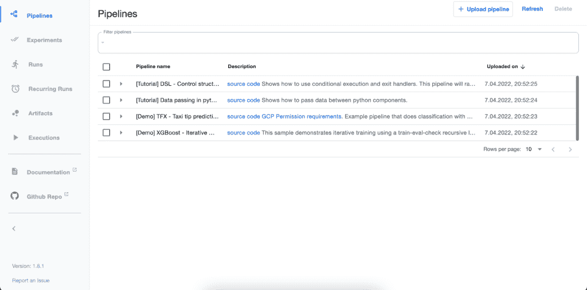
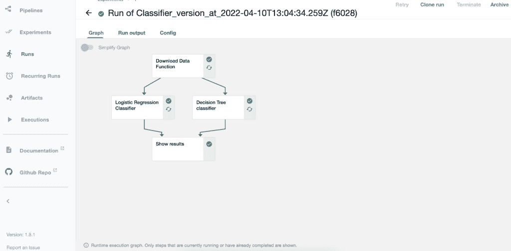
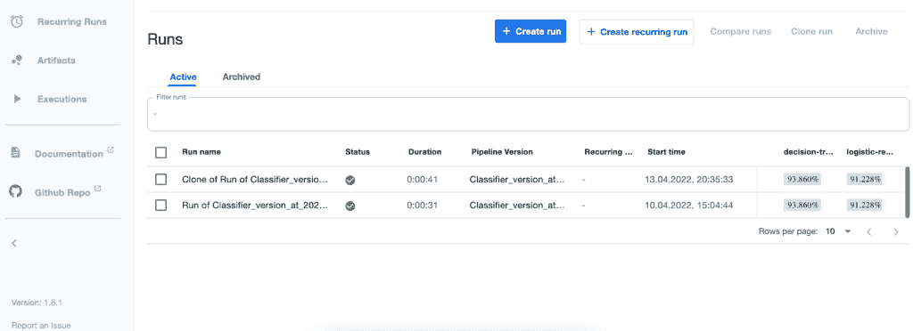

# 库伯流管道中的实验跟踪

> 原文：<https://web.archive.org/web/https://neptune.ai/blog/kubeflow-pipelines-experiment-tracking>

实验跟踪一直是机器学习项目中最受欢迎的主题之一。很难想象一个新项目在没有跟踪每个实验的运行历史、参数和度量的情况下被开发。

虽然一些项目可能会使用更“原始”的解决方案，比如将所有实验元数据存储在电子表格中，但这绝对不是一个好的做法。随着团队的成长和越来越多实验的安排，这将变得非常乏味。

许多成熟的、积极开发的工具可以帮助你的团队跟踪机器学习实验。在本文中，我将介绍和描述其中的一些工具，包括 [TensorBoard](https://web.archive.org/web/20221105175615/https://www.tensorflow.org/tensorboard) 、 [MLFlow](https://web.archive.org/web/20221105175615/https://www.mlflow.org/) 和 [Neptune.ai](/web/20221105175615/https://neptune.ai/) ，特别是在使用 Kubeflow Pipelines 时，这是一个运行在 [Kubernetes](https://web.archive.org/web/20221105175615/https://kubernetes.io/) 上的流行框架。

### 深入挖掘

点击此处了解更多关于实验跟踪的信息。你会发现:

*   实验跟踪如何帮助你改进工作流程，
*   可能的实施方式，
*   可用工具，
*   和用例的例子。

## 什么是库伯流？

为了理解如何跟踪 Kubeflow 管道中的实验，我们需要理解 Kubeflow 是什么。

Kubeflow 是一个先进的、可扩展的平台，用于在 Kubernetes 集群上运行机器学习工作流。它提供的组件涵盖了数据科学项目中经常执行的大多数典型任务，例如:

*   [笔记本](https://web.archive.org/web/20221105175615/https://www.kubeflow.org/docs/components/notebooks/):用于探索性数据分析、原型制作等。,
*   [管道](https://web.archive.org/web/20221105175615/https://www.kubeflow.org/docs/components/pipelines/):用于定义和运行机器学习(或一般的数据)工作流，
*   [Katib](https://web.archive.org/web/20221105175615/https://www.kubeflow.org/docs/components/katib/) :超参数优化和神经架构搜索的内部工具，

它还支持模型服务(使用 KServe、Seldon 和其他框架)、与[功能商店](/web/20221105175615/https://neptune.ai/blog/feature-stores-components-of-a-data-science-factory-guide)的集成，如[盛宴](https://web.archive.org/web/20221105175615/https://feast.dev/)等等。你可以在他们的网站上了解 Kubeflow 组件、架构和可能的集成[。](https://web.archive.org/web/20221105175615/https://www.kubeflow.org/)

Kubeflow 的一个主要特点是它运行在 Kubernetes 上，维护起来可能很有挑战性，但由于它能够按需调度和扩展工作负载，并将模型部署为微服务，因此也可以为机器学习项目带来许多好处。

使用 Kubeflow 可能非常复杂(Kubernetes 也是如此),因为有太多可用的功能，甚至更多的功能发生在幕后(集成这些组件、设置网络等)。).在本文中，我们将只关注 KF 的一个子集，即我将在下一节描述的 Kubeflow 管道。

## 库伯弗洛管道公司

根据 2021 年在 Kubeflow 社区进行的[调查](https://web.archive.org/web/20221105175615/https://blog.kubeflow.org/kubeflow-continues-to-move-to-production),管道是最受欢迎的组件，比笔记本电脑略受欢迎。这是因为这两个模块对于开发阶段的每个机器学习项目都至关重要。

Kubeflow 中的 Pipeline 是单个步骤的图表(如摄取数据、特征工程、培训)。这些[组件](https://web.archive.org/web/20221105175615/https://www.kubeflow.org/docs/components/pipelines/sdk/component-development/)的流程和它们之间共享的数据形成了一个管道，可以从 Kubeflow UI 或以编程方式执行。一个非常相似的定义被其他管道框架使用，比如 Airflow、Prefect 等。

该组件的一个重要特性是管道中的每一步都在一个独立的容器中执行，该容器运行在 [Kubernetes pods](https://web.archive.org/web/20221105175615/https://kubernetes.io/docs/concepts/workloads/pods) 中。这种方法鼓励开发人员编写模块化代码，然后将这些代码组合成一个管道。

由于每个步骤都被定义为一个 [Docker](https://web.archive.org/web/20221105175615/https://neptune.ai/blog/best-practices-docker-for-machine-learning) 映像，因此在保持管道定义和数据流不变的同时，更新或交换单个步骤也变得更加容易。这是成熟的、可扩展的机器学习管道的一个重要特征。

示例管道可以在 [Kubeflow 管道库](https://web.archive.org/web/20221105175615/https://github.com/kubeflow/pipelines/tree/master/samples)内的` *samples* '目录中找到。

*Figure 2\. Standalone deployment of Kubeflow Pipelines | Source: image by the author*

如前所述，管道可以手动、编程和循环运行的方式执行。这可能会导致每天执行数十次流水线操作，这自然需要一个合适的实验跟踪解决方案。

在这篇文章中，我将展示如何使用流行的“实验跟踪”工具来记录管道运行的参数、指标和其他元数据。我们将探索不同的选项，从最简单的解决方案到最先进的解决方案。

*Figure 3\. Graph illustrating finished pipeline run in Kubeflow Pipelines *| Source: image by the author**

## 库伯流管道中的实验跟踪

令人惊讶的是，Kubeflow 原生支持[实验跟踪](https://web.archive.org/web/20221105175615/https://www.kubeflow.org/docs/components/pipelines/sdk/output-viewer/)。虽然这不是最先进的解决方案，但它是现成可用的，这无疑是您应该为您的团队考虑的一个好处。

每次运行可以产生一组指标(例如 F1，Recall ),这些指标将显示在所有管道运行的列表视图中(参见图 4)。)除了[标量指标](https://web.archive.org/web/20221105175615/https://www.kubeflow.org/docs/components/pipelines/sdk/output-viewer/#scalar-metrics)之外，管道还可以输出指标的图形，例如[混淆矩阵](https://web.archive.org/web/20221105175615/https://www.kubeflow.org/docs/components/pipelines/sdk/output-viewer/#confusion-matrix)和 ROC/AUC 曲线。这样的工件也可以与其他度量一起被保存和分析。

这种方法的最大优点是它与 Kubeflow 管道一起提供，并且不需要额外的设置。另一方面，它是一个非常动态的项目，它的文档往往是过时的或混乱的。

本文接下来的部分中描述的其他工具可能会提供更多的特性和灵活性，但是可能需要额外的代码来与您的管道集成，或者可能会增加您的成本。

*Figure 4\. List of completed runs with simple metric history displayed | Source: image by the author*

## Kubeflow 管道中用于实验跟踪的其他工具

虽然使用内置跟踪工具可能是最简单的解决方案，但对于您的用例来说可能不是最方便的。这就是为什么我要介绍一些其他流行的跟踪管道结果的选择。

### 张量板

如果我没记错的话，过去， [TensorBoard](https://web.archive.org/web/20221105175615/https://www.tensorflow.org/tensorboard?hl=en) 是一个简单的可视化工具，用于记录训练历史(损失和其他指标，如 F1、准确度等)。).现在用户还可以记录[图像](https://web.archive.org/web/20221105175615/https://www.tensorflow.org/tensorboard/image_summaries?hl=en#visualizing_multiple_images)和各种图表(直方图、分布图)，以及[模型图](https://web.archive.org/web/20221105175615/https://www.tensorflow.org/tensorboard/graphs?hl=en#conceptual_graph)。

您可能会注意到，这些功能与使用 Kubeflow 可以实现的功能有些相似，但 TensorBoard 可以提供更多功能，例如[模型分析](https://web.archive.org/web/20221105175615/https://www.tensorflow.org/tensorboard/tensorboard_profiling_keras?hl=en)或与用于模型理解的[假设分析工具](https://web.archive.org/web/20221105175615/https://www.tensorflow.org/tensorboard/what_if_tool?hl=en)集成。此外，Kubeflow Pipelines 的[文档显示，与 TensorBoard 的集成非常简单。](https://web.archive.org/web/20221105175615/https://www.kubeflow.org/docs/components/pipelines/sdk/output-viewer/#tensorboard)

不幸的是，TensorBoard 强烈倾向于 TensorFlow/Keras 用户，虽然它仍然可以与其他深度学习框架如 [PyTorch](https://web.archive.org/web/20221105175615/https://pytorch.org/tutorials/recipes/recipes/tensorboard_with_pytorch.html) 一起使用，但它的一些功能可能不可用或难以集成。例如，假设仪表板要求使用 [TFServing](https://web.archive.org/web/20221105175615/https://www.tensorflow.org/tfx/guide/serving) 为模型提供服务，而模型分析器使用引擎盖下的 [TensorFlow Profiler](https://web.archive.org/web/20221105175615/https://www.tensorflow.org/tensorboard/tensorboard_profiling_keras) 。

### 物流跟踪

另一个可以用来跟踪机器学习实验的工具是 MLFlow。更具体地说，因为 MLFlow 现在提供了其他组件(如模型注册、项目管理、[其他](https://web.archive.org/web/20221105175615/https://www.mlflow.org/docs/latest/concepts.html)，负责实验监控的组件是 [MLFlow Tracking](https://web.archive.org/web/20221105175615/https://www.mlflow.org/docs/latest/tracking.html) 。

MLFlow 跟踪的 UI 相当原始和简单，类似于我们在 Kubeflow 管道中看到的。它支持简单的度量记录和可视化，以及存储参数。这个工具的优势来自于与 MLFlow 的其他组件的集成，比如[模型注册表](https://web.archive.org/web/20221105175615/https://www.mlflow.org/docs/latest/model-registry.html)。

MLFlow 可以在 Databricks 上“作为服务”[(采用现收现付](https://web.archive.org/web/20221105175615/https://databricks.com/product/managed-mlflow)[定价](https://web.archive.org/web/20221105175615/https://databricks.com/product/pricing))但大多数用户使用免费的开源版本。人们必须[在本地安装](https://web.archive.org/web/20221105175615/https://www.mlflow.org/docs/latest/quickstart.html#installing-mlflow)它或者在[远程服务器](https://web.archive.org/web/20221105175615/https://www.mlflow.org/docs/latest/quickstart.html#logging-to-a-remote-tracking-server)上才能使用它。但是，对于 Kubeflow 管道，最方便的使用方法是将其部署在 Kubernetes 集群上(可以在本地安装，也可以作为托管服务安装)。

这需要一点努力来:

*   在群集上使用 MLFlow Tracking Server 构建和部署 Docker 映像，
*   配置和部署 Postgres 数据库，
*   类似于 Postgres 部署 [MinIO](https://web.archive.org/web/20221105175615/https://min.io/) (MLFLow 的对象存储)服务。

因此，您需要在 Kubernetes 集群上部署、集成和维护三个独立的微服务，以便能够在内部使用 MLFlow。如果您不允许将任何日志存储在服务器之外，这可能是值得的，但是请记住，在生产中维护这样的服务需要一定的经验和技能。

一些 MLflow 的替代品包括 : [Aim](https://web.archive.org/web/20221105175615/https://aimstack.io/) 和 [guild.ai](https://web.archive.org/web/20221105175615/https://guild.ai/)

### Neptune.ai

[Neptune.ai](/web/20221105175615/https://neptune.ai/) 结合了之前工具的良好特性:

此外，Neptune.ai 还为您的所有 ML 实验提供元数据和工件存储。与 MLFlow 相反，开发人员不必在他们的机器上安装任何服务器或数据库。

Neptune 可以很容易地与 Kubeflow 管道集成，只需在管道代码中使用 API 客户端调用。要做到这一点，用户只需要获得一个 Neptune API 密匙，并把它保存在一个安全的地方，比如 [Kubernetes secret](https://web.archive.org/web/20221105175615/https://kubernetes.io/docs/concepts/configuration/secret/) 。还有一件事是联网——你的集群必须能够使用 API 与 Neptune 通信，以便能够发送实验日志。

每个实验的元数据(参数、指标、图像)存储在 Neptune 中，并使用 [API 客户端](https://web.archive.org/web/20221105175615/https://docs.neptune.ai/getting-started/how-to-add-neptune-to-your-code)从用户的管道中发送出去。这是迄今为止最简单的方法，因为它将大部分逻辑转移到了工具上。用户只需安装 Neptune 客户端(作为 [Python 库](https://web.archive.org/web/20221105175615/https://docs.neptune.ai/getting-started/installation)分发)，实例化它，并发送日志或任何他们想要存储的数据。

Neptune 的另一个优势是用户可以在不同的项目上协作和工作。您可以创建许多项目并控制对它们的访问(分别为每个用户授予读/写权限)。这对于大型公司来说是非常重要的，因为他们会有多个团队在同一个实验跟踪工具上工作。

虽然将实验跟踪的结果存储在“云中”听起来对一些项目来说是一个很大的优势，但其他人可能会担心这种方法的隐私和安全。如果您想将 Neptune 部署在您的私有云中或本地部署，也有这样一个选项。

一些替代 Neptune.ai 的方法包括 : [重量&偏差](https://web.archive.org/web/20221105175615/https://wandb.ai/site)和[彗星](https://web.archive.org/web/20221105175615/https://www.comet.ml/site/)

## 库伯流管道实验跟踪工具的比较

总而言之，现在让我们来看看我已经描述过的工具的比较表。它显示了除实验跟踪之外，与预算、维护工作或组件可用性相关的一些最重要的特性。

Kubeflow

张量板

MLflow

Neptune.ai

托管服务还是内部服务？

Kubeflow:

必须安装在 Kubernetes 集群上

Neptune.ai:

是，针对个人用户，不同的 [定价](/web/20221105175615/https://neptune.ai/pricing) 可供团队选择，视需要而定

TensorBoard:

仅当内部部署时

MLflow:

仅当内部部署时

Neptune.ai:

仅当内部部署时

其他特征(除了实验跟踪)

TensorBoard:

仅在 TensorFlow 生态系统内(如 [【剖析】](https://web.archive.org/web/20221105175615/https://www.tensorflow.org/tensorboard/tensorboard_profiling_keras) )

它提供访问控制吗？

Kubeflow:

可以有单独的名称空间

MLflow:

仅在托管版本中(由于数据块)

## 结论

有许多工具可以提供实验跟踪功能，我只描述了其中的一部分。然而，我希望我指出了这些工具的主要“组”:一些是现成可用的，但是是有限的，另一些必须与数据库一起部署在用户的机器上，还有一组工具是可用的托管服务，只需要很少的努力就可以将它们与您的代码集成在一起。

用户应考虑以下因素:

*   **公司的安全政策**:如果你的公司对他们的数据非常严格，你可能会更喜欢可以完全离线托管(在你的环境中)的工具，比如 TensorBoard 或者 MLFlow，
*   **预算**:一些工具是开源的，另一些工具的定价取决于项目、实验或用户的数量等因素。这些在做选择的时候也要考虑进去。
*   **维护工具的能力**:Neptune 或 Weights&bias 等工具的明显优势是使用它们只需最少的努力，用户基本上没有什么需要维护的(除了他们的管道)。例如，如果您决定选择 MLFlow，您将需要在您的团队中负责设置部署、数据库和其他东西，有时团队可能缺乏有效完成这些工作的技能。
*   **对其他功能的需求**:在机器学习项目中，你很少需要一个实验跟踪工具。迟早您可能会发现对模型注册中心、数据版本控制或其他功能的需求。最好是选择一个提供这些特性的提供商，而不是同时使用几十种不同的工具。

### 马提乌斯

deepsense.ai 高级 MLOps 工程师

* * *

**阅读下一篇**

## 最佳 MLOps 工具以及如何评估它们

12 分钟阅读| Jakub Czakon |年 8 月 25 日更新

在我们的一篇文章中——[机器学习团队实际使用的最好的工具、库、框架和方法——我们从 41 家 ML 初创公司学到的东西](https://web.archive.org/web/20221105175615/https://neptune.ai/blog/tools-libraries-frameworks-methodologies-ml-startups-roundup)——Acerta 的 CTO Jean-Christophe Petkovich 解释了他们的 ML 团队如何接近 MLOps。

**据他所说，一个完整的 MLOps 系统有几个要素:**

*   您需要能够构建包含预处理数据和生成结果所需的所有信息的模型工件。
*   一旦您能够构建模型工件，您必须能够跟踪构建它们的代码，以及它们被训练和测试的数据。
*   您需要跟踪所有这三样东西，模型、它们的代码和它们的数据，是如何关联的。
*   一旦您可以跟踪所有这些内容，您还可以将它们标记为准备就绪，进行生产，并通过 CI/CD 流程运行它们。
*   最后，为了在该过程的最后实际部署它们，您需要某种方法来基于该模型工件旋转服务。

这是对如何在公司中成功实施 MLOps 的高度概括。但是理解高层需要什么只是拼图的一部分。另一个是采用或创建适当的工具来完成工作。

这就是为什么我们编制了一份**最佳 MLOps 工具**的清单。我们将它们分为六类，以便您可以为您的团队和业务选择合适的工具。让我们开始吧！

[Continue reading ->](/web/20221105175615/https://neptune.ai/blog/best-mlops-tools)

* * *