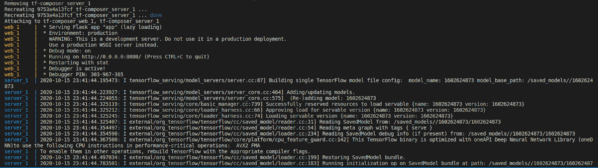
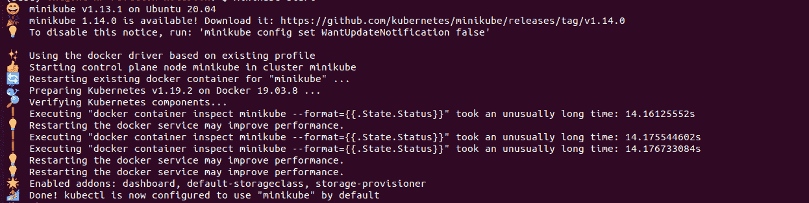
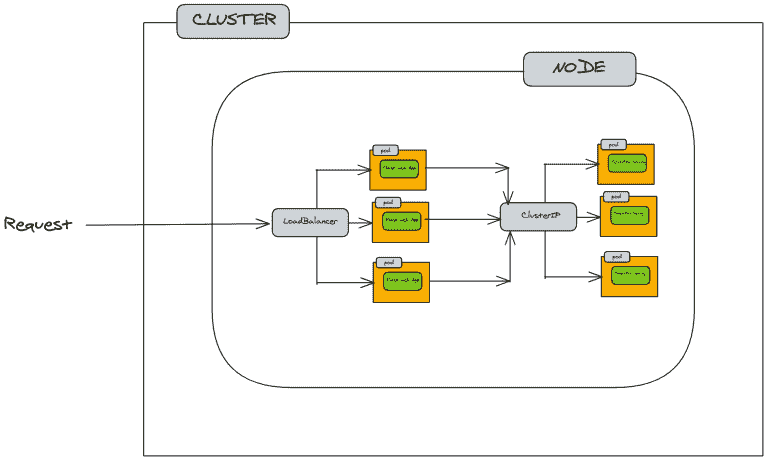
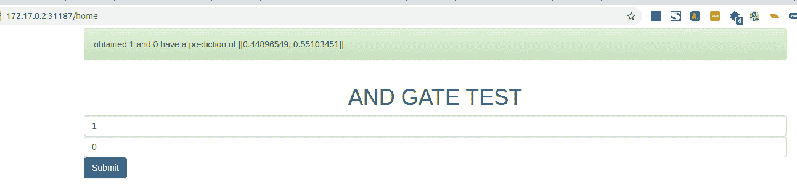

# Kubernetes vs Docker:作为机器学习工程师你应该知道什么

> 原文：<https://web.archive.org/web/https://neptune.ai/blog/kubernetes-vs-docker-for-machine-learning-engineer>

今年早些时候(2020 年)，我决定从数据科学完全转向机器学习的工程部分。我想体验一种更高效、更可扩展的方式来部署机器学习模型，将我的模型从我的应用程序中分离出来，并正确地对它们进行版本控制。

通常，在训练完模型后，我主要做的是将模型导入 flask 应用程序，然后在调用模型的 API 端点时执行推理。嗯，当我试图打包我的应用程序并部署到谷歌云或任何其他平台时，我会使用 docker，但我认为还有更多。

我开始[深入 TensorFlow 服务](/web/20221206024243/https://neptune.ai/blog/how-to-serve-machine-learning-models-with-tensorflow-serving-and-docker)。TensorFlow extended 和 [Kubeflow](/web/20221206024243/https://neptune.ai/vs/kubeflow) (Kubernetes 使机器学习项目变得更容易)。沿着这条路线，我发现我需要了解更多(也许只是一点点)部署、编排和扩展机器学习应用程序所需的 Kubernetes。

旅程和好奇心导致了这篇文章。因此，如果你和我一样，准备升级你的游戏并添加一个工具成为独角兽数据科学家，正如 Elle O'Brien 在这篇文章中所描述的，那么这篇文章就是为你准备的。

> “…太难了，这位罕见的数据科学家既能开发高质量的软件，又能扮演工程师的角色，被称为*独角兽*！”艾尔·奥布莱恩

在本文中，我们还将遵循一种基于项目的方法，这将使您有可能将所示的想法和代码直接移植到您的机器学习项目中。

总的来说，我们将看到如何消除在遵循常规方法时出现的一些困难，例如:

*   无法将模型服务与应用程序分开
*   回滚更新的困难
*   轻松推出新更新的困难
*   当用户流量增加时，应用程序难以扩展
*   对模型和应用程序进行版本控制的困难。

为了消除上述困难，我们需要实现以下一些目标:

*   在 web 应用中集成 TensorFlow 服务模型
*   使用 docker-compose 管理 web 应用程序和 Tensorflow 服务
*   构建 docker 映像并将其推送到 Docker-hub
*   介绍 Kubernetes
*   使用 Kubernetes 提供 Tensorflow web 应用程序。

**先决条件**

*   Tensorflow 中的训练模型
*   码头工人，至少是基层
*   tensorflow 发球(如果不是，这里快速介绍一下 [TensorFlow 发球](/web/20221206024243/https://neptune.ai/blog/how-to-serve-machine-learning-models-with-tensorflow-serving-and-docker)

**注**:您可以在这里获得[商品的编码。](https://web.archive.org/web/20221206024243/https://github.com/steveoni/tensorflow-serving-docker-k8s)

让我们开始吧。

## 构建 ML 模型

在本文中，我们将创建一个简单的 ML 模型，用于巩固将要介绍的概念。

该模型是一个 AND 逻辑门模型，由于本文的主要重点既不是如何创建模型，也不是如何训练模型，因此这一部分将较少解释。

让我们创建一个名为`model.py`的文件，并输入下面的代码:

```py
Import TensorFlow as tf

data=tf.constant([[1,1],[0,0],[2,0],[2,1],[3,0],[0,4],[5,6],[0,10]])
label = tf.constant([1,0,0,1,0,0,1,0])

model = tf.keras.Sequential(
    [
        tf.keras.Input(shape=(2,)),
        tf.keras.layers.Dense(20,activation="relu"),
        tf.keras.layers.Dense(2,activation="softmax")
    ]
)

print(model.summary())

model.compile(optimizer='adam',
              loss=tf.keras.losses.BinaryCrossentropy(),
              metrics=['accuracy'])

model.fit(data,label,batch_size=2, epochs=5)

```

在创建和训练模型后，需要以一种可以使用 TensorFlow 服务的方式保存模型，因此我们不会只保存模型权重。

```py
Import time

Save_time = int(time.time()) 
Path  = f’./saved_models/{saved_time}’ 
model.save(path, save_format=’tf’)

```

在上面的代码中，我们注入了使用时间模块进行版本控制的思想。获取保存模型时的时间戳，用于在`saved_models/`中创建一个内部文件夹，然后将模型保存到该文件夹中。

创建一些 Tensorflow 服务所需的文件。

现在我们的模型已经准备好，可以服务了。

## 码头工人必备

在本节中，我们将讨论将我们的机器学习项目投入生产所需的最基本的 docker API，并了解如何使用 docker-compose 编排我们的应用程序。

### **将 web 应用与 Tensorflow 服务图像相结合**

本节展示了如何将 tensorflow 服务注入 flask web 应用程序。它展示了如何在 flask 中调用 tensorflow 服务端点 API。

首先，让我们服务于我们的 AND 逻辑门模型，使用 Tensorflow 服务于 docker 映像。第一步是从 docker-hub 提取 tensorflow 服务图像。

**注:**Neptune . ai 上有一篇文章，详细解释了 Tensorflow 服务的[。](/web/20221206024243/https://neptune.ai/blog/how-to-serve-machine-learning-models-with-tensorflow-serving-and-docker)

```py
docker pull tensorflow/serving
```

现在让我们运行张量流/服务图像:

```py
docker run -p 8501:8501 --mount type=bind,source=path/to/directory/saved_models,target=/saved_models/1602624873 -e MODEL_NAME=1602624873 -e MODEL_BASE_PATH=/saved_models -t tensorflow/serving

```

上面的命令启动 tensorflow/serving 映像，首先使用以下命令将模型从我们的本地目录挂载到 Docker 容器中的文件路径:

```py
---mount type=bind,source=path/to/directory/saved_models,target=/saved_models/1602624873
```

因此，为 AND 逻辑门模型创建`saved_models`的`source`路径被绑定到 docker 容器中同名的`target`路径。

运行映像时，会创建两个端点，如下图所示。其中一个端点是为 GRPC 创建的，但是我们将关注第二个端点，即 REST API 端点。

为了访问 docker 环境外部的 REST API 端点，我们通过在上面的命令中使用`-p 8501:8501`来公开端口。

让我们测试一下端点，看看它是如何工作的。我们将首先使用 POSTMAN 来测试 REST API。

输入被传递给模型，通过 rest API 提供服务。在 POSTMAN 中，我们使用这种格式“{"instances": [[1，0]]}”指定 JSON 输入，并获得 JSON 格式的响应，这是模型输出。

这表明我们的服务模型工作正常。现在是将 Tensorflow 服务 API 端点与我们的 web 应用程序集成的时候了。

但是在我们开始之前，不要忘记镜像仍在运行，以防我们想要停止镜像运行，下面是执行此操作的代码:

```py
docker ps
```

上面的命令列出了正在运行的图像。


复制要停止的图像的容器 id:

```py
docker stop e74fe1336768

```

该命令停止运行张量流/服务图像。

现在让我们创建 Web 界面和服务器来呈现页面，因为我们的模型现在可以使用 tensorflow 服务。

模型 web 界面将是一个有两个输入和一个提交按钮的表单，如下图所示:

以下是位于`index.html`的 UI 代码:

```py
<html>
    <head>
        <link rel="stylesheet" type="text/css" href="../static/css/bootstrap-theme.min.css" />
        <link rel="stylesheet" type="text/css" href="../static/css/bootstrap.min.css" />
        <link rel="stylesheet" type="text/css" href="../static/css/responsive.bootstrap.min.css" />
        <link rel="stylesheet" type="text/css" href="../static/css/style.css" />
    </head>
    <body>
        <div class="container">
            
            <div class="row">
                <h1 class="text-center">AND GATE TEST</h1>
            </div>

                    <form action="{{url_for('home')}}" method="post">
                        <div class="form-row">
                            <div class="col">
                              <input type="text" class="form-control" name="inp1" placeholder="input 1">
                            </div>
                            <div class="col">
                              <input type="text" class="form-control" name="inp2" placeholder="input 2">
                            </div>
                            <div class="col">
                                <button type="submit" class="btn btn-primary ml-4">Submit</button>
                            </div>

                          </div>
                    </form>
        </div>
    </body>
</html>

```

现在我们已经创建了用户界面，让我们创建 flask 应用程序来呈现用户界面，并处理对 TensorFlow 服务 API 的请求。

创建一个文件名 app.py，并输入下面的代码:

```py
from flask import Flask, render_template, flash, request
import requests
from os import environ

app = Flask(__name__)

```

上面的代码导入了必要的模块，如 Flask、request 和 os 模块。此外，上面的代码初始化 flask 应用程序。

添加到 app.py 的下一行代码是管理和调用 TensorFlow 服务 API 的代码。

```py
def tfserving_request(req_input, model_name): 
    url = f"http://localhost:8501/v1/models/{model_name}:predict" 
    input_request = {"instances": [req_input]} 
    response = requests.post(url=url, json=input_request) 
    return response

```

基于注释编号:

*   # 1`tfserving_request`接受两个输入，一个名为`re_input`的请求输入和模型的名称
*   #2 定义 API 端点基础
*   #3 将输入结构化为 TensorFlow 服务 API 端点接受的格式
*   #4 通过传入请求输入向 API 端点发出请求

下一步是添加将用于在浏览器中呈现 Web 界面的路由:

```py
@app.route("/home",methods=["GET","POST"]) #1
def home():

    if request.method == "POST": 

        inp1 = int(request.form["inp1"]) 
        inp2 = int(request.form["inp2"])

        response = tfserving_request([inp1,inp2], "1602624873") 

        resp = response.json() 
        flash(f"obtained {inp1} and {inp2} have a prediction of {resp['predictions']}", 'success') 

    return render_template("index.html") 

```

*   #1 我们定义了加载呈现 html has `/home '的路由，我们还定义了路由接受的请求方法为` GET '和` POST '
*   #2 检查所做的请求是否是 POST 请求
*   #3 如果 post 请求，我们使用` request.form["inp1"]`记住` inp1 '是输入名。
*   #4 调用“tfserving_request”函数，并将模型名称旁边的表单输入传递给该函数。
*   #5 从 TensorFlow 服务返回的响应被转换为 JSON
*   #6 使用包含概率得分的' resp['predictions']获得预测。“flash”功能用于将结果作为消息打印出来
*   #7 从` index.html `呈现用户界面

最后，让我们添加代码行来启动 flask 服务器:

```py
if __name__ == "__main__":
    app.run(debug=True, host='0.0.0.0', port=int(environ.get('PORT', 8080)))

```

当我们运行脚本时，上面的代码使主机成为端口 8080 的服务器。

让我们使用以下代码运行 app.py:

```py
python run app.py

```

这将像这样启动服务器:

现在服务器启动了，我们可以通过[http://0 . 0 . 0 . 0:8080/home&nbsp](https://web.archive.org/web/20221206024243/http://0.0.0.0:8080/home&nbsp)查看 web app

如果我们访问该链接，我们将看到网络界面:

如果我们在渲染页面的文本框中键入输入内容并单击“提交”按钮，如果 TensorFlow 服务 docker 图像关闭，我们会得到一个错误页面。因此，我们需要启动张量流服务图像。

```py
docker run -p 8501:8501 --mount type=bind,source=path/to/directory/saved_models,target=/saved_models/1602624873 -e MODEL_NAME=1602624873 -e MODEL_BASE_PATH=/saved_models -t tensorflow/serving
```

一旦我们运行了上面的命令，我们就可以返回到 web 界面并键入我们的输入。我们将在输入字段中输入“1”和“0 ”,然后按提交按钮，我们将得到如下响应，如下图所示:

响应显示在页面顶部，显示服务器收到的输入和预测输出。

既然这样做效果很好，让我们创建一个 docker 映像来管理 flask 应用程序。在包含 flask 应用程序的同一个目录中，我们创建一个 Docker 文件:

```py
FROM python:3.8-slim //1

ENV PYTHONUNBUFFER ED True //2
ADD requirements.txt requirements.txt //3
RUN pip install -r requirements.txt //4
ENV APP_HOME /app //5
WORKDIR $APP_HOME //6

COPY . ./    //7 
CMD ["python","app.py"] //8 
```

基于注释编号的代码解释:

1.  获取 3.8 版的轻量级 python 映像-slim
2.  防止应用程序崩溃而不打印相关消息
3.  将包含要安装的软件包列表的 requirements.txt 文件添加到同名的虚拟文件中
4.  安装 requirements.txt 中的所有包
5.  在 docker 中创建一个目录，并将其分配给环境变量
6.  根据 5 中创建的目录指定工作目录
7.  将 flask app 目录中的所有文件复制到工作目录中
8.  创建映像后运行 flask 应用程序的命令

在我们运行 docker 文件之前，让我们创建`requirements.txt`，一个简单的方法是通过下面的命令:

```py
Pip freeze > requirements.txt

```

这将创建 requirements.txt 并在 python 环境中的包安装中添加必要包的基础

但是对于这个项目，唯一需要的包是`Flask`和`requests`包。

创建 requirements.txt 后，让我们为 flask 应用程序创建一个图像:

```py
docker build -t flaskweb .
```

如果我们运行上面的代码，在成功创建图像的情况下，我们应该会获得下面的输出。

既然映像已成功创建，让我们运行映像:

```py
docker run -p 8080:8080 -e PORT=8080  -t flaskweb
```

这将启动 flask 服务器，如前所述。

让我们访问前面提到的相同链接，以便查看 web 界面。键入之前的输入，让我们看看输出的是什么:

正在输出一个错误，该错误是由于`flaskweb`可以与外部主机通信。因此，为了解决这个问题，我们想到了 Docker-compose。

### **使用 Docker compose 管理服务**

Docker-compose 使我们有机会用一个文件和命令创建两个 Docker 服务(TensorFlow serving 和 flaskweb ),并使我们能够管理这两个服务。

**注意:**要在不同的操作系统上安装 docker-compose，请访问此[链接](https://web.archive.org/web/20221206024243/https://docs.docker.com/compose/install/)。

为了启用 docker-compose，让我们将为我们的模型创建的`flask` app 目录和`saved_models`文件夹放在同一个目录中。然后在 flask app 目录下创建一个名为`Dockerfile.dev`的文件，然后将`Dockerfile`中的所有内容复制到`Dockerfile.dev`中。

复制后，`Dockerfile.dev`'将看起来像这样:

```py
FROM python:3.8-slim

ENV PYTHONUNBUFFERED True
ADD requirements.txt requirements.txt RUN pip install -r requirements.txt ENV APP_HOME /app
WORKDIR $APP_HOME COPY . ./ 
CMD ["python","app.py"] 
```

确保目录的文件系统如下所示:

/主目录
-/flask _ app
-/saved _ models

创建完成后，让我们创建一个名为`docker-compose.yml`的 YAML 文件来定义 TensorFlow 服务和 flask web 服务。

```py
version: "3.8"
services:
 server:
 image: tensorflow/serving
 volumes:
 - ./saved_models:/saved_models/1602624873
 ports:
 - '8501:8501'
 environment:
 MODEL_NAME: 1602624873
 MODEL_BASE_PATH: /saved_models/

 web:
 image: flaskweb
 build:
 context: ./flask_app
 dockerfile: Dockerfile.dev
 ports:
 - '8080:8080'

```

在`docker-compose.yml`中，我们使用`version`指定 docker-compose 版本，我们还定义了`service`对象中的服务类型。我们将这两个服务命名为`server`和`web`。

在`server`服务对象中，我们指定要从中提取的图像。然后，我们通过将模型从`./saved_models`复制到 Docker 容器中名为`/saved_models/1602624873`的目录中来定义`volumes`。然后，我们为服务指定端口，就像我们在启动普通 docker 映像时所做的那样。同样，所需的环境变量在`environment`对象中指定。

如您所见，相同的过程类似于我们在前面部分中描述的运行 docker 映像的方式。

同样对于`web`服务对象，我们指定图像的名称。然后我们创建一个`build`对象，我们定义如何构建图像。我们通过指向`flask_app`目录来定义上下文。

我们告诉 docker-compose 使用名为`Dockerfile.dev`的目录中的`dockerfile`。我们定义端口。

为了启动服务，我们在包含`docker-compose.yml`的目录中运行以下命令。

```py
docker-compose up

```

这将启动两个服务，如下所示:



TensorFlow 服务和 flaskweb 服务正在运行，如果我们访问 URL http:localhost:8080/home，它将加载 web 界面，但是如果我们键入我们的输入并单击 submit，我们仍然会获得相同的错误。

为了解决这个错误，我们没有在 app.py 的`tfserving_request`函数中使用 TensorFlow 服务 API 端点 define 中的`localhost`，而是用名为`server`的 TensorFlow 服务的名称来替换它:

```py

def tfserving_request(req_input, model_name):
    url = f"http://server:8501/v1/models/{model_name}:predict"
    input_request = {"instances": [req_input]}
    response = requests.post(url=url, json=input_request)
    return response

```

要查看更改，我们需要使用以下命令停止服务运行:

```py
docker-compose stop
```

一旦两项服务都停止，我们将再次启动它:

```py
docker -compose up

```

完成后，我们可以进入 web 界面，键入输入内容，然后单击“提交”。应用程序运行良好。

要了解更多关于 docker-compose 的信息，请访问此[链接](https://web.archive.org/web/20221206024243/https://docs.docker.com/compose/)。

### **构建 docker 映像并将其推送到 docker hub**

为了将我们的 docker 图像与 Kubernetes 集成(这将在下一节讨论)，我们需要将我们的图像推送到 docker hub。

要构建我们的图像并将其推送到 docker-hub，首先，访问 [docker-hub](https://web.archive.org/web/20221206024243/https://hub.docker.com/) ，然后创建一个帐户。创建帐户后。我们需要从系统终端登录 docker hub。

出于安全目的，将您的 docker 密码存储在一个文本文件中，给它取任意名称，我将自己的命名为“my_password.txt ”,然后运行下面的命令:

```py
$ cat ~/my_password.txt | docker login --username steveoni --password-stdin

```

在上面的命令中，我使用` ~/`是因为` my_password.txt `,因此 docker 登录从。使用标准输入。

如果登录成功，您将看到一条消息，显示登录成功。

让我们为 flask 应用程序创建一个图像，然后推送到 docker hub:

```py
$ docker build -t steveoni/tfweb:1.0

```

这将创建一个图像，包含标签 1.1，它也是图像的版本。名称“steveoni/tfweb”指定您的“用户名/图像名称”。

映像准备就绪后，我们现在可以推送至 Docker hub:

```py
$ docker push steveoni/tfweb:1.0

```

这将图像推送到 docker hub，如下所示:

我们已经完成了 flask 应用程序部分，现在让我们做 tensorflow 服务部分。请记住，我们没有为 tensorflow 服务创建 docker 文件，但我们使用了 tensor flow/服务图像。

我们需要建立在 tensor flow/服务形象之上。让我们在`/saved_models`所在的目录中创建一个 docker 文件。

```py
From tensorflow/serving

ENV APP_HOME /saved_models/1602624873
WORKDIR $APP_HOME
COPY ./saved_models ./ 
```

上面的 docker 文件中使用的方法与创建以前的 docker 映像时使用的方法相同。

在构建和推送 docker hub 之前，让我们为本地测试构建映像。

```py
$ docker build -t tfs .

```

让我们测试一下图像是否工作正常:

```py
$docker run -p 8501:8501 -e MODEL_NAME=1602624873 -e MODEL_BASE_PATH=/saved_models -t tfs

```

这将启动 tensorflow 服务服务器。

现在，我们可以正式创建映像，然后推送:

```py
$ docker build -t steveoni/tfupdate:1.1
$ docker push steveoni/tfupdate:1.1

```

下图显示了在没有检查 docker-hub 的情况下成功推送的情况:

## 什么是 Kubernetes 简介

为什么是 Kubernetes？假设您已经将 docker 应用程序部署到云服务，一切都很好，运行正常。但是过了一段时间，您的应用程序现在每秒钟有数千个用户发出请求。

不幸的是，由于每秒发出请求的用户数量，你的应用程序不断崩溃，你无法避免崩溃，用户不断抱怨。

为了解决这个问题，你可以制作应用程序的多个副本，并使其始终可用(如果一个出现故障，另一个可以出现)。另一个要问的问题是，如果所有副本都宕机了，您如何缩减规模？如何设置网络端点？谁来检查每次的状态？您如何以一种相互通信的方式管理副本？

由于上述问题，需要 Kubernetes 来解决上述情况。

> “这是一个容器编排平台，由几个组件组成，它不知疲倦地工作，以保持您的服务器处于您想要的状态。”法尔汉·哈辛·乔杜里。

### **非立方簇**

对于本文，我们将在本地机器上运行 kubernetes，而不是云服务。为了让 kubernetes 在我们的系统上运行，我们需要安装两套程序

首先，我们需要安装 Minikube 这允许我们在本地计算机上运行单节点 Kubernetes 集群。然后我们安装 Kubernetes 命令行工具 Kubectl。

要安装这两个程序，请访问下面的链接:

**注意:**在本文中，我将总结一些与本文中使用的项目相关的想法。要了解 Kubernetes 的概况和实际知识，请访问 Farhan Hasin Chowdhury 的这篇[文章](https://web.archive.org/web/20221206024243/https://www.freecodecamp.org/news/the-kubernetes-handbook/#introduction-to-container-orchestration-and-kubernetes)。我将用他的一些插图来介绍 kubernetes。

安装完成后，您可以使用下面的命令测试程序:

```py
$ minikube version
$ kubectl version

```

在我们开始使用 minikube 之前，让我们为它设置一个 hypervisor 驱动程序。在本文中，我们将使用 Docker 作为虚拟机管理程序驱动器。

**注意:** Hypervisor 作为一个抽象层，将虚拟机与系统硬件分离开来。

以下命令有助于为 minikube 设置虚拟机管理程序:

```py
$ minikube config set driver docker
```

完成后，我们可以开始 minikube:

```py
$ minikube start
```

在终端中，运行上面的命令后，我们将看到下面的输入。尽管有时完成整个加载过程可能需要一些时间。



在我们开始使用我们刚刚开始的 minikube 程序之前，让我们对 Kubernetes 的一些术语和概念有一个总体的了解。

Kubernetes 包含我们所说的节点。节点可以是分配特定任务虚拟机或物理机。一组通过共享网络相互通信的机器称为集群。

因为在这个项目中我们使用了 Minikube。我们只能访问一台虚拟机作为我们的服务器。因此，我们称之为单节点 Kubernetes 集群。

你可以把它想象成，你不需要访问多台可以用作服务器的计算机，你只需要访问一台，也就是你的个人计算机，它可以作为服务器来承载你的应用程序。

下图显示了 minikube 的概况。

通常，库贝内石含有两种成分；

*   控制平面组件
*   节点平面组件

控制平面组件负责根据可用资源向节点分配和调度任务。它们还负责保存节点的状态，并验证对节点的请求。请记住，节点是一个虚拟机。

节点平面组件负责维护每个节点服务器上的网络规则。它们还负责维护，并在控制面板和群集中的每个节点之间提供网关。

根据 Kubernetes 文档，每个节点包含我们称之为**的 pod**

“Pod 是您可以在 Kubernetes 中创建和管理的最小可部署计算单元”。

该图显示了一个集群的概况。上面的集群是一个单节点集群，因为我们使用的是 minikube。

一个 pod 容纳了我们的应用程序容器。即使一个 pod 可以包含多个容器，也建议为其分配一个 Pod。使用更高的对象来管理 Pod 也是明智的。这个更高的对象有能力在任何时候创建和删除 pod，因此它们帮助管理 pod。我们将在本节稍后讨论这些更高级的对象。

一个节点可以包含多个单元，每个单元执行相同的功能。在我们称之为**服务的帮助下，**我们可以将所有这些 pod 合并到一个节点中作为一个实体。服务使我们能够定义如何访问 pod。

有了这些关于 Kubernetes 的小知识，我们继续手头的项目，并解释一些其他需要的概念。

## 使用 Kubernetes 提供 ML 驱动的 web 应用程序

本节展示了如何使用 kubernetes 来编排您的应用程序。它展示了创建 pod 和负载平衡器的不同方法。它还引入了“发展”和“集群”的概念

### **创建 pod 和负载平衡器的显式方法**

首先，让我们使用我们在前面几节中创建的 tensorflow 服务图像来测试服务、pod 等概念。

记住我们已经开始了 minikube，现在让我们使用 tensorflow 服务图像创建我们的第一个 pod。

```py
$ kubectl run tf-kube --image=steveoni/tfupdate:1.1 --port=8501 --env=”MODEL_NAME=1602624873”  --env="MODEL_BASE_PATH=/saved_models/"

```

上面的代码类似于上一节中运行 docker 映像时使用的相同命令。命令中的`tf-kube`是我们试图创建的 pod 的名称，使用`--env`定义环境变量。

然后，我们获得一条消息，表明 pod 已经创建。要查看已创建的 pod 列表，我们可以使用如下所示的`get pods`命令:

```py
$ kubectl get pods
```

这是创建的窗格列表:

你可以看到我创建的 pod 列表，有些是三天前创建的。我忘记删除它们了。在 pod 列表中，我们可以看到我们刚刚创建的 pod，其状态为正在运行。

要删除任何 pod，我们只需运行以下命令:

```py
$ kubectl delete pod-name

```

我们的`tf-kube` pod 正在运行，但我们无法从集群外部访问它。为了访问集群外部的 pod，让我们创建一个名为 **LoadBalancer 的服务。**该服务有助于将 pod 暴露在集群之外。

```py
$ kubectl expose pod tf-kube --type=LoadBalancer --port=8501

```

上面的命令创建了名为 tf-kube 的负载平衡器服务:

一旦负载平衡器服务开始读取，我们就可以使用 minikube 启动“tf-kube”负载平衡器服务。

```py
$ minikube service tf-kube

```

上面的命令启动了如上图所示的服务。它还将“目标端口”映射到图像中显示的“URL”。因此，我们将访问 URL“http://172 . 17 . 0 . 2:30116 ”,而不是访问“http://localhost:8501”来访问 TensorFlow 服务 API 端点。

让我们使用 Postman 测试 TensorFlow 服务 API 端点，如 Tensorflow 服务部分所示。

我们可以看到 API 端点工作正常。现在，我们已经能够创建我们的第一个 pod 和第一个服务。

要删除创建的服务:

```py
$ kubectl delete service tf-kube
```

我们用来创建第一个 pod 和服务的方法并不是创建 pod 和服务的理想方式。

在下一小节中，我们将展示如何以一种更具可再现性和可管理性的方式创建 pod。

### **创建 pod 和负载平衡器的声明性方法**

让我们采用一种更具声明性的方法，就像我们在 docker-compose 部分所做的那样。这种方法使我们更容易配置我们的 Kubernetes。也让其他人更容易设置。

首先，让我们创建一个名为“tf-kube-pod.yml”的 YAML 文件，并输入以下代码:

```py
apiVersion: v1
kind: Pod
metadata:
 name: tf-kube-pod
 labels:
	component: server
spec:
 containers:
	- name: tf-kube
  	image: steveoni/tfupdate:1.1
  	ports:
    	- containerPort: 8501
  	env:
    	- name: MODEL_NAME
      	value: "1602624873"
    	- name: MODEL_BASE_PATH
      	value: /saved_models/
```

在 YAML 文件中，我们定义了以下内容

*   定义了我们想要使用的 Kubernetes API 的版本
*   指定我们想要创建的对象的`kind`,即 Pod
*   我们定义了`metadata`,通过给`component`属性赋值`server`,我们给 pod 一个名称和一个`label`标签
*   然后我们定义`spec`,它包含了我们想要的 pod 的状态。我们定义了要使用的容器映像，即`steveoni/tfupdate:1.1`，我们还定义了容器端口`8501`
*   同样在`spec.containers`中，我们在`env`中指定环境变量，包含它们的`name`和`value`。

现在让我们使用“tf-kube-pod.yml”文件创建一个 pod:

```py
$ kubectl apply -f tf-kube-pod.yml
```

这将创建 pod，您可以使用`kubectl get pods`查看 pod 的创建。

现在，让我们为刚刚创建的 pod 创建负载平衡器服务配置文件。创建一个名为“tf-kube-load-balancer.yml”的文件。

```py
apiVersion: v1
kind: Service
metadata:
 name: tf-kube-load-balancer-service
spec:
 type: LoadBalancer
 ports:
	- port: 8501
  	targetPort: 8501
 selector:
	component: server

```

和前一个文件一样，这次我们将`kind`对象指定为`service`，并且在`spec`中我们将类型定义为`LoadBalancer`。在`spec.ports`中，我们定义了主机 pod 的端口和作为`pod tf-kube-pod`端口的`targetport`。在`spec.selector`中，我们将负载平衡器指向`server`组件，这是上面创建的`tf-kube-pod` pod 的标签。

然后，我们使用下面的命令从“tf-kube-load-balancer.yml”创建服务:

```py
$ kubectl apply -f tf-kube-load-balancer.yml
```

我们还可以检查使用`kubectl get services`创建的服务列表。要启动服务运行，请执行以下操作:

```py
$ minikube service tf-kube-load-balancer.yml
```

这将启动服务并打开 web 浏览器。

整个过程按预期进行。但是不要忘记，在本节开始描述 pod 时，我们提到了用更高的对象来管理 Pod 是很好的；它们具有创建和删除 Pod 的能力。我们将在下一节讨论这个问题。

### 使用多容器应用程序

我们已经能够为我们的 TensorFlow 服务创建一个 Pod，它只是一个容器。别忘了，我们的主要目标是将 TensorFlow 服务融入到 web 应用中。

正如我们在 docker-compose 部分看到的，我们能够创建一个程序来管理 Tensroflow 服务和 flask-web 应用程序服务。我们将在这一部分做同样的事情。

在本节中，我们将使用名为 **Deployment** 的更高级对象，还将向我们介绍 **ClusterIP。**

**部署**:部署是一个控制器，它让我们能够轻松地创建一个 Pod 的多个副本，也让我们能够轻松地推出和回滚更新。

> “在 Kubernetes 中，控制器是监控集群状态的控制回路，然后根据需要做出或请求更改。每个控制器都试图将当前的群集状态移至更接近所需的状态。控制回路是调节系统状态的非终止回路。
> –Kubernetes[文档](https://web.archive.org/web/20221206024243/https://kubernetes.io/docs/concepts/architecture/controller/)

ClusterIP: ClusterIP 是另一种类型的服务，就像负载平衡器一样。与 LoadBalancer 服务相反，clusterIP 只公开集群中的一个应用程序。也就是说，它防止应用程序被群集外的人访问。

在 Kubernetes 中部署我们的 Web 应用程序时，我们将使用刚刚定义的两个术语。



*App architecture*

上图展示了在 Kubernetes 中部署的应用架构。我们将创建 Flask Web 应用程序和 Tensorflow 服务的三个副本。

我们不想在集群之外公开我们的 Tensorflow 服务，正如我们在上一节创建 pod 时所做的那样，因此我们将为 Tensorflow 服务创建一个 ClusterIP。

为 Flask web 应用程序创建了一个负载平衡器，因为我们只想向用户公开应用程序。

为了实现这个架构，让我们为 Flask Web 应用程序创建一个部署配置文件和一个负载平衡器配置文件。在创建时，我们将使用部署到 docker hub 的 flask web 应用程序映像；` steveoni/tfweb:1.0 '

让我们创建一个名为“k8s”的文件夹，你可以给它取任何名字。在这个文件中，我们将创建所有需要的配置文件。

在文件夹中创建一个文件名“tf-web-dev.yml ”,在文件中输入以下文本:

```py
apiVersion: apps/v1
kind: Deployment
metadata:
 name: tfweb-dev
spec:
 replicas: 3
 selector:
 matchLabels:
 component: web
 template:
 metadata:
 labels:
 component: web
 spec:
 containers:
 - name: web
 image: steveoni/tfweb:1.0
 ports:
 - containerPort: 8080

```

像我们创建的所有其他 yml 文件一样；

*   我们使用该文件作为“部署”对象来指定要创建的对象的“种类”。
*   在“规范”中，我们将“副本”的数量指定为 3。
*   在“spec.selector”中，我们使用“component”属性给对象一个标签“web”。
*   我们还将图像定义为“steveoni/tfweb:1，0 ”,
*   并且使用“容器端口”来指定要展示的端口

我们可以决定通过使用“kubectl apply -f tf-web-dev.yml”立即创建部署对象，但我们创建文件夹“k8s”或您称之为该文件夹的任何名称的主要原因是，能够使用一个命令立即创建应用部署所需的整个对象。

因此，让我们为上面定义的部署对象(我们的 flask web 应用程序)创建 LoadBalancer 服务。创建一个文件，并将其命名为“TF web-load-balancer-service . yml”。

```py
apiVersion: v1
kind: Service
metadata:
 name: tfweb-load-balancer-service
spec:
 type: LoadBalancer
 ports:
 - port: 8080
 targetPort: 8080
 selector:
 component: web

```

负载平衡器与上一节中创建的负载平衡器相同，只是这一次它通过标记名“spec.selector.component:web”指向 flask web 应用程序。

现在 flask web 对象已经准备好了。然后，让我们创建 Tensorflow 服务服务器。创建一个名为“tf-kube-dev.yml”的文件:

```py
apiVersion: apps/v1
kind: Deployment
metadata:
 name: tf-kube-dev
spec:
 replicas: 3
 selector:
 matchLabels:
 component: server
 template:
 metadata:
 labels:
 component: server
 spec:
 containers:
 - name: server
 image: steveoni/tfupdate:1.1
 ports:
 - containerPort: 8501
 env:
 - name: MODEL_NAME
 value: "1602624873"
 - name: MODEL_BASE_PATH
 value: /saved_models/

```

上面的配置类似于为砂箱网创建的配置；但是标签被设置为“组件:服务器”

让我们为 Tensorflow 服务对象创建一个 CLusterIP 服务。创建一个文件，并将其命名为“tf-cluster-ip-service.yml ”:

```py
apiVersion: v1
kind: Service
metadata:
 name: tf-cluster-ip-service
spec:
 type: ClusterIP
 ports:
 - port: 8501
 targetPort: 8501
 selector:
 component: server

```

上面的文件与为“LoadBalancer”服务创建的文件相同，只是“spec.type”被赋值为“ClusterIP”。

应用程序架构已经设置好，可以在 Kubernetes 上部署了。以下命令同时初始化 Flask web app 服务(web)和 Tensorflow 服务服务(server)的创建。

```py
$ kubectl apply -f k8s

```

如果您位于包含“k8s”文件夹的目录中，上述命令将会起作用。但是，如果您的工作目录在“k8s”中，使用下面的命令:

```py
$ kubectl apply -f .

```

这将基于“k8s”目录中的文件创建所需的服务，如下所示:

从图像中，我们可以看到对象和服务都已创建

让我们检查一下 pod 是否在运行:

```py
$ kubectl get pods

```

请记住，我们为每个部署对象创建了 3 个副本，因此运行的 pod 总数应该是 6 个，从上图可以看出这是正确的。

要查看部署对象:

```py
$ kubectl get deployments
```

部署对象已正确创建。

让我们检查为这两个对象创建的服务:

```py
$ kubectl get services

```

“ClusterIP”的“tf-cluster-ip-service”和“LoadBalancer”的“tfweb-load-balancer-service”已正确创建。

现在我们已经设置好了一切，让我们启动“负载平衡器”服务:

```py
$ minikube service tfweb-load-balancer-service

```

这将打开位于 URL 的 web 浏览器:` http://172.17.0.2:32640/`要查看应用程序，让我们转到呈现 web 界面的 route `/home'。

当输入值并提交表单时，服务器响应一个错误:

请记住，我们以前在尝试让 flask web 应用程序 docker 与 TensorFlow 服务 docker 通信时遇到过这种类型的错误。我们通过用“服务器”替换“本地主机”来解决这个问题，服务器是 docker-compose 创建的 TensorFlow 服务的名称。

为了解决这个问题，我们需要将“app.py”中“tfserving_request”中使用的“server”主机替换为托管 TensorFlow 服务的 CLusterIP 服务名称。因此，我们将 app.py 中的“服务器”替换为“tf-cluster-ip-service”

```py
def tfserving_request(req_input, model_name):
ur="http://tf-cluster-ip-service:8501/v1/models/{}:predict".format(model_name)
input_request = {"instances": [req_input]}
response = requests.post(url=url, json=input_request)
return response

```

完成后，我们重建“tfweb”映像并将其推送到 docker-hub。现在新图像的版本为“1.2”。

```py
$docker build -t steveoni/tfweb:1.2 .
$ docker push steveoni/tfweb:1.2

```

因此，我们需要将“tfweb-dev.yml”中的“图像”更改为“steveoni/tfweb:1.2”

让我们删除以前创建的部署对象和服务:

```py
$ kubectl delete deployments --all
$ kubectl delete services --all

```

然后，我们再次创建新的部署对象和服务:

```py
$ kubectl apply -f k8s

```

然后，我们启动 LoadBalacer 服务:

```py
$ minikube service tfweb-load-balancer-service
```

网页会自动加载，让我们转到“/home”路线来测试 web 应用程序:



现在该应用程序工作正常。

如果将这种方法应用于任何其他项目，并且您的 pod 拒绝启动，您可以通过运行以下命令来查看 pod 的全部详细信息:

```py
$ kubectl describe pods
```

这将给出所创建的整个 pod 的全部细节，但是要获取特定的 pod，请运行“kubectl get pods”。获取 pod 的名称，然后运行:

```py
$ kubectl describe pod pod-name

```

要查看任何 pod 的日志，我们使用下面的命令:

```py
$ kubectl logs pod-name
```

结论

## 在本文中，我们已经能够看到如何从构建机器学习应用程序的传统方法中迁移出来。我相信这篇文章已经向您展示了如何构建高效且可扩展的机器学习应用程序。

此外，您还增加了成为独角兽数据科学家的工具。好吧，还有一些其他的工具和概念需要学习，以便有效地构建和生产 ML 产品，例如:

CI/CD:如何将单元测试添加到您的模型中，并使用一次推送将您的应用程序推送到 github，通过一系列测试，然后推向生产

*   TFX/Kubeflow:定制工具，使您的应用程序的编排和使用 kubernetes 的部署更容易。
*   参考

## Reference