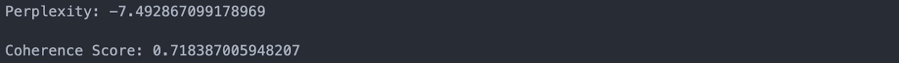

# 潜在狄利克雷分配(LDA)教程:视频通话记录的主题建模(带缩放)

> 原文：<https://web.archive.org/web/https://neptune.ai/blog/latent-dirichlet-allocation-lda-tutorial-topic-modeling>

在本教程中，我们将使用 NLP 机器学习模型来识别在录制的视频会议中讨论的主题。我们将使用[潜在的狄利克雷分配](https://web.archive.org/web/20230216014251/https://en.wikipedia.org/wiki/Latent_Dirichlet_allocation) (LDA)，一种流行的主题建模技术。我们将应用 LDA 将会议的内容(抄本)转换成一组主题，并导出潜在的模式。

这将是一个没有任何不必要的绒毛快速教程。我们开始吧！

## 先决条件

为了遵循并完全理解本教程，您需要具备:

*   Python 3.6 或更新版本。
*   理解自然语言处理。
*   视频会议记录。

## 文件结构

这个项目的文件目录应该是这样的。已经安排实施干净编码最佳实践:

```py
├── README.md
├── converter.py
├── env
├── key.json
├── main.py
├── modeling.py
├── sentence-split.py
├── transcribe.py

```

在本教程中，我们将在上面的目录树中创建所有文件。

## 设置 Python 虚拟环境

我们需要为这个项目特有的各种 python 依赖项创建一个隔离的环境。

首先，要在终端中创建一个新的开发文件夹，运行:

```py
$ mkdir zoom-topic-modeling

```

接下来，创建一个新的 Python 虚拟环境。如果您使用的是 Anaconda，可以运行以下命令:

```py
$ conda create -n env python=3.6

```

然后，您可以使用以下方式激活环境:

```py
$ conda activate env

```

如果您使用的是标准 Python 发行版，请通过运行以下命令创建一个新的虚拟环境:

```py
$ python -m venv env

```

要在 Mac 或 Linux 上激活新环境，请运行:

```py
$ source env/bin/activate

```

如果您使用的是 Windows，请按如下方式激活环境:

```py
$ venvScriptsactivate

```

无论您使用何种方法创建和激活虚拟环境，您的提示都应该修改为:

```py
(zoom-topic-modeling) $
```

## 需求文件

接下来，随着环境的建立，我们将安装项目依赖项的特定版本(这些版本是我撰写本文时的最新版本)。为了重现我的结果，您应该使用相同版本的软件包:

```py
gensim==3.8.3
google-api-core==1.24.1
google-api-python-client==1.12.8
google-auth==1.24.0
google-auth-httplib2==0.0.4
google-cloud-speech==2.0.1
googleapis-common-protos==1.52.0
nltk==3.5
pandas==1.2.0
pydub==0.24.1
pyLDAvis==2.1.2

```

你可以简单地`$ pip install -r requirements.txt`或`conda install --file requirements.txt`(如果你在 Anaconda 上)然后瞧！该程序的所有依赖项都将被下载、安装，并准备就绪。

或者，您可以按如下方式安装所有软件包:

```py
pip install en_core_web_sm gensim google-api-core google-api-pyton-client google-auth google-auth-httplib2 google-cloud-speech googleapis-common-protos nltk pandas pyLDAvis

```

```py
conda install -c conda-forge en_core_web_sm gensim google-api-core google-api-pyton-client google-auth google-auth-httplib2 google-cloud-speech googleapis-common-protos nltk pandas pyLDAvis
```

## 设置参数和源代码的分离

我们将积极地生成 API 凭证，这些凭证是存在于我们源代码之外的变量，对每个用户都是唯一的。首先，您需要创建一个环境文件(。env)，这可以在您的 IDE 中通过创建一个新文件并命名它来轻松完成。env 也可以通过终端完成，如下所示:

```py
(zoom-topic-modeling) $ touch .env   
(zoom-topic-modeling) $ nano .env    

```

环境变量由名称/值对组成，在给定的时间点，可以创建任意数量的变量供参考。

例如，的内容。env 文件看起来应该有点像这样:

```py
user=Brain
key=xxxxxxxxxxxxxxxxxxxxxxxxxx
```

与项目相关的参数直接指向源代码。与项目实例相关的参数转到环境文件。

或者，您可以将 API 凭证文件添加到 [gitignore](https://web.archive.org/web/20230216014251/https://git-scm.com/docs/gitignore) 文件中。这可以防止敏感信息(如 API 键和其他配置值)在源代码中公开。

## 项目范围说明书

如果有一句话我们在 2020 年后不会忘记，那就是“呆在家里，保持安全。”疫情迫使世界各地的人们呆在家里，以帮助遏制病毒的传播。每个能做到这一点的人都开始在远程环境中工作。

这导致视频会议服务如 Zoom、Cisco WebEx、Microsoft Teams 或 Google Hangouts Meet 的受欢迎程度激增。这种新的社交距离文化迫使人们通过在线会议保持社交的创造性，学校，音乐会，仪式，健身项目从现实世界转移到屏幕上。

因为我们在组织中的虚拟会议比以往任何时候都多，所以对于高管和员工来说，参加所有的虚拟会议可能是低效和耗时的。因此，在这个项目中，我们将尝试使用主题建模来提供人们无法参加的会议的主题摘要。

## 项目工作流程

任何项目工作流的三个组成部分是:

*   输入，
*   转变，
*   所需的输出。

在这个项目的背景下，输入是视频或音频形式的视频会议记录(来自 Zoom)。

接下来，我们必须处理这个输入，并将其转换为一致的文件格式，在我们的例子中是–[FLAC](https://web.archive.org/web/20230216014251/https://en.wikipedia.org/wiki/FLAC)(免费的**无损**音频编解码器)。这是一种压缩的音频编码**无损**文件格式。此外，为了处理 FLAC 文件的上下文，我们需要将其转换为文本，以执行各种自然语言处理(NLP)操作。考虑到这一点，我们将利用[谷歌的语音转文本 API](https://web.archive.org/web/20230216014251/https://cloud.google.com/speech-to-text) 来准确地将音频内容转录成文本。

有了文字稿，我们将执行 NLP 预处理，开始 LDA 建模，并可视化主题。

## 脚本和解释

每个脚本都是根据面向对象的编程范式编写的。以下是对每个脚本的高级解释。

### 1.Converter.py

为了使这个项目无缝，我们将把所有的音频/视频文件转换成 FLAC 格式，这是一种由谷歌语音到文本 API 支持的[编码方案。Pyhub 库是一个强大的 python 库，可以快速完成这些转换。](https://web.archive.org/web/20230216014251/https://cloud.google.com/speech-to-text/docs/reference/rest/v1/RecognitionConfig#AudioEncoding)

```py
import pydub

class Converter:
    def __init__(self, file_path):
        self.audio = pydub.AudioSegment.from_file(file_path)

    def convert(self, desired_format):
        output = './audio.'+ desired_format
        self.audio.export(output, format=desired_format)
        print('Successfully completed conversion')

```

### 2.转录. py

通过将音频/视频文件转换为 FLAC，我们可以将音频内容转录为 txt 格式的文本。为了使用谷歌的 API，你需要设立一个[谷歌云免费层账户](https://web.archive.org/web/20230216014251/https://cloud.google.com/free)，在这里你可以获得 300 美元的免费积分来探索谷歌云平台。

在撰写本文时，大约有三种类型的转录类:长音频文件、短音频文件和流文件，正如你在这里看到的。在这篇文章中，我们**转录长音频文件**。

任何超过 1 分钟的音频文件都被视为长音频文件。为了转录一个长音频文件，该文件必须存储在谷歌云存储中，如[文档](https://web.archive.org/web/20230216014251/https://cloud.google.com/speech-to-text/docs/async-recognize)中所述。这意味着如果文件很短，我们只能直接从本地机器上传文件进行转录。这就是为什么我们需要一个谷歌云存储桶。如果你还没有一个桶的话，跟随这个[链接](https://web.archive.org/web/20230216014251/https://cloud.google.com/storage/docs/creating-buckets)来创建一个桶。

最后，为了连接我们的应用程序和 google 语音转文本 API，我们需要创建并激活一个 Google 云服务帐户，它将为您提供一个 JSON 文件。点击此链接快速入门。

***注意:**下载的 JSON 文件应该保存在与 transcribe.py 脚本相同的目录下。*

```py
import time

from google.cloud import speech

from google.oauth2 import service_account
class Transcriber:
    def __init__(self,URI):
        self.credentials = service_account.Credentials.from_service_account_file(
            'key.json')
        self.client = speech.SpeechClient(credentials=self.credentials)

        self.gcs_uri = URI
        self.audio = speech.RecognitionAudio(uri=self.gcs_uri)
        self.config = speech.RecognitionConfig(
            encoding=speech.RecognitionConfig.AudioEncoding.FLAC,
            language_code="en-US",
            audio_channel_count=2,
            enable_separate_recognition_per_channel=True,
        )

    def transcribe(self):
        transcript = ''

        operation = self.client.long_running_recognize(
            config=self.config, audio=self.audio)
        start_time = time.time()
        print("Waiting for operation to complete...")
        response = operation.result()

        for result in response.results:
            transcript += result.alternatives[0].transcript
        print('Transcribing completed')
        print('Transcription took {time.time()-start_time}seconds')

        print('saving transcript')
        with open('transcript.txt', 'w') as file:
            file.write(transcript)

```

### 3.分句. py

transcribe.py 脚本为相应的音频文件返回一个 script.txt 文件。为了构建理解底层模式的 LDA 模型，我们需要为模型提供 CSV 格式的文本文件。在这里，我们将把抄本分成一个数据帧，用实例作为句子。为了做到这一点，我们将通过“.”来分割文本文件内容，语法上的意思是一句话的结尾。

```py
import csv

class Spliter():

    def split(self):

        with open('transcript.txt') as file_, open('transcript.csv', 'w') as csvfile:
            lines = [x for x in file_.read().strip().split('.') if x]
            writer = csv.writer(csvfile, delimiter=',')
            writer.writerow(('ID', 'text'))
            for idx, line in enumerate(lines, 1):
                writer.writerow((idx, line.strip('.')))

```

### 4.建模. py

这个脚本由一个 LdaModeling 类组成，该类加载了 script.csv(这是将脚本拆分成句子后生成的数据)。该类有四个方法:预处理，建模，绘图，性能。

为了通过 LDA 进行主题建模，我们需要一个数据字典和一袋单词语料库。预处理方法从标记化开始，这是创建数据字典和词袋语料库的关键方面。它包括将一段文本分成更小的单元，称为标记。

我们需要从数据集中删除标点符号和停用词，以便将注意力集中在重要的词上。为了统一起见，我们将所有的记号都转换成小写，并对它们进行词汇化，以提取单词的词根形式并去除屈折词尾。此外，我们删除了 5 个字符以下的所有标记。预处理方法返回一个数据字典和单词语料库包作为 gensim_corpus，gensim_dictionary。

现在，我们已经拥有了在 Gensim 中创建 LDA 模型所需的一切。我们将使用 gensim.models.ldamodel 模块中的 LdaModel 类来创建 LDA 模型。我们需要将我们之前创建的单词库作为第一个参数传递给 LdaModel 构造函数，后面是主题数、我们之前创建的字典和传递次数(模型的迭代次数)。建模方法返回 LDA 模型实例。

为了可视化我们的数据，我们可以使用本文开头下载的 pyLDAvis 库。该库包含一个用于 Gensim LDA 模型的模块。首先，我们需要通过将字典、单词库和 LDA 模型传递给准备方法来准备可视化。接下来，我们需要调用 pyLDAvis 库的 gensim 模块上的显示，如绘图方法所示。

作为一个好的 LDA 模型的经验法则，困惑分数应该低，而一致性应该高。Gensim 库有一个 CoherenceModel 类，可用于查找 LDA 模型的一致性。对于困惑，LdaModel 对象包含一个 log-perferency 方法，该方法将一包单词语料库作为参数，并返回相应的困惑。CoherenceModel 类将 LDA 模型、标记化的文本、词典和字典作为参数。为了获得一致性分数，使用 get_coherence 方法。

```py
import nltk
import pandas as pd
import re
import gensim
import gensim.corpora as corpora
from gensim.utils import simple_preprocess
from gensim.models import CoherenceModel
import pyLDAvis
import pyLDAvis.gensim
nltk.download('stopwords')
en_stop = set(nltk.corpus.stopwords.words('english'))
from nltk.stem import WordNetLemmatizer
stemmer = WordNetLemmatizer()
import warnings
warnings.filterwarnings("ignore")

class LdaModeling():
    def __init__(self, data):
        self.df = pd.read_csv(data)
        self.df = self.df.drop(columns=['ID'])
        self.corpus_superlist = self.df[['text']].values.tolist()

        self.corpus = []
        for sublist in self.corpus_superlist:
            for item in sublist:
                self.corpus.append(item)
    def preprocessing(self):
        def preprocess_text(document):

            document = re.sub(r'W', ' ', str(document))

            document = re.sub(r's+[a-zA-Z]s+', ' ', document)

            document = re.sub(r'^[a-zA-Z]s+', ' ', document)

            document = re.sub(r's+', ' ', document, flags=re.I)

            document = re.sub(r'^bs+', '', document)

            document = document.lower()

            tokens = document.split()
            tokens = [stemmer.lemmatize(word) for word in tokens]
            tokens = [word for word in tokens if word not in en_stop]
            tokens = [word for word in tokens if len(word)  > 5]

            return tokens

        processed_data = [];
        for doc in self.corpus:
            tokens = preprocess_text(doc)
            processed_data.append(tokens)

        gensim_dictionary = corpora.Dictionary(processed_data)
        gensim_corpus = [gensim_dictionary.doc2bow(token, allow_update=True) for token in processed_data]

        return gensim_corpus, gensim_dictionary
    def modeling(self):
        lda_model = gensim.models.ldamodel.LdaModel(gensim_corpus, num_topics=3, id2word=gensim_dictionary, passes=50)
        lda_model.save('gensim_model.gensim')
        return lda_model

    def plotting(self, lda_model, gensim_corpus, gensim_dictionary):
        print('display')
        vis_data = pyLDAvis.gensim.prepare(lda_model, gensim_corpus, gensim_dictionary)
        pyLDAvis.show(vis_data)

    def performance(self, lda_model, gensim_corpus, gensim_dictionary):
        print('nPerplexity:', lda_model.log_perplexity(gensim_corpus))
        coherence_score_lda = CoherenceModel(model=lda_model, texts=gensim_corpus, dictionary=gensim_dictionary, coherence='c_v')
        coherence_score = coherence_score_lda.get_coherence()
        print('nCoherence Score:', coherence_score)

```

### 5.Main.py

这是程序的执行点。在这里，我们导入所有的脚本类，并输入所需的参数。

```py
from converter import Converter
from transcribe import Transcriber
from sentence-split import Spliter
from modeling import LdaModeling

def main()

    if __name__ == '__main__':
        audio_converter = Converter('./audio.mp3')
        audio_converter.convert('flac')
        zoom_project = Transcriber("gs://zoom_project_data/audio.flac")
        transcript = zoom_project.transcribe()
        sentence_spliter = Spliter.split()
        lda_instance = LdaModeling('transcript.csv')
        gensim_corpus, gensim_dictionary = lda_instance.preprocessing()
        lda_model = lda_instance.modeling()

        lda_plot = lda_instance.plotting(lda_model, gensim_corpus, gensim_dictionary)
        print(lda_plot)

main()

```

## 结果

下图中的每个圆圈对应于使用 3 个主题的 LDA 模型输出中的一个主题。圆圈之间的距离显示了主题彼此之间的不同，重叠的圆圈显示了主题通过常用词的交集。当您将鼠标悬停在任何圆圈上时，该主题的最常用术语列表将出现在右侧，同时还会显示该主题的出现频率。

模型性能非常令人满意，因为它产生了低困惑分数和高一致性，如下所示:



## 结论

至此，本教程到此结束。您可以尝试其他短信示例来查看结果。我相信你已经想到了这种建模的所有令人惊奇的可能性和用例。感谢阅读！

### 资源

1.  杰罗达尔，h，王，y，袁，c，冯，x，蒋，x，李，y，赵，l(2018)。潜在狄利克雷分配(LDA)和主题建模:模型，应用，综述。arXiv:1711.04305v2 [cs。IR】。
2.  Putra, I. M., & Kusumawardani, R. P. (2017). Analisis Topik Informasi Publik Media Sosial di Surabaya Menggunakan Pemodelan Latent Dirichlet Allocation (LDA). Jurnal Teknik ITS Vol. 6, №2, 311–316.
3.  h . m . wallach、I . Murray、r . Salakhutdinov 和 d . Mimno(2009 年)。主题模型的评估方法。*2009 年 ICML 第 26 届机器学习国际会议论文集*， *4* ，1105–1112。
4.  [http://qpleple.com/perplexity-to-evaluate-topic-models/](https://web.archive.org/web/20230216014251/http://qpleple.com/perplexity-to-evaluate-topic-models/)
5.  [http://qp ple . com/topic-coherence-to-evaluate-topic-models/](https://web.archive.org/web/20230216014251/http://qpleple.com/topic-coherence-to-evaluate-topic-models/)