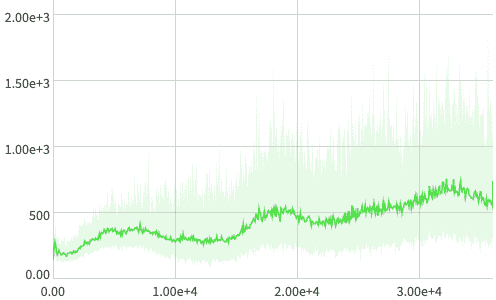

# 登录强化学习框架——你需要知道什么

> 原文：<https://web.archive.org/web/https://neptune.ai/blog/logging-in-reinforcement-learning-frameworks>

日志通常是一个重要的问题，因为框架有不同的方法。在本文中，我将向您展示日志记录是如何在流行的强化学习框架中实现的。

在我的前一篇文章中，我讨论了如何理解强化学习代理，以及在训练和调试期间应该记录什么以及为什么要记录。

在本教程中，**我将向您展示日志如何在不同的框架中工作，以及如何轻松地向它们添加您自己的日志记录器**(我将以 Neptune 为例)。框架包括 [Acme](https://web.archive.org/web/20221206025247/https://github.com/deepmind/acme) 、 [RLlib](https://web.archive.org/web/20221206025247/https://docs.ray.io/en/master/rllib.html) 、 [SpinningUp](https://web.archive.org/web/20221206025247/https://spinningup.openai.com/en/latest/) 和[稳定基线](https://web.archive.org/web/20221206025247/https://stable-baselines.readthedocs.io/en/master/)。

我创建了一个 GitHub 存储库，里面有本教程的所有补充材料[在这里](https://web.archive.org/web/20221206025247/https://github.com/piojanu/RLlogging)。

## 强化学习中的登录方法

有两种最常见的日志记录方法，我称之为**“存储然后记录”**和**“现在写”**(一语双关)**。**

## 存储然后记录

在这种方法中，**您首先在运行时存储指标，在指定的时间间隔(比如每 10 000 个时间步长)之后，您计算这些指标的聚合统计信息并记录它们**。

原则上，这意味着您可以存储，例如，跨许多集的集回报，并汇总结果以获得跨存储值的平均集回报。

这在随机环境中非常有用，或者当你的策略是随机的，每次运行代理时你可以得到不同的事件回报。如果是这种情况，您必须考虑平均值来减少日志中的噪声。

这种日志记录方法可以在旋转上升和稳定基线框架中找到。

### **旋转起来**

在 spin Up 中，更容易看到“存储然后记录”的方法，因为代码非常简单，所以我们将使用它来描述这种方法，然后我将讨论如何将这样的自定义日志程序添加到上述两个框架中。

### **示例中的“存储然后记录”**

 **下面是旋转(纪元)记录器 API。我删掉了不太重要的代码。

```py
class Logger:
    """
    A Logger tailored for tracking average values over epochs.

    Typical use case: there is some quantity which is calculated many times
    throughout an epoch, and at the end of the epoch, you would like to
    report the average / std / min / max value of that quantity.
    """
    [...]

    def store(self, **kwargs):

        """
        Save something into the epoch_logger's current state.

        Provide an arbitrary number of keyword arguments with numerical
        values.
        """

        [...]
    def log_tabular(self, key, val=None, with_min_and_max=False, average_only=False):
        """
        Log a value or possibly the mean/std/min/max values of a diagnostic.

        Args:
            key (string): The name of the diagnostic. If you are logging a
                diagnostic whose state has previously been saved with
                ``store``, the key here has to match the key you used there.
            val: A value for the diagnostic. If you have previously saved
                values for this key via ``store``, do *not* provide a ``val``
                here.
            with_min_and_max (bool): If true, log min and max values of the
                diagnostic over the epoch.
            average_only (bool): If true, do not log the standard deviation
                of the diagnostic over the epoch.
        """

        [...]

    def dump_tabular(self):
        """
        Write all of the diagnostics from the current iteration.

        Writes both to stdout, and to the output file.
        """

        [...]
```

可以看到，logger 有三个主要方法: *store* 、 *log_tabular、*和 *dump_tabular* 。

*   ***存储*** 每次被调用的数量要汇总并计算日志。它只是存储值，如剧集回报或一些学习指标，用于未来的计算。
*   ***log_tabular*** 在 epoch 结束时被调用，记录存储的指标的统计数据。您可以选择记录平均值和标准差(参数 *average_only=False* )，或仅记录平均值(参数 *average_only=True* )，或另外记录最小值和最大值(参数 *with_min_and_max=True* )。
*   ***dump_tabular*** 在命令行中完成操作并打印日志。**这是为计算的统计数据添加您的自定义目的地的地方，例如将它们发送到 Neptune。**

现在让我们看一下在旋转 VPG 实现中使用“存储然后记录”方法和 EpochLogger 的代码示例(同样，为了清楚起见，稍微做了修改和删减)。

```py
def update():
    ...some policy optimization code...
    logger.store(LossPi=pi_l_old, LossV=v_l_old)

for epoch in range(epochs):

    for t in range(steps_per_epoch):
        a, ... = ...get action...

        next_o, r, d, _ = env.step(a)
        ep_ret += r
        ep_len += 1

        ...

        if d is True:

            logger.store(EpRet=ep_ret, EpLen=ep_len)
            ...

    update()

    logger.log_tabular('Epoch', epoch)
    logger.log_tabular('EpRet', with_min_and_max=True)
    logger.log_tabular('EpLen', average_only=True)
    logger.log_tabular('LossPi', average_only=False)
    logger.log_tabular('LossV', average_only=False)
    logger.dump_tabular()
```

### **定制记录器**

正在旋转的日志程序存在于 *logx.py* 文件中，不幸的是，没有简单的方法来覆盖它以将日志发送到 Neptune。在其设计中非常简单的旋转是非常硬编码的，这阻碍了在不修改原始代码的情况下扩展它的能力。也就是说，我为你修改了代码，你可以从[这里](https://web.archive.org/web/20221206025247/https://github.com/piojanu/RLlogging/tree/master/spinning_up)得到。在链接中，您还可以找到一个示例运行脚本。

要使用日志程序，请用上面提供的实现替换正在运行的代码中的 *logx.py* 文件(在[安装](https://web.archive.org/web/20221206025247/https://spinningup.openai.com/en/latest/user/installation.html#installing-spinning-up)期间克隆的)。然后，您可以在启动中运行任何现有的代理，如下所示:

```py
import gym
import neptune
import tensorflow as tf

from spinup import ppo_tf1 as ppo

env_fn = lambda : gym.make('LunarLander-v2')

ac_kwargs = dict(hidden_sizes=[64,64], activation=tf.nn.relu)

neptune.init(project_qualified_name='<namespace/project_name>')
experiment = neptune.create_experiment()

logger_kwargs = dict(output_dir='path/to/output_dir',
                     exp_name='experiment_name',
                     neptune_experiment=experiment)

ppo(env_fn=env_fn, ac_kwargs=ac_kwargs, steps_per_epoch=5000, epochs=250, logger_kwargs=logger_kwargs)

```

更多信息请参见 Spinning Up 网站的[运行实验](https://web.archive.org/web/20221206025247/https://spinningup.openai.com/en/latest/user/running.html#launching-from-scripts)部分。

### **稳定基线**

稳定基线是一个更高级的框架，就日志记录方法而言，它在本质上非常类似于向上旋转，但是，与向上旋转相比，它是可扩展的。[在这里](https://web.archive.org/web/20221206025247/https://github.com/piojanu/RLlogging/tree/master/stable_baselines)你可以找到我为你准备的 Neptune 记录器代码和运行示例。你可以根据自己的需要进行调整。

现在让我们看看如何在稳定的基线中实现 Neptune 实验的定制日志输出。

```py
from stable_baselines import logger
class NeptuneLogger(logger.KVWriter):
    """Stable Baselines Neptune logger."""

    def __init__(self, experiment):
        super().__init__()
        self._experiment = experiment

    def writekvs(self, kvs):
        for k, v in sorted(kvs.items()):
            if hasattr(v, 'dtype'):
                v = float(v)
            self._experiment.log_metric(k, v)
```

在这里你可以看到如何使用我们的记录器。我们首先导入它，然后创建 Neptune 实验，并将我们的记录器添加到默认的记录器输出中。

```py
import neptune
import stable_baselines  
from stable_baselines import logger

from logger import NeptuneLogger

neptune.init(project_qualified_name='<namespace/project_name>')
experiment = neptune.create_experiment()

logger_ = logger.Logger.CURRENT
logger_.output_formats.append(NeptuneLogger(experiment))

...further training code...

```

您可以在此找到更多关于培训稳定基线代理[的信息。](https://web.archive.org/web/20221206025247/https://stable-baselines.readthedocs.io/en/master/guide/quickstart.html)

## 现在写

这是一个概念上更简单的方法，因为你不需要存储任何东西。你只需记录可用的值，例如在每集之后。您记录或“立即”写入值，因此得名“立即写入”。是 Acme 和 RLlib 用的。

这种简单的方法有其缺点。主要问题是记录值中的高噪声。我们可以在这里回忆随机环境/政策的问题，但是训练统计数据作为一个损失，受到高方差的影响。

在命令行中查看每一集的打印值将是一场噩梦。但是只要我们使用像 Neptune 这样的实验跟踪工具，这并不是什么大问题。

Neptune 将获取所有这些细粒度的值，对它们进行平均，并将它们与最大值和最小值一起呈现在可解释的图表上(如图 1 中的阴影区域所示)。



*Figure 1\. DDPG’s critic loss on the Y-axis and timesteps on the X-axis. The agent was trained on the Humanoid MuJoCo environment.*

### **过滤器**

如果您仍然希望手动修复日志中差异较大的问题，可以使用过滤器。

过滤器是记录器上的包装器，它在记录值之前对值进行一些转换。

对于 Acme，我为你准备了两个。一个用于值平滑(参见本系列讲座的[指数加权移动平均线](https://web.archive.org/web/20221206025247/https://www.youtube.com/watch?v=lAq96T8FkTw)，或 EMA，来自吴恩达)，另一个用于计算聚集统计数据，如“存储然后记录”。

所有这些最好用一个例子来描述，所以让我们跳到极致。

### **极致**

和以前一样，我将使用两者中更简单的框架来介绍这种方法。然后我们将讨论自定义记录器和过滤器的实现。

### **示例中的“现在写”**

 **下面是取自 Acme *EnvironmentLoop* 类的“立即编写”方法(为了清楚起见，稍作修改)。

```py
def run_episode():
    ...reset any counts and start the environment...

    while not timestep.last():

        action = actor.select_action(timestep.observation)
        timestep = environment.step(action)
        episode_return += timestep.reward

        ...

        if should_update:
            actor.update()

    episode_steps += 1

    steps_per_second = episode_steps / (time.time() - start_time)
    result = {
        'episode_length': episode_steps,
        'episode_return': episode_return,
        'steps_per_second': steps_per_second,
    }
    logger.write(result)
```

如您所见，记录器是一个简单的对象。每集之后，你把结果写到里面。结果是一个字典，其中的键是日志名，值是度量。没什么复杂的。

### **定制记录器**

让我们来看看我为您准备的自定义 Neptune 日志程序代码和过滤器。记录器和过滤器在示例运行脚本旁的[处](https://web.archive.org/web/20221206025247/https://github.com/piojanu/RLlogging/tree/master/acme)可用。

#### **记录器**

```py
import collections
import re

import acme.utils.loggers as acme_loggers
import acme.utils.tree_utils as acme_tree
import numpy as np
class NeptuneLogger(acme_loggers.base.Logger):
    """Neptune logger for Acme.
    Args:
        prefix (string): The string used to prefix data keys in a name of a log.
          Can be None in which case no prefix is used.
        index_name (string): The data key which value to use as a log index.
          Can be None in which case no index is used.
    """

    def __init__(self, experiment, prefix=None, index_name=None):
        super()
        self._experiment = experiment
        self._prefix = prefix
        self._index_name = index_name or ''

    def write(self, values):
        """Send `values` to Neptune."""
        values = acme_loggers.to_numpy(values)
        index = values.pop(self._index_name, None)
        for key, value in values.items():
            prefixed_key = f'{self._prefix}/{key}' if self._prefix else key
            if index:
                self._experiment.log_metric(prefixed_key, index, value)
            else:
                self._experiment.log_metric(prefixed_key, value)
```

这很简单，你只需要实现一个方法--如 Neptune 记录器所示。

现在让我们跳到过滤器。

#### **平滑滤波器**

```py
class SmoothingFilter(acme_loggers.base.Logger):
    """Logger which writes to another logger, smoothing matching data.
    Args:
        to (Logger): An object to which the current object will forward the
          original data and its results when `write` is called.
        smoothing_regex (string): A regex of data keys which should be smoothed.
        smoothing_coeff (float): A desired smoothing strength between 0 and 1.
    Note:
        For example values of regex = 'return' and coeff = 0.99 will calculate
        the running average of all data which contain 'return' in their key.
        It's calculated according to: average = 0.99 * average + 0.01 * value.
        Warm-up period of length 10 is also applied (see the comment in code).
    """

    def __init__(self, to, smoothing_regex, smoothing_coeff):
        super()
        self._to = to
        self._smoothing_regex = smoothing_regex
        self._smoothing_coeff = smoothing_coeff

        self._previous_values = collections.defaultdict(float)
        self._smoothing_coeffs = collections.defaultdict(float)

    def write(self, values):
        """Smooths matching data and forwards it with the original data."""
        values_ = dict(values)

        for key, value in values.items():
            if re.search(self._smoothing_regex, key) is not None:
                smoothed_key = f'{key}_smoothed_{self._smoothing_coeff}'
                prev_value = self._previous_values[smoothed_key]
                prev_smoothing_coeff = self._smoothing_coeffs[smoothed_key]

                new_smoothing_coeff = (prev_smoothing_coeff * 0.9 +
                                       self._smoothing_coeff * 0.1)
                smoothed_value = (value * (1 - prev_smoothing_coeff) +
                                  prev_value * prev_smoothing_coeff)

                self._previous_values[smoothed_key] = smoothed_value
                self._smoothing_coeffs[smoothed_key] = new_smoothing_coeff
                values_[smoothed_key] = smoothed_value

        self._to.write(values_)
```

您将一个正则表达式传递给平滑过滤器，**它将平滑匹配正则表达式**的日志值。您还可以使用 *smoothing_coeff* 参数在 0 和 1 之间控制平滑强度。

例如，regex = 'return '和 coeff = 0.99 的值将计算键中包含' return '的所有数据的移动平均值。它是根据:平均值= 0.99 *平均值+ 0.01 *值来计算的。还应用了长度为 10 的预热期(参见代码中的注释)。它有助于解决 EMA 上[链接的](https://web.archive.org/web/20221206025247/https://www.youtube.com/watch?v=lWzo8CajF5s)讲座中描述的不准确的早期值。

注意，一个正则表达式可以很容易地用“or”操作符匹配多个不同的指标名称(在这里阅读更多)。

#### **聚集过滤器**

```py
class AggregateFilter(acme_loggers.base.Logger):
    """Logger which writes to another logger, aggregating matching data.
    Args:
        to (Logger): An object to which the current object will forward the
          aggregated data when `dump` is called.
        aggregate_regex (string): A regex of data keys which should be
          aggregated.
    Note:
        For not matched keys the last value will be forwarded.
    """

    def __init__(self, to, aggregate_regex):
        super()
        self._to = to
        self._aggregate_regex = aggregate_regex

        self._cache = []

    def write(self, values):
        self._cache.append(values)

    def dump(self):
        """Calculates statistics and forwards them to the target logger."""
        results = {}

        stacked_cache = acme_tree.stack_sequence_fields(self._cache)
        for key, values in stacked_cache.items():
            if re.search(self._aggregate_regex, key) is not None:
                results.update({
                    f'{key}_mean': np.mean(values),
                    f'{key}_std': np.std(values),
                    f'{key}_median': np.median(values),
                    f'{key}_max': np.max(values),
                    f'{key}_min': np.min(values),
                })
            else:
                results[key] = values[-1]

        self._to.write(results)
        self._cache.clear()
```

**这个非常类似于“存储然后记录”方法**的行为。方法 *write* 不会立即记录这些值，而是存储它们。然后，您还有一个方法 *dump* 来计算聚合统计数据，如 average、std。戴夫。、min 和 max，并将它们写入过滤器包装的记录器。

有关详细信息，请参见此代码和以前的过滤器代码。此外，[在这里](https://web.archive.org/web/20221206025247/https://github.com/piojanu/RLlogging/tree/master/acme)您将找到一个完整的示例，说明如何使用我们的定制记录器和过滤器运行 Acme 培训和评估。

#### 如何做到这一切？

您可以通过包装记录器来使用过滤器。请看下面的摘录。

```py
import acme.utils.loggers as acme_loggers
import logger as neptune_loggers

def make_logger(experiment,
                prefix=None,
                time_delta=1.0,
                aggregate_regex=None,
                smoothing_regex=None,
                smoothing_coeff=0.99):
    """Creates an aggregate of Neptune and Terminal loggers with some filters.

    Args:
        experiment (NeptuneExperiment): Neptune experiment to log to.
        prefix (string): The logger name (used also as NeptuneLogger prefix).
        time_delta (float): Time (in seconds) between logging events.
        aggregate_regex (string): A regex of data keys which should be
          aggregated. If None, then no aggregation.
        smoothing_regex (string): A regex of data keys which should be smoothed.
          If None, then no smoothing.
        smoothing_coeff (float between 0 and 1): A desired smoothing strength.
    """
    neptune_logger = neptune_loggers.NeptuneLogger(
        experiment, prefix, index_name='epoch')
    terminal_logger = acme_loggers.terminal.TerminalLogger(prefix)
    logger = acme_loggers.aggregators.Dispatcher(
        [neptune_logger, terminal_logger])

    if smoothing_regex:
        logger = neptune_loggers.SmoothingFilter(
            logger, smoothing_regex, smoothing_coeff)

    logger = acme_loggers.filters.NoneFilter(logger)
    logger = acme_loggers.filters.TimeFilter(logger, time_delta)

    if aggregate_regex:
        logger = neptune_loggers.AggregateFilter(
            logger, aggregate_regex)

    return logger
```

然后，使用这个方法为代理、训练循环和评估循环创建记录器。下面我包括了代码片段，完整的运行示例是[这里是](https://web.archive.org/web/20221206025247/https://github.com/piojanu/RLlogging/blob/master/acme/run_d4pg.py)。

```py
[...]

  agent = d4pg.D4PG(
      environment_spec=environment_spec,
      policy_network=agent_networks['policy'],
      critic_network=agent_networks['critic'],
      observation_network=agent_networks['observation'],
      sigma=1.0,  
      logger=make_logger(experiment, prefix='learner'),
  )

  train_loop = acme.EnvironmentLoop(
      environment,
      agent,
      label='train_loop',
      logger=make_logger(experiment,
                         prefix='train',
                         smoothing_regex='return')
  )

[...]

  eval_actor = actors.FeedForwardActor(policy_network=eval_policy)
  eval_env = make_environment()
  eval_logger = make_logger(experiment,
                            prefix='eval',
                            aggregate_regex='return')
  eval_loop = acme.EnvironmentLoop(
      eval_env,
      eval_actor,
      label='eval_loop',
      logger=eval_logger,
  )

[...]
```

您将在 repo 中找到关于运行 Acme 的更多信息，包括示例，[在这里](https://web.archive.org/web/20221206025247/https://github.com/deepmind/acme/tree/master/examples)。

### **RLlib**

与稳定基线的情况一样，RLlib 是一个更高级的框架，它使用与 Acme 相同的日志记录策略。我为您提供了允许您将 Neptune 日志添加到 RLlib 的代码。[在这里](https://web.archive.org/web/20221206025247/https://github.com/piojanu/RLlogging/tree/master/rllib)您将找到日志程序代码和示例运行脚本。让我们先看看伐木工。

```py
import neptune
import numpy as np
from ray import tune
class NeptuneLogger(tune.logger.Logger):
    """RLlib Neptune logger.
    Example usage:
    ```
    import ray
    from ray import tune
    ray.init()
    tune.run(
        "PPO",
        stop={"episode_reward_mean": 200},
        config={
            "env": "CartPole-v0",
            "num_gpus": 0,
            "num_workers": 1,
            "lr": tune.grid_search([0.01, 0.001, 0.0001]),
            "logger_config": {"neptune_project_name": '<user name>/sandbox'},
        },
        loggers=tune.logger.DEFAULT_LOGGERS + (NeptuneLogger,),
    )
    ```py
    """

    def _init(self):
        logger_config = self.config.get('logger_config')
        neptune.init(logger_config.get('neptune_project_name'))
        self.neptune_experiment = neptune.create_experiment(
            name=str(self.trial),  
            params=self.config,
        )

 @staticmethod
    def dict_multiple_get(dict_, indices):
        """Access the nested value."""
        if not isinstance(indices, list):
            indices = [indices]

        value = dict_
        index = None
        for index in indices:
            try:
                value = value[index]
            except KeyError:
                print("Skipping", indices)
                return {}

        if isinstance(value, dict):
            return value
        else:
            return {index: value}

    def on_result(self, result):
        list_to_traverse = [
            [],
            ['custom_metrics'],
            ['evaluation'],
            ['info', 'num_steps_trained'],
            ['info', 'learner'],
            ['info', 'exploration_infos', 0],
            ['info', 'exploration_infos', 1],
            ['info', 'learner', "default_policy"]
        ]

        for indices in list_to_traverse:
            res_ = self.dict_multiple_get(result, indices)
            prefix = '/'.join([str(idx) for idx in indices])
            for key, value in res_.items():
                prefixed_key = '/'.join([prefix, key])
                if isinstance(value, float) or isinstance(value, int):
                    self.neptune_experiment.log_metric(
                        prefixed_key, value)
                elif (isinstance(value, np.ndarray) or
                      isinstance(value, np.number)):
                    self.neptune_experiment.log_metric(
                        prefixed_key, float(value))

    def close(self):
        neptune.stop()
```

上面的海王星记录器的例子可能看起来很可怕，但它真的不是。它所做的只是从嵌套的结果字典中访问 list_to_traverse 中列出的日志。在这个过程中，它会为每个值添加前缀，这些值是根据原始嵌套数据结构中的键构建的。然后它会处理值数据类型，瞧！请随意复制这段代码，并根据您的日志需求进行修改。

下面你可以看到如何添加您的自定义记录器到 RLlib 培训。

```py
import ray
from ray import tune

from logger import NeptuneLogger

ray.init()
tune.run(
    "PPO",
    stop={"episode_reward_mean": 200},
    config={
        "env": "CartPole-v0",
        "num_gpus": 0,
        "num_workers": 1,
        "lr": tune.grid_search([0.01, 0.001, 0.0001]),
        "logger_config": {"neptune_project_name": "<namespace/project_name>"},
    },
    loggers=tune.logger.DEFAULT_LOGGERS + (NeptuneLogger,),
)
```

## 结论

现在你有了它，两种日志方法和四个框架。[在这里](https://web.archive.org/web/20221206025247/https://github.com/piojanu/RLlogging)你会发现所有的代码与示例运行脚本。

玩得开心，祝你的 RL 实验好运！****