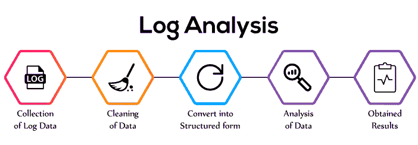

# 日志分析的机器学习方法:如何分析日志？

> 原文：<https://web.archive.org/web/https://neptune.ai/blog/machine-learning-approach-to-log-analytics>

[日志](https://web.archive.org/web/20221206013303/https://theaisummer.com/logging-debugging/)在软件系统的开发和维护中起着很大的作用。使用日志，开发人员和工程师可以分析系统的每一层发生了什么，并跟踪问题。尽管有大量的分布式日志数据，但充分分析这些数据仍然是一个巨大的挑战。

在本文中，我们将讨论手动日志分析的主要问题，并了解为什么机器学习是这一挑战的解决方案。

在收集和解析来自不同来源的日志后，**日志分析工具**分析大量数据，以找到与任何应用程序或系统错误相关的问题的主要原因。

这些工具对于在一个集中的位置监视、收集和评估日志是必不可少的。这样，用户可以从收集的日志数据中获得系统级的洞察力。您可以快速排除故障、修复问题，并找到有意义的行为模式来指导业务决策、调查和安全。

现代软件系统会生成大量日志，这使得基于手动查询级别匹配或基于规则的策略使用传统日志分析工具检查日志变得不切实际。

## 传统日志分析问题

在进行传统日志分析之前，我们首先需要定义**日志分析**本身，并了解为什么它对公司至关重要。

事实上，日志分析是审查和理解计算机生成的日志消息，如日志事件或审计跟踪记录(由计算机、网络、防火墙、应用服务器和其他 it 系统生成)。

它被组织用来提高性能和解决问题。它还可以降低各种风险，响应安全策略，理解在线用户行为，并在调查期间进行取证。

*Steps of log analysis ([source](https://web.archive.org/web/20221206013303/http://arnaudpain.com/2017/12/14/xenmobile-troubleshooting-log-collection-guide/#sthash.xB4MFuuK.dpbs))*

现代软件系统规模和复杂性的不断增加扩大了日志的数量，使得传统的手动日志检查变得不合理。事实上，现代软件系统会生成大量日志。例如，任何商业云应用程序每小时都会产生数千兆字节的数据。使用传统方法无法区分来自日常业务活动的数据和来自恶意活动的数据。

手动日志分析取决于运行分析的人员的熟练程度。如果他们对系统有深入的了解，他们可能会获得一些手动检查日志的动力。然而，这有严重的局限性。这使得整个团队处于一个人的支配之下。只要这个人联系不上，或者无法解决问题，**整个运营就处于风险之中**。

## 答案是机器学习日志分析

机器学习即使不能解决传统日志分析的挑战，也可以成为解决方案的一部分。

计算机已经证明它们能打败人类。在有大量数据的任务中，这种能力使机器能够驾驶汽车，识别图像和检测网络威胁。

借助机器学习驱动的日志分析，技术团队可以摆脱常规和可重复的任务，工程师可以专注于机器无法完成的其他任务。喜欢解决问题的任务，并思考创新的新产品。

## 机器学习对日志分析的好处

将机器学习与日志分析工具结合使用可以让我们:

*   **快速分类数据:**日志可以被视为文本数据，这意味着可以应用 NLP 技术以有组织的方式收集相同的日志，从而可以搜索特定类型的日志。
*   **自动识别问题:**ML 的好处之一是它可以自动检测问题，即使有大量的日志。
*   **警报关键信息:**许多日志分析工具会创建过多的警报，而在大多数情况下，这些警报并不是真正问题的原因。有了 ML，就有可能在有值得关注的事情时得到提醒。这样，我们就克服了误报警报的问题。
*   **早期异常检测:**在大多数灾难性事件中，总会有未被检测到的初始异常。机器学习可以在这种异常造成重大问题之前检测到它。

在本节中，我们将列出使用机器学习进行监控的最佳日志分析工具，并定义如何在它们之间进行选择。我们将通过回顾 10 大日志分析工具来做到这一点。

### **1。珊瑚**

Coralogix 是一家希望将自动化和智能化引入日志记录的初创公司。他们正在构建一个由机器学习支持的远程监控和管理工具，该工具提供了一个分析平台来改善网络的交付和维护流程。用户有一个理想的平台来查看所有实时日志流，定义仪表板小部件以最大限度地控制数据，并将日志数据聚集回原始模式。

### **2\. Datadog**

Datadog 是一个日志分析工具，通过一个位于 SaaS 的数据分析平台提供对服务器、数据库、工具和服务的监控。Datadog 的可视化以图形的形式显示日志数据，这使您可以可视化网络性能随时间的变化。Datadog 使用集中式数据存储来保护日志数据不被泄露，并使用机器学习来检测异常日志模式和问题。

### **3。网络安全管理软件产品/ Loggly**

Loggly 是日志数据管理的 SaaS 解决方案。用户可以简单地从整个基础架构中汇总日志，并将它们放在一个位置来跟踪活动和分析趋势。Loggly 有多种用途，例如监控应用程序分析、排除服务器和应用程序问题、事务关联和警报。它提供了不同的高级功能，如动态字段资源管理器、自动警报、默认或自定义仪表板以及派生的日志字段。

### **4。逻辑监视器**

Logic Monitor 是一个基于 SaaS 的性能监控平台，能够监控对业务至关重要的数据，以便您能够快速响应问题并主动提供解决方案。它在一个组合视图中提供网络、云、服务器等的全栈可见性。

### **5。******logz . io****

 **Logz.io 提供了一个可扩展的智能机器数据分析平台，构建于 ELK 和 Grafana 之上，用于监控现代应用。它将云原生的简单性和可扩展性与众包机器学习相结合，以在大问题发生前识别它们。用户可以使用一个统一的平台对任务关键型应用程序进行监控、故障排除和保护。

### **6。语义文本**

Sematext 是一个基于云的日志管理和分析工具。这是麋鹿的在线实现。它也可通过 Sematext Enterprise 用于自托管解决方案。Sematext 是一个统一的平台，提供一体化解决方案，用于基础设施监控、应用性能监控、日志管理、真实用户监控和综合监控，为您的整个技术体系提供统一、实时的可观察性。

### 7 .**。Splunk**

Splunk 是流行的商业日志集中工具之一。典型的部署是内部部署(Splunk Enterprise)，尽管它也作为服务提供(Splunk Cloud)。它有实时警报。它们可以通过电子邮件或 RSS 发送。警报具有可配置的阈值和触发条件，以确定哪些活动将生成通知。警报中包含的支持信息有助于缩短事件解决时间。

### **8。SumoLogic**

Sumo Logic 是一个日志管理工具，用于协作、操作、开发和保护应用程序。它具有强大的搜索语法，有助于以类似于 UNIX 管道的方式定义操作。它还是一个基于云的机器数据分析平台，旨在主动识别性能问题，确保无缝设备可用性，并增强应用部署。此外，Sumo 逻辑包括内置的模式检测、预测分析和异常检测。

### **9。x 测井**

XpoLog 是一个用于全自动日志管理的端到端解决方案。它旨在收集和解析来自 It 基础设施、云应用程序和服务器的日志数据。此外，它还提供了分析工具、报告引擎、监控引擎、关联功能、事务跟踪和日志监控搜索引擎。Xpolog 支持无代理和基于代理的架构，这意味着它可以通过 SSH 之类的标准协议访问日志。

### 10。斑马鱼

Zebrium 是一款用于监控日志结构的软件，使用无监督的机器学习来自动捕捉软件事件并显示其根本原因。该工具通过查找日志和指标中相关异常模式的热点来工作。该软件提供 AES-256 加密，并通过 Slack 接收警报。

我们已经建立了一个 10 个日志分析工具比较表，以便于更好地审查。

| 工具 | 赞成的意见 | 骗局 | 最适合 |
| --- | --- | --- | --- |
|  | 

更快的搜索体验，强大的日志聚合和警报功能。出色的客户支持。自动数据聚类、闲置提醒和电子邮件。

 | 

每天的日志量有限，不是每月。

 | 

小企业和创业公司。

 |
|  | 

强大的预警和警告配置，大幅减少误报。良好的 API 文档，响应迅速的客户服务。

 | 一些用户抱怨成本失控(由于灵活定价的可能性)。 | 

中小型公司。

 |
|  | 

良好的搜索功能，可以选择在一个集中的地方收集和分析来自许多不同来源的日志。用户还可以在 Slack、HipChat 或吉拉等不同平台上发布警报和创建票证。

 | 用户界面不是很漂亮。基本功能，如 API 访问或多用户，仅在较高的定价计划中可用。 | 

部署到云环境而非本地环境的组织。

 |
|  | 

非常详细和精确地监控各种设备和环境，包括云环境和内部环境。自定义可视化仪表板和许多预配置的丰富仪表板。

 | Web UI 有时需要刷新以显示更改，这很烦人。重新考虑入门级产品的定价，以便较小的组织可以使用该工具。 | 

中型和大型公司。

 |
|  | 

良好的搜索，易于使用，包括过滤和格式化功能。出色的警报机制，尤其适用于监控应用。

 | 

限于创建子账户，这是大公司的一大难题。数据保留不是很好。如果我们达到最大事件摄取量，有时我们可能会丢失事件。

 | 

基于云的应用。

 |
|  | 

导航简单，界面环境好，没有复杂杂乱。良好的文档和出色的客户支持。

 | 

只解析服务器端的 Syslog 和 JSON。自定义解析必须在日志传送程序中完成。不能在同一个仪表板中混合 Kibana 和本机 UI 小部件。

 | 

面向企业和消费者的公司。

 |
|  | 

广泛的功能列表包括机器数据索引、实时和历史搜索，以及高级报告功能。

 | 

非常昂贵。陡峭的学习曲线，昂贵的部署和高维护。

 | 

寻找可靠技术以及对公司和品牌的信心的组织。

 |
|  | 

对现代应用不同方面的信息洞察，用于监控和可视化的仪表板，机器学习功能，预测分析功能。

 |  | 

有几根圆木的小组织。

 |
|  | 

非常易于维护和部署自动分析算法，包括大量日志分析和管理功能。

 | 

比其他工具更小的社区，产品比开发者的社区更注重 IT 和安全。

 | 

寻求经济实惠的快速部署解决方案的企业和中小型企业。

 |
|  | 

易于使用，自动检测问题和根本原因，无需手动规则。可以用作独立的日志管理工具，也可以作为现有日志管理工具(如 ELK Stack)的 ML 附件。

 | 

免费计划每天限量 500 MB，保留 3 天。此外，它不像竞争对手那样知名。

 | 

大型企业，中小型企业。

 |

结论

## 一些日志分析平台使用机器学习来帮助自动检测根本原因和问题，而不需要太多或任何手动分析。

当你选择一个日志分析工具时，不要只看功能和预算，要考虑你能获得的时间。您是想花时间开发自己的日志分析工具，还是更喜欢开箱即用的解决方案，以便专注于您的业务？

最终决定权在你。希望这篇文章能帮助你选择合适的工具！

参考

### References**