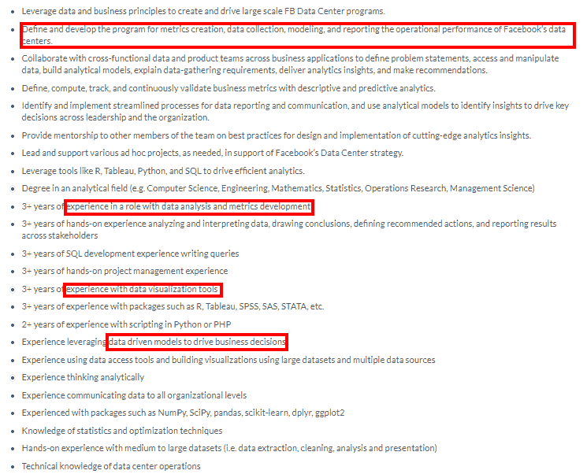
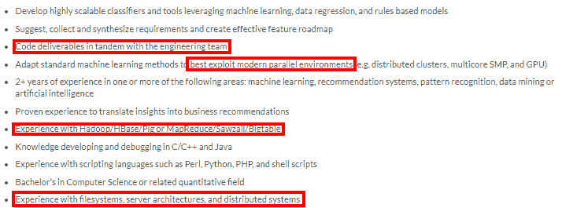

# 机器学习工程师面试:期待什么？

> 原文：<https://web.archive.org/web/https://neptune.ai/blog/machine-learning-engineer-interview>

你是这份工作的最佳人选。你知道，我也知道——但是你仍然需要向面试官证明这一点。人们会根据你的技能、知识和性格来评判你，你需要证明你是合适的人选。哦，压力太大了！

我们都知道那是什么感觉。在复杂的环境中(机器学习项目肯定是复杂的)，与压力较小的工作相比，这甚至更难。不管你的资历如何，面试都是艰难的。高年级学生和低年级学生都一样害怕他们。

为了克服压力，你需要做好准备。如果你想增加被雇用的机会，你必须准备好回答最棘手的问题，而不失去镇定。

在这篇文章中，我将通过向你展示面试官如何喜欢绊倒机器学习工程师候选人，以及如何为他们的招聘策略做好准备，来帮助你赶走面试焦虑。

## 机器学习工程师的作用是什么？

在我们进入面试本身之前，让我们首先确保你实际上是在申请一份机器学习工程师(MLE)的工作。MLE 到底是做什么的？

MLE 的最终目标是塑造和构建高效的自学式人工智能应用。主要职责是:

*   设计机器学习系统和自运行 AI 软件。
*   转变数据科学原型。
*   使用数据建模和评估策略来发现模式和预测看不见的实例。
*   管理生产代码所需的基础设施和数据管道。
*   为培训目的在线查找可用数据集。
*   优化现有的 ML 库和框架。
*   运行机器学习测试并解释结果。
*   实施最佳实践以改进现有的机器学习基础设施。
*   记录机器学习过程。

在下图中，你可以找到一个来自 indeed 的 MLE 职位的例子。

最近对 mle 的需求已经超过了对数据科学家的需求(尽管很多人可能会互换使用这两个术语)。根据 Indeed 的数据，2015 年至 2018 年，MLE 职位空缺增长了 344%(来源:[美国最佳工作](https://web.archive.org/web/20230216070916/https://www.indeed.com/lead/best-jobs-2019))。

## 机器学习工程师 vs 数据科学家

我提到人们可以互换使用这些术语。这样做是错误的，因为两个帖子有区别。事实上，数据科学家的主要工作更多的是建立一个好的模型，机器学习工程师往往专注于模型的部署以及如何在生产环境中发布。

下表将向你介绍这两个职位所需的技能。

|  | 数据科学家 | 机器学习工程师 |
| --- | --- | --- |
|  | 

—对数学、概率、统计和算法有深入的了解 rn——能够用 Python、Java 和 Rrn 编写强大的代码——有使用 SQL 或 pandasrn 进行数据操作和处理的经验——熟悉机器学习框架(如 Keras 或 PyTorch)和库(如 Scikit-learn)rn——具有出色的沟通技巧和分析及解决问题的技能

 |
|  | 

——使用数据可视化工具的经验 rn——使用数据查询语言和统计或数学软件的经验 rn——数据挖掘和使用商业智能工具的经验 rn——对统计学、多变量微积分和线性代数有很好的理解

 | 

–了解数据结构、数据建模和软件架构 rn–出色的时间管理和组织能力 rn–了解算法在性能和功能方面的系统含义 rn–了解 Hadoop、Spark、Pig、Hive、Flume 等大数据框架 rn–精通 Linux 环境 srn–具有 NLP 和计算机视觉经验 rn–熟悉 AWS sage maker

T3 等机器学习技术】 |

你可以看看下面两个职位描述。我强调了区别这两种工作机会的一些要点。

*Facebook Data science Scientist job description from [Glassdoor](https://web.archive.org/web/20230216070916/https://www.glassdoor.com/job-listing/data-scientist-facebook-JV_IC1147355_KO0,14_KE15,23.htm?jl=4036012809&pos=105&ao=807521&s=21&guid=0000017a10352465a42af8d44fd599b7&src=GD_JOB_AD&t=ESR&vt=w&cs=1_04662f03&cb=1623769556248&jobListingId=4036012809&ctt=1623769864044&srs=EI_JOBS)*

*Facebook Machine Learning Engineer job description from [Glassdoor](https://web.archive.org/web/20230216070916/https://www.glassdoor.com/job-listing/software-engineer-machine-learning-facebook-JV_IC1132348_KO0,34_KE35,43.htm?jl=4109100814&pos=107&ao=807521&s=21&guid=0000017a112d8b28a066baf2c10159c0&src=GD_JOB_AD&t=ESR&vt=w&uido=AB62B2EB428E31F35F034297FE3168CE&cs=1_9be76377&cb=1623785835777&jobListingId=4109100814&ctt=1623785901775&srs=EI_JOBS)*

## 顶级公司的面试流程

每个大公司都有独特的招聘方式。这些公司已经建立了一个专门的面试，能够挑选出最优秀的机器学习工程师。

### 谷歌 ML 面试

谷歌的机器学习工程师面试寻求对数据结构、算法、系统设计和测试的理解。

面试过程将会非常广泛。他们会确保你是一个聪明的人，是公司的好员工。你应该意识到你会被问到什么样的问题，当你被要求编写一个回文问题或反转一个字符串时，不要感到惊讶。

### **苹果 ML 面试**

像大多数其他公司一样，苹果对 MLE 的面试过程包括电话屏幕，然后是现场面试(或缩放)。面试官会问你过去的项目，重点是最先进的深度学习。然后是一些关于编码技巧以及优化、时间和空间复杂度的一般性问题。你会被问到关于 ML 概念的实现。这些问题将测试你对 ML 概念的核心知识，包括与面试官的讨论。

### **亚马逊 ML 面试**

亚马逊机器学习面试由行为、软件工程和机器学习问题组成。面试官可能会问你一些基本的 ML 概念，你最近的项目，并描述如何解决一个给定的 ML/DL 问题。

此外，他们可能会给你一个编码问题，如递归或编码梯度下降算法。因此，你应该记住，你会遇到编码问题，因为机器学习工程师更像是软件工程师，而不是数据科学家。

### **脸书 ML 面试**

脸书大学大型企业经理的招聘程序倾向于整体评估。包括两次编码面试，一次系统设计面试，一次行为面试，一次机器学习面试。

编码面试似乎很有挑战性，在某些情况下，你会得到一个家庭项目任务。脸书的好处在于，在面试之前，他们会通过招聘门户网站为你提供有用的准备资源。

### **Twitter ML 访谈**

在 Twitter 的面试过程中，准备好接受计算机科学和数据科学知识的深度测试，重点是识别模式和趋势。面试包含一个技术编码面试，你将被要求实施一个程序，如如何编码一条推文或如何通过一个过程日志。技术部分会测试你对 ML 理论(基本概念和算法)的直觉。你需要展示你在统计学、实验模型和系统设计方面的知识。

## 顶级机器学习工程师面试问题

现在，让我们深入探讨可能会让你感到惊讶的 MLE 面试问题。做好准备，你就不会在面试中被绊倒。

这些问题混合了行为、技术和设计系统问题。我们会根据这个分类来划分面试问题。

### 行为问题

我们将看看你在任何公司的面试中可能遇到的常见行为问题，以及答案。

告诉我你遇到的最糟糕的经理是谁。

根据你遇到的经理的不同，有些问题可能很难回答。不要屈服于诱惑——即使你的前任经理很糟糕，也不要这么说。这不是发泄你的不满的合适地方。关注积极的一面，并展示出不管面临什么样的管理挑战，你都能卓有成效地工作。

你有什么与职业相关的遗憾吗？

对于这个问题，你需要谈论从负面经历中得到的好处，并清楚地强调你从中吸取的教训。只是要小心，选择一个真实发生的事件，不要假装，面试官会注意到的。

你认为自己是幸运的吗？

有些人认为运气是发现机会的能力。这就是发现或创造机会的人和等待机会到来的人之间的区别。当你追随你的激情时，你会找到快乐。所以，向你的面试官表达你很幸运能在一个你感兴趣的领域工作，并且有很多令人兴奋的个人和职业发展机会。

举出一个你面临道德困境的例子？

对于这个问题，你需要展示你正直地分析和解决问题的方法。小心，不要为采访者编造故事，他会发现是否是假的。事实上，当一些事情违背你的个人道德和价值观时，你可能会面临道德困境。它可能会迫使你在诚实和不诚实之间做出选择。一个道德困境的例子可能是这样的:项目的截止日期到了，你没有给你的经理任何东西。你承认自己的错误了吗，还是把责任推给了别人？在你进入面试之前，想想这样的故事，准备好一个以防你被问到这个问题。

### ML/DL 问题

你会如何向孩子解释机器学习？

这个问题是为了测试你是否能把复杂的东西简单明了的解释给非技术人员听。在面试前准备一个这样的解释，在面试官熟悉的背景下举一些例子。

第一类错误和第二类错误有什么区别？

第一类错误是误报(如果有警报，但没有事件)，第二类错误是误报(没有警报，但有事件)。

**3)数组和链表有什么区别？**

数组和链表的关键区别在于,**数组是对象**的有序集合。数组的大小是在声明时指定的，以后不能更改。**链表**是一系列带有指针的对象。新元素可以存储在任何地方，并且使用指针为每个新元素创建一个引用。

你如何防止过度拟合？

检测过度拟合是有用的，但最重要的是确保您没有过度拟合模型。以下是一些最受欢迎的解决方案:

*   收集更多数据，用更多不同的样本来训练模型。
*   使用交叉验证技术
*   保持模型简单以减少差异
*   使用正则化技术

**5)** **熵和信息增益有什么区别？**

**熵**是随机数据源产生信息的平均速率。这是你的数据有多脏的指标。越接近叶节点，它越小。

**信息增益**是通过观察另一个随机变量获得的关于一个随机变量或信号的信息量。它基于在属性上分割数据集后熵的减少。当你越靠近叶节点，它就越大。

更详细的解释，你可以查看这个[链接](https://web.archive.org/web/20230216070916/https://medium.com/coinmonks/what-is-entropy-and-why-information-gain-is-matter-4e85d46d2f01)。

什么是不平衡数据集？可以列举一些应对的方法吗？

任何具有不平等类分布的数据集在技术上都是不平衡的。

以下是一些处理不平衡数据的技巧:

*   **对训练集进行重采样:**有两种方法可以从不平衡的数据集得到平衡的数据集，即**欠采样**和**过采样。**
*   **生成合成样本:**使用 SMOTE(合成少数过采样技术)生成新的合成数据来训练模型。

为什么 XGBoost 的表现比 SVM 好？

XGBoost 是一种使用许多树的集合方法，因此它通过重复自身来改进。

SVM 是一个线性分隔符。当数据不是线性可分时，SVM 需要一个核将数据投射到高维空间。SVM 可以找到几乎任何数据的线性分离。

你会用什么评估方法来衡量一个 ML 模型的有效性？

*   将数据集分成训练集和测试集
*   使用交叉验证技术对数据集进行分段
*   实施准确性和 F1 分数等绩效指标

什么是辍学？

Dropout 是通过终止神经网络的某些单元来停止神经网络过拟合的一种简单实现方式。对每个训练示例重复这一过程，可以为每个示例提供不同的模型，改进处理，并减少时间。

什么是 GPT-3(或其他尖端技术)？你认为我们能如何使用它？

这个问题测试你是否关注新技术的宣传和研究。您可能知道，GPT-3 是最新的(至少在撰写本文时)语言生成模型，可以生成类似人类的文本。关于 GPT 3 号有很多观点。它可以改进聊天机器人，自动化客户服务，并通过 NLP 提升搜索引擎。

### 系统设计问题

系统设计面试分析你解决问题和创建设计系统来帮助客户的过程。这是一个向招聘经理展示你是一个有价值的团队成员，并充分展示你的技能的机会。面试官想知道当你拥有一个开放式问题时，你是如何思考的。

**如何设计一个类似 Reddit、Quora 等的社交网络和留言板服务？？**

这是一个常见系统设计问题的例子。要回答这个问题，你需要遵循以下指导步骤:

*   解释问题状态:

设计一个论坛，用户可以张贴问题。每个人都可以问问题，在评论区你可以写标签。

*   列出一般问题:

系统将如何定义标签？订阅源中显示了多少来自未关注标签的帖子？帖子是如何在服务器网络中分发的？

*   要求进一步澄清:

问一些澄清性的问题，向面试官展示你对系统需求的了解。

*   讨论新兴技术，如:

您将如何使用多线程和负载平衡器层来帮助支持更高的流量？你将如何使用 ML 和 NLP 来寻找标签之间的相关性？

你需要叙述你所做的任何决定，并简明扼要地解释你为什么做出这些决定。系统设计面试真的是一个很好的机会向面试官展示你是如何思考的，而不仅仅是你所拥有的知识。

关于机器学习系统设计的更多信息，你可以点击这里的链接。

## 结论

现在你已经对 MLE 面试有了一个从行为问题到设计系统的概述，你只需要自信，不要让压力控制你。记住，最终，问题和答案并不重要，重要的是你留下的整体印象。所以，认真听面试官说话，尽你所能让它听起来像是谈话的一部分。

记住这只是一次面试。如果你得不到这份工作，也不是世界末日！正如阿尔伯特·爱因斯坦所说，“困难之中蕴藏着机遇”。你很快就会为自己找到合适的机会…

…只要你为工作面试做好准备。祝你求职顺利！