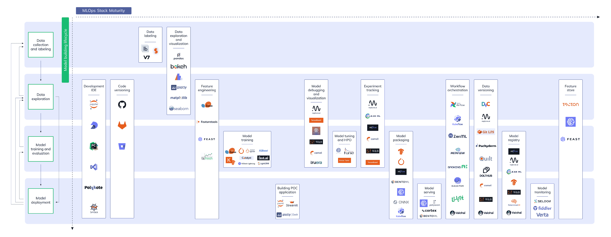

# 机器学习模型管理:它是什么，为什么你应该关心，以及如何实现它

> 原文：<https://web.archive.org/web/https://neptune.ai/blog/machine-learning-model-management>

机器学习正在兴起。因此，新的问题不断涌现，ML 开发者和技术公司一起不断构建新的工具来解决这些问题。

如果我们以一种非常基本的方式来看待 ML，我们可以说 ML 在概念上是一种增加了一点智能的软件，但与传统软件不同，ML 本质上是实验性的。与传统的软件开发相比，它有一些新的组成部分，例如:健壮的数据、模型架构、模型代码、超参数、特性等等。因此，自然地，工具和开发周期也不同。软件有 DevOps，机器学习有 MLOps。

如果听起来不熟悉，这里有一个关于 [DevOps 和 mlop](/web/20230101212152/https://neptune.ai/blog/mlops-what-it-is-why-it-matters-and-how-to-implement-it-from-a-data-scientist-perspective)的简短概述:

DevOps 是一套开发、测试、部署和操作大规模软件系统的实践。有了 DevOps，开发周期变得更短，部署速度加快，系统发布变得可审计和可靠。

MLOps 是数据科学家和运营专业人员之间进行协作和沟通的一套实践。应用这些实践可以提高最终质量，简化管理流程，并在大规模生产环境中自动部署机器学习和深度学习模型。这使得模型更容易与业务需求和法规要求保持一致。

MLOps 的关键阶段是:

*   数据采集
*   数据分析
*   数据转换/准备
*   模型开发
*   模特培训
*   模型验证
*   模型服务
*   模型监控
*   模型再训练

*MLOps tools landscape | Click the image to enlarge it*

我们将深入研究这一过程，所以拿起一杯你最喜欢的饮料，我们走吧！

## 什么是机器学习模型管理？

模型管理是 MLOps 的一部分。ML 模型应该是一致的，并且在规模上满足所有业务需求。为了实现这一点，一个符合逻辑、易于遵循的[模型管理策略](/web/20230101212152/https://neptune.ai/blog/data-science-project-management-in-2021-the-new-guide-for-ml-teams)是必不可少的。ML 模型管理负责 ML 模型的**开发、培训、版本**和**部署**。

***注*** *:版本化还包括* ***数据*** *，这样我们就可以跟踪哪个数据集，或者数据集的子集，我们用来训练模型的特定版本。*

当研究人员研究新的 ML 模型或将其应用于新的领域时，他们会使用不同的模型架构、优化器、损失函数、参数、超参数和数据进行无数次实验(模型训练和测试)。他们使用这些实验来获得最佳的模型配置，该配置概括了最好的配置，或者在数据集上具有最好的性能-精度折衷。

但是，如果没有一种方法来跟踪不同实验中的模型性能和配置，一切都可能(并将)失控，因为我们将无法比较和选择最佳解决方案。即使只是一个研究人员独立进行实验，跟踪所有的实验和结果也是很难的。

这就是我们做模型管理的原因。它让我们、我们的团队和我们的组织:

*   主动解决常见的业务问题(如法规遵从性)；
*   通过跟踪指标、损失、代码、数据和模型版本，实现可重复的实验；
*   以可重复的配置打包和交付模型，以支持可重用性。

* * *

**^(阅读更多)** [2020 年及以后的机器学习模型管理——你需要知道的一切](/web/20230101212152/https://neptune.ai/blog/machine-learning-model-management-in-2020-and-beyond)
[你需要知道的最好的机器学习模型管理工具](/web/20230101212152/https://neptune.ai/blog/best-machine-learning-model-management-tools)

* * *

## 为什么机器学习模型管理很重要？

正如我之前提到的，模型管理是任何 ML 管道(MLOps)的基础部分。从创建、配置、实验、跟踪不同的实验，一直到模型部署，管理 ML 生命周期变得更加容易。

现在，让我们更深入一点，明确区分 ML 模型管理的不同部分。需要注意的是，在 ML 模型管理中，我们管理两件事情:

*   **模型**:这里我们负责模型打包、模型沿袭、模型部署&部署策略(A/B 测试等)、监控和模型再训练(当部署的模型的性能下降到设定的阈值以下时发生)。
*   **实验:**在这里，我们记录培训指标、损失、图像、文本或您可能拥有的任何其他元数据，以及代码、数据&管道版本控制，

如果没有模型管理，数据科学团队将很难创建、跟踪、比较、重新创建和部署模型。

模型管理的替代方案是[特别的实践](/web/20230101212152/https://neptune.ai/blog/data-science-project-management-in-2021-the-new-guide-for-ml-teams)，这导致研究人员创建不可重复、不可持续、不可扩展和无组织的 ML 项目。

现在，除此之外，根据 AMY x . ZHANG *进行的研究，麻省理工学院等人关于[DS 工作人员如何协作](https://web.archive.org/web/20230101212152/https://arxiv.org/abs/2001.06684v2)的研究表明，DS 工作人员团队广泛协作，利用 ML 从数据中提取见解，而不是单个数据科学家单独工作。为了有效地协作，他们在团队成员之间采用最佳协作实践(即文档、代码版本等等)和工具，前者高度依赖后者。

MLOps 促进了协作，但当今对数据科学协作的大多数理解只关注数据科学家的观点，以及如何构建工具来支持数据科学家之间全球分散和异步的协作，如代码的版本控制。此类工具提供的技术协作仅仅触及了数据科学团队内部可能发生协作的许多方式的表面，例如:

*   当涉众在编写代码或收集数据之前讨论初始问题的框架时
*   评论实验
*   接管他人的笔记本或代码作为基础进行构建
*   研究人员和数据科学家对模型进行培训、评估和标记，以便 MLE 知道应该审查模型(即 A/B 测试)并将其推广到生产(模型部署)
*   拥有一个共享的存储库，业务涉众可以在其中审查生产模型(也称为模型注册中心)

**数据科学团队的协作程度如何？**

**协作率**:在上图的五个数据科学角色中，三个角色的协作率达到 95%或更高。你可以清楚地看到，这些角色是 ML 团队中的核心角色。

该研究还表明，研究人员、数据科学家、ML 工程师广泛合作，并在 ML 模型(ML 模型管理)的**开发、培训、评估(即准确性、性能、偏差)版本化**和**部署**中发挥关键作用

还不信服？以下是模型管理重要的另外六个原因:

*   允许真理的单一来源；
*   允许对代码、数据和模型工件进行版本控制，以实现基准测试和可再现性；
*   更容易调试/缓解问题(即过拟合、欠拟合、性能和/或偏差)，从而使 ML 解决方案易于追踪并符合规定；
*   你可以做更快、更好的研发；
*   团队变得高效，方向感清晰。
*   ML 模型管理可以通过使用各种最佳实践和工具(JupyterLab、Colab、Neptune.ai、MLflow、Sagemaker 等)来促进团队内部和/或团队之间围绕代码、数据和文档的协作；

## ML 模型管理组件

在我们继续之前，这里有一个 ML 模型管理工作流的通用组件的词汇表:

*   **:版本控制系统帮助开发者管理源代码的变更。而数据版本控制是一组工具和过程，其试图使版本控制过程适应数据世界，以管理与数据集相关的模型的改变，反之亦然。**
*   ****代码版本控制/笔记本检查点**:用于管理模型源代码的变更。**
*   **[**实验跟踪器**](/web/20230101212152/https://neptune.ai/blog/best-ml-experiment-tracking-tools) :用于跨不同配置(lr、epochs、优化器、损失、批量等)和数据集(train/val 拆分和转换)的多次运行，收集、组织和跟踪模型训练/验证信息/性能。**
*   **[**模型注册中心**](/web/20230101212152/https://neptune.ai/blog/best-alternatives-to-mlflow-model-registry) **:** 是一个简单的集中跟踪系统，用于训练、测试和部署 ML 模型**
*   **[**模型监控**](/web/20230101212152/https://neptune.ai/blog/ml-model-monitoring-best-tools) **:** 它用于跟踪模型的推理性能，并识别服务偏差的任何迹象，即当数据变化导致部署的模型性能降低到低于其在训练环境中显示的分数/准确度时。**

 **现在我们已经知道了模型管理的不同组件以及它们的作用，让我们来看看一些最佳实践。

## 机器学习模型管理的最佳实践

以下是 **ML 模型管理最佳实践**的列表:

### 模型

### 密码

### 部署

## ML 模型管理与实验跟踪

[实验跟踪](/web/20230101212152/https://neptune.ai/experiment-tracking)是模型管理的一部分，所以它也是更大的 MLOps 方法的一部分。实验跟踪是指在不同配置(超参数、模型大小、数据分割、参数等)的多次运行中收集、组织和跟踪模型训练/验证信息。

如前所述，ML/DL 本质上是实验性的，我们使用实验跟踪工具对不同的模型进行基准测试。

实验跟踪工具有 3 个主要特征:

*   **日志**:记录实验元数据(指标、损耗、配置、图像等)；
*   **版本控制:**跟踪数据和模型版本，这在生产环境中非常有用，可以帮助调试和未来的改进；
*   **Dashboard** :可视化所有记录和版本化的数据，使用可视化组件(图形)来比较性能，并对不同的实验进行排序。

* * *

**^(书签以备后用)** [ML 实验跟踪:它是什么，为什么重要，如何实现](/web/20230101212152/https://neptune.ai/blog/ml-experiment-tracking)
[跟踪机器学习实验的 15 个最佳工具](/web/20230101212152/https://neptune.ai/blog/best-ml-experiment-tracking-tools)

* * *

## 如何实现 ML 模型管理

在我们继续之前，让我告诉你一个小故事。

去年，我的一些客户给我带来了很多问题，因为我没有跟踪我的实验:

*   我不能有效地比较不同的实验，我凭记忆做所有的事情，所以项目被推迟了。
*   我很大程度上依赖于集成来尝试修补单个模型的缺陷，这些模型只能部分工作，但基本上没有结果。
*   不记录实验结果也造成了长期的问题，我无法回忆起以前版本的模型的性能。
*   部署正确的模型是棘手的，因为永远不清楚哪一个是最好的，使用了哪些代码、转换和数据。
*   再现性是不可能的。
*   CI/CD 和 CT 无法通过这种手工模型管理来实施。

我做了一些研究，发现了 ML 模型管理，并决定尝试一个实际的实验跟踪工具来加速我的过程。现在，没有我最喜欢的实验跟踪工具 [**海王**](/web/20230101212152/https://neptune.ai/) ，我连一个项目都不启动。

***注*** *:在本文创作期间，Neptune.ai 的旗舰产品从过去一个简单的实验跟踪工具发展到现在已经成为一个大得多的东西，更多关于这方面的内容请见工具部分。*

我一直在生产和研究中使用它，例如我为我的客户开发的定制 ML 模型项目，以及我最后一年的 CSE 学位项目。

还有许多其他工具，其中一些是用于管理整个 ML 生命周期的成熟平台，包括实验、可再现性、部署和中央模型注册。我们稍后将讨论这些工具。

因此，在对不同规模和需求的项目使用了与模型生命周期平台(在我的例子中是 MLflow)相结合的实验跟踪工具之后，我发现了 4 种实现 ML 模型管理的方法:

*   **Level-0******
*   **一级**
    *   日志+模型和数据版本控制
*   **二级**
    *   日志+代码、模型和数据版本控制
*   **三级**
    *   日志记录+代码、模型和数据版本控制+模型部署和监控

### 0 级

#### 特征

我称之为*特别研究模型管理*。在这个级别，您只是使用一个实验跟踪工具来进行**记录**。非常适合初学 ML 的初学者，或者做快速原型以证明假设是否值得追求的高级研究人员。

这个级别允许个人、团队和组织记录和查询他们的实验:

*   指标(准确性、IoU、Bleu 分数等)
*   损失(MSE、BCE、CE 等)
*   配置(参数，超参数)
*   从培训和测试中模拟性能结果

#### 赞成的意见

*   特定数据科学
*   研究和快速原型驱动

#### 骗局

*   无数据版本
*   没有模型版本
*   没有笔记本检查点
*   没有 CI/CD 管道
*   缺乏再现性

#### 挑战

通常，美国数据科学家喜欢运行多个实验来测试不同的想法、代码和模型配置以及数据集。在这个水平上，这是相当具有挑战性的。

*   首先，你没有遵循任何会给你明确方向的 [DS 项目管理方法学](/web/20230101212152/https://neptune.ai/blog/data-science-project-management-in-2021-the-new-guide-for-ml-teams)。因此，如果没有[标准化的方法来管理数据科学项目，](https://web.archive.org/web/20230101212152/https://www.kdnuggets.com/2019/02/data-science-agile-cycles-method-managing-projects-hi-tech-industry.html)您将经常依赖[不可重复、不可持续且无组织的临时实践](/web/20230101212152/https://neptune.ai/blog/data-science-project-management)。
*   其次，数据集不断更新，因此即使您记录了指标、损失和配置，您也不知道哪个版本的数据集用于训练特定的模型。
*   第三，代码也可能随着每次实验运行而改变，所以尽管保存了所有的模型配置，您可能不知道哪个实验中使用了哪个代码。
*   第四，即使您保存了模型的权重，您也可能不知道哪个模型是使用特定的配置和数据集训练的。

所有这些挑战使得任何特定实验的结果都不可能重现。为了解决这一级别的挑战，一个好的开始是向我们的模型和数据添加版本控制——一些实验工具开箱即用。这样我们就可以使部分再现成为可能。

### 一级

#### 特征

我把这个叫做*部分模型管理*。通常用于做快速原型的结构良好的团队。在这个层次上，除了实验跟踪之外，您还将模型及其元数据(配置)以及用于训练它的数据集或数据分割存储在一个中央存储库中，该存储库将用作单一的真实来源。

#### 赞成的意见

*   拥有数据版本
*   拥有模型版本
*   实验是部分可重复的
*   特定数据科学
*   研究和快速原型驱动

#### 骗局

*   没有 CI/CD 管道
*   缺乏再现性
*   没有笔记本检查点

#### 挑战

这个水平适合快速测试想法，而不需要完全投入其中。在研究环境中，它可能会非常有用，因为目标只是尝试有趣的想法，并在不同的个人、团队或公司之间比较实验。我们还没有考虑将它们投入生产。

虽然我们可以从用于训练它的模型元数据和数据集再现实验，但在这个层面上，我们仍然没有完全解决可再现性。我们只是部分解决了它。为了实现完整的循环，我们还需要一个组件——笔记本检查点，这样我们就可以跟踪代码的变化。

### 二级

#### 特征

我把这个叫做*半完整模型管理*。对于那些不仅想快速测试他们的假设，而且想将他们的模型部署到生产环境中的个人、团队和公司来说，这是非常棒的。

这个级别允许个人和组织通过存储和版本化他们的笔记本/代码、数据和模型来保存完整的实验历史，除了记录元数据之外。这让我们兜了一圈，使可再现性成为现实，并且无论使用 ML/DL 框架还是工具集都很容易实现。在这个级别，您通常还会应用标准化的方法来管理数据科学项目。

#### 赞成的意见

*   拥有数据版本
*   拥有模型版本
*   有笔记本检查点
*   实验是完全可重复的
*   再加上 DS 项目管理方法
*   生产驱动的

#### 骗局

#### 挑战

除了一件事:模型部署，您已经自动化了这个级别的所有东西。这就产生了压力。每当您有一个新的训练好的模型准备部署时，您必须手动部署它。为了完成 ML 模型管理管道，您需要集成 CI/CD。

### 三级

#### 特征

我称之为*端到端模型管理*。在这个级别，您拥有一个完全自动化的管道，从模型开发、版本控制到部署。该级别提供了生产级设置，非常适合寻求完整、自动化工作流程的个人、团队和组织。一旦你设置好了，你就不用再做操作工作了。您可以专注于调整和改进模型和数据源。

#### 赞成的意见

*   拥有数据版本
*   拥有模型版本
*   有笔记本检查点
*   实验是完全可重复的
*   再加上 DS 项目管理方法
*   生产驱动的
*   CI/CD 管道

#### 骗局

#### 挑战

在这一点上，只缺少一样东西——一种持续监控已部署模型的方法。也称为 CT(连续测试)管道，用于监控部署的模型，如果当前部署的模型的性能下降到设定的阈值以下，则自动重新训练并为新模型提供服务。让我们在生产环境中采用一个计算机视觉模型，如 ResNet。要添加 CT，只需监视和记录以下内容即可:

*   发送到服务器的数据(图像、视频、mp3、测试等)
*   模型的预测
*   置信度得分
*   [类激活图(CAM)](https://web.archive.org/web/20230101212152/https://heartbeat.fritz.ai/class-activation-maps-visualizing-neural-network-decision-making-92efa5af9a33) ，或改进的 [Grad-CAM](https://web.archive.org/web/20230101212152/https://www.pyimagesearch.com/2020/03/09/grad-cam-visualize-class-activation-maps-with-keras-tensorflow-and-deep-learning/) ，以更好地解释为什么它预测了某个标签以及它关注的地方

要将此功能添加到组合中，您可以在训练期间重用来自 0 级或 1 级的相同代码来记录元数据，并将其用于推断。

像 Neptune 和 MLflow 这样的工具允许您在本地安装它们的软件，因此您可以将这种功能添加到您的部署服务器中。Neptune 在这里更强大，它为个人和团队提供了第二种选择，即轻量级 web 版本的软件，因此不需要安装和配置任何东西，只需在仪表板上创建一个新项目。只需在部署代码中添加几行代码，就可以完成了。

### 什么是机器学习(ML)模型注册表？

ML 模型注册中心是一个简单的集中跟踪系统，用于训练、分级和部署 ML 模型。它还跟踪谁创建了模型，以及用于训练它的数据。它通过使用数据库存储模型沿袭、版本、元数据和配置来实现这一点。

构建自己的简单模型注册中心相对容易。您可以通过使用一些本机或云服务(如 AWS S3 桶、RDBMS (Postgresql、Mongo…)以及编写一个简单的 python API 来轻松更新数据库记录，以防发生更改或更新。

虽然构建模型注册中心相对容易，但这是否意味着您应该这样做呢？它真的值得你花费时间、金钱和资源吗？

为了回答这个问题，让我们首先来看看为什么您可能想要构建自己的 ML 模型注册中心:

*   **隐私:**您的数据不能离开您的办公场所。
*   好奇心:和我一样，你喜欢建造东西。
*   **业务:**你在一家构建 ML 工具的公司运营或工作，你想把它添加到现有的产品中，或者作为一项新的服务提供给客户。
*   **成本:**现有工具对您的预算来说太贵了。
*   **性能:**现有工具无法满足您的性能需求。

所有合理的理由，除了成本，因为大多数现有的工具都是开源或免费的。

如果您关注的是性能，一些工具提供了很好的性能，因为它们提供了专用的云服务器实例，只需要很少的设置(如 Neptune 和 Comet)。

现在，如果你担心的是隐私，大多数工具也提供了他们软件的本地版本，你可以下载并安装在你组织的服务器上，以获得对进出数据的完全控制。这样您可以遵守法律法规，并保护您的数据安全。

在我看来，我认为在构建与购买之间存在一个普遍的误解。一些通常更成熟的团队/开发人员马上就能理解的东西，但是大多数 ML 社区仍然没有真正理解。

托管、维护、记录、修复、更新和调整开源软件的成本通常比供应商工具的成本高几个数量级。

事实是，为自己构建一个简单的、不可扩展的、没有文档记录的系统通常是相对容易的。

…但是，从这个系统过渡到一个可以让整个团队快速工作的系统会变得非常昂贵。

另外，当你决定构建它(甚至不是开源的)时，你会发现有人需要构建/维护它，而 ML 工程师和 devops 人员的工资并不便宜。

通常有一个很好的经验法则-->如果系统(如 ML model registry)不是你的核心业务，而且通常不是，那么你应该专注于你的核心业务(例如为自动驾驶汽车构建模型)，并为你没有建立竞争优势的部分雇佣/购买解决方案。

这么想吧，你会去创建一个 gmail 吗，因为你可以？

或者像 mailchimp 这样的邮件发送系统？

还是 wordpress 之类的 CMS？

有些公司会，尽管这不是他们的业务。这通常是一个很大的错误，因为你专注于制造铁锹而不是挖掘黄金:)。。

如果只是为了好玩，或者如果你经营一家构建 MLflow 或 Neptune 等 MLOps 工具的公司，那么构建自己的模型注册中心是最有意义的。

在许多其他情况下，这只是不合理的投资。

公司已经投资了数十亿美元来创造伟大的、免费的和/或优质的工具。这些工具中的大部分都可以很容易地扩展到适合您自己的用例，节省您的时间、金钱、资源和麻烦。

现在，让我们详细看看一些最流行的工具。

请记住，当谈到下面描述的工具时，我有我个人的偏好，但我尽量做到客观。

Neptune 现在是 MLOps 的元数据存储库，为运行大量实验的研究和生产团队而构建。

它为您提供了一个中心位置来记录、存储、显示、组织、比较和查询机器学习生命周期中生成的所有元数据。

成千上万的 ML 工程师和研究人员使用 Neptune 进行实验跟踪和模型注册，无论是作为个人还是在大型组织的团队内部。

这是一个非常灵活的软件，可以与许多其他框架和库一起工作。

Neptune 拥有团队协作和项目监督所需的所有工具。

有了 Neptune，您可以用一个包含所有模型构建元数据的真实来源来替换文件夹结构、电子表格和命名约定。

**优点**

*   数据版本化
*   模型注册表
*   实验跟踪
*   您可以在自己的硬件上安装服务器版本，或者通过客户端库将其作为服务使用
*   为用户和组织管理提供组织、项目和用户角色
*   快速美观的用户界面，具有多种功能，可以分组组织跑步，保存自定义仪表板视图，并与团队共享
*   您可以使用托管应用程序来避免维护另一个工具的所有麻烦(或者将其部署在您的内部基础架构上)
*   你的团队可以跟踪在脚本(Python，R，other)和笔记本(locCoal，Google lab，AWS SageMaker)中执行的实验
*   广泛的实验跟踪、可视化和比较能力；
*   与其他工具轻松集成
*   提供 100 GB 存储的免费托管服务选项，无限的实验，私人和公共项目
*   免费的托管服务选项非常适合个人，但仅限于个人，而小型和大型团队都有付费选项。
*   免费的托管服务已经准备好投入生产，您可以复制实验
*   [付费托管服务选项](/web/20230101212152/https://neptune.ai/pricing):
    *   [**团队包**](/web/20230101212152/https://neptune.ai/pricing) 无限实验，私人和公共项目。
    *   [**企业包**](/web/20230101212152/https://neptune.ai/pricing) 无限会员，自定义存储，无限实验，私有和公有项目

**缺点**

*   缺乏数据管道版本控制
*   如果有更高级的 API 功能就太好了。
*   创建多行图形的 UI 应该更加灵活。

MLflow 是一个管理整个**机器学习生命周期(MLOps)的开源平台。**实验、可复制性、部署、中央模型注册中心，一切尽在其中。MLflow 适合个人和任何规模的团队。

该工具与库无关。你可以在任何机器学习库和任何编程语言中使用它。

MLflow 于 2018 年推出，由于其与 Tensorflow、Pytorch、Scikit-learn、Kubernetes 和 Sagemaker 等主要 ML 框架、工具和库的轻松集成，迅速成为行业标准。它有一个庞大的用户和贡献者社区。

MLflow 有四个主要功能来帮助跟踪和组织实验和模型:

*   **ml flow Tracking**——一个 API 和 UI，用于在运行机器学习代码时记录参数、代码版本、指标和工件，并用于以后可视化和比较结果；
*   **MLflow 项目**–以可重用、可复制的形式包装 ML 代码，以便与其他数据科学家共享或转移到生产中；
*   **ML flow Models**–管理来自不同 ML 库的模型并将其部署到各种模型服务和推理平台；
*   **MLflow Model Registry**–中央模型库，协作管理 ml flow 模型的整个生命周期，包括模型版本控制、阶段转换和注释。

**优点**

*   实验跟踪
*   与其他工具和库轻松集成
*   直观的 UI
*   大社区和大支持
*   免费的托管服务选项(MLflow Community edition)带有预配置的 ML 环境，包括:Pytorch、TF keras 和其他库。
*   MLflow 社区很棒，仅限个人，而付费是团队。
*   通过云提供商提供的付费托管服务选项，附带预配置的计算和 sql 存储服务器。这项服务是按秒计费的。

**缺点**

*   缺乏数据管道版本控制
*   MLflow 模型可以改进
*   MLflow 社区实验比较 UI 可以简化
*   MLflow 社区加载缓慢，无法用于生产
*   MLflow 社区有一个限制为 15GB 的集群，没有工作节点
*   MLflow Community edition 不包含运行和复制 MLflow 项目的功能。并且它的可伸缩性和正常运行时间保证是有限的。

Amazon Sagemaker 是一个端到端的 MLOps 平台，拥有一套工具来收集、准备和版本化数据，以及构建、培训、版本化、部署和监控 ML 模型。

我将这个平台用于我的 ML 管道的一些部分，比如训练大型模型，或者当我运行性能要求高的任务(图像或文本处理)时。根据我的经验，我可以对初学者这么说:Sagemaker 对初学者来说远不容易使用，它有一个陡峭的学习曲线，但是一旦你获得一些经验，它就会变得非常有用和有帮助，就像瑞士军队的绝地刀一样。

**优点**

*   为您使用的东西付费
*   提供集中控制
*   提供一个由生成管理的 Jupyter 笔记本
*   提供很大的自由和定制(你可以集成其他工具，如 MLflow，Neptune 等)
*   提供了一种简单直接的方法来构建训练和测试样本
*   使用 conda 进行包管理
*   出色的硬件选项
*   可量测性
*   所有的培训、测试和模型都存储在 S3 上，所以很容易访问
*   轻松部署 API
*   数据管道版本控制

**缺点**

*   昂贵的
*   不清楚和冗长的文件
*   可以更好地管理实验跟踪日志
*   没有模型比较用户界面
*   陡峭的学习曲线
*   大量样板代码

Azure 机器学习是微软的云 MLOps 平台。像 Sagemaker 一样，它是完整 ML 生命周期的端到端工具。

**优点**

*   为您使用的东西付费
*   它允许您为培训和部署模型创建可重用的软件环境
*   它提供关于 ML 生命周期中事件的通知和警报
*   出色的用户界面和用户友好性
*   广泛的实验跟踪和可视化功能
*   出色的表现
*   连接性，在 Azure ML 上嵌入 R 或 Python 代码非常容易，如果你想做更高级的东西，或者使用 Azure ML 上还没有的模型，你可以简单地复制+粘贴 R/Python 代码

**缺点**

*   对个人来说很昂贵
*   可能会有更多的型号
*   难以集成数据来创建模型
*   难以与其他工具集成
*   你总是需要一个良好的互联网连接来使用它。

关于 MLOps 的更多信息，请查看我之前的文章 [MLOps:它是什么，它有什么关系](/web/20230101212152/https://neptune.ai/blog/mlops-what-it-is-why-it-matters-and-how-to-implement-it-from-a-data-scientist-perspective)；关于可用的最佳 MLOps 工具，请参见 Neptune 的 Jakub 的[最佳 MLOps 工具](/web/20230101212152/https://neptune.ai/blog/best-mlops-tools)。

## 结论

机器学习模型管理是 MLOps 工作流程的基础部分。它让我们将模型从开发阶段带入生产阶段，使得每个实验和/或模型版本都是可复制的。

最后，总结一下，ML 模型管理有 4 个级别:

*   0 级，即席研究模型管理
*   第 1 级，部分模型管理
*   第二级，半完整模型管理
*   第 4 级，完整的(端到端)模型管理

在每一关，你都会面临不同的挑战。ML 模型管理的最佳实践围绕 3 个部分展开:

就工具而言，我们有太多的选择，但是在本文中，我描述了几个流行的工具:

*   MLflow
*   海王星 AI
*   Sagemaker
*   天蓝色 ML

我希望这能帮助你选择正确的工具。

谢谢你阅读这篇文章，请继续关注。一如既往，我创建了一个长长的参考列表，供您探索，玩得开心！

## 参考

**构建您自己的模型注册中心**

**工具****