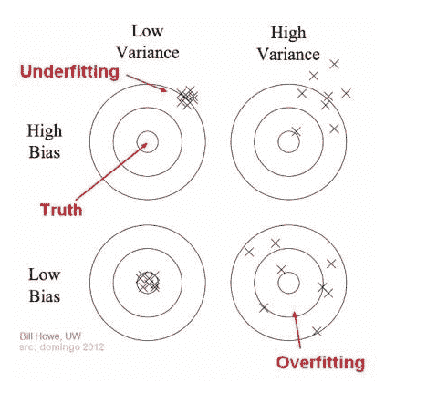
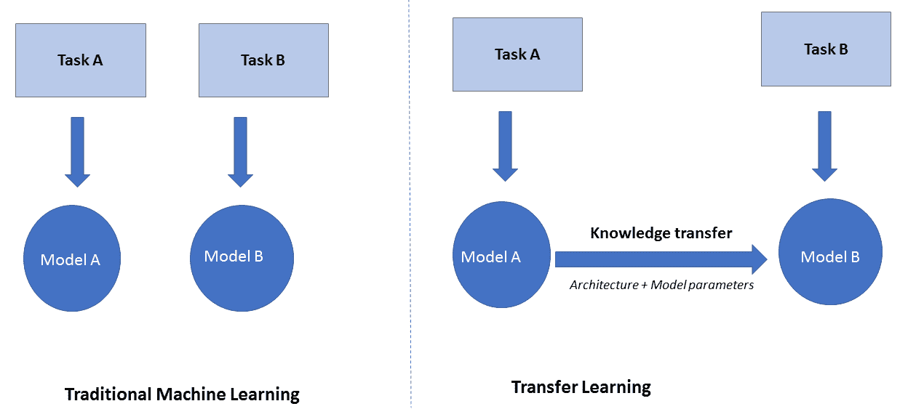
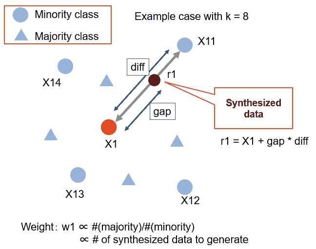
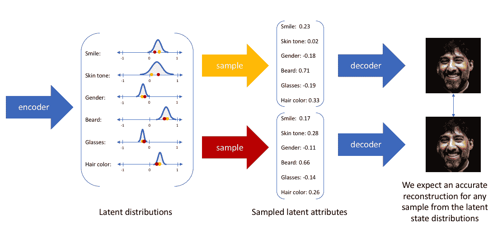

# 如何用更少的数据启动机器学习项目

> 原文：<https://web.archive.org/web/https://neptune.ai/blog/machine-learning-project-with-less-data>

如果机器学习解决方案是汽车，那么它们的燃料就是数据。简单来看，ML 模型是需要数值和变量来运算的统计方程，数据是 ML 成功的最大功臣。

如今，数据来源丰富，可用数据的数量呈指数级增长。这使得我们能够争论，弯曲，并从一堆不必要的噪音中选择正确的数据集。

但是，当您的数据较少并且似乎不足以训练模型时，会发生什么呢？嗯，一辆汽车能靠低燃料跑很多英里吗？答案是肯定的和否定的，这取决于车型的类型和燃料的质量。如果答案是“是”，那么下一个问题就是:汽车怎么这么节能？

同样，如何构建数据高效的 ML 解决方案？

为了理解这一点，让我们从讨论数据不足的原因开始。

## 数据不足的原因

尽管每天生成的数据呈指数级增长，但一些专有类型的数据仍然来源有限。例如，来自完全自动驾驶汽车(新技术)的罕见疾病数据或事故统计数据。对于这样的数据，可扩展的选项是有限的，现有的数据是尝试和挖掘价值的全部。

即使数据在本质上不是排他性的，客户端也可能是。例如，如果是一家新公司，客户的财务数据可能会受到限制。

*   **损坏或故障的数据源**

如果数据源或记录数据的设备有问题，可能会导致丢失值。例如，如果您有一个数据集来检查特定机器的活力，如果一些传感器在机器的生命周期中途出现故障，并且由于高成本-有用性比率而没有修复，则信息可能是有限的。

现实生活中数据集最常见的问题是不同类别数据之间的不平衡。您可以拥有一个包含一百万条正样本记录的巨大数据集，但是如果数据集只有一百条负样本记录，模型将很难了解这两个类之间的差异。不平衡数据中少数类的一些实例包括银行数据中大额借记交易或关闭时间的欺诈案例、安全异常、预测性维护数据中的故障实例以及罕见疾病数据中的阳性案例。

这些是数据短缺的广泛例子，但是没有足够的数据用于您的模型可能还有更多原因。当这个问题发生时，我们如何解决它？

## 偏差方差权衡

当数据非常少时，训练数据就像是一种有限的资源。因此，为了不中断整个建模过程，必须彻底考虑偏差和方差的基本概念，以最小化原始值和预测值之间的误差。

### 偏见

偏差是机器学习模型用来使学习过程更容易的假设。例如，线性回归模型假设因变量和自变量之间存在线性相关性。

**高偏差**模型是对数据做出重大假设的模型。例如，线性模型，如线性回归、K 均值和逻辑回归。

**低偏差**模型对数据做出更少的假设，更擅长学习目标变量和独立变量之间的新型关系。例如，非线性模型，如决策树、随机森林和 K-NN 算法。

### 差异

方差是估计的目标变量将随着训练数据的改变而改变多少的度量。更简单地说，它衡量训练模型的稳定性。如果有很多变化，这意味着模型没有学习模式，而是学习训练数据中的噪声。

**高方差**模型对数据的变化很敏感，可以显示不同训练集之间的主要差异。这就是为什么他们需要用多重数据的迭代来训练和测试。对于低容量的数据，折叠不必是唯一的，甚至可以包含来自其他折叠的数据点。高方差模型的例子有决策树和随机森林。

**低方差**模型对训练数据的变化不太敏感，主要是因为对数据的固定假设。例如线性回归和线性判别分析。

### 权衡取舍

从偏差和方差的定义中可以清楚地看出，最终目标是将偏差和方差都降低到最小——一种很少假设的高稳定性状态。

偏差和方差是间接成正比的，两者达到最小值的唯一途径是在交点处。偏差和方差的计算是不可能的，因为我们不知道目标函数。然而，考虑到这些概念来选择和调整模型可以大大减少测试误差(通常是实际值和估计值之间的均方误差)。

## 过度拟合和欠拟合

对于任何数量的数据，如果模型处理不当，都有过度拟合和欠拟合的风险。然而，当数据量很小时，更可能的情况是过度拟合。开发人员可能希望最大化可用数据，在这样做的时候，错误地让模型学习噪音和偏差。

过度拟合是指模型被训练得过于贴近训练数据。在高层次上，模型不认为训练数据是近似值，而是认为它是绝对的。因此，当模型对一组训练数据过度拟合时，它无法对新的和看不见的数据集执行。

**过度拟合**在大多数情况下是可能的，因为非线性和灵活的模型可以密切跟踪具有高方差的数据。例如，随机森林算法可以分支多次，以适应大范围的数据。

**欠拟合**是指模型没有很好地从现有数据中学习。这可能是由多种原因造成的，但如果数据具有较高的方差且所选模型具有较高的偏差，则大多数情况下是在低容量数据中。例如，对与输出变量无关的数据使用线性回归。

*Fig 2: Underfitting and Overfitting demonstrated through Bias and Variance | Image from [towardsdatascience.com](https://web.archive.org/web/20221206024107/https://towardsdatascience.com/understanding-the-bias-variance-tradeoff-165e6942b229)*

## 如何避免在小数据集上过度拟合

如上所述，少量数据的主要问题是过度拟合。让我们看看如何解决这个问题。

低复杂度的模型不太灵活，也不太适应高方差数据。具有高复杂性的模型将试图记录数据的最小偏差，并且倾向于学习噪声。低复杂度的模型可以包括线性模型，如逻辑回归和线性回归。

然而，如果数据本质上不是线性的，这些模型就不会表现得很好。在这种情况下，建议使用非线性模型，如决策树和随机森林。为了限制这些基于树的算法的复杂性，可以对参数进行微调。例如，在限制 max_depth 参数后，树只增长到某个级别，并停止记录进一步的数据偏差。

如果你不正确对待，离群值会显著影响学习的轨迹。当数据集规模已经很小并且模型没有什么可学习的时候，遇到异常值可能会错误地改变目标函数，尤其是当模型具有高方差时。当异常值表示欺诈或黑客攻击等关键事件时，不建议移除异常值。

*   **最优特征工程**

这里，特征工程广义地定义了特征选择和特征创建。使用更少的数据，从有限的原始列创建多个有用特性的能力可以真正改变游戏规则。有一次，我遇到一个只有四个原始列(其中 3 个是日期)的项目，团队能够从这四个列中设计出大约 50 个新特性！

原始列是简单的数据，经过智能解释后可以提供更大的价值。例如，在从股票数据预测股票价格时，交易数量的简单特征与交易数量的变化率或随时间的差异相比，通常不太直观。

即使原始列的数量较少，特征工程也不必扩展的一种情况是当使用神经网络时。这是因为神经网络自己创建和选择特征。

过度拟合源于高方差，而[集成学习](/web/20221206024107/https://neptune.ai/blog/ensemble-learning-guide)是一种在不降低模型复杂性的情况下降低模型方差的方法。这是达到偏差-方差平衡的一种独特方式。根据定义，集成学习结合几个模型来计算每个模型的组合结果。这意味着您可以使用高偏差和高方差模型的组合来获得两全其美！

集成学习有三种主要形式:打包、提升和堆叠。如果你感兴趣，还有第四种类型的集成，称为级联——它处理高度不平衡的数据。所有不同类型的集成学习都是组合模型的技术。

过度拟合的问题是，随着训练数据的改变，测试数据的性能完全改变。理想情况下，对于不同的训练数据集，性能应该保持一致，这表明模型已经能够通过过滤掉噪声来提取基础数据模式。

这就是[交叉验证](/web/20221206024107/https://neptune.ai/blog/cross-entropy-loss-and-its-applications-in-deep-learning)进入图片以检查训练模型的一致性的地方。顾名思义，交叉验证是一种在验证数据的不同折叠上迭代测试模型的验证技术。

最常用的技术是 k 倍交叉验证。首先，我们将训练数据集分成 k 个折叠。对于一个给定的超参数设置，k 个折叠中的每一个都轮流成为拒绝验证集；然后，在剩余的 k-1 个褶皱上训练一个模型，并在保持褶皱上进行测量。

正如在“数据不足的原因”中所讨论的，一些数据类型的来源有限，因此数据量也有限。例如，如果有人想训练一个模型来预测对客户关怀电话的回复，他们需要根据过去对话的有限记录来训练模型。

这就是迁移学习非常有用的地方。由于该组织的客户关怀部门的对话记录有限，因此没有足够的数据供模型学习语法或解释新客户可能键入或说出的新单词。因此，已经在具体语料库(单词集合)上训练的模型可以与新模型集成。这就是从现有模型中获得的经验如何“转移”到新的解决方案中。这只是一个高层次的例子。迁移学习的概念和应用是巨大的。

*Fig 4: Transfer Learning | Image from [O’Reilly](https://web.archive.org/web/20221206024107/https://www.oreilly.com/library/view/intelligent-projects-using/9781788996921/2231d733-c07c-4248-bdd9-18e66b758927.xhtml)*

## 如何扩展数据集

以最小的过度拟合高效地处理更少的数据是值得称赞的，但是在大多数情况下，有确定的方法来扩展数据集的大小。

### 技术途径

*   **合成数据增强**

当通过各种技术(如近似法)从现有数据中生成数据时，这被称为合成数据扩充。合成数据与原始数据相似，但为机器学习模型学习数据趋势提供了足够的方差。

SMOTE 或合成少数过采样技术是通过克服数据不平衡来消除过拟合的另一种方法。另一种消除数据不平衡的方法是对多数类进行欠采样，但这会导致数据丢失，这是不利的，尤其是当数据量较小时。

与随机过采样技术不同，SMOTE 专注于少数类，并通过相邻点之间的插值来创建与之相似的新数据点。SMOTE 使用 K-最近邻算法来识别邻居。

*Fig 5: New datapoint X1 being created between 4 neighbors | Image from [Github](https://web.archive.org/web/20221206024107/https://github.com/minoue-xx/Oversampling-Imbalanced-Data)*

SMOTE 的一个明显缺点是，它倾向于在两个不同类别的边界线附近创建模糊的数据点。例如，当 X13 和 X12(参见上图)来自 A 类，而 X14 和 X11 来自 b 类时，就会出现这种情况。这是点 X1 的分类变得复杂而不是简单的情况。

因此，边界线 SMOTE 考虑了边界线附近被错误分类的困难点，并且仅在该部分中生成更多的样本，以通过体积使区别更加清楚。

ADASYN 或自适应合成采样方法是 SMOTE 的另一种形式，也对少数类进行过采样。然而，与 SMOTE 和边界线 SMOTE 不同，ADASYN 考虑数据分布的密度，并相应地决定在特定区域中需要生成多少数据点。

因此，在特征空间中密度低的地方，ADASYN 将生成更多的样本，反之亦然。下图显示，对于每个正在创建的新点，ADASYN 都会考虑 8 个相邻点区域内多数类和少数类的相对密度。创建的数据点数量与密度成正比。

*Fig 6: ADASYN at play | Image from [Github](https://web.archive.org/web/20221206024107/https://github.com/minoue-xx/Oversampling-Imbalanced-Data)*

GANs(生成对抗网络)是人工智能领域的一个有趣的发明。大多数关于机器完成出色的类似人类任务的新闻文章都是关于甘斯的工作。

在现实世界中，你可能已经注意到，面对逆境或竞争，生物往往会变得更强大。一颗种子击败了它的兄弟姐妹和邻近的种子，长成一棵强壮健康的树，随着世代的延续，增加了更强壮的后代的机会。类似地，一个拳击竞争者估计他/她的竞争者的质量，以相应地做好准备。竞争者越强，准备的质量越高。

甘人几乎模仿真实世界，效仿并遵循对抗性训练的体系结构。对抗训练无非是“比较学习”。研究可用的样本，使得 GAN 可以创建来自相同类别的样本的其他实例。GAN 的目标是创建缺陷最少的样本，使它们与原始数据集无法区分。例如:GAN 可以创建新的文森特梵高风格的绘画，这样它看起来像是由画家自己创建的(GAN 还没有这么先进，但这是潜在的概念)。

在 GAN 中有两个对应物:发生器和鉴别器。发生器的工作是调整 GAN 的输出，使它们与原始信号无法区分。鉴别器的工作是判断生成的片是否合格，是否可以与已经存在的样品同等分类。否则，重复该循环，除非发生器产生足够好的样本，鉴别器不能从原始样本组中区分该样本。

变分自动编码器是深度神经网络，它依靠概率来创建新样本，特别是对于不平衡的数据。[杰瑞米·乔登](https://web.archive.org/web/20221206024107/https://www.jeremyjordan.me/variational-autoencoders/)用一个出色的例子通过简化的直觉传达了变分自动编码器(VAE)的功能。

在该示例中，需要生成人脸的图片，使得新的人脸与原始样本集无法区分。因此，对于 VAE 遇到的每一张新图像，它都会创建该图像每个特征的概率分布。例如，微笑的人的概率分布，或者头发是直的概率分布等。

一旦一组这样的分布可用，VAE 从分布中随机采样(从分布中选择的随机特征值)以重建图像，因此在概率范围内创建同一图像的多个变化。

*Fig 8: VAE used to create variations in the same image | Image by [Jeremy Jordan](https://web.archive.org/web/20221206024107/https://www.jeremyjordan.me/variational-autoencoders/)*

数据池意味着收集相关数据并将其添加到现有数据集中。这是一个敏感的过程，需要小心处理:

*   **了解数据缺陷**

要汇集相关数据，您需要了解数据中现有的缺陷类型。例如，如果有人缺乏维生素，最好的方法是找出哪种维生素缺乏，一旦确定，只服用特定维生素的补充剂。

类似地，在冒险寻找丢失的部分之前，数据中的缺陷类型是一个关键阶段。是数据有缺失值，还是不平衡，缺少少数数据点？数据是否缺少一些重要的特征或者需要更多的行/数据点？在搜索更多可以整合到现有数据集中的数据之前，必须考虑这样的问题以及更多的问题。

*   **了解统计缺陷**

一旦具体的缺陷问题(如缺失数据和数据点或特征不足)得到解决，还需要一个步骤来识别数据模式中的缺陷。

例如，如果收集了一个班级 10 名学生的身高，则不足以创建一个分布。鉴于数据的规模，即使经过过采样，数据也可能不符合任何分布，因为，比方说，这个班级碰巧有大多数高个子学生。然而，我们已经有了很多开源的身高数据，正如我们所观察到的，它们趋向于高斯分布。

因此，为了能够使样本集符合适当的分布，您需要确定一个相似的数据源，并以最小的偏差仔细采样。

与上面的高度示例一样，识别相似的数据源有助于扩展数据集，而不会对样本集的完整性造成太大损害。大多数数据都不是唯一的，大多数数据都是有用的，并且具有提供洞察力的内在目的。

*   **了解业务限制并相应扩展**

通过外部数据源进行扩展的一个限制是，它可能不符合业务需求。考虑两个客户端及其数据集，它们在分布和功能方面看起来很相似，但由于生成数据的过程完全不同而无法集成。这限制了未来因业务流程变化而造成的中断。同样，这意味着在为什么两个数据集被整合的背后必须有一个逻辑推理。

*   **了解合规限制**

数据池也会引发安全问题。因此，在处理投入生产的实际解决方案时，开发人员需要小心诸如数据来自哪里，或者现有数据是否保密之类的事情。例如，一个组织可能有 10 个具有相似数据的专属客户，但是如果每个客户都让该组织签署了保密协议，则没有数据可以交换以用于最佳模型构建。

### 非技术途径

一些非技术性的、面向业务的方法也可以帮助数据团队收集更多的数据来扩展现有的数据集。

*   **创建免费应用程序来收集数据**

创建一个有用的应用程序可以带来大量的数据，尤其是如果这个应用程序是免费的。例如，组织可以使用记录用户睡眠模式以帮助他们维持更好的睡眠周期的应用程序来了解睡眠模式不佳的根本原因。

如果你在免费的问答网站上玩得开心，你一定遇到过可选的数据调查。即使是测验数据，如果设计得当，也可以用来记录和扩展现有数据。通常，大型研究项目使用来自多个网站的数据来生成一个巨大的语料库，以研究大规模模式。发送调查的其他方式是通过电子邮件或目标频道上的主动广告。

一些受欢迎的网站和频道收集并保存大量数据，然后出售给需要的组织。一个流行的例子是脸书，它跟踪用户行为并将这些数据出售给广告商，这样他们就可以锁定行为符合特定消费模式的用户。这里需要注意的一点是，只与可信的买方或卖方交换数据。

## 最后一个音符

每隔一天，就会有更先进的技术(GANs 是一种相当新的技术)取代旧的技术，数据扩展或现有数据优化的可能性和方法是无止境的。

我们已经探索了几种技术，我建议您更深入地学习您最喜欢的技术。

*注:我使用了来自医疗保健* 的 [GANs 的自引](https://web.archive.org/web/20221206024107/https://medium.com/terenz/gans-in-healthcare-1a44f41c2d84)