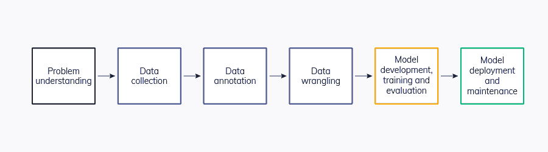

# 能让你的 ML 团队会议更有效的 9 件事

> 原文：<https://web.archive.org/web/https://neptune.ai/blog/machine-learning-team-meetings>

根据 WaveStone 的一份报告，超过 90%的领先公司目前正在对人工智能进行投资——这是一个重要但并不令人惊讶的结果，反映了机器学习时代的蓬勃发展。由于其数据不可知的性质，其应用迅速扩展(例如，完全连接的网络可以用于天气预报以及房价预测)。随着企业集团的成功，许多初创公司也出现了，为传统问题提供现代人工智能解决方案。

然而，就像任何其他技术一样，成功的采用需要有组织的协作，然后是计划周密的执行。由于机器学习相对来说是小众的，并且与许多其他计算机科学领域有很大不同，公司，特别是初创公司可能会努力找到最佳策略来将机器学习融入日常生产中。因此，会议成为决定 ML 项目最终结果的一个重要方面。

这篇文章深入探讨了一些可以提高你的 ML 会议效率的小技巧。特别是，我们在 ML 项目开发的不同阶段提供会议提示，以确保整个过程的顺利进行。

## 先决条件

本文特别关注较大规模的 ML 模型(例如深度学习模型)，而不是传统的较小模型(例如线性/逻辑回归)，因为较大的模型表现出更多需要缓解的问题，以进行更有效的会议。为了给出更具体的视角，我们首先提供深度学习模型如何工作的概述。

深度学习是传统机器学习模型的一个分支，它利用了一种称为神经网络的特定类型的模型。神经网络受到具有多个神经元的复杂大脑结构的启发，神经元的激活是网络的最终预测。

对一个神经网络来说，人们必须通过一大组数据集，计算预测和增长真相答案之间的差异，并“反向传播”以更新神经元。反向传播必须重复进行，以允许模型缓慢地收敛到接近最优的解。随着可用数据的增多或模型复杂性的增加，处理时间也会增加。

为此，如何及时组织会议并避免浪费时间变得尤为重要。

## 前期——在实施 ML 项目之前

当提出一个 ML 项目时，无论该项目最终会给公司带来什么好处，都应该首先从现实世界的角度考虑项目的可行性。以下是需要强调的要点(有些是在会议之前，有些是在会议期间):

### 1.有可用的数据集吗？

在参加会议讨论您的项目之前，您应该对哪些数据集可能适用于您的任务有一个大致的了解。当你的任务应该被监督时，这一点尤其重要。也就是说，使用您的预测来计算误差和损失函数需要基本事实。

数据收集是劳动和时间密集型的，因此，在确认是否有足够的数据来执行训练之前，跳入 ML 项目并开始设计架构是低效的。

#### 如何进行粗略检查？

*   公共数据集通常在 Kaggle/publications 上提供。第一步是浏览并查看是否有任何数据集与您的目标应用程序相同或相似。

*   如果数据集有些相似但不完全相同，那么您的团队可能需要收集一些额外的数据，并将其添加到您的训练集中。请注意，根据您团队的规模，这将占用大量时间。

*   最后，如果没有一个数据集是相似的，那么最好在一系列会议开始时解决这个问题，让团队知道。

### 2.在任何实施之前研究最先进的架构&让您的会议成为方法的分享会议

*State-of-the-art Machine Learning algorithms | [Source](https://web.archive.org/web/20221206125646/https://towardsdatascience.com/overview-state-of-the-art-machine-learning-algorithms-per-discipline-per-task-c1a16a66b8bb)*

*   虽然 PyTorch 和 Tensorflow 等库已经使神经网络的实现相对简单，但重要的是收集和分析以前的技术，而不是从头开始构建一个全新的网络。ML 是一个快速发展的社区，每次会议都有数千篇论文(和潜在可用的代码)发表。快速发展意味着今天采用一篇论文将大大加快你的设计阶段，并允许你做更多的测试。

*   一些值得注意的研究方法是浏览相关的顶级 ML 场所，如 ICLR、ICML、AAAI 的 NeurIPS，以及特定领域的会议，如 CVPR/ICCV 的计算机视觉和 ACL/EMNLP 的自然语言处理。虽然这项任务看起来很耗时，但是通过知道使用正确的工具，它将大大减少项目的实施时间。

*   提前搜索这些架构，并让你的会议成为一个分享会议，这也是让每个团队成员跟上进度的有效方法。事实上，这种会议已经被学术界的研究小组广泛采用。许多论文需要复杂的数学推导和理解，所以一个人的报告将极大地促进小组内的理解。

### 3.计算可行吗？

在决定项目和方法之后，在开始阶段解决项目的可行性也很重要。可行性的含义远远超出了“训练这个模型可能吗”，还延伸到“我们能不能训练这个模型”。这是现代深度学习问题中存在的一个关键问题；变压器等模型可能需要多个高端 GPU 来进行推理！下面我们描述值得在早期 ML 会议中讨论的记忆和时间限制。

#### 计算开销

虽然经验法则是更复杂的模型通常在更复杂的情况下执行得更好，但是在准确性和存储空间要求之间经常存在折衷(例如，视觉转换器(ViT)通常比 ResNet 执行得更好，但是同时也大得多)。因此，深入研究您可能要实现的方法并交叉检查文章中关于所用 GPU 的任何实现细节是非常重要的。很多时候，牺牲一些准确性来保证生产顺利进行是可行的(也是明智的)。

#### 训练时间

深度学习模型的另一个缺点是它们的训练时间。与学术界可能需要更长的培训时间不同，初创公司在将模型投入生产之前有一个时间表。在这种情况下，像培训前的无监督学习这样的项目，以其长时间的培训而闻名，可能不是一种可行的方法。综合考虑训练时间和计算资源也很重要，30 分钟的 TPU 训练可能意味着 Nvidia 1080Ti 的 2 周！

另一方面，一个解决方案可能是找到并使用预先训练的检查站，以节省培训成本。针对 ViT、ResNet、 [BERT](/web/20221206125646/https://neptune.ai/blog/how-to-code-bert-using-pytorch-tutorial) 等流行网络架构，在大规模数据集(如 ImageNet)上训练的检查点往往是可用的。从预先训练的检查点开始训练通常会导致更快的收敛，即使任务略有不同。

另一方面，使用预先训练的模型通常意味着在决定模型架构时灵活性较低，如果目标领域非常不同，微调仍然是一个昂贵的过程。

与人们可以快速验证其准确性的其他算法不同，深度学习算法要经历训练和验证的周期，以了解哪些地方可以进一步改进。在本节中，我们将介绍几个技巧，它们可以加快您的会议，使实施更快，尽管需要等待培训时间。

### 4.安排会议以确保所有环境都是一致的

根据手头的任务，深度学习模型可以包含多个模块。因此，确保开发的所有方面都在一个一致的环境中用库来完成是至关重要的，这样模型在组合时就不会崩溃。从这个意义上来说，会议更有利于建立每个贡献者的环境。这也将允许人们快速使用另一个人的代码/检查点进行培训/微调，并显著减少进一步会议的需求。

这样做的一些技巧包括:

*   决定使用 [PyTorch 或 Tensorflow](/web/20221206125646/https://neptune.ai/blog/moving-from-tensorflow-to-pytorch) ，并确保相同版本的库。如果您使用更高级的软件包，如 PyTorch Lightning，请仔细考虑将所有模块打包到一个大模型中可能带来的困难。

*   使用与单个或多个 GPU 相同的设置。多线程上的代码不一定能在单 GPU 机器上运行，反之亦然。关于这一点，当组合更多模块时，还必须仔细考虑存储器需求。确保数据并行性或分布必须在模型训练方面达成一致，以避免仅仅为了整理和重新处理它们而需要的任何额外会议。

*   详细记录运行特定模块所需的库和版本。换句话说，如果其他人可能需要安装和运行您的代码来进一步构建它，请保留一个 readme 文档。

### 5.调查可以同时完成的任务，明确任务分配

*MLOps life cycle | [Source](/web/20221206125646/https://neptune.ai/blog/life-cycle-of-a-machine-learning-project)*

坦率地说，尽管将工作分配给不同的角色对于任何编码项目来说都是很好的实践，但对于 ML 项目来说尤其重要，因为实验阶段的处理和培训周期可能需要几天甚至几周。如果一个人没有认识到这种设置，并创建副本，这将是一个巨大的时间浪费。

许多任务，如数据处理、模型架构设计和度量评估实现，可以同时完成，以减少深度学习模型训练的开销。在这一阶段，沟通是防止重复相同任务的关键。因此，在会议中决定哪些事情可以同时完成，并将任务分配给不同的团队成员也可以节省大量的时间。

### 6.有一个单一的地方来存储所有关于您的项目的信息

如果两个人在同一个网络架构上工作，但是在测试不同的超参数，请确保在已经运行的设置和将要运行的设置之间保持共享记录。这可以显著减少相互更新所需的时间，并允许每个团队成员对当前的进展和仍然需要做的事情有一个粗略的想法。

在 MLOps 领域有许多工具可以帮助解决这个问题。像 Neptune.ai、Weights & Biases 或 Comet 这样的平台可以成为整个团队的一个很好的事实来源。它们让你跟踪所有的元数据和实验，注册模型，比较它们，并与其他人合作。

深入了解 Neptune.ai 及其在 ML 团队会议中的作用:

*   最后，通过利用类似的工具，讨论检查点结果并相互共享检查点将消除过多的会议，并使项目管道更加有效。人们可以在他人的基础上稍加改进，进一步将它们整合到自己的测试中。

### 7.持续关注顶级场馆的新架构/数据扩充。对多个测试用例执行严格的测试。

神经网络模型的实现和测试可能需要几个月的时间，在此期间，新的架构/代码可能会迅速出现，以解决您试图解决的问题的特定方面。因此，每周/每月检查不同的技术，无论是架构本身还是[数据扩充](/web/20221206125646/https://neptune.ai/blog/data-augmentation-in-python)都应该在会议上进行和展示。通过这种方式，一个特定的方法可能是有帮助的，并且与当前的团队实现正交，可以快速地合并到生产周期中，从而导致更快的开发。

要记住的一个重要想法是，许多在学术数据集上工作得很好的架构/增强方案可能在真实世界的测试中工作得不好。因此，虽然在这个阶段并不是所有的数据集或真实场景都适用，但我们必须在不同的情况下进行仔细和严格的测试，并尽可能多地模拟可能发生的“事故”。

### 8.不要召开没有结果的会议

数据科学团队会议应该只讨论实际结果

这也许是让你的 ML 会议有效的最重要的提示。与程序应用或传统算法相反，深度学习模型的评估和可视化需要相当长的时间来运行，更不用说长时间的训练周期，在此期间人们除了静静地等待什么也做不了。如果培训仍在进行，或者评估需要一两个小时才能出现，那么见面只是浪费时间。如果结果还没有准备好，推迟会议将比推测一个不能加速的结果更有益。

另一方面，由于前面提到的 ML 模型训练时间的限制，建立自发的会议来解决新发现的结果(在架构和超参数方面)可以防止在类似任务的不同设置中工作的人走进许多死胡同。特别是，如果团队有一个指定的准确度阈值要达到，那么应该很快安排一个会议来阻止进一步的训练，并转移到项目的其他方面。

## 最后阶段–部署

### 9.将工作分为部署和持续改进，并密切讨论它们。

当你的 ML 模型在实施阶段达到预先设定的目标后，使 ML 会议有效的最后一件重要事情是将剩余的任务大致分为三类:

*   **检查现实世界应用中的域转移结果:**无论训练进行得多么严格和细致，训练和测试数据集中不可避免地存在变化。这将有助于团队的一部分快速测试并报告验证和真实测试数据集方面的差异。通知大的差异将允许团队快速跳回到中间阶段并继续实现过程。

*   **部署到应用:**部署到应用(如 App、平台、网站)也是一个耗时的过程。人们应该开始这个过程，并实现应用程序的大部分，以使模型插件流畅。

*   **对当前模型的微小改进:**这表明小的超参数调整不需要大的模型改变。这些变化可以为模型性能提供最后一点提升，同时快速应用到即插即用的产品中。

#### CI/CD 管道

*Structure ML team meetings around CI/CD workflow | Source: Author*

机器学习和软件工程社区中广泛采用的一种常见方法是将项目作为 CI/CD(持续集成/交付)来处理，其中您试图在构建、测试和部署中实施自动化。它允许对当前代码进行增量更改，以获得进一步的改进。

此外，还应该对模型进行广泛的 QA，以确保它们在生产阶段顺利工作。这允许在有多个模型要部署的初始阶段进行更快的部署。像 Jenkins 这样的工具在执行这些任务时可能会有很大的帮助。

## 结论

现在你知道了！9 个小技巧，帮助你一路提高 ML 会议的效率。虽然所有的项目都是不同的，但是关注新的研究，分配任务，建立自发的联系，一定会让你的 ML 会议更好，生产更快！

**参考文献:**