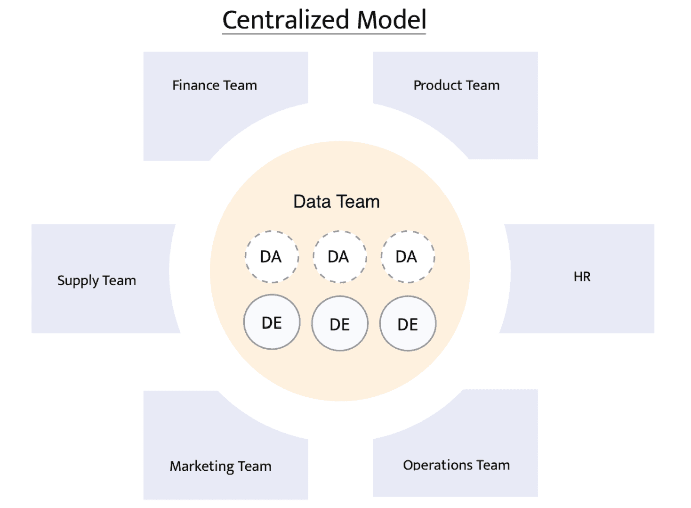
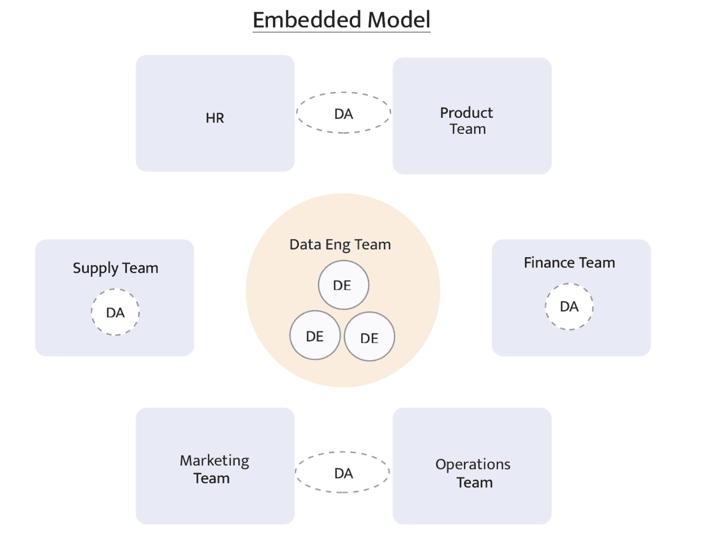
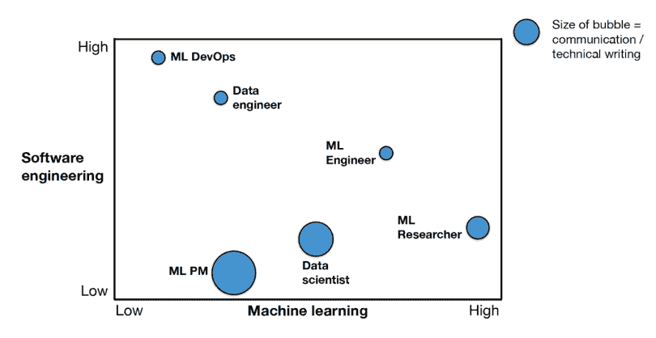

# ML 协作:来自 4 ML 团队的最佳实践

> 原文：<https://web.archive.org/web/https://neptune.ai/blog/ml-collaboration-best-practices-from-ml-teams>

根据麦肯锡的[报告，到 2030 年，人工智能有潜力为全球经济贡献 13 万亿美元。疫情的出现引发了对 ML 技术的需求和采用的快速增长。它揭示了多种用途，例如提高生产力以实现运营收益，引入新功能以改善客户体验和参与度，等等。](https://web.archive.org/web/20230104124339/https://www.mckinsey.com/industries/public-and-social-sector/our-insights/the-potential-value-of-ai-and-how-governments-could-look-to-capture-it)

## 建立 ML 团队

随着有可能改变业务的人工智能用例的激增，领导者正在对人工智能协作进行重大投资，建立能够提供机器学习承诺的团队。建立成功的 ML 团队很大程度上取决于组织的规模及其战略眼光。

### 组织的规模和战略愿景

建立 ML 团队是一个重要的决定，主要取决于领导层如何认可 ML 技术，以及他们是否相信 ML 符合他们组织的战略愿景。

关于如何建立成功的 ML 团队，没有金科玉律。领导者经常面临许多障碍和问题，例如

## 

*   1 团队规模应该是多少？
*   我的团队应该具备什么样的技能？
*   如何平衡专家和通才的组合？在团队建设阶段的早期拥有多面手有助于制定业务问题，并产生对项目后期所需的一系列技能的需求。
*   4 如何在横向和纵向计划之间组织团队？

### 专注于 ML 的运营

大多数公司将生产工作作为事后的想法，并且不准备在创建生产级系统时处理规模。因此，ML 团队必须拥有能够成功操作 ML 模型的强大的数据架构师和工程专家。

## 如何组织 ML 团队

### 集中式 ML 团队

来自不同领域的人，如工程、产品、开发和 ML 都聚集在一个大团队下。这样的团队成为组织计划采用的任何 ML 计划的任务组。从开始到实现的构思周期变得非常快。这是一个拥有广泛技能的专家的理想案例——从而形成技术专长广度和深度的双赢。

然而，这种团队组织的缺点是知识局限于这个论坛。由于知识传播存在障碍，这种模式导致依赖性增加并阻碍民主化。

*Illustration of centralized ML team | [Source](https://web.archive.org/web/20230104124339/https://medium.com/super/how-should-our-company-structure-our-data-team-e71f6846024d)*

### 分散式 ML 团队

它是一个由技术专家组成的小型“团队”,来交付一个特定的特性或解决方案。这种结构非常灵活，来自不同背景的团队为了一个特定的可交付成果走到一起，然后解散。

*Illustration of decentralized ML team | [Source](https://web.archive.org/web/20230104124339/https://medium.com/super/how-should-our-company-structure-our-data-team-e71f6846024d)*

## ML 协作:为什么它很重要

我们将在这篇文章的后面部分解释每一个不同的角色，但是快速浏览一下团队的组成已经突出了不同团队成员如何相互协作的潜在问题。

### 理解需求

很多时候，ML 协作方面并没有得到太多的关注。这导致了需求沟通上的差距，需求既没有被很好地理解，也没有被恰当地记录。因此，项目可能会在重复任务方面面临挫折，或者在最坏的情况下，将已经耗费精力的工作擦掉。

### 追求正确的方向

不同利益相关者对 ML 协作的明确关注确保了项目朝着预期的方向发展，并且任何不可预见的风险都在正确的论坛上及时传达。

### 利益相关方的批准

ML 项目本质上是迭代的。数据科学家将业务问题和目标构建到统计解决方案中，并从数据探索的第一步开始。众所周知，EDA 是项目中发现的关键阶段。正是在这个阶段，数据科学家可能会发现数据中缺乏高质量的信号或模式，或者选择的衡量成功的指标发生了变化，或者问题本身可能无法解决。

这样的发现，当通过商业领袖传播时，通常会导致商业目标的修改。在这种情况下，清晰的沟通对于确保所有的涉众对更新的项目状态保持一致是至关重要的。

### 业务和数据团队联盟

ML 项目的成功在于数据团队和业务团队之间的强大协作。业务团队的这种持续联盟有助于数据科学团队创建有可能增加重要业务价值的 ML 模型。

### 可见性取代了微观管理

强大的团队协作使每个成员对最终解决方案的贡献变得清晰可见。它强调了在 ML 项目生命周期中各种任务所有权的重要性。

*Degree of communication based on role | [Source](https://web.archive.org/web/20230104124339/https://fullstackdeeplearning.com/spring2021/lecture-13/)*

我们联系了四家公司，采访了他们如何构建他们的 ML 团队，他们的团队相互合作的最佳实践是什么，他们使用什么工具，等等。

请注意，在可能的情况下，这些组织和联络点的名称在获得批准后已经公开。

## ML 协作和系统设计的及时评估

感谢 Gigaforce 公司的数据科学家 Abhishek Rai 与我合作撰写这篇采访文章，并在文章发表前对其进行了审阅。

### 组织

Gigaforce 公司

### 工业

保险技术提供商

### 团队规模

Gigaforce 在三年前的 2020 年建立了一个 ML 团队，团队规模为 5-7 人。

### 团队组成

该团队由领域专家、数据工程师、数据科学家和 ML 工程师组成。

### 机器学习协作

Gigaforce 根据项目的阶段分配工作。显然，在项目的整个生命周期中，并不需要所有的团队成员。例如，领域专家在项目的初始阶段扮演着至关重要的角色，帮助数据科学家满足业务需求。

Gigaforce 的 ML 团队已经能够在五个月内建立并部署一个回归模型到产品中，这是一个伟大的壮举，充分说明了无可挑剔的项目管理和团队组织。因此，让我们向他们学习，他们是如何分配角色和责任的，以及他们采取了什么措施来促进合作。

Gigaforce 处理大量数据，需要构建多个模型版本，也就是实验。该团队很快发现了对数据版本工具的需求，这是当今行业在构建生产级解决方案时面临的主要挑战之一。他们已经评估了 DVC 的数据版本需求，并致力于优化他们的用例。

> *“根据我们处理的数据量，模型版本化带来的主要挑战是跟踪数据，以便在未来重现类似的实验。因此，数据版本化是该行业面临的主要挑战之一，我们正在努力提高效率，优化对数据变化的跟踪。”*

我们都见证了大约 80%的概念验证没有进入生产流程。可能有许多促成因素，如缺乏远见、强行安装 ML 组件来解决业务问题、没有良好信号质量的数据来学习模式等。但是，在项目进入瓶颈阶段之前，能够避免损失的一个因素是预见模型集成到组织的现有技术堆栈中时出现的复杂性的能力。在这一点上，Gigaforce 做出了正确的决定，在 POC 规划阶段就让工程师参与进来，就解决方案的可行性分享他们的技术专长。

### 使用的工具

### 跟踪进度

*   每天(或根据需要每周)举行站立会议，以促进团队内部的协作。
*   Gigaforce 快速开发周期的成功归功于与业务和产品团队紧密耦合的反馈回路。这对于确保开发人员不会成为任何 moonshot 承诺的受害者，以及所有利益相关者及时了解任何意外情况以校准项目方向是至关重要的。

## 工程团队中的 ML 协作

感谢 Acquia 前产品经理 Makarand Pandey 与我合作撰写这篇采访文章，并在文章发表前审阅。

### 组织

[Acquia](https://web.archive.org/web/20230104124339/https://www.acquia.com/)

### 工业

软件即服务

### 团队规模

Acquia 在 2017 年 5 年前建立了一个 ML 团队，团队规模为 6 人。

### 团队组成

该团队由数据管道工程师、ML 工程师、全栈工程师和数据科学家组成。

### 团队协作

它的团队构成提供了一个很好的案例，其中他们强调构建健壮的数据和模型管道，例如预测集群的容量扩展、精炼代码库和重新训练模型。

> 角色和职责通常是根据 sprints 中的项目组合来分配的。勘探项目主要由数据科学家处理，而操作请求则由 ML 工程师处理"

该团队是高度自给自足的，因为它自己设法建立了多个概率模型，预测购买、参与和转化的可能性以及客户的终身价值。不用说，Acquia 认为没有必要为这样一个高绩效的团队雇佣一名工程经理。该团队开发了概率模型，并对其进行迭代，以随着时间的推移提高模型的准确性。

### 使用的工具

*   [Jenkins](https://web.archive.org/web/20230104124339/https://www.jenkins.io/) 用于 CI/CD 流程
*   用于代码协作的 Git
*   [模型版本控制的 MLflow](https://web.archive.org/web/20230104124339/https://mlflow.org/)

### 跟踪进度

Acquia 通过 slack 的异步站立简化了沟通——这是自混合工作文化开始以来业内常见的趋势。他们使用吉拉进行 sprint 跟踪，AHA 进行产品管理可视化，confluence 进行项目文档。

## ML 协作和发挥团队的优势

该公司选择保持匿名，但乐于分享其在 ML 团队协作方面的最佳实践。我们真诚地感谢他们在这篇采访文章上的合作，以及在文章发表前的审阅。

### 组织

在下一节中，用代词“他们”匿名和指代。

### 工业

计算机软件

### 团队规模

他们在 2021 年建立了一个相当新的 ML 团队，团队规模为 5 人。

### 团队组成

该团队由全栈科学家和专业技能型专家组成。

### 团队协作

该团队在五个月内建立了异常检测的基线版本，并计划很快创建一个针对特定治疗的“索赔评分系统”。

虽然通常很难决定如何将项目分配给团队，但他们有一个公平的主张，即发挥团队的优势。有各种方法来决定项目分配，但没有经验法则。这取决于多种因素，例如组织中已经存在哪些技能，这些技能是否随时可以用于入职，以及如果分配的团队事先不具备这些技能，他们是否愿意学习和交付项目，等等。

该团队没有一个解决方案架构师来协调团队内部的工作，并帮助他们完成关键里程碑。这无疑强调了需要一个能够身兼数职的项目经理来使项目成功。

> *“不幸的是，我们的团队中没有一个业务架构师/产品负责人/分析师，所以在文档和保持进度更新方面存在巨大的困难”*

### 使用的工具

### 跟踪进度

他们使用合流、观念、松弛和每日站立与团队分享知识和状态更新。

## 看板团队中的 ML 协作

感谢 Blue Yonder Inc .数据科学部门 CVP Felix Wick 与我合作撰写这篇采访文章，并在文章发表前对其进行审阅。

### 组织

[Blue Yonder 公司](https://web.archive.org/web/20230104124339/https://blueyonder.com/)

### 工业

供应链 SaaS

### 团队规模

Blue Yonder 公司的 ML 团队规模为 30 人，并且还在增加。

### 团队组成

在几年的过程中，Blue Yonder 建立了一个工程团队，以开发以 ML 为核心的 SaaS 产品。Blue Yonder 的团队组织脱颖而出，因为它确保所有团队成员对整个系统有一个体面的概述，此外还有一些多面手。它拥有一个专注于特定领域的团队，如数据工程师、软件工程师、数据科学家、ML 工程师、全栈和前端开发人员。

### 团队协作

管理一个大型团队肯定是困难的，因此 Blue Yonder 找到了一种有效的方法，将团队分成几个子团队，这些子团队具有不同的技术重点，如数据、模型或以 UI 为中心。

虽然不同子团队的成员在端到端用户故事和史诗上与其他子团队合作，但他们在技术子团队内部有跨故事的密切交流。这种团队组织也带来了协同作用，并提供了一种有效的方式来确保所有团队成员都了解整个工作范围。

### 使用的工具

Blue Yonder 在开发模式下工作，通过一个连续的过程来扩大规模、改进和范围的扩展，同时操作产品。它使用现代协作平台，以这样的规模运营，以迎合全球客户。

> *“我们对所有子组件使用一个 mono 存储库，包含一个拉式请求工作流和 CI/CD(包含单元、集成、系统、模型和性能测试)。具有模型变更的提交分支自动触发对几个数据集的评估运行，输出与主模型的比较，根据该比较可以决定该模型是否是好的候选。”*

### 跟踪进度

它遵循类似看板的结构，结合连续交付模式，包括

*   史诗的路线图，包括发行计划
*   每日站立，广泛的内部和外部审查版本
*   常规团队和子团队回顾

## 奖金金块

到目前为止，我们所讨论的一切都是从位于一个地方的中型团队的角度出发的。值得注意的是，随着任何公司员工人数的增加，可能需要一些适应性。大型组织在地理上分散了数据科学团队，这些团队通常不知道他们的同事在做什么。因此，维护一个包含所有数据科学家的中央数据库被认为是一种良好的做法，该数据库可以列出:

*   他们的专业领域，
*   他们过去做过什么项目，
*   他们历史项目的成功率是多少，
*   他们目前在做什么项目，以及
*   接下来他们渴望学习和交付什么技能和算法。

与其专注于特定的工具，不如从共享 excel 这样简单的东西开始，这是一个尽早开始并从回购中获益的好方法。目标是在组织范围内对内部已经存在的技能库进行可视化。此外，当项目管理团队希望为任何即将到来的项目分配数据科学家时，这样的存储库会很方便，使业务和数据科学家双赢。

## 外卖食品

与这些伟大组织的讨论让我们先睹为快，看看如何构建健壮的、可伸缩的、实时的 ML 生产系统。通过这篇采访文章，我们的目的是把他们的学习和经历带给我们的读者。我们想总结并分享三个关键要点，它们可能会对您的生产之旅有所帮助:

*   机器学习团队非常多样化，不同背景的专家集思广益，寻求成功之道。组织需要创造一种促进有效的 ML 合作的文化来提高团队的效率。

*   不要根据职位来判断，每个公司都不一样。相反，要非常清楚实现目标所需的技能和任务。不要低估任何一个团队成员的贡献。“ML 项目意味着数据科学家”是一个神话——它需要技术专家的大量脑力来建立世界级的系统。
*   但是有一件关于 ML 项目的事情不是神话——它们都是关于数据的。因此，准备好接受这样一个事实，您将拥有大量的数据版本，这将导致多模型管理。有很多产品可以帮助你管理这种混乱——我们强烈建议你做好研究，并及时投资。

### 参考