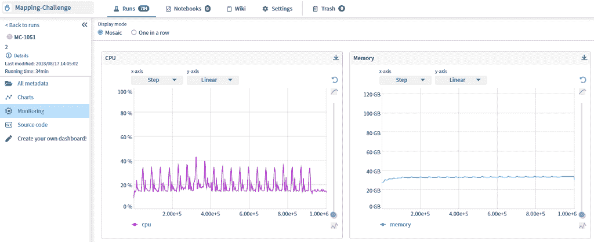

# ML 实验跟踪:它是什么，为什么重要，以及如何实施

> 原文：<https://web.archive.org/web/https://neptune.ai/blog/ml-experiment-tracking>

我来分享一个听了太多次的故事。

> *“…*到目前为止，我们一直都是以手动和临时的方式完成所有工作。
> 
> 有些人在用它，有些人在用那个，到处都是。
> 
> 我们没有标准化的东西。
> 
> 但是我们运行许多项目，团队在成长，我们的规模也在快速扩大。
> 
> 所以我们遇到了很多问题。模特是怎么训练出来的？什么数据？我们对不同的版本使用了什么参数？我们如何复制它们？
> 
> 我们只是觉得有必要控制我们的实验……”
> 
> – unfortunate Data Scientist.

事实是，当你开发 [ML 模型](https://web.archive.org/web/20230220123301/https://towardsdatascience.com/all-machine-learning-models-explained-in-6-minutes-9fe30ff6776a)时，你将会进行大量的实验。

这些实验可能:

*   使用不同的模型和模型超参数
*   使用不同的培训或评估数据，
*   运行不同的代码(包括您想要快速测试的这个小变化)
*   在不同的环境中运行相同的代码(不知道安装的是 PyTorch 还是 Tensorflow 版本)

因此，它们可以产生完全不同的评估指标。

跟踪所有这些信息会很快变得非常困难。特别是如果你想组织和比较这些实验，并且确信你知道哪个设置产生了最好的结果。

这就是 ML [实验跟踪](/web/20230220123301/https://neptune.ai/experiment-tracking)的用武之地。

## 什么是 ML 实验跟踪？

> 实验跟踪是保存您关心的每个实验的所有实验相关信息的过程。

实验跟踪是保存您关心的每个实验的所有实验相关信息的过程。这种“您关心的元数据”在很大程度上取决于您的项目，但它可能包括:

*   用于运行实验的脚本
*   环境配置文件
*   用于培训和评估的数据版本
*   参数配置
*   [评估指标](/web/20230220123301/https://neptune.ai/blog/how-to-track-machine-learning-model-metrics)
*   模型重量
*   绩效可视化(混淆矩阵， [ROC](/web/20230220123301/https://neptune.ai/blog/f1-score-accuracy-roc-auc-pr-auc) 曲线)
*   验证集上的示例预测(常见于计算机视觉)

当然，您希望在实验完成后可以获得这些信息，但是理想情况下，您希望在实验运行时也能看到一些信息。

为什么？

因为对于一些实验来说，你可以(几乎)马上看到它们不可能给你带来更好的结果。与其让他们跑(这可能需要几天或几周)，你不如简单地阻止他们，尝试一些不同的东西。

为了正确地进行实验跟踪，你需要某种系统来处理所有这些元数据。典型地，这样的系统将具有 3 个组件:

*   **实验数据库**:存储实验元数据的地方，可以记录和查询
*   **实验仪表板**:实验数据库的可视化界面。一个你可以看到你的实验元数据的地方。
*   **客户端库**:为您提供从实验数据库中记录和查询数据的方法。

当然，您可以用许多不同的方式实现每个组件，但总体情况是非常相似的。

*等等，那么实验追踪不就是 MLOps 之类的吗？*

### 实验跟踪与 ML 模型管理与 MLOps

实验跟踪(也称为实验管理)是 MLOps 的一部分:一个更大的工具和方法生态系统，处理机器学习的可操作性。

**MLOps 处理 ML 项目生命周期的每一部分**,从开发模型到安排分布式培训工作、管理模型服务、监控生产中模型的质量，以及在需要时重新培训这些模型。

这是许多不同的问题和解决方案。

**实验跟踪关注迭代模型开发阶段**当您尝试许多事情来使您的模型性能达到您需要的水平时。

那么实验跟踪和 ML 模型管理有什么不同呢？

**ML 模型管理在模型投入生产时开始:**

*   简化从实验到生产的模型移动
*   帮助模型版本化
*   在 ML 模型注册中心组织模型工件
*   帮助在生产环境中测试各种模型版本
*   如果新版本似乎要崩溃了，可以回滚到旧版本

但是并不是每个模型都能被部署。

> 即使你的模型没有进入生产阶段，实验跟踪也是有用的。

即使你的模型没有投入生产，实验跟踪也是有用的。在许多项目中，尤其是那些以研究为中心的项目，他们可能永远也不会实现。但是拥有关于你进行的每个实验的所有元数据可以确保你在这个神奇的时刻到来时做好准备。

好吧，如果你有点像我，你可能会想:

酷，所以我知道什么是实验跟踪。…但我为什么要在乎呢？

让我解释一下。

## 为什么实验跟踪很重要？

为 ML 从业者构建一个工具有一个巨大的好处。你可以和很多人交谈。

在与数百名在 Neptune 跟踪他们实验的人交谈后，我看到了实验跟踪可以改善你工作流程的 4 种方式。

### 你所有的 ML 实验都集中在一个地方

有许多方法可以运行您的 ML 实验或模型训练作业:

*   私人笔记本电脑
*   工作中的电脑
*   云中的专用实例
*   大学集群
*   Kaggle 内核或 Google Colab
*   还有很多。

有时候你只是想快速测试一些东西，在笔记本上运行一个实验。有时你想加速一个分布式的[超参数调优](/web/20230220123301/https://neptune.ai/blog/hyperparameter-tuning-in-python-a-complete-guide-2020)任务。

无论哪种方式，在一个项目的过程中(尤其是当有更多的人在做这个项目的时候)，**你可能最终会让你的实验结果分散在**许多机器上。

有了**实验跟踪系统，**你所有的实验**结果都被设计记录到一个实验库中。**将所有的实验元数据保存在一个地方，无论在哪里运行，都可以让你的实验过程更容易管理。

具体来说，集中式实验存储库使以下工作变得容易:

*   搜索和过滤实验，快速找到您需要的信息
*   无需额外工作即可比较他们的指标和参数
*   深入查看您到底尝试了什么(代码、数据版本、架构)
*   需要时，重现或重新运行实验
*   访问实验元数据，即使您无权访问运行它们的服务器

此外，你可以安心地睡觉，因为你知道你尝试过的所有想法都被安全地储存起来了，而且你可以随时回头再去想它们。

### 比较实验，分析结果，调试模型训练，几乎没有额外的工作

无论您是在调试训练运行、寻找改进思路，还是审核您当前的最佳模型，比较实验都是非常重要的。

但是当你没有任何实验跟踪系统时:

*   你记录事情的方式可以改变，
*   你可能会忘记记录一些重要的事情
*   你可能只是不小心丢失了一些信息。

在这种情况下，像比较和分析实验这样简单的事情会变得困难甚至不可能。

有了实验跟踪系统，你的实验被存储在一个地方，你遵循相同的协议来记录它们，所以那些比较可以非常深入。你不需要做太多额外的工作。

> *“跟踪和比较不同的方法显著提高了我们的工作效率，使我们能够更加专注于实验，并在我们的团队中开发新的良好实践……”*–to masz gry giel，数据科学家@idenTT

适当的实验跟踪便于:

*   比较参数和指标
*   覆盖学习曲线
*   根据数据版本或参数值对实验进行分组和比较
*   比较混淆矩阵、ROC 曲线或其他性能图表
*   比较测试或验证集的最佳/最差预测
*   查看代码差异(和/或笔记本差异)
*   查看各种型号在训练运行期间的硬件消耗
*   查看预测解释，如要素重要性、SHAP 或莱姆
*   比较视频或音频等富格式工件
*   …比较您记录的任何其他内容

现代[实验跟踪工具](/web/20230220123301/https://neptune.ai/blog/best-ml-experiment-tracking-tools)将(几乎)免费为你提供许多比较功能。一些工具甚至可以自动发现实验之间的差异，或者向您显示哪些参数对模型性能有最大的影响。

当你把所有的片段都放在一个地方时，你可能仅仅通过查看你记录的所有元数据就能找到新的见解和想法。当你不是一个人工作时，尤其如此。

说开了…

### 改善协作:查看每个人都在做什么，轻松共享实验结果，以编程方式访问实验数据

当你是一个团队的一部分，很多人都在做实验时，为整个团队提供一个真实的来源是非常重要的。

> *【一个实验追踪系统】让我和队友分享结果变得很容易。我给他们发了一个链接，告诉他们要看什么，或者我在实验仪表板上建立了一个视图。我不需要自己生成，我团队中的每个人都可以访问它。”*–ma ciej Bartczak，研究主管@Banacha 街

实验跟踪让你不仅可以组织和比较你过去的实验，还可以看到其他人都在做什么以及结果如何。

分享结果也变得更加容易。

**现代实验跟踪工具让你通过发送一个链接**到一个特定的实验或仪表板视图来分享你的工作。你不必发截图或“开个小会”来解释你的实验是怎么回事。它节省了大量的时间和精力。

例如，这里有一个[链接，链接到我几个月前做的一个实验对比](https://web.archive.org/web/20230220123301/https://ui.neptune.ai/neptune-ai/credit-default-prediction/compare?shortId=%5B%22CRED-93%22%2C%22CRED-92%22%2C%22CRED-91%22%2C%22CRED-89%22%2C%22CRED-85%22%2C%22CRED-80%22%2C%22CRED-70%22%5D&viewId=a261e2d2-a558-468e-bf16-9fc9d0394abc)。很简单，对吧？

除了分享你在网络用户界面上看到的东西，大多数**实验跟踪设置让你以编程方式访问实验元数据。当你的实验和模型从实验走向生产时，这就派上了用场。**

例如，您可以[将您的实验跟踪工具连接到 CI/CD 框架](/web/20230220123301/https://neptune.ai/blog/continuous-integration-for-machine-learning-with-github-actions-and-neptune)并将 ML 实验集成到您团队的工作流程中。分支“master”和“develop”上的模型之间的视觉比较(以及探索细节的方式)在您更新您的生产模型之前增加了另一个健全性检查。

### 实时查看您的 ML 运行:随时随地管理实验

当你在本地计算机上训练一个模型时，你可以随时看到发生了什么。但是，如果你的模型是在工作场所、大学或云中的远程服务器上运行，那么就不容易看到学习曲线是怎样的，甚至培训工作是否崩溃。

实验跟踪系统解决了这个问题，因为虽然允许远程访问你的所有数据和服务器可能是一个很大的安全禁忌，但让人们只看到他们的实验元数据通常是好的。

当你可以看到你的跑步实验就在你之前跑步的旁边时，你可以快速比较它们，并决定继续下去是否有意义。你可以看到你的云训练作业崩溃了，你可以关闭它(或者修复 bug 重新运行)。

为什么要在不收敛的东西上浪费那些宝贵的 GPU 时间。

说到 GPU，**一些实验跟踪工具也会跟踪硬件消耗**。这可以帮助你看到你是否有效地使用你的资源。



[See this view in app](https://web.archive.org/web/20230220123301/https://ui.neptune.ai/o/neptune-ai/org/Mapping-Challenge/e/MC-1051/monitoring)

例如，随着时间的推移，查看 GPU 消耗可以帮助您了解您的数据加载器是否正常工作，或者您的多 GPU 设置实际上只使用了一个卡(这种情况发生在我身上的次数比我愿意承认的次数还要多)。

> “如果没有监控部分的信息，我不会知道我的实验运行速度比正常情况慢了 10 倍。*–micha Kardas，机器学习研究员@TensorCell*

 *## 实验跟踪最佳实践

到目前为止，我们已经讨论了什么是实验跟踪以及为什么它很重要。

是时候进入细节了。

### 在任何 ML 实验中，你都应该记录什么

正如我最初所说的，您可能想要跟踪的信息类型取决于项目特征。

也就是说，不管你在做什么项目，有些事情你都应该跟踪。这些是:

*   **代码**:预处理、训练和评估脚本、用于设计特性的笔记本、其他实用程序。运行(和重新运行)实验所需的所有代码。
*   **环境**:跟踪环境最简单的方法是保存环境配置文件，如` Dockerfile` (Docker)、` requirements.txt` (pip)或` conda.yml` (conda)。你也可以在 Docker Hub 上保存 Docker 镜像，但是我发现保存配置文件更容易。
*   **数据**:保存数据版本(作为数据文件的一个散列或位置)可以很容易地看到你的模型被训练了什么。你也可以使用现代的数据版本控制工具，比如 T2 DVC T3。dvc 文件到你的实验跟踪工具)。
*   **参数**:保存您的跑步配置绝对至关重要。当您通过命令行(argparse，click，hydra)传递参数时要特别小心，因为这是一个您很容易忘记跟踪的地方(我有一些恐怖故事要分享)。您可能想看看这篇关于[跟踪超参数](/web/20230220123301/https://neptune.ai/blog/how-to-track-hyperparameters)的各种方法的文章。
*   **度量**:记录每次运行的训练、验证和测试集的评估度量是非常明显的。但是不同的框架做的不一样，所以你可能想看一看这篇文章，这篇文章深入地讨论了在 ML 模型中跟踪度量标准。

跟踪这些事情会让你重现实验，进行基本的调试，并在高层次上理解发生了什么。

也就是说，你总是可以记录更多的事情来获得更多的洞察力。

### 你还能跟踪什么

您可能希望跟踪的其他事情与您正在进行的项目类型有关。

以下是我对各种 ML 项目类型的一些建议。

**机器学习**

*   模型重量
*   评估图表(ROC 曲线、混淆矩阵)
*   预测分布

**深度学习**

*   模型检查点(培训期间和之后)
*   梯度规范(控制消失或[爆炸梯度问题](/web/20230220123301/https://neptune.ai/blog/understanding-gradient-clipping-and-how-it-can-fix-exploding-gradients-problem)
*   训练后验证/测试集的最佳/最差预测
*   硬件资源:在调试数据加载器和多 GPU 设置时特别有用

**计算机视觉**

*   每个时期后的模型预测(标签、覆盖的遮罩或边界框)

**自然语言处理**

**结构化数据**

*   输入数据快照(如果使用 pandas，则为训练数据上的`. head()'
*   特征重要性(排列重要性)
*   像 SHAP 或部分相关图([它们都可以在 DALEX](/web/20230220123301/https://neptune.ai/blog/explainable-and-reproducible-machine-learning-with-dalex-and-neptune) 中找到)这样的预测解释。

**强化学习**

*   剧集回归和剧集长度
*   总环境步数、墙壁时间、每秒步数
*   价值与警察职能的丧失
*   聚合多个环境和/或运行的统计数据

如果你想了解更多关于强化学习的最佳实验跟踪实践，你真的应该[阅读这篇深度指南](/web/20230220123301/https://neptune.ai/blog/how-to-make-sense-of-the-reinforcement-learning-agents-what-and-why-i-log-during-training-and-debug)。

**超参数优化:**

*   运行分数:每次迭代后，你用 HPO 优化的度量
*   运行参数:每次迭代尝试的参数
*   最佳参数:迄今为止的最佳参数和 HPO 扫描完成后的最佳参数
*   参数对比图:在训练期间或之后，您可能想要记录各种可视化，如平行坐标图或切片图([顺便说一下，它们都可以在 Optuna](https://web.archive.org/web/20230220123301/https://optuna.readthedocs.io/en/v1.0.0/reference/visualization.html) 中找到)。

## 如何设置实验跟踪

好的，这些都是很好的指导方针，但是你如何在你的项目中实现实验跟踪呢？

(至少)有几个选择。最受欢迎的是:

*   电子表格+命名约定
*   使用 Github 对配置文件进行版本控制
*   使用现代实验跟踪工具

现在就来说说那些吧。

您可以使用电子表格和命名约定(但请不要这样做)

### 一种常见的方法是简单地创建一个大的电子表格,在那里你可以放置所有的信息(度量、参数等)和一个目录结构，在那里事物以特定的方式命名。这些名字通常都很长，比如*' model _ v1 _ lr01 _ batch size 64 _ no _ preprocessing _ result _ accuracy 082 . H5 '*。

每当你运行一个实验，你看着结果，并把它们复制到电子表格中。

这有什么错？

老实说，在某些情况下，它可能刚好足以解决您的实验跟踪问题。这可能不是最好的解决方案，但它快速而简单。

…事情很快就会分崩离析

> 但是事情很快就会分崩离析。(至少)有几个主要原因可以解释为什么在电子表格中跟踪实验对许多人来说不起作用:

你必须**记得跟踪**他们。如果事情没有自动发生，事情就会变得混乱，尤其是当更多的人参与进来的时候。

*   你必须确保你或你的团队**不会无意中覆盖电子表格中的内容**。电子表格不容易版本化，所以如果发生这种情况，你就有麻烦了。
*   你必须**记住使用命名约定**。如果您团队中的某个人搞砸了，您可能不知道您运行的实验的实验工件(模型权重、性能图表)在哪里。
*   你必须**备份你的工件目录**(记住东西会坏掉)。
*   当您的**电子表格增长时，它变得越来越不可用**。在一个电子表格中搜索东西和比较数百个实验(尤其是如果有多人想同时使用它)不是一种很好的体验。
*   您可以在 GitHub 中对元数据文件进行版本控制

### 另一个选择是在 Github 中对所有实验元数据进行版本化。

你可以这样做，就是在运行你的实验时，将度量标准、参数、图表和任何你想跟踪的东西提交给 Github。这可以通过 [post-commit hooks](https://web.archive.org/web/20230220123301/https://githooks.com/) 来完成，在那里你可以在实验完成后自动创建或更新一些文件(配置、图表等)。

… Github 不是为…机器学习而构建的

> 它可以在某些设置中工作，但是:

。git 和 **Github 不是为了比较机器学习对象而构建的。**

*   **对比两个以上的实验是行不通的**。对比一下。git systems 是为比较两个分支而设计的，例如，master 和 develop。如果你想比较多个实验，看看指标和叠加学习曲线你就不走运了。
*   组织许多实验是困难的(如果不是不可能的话)。你可以有想法的分支或者每个实验的分支，但是你运行的实验越多，它就变得越不可用
*   **您将无法实时监控您的实验**，信息将在您的实验完成后保存。
*   你应该怎么做？

你可以使用一种现代实验跟踪工具

### 虽然您可以尝试和调整通用工具来进行机器学习实验，但您可以只使用专门为跟踪、组织和比较实验而构建的解决方案之一。

*“在最初的几十次运行中，我意识到跟踪是多么完整——不仅仅是一两个数字，还有代码的确切状态、存储到云的最佳质量模型快照，以及快速添加特定实验注释的能力。相比之下，我以前的方法简直是一团糟。”*–英特尔数据科学家 Edward Dixon

> 它们的界面略有不同，但通常以相似的方式工作:

**第一步**

通过向您的培训代码添加一个代码片段来连接到该工具。

例如:

**第二步**

```py
import neptune.new as neptune
run = neptune.init(...) 
```

指定您想要记录的内容(或者使用 ML 框架集成来完成):

**第三步**

```py
from neptune.new.types import File
run['accuracy'] = 0.92
for prediction_image in worst_predictions:
    run['worst predictions'].log(File.as_image(prediction_image))
```

像平常一样运行您的实验:

就是这样！

```py
python train.py

```

您的实验记录在中央实验数据库中，并显示在实验仪表板中，您可以在其中搜索、比较和深入查看您需要的任何信息。

今天至少有一些好的实验跟踪工具，我强烈推荐使用其中的一个。他们**被设计成将机器学习实验**视为一等公民，他们将永远:

对于机器学习者来说，比一般工具更容易使用吗

*   与 ML 生态系统有更好的整合
*   比一般的解决方案有**更多以实验为中心的特性**
*   后续步骤

实验跟踪不仅仅是一种工具或记录方法，更是一种实践。真正理解和实施需要一些时间:

## **为你的项目跟踪什么**，

如何利用这些信息来改进未来的实验，

*   如何**利用 it 改善您团队独特的工作流程**，
*   **甚至什么时候使用**实验追踪。
*   希望在读完这篇文章后，你对实验跟踪是否能改善你(或你的团队)的机器学习工作流程有一个好的想法。
*   你想开始追踪你的实验吗？

你想知道更多关于这个话题的内容吗？

以下是一些附加资源:

快乐实验！

Here are some additional resources:

Happy experimenting!*