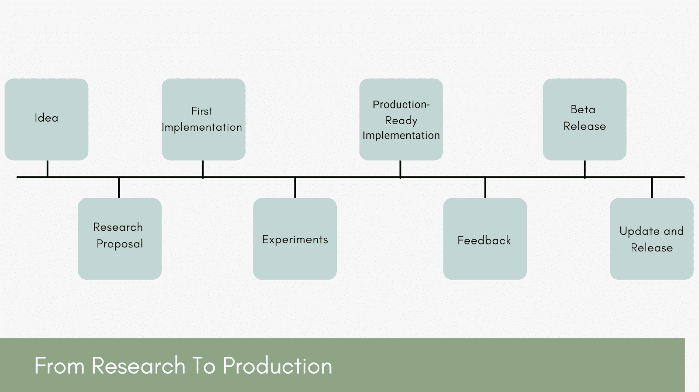
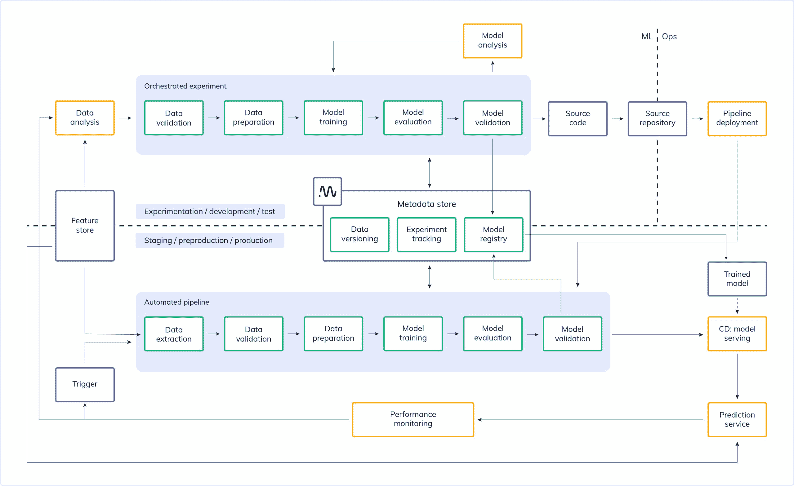

# 从研究到生产的 ML-挑战、最佳实践和工具[指南]

> 原文：<https://web.archive.org/web/https://neptune.ai/blog/ml-from-research-to-production>

将机器学习或人工智能投入生产需要很多耐心、努力和资源。人工智能模型非常适合预测各种事情，从你喜欢什么电影到你的猫是否会划伤家具。但在大多数情况下，人工智能模型很难投入生产。

在本文中，我们将讨论为什么很难将模型投入生产，如何将机器学习实验从研究阶段投入生产，以及在模型投入生产后需要考虑的事项。

*From research to production – core steps | Source: Author*

## 在生产中发布 ML 模型面

有大量不同的平台可以让你的模型可用。从编写平台的语言到使用的部署和分发模型，每个平台都面临着独特的挑战。由于这些挑战，一个好主意可能会在这个阶段被抛弃。

人工智能模型通过在数据中发现人类不会注意到的模式和关系来工作。模型做出的预测准确度高，但精确度较低——当您的企业依赖具有精确测量或公差的产品时，这可能是危险的。为了将这些模型用于现实世界的应用中，它们需要能够准确而精确地进行预测。

对于任何企业、商业或预测分析公司来说，训练和部署机器学习模型都是一项重大挑战。从可用的数据类型到所需的集成工作区，有几个原因导致 ML 模型难以投入生产。让我们探讨一下可能影响模型性能的几个原因。

### 异常值处理不佳

异常值处理是从数据集中消除异常值的过程。这项技术可以应用于不同的规模，以产生更准确的数据表示。这会影响模型的性能。根据模型的不同，影响可能大或小，例如，线性回归很容易受到异常值的影响。这个过程应该在模型训练之前进行。

### 生产监控

生产中的任何模型都需要定期监控。监控和管理机器学习模型是工作流的一个关键部分，保留所有数据集、输入和预测的记录也是如此。随着时间的推移，许多事情都会发生变化，因此监控我们的模型非常重要。

假设您的模型运行良好，但随着时间的推移，性能变得越来越差。您可能有一个包含新信息的新数据集，它正在改变模型。或者可能是模型存在严重问题，需要改进或更新。无论是哪种情况，您都需要一种方法来检查是否应该重新优化。最好定期监控和更新模型。

**让我们来看看几个进行 ML 模型监控的最佳工具**:

| 工具 | 信息 | 定价 | 关键特征 |
| --- | --- | --- | --- |
|  | 

Neptune 是一个轻量级的实验管理和协作工具。它非常灵活，可以与许多其他框架一起工作

 |  | 

–快速美观的 UIrn–实验跟踪和可视化功能 rn–高效存储和组织您的工作

 |
|  | 

简单易行持续监控 ml-model 性能在 Azure，Google & AWS。在 Qualdo

T3【批量监控机器学习或分析模型】 | 

免费赠送 10 GB，61 美元/月之后

 | 

–数据质量工具&针对所有利益相关方的指标 rn–在几分钟内消除高风险数据问题！

 |
|  | 

Fiddler 是一个模型监控工具，具有友好、清晰、简单的界面

 | 

入门即可免费试用。你可以联系他们定价

 | 

–性能监控 rn–跟踪异常值 rn–服务指标和警报

 |

→要了解更多关于监控的信息，请查看[Neptune](/web/20221206161941/https://neptune.ai/blog/monitoring-machine-learning-experiments-guide)现场监控 ML 实验的完整指南。

### 偏差和方差

假设您正在构建一个预测模型来估计一辆汽车的年运营成本。您从相似品牌和型号的汽车中收集数据，您已经完成了该评估。您会注意到年度运营成本的值无处不在——一些项目的年成本为 2000 美元，而其他项目的年成本高达 8000 美元。为了尝试捕捉数据的可变性，您决定从其他来源引入更多数据。因为你现在有了更多的数据，你重新训练你的模型，最终得到一组新的值，但是它们又遍布地图。这是偏见的第一个来源。

我们数据集中的值的方差如此之大，以至于您无法对我们的数据做出任何可靠的统计结论。这是因为你没有足够的类似车辆的数据点，无法对这些汽车的实际年运营成本做出任何具体的结论。

偏差-方差权衡，当模型的偏差较低而方差较高时，它很可能从数据集过度学习了。线性算法倾向于具有高偏差但低方差，而非线性算法倾向于具有低偏差但高方差。当你增加方差时，偏差会减少，当你增加偏差时方差会减少。这种权衡是这两者所建立的误差之间的牵引。

### 阶级不平衡

在机器学习中，[类不平衡问题](/web/20221206161941/https://neptune.ai/blog/how-to-deal-with-imbalanced-classification-and-regression-data)是指一个类的实例比另一个类的实例更常见。虽然这在许多地区非常普遍(例如，狗的数量比猫多大约 3 比 1)，但这可能是一个相当大的问题。为了构建有效的机器学习算法，您需要能够在任何一种类型的实例上运行良好的模型。

导致类不平衡的一个常见情况是，您正在训练的算法将用于新域的数据集。例如，假设您正在构建一种垃圾邮件检测方法，您的数据包含数千封电子邮件，其中大多数是垃圾邮件，只有少数是非垃圾邮件。这造成了不平衡，因为数据集中 85%的实例是垃圾邮件。

解决这个问题的一个方法是从新的领域获取更多的数据，但这可能会被证明是昂贵的。相反，您可以从具有低类别不平衡的类似领域中获取一些现有数据，并在将我们的算法用于具有不平衡类别的原始较大集合之前，在这个较小集合上训练我们的算法。

|  | 研究 | 生产 |
| --- | --- | --- |
|  |  | 

比更简单的型号

 |
|  |  |  |
|  |  | 

不断移位，缺失值和标签

 |
|  |  |  |

*从 ML 研究到生产:挑战*

→在[管理机器学习生命周期的最佳 MLOps 平台中阅读更多关于 MLOps 的信息](/web/20221206161941/https://neptune.ai/blog/best-mlops-platforms-to-manage-machine-learning-lifecycle)

## 为生产做准备

让我们看看从研究到生产的各个步骤。它们是常见的步骤，但它们可能会根据您的机器学习模型或应用程序而变化。我们将讨论改进和优化您的模型的方法。

第一个关键步骤是对一切事物的深入研究；你的产品，模型，算法，工具，还有其他的一切。随着新技术或新方法的出现，这些事情会不时发生变化。你必须跟上时代的步伐。首先，你必须研究解决问题的不同方法。研究通常包括阅读研究论文或文章，观看演示或视频，或者使用工具和代码。所有这些都是研究过程的一部分。

与相同或不同领域的研究人员交谈。这会给你很多关于事情如何运作以及什么会出错的知识。它还将帮助您了解资源和工具。

世界上有成千上万的研究论文发表，但很少有人能在全球读者面前发表。以下是人工智能领域的几篇关键研究论文:

*   [**亚当:随机优化的一种方法**](https://web.archive.org/web/20221206161941/https://arxiv.org/abs/1412.6980) **，迪德里克·p·金马，吉米·巴**
*   [**地震预警的分布式多传感器机器学习方法**](https://web.archive.org/web/20221206161941/https://pdfs.semanticscholar.org/3400/75d5848d6ee026b9c0ed5605df501ab9639b.pdf) **，凯文·福维尔、丹尼尔·巴卢克-托默特等 8 人。**
*   [**更快的 R-CNN:面向实时目标检测的区域建议网络**](https://web.archive.org/web/20221206161941/https://arxiv.org/abs/1506.01497) **，** [**【邵青】**](https://web.archive.org/web/20221206161941/https://arxiv.org/search/cs?searchtype=author&query=Ren%2C+S) **，** [**【明凯】**](https://web.archive.org/web/20221206161941/https://arxiv.org/search/cs?searchtype=author&query=He%2C+K) **等**
*   [**注意力是你所需要的一切**](https://web.archive.org/web/20221206161941/https://arxiv.org/abs/1706.03762) **，瓦斯瓦尼等人，NeurIPS 2017，被 18178 引用**
*   [**神经机器翻译通过联合学习来对齐和翻译**](https://web.archive.org/web/20221206161941/https://arxiv.org/abs/1409.0473) **，巴赫达瑙等人，ICLR 2015，被 16866** 引用

*还有很多很棒的研究论文，我在本文末尾多加了几篇。*

一旦你完成了实验的研究，就到了定义你的模型如何工作的时候了——从所有可用的来源收集数据。数据越多越好。有两种类型的数据；结构化和非结构化。结构化数据包括日期、数字等。非结构化数据是大型文件，包括图像、文本、视频等。

有许多不同的方法来收集机器学习实验的数据。考虑图像分类的问题。为了对图像进行分类，首先，你需要有大量的图像。手动收集它们非常耗时，并且手动分类成千上万的图像需要相当长的时间。机器学习算法可以用来快速处理这成千上万的图像，节省时间。

*   **探索性数据分析**

使用机器学习应用程序时，理解您的数据非常重要。探索性数据分析(EDA)是识别数据集中的模式、异常和异常值的过程。它是通过探索大量数据，可视化模式以发现趋势，发现意想不到的结果或不规则性，并对它们进行理解来完成的。

商业中许多重要决策都是在探索性数据分析的基础上做出的。这项技术有助于确定针对这些假设要测试什么，这有助于证明或否定一个理论，无论是市场研究还是从生产材料中估算成本。这个过程包括检测结果的原因，并根据变量被分配到的分组来理解变量之间的关系。大多数情况下，当有许多不同的变量导致结果，并且您可能真的不知道结果或模式应该是什么样子时，EDA 会工作。它甚至可以应用于复杂的物流问题，只需在地图上放置数据点以及组成这些点的属性。

**探索性数据分析类型**:

EDA 通常是图形或非图形的(定量的)。

1.  单变量非图形-这是一种通过一个变量分析数据的分析形式。这是所有 EDA 类型中最简单的方法。这里的动机是找到并画出图案。
2.  单变量图形–当使用图形方法代替非图形方法时，它提供了数据的全貌。单变量图形由三个子部分组成；柱状图、茎图、叶图和箱线图。直方图是描述数值范围内案例总数的图表。茎和叶是代表分布形状和数据值的图。箱线图显示了最小值、中值和最大值的汇总。
3.  多元非图形–这种方法表示两个或多个数据变量之间的关系。
4.  多元图形–这是两个或多个数据变量之间关系的图形表示。在大多数情况下，条形图用于这种方法。

**探索性数据分析工具**:

Python 和 R 是 AI 和数据科学应用中使用最多的语言。如果你对编码了解较少，也可以使用其他工具。Trifacta、Excel、Rapid Miner、Rattle GUI 和 Qlikview 是一些很好的 EDA 非编程工具。

*   **特征工程和模型选择**

特征工程是机器学习中的一种方法，它使用数据来生成训练集中不存在的新变量。一旦你准备好了数据，这个过程就是下一步。它可以为监督和非监督学习生成新的要素，通常目标是简化和加速数据转换并提高模型精度。在处理机器学习模型时，特征工程是一种至关重要的方法。如果您有一个不好的特性，这将直接影响您的模型，不管数据或架构如何。这是一个在统计或机器学习技术的帮助下，将原始观察结果转换为所需特征的简单过程。向模型中添加新特征总是一个好主意，因为这可以提高灵活性并减少差异。

现在，让我们举一个简单的例子。下面是特定区域的房价。它显示了房子的面积和总价。

当您处理数据时，您的数据可能会出现问题。数据可能来自互联网或各种其他来源，并且充满错误。因此，收集完数据后，您将创建一个新列来显示每平方英尺的价格。

一旦创建了新列，您现在就可以使用**领域知识**。比如，你可以咨询任何一个房地产人士来确认平方英尺。价格。如果这个人说每平方英尺的价格不能低于 3500，那么你可能有问题。你可以**将数据可视化**以便更好地查看。

当你绘制数据时，你可以在上面看到一个特定的价格与其他价格有很大的不同。你可以很容易地在可视化方法中发现错误。你也可以使用**数学/统计**来观察你的数据。

模型选择是一种方法，可以应用于不同类型的模型，或同一类型但不同的超参数。简单地说，选择模型作为最终模型的过程定义了问题。在选择模型时，有许多事情需要考虑，并且有许多不同的模型选择技术。

→阅读[机器学习中模型评估和选择的最终指南](/web/20221206161941/https://neptune.ai/blog/the-ultimate-guide-to-evaluation-and-selection-of-models-in-machine-learning)中关于模型评估和选择的更多信息

模型开发经常被误解，因为人们认为这一步花费的时间最多。然而，通常大部分时间都花在清理、准备和探索数据上。在此过程中，您将训练、测试和验证集合。为什么要使用三个过程而不是训练模型和测试它？从事模型开发需要配置调整。这是在从验证数据集收到的反馈的帮助下完成的。简单来说，你可以称之为一种学习形式。我们的主要目标是获得看不见的数据的准确输出。

目标是给模型尽可能多的关于其领域中对象属性的知识，并使用这些知识来做出准确的预测。许多这样的方法被用于不同的领域，包括自然语言处理、数据挖掘、用户界面设计、计算机视觉等等。

训练模型时，监控优化和泛化之间的关系很重要。**优化**是一种校准模型以在训练数据集上获得最佳结果的方法。**泛化**是一个让你知道一个模型如何对看不见的数据执行的过程。你的模型可能在某些时候表现不佳，这是由于**过拟合或欠拟合**造成的。正因为如此，泛化停止改进，模型变得不太准确。您可以通过添加更多数据来停止过度拟合或欠拟合，这是进行归纳的最佳方式。

## 在为生产构建模型时，需要记住的事情很少

一般化:这个过程显示了我们的模型在新的(看不见的)数据上的表现。最终目的是获得最好的泛化强度。与其花几个月的时间构建模型并失败，不如花更多的时间准备一个好的验证环境。

**性能**:模型性能有三种计算方式。首先，获得一个好的交叉验证分数。它用于比较和选择特定预测问题的模型。它包括将一个大项目分成许多小的子项目，这样它们就可以由不同的工人在大致相同的时间完成。K-fold 交叉验证是根据未知数据确定模型性能的过程。在 K-fold 验证中，您将数据分成 K 个独立的组，选择一个测试集并保留作为训练集，在测试集上测试它，并评估结果和得分。另一种方法是确定*生产分数*，当模型处于测试阶段时，您可以通过实时数据监控其性能。*可解释性*确保模型不难解释。

**迭代过程**:机器学习是一个漫长的过程，涉及收集、清理、准备、分析数据、拟合模型、获得输出、监控、修改等等。所以，不要认为从模型到生产是一蹴而就的过程。

**正则化**:这是一个通过在训练数据集上拟合模型来减少误差并避免过度拟合的过程。有几种正则化方法:

*   一种常用的方法是通过减少模型中的参数来减小模型的大小。您可以设置不同的参数集并测试性能。
*   L1 正则化，被称为最小绝对收缩和选择算子。它将权重系数的绝对值相加。

*   L2 正则化，被称为岭回归。它计算权重系数的平方值。

基准模型:基准模型是最易于使用、可靠、透明和可解释的模型，您可以与它进行比较。最佳实践是检查您的新机器学习模型在测试数据集中的表现是否优于已知基准。

基准模型易于实现，不需要太多时间。使用任何标准算法找到合适的基准模型，然后将结果与模型预测进行比较。如果标准算法和最大似然算法之间有许多共同特征，那么简单的回归可能已经揭示了算法可能存在的问题。

**超参数调整**:超参数调整是关于改进超参数，它控制学习算法的行为。例如，学习速率(α)或梯度下降优化中的复杂度参数(m)。

一个常见的超参数优化案例是通过使用交叉验证来选择最佳值，以便选择对看不见的数据最有效的方法。这评估了模型参数在训练期间是如何更新的。通常，这项任务是使用简单的试错法手动执行的。有很多不同的方法来调整超参数，例如网格搜索、随机搜索方法、贝叶斯优化方法和简单的有根据的猜测。

**模型优化**:一旦你完成了训练并获得了想要的结果，是时候让模型更好地预测了。机器学习优化是利用数学原理优化机器学习的过程。事情是这样的——你有一些数据，你用一种非平凡的机器学习算法来分析它，以找到模式。有许多算法可用于各种任务，但由于其复杂性，ML 优化可能很困难。ML 优化既需要数学方面的专家，也需要统计方面的专家，还需要相关领域的知识，因为它依赖于从专业领域学到的统计方法。我们将看到一些优化机器学习模型的方法。

**梯度下降**:梯度下降是一种可以用来优化优化问题的参数的技术。它将通过在梯度中最陡斜率的方向上执行小的改变来将参数移向其最佳值。它很有用，因为它有助于解决静态问题，在静态问题中，你知道我们的约束是什么，并且你有足够的数据来确定我们的当前值有多好。让我们举一个简单的例子，两个人在交谈:

> 斯密特:“罗伊，你数学考试得了多少分”
> 罗伊:“猜！”
> 斯密特:“80%？”
> 罗伊:“我不太擅长数学。”
> 斯密特:“60%？”
> 罗伊:“不行，那太低了。”
> 斯密特:“是 70%左右吗？”罗伊:“是的，非常接近！”

这就是梯度下降的工作原理。在梯度下降中，你从一个随机的猜测开始，慢慢地移动到正确的值。该过程从使用梯度下降来寻找截距开始，您将使用它来求解截距和斜率。

*   它有效且稳定，
*   它更容易在短时间内使用，
*   如果有许多局部极小值，它可能不起作用。

**遗传算法**:遗传算法是一种搜索优化方法。这项技术模拟了自然界中发生的自然选择过程，对于一个给定的问题，更好的解决方案比更差的解决方案更有可能存活和繁殖。例如，有许多模型，但你必须保留具有高度准确性的模型。

*   你可以在短时间内找到一个好的结果，
*   它提供了许多解决方案，
*   你无法确定结果是否是最优的。

**穷举搜索**:通过检查每个选项来搜索最优超参数的方法。例如，你忘记了你的电子邮件或手机密码，所以你尝试了每一个可能的选项。但在机器学习中，这是在非常大的集合上完成的。

*   该过程检查所有可能的选项，
*   这可能会让事情变得非常缓慢，
*   当集合很小时，它会更有效。

**最后一步**:现在一切都完成了，是时候进行模型的端到端测试和最后的训练了。您必须测试许多实现，以确保一切按计划进行。一旦一切顺利，你**就去生产！**

## 投入生产后需要考虑的事项

你的实验可能已经开始运行，但这并不是你工作的结束。你必须继续致力于生产架构。您将填补数据集中的空白，监控工作流程，并定期更新系统。

**程序可重用性**:在数据准备和培训阶段使用可重复、可重用的程序可以使事情变得健壮和易于扩展。笔记本通常不容易管理，但使用 Python 文件可能是一个不错的选择，因为这将提高工作质量。开发可重复管道的关键是将机器学习环境视为代码。这样，您的整个端到端管道可以在重大事件发生时执行。

**数据和监控**:对于您的 ML 实验的连续过程，您必须关注数据和环境。如果输入数据发生变化，您可能会发现模型准确性的问题。监控和管理机器学习模型是工作流的重要组成部分(保留所有数据集、输入和预测的记录)。有时，实现的数据和连接的标签可能会改变。

**自动化**:机器学习中一个经常被忽视的部分是自动化。在自动化脚本或工具的帮助下，原本需要几个小时才能变得简单的任务可以节省软件开发的时间，并专注于重要的步骤，如模型评估和功能工程。

**治理**:当你进入生产阶段时，从事产品/服务的开发人员和数据科学家的数量将会增加，因为这将有助于分配工作并使交付更快。如果没有适当的生产治理，会出现许多问题。你必须创建一个中心，让团队的每个成员都可以联系在一起，并且可以访问必要的东西。这使得事情变得非常顺利，易于维护。管理和组织你的机器学习实验本身就是一项任务。

## 海王星如何帮助你把你的项目从研究变成生产

Neptune 是为研究和生产团队开发的 MLOps 的元数据存储。它为我们提供了一个记录、存储、显示、组织、比较和查询机器学习生命周期中生成的所有元数据的中心。研究人员和工程师使用海王星进行[实验跟踪](/web/20221206161941/https://neptune.ai/experiment-tracking)和模型注册，以控制他们的实验和模型开发。

*Metadata store is a connection between research and production stage*

**用于研究:**

*   记录和显示所有元数据类型，包括参数、模型权重、图像、HTML、音频、视频等。,
*   快速美观的用户界面，具有多种功能，可以分组组织跑步，保存自定义仪表板视图并与团队共享，
*   在一个表格中比较度量和参数，该表格自动发现运行之间的变化和异常，
*   每次运行实验时，自动记录代码、环境、参数、模型二进制文件和评估指标，
*   你的团队可以跟踪在脚本(Python，R，other)，笔记本(local，Google Colab，AWS SageMaker)中执行的实验，并在任何基础设施(云，笔记本电脑，集群)上进行，
*   广泛的实验跟踪和可视化功能(资源消耗、图像列表滚动)

**用于生产:**

*   跟踪 Jupyter 笔记本，
*   协作和监督项目，
*   实时训练模型，
*   为个人和团队提供笔记本检查点和模型注册，以跟踪模型版本和沿袭，
*   跟踪数千次跑步，
*   版本、存储、组织、查询模型等等。

## 结论

将你的模型投入生产是很困难的，但是你的经验越多，你就会做得越好。大量的耐心、资源和承诺可以让生产之旅变得令人惊叹。我希望你喜欢这篇文章，感谢阅读！

### 额外研究和推荐阅读