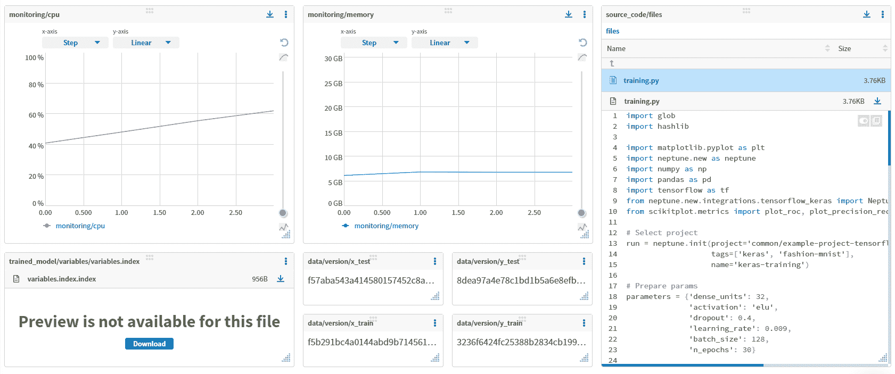
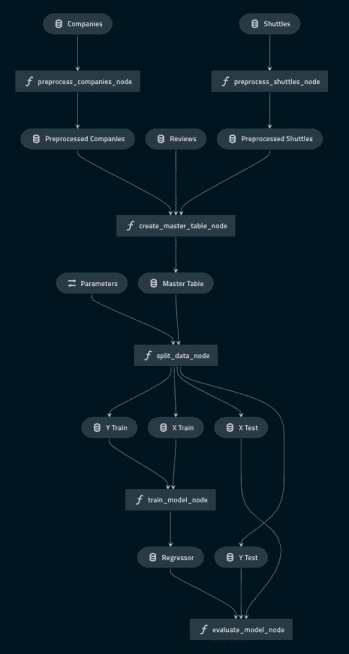
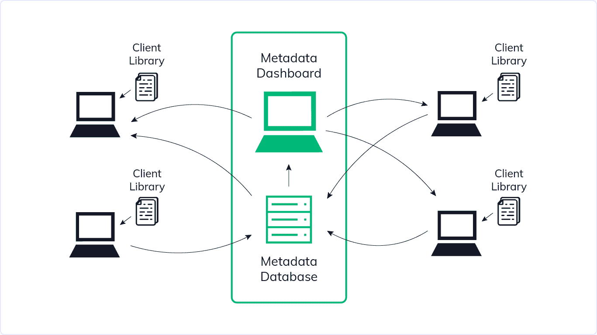
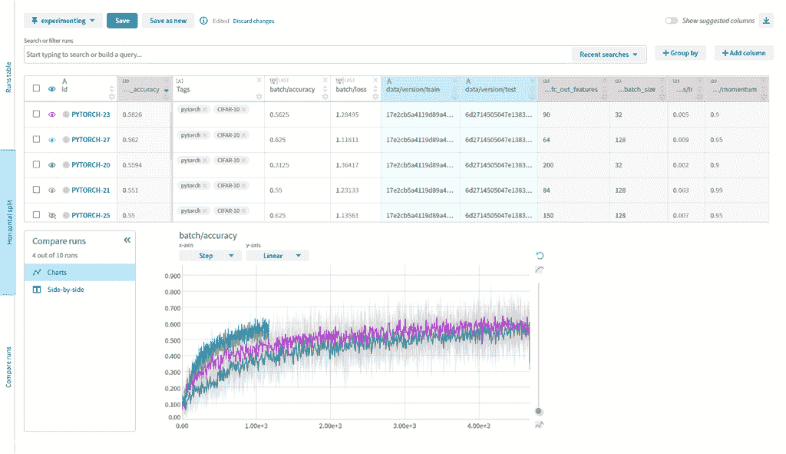
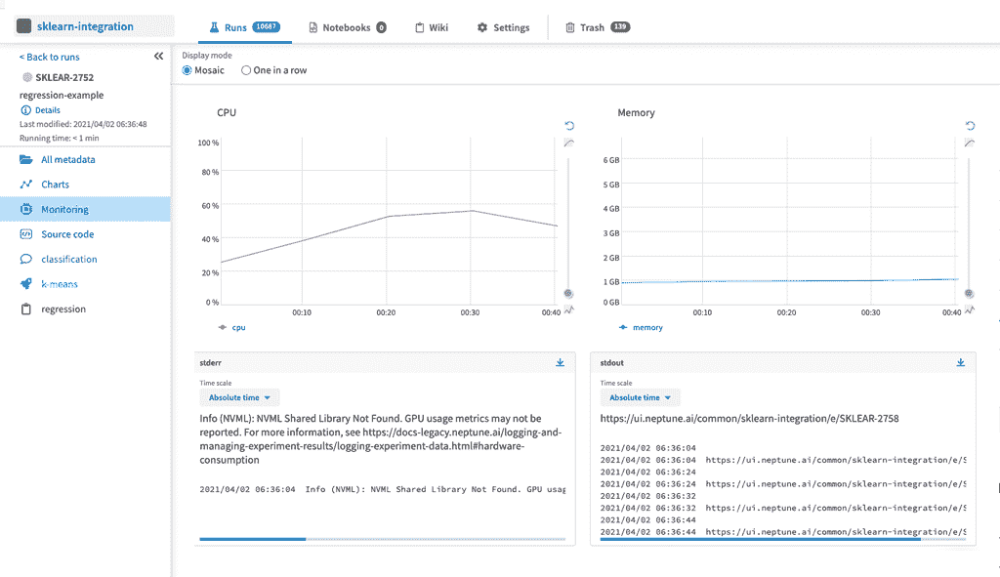
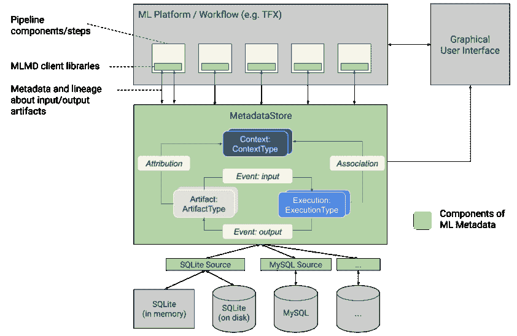

# ML 元数据存储:它是什么，为什么重要，以及如何实现它

> 原文：<https://web.archive.org/web/https://neptune.ai/blog/ml-metadata-store>

大多数找到这个页面的人都想改进他们的建模过程。

但是他们在存储和管理 ML 模型元数据方面的问题是不同的。

对一些人来说，问题在于杂乱的实验。

其他人已经将第一批模型部署到生产中，但是他们不知道这些模型是如何创建的，也不知道使用了哪些数据。

有些人已经在生产中有了许多模型，但是编排模型 A/B 测试，切换挑战者和冠军，或者触发、测试和监控再培训管道并不是很好。

如果你认为自己属于这些群体中的一员，或者介于两者之间，我可以告诉你，ML 元数据存储可以帮助你完成所有这些事情，还有其他一些事情。

您可能需要将其连接到其他 [MLOps 工具](/web/20230304071956/https://neptune.ai/blog/best-mlops-tools)或您的 CI/CD 管道，但它将简化大多数工作流程中的模型管理。

…但实验跟踪、[模型注册、](https://web.archive.org/web/20230304071956/https://neptune.ai/product/model-registry)模型存储、模型目录和其他与模型相关的动物也是如此。

那么 ML 元数据存储到底是什么，它与其他模型有什么不同，它如何帮助您更自信地构建和部署模型？

这就是这篇文章的内容。

另外，如果你是那种喜欢摆弄东西来看看它们是什么的人，你可以在 Neptune ML 元数据存储库中查看这个[示例项目。](https://web.archive.org/web/20230304071956/https://app.neptune.ai/common/example-project-tensorflow-keras/e/TFKERAS-14/dashboard/summary-6f234f52-6b77-476a-9486-63037655b3be)

但是首先…

在我们深入 ML 元数据存储之前，我可能应该告诉你我所说的“机器学习元数据”是什么意思。

当你做机器学习时，总会涉及到一个模型。这就是机器学习。

它可能是一个经典的监督模型，如 lightGBM 分类器、强化学习代理、贝叶斯优化算法或其他任何东西。

但它需要一些数据，通过一些数字运行，并输出一个决定。

…将它投入生产需要大量的工作。

您必须:

*   火车，
*   调，
*   调试，
*   评估，
*   解释一下，
*   并将其与基线进行比较。

如果您的模型通过了研究阶段，您还必须:

*   包装，
*   部署，
*   监视器，
*   重新训练它。

很多步骤。

现在你可能知道了，你不会线性地经历这些步骤，你不会经历一次。

修复数据、修复模型、修复预处理以及所有这些好的东西需要大量的迭代。

这些步骤中的每一步都会产生关于模型的元信息，或者许多人所说的 ML 模型元数据。

这些可能是:

*   训练参数，
*   评估指标，
*   预测实例，
*   数据集版本，
*   测试管道输出，
*   对模型权重文件的引用，
*   以及其他与模型相关的东西。

这些信息有助于您了解您的模型。

它有助于您了解:

*   模型的特定版本在哪里，并快速回滚到以前的版本
*   模型是如何构建的，是谁创建的
*   它在训练中使用了哪些数据/参数/代码
*   新的实验或模型版本与基线或以前的生产模型相比如何
*   它在各个评估阶段的表现如何

当你的模型对某人很重要时，当他们接触用户或帮助客户做决定时，你最好多了解他们。

为什么？

因为当你的模型工作时一切都很好，但当它停止工作时，你让它再次工作的唯一机会是理解它为什么失败。

但是你通常不会平等地关心所有的模型元数据。

对于某些工作流，实验元数据至关重要，对于某些工作流，它是生产模型元数据，对于某些工作流，它是再培训管道元数据。

由您来决定您和您的工作流程需要什么。

为了帮助您了解您可能关心的内容，让我们列出这些类别中的示例元数据。

### 关于实验和模型训练运行的元数据

在实验过程中，你通常关心的是[调试](/web/20230304071956/https://neptune.ai/blog/ml-model-debugging-and-tools)、[可视化](/web/20230304071956/https://neptune.ai/blog/the-best-tools-to-visualize-metrics-and-hyperparameters-of-machine-learning-experiments)、[监控](/web/20230304071956/https://neptune.ai/blog/ml-model-monitoring-best-tools)你的模型训练，以获得最佳模型。

为此，记录 ML 运行期间发生的任何事情都是一个好的做法，包括:

*   **数据版本:**参考数据集、md5 哈希、数据集样本，了解哪些数据用于训练模型
*   **环境配置:** requirements.txt，conda.yml，Dockerfile，Makefile 了解如何重建模型被训练的环境
*   **代码版本:**获取提交的 SHA 或代码的实际快照，以了解使用了什么代码来构建模型
*   **超参数:**管道的特征预处理步骤的配置，模型训练，以及必要时再现过程的推理
*   **训练指标和损失**:单值和学习曲线，看看继续训练是否有意义
*   **记录硬件指标:** CPU、GPU、TPU、内存看你的模型在训练/推理过程中消耗了多少
*   **评估和测试指标:**测试和验证集上的 f2、acc、roc，以了解您的模型表现如何
*   **绩效可视化:** ROC 曲线、混淆矩阵、PR 曲线，深入了解错误
*   **模型预测:**查看实际预测并了解超出指标的模型性能
*   …以及大约 100 万个与你的领域相关的其他东西

*Example of model training runs metadata |* [*Source*](https://web.archive.org/web/20230304071956/https://app.neptune.ai/o/common/org/project-cv/e/PROJCV-103/dashboard/variety-metadata-d78dd5d4-dc58-4488-baa0-0bbe1017ceec)

### 关于工件的元数据

除了实验和模型训练运行，在 ML 项目中还使用了一个概念:**工件**。这些运行的输入或输出可以在项目的许多运行中使用。工件在项目过程中会发生变化，在 ML 生命周期的某个时刻，您通常会有同一个工件的多个版本。

工件可以是数据集、模型、预测和其他类似文件的对象。对于您可能想要记录的工件:

*   **引用:**数据集或模型的路径(s3 存储桶，文件系统)
*   **Version:** Dataset 或 model md5 hash 让你快速看出区别
*   **预览:**数据集/预测预览(表头，图像文件夹快照)查看该数据集的内容
*   **描述:**关于神器的附加信息将帮助你理解它是什么。例如，您可能想要记录表格数据集工件的列名
*   作者:谁在何时创建和修改了这个工件
*   许多其他的事情可能是你的项目特有的，比如数据集的大小，ML 模型的类型等等

*Example of artifacts metadata |* [*Source*](https://web.archive.org/web/20230304071956/https://app.neptune.ai/o/common/org/example-project-tensorflow-keras/e/TFKERAS-13/dashboard/artifacts-9cc55d46-8e2b-476e-8ce7-f30ff1b01549)

### 关于已训练模型的元数据

经过训练的模型在 ML 项目中是如此重要的一类工件，以至于我决定给它们一个单独的类别。

一旦您的模型经过训练并准备好投入生产，您的需求就会从调试和可视化转变为知道如何部署模型包、对其进行版本化，以及在生产中监控性能。

因此，您可能希望记录的 ML 元数据是:

*   **模型包:**模型二进制文件或者模型资产的位置
*   **模型版本:**代码、数据集、超参数、环境版本
*   **评估记录:**一段时间内发生的所有测试/验证评估的历史记录
*   **实验版本:**链接到记录的模型训练(和再训练)运行以及与该模型版本相关的其他实验
*   模型创建者/维护者:谁构建了这个模型，如果/当出现问题时，你应该问谁
*   **下游数据集/工件:**数据集、模型和其他下游用于构建模型的资产的引用。这对于一些组织的法规遵从性来说是必不可少的。
*   **漂移相关指标:**所有“实时”生产的数据漂移、概念漂移、性能漂移
*   **硬件监控:**生产中消耗的 CPU/GPU/TPU/内存。
*   当你的模型向世界发送预测时，还有什么能让你晚上睡觉的吗

为了管理所有的元数据，你可以使用模型注册表、[生产模型监控工具](/web/20230304071956/https://neptune.ai/blog/ml-model-monitoring-best-tools)、[实验跟踪工具](/web/20230304071956/https://neptune.ai/blog/best-ml-experiment-tracking-tools)，或者软件监控解决方案。

*Example of trained model metadata*

### 关于管道的元数据

您可能处于这样一个点，您的 ML 模型在一个自动触发的管道中接受训练:

*   当性能下降到特定阈值以下时
*   当新的标记数据到达数据库时
*   当一个特征分支被合并开发时
*   或者干脆每周一次

您可能有一些 CI/CD 工作流连接到管道和编排工具，如 Airflow、 [Kubeflow](/web/20230304071956/https://neptune.ai/vs/kubeflow) 或 Kedro。在这些情况下，每个触发器开始执行计算 DAG(有向无环图),其中每个节点产生元数据。

[最佳工作流和管道编排工具](/web/20230304071956/https://neptune.ai/blog/best-workflow-and-pipeline-orchestration-tools)
[最佳 MLOps 工具](/web/20230304071956/https://neptune.ai/blog/best-mlops-tools)
[Kedro-Neptune 集成](https://web.archive.org/web/20230304071956/https://docs.neptune.ai/integrations-and-supported-tools/automation-pipelines/kedro)(允许您过滤、比较、显示和组织管道和节点中生成的 ML 元数据)

*Pipeline visualization in Kedro-Viz |* [*Source*](https://web.archive.org/web/20230304071956/https://kedro.readthedocs.io/en/stable/03_tutorial/06_visualise_pipeline.html)

在这种情况下，对元数据的需求与实验或模型有所不同。高效计算管道(DAG)需要此元数据:

*   **输入和输出步骤**:关于什么进入一个节点，什么从一个节点出来，以及是否所有的输入步骤都已完成的信息
*   **缓存输出:**引用来自管道的中间结果，以便您可以从图中的某个点继续计算

ML 元数据存储是 ML 模型相关元数据的“存储”。在这个地方，您可以获得您构建和部署的任何 ML 模型所需的任何东西。

更具体地说，ML 元数据存储使您能够:

*   日志，
*   店，
*   显示，
*   监视器，
*   比较一下，
*   组织起来，
*   过滤器，
*   并查询所有与模型相关的元数据。

简而言之，它给你一个**单一的地方来管理所有关于实验、工件、模型和管道的 ML 元数据。**

你可以把它想象成一个数据库和一个专门用来管理 ML 模型元数据的用户界面。它通常附带一个 API 或 SDK(客户端库)来简化 ML 元数据的日志记录和查询。

*Metadata store – a database and a user interface |* [*Source *](/web/20230304071956/https://neptune.ai/product)

等等，它是一个知识库/目录还是什么？

是的，不，算是吧。让我解释一下。

### 存储库 vs 注册表 vs 存储

在 ML 元数据的上下文中，所有这些基本上都是为存储元数据而创建的数据库，它们的功能略有不同。

**元数据库**是一个[的地方，在这里你存储元数据对象以及这些对象之间的所有关系](https://web.archive.org/web/20230304071956/https://en.wikipedia.org/wiki/Metadata_repository)。您可以使用 GitHub 作为一个存储库，将所有评估指标保存为一个文件，该文件是通过提交后钩子创建的，或者将训练期间的参数和损失记录到一个[实验跟踪工具](/web/20230304071956/https://neptune.ai/product/experiment-tracking)中，该工具在本文中实际上是一个存储库。

**元数据注册中心**是一个为重要元数据设置“检查点”的地方。您注册了一些您关心的东西，并希望以后可以方便地找到和访问它。一个[注册表总是为特定的东西服务的。没有通用注册中心](https://web.archive.org/web/20230304071956/https://doveltech.com/innovation/registries-vs-repositories-and-standards-vs-products/)。例如，您可能有一个[模型注册中心](/web/20230304071956/https://neptune.ai/product/model-registry)，它列出了所有的生产模型，并引用了 ML 元数据存储库，实际的模型相关元数据就在那里。

**元数据存储**是一个你去“购买”元数据的地方。对于 ML 模型，它是一个中心位置，在这里您可以找到所有的模型、实验、工件和管道相关的元数据。你越是需要来到“商店”，搜索元数据“产品”，比较它们，“购买”它们，它就越是一个商店而不是一个储存库。

所以在 ML 模型元数据的情况下:

*   你有许多不同的元数据:许多模型，许多版本，甚至更多的实验和每个实验的元数据
*   **你要经常查找和比较:**选择最佳模型训练运行或调试生产模型
*   **您希望经常记录和访问它:**记录实验的训练指标或获取打包的模型

称它为“存储”比称它为“存储库”或“注册表”更有意义，但是和软件一样，这要视情况而定。

现在，如果我告诉你实际上有两种风格的 ML 元数据存储呢？

### 管道优先与模型优先的 ML 元数据存储

随着你的 ML 组织的成熟，当训练模型发生在一些自动化的、协调的管道中时，你会到达一个点。

此时，运行实验、培训和再培训生产模型总是与执行管道相关联。

您的 ML 元数据存储可以:

*   将**管道视为一级对象**，并将生成的模型和实验与它们相关联。
*   将**模型和实验视为一级对象**，将管道视为一种执行模式。

根据您放在中心的内容，您的 ML 元数据存储将做稍微不同的事情。

如果你关注过程，模型构建管道，你会得到类似于 [MLMD](https://web.archive.org/web/20230304071956/https://www.tensorflow.org/tfx/guide/mlmd) 的东西，它驱动管道和编排工具，如 [Kubeflow](https://web.archive.org/web/20230304071956/https://www.kubeflow.org/) 和 [TensorFlow Extended (TFX)](https://web.archive.org/web/20230304071956/https://www.tensorflow.org/tfx) 。

如果你关注输出，模型，你会得到类似于 [MLflow](https://web.archive.org/web/20230304071956/https://mlflow.org/) 或者 [Neptune](/web/20230304071956/https://neptune.ai/product) 的东西。

哪个更好？

我想没有人知道，真的，但是 ML 社区的人们正在积极地测试这两者。

正如管道优先 ML 元数据商店的 MLMD 产品经理 Ben Mathes 解释的那样:

*“答案背后有一些很精彩的 HCI 和产品策略观点。*

在 ML 行业中有多种努力来解决跟踪所有 ML 工件的问题:模型、数据集、特征等。与经典软件工程迭代跟踪代码的多种方式相同(像 subversion 这样的集中回购，像 git 这样的分散回购，等等)。)，ML engineering 正在发展跟踪 ML Engineering 的最佳方式。

在我看来，ML-Flow 是一种模型优先的观点。如果你熟悉的话，这有点像 RDBMs 中的星型模式。与 TFX 的管道优先观点相反。MLMD 可以成为 TFX 管道记录每次运行的 DAG 历史的一部分。MLFlow 和 MLMD 都在积极开发中，所以这些意见是移动的目标🙂

理论上，每个视图(模型优先或管道优先)都可以从另一个视图中恢复。从管道优先视图中恢复模型优先视图更容易，因为它只需要隐藏信息(管道的其余部分)。但是模型优先视图可能不会首先存储模型之外的额外信息，如其训练数据、分析、与在相同管道上训练的其他模型的比较、模型的完整血统等。

所以 MLFlow 从一个不同于 ML 元数据的角度来看待这个问题。管道优先，而不是模型优先。我们谷歌发现，让管道成为一等公民更有用。"

“但是功能商店呢？”

好了，我们开始吧。

### ML 元数据存储与功能存储

ML 元数据存储类似于功能存储吗？是不是同样的东西只是用在不同的地方？

简单的回答是否定的(详细的回答也是否定的🙂 ).

Feature store 是一种 ML 设计模式和实现它的一类工具，它抽象了特征生成，并允许您:

以同样的方式创建和访问特征

确保您在生产中使用的功能与培训中使用的功能相同

重复使用特征进行模型构建和分析

如果你想了解更多关于功能商店的细节，可以看看泰克顿的人写的一篇文章，他创建了最好的功能商店之一。

他们比我更清楚如何解释这件事。

但是为了便于讨论，请务必记住，功能存储侧重于:

一致的特性工程(从开发环境到生产环境)

轻松访问各种功能

了解特征生成过程

正如我前面所解释的，ML 元数据存储处理模型元数据，并关注:

发现、可视化和比较实验

模型传承和版本控制

模型训练和实验的可重复性

轻松访问包装模型

但是模型版本化的一部分是知道哪些特性被用来创建它，对吗？

正确。

这就是为什么您可以将 ML 元数据存储连接到要素存储，并记录对用于训练的要素的引用。

这些工具应该很好地协同工作，以改进您的建模工作流程。

这给我们带来了最重要的问题…

现在您已经知道了它是什么，让我们深入了解它如何帮助您自信地管理模型。

根据您的工作流是侧重于实验还是生产，您从 ML 元数据存储中获得的需求和价值可能是不同的。

让我们来谈谈这两个极端。

### 为什么要存储机器学习实验的元数据？

在实验和模型开发过程中，您最关心的是找到一个足够好的模型。

然而，什么是足够好的呢？

它可能是一个比随机猜测稍微好一点的模型，或者它可能是这个问题的最先进的(SOTA)。和往常一样，这要视情况而定，但是要实现这一点，您通常需要运行许多迭代。

为了在每次迭代中改进您的模型，您需要:

*   **知道之前尝试过什么**
*   **将**新想法与基线或当前最佳模型进行比较
*   **可视化模型结果，**执行错误分析，看看哪里可以改进
*   能够重现你之前尝试过的想法
*   **调试模型和/或基础设施的问题**

ML 元数据存储通过为您提供以下功能来帮助您完成所有这些工作:

*   在一个地方保存所有实验和 ML 模型元数据的跟踪记录
*   搜索/过滤界面找到你关心的实验
*   可视化和比较实验的工具
*   接口来记录/显示在调试过程中可能有用的所有元数据

*Metadata store dashboard |* [*Source*](https://web.archive.org/web/20230304071956/https://app.neptune.ai/o/common/org/example-project-pytorch/experiments?compare=EwBgNAjGxgLEA&split=bth&dash=charts&viewId=64eb9112-34ca-495c-a5cf-cd5e48e35864)

### 为什么要存储关于生产机器学习模型的元数据？

一旦你的模型投入生产，你的兴趣就会发生很大变化。

您有一个足够好的经过训练的模型版本，但是您想确信您可以在业务应用程序中使用它。具体来说，您可能希望:

*   **了解模型是如何建造的。**谁造的，用了哪些代码、数据、参数、环境版本来训练它。
*   **包装**模型，以便有人可以在不知道里面是什么的情况下使用。
*   **从您的生产环境中轻松访问**打包模型的当前和以前版本。
*   **检查、监控并提醒**模型输入/输出分布的任何意外变化。
*   **监控硬件**随时间的消耗。
*   **在新模型版本部署到生产之前，对其进行测试和批准**。
*   **拥有自动化的 CI/CD 管道**用于测试和培训模型。
*   更多

ML 元数据存储可以使它变得更容易，因为它提供了:

*   接口为团队建立模型版本化和打包的协议
*   能够通过 CLI 和 SDK 以您在生产中使用的语言查询/访问模型版本
*   记录硬件、数据/概念漂移、CI/CD 管道的示例预测、再培训工作和生产模型的地方
*   接口来设置由主题专家、生产团队或自动检查进行批准的协议

*Monitoring in a metadata store*

### 你需要一个 ML 元数据存储吗？

但是知道了这些，你真的需要一个吗？

你能仅仅用一个电子表格、文件夹结构、tensorboard 截图和一个 S3 桶就搞定吗？

是的，当然，有时候，但这有什么意义呢？

一位智者曾经告诉我，每一个商业问题都可以通过一个电子表格、google drive 和大量的动力来解决。

我真心相信他是对的。

真正的问题是，为什么要这么做。

**为什么要在 ML 模型元数据簿记上浪费时间**当您可以:

改进模型的工作

自动化、测试或记录管道的某些部分

找出 ML 要解决的下一个问题

向用户介绍您的解决方案

或者坦白地说，在 youtube 上看《猫》

所有这些都比编写胶水代码或在谷歌表单中输入参数更能利用你的时间…

但是你可以说:“我可以写脚本来自动化所有这些”。

嗯，好吧，我们来谈谈实现。

### 构建 vs 维护 vs 购买

这是一个古老的难题。从事软件工作的人在职业生涯中会面临很多次。

要做出决定，您应该:

*   了解你实际上在解决什么问题

*   在构建之前，看看是否有工具可以解决这个问题
*   评估构建、维护和定制它需要多少时间
*   不要低估为此付出的努力

但是，让我们具体看看您在 ML 元数据存储上下文中的选项。

#### 自己建立一个系统

赞成的意见

| 骗局 |  |
| --- | --- |
|  | 

你可以完全为你的用例

创建它 |
| 您可以完全根据您的用例来创建它 | 你必须建立和维护基础设施 |
| 你可以随意改进/改变它 | 你必须为其他人记录下来 |
|  |  |
| 

你必须实现改进并与其他工具集成

 | 您必须实现改进并与其他工具集成 |
| 

软件不工作是你的错

 | 当软件不工作时，那是你的错 |

你可以自己建造整个东西。为元数据设置一个数据库，创建一个可视化界面和一个 python 包来记录数据。

它肯定会完美地工作。

当元数据的数量变得太大，数据库无法处理时，您可以对其进行优化。你可以设置备份和分片，使其防弹。

如果您创建的笔记本中缺少可视化功能，您可以设置适当的 web 界面，并实现与数据库的通信。然后，优化它，智能地处理数据负载，并学习一些设计，使它看起来很好。

您可以实现与 ML 框架的集成，以简化日志记录。如果日志记录部分降低了您的训练脚本的速度，您可以实现一些与数据库的异步通信，以便在单独的线程中记录更大的元数据对象，如图像或音频。

当人们加入你的团队并喜欢你所创建的东西时，你可以创建例子和文档来帮助他们使用它，并随着每一次改进而更新它。

你可以，你可以，但是你的工作是实现和维护一些元数据簿记工具吗？

有时没有其他办法，因为你的设置是超级定制的，你解决的问题与其他人的问题如此不同，以至于你必须这样做。

其他 99.6%的时候，你可以使用别人开发的工具，专注于你应该首先解决的问题。我想是和曼梯·里有关的。

保持开源

#### 赞成的意见

骗局

|  | 

你要建立和维护基础设施

 |
| --- | --- |
| 你必须建立和维护基础设施 | 

你不用实现它

 |
| 

你要根据自己的需求调整

 | 

文档和社区支持已经存在

 |
| 

你必须依靠社区的支持

 | 

其他人正在创造你可能关心的改进

 |
| 

你可以推出新功能，但可能必须自己实现

 |  |
| 当软件不工作时，那是你的错 |  |
| 项目可能会被创建者/维护者/社区放弃 |  |

这通常是一个好的选择，因为您想要的许多特性已经实现了。您可以看到它是如何完成的，并在需要的地方扩展功能。

使用该工具的文档和社区可以帮助您。你可以叉回购，并感到安全，该工具不会消失。

说真的，这通常是一个好的选择，但是有**一些事情需要考虑**。

一个问题是，通常您仍然需要自己设置和维护它。你必须处理备份，后端数据库的自动伸缩，以及所有这些事情。

另一件事是，即使社区就在那里，当你有问题时，他们也不一定会帮助你。你可能要等几个星期才能得到 GitHub 问题的答案。

第三，如果缺少了什么，你实际上需要继续下去，花一些时间去实现它。

我的观点是，使用开源软件，你不需要为订阅或许可付费，但它并不完全免费。您仍然需要支付:

托管它的基础设施

您或您的团队花费在维护和扩展软件上的时间

*   你或你的团队花在解决问题和寻找解决方案上的时间。
*   不是说不好。只是需要考虑和顾及的事情。
*   你可以把你投入到建立基础设施、维护、修复和扩展项目的时间花在其他事情上，比如做 ML。

购买解决方案

赞成的意见

#### 骗局

你不用实现它

| 你不必实现它 |  |
| --- | --- |
| 

文档和支持由厂商

提供 | 

您可能无法自己修复错误/做出改进，供应商修复它们的速度可能会很慢

 |
| 您可能无法自己修复 bugs 进行改进，供应商修复它们的速度可能会很慢 | 基础设施已经存在(对于托管选项) |
| 公司可能会退出市场 | 当您需要功能时，您可以请求它们 |
|  |  |
|  | 实际上，许多开源项目都有企业版，你可以付费获得支持或托管版本。 |

所以，是的，你可以花钱请人来:

托管解决方案并扩展基础架构

维护软件

为您提供正常运行的保证，并在出现问题时解决问题

*   支持你和你的团队
*   改进和扩展产品，以帮助您解决您的用例
*   专注于做 ML 的事情。
*   当然，事情并非一帆风顺。
*   您可能仍然会遇到错误，等待数周的改进，或者产品背后的公司可能会破产。

但是这仍然是一个比在你的生产模型变得疯狂的周末修复一些废弃的开源项目的错误更好的选择。最好有一个支持团队，你可以打电话给他们，让他们知道这是他们的问题。

无论如何，假设你想要一个 ML 元数据管理工具。你能用什么？

有哪些 ML 元数据存储解决方案？

MLMD(机器学习元数据)

正如[官方文件所说的](https://web.archive.org/web/20230304071956/https://www.tensorflow.org/tfx/guide/mlmd)。

### ML 元数据(MLMD)是一个用于记录和检索与 ML 开发人员和数据科学家工作流相关的元数据的库。MLMD 是 TensorFlow Extended (TFX)不可或缺的一部分，但其设计可以独立使用。”

#### 它是一个开源的管道第一 ML 元数据存储，支持 TensorFlow Extended (TFX)和 Kubelfow。

[查看教程](https://web.archive.org/web/20230304071956/https://www.tensorflow.org/tfx/tutorials)并开始学习。

MLflow

*A high-level overview of the various components that are part of MLMD |* [*Source*](https://web.archive.org/web/20230304071956/https://www.tensorflow.org/tfx/guide/mlmd)

据[mlflow.org](https://web.archive.org/web/20230304071956/https://mlflow.org/):

MLflow 是一个管理 ML 生命周期的开源平台，包括实验、再现性、部署和中央模型注册。MLflow 目前提供四个组件:MLFlow 跟踪、MLFlow 项目、MLFlow 模型、模型注册"

#### 这是一个开源的模型优先的 ML 元数据存储，您可以使用它来跟踪您的实验(MLFlow Tracking)或打包生产模型(Model Registry)。

如果你有兴趣，可以看看一些使用 MLflow 的[例子。](https://web.archive.org/web/20230304071956/https://mlflow.org/docs/latest/tutorials-and-examples/index.html)

海王星

*A list of experiment runs with metrics in MLflow UI |* [*Source*](https://web.archive.org/web/20230304071956/https://www.mlflow.org/docs/latest/tutorials-and-examples/tutorial.html#training-the-model)

Neptune 是 MLOps 的一个元数据存储库，为运行大量实验的研究和生产团队而构建。

它为您提供了一个中心位置来记录、存储、显示、组织、比较和查询机器学习生命周期中生成的所有元数据。

#### 个人和组织使用 Neptune 进行实验跟踪和模型注册，以控制他们的实验和模型开发。

它[支持许多与 ML 模型相关的元数据](https://web.archive.org/web/20230304071956/https://docs.neptune.ai/you-should-know/what-can-you-log-and-display)类型，[集成了 MLOps 生态系统中的大多数库](https://web.archive.org/web/20230304071956/https://docs.neptune.ai/integrations-and-supported-tools/intro)，你可以[在大约 5 分钟内开始免费使用它](https://web.archive.org/web/20230304071956/https://docs.google.com/document/d/1xrmbWXp6noEyiSQXWucMs9PhlO4EXND34Zo28JyQ33U/edit#/register)。

如果您想了解更多信息:

要了解更多选项，请查看我们写的这篇关于[最佳 ML 元数据存储解决方案](/web/20230304071956/https://neptune.ai/blog/best-metadata-store-solutions)的文章，并对它们进行比较。

最后的想法

*Example dashboard in Neptune |* [*Source*](https://web.archive.org/web/20230304071956/https://app.neptune.ai/o/common/org/example-project-tensorflow-keras/e/TFKERAS-13/dashboard/summary-6f234f52-6b77-476a-9486-63037655b3be)

如果你能走到这一步，太好了。感谢您的阅读！

现在，您可能想要自己构建一个 ML 元数据存储库，设置并维护一个开源工具，或者选择一个付费的解决方案。

## 我们花了数年时间为许多 ML 团队构建、修复和改进 Neptune，以获得人们真正想要使用的东西。

**所以如果你决定** [**试试海王，**](/web/20230304071956/https://neptune.ai/pricing) **牛逼！**

ML 模型元数据管理实际上是我们唯一想做好的事情，所以我们略知一二。

如果你走另一个方向，也很棒:)。

当你在自己构建它的时候遇到了障碍，或者受到了其他工具的限制，请联系我们，我们很乐意帮助你。

在那之前，快乐训练！

If you go in the other direction, also great :).

When you hit roadblocks building it yourself or get to limitations of the other tools, just reach out, we’d be happy to help.   

Until then, happy training!