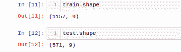
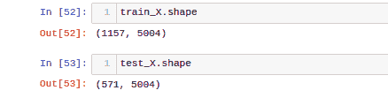
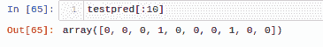
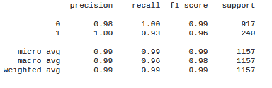
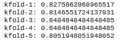
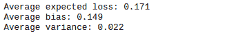

# ML 模型解释工具:什么，为什么，以及如何解释

> 原文：<https://web.archive.org/web/https://neptune.ai/blog/ml-model-interpretation-tools>

[解释](https://web.archive.org/web/20221206010752/https://towardsdatascience.com/explainable-artificial-intelligence-part-2-model-interpretation-strategies-75d4afa6b739#:~:text=Model%20interpretation%20at%20heart%2C%20is,impact%20to%20business%20and%20society.)字面意思是解释或展示自己对某事的理解。

当您创建一个 ML 模型时，它只不过是一个可以学习模式的算法，对于其他项目涉众来说，它可能感觉像一个黑盒。有时甚至对你。

这就是为什么我们有模型解释工具。

## 什么是模型解释？

一般来说，ML 模型必须获得预测，并使用这些预测和最终的见解来解决一系列问题。我们已经可以问几个后续问题了:

*   这些预测有多可信？
*   他们是否足够可靠，可以做出重大决策？

模型解释将你的注意力从‘结论是什么？’“为什么会得出这个结论？”。您可以了解模型的决策过程，即究竟是什么驱动模型对数据点进行正确或错误的分类。

## 为什么模型解释很重要？

考虑一个哈士奇与狼(狗品种)分类器的例子，其中一些哈士奇被错误地分类为狼。使用可解释的机器学习，您可能会发现这些错误分类主要是因为图像中的雪而发生的，分类器将雪用作预测狼的特征。

这是一个简单的例子，但是您已经可以看到为什么模型解释是重要的了。它至少在几个方面有助于您的模型:

*   公平——公司用来决定加薪和晋升的一个可解释的模型可以告诉你为什么某个人得到或没有得到晋升。
*   **可靠性**–输入的微小变化不会导致多米诺骨牌效应，也不会大幅改变输出。
*   **因果关系**–只有因果关系对决策有用。
*   **信任**——对于所有的项目涉众来说，尤其是在非技术方面，更容易信任一个可以用外行的术语解释的模型。

## 如何解读一个 ML 模型？

机器学习模型的复杂程度和性能各不相同。一种尺寸并不适合所有人。于是，就有了不同的解读方式。这些方法主要可分为以下几类:

1.  **特定型号/不特定型号**
    *   特定于模型的方法是特定于某些模型的，它们依赖于模型的内部机制来做出某些结论。这些方法可能包括解释广义线性模型(GLMs)中的系数权重，或神经网络中的权重和偏差。
    *   模型无关的方法可以用在任何模型上。它们通常在培训后使用。它们通常通过分析要素输入-输出对之间的关系来工作，并且无法访问模型的内部机制，如权重或假设。
2.  **局部/全局范围**
    *   局部范围仅涵盖单个预测，仅捕获指定预测背后的原因。
    *   全局范围超越了单个数据点，涵盖了模型的一般行为。

让我们创建一个模型来解释。我们将对模型创建步骤做一个简短的演练，然后我们将关注不同的与模型无关的工具和框架来解释创建的模型，而不是解决实际的问题。

## 模型创建

### 1.加载数据集



数据集架构:

属性

| 描述 |  |
| --- | --- |
| 

社交媒体帖子类型

 | 社交媒体帖子的类型 |
| 

社交媒体帖子的领域

 | 社交媒体帖子的领域 |
|  |  |
|  |  |
|  |  |
|  |  |
|  |  |
| 

帖子的实际文字对话

 | 帖子的实际文本对话 |

患者标签

(1 =患者，0 =非患者)

| 2.执行探索性数据分析和数据预处理 | 填充空值。 |
| --- | --- |

删除冗余特征，如时间(GMT)。

### 通过删除所有字母数字字符来清理文本数据。

1.  编码分类值属性的标签
2.  处理某些属性中出现的错误值
3.  基于文本的特征的词汇化和 Tf-Idf 矢量化。
4.  3.特征工程
5.  将所有文本特征组合成单个文本特征以弥补缺失值。
6.  将数据映射到工作日。

### 将时间映射到小时。

*   基于对话文本的长度创建另一个特征。
*   4.最终培训和测试数据集
*   可以看出，tf-idf 矢量化以及特征工程导致了训练和测试数据集中属性数量的增加。
*   5.训练分类器

### 虽然一系列模型可以用于这项任务，但我们将使用随机森林分类器，它不容易解释，因为它很复杂。我们希望使用一些工具和框架来使它变得可解释。

6.获取测试数据集的预测



### 7.模型性能评估

由于我们没有来自测试数据集的正确标签，让我们通过训练分类报告和 K 倍交叉验证分数来看看我们的模型是如何执行的。

```py
From sklearn.ensemble import RandomForestClassifier
rfc = RandomForestClassifier()
rfc.fit(train_X,y)
```

### 培训分类报告:

```py
testpred = rfc.predict(test_X)

```



### k 倍交叉验证分数:

既然我们已经建立了一个模型，是时候开始使用解释工具来解释我们模型的预测了。我们将从最流行的工具之一 ELI5 开始。

1.ELI5



ELI5 是“像我 5 岁一样解释”的首字母缩写。这是一个很受欢迎的 Python 库，因为它很容易使用。它主要用于:



了解在预测中起关键作用的重要特征。

### 来分析某个特定的个人预测，看看到底是什么导致了这个模型的预测。

ELI5 更多地以局部/全局范围的方式解释模型，而不是我们上面讨论的特定/不可知的方式。

*   此外，目前 ELI5 只能用于几个主要的模型 Sklearn 广义线性模型(GLMs)和基于树的模型，Keras 模型，LightGBM，XGBoost，CatBoost。
*   如何安装 Eli5

可以使用 pip 命令安装 Eli5。

或者，可以用 conda 命令安装。

#### 在我们的模型上使用 Eli5

让我们首先导入所需的依赖项

```py
pip install eli5

```

答:**特征权重和重要性**

```py
conda install -c conda-forge eli5
```

#### 让我们从一个标准的函数调用开始。

这是从另一端出来的。

```py
Import eli5

```

“权重”列包含“特征”列中显示的相关特征的权重。现在你可能会想，如果特征是数字，你怎么理解任何东西？这些见解很难解释。为了解决这个问题，我们需要对我们的原始函数调用进行一些修改。

这里，我们使用 vect(Tf-Idf 矢量器)和包含工程特性的可变列来获取特性名称。然后，特性名称作为* *参数传递给同一个函数。这是我们现在得到的。

```py
eli5.show_weights(rfc)
```

因为我们有 5000 个 Tf-Idf 特性，所以看到很多词被赋予高度重要性是有意义的。除了单词之外，还有一个特征“text_num_words”，它是在特征工程之后获得的。它被列为第 12 个最重要的功能。这可能是一个迭代的过程，你可以看到工程属性的活力，如果需要，重新设计它们。

我们还可以:

```py
columns = ['Source','weekday','hour','text_num_words']
feature_names = list(vect.get_feature_names()) + columns
eli5.show_weights(rfc, feature_names = feature_names)

```

使用“Top”参数指定我们是需要所有功能还是只需要前“n”个功能。

使用 features_re 和 features_filter 参数只获取那些符合我们的条件和约束的功能。

现在我们来看看 Eli5 的另一个用例。

*   B: **个体预测分析**
*   孤立地分析某些预测可能非常有价值。你可以用通俗易懂的语言向所有利益相关者解释所获得的预测背后的数学机制。

先查一个真阳性的案例。

这是导致模型预测该数据点属于患者的原因。

因此，模型推断这个数据点属于一个病人，因为有类似'**增大的心脏**'、**医院心脏**'、**眩晕**'、**癌症**等特征..有道理。<BIAS>’，即基于训练集分布的模型输出的预期平均得分，起着最关键的作用。

现在让我们来看一个真否定的例子。

```py
eli5.show_prediction(rfc,train_X.toarray()[1],
feature_names=feature_names, top=20, show_feature_values=True)

```

与第一张图片相比，我们可以清楚地看到

健康/医疗条件太差了。即使像“已诊断”、“充血性心脏”这样的几个特征进入了前几名，它们的相关贡献和价值也是零。

让我们转向另一个令人兴奋的工具。

2.石灰

[LIME](https://web.archive.org/web/20221206010752/https://github.com/marcotcr/lime) 代表**L**ocal**I**interpretable**M**model-agnostic**E**explanations。让我们更深入地了解一下这个名字:

术语“局部”意味着对单个预测的分析。LIME 让我们对某个预测背后发生的事情有了更深入的了解。

### 它是模型不可知的，这意味着它将每个模型都视为一个黑盒，因此它可以在不访问模型内部的情况下进行解释，从而允许它与广泛的模型一起工作。

正如名字一样直观，其解释逻辑背后的思想也一样直观:

*   LIME 主要测试一旦模型在输入数据中出现某些变化时，预测会发生什么情况。
*   为了测试这一点，LIME 在一个新的数据集上训练了一个可解释的模型，该数据集由扰动的样本和黑盒模型的相应预测组成。

这个新的学习模型需要是一个好的局部近似(对于某个个体预测)，但不必是一个好的全局近似。它在数学上可以表示为:

*   解释模型，例如 x，是由 LIME 创建的可解释模型 g，其最小化损失函数 L，损失函数 L 测量解释与原始模型 f 的预测有多接近，同时模型复杂度ω(g)保持较低(较少特征)。g 是一族可能的解释，即所有的 glm。
*   石灰怎么装？
*   像 ELI5 一样，它也可以用一个简单的 pip 命令安装。

或者使用 conda 命令。

#### 在我们的模型上使用石灰

LIME 主要提供三种解释方法，这三种方法处理不同类型的数据:

```py
pip install lime

```

表格解释，

```py
conda install -c conda-forge lime
```

#### 文字解读，

图像解读。

*   在我们的 5004 个可训练属性中，有 5000 个是基于 Tf-Idf 的特性，而这些特性除了单词什么也不是。s，我们就用莱姆的文本解读法。为此，我们必须对我们的训练做一些改变。
*   如你所见，我们现在只使用矢量化的文本特征进行建模。
*   正如我们所知，LIME 准备了一个新的数据集，并在此基础上训练自己的可解释模型。但是对于文本数据，LIME 是如何做到的呢？这是怎么回事:

通过切换原始文本中随机选择的单词的存在/不存在来创建新文本。

```py
rfc.fit(vectorized_train_text,y)
```

如果包含相应的单词，则特征为 1，如果移除，则特征为 0，从而使其成为二进制表示。

理论部分讲够了，让我们来看看石灰的作用。

*   导入所需的依赖项:
*   进行所需的函数调用:

首先，我们创建一个文本解释器的实例。然后，因为我们正在处理文本特征，所以我们使用 sklearn 的管道方法将我们的矢量器(vect)与我们的模型(rfc)相结合，以便文本特征(将获得输入)可以被矢量化，并且预测可以发生。

就像 ELI5 一样，让我们先检查一个真正的正实例。

```py
Import lime
From sklearn.pipeline import make_pipeline

```

让我们画出实例结果，看看我们会得到什么。

```py
explainer = lime.lime_text.LimeTextExplainer(
class_names=[‘Not Patient’, ‘Patient’])
pl = make_pipeline(vect,rfc)

```

在阅读文本时，它变得非常清楚，它是在谈论一些在急需的心脏移植后挽救了生命的病人，同时感谢医务人员。我们可以看到突出显示的单词出现在“患者”列中，因此负责将该数据点正确分类为“患者”。

现在让我们看看一个真正的负实例的解释图是什么样子的。

```py
exp = explainer.explain_instance(
train[‘combined_text’][689], pl.predict_proba)

```

第一眼看到突出显示的关键词，如“冷”、“脂肪”、“烧伤”等。，该数据点看起来与“患者”类别相关联。在实际阅读时，我们理解文本是在谈论洗冷水澡的好处，显然，我们的模型也理解这一点。

```py
exp.show_in_notebook()

```

到目前为止一切顺利。但是如果我们的特征是表格格式的连续值，或者是图像的像素值呢？

为此，我们只需要记住我们上面讨论的内容:

数据类型

功能

正文

| lime.lime_text。LimeTextExplainer() | 表格 |
| --- | --- |
| lime . lime _ tabular . limetable plainer() | 图像 |
| lime . lime _ image . lime image explainer() |  |
| 好了，让我们进入下一个模型解释工具——SHAP。 | 3.SHAP |

SHapley**A**additive ex**P**解释是一种解释任何机器学习模型输出的博弈论方法。 [SHAP](https://web.archive.org/web/20221206010752/https://christophm.github.io/interpretable-ml-book/shap.html) 通过计算每个特征对预测的贡献来解释一个实例的预测。它使用 Shapley 值。

**什么是沙普利值？**

### 沙普利值——一种来自联盟博弈论的方法——告诉我们如何在特性之间分配“支出”。

因此，可以通过假设实例的每个特征值是游戏中的“玩家”来解释预测，其中预测是支出。

【Shapely 值是怎么计算出来的？

*   Shapely 值是所有可能组合中某个特征值的平均边际贡献。
*   假设我们有一个形状为 N x M 的数据集，其中 N 是样本数，M 是特征数，例如 5–A、B、C、D & E。

e 是具有连续值的从属属性，而 A，B，C，D 是我们的分类值预测值。

*   现在，假设我们要计算特征 A 的贡献，即计算它的 Shapely 值。
*   我们通过从数据集中随机选取一个实例并使用其特性 d 的值来模拟只有 A、B 和 C 在一个联盟中，然后我们预测这个组合的 E，假设它是 x。
*   现在我们用从 A 的域中随机抽取的值替换这个组合中的特征 A 的值(假设它是不同的),并再次预测 E，假设这次它是 Y。
*   X-Y 之间的差异，无论是正的还是负的，都是特征 A 在预测中的贡献。
*   对 A 值的这个采样步骤被反复重复，并且贡献被平均以获得 A 的 Shapely 值。
*   SHAP 的解释可以用数学方法表达为:
*   其中 g 是解释模型，z′ϵ{0,1}^m是联合向量，m 是最大联合大小，而 [j] ϵ R 是特征 j 的匀称值
*   理论到此为止，让我们看看 SHAP 在我们的模型上表现如何。

如何安装 SHAP

就像其他库一样，可以用 pip 命令安装，只要确保 pip 版本在 19.0 以上即可。

如果你在使用 pip 时遇到任何错误，你总是可以使用 conda 进行安装。

#### 在我们的模型上使用 SHAP

导入所需的依赖项:

```py
pip install shape

```

根据您的型号，您可以使用 SHAP 提供的不同解释器。因为我们正在处理一个随机的森林分类器，我们将使用 SHAP 的树解释器。

```py
conda install -c conda-forge shap

```

#### 让我们为我们的特征计算 shap 值。请记住，由于我们的大多数特性都是基于文本的，我们将利用它们来理解我们的模型，就像我们对 LIME 所做的那样。

shap_values 是一个包含 2 个数组作为元素的列表，对应于我们数据集中的 2 个类。所以，我们可以从这两个类的角度来解释这个预测。

```py
Import shap

```

按照我们的方法，让我们首先从解释一个真实的正例开始。为了展示一致性，我们将检查与 LIME 相同的数据点。

```py
explainer = shap.TreeExplainer(rfc)

```

情节是这样的:

```py
shap_values =
explainer.shap_values(vectorized_train_text.toarray(),check_additivity=False)

```

现在，代码中的索引，以及情节本身，似乎有点令人不知所措。让我们一步一步地分解它。

与“患者”类相关的值出现在 expected_value 和 shap_values 的第一个索引处，因此该图是从“患者”类的角度绘制的。

```py
shap.initjs()
shap.force_plot(explainer.expected_value[1], shap_values = shap_values[1][689], features = vectorized_train_text.toarray()[0:][689], feature_names = vect.get_feature_names())

```

关于剧情:

所有特征值的预测得分为 0.74，以粗体显示。

基值= 0.206 是训练模型的所有输出值的平均值。

显示为粉红色(红色)的特征值会影响对类别 1(患者)的预测，而显示为蓝色的特征值会将结果拉向类别 0(非患者)。

*   彩色块的大小表示特征重要性的大小。
*   由于我们的预测得分(0.74)>基础值(0.206)，该数据点已被积极分类，即类别=患者。
*   如果我们从另一个类的角度来看这个实例，会发生什么？
*   我们很容易理解这里发生了什么:
*   我们将 expected_value 和 shap_values 的索引从 1 切换到 0，因为我们希望视角从“患者”反转到“非患者”。

因此，所有出现在粉红色(红色)中的特征已经切换到蓝色，并且现在对“非患者”类别的预测产生负面影响。

```py
shap.initjs()
shap.force_plot(explainer.expected_value[1], shap_values = shap_values[1][689], features = vectorized_train_text.toarray()[0:][689], feature_names = vect.get_feature_names())

```

尽管预测得分(0.27)

*   现在让我们检查真正的否定实例。
*   剧情出来是这样的。
*   由于预测分数小于基础值，因此被归类为“没有耐心”。

除了局部解释，SHAP 还可以通过全局解释来解释模型的一般行为。

```py
shap.initjs()
shap.force_plot(explainer.expected_value[1], shap_values = shap_values[1][120], features = vectorized_train_text.toarray()[0:][120], feature_names = vect.get_feature_names())

```

从代码中可以明显看出，我们是从“患者”类别的角度绘制的，我们可以看到“充血性心脏”、“充血性心力衰竭”和“麻烦”等特征向红色光谱延伸，因此对“患者”类别起着必不可少的作用。

一开始，SHAP 提供的一系列功能可能会让你有些不知所措，但是一旦你掌握了它，没有什么比这更直观的了。

我们将查看另一个解释库，MLXTEND。

```py
shap.summary_plot(shap_values = shap_values[1], features = vectorized_train_text.toarray(), feature_names = vect.get_feature_names())

```

4.MLXTEND

MLxtend 或机器学习扩展是一个用于日常数据科学和机器学习任务的有用工具库。它提供了广泛的功能。

到目前为止，我们只分析了文本特征，其他特征仍然是局外人。这一次，让我们使用 [MLXTEND](https://web.archive.org/web/20221206010752/http://rasbt.github.io/mlxtend/) 来看看其余的特性。

### 如何安装 MLXTEND

它可以用一个简单的 pip 命令安装。

或者，您可以从[https://pypi.python.org/pypi/mlxtend](https://web.archive.org/web/20221206010752/https://pypi.python.org/pypi/mlxtend)手动下载这个包，解压缩它，导航到这个包，并使用命令:

#### 在我们的模型上使用 MLXTEND

导入所需的依赖项:

```py
pip install mlxtend

```

MLXTEND 提供不同的功能，例如:

```py
python setup.py install

```

#### **1。PCA 相关圆**

一种有趣的观察结果的方式是通过主成分分析。

```py
Import mlxtend

```

MLXTEND 允许您使用 plot_pca_correlation_graph 函数绘制 PCA 相关圆。

我们基本上计算我们的特征和主成分之间的相关性。

*   然后这些相关性被绘制成单位圆上的向量，其轴是主分量。
*   特定的主成分可以作为元组传递给 dimensions 函数参数。
*   相关圆轴显示了相应主成分解释的方差百分比。
*   让我们为剩下的特征画出这个相关圆，看看我们会得到什么。
*   第一主成分解释了总方差的 31.7%，而第二主成分解释了 25.8%
*   Text_num_words & Source 更符合第一台电脑，而 hour 和 weekday 更符合第二台电脑。

**2。偏差-方差分解**

```py
from mlxtend.plotting import plot_pca_correlation_graph
from sklearn.preprocessing import StandardScaler
X = StandardScaler().fit_transform(train[['text_num_words', 'weekday','hour','Source']].values)
fig, corr_matrix = plot_pca_correlation_graph(
    X,
    ['text_num_words', 'weekday','hour','Source'],
    dimensions=(1, 2),
    figure_axis_size=6
)

```

*   大家都知道偏差-方差权衡，这个问题困扰着所有的机器学习项目。
*   通常目标是在两者之间找到一个最佳点，通过保持低偏差来避免欠拟合，通过保持低方差来避免过拟合。

很难获得任何预测模型的偏差-方差分数，但 MLXTEND 可以将模型的泛化误差分解为偏差、方差和误差分数。

*   让我们尝试为我们的随机森林分类器计算这个分数。
*   为了进行这种计算，必须将我们的数据集分成训练和测试。
*   这就是结果。

在这个练习中，我们根据文本特征来训练模型。

```py
from mlxtend.evaluate import bias_variance_decomp
from sklearn.model_selection import train_test_split
X_train, X_test, y_train, y_test = train_test_split(vectorized_train_text, y,test_size=0.25,
random_state=1,shuffle=True,stratify=y)

```

根据我们得到的分数，我们可以推断我们的模型可能擅长泛化，也就是说，它没有过度拟合。

```py
avg_expected_loss, avg_bias, avg_var = bias_variance_decomp(
        clf2, X_train, y_train, X_test, y_test,
        loss='mse',
        num_rounds=50,
        random_seed=1
)
print(f"Average expected loss: {avg_expected_loss.round(3)}")
print(f"Average bias: {avg_bias.round(3)}")
print(f"Average variance: {avg_var.round(3)}")

```

由于它具有相对较高的偏差，这可能意味着它在某种程度上不适合我们的数据集。



*   **3。绘制决策边界&模型区域**
*   使用 MLXTEND，我们还可以查看模型的二维决策边界，并了解模型如何区分不同类别的数据点。
*   然而，这种解释技术有一个缺点。对于这种可视化，一次只能使用两个特征，因此我们将在这里两个一组地使用我们的非文本特征。

让我们看看我们在这里得到了什么样的决策边界。

*   进行所需的进口:
*   实例化模型:

现在，绘制:

这是我们得到的结果:

```py
from mlxtend.plotting import plot_decision_regions
from mlxtend.classifier import EnsembleVoteClassifier
import matplotlib.gridspec as gridspec
import itertools
import matplotlib.pyplot as plt

```

我们可以清楚地看到，这是一个非常糟糕的决策边界。输入要素不是很好的区分因素，因此巩固了我们用其他工具获得的结果。

```py
Clf = RandomForestClassifier(random_state=1)
value=1.5
width=0.75
gs = gridspec.GridSpec(1,2)
fig = plt.figure(figsize=(15,8))
labels = ['Random Forest']

```

包扎

```py
for clf, lab, grd in zip([clf2], labels, itertools.product([0],[0])):
clf.fit(train[['Source', 'weekday']].values, y)
ax = plt.subplot(gs[grd[0], grd[1]])
fig = plot_decision_regions(X=train[['Source', 'weekday']].values,
y=y, clf=clf)
plt.title(lab)

```

随着越来越复杂的架构，模型解释是你现在必须做的事情。我希望现在你已经知道如何去做了。

我们在本文中探索的工具并不是唯一可用的工具，还有许多方法可以理解模型预测。其中一些方法可能包含工具或框架，而另一些可能不包含，我鼓励您探索所有这些方法。

## 未来方向

如果你喜欢你读到的内容，并想更深入地研究这个主题，你可以查看这个[链接](https://web.archive.org/web/20221206010752/https://wiki.pathmind.com/python-ai)下的模型解释部分。它包含了许多你可能想要的解释模型的方法的信息。

暂时就这样了。敬请关注更多内容！

### Future directions

If you liked what you read and want to dig deeper into this topic, you can check out the Model Explanation section under this [link](https://web.archive.org/web/20221206010752/https://wiki.pathmind.com/python-ai). It contains information about many of the approaches you might want in your arsenal for interpreting your model.

That’s it for now. Stay tuned for more!