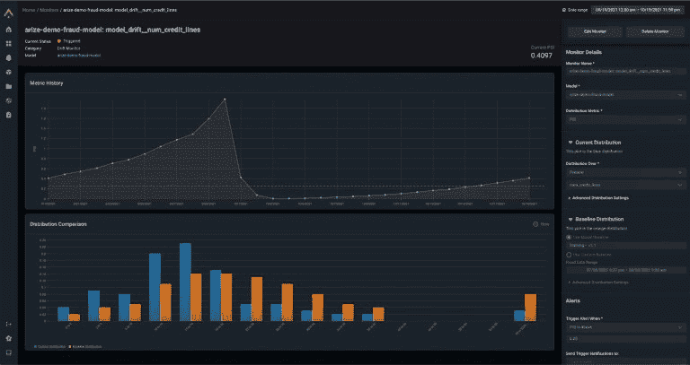

# 进行 ML 模型监控的最佳工具

> 原文：<https://web.archive.org/web/https://neptune.ai/blog/ml-model-monitoring-best-tools>

如果您迟早将模型部署到生产中，您将开始寻找 ML 模型监控工具。

当你的 ML 模型影响业务时(它们应该影响)，你只需要了解“事情是如何工作的”。

你第一次真正感觉到这一点是当事情停止工作的时候。在没有建立模型监控的情况下，您可能不知道哪里出了问题，也不知道从哪里开始寻找问题和解决方案。人们希望你尽快解决这个问题。

但是在这个上下文中“事物”和“工作”是什么意思呢？

有趣的是，根据团队/问题/管道/设置的不同，人们的意思完全不同。

在一家 MLOps 公司工作的一个好处是你可以和许多 ML 团队交谈并获得第一手信息。因此，事实证明，当人们说“我想监控 ML 模型”时，他们可能想:

*   **监控模型在生产中的表现**:查看模型的预测准确度。看看模型性能是否随时间衰减，你应该重新训练它。
*   **监控模型输入/输出分布**:查看进入模型的输入数据和特征的分布是否改变？预测的阶级分布是否随时间而改变？这些事情可能与[数据和概念漂移](/web/20221117203620/https://neptune.ai/blog/concept-drift-best-practices)有关。
*   **监控模型训练和再训练**:在训练和再训练期间，查看学习曲线、训练模型预测分布或混淆矩阵。
*   **监控模型评估和测试**:为您的自动化评估或测试管道记录度量、图表、预测和其他元数据
*   **监控硬件指标**:查看您的模型在训练和推断过程中使用了多少 CPU/GPU 或内存。
*   **监控 CI/CD 管道的 ML** :查看您的 CI/CD 管道作业的评估，并进行直观比较。在 ML 中，度量标准通常只能告诉你这么多，需要有人实际看到结果。

你指的是哪个 ML 模型监控？

无论哪种方式，我们都将研究有助于所有这些用例的工具。

但是首先…

显然，根据您想要监控的内容，您的需求会发生变化，但是在选择 ML 模型监控工具之前，您应该明确考虑一些事情:

*   **易于集成**:将其连接到您的模型培训和部署工具有多容易
*   **灵活性和表现力**:你能记录并看到你想要的东西和你想要的方式吗
*   **开销**:日志记录给你的模型训练和部署基础设施带来了多少开销
*   **监控功能**:能监控数据/特征/概念/模型漂移吗？你能比较同时运行的多个模型吗(A/B 测试)？
*   **警报**:当性能或输入变得疯狂时，它是否提供自动警报？

好了，现在让我们来看看实际的模型监控工具！

首先，让我们回到不同的监控功能，看看哪个工具选中了这些框。

|  |  |  |  |  |  |  |  |  |  |  |
| --- | --- | --- | --- | --- | --- | --- | --- | --- | --- | --- |
| **模型评估和测试** | **是** | **有限** | **有限** | **否** | **否** | **否** | **否** | **是** | **否** | **否** |
| **硬件指标** | **是** | **否** | **否** | **是** | **否** | **否** | **否** | **否** | **否** | **否** |
| **模型输入/输出分配** | **否** | **是** | **是** | **有限** | **是** | **是** | **是** | **是** | **是** | **是** |
| **模型训练和再训练** | **是** | **有限** | **有限** | **否** | **否** | **否** | **否** | **是** | **否** | **否** |
| **生产中的模型性能** | **否** | **是** | **是** | **有限** | **是** | **是** | **是** | **是** | **是** | **是** |
| **ML 的 CI/CD 管道** | **是** | **否** | **否** | **否** | **否** | **否** | **否** | **是** | **否** | **否** |

现在，我们将更详细地回顾一下这些工具。

Neptune 是为运行大量实验的研究和生产团队构建的 MLOps 的**元数据存储。**

您可以[记录和显示几乎任何 ML 元数据](https://web.archive.org/web/20221117203620/https://docs.neptune.ai/you-should-know/what-can-you-log-and-display)，从指标和损失、预测图像、硬件指标到交互式可视化。

说到监控 ML 模型，人们通常将其用于:

*   模型训练，评估，测试，
*   硬件指标显示
*   但是您可以(有些团队确实这样做了)记录来自生产作业的性能指标，并从 ML CI/CD 管道中查看元数据。

它有一个[灵活的元数据结构](https://web.archive.org/web/20221117203620/https://docs.neptune.ai/you-should-know/logging-metadata#run-structure-namespaces)，允许你以你想要的方式组织培训和生产元数据。您可以将它想象成一个字典或文件夹结构，您用代码创建并显示在 UI 中。

您可以[构建仪表板](https://web.archive.org/web/20221117203620/https://docs.neptune.ai/you-should-know/displaying-metadata#creating-dashboards)，显示您想要查看的性能和硬件指标，以便更好地组织您的模型监控信息。

您可以[比较模型和运行之间的指标](https://web.archive.org/web/20221117203620/https://app.neptune.ai/o/common/org/example-project-tensorflow-keras/experiments?compare=KwGgjCBM4gzFQ&split=cmp&dash=charts&viewId=44675986-88f9-4182-843f-49b9cfa48599),以了解模型更新如何改变性能或硬件消耗，以及您是否应该中止实时模型训练，因为它不会超过基线。

您可以通过[易于使用的 API](https://web.archive.org/web/20221117203620/https://docs.neptune.ai/you-should-know/logging-metadata) 和 25+ [与来自 ML 生态系统的工具](https://web.archive.org/web/20221117203620/https://docs.neptune.ai/integrations-and-supported-tools/intro#list-of-all-integrations)集成来记录您想要监控的元数据。

如果您想知道它是否适合您的工作流程:

*Example drift monitor | [Source](https://web.archive.org/web/20221117203620/https://arize.com/)*

2021 年，Arize AI 被福布斯宣称为[最有前途的 AI 工具之一。这是一个 **ML 模型监控平台，能够增强您项目的可观察性，帮助您解决生产 AI** 的问题。](https://web.archive.org/web/20221117203620/https://www.forbes.com/sites/frederickdaso/2020/09/01/arize-ai-helps-us-understand-how-ai-works/)

如果 ML 团队在没有强大的可观察性和实时分析工具的情况下工作，工程师可能会浪费几天时间来试图识别潜在的问题。Arize AI 获得了 1900 万美元的投资，因为它可以很容易地找出问题所在，以便软件工程师立即找到并修复问题。此外，它允许 ML 工程师稳健地更新现有模型。Arize AI 有以下特点:

*   **简单整合。** Arize AI 可用于增强任何环境下任何模型的可观测性。详细的文档和社区支持使您能够在几分钟内集成并投入使用。
*   **上市前验证。**在部署之前，检查您的模型的行为是否符合预期非常重要。发布前验证工具包可帮助您增强对模型性能的信心，并执行发布前和发布后验证检查。
*   **自动监控。** [模型监控](https://web.archive.org/web/20221117203620/https://arize.com/model-monitoring/)应该是主动的，而不是被动的，这样您就可以尽早发现性能下降或预测偏差。自动化监控系统可以帮助你做到这一点。它要求零设置，并为易于定制的仪表板提供空间。

WhyLabs 是一个**模型监控一个** d 可观察性工具，帮助 ML 团队用**监控数据管道和 ML 应用**。监控已部署模型的性能对于主动解决这个问题至关重要。您可以确定重新训练和更新模型的适当时间和频率。它有助于检测数据质量下降、数据漂移和数据偏差。WhyLabs 很快在开发人员中变得非常受欢迎，因为它可以很容易地在混合团队中使用，经验丰富的开发人员可以与初级员工并肩工作。

该工具使您能够:

*   使用现成的或定制的指标自动监控模型性能。
*   检测整体模型性能下降，并成功识别导致性能下降的问题。
*   通过其开源数据记录库 whylogs，在保持高隐私保护标准的同时，与其他工具轻松集成。
*   使用流行的库和框架，如 MLFlow、Spark、Sagemaker 等。让 WhyLabs 的采用顺利进行。
*   使用内置工具轻松调试数据和模型问题。
*   通过易于使用的零配置设置，在几秒钟内设置好该工具。
*   通过您喜欢的渠道(如 Slack、SMS 等)获得当前工作流程的通知。

WhyLabs 用于模型监控的最大优势之一是，它消除了手动解决问题的需要，从而节省了资金和时间。无论规模如何，您都可以使用该工具处理结构化和非结构化数据。WhyLabs 用的是 AWS 云。它使用亚马逊 ECS 运行容器，并使用亚马逊 EMR 进行大规模数据处理。

Prometheus 是一款流行的**开源 ML 模型监控工具**，最初由 SoundCloud 开发，用于收集多维数据和查询。

Prometheus 的主要优势是与 Kubernetes 和许多可用的导出器和客户端库紧密集成，以及一种快速查询语言。Prometheus 也与 Docker 兼容，可在 Docker Hub 上获得。

Prometheus 服务器有自己的独立单元，不依赖于网络存储或外部服务。因此，部署额外的基础架构或软件并不需要做很多工作。它的主要任务是存储和监控某些对象。对象可以是任何东西:Linux 服务器、进程之一、数据库服务器或系统的任何其他组件。您想要监控的每个元素称为一个指标。

Prometheus 服务器以您定义的时间间隔读取目标，以收集指标并将它们存储在时序数据库中。您可以设置目标和读取指标的时间间隔。您使用 PromQL 查询语言查询 Prometheus 时间序列数据库中存储指标的位置。

Grafana 允许您**可视化监控指标。rafana 擅长时间序列分析。它可以以线形图、热图和直方图的形式显示监测工作的结果。**

您不用直接向 Prometheus 服务器编写 PromQL 查询，而是使用 Grafana GUI 板从 Prometheus 服务器请求指标，并在 Grafana 仪表板中呈现它们。

Grafana 的主要特点:

*   **警报。**您可以通过从信使到 Slack 的各种渠道接收警报。如果您喜欢其他选项，您可以使用少量代码手动添加自己的提醒。
*   **仪表板模板。**您可以为不同的任务创建定制的仪表盘，并在一个界面中管理您需要的一切。
*   **自动化。**您可以使用脚本在 Grafana 中自动完成工作。
*   **注解。**如果出现问题，您可以对来自不同仪表板和来源的事件进行时间匹配，以分析故障原因。您可以通过向所需的点和地块片段添加注释来手动创建注释。

显然是一个开源的 ML 模型监控系统。它有助于在开发、验证或生产监控期间分析机器学习模型。工具**从熊猫数据帧**生成交互式报告。

目前，有 6 种报告可供使用:

1.  **数据漂移:**检测特征分布的变化
2.  **数字目标漂移**:检测数字目标和特征行为的变化
3.  **分类目标漂移**:检测分类目标和特征行为的变化
4.  **回归模型性能**:分析回归模型的性能和模型误差
5.  **分类模型性能**:分析分类模型的性能和错误。适用于二进制和多类模型
6.  **概率分类模型性能**:分析概率分类模型的性能、模型校准质量和模型误差。适用于二进制和多类模型

Qualdo 是 Azure、Google 和 AWS 中的机器学习模型性能监控工具。这个工具有一些很好的基本特性，允许你在整个生命周期中观察你的模型。

借助 Qualdo，您可以从生产 ML 输入/预测数据、日志和应用数据中获得洞察力，以观察和改进您的模型性能。有模型部署和自动监控数据漂移和数据异常，您可以看到质量指标和可视化。

它还提供工具来监控 Tensorflow 中的 ML 管道性能，并利用 Tensorflow 的数据验证和模型评估功能。

此外，它还集成了许多人工智能、机器学习和通信工具，以改善您的工作流程并使协作更容易。

这是一个相当简单的工具，没有提供很多高级功能。因此，如果您正在寻找一个简单的 ML 模型监控性能解决方案，这是最好的选择。

Fiddler 是一个模型监控工具，它有一个用户友好的、清晰的、简单的界面。它允许您监控模型性能，解释和调试模型预测，分析整个数据和切片的模型行为，大规模部署机器学习模型，以及管理您的机器学习模型和数据集

以下是 Fiddler 的 ML 模型监控特性:

*   **性能监控**—一种直观的方式来探索数据漂移，并确定哪些数据正在漂移、何时漂移以及如何漂移
*   **数据完整性**—确保没有不正确的数据进入您的模型，并且不会对最终用户体验产生负面影响
*   **跟踪异常值** —Fiddler 在异常值检测选项卡中显示单变量和多变量异常值
*   **服务指标**—让您基本了解生产中 ML 服务的运行状况
*   **Alerts** —Fiddler 允许您为项目中的一个模型或一组模型设置警报，以警告生产中的问题

总的来说，它是一个监控机器学习模型的伟大工具，具有所有必要的功能。

亚马逊 SageMaker 模型监视器亚马逊 SageMaker 工具之一。它会自动**检测部署在生产中的模型的不准确预测**并发出警报，因此您可以保持模型的准确性。

以下是 SageMaker 型号监控功能的总结:

*   **可定制的数据收集和监控**–您可以选择想要监控和分析的数据，而无需编写任何代码
*   统计规则形式的内置分析，用于检测数据和模型质量的偏差
*   您可以编写**自定义规则，并为每个规则**指定阈值。然后，可以使用这些规则来分析模型性能
*   指标的可视化，以及在 SageMaker 笔记本实例中运行特别分析
*   模型预测–导入您的数据以计算模型性能
*   计划监控作业
*   该工具与 Amazon SageMaker Clarify 集成，因此您可以**识别您的 ML 模型中的潜在偏差**

当与 ML 的其他工具一起使用时，SageMaker 模型监视器可以让您完全控制您的实验。

Seldon Core 是一个开源平台，用于在 Kubernetes 上部署机器学习模型。这是一个 MLOps 框架，允许您打包、部署、监控和管理数千个生产机器学习模型。

它运行在任何云上和内部，与框架无关，支持顶级的 ML 库、工具包和语言。此外，它将您的 ML 模型(例如 Tensorflow、Pytorch、H2o)或语言包装器(Python、Java)转换为生产 REST/GRPC 微服务。

基本上，Seldon Core 拥有扩展大量 ML 模型的所有必要功能。您可以期待高级度量、离群点检测器、金丝雀、由预测器、转换器、路由器或组合器组成的丰富的推理图等功能。

Censius 是一个人工智能模型可观察性平台，允许您监控整个 ML 管道，解释预测，并主动解决问题以改善业务成果。

Censius 的主要特点:

*   完全可配置的监控器，可检测漂移、数据质量问题和性能下降
*   实时通知，让您提前了解模型服务渠道中的问题
*   可定制的仪表板，您可以在其中切割您的模型培训和生产数据，并观察任何业务 KPI
*   对 A/B 测试框架的本机支持，您可以在生产中继续试验和迭代不同的模型
*   利用表格、图像和文本数据的可解释性，深入到问题的根本原因

## 结论

既然您已经知道了如何评估 ML 模型监控工具以及现有的工具，那么最好的方法就是测试您喜欢的工具！

如果你想尝试海王星，接下来的步骤是:

您还可以通过查看 mlops.community 准备的资源 [ml 模型监控工具比较来继续评估工具。](https://web.archive.org/web/20221117203620/https://mlops.community/learn/monitoring/)

不管怎样，监控愉快！