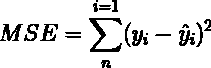
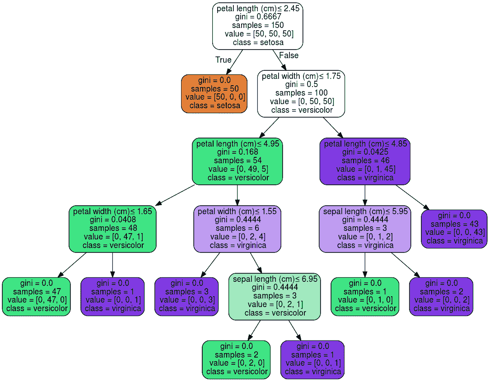
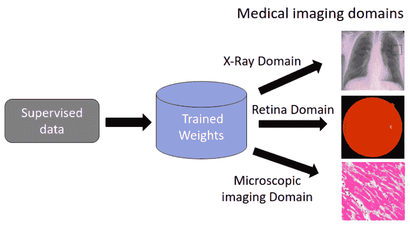

# 以正确的方式进行 ML 模型性能监控

> 原文：<https://web.archive.org/web/https://neptune.ai/blog/ml-model-performance-monitoring>

机器学习模型的开发和部署使人工智能应用程序能够解决问题。底层算法从数据中学习模式，但世界在不断变化，所以数据也在不断变化。

这意味着最大似然算法必须跟上不断变化的新数据，并定期更新，以保持预测能力。幸运的是，已经开发了许多工具来帮助数据科学家、机器学习工程师和决策者密切监控部署模型的性能。这些工具提供了有用的统计数据和模型性能详细信息，可以提供深刻的见解并帮助您提高模型性能。

然而，并不是所有的工具都适合您的用例。训练一个最先进的机器学习模型是一个缓慢的过程，更新一个已经训练和测试过的模型可能是耗时、具有挑战性和风险的。如果我们知道模型的弱点，我们就可以计划一个不会损害模型性能的行动过程。

因此，在本文中，我们将讨论如何进行模型监控，以获得最大的价值。希望它能帮助您(作为模型开发人员或决策者)在您的用例中设计一个合适的模型监控策略。

## 设定现实的目标

设计机器学习模型的关键步骤之一是选择合适的指标来评估模型性能。通常，这些度量标准有一个直观的解释，它们不仅在模型设计中使用，而且在与更广泛的受众交流结果时也使用。

有关详细的指标指南，请参见我们关于[机器学习性能指标的文章。](https://web.archive.org/web/20221206005928/https://neptune.ai/blog/performance-metrics-in-machine-learning-complete-guide)

在模型监控期间，跟踪用于模型评估的相同指标的性能是很自然的。但是在开始收集统计数据之前，我们首先必须考虑我们到底要寻找什么:

*   **所选指标对未来数据分布变化的稳健性如何？**

特别是，模型性能下降是否一定意味着模型性能变差？回归问题中广泛使用的误差度量是均方误差，但众所周知，均方误差对异常值非常敏感。例如，当预测用户在 Twitter 这样的平台上的受欢迎程度时，一个不受欢迎的用户可能会很幸运地捕捉到总统的一张重要照片。突然，他们个人资料的点击量激增，我们的预测算法表现很差。像这样的异常值可能是罕见的事件，甚至不会出现在我们的训练数据中。单个异常值可能导致整批数据的均方误差变得任意糟糕。那么，我们是否应该触发模型表现低于预期的警报，或者调整误差指标以允许少量的不良预测？这些问题需要高级领域知识，不应该由数据科学家独自回答。

*简单模式的均方误差*

在上图中，我们展示了一个简单模型(实线)的均方误差，该模型代表在测试数据集上评估的非线性函数。这个模型产生了很好的预测。然而，通过添加一个异常值，即右侧图中的红点，均方误差会增加 10%以上。我们应该关心离群值吗？

*   **什么是好的，什么是坏的模型表现？**

首先，我们需要为我们的模型性能设定现实的期望。模型的表现不太可能像设计时用于评估模型的初始测试数据那样好。随着时间的推移，数据很可能会发生变化，并且可能会出现某种程度的性能衰减，这就是为什么您需要为可接受的性能设置较低和较高的阈值。最终，这取决于底层应用程序，这个决定不应该由机器学习专家单独做出。

比如我们有两个图像分类系统，我们把监控分类精度作为主要度量。在医院系统中，从 X 射线图像中检测肺炎的准确率下降 1%，与在 Android 应用程序中动物分类的准确率下降 1%有着非常不同的影响。在第一种情况下，我们可能面临公共健康风险，而在第二种情况下，分类错误可能具有娱乐价值，甚至可能有助于应用程序的流行。显然，这样的问题超出了纯粹的技术考虑，因此不能只由机器学习专家来讨论。

*   **性能其实很差吗？**

机器学习研究的一个主要课题是模型比较。什么时候我们可以在某种程度上肯定地说，模型 A 在所选择的指标方面比模型 B 表现得更好？

有时候，我们认为一个模型做得更好，但这种改善在统计上是微不足道的。特别是，对于较小的数据样本，性能在很大程度上取决于随机因素。有大量的统计测试来比较模型的性能。考虑使用统计测试来比较一段时间内的模型性能(如 ANOVA、f 检验等)。

为了避免偏差，应该在进行模型监控之前设计这些测试。为了确保对模型性能的现实期望，与团队成员、业务领导和领域专家讨论这些测试是很重要的。

## 数据预处理和预测模型的模块化

假设您有一个分类变量，并且您已经创建了自己的标签编码器。通常情况下，标签分布是高度倾斜的，大多数例子中只出现一小部分类别。例如，在单词袋模型中，您只将前 n 个单词视为特征。你的编码器只是一个将单词转换成索引的字典。如果一个单词不在字典中，那么我们返回一个默认代码，比如 0。在 Python 中，应该是这样的:

***【word encoding . get(word，0)***

其中“wordencoding”是将单词映射到整数的字典。

然而，随着时间的推移，输入略有变化。例如，我们可能会获得更多关于英式英语拼写的数据，并且我们已经在具有美式英语拼写的文本上训练了模型。监控工具可能无法捕捉这些细微之处，我们可能会认为我们有数据漂移。

或者，测量单位可能会有变化，例如从千克到磅；编码标准的改变(疾病分类从 ICD-9 改为 ICD-10)；或者由于将无符号整数转换成有符号整数而突然出现负值。您不需要为这样的异常重新训练您的模型，更新预处理管道就足够了。因此，重要的是将数据准备和模型训练作为单独的模块，仅通过公共接口相互交互。虽然模型再训练可能很慢，成本很高，而且容易出错，但是数据预处理应该很容易解决。

## 使用基线

设计预测模型时，一种常见的策略是从简单的可解释模型开始。例如，在实现用于序列分类的双向递归神经网络体系结构之前，可以尝试逻辑回归或决策树模型。在大多数情况下，这种简单的模型将表现得相当好，并为我们提供有价值的见解。

当然，我们模型的业务需求可能会高得多，所以我们可能想要部署我们精心设计的、性能最好的模型。但是，我们可以将高级模型与并行运行的基本模型打包在一起。

基本模型应该是轻量级的，在一点点计算资源上运行，并且不应该影响系统的整体可伸缩性。然后，我们可以将高级模型的性能与基本模型进行比较。如果我们在高级模型中观察到性能衰减，而在基线模型中没有，那么很可能高级模型存在过度拟合问题。部署模型的一个更规范的版本可能会表现得更好。

另一方面，如果两个模型的性能都出现下降，那么我们可能会得出结论，确实存在数据或概念漂移，我们需要改进模型(在数据漂移中，数据的分布发生了变化，而在概念漂移中，模型学习到的模式不再准确—查看[本次调查](https://web.archive.org/web/20221206005928/https://towardsdatascience.com/machine-learning-in-production-why-you-should-care-about-data-and-concept-drift-d96d0bc907fb)了解更多详细信息)。

最终，这意味着我们需要在数据中检测新的精确模式，并且模型再训练是必要的。

A decision tree can be easily visualized and provides deeper insight into model performance | [Source](https://web.archive.org/web/20221206005928/https://scikit-learn.org/stable/modules/tree.html)

## 模型再训练

我们做了所有必要的步骤，发现我们的模型表现低于预期，因此需要重新训练。现在，重要的是我们不要重新发明轮子，从零开始训练一个新的模型。尽可能多地重复使用你的作品！

如果我们已经得出结论，模型过拟合，我们可以简单地通过调整正则化超参数来重新训练已经设计的模型。这很酷，因为我们不需要考虑诸如特征工程、机器学习算法的选择、成本函数等问题。

最糟糕的情况是有相当大的数据和/或概念漂移，我们需要一个新的机器学习模型。即使在这种情况下，建立在你已经完成的工作上也是好的。

当首先设计模型时，我们应该始终记住，它应该易于更新。有两个高级机器学习模型家族，它们允许在不牺牲先前工作的情况下进行改进:

*   集合模型，
*   神经网络。

### 集合模型

如果我们的模型是由许多基本模型组成的集成模型，我们可以丢弃一些基本模型，并用新训练的基本模型替换它们。

当然，选择丢弃哪些基本模型以及如何训练新的基本模型的确切机制将取决于我们设计的集成方法。这些考虑是模型设计过程的重要部分。

### 神经网络

在数学上，神经网络计算复杂的函数，这些函数可以表示为几个简单函数的组合。作为一个具体的例子，考虑来自特定领域的图像的图像分类问题。例如，在大型体育赛事中拍摄的图像，其目标是检测不同的体育项目。即使由于季节性原因(冬季田径项目较少，秋季足球项目较多)存在概念漂移，这些图像仍将共享许多特征。

类似于使用预训练模型如 [VGG19](https://web.archive.org/web/20221206005928/https://keras.io/api/applications/vgg/) 或 [ResNet50](https://web.archive.org/web/20221206005928/https://keras.io/api/applications/resnet/) 的迁移学习，我们可以使用最近的数据批次仅重新训练网络的顶层。因此，我们的预训练模型被用作特征检测器，并且我们从产生更好的分类错误的现有特征中学习新的组合。类似的例子包括使用分类变量的预训练嵌入层或序列表示的注意力权重。

*A pre-trained neural network for image classification can be extended in order to consider different domains | [Source](https://web.archive.org/web/20221206005928/https://theaisummer.com/medical-imaging-transfer-learning/)*

在几个高质量的模型监控工具的帮助下，可以将上述考虑应用到实际设置中。这些工具具有出色的可视化功能，可以跟踪不同的模型性能统计数据(查看这篇关于模型监控工具的[博客文章，了解更多细节)。](/web/20221206005928/https://neptune.ai/blog/ml-model-monitoring-best-tools)

以下是这些工具的一些功能概述:

[**Neptune**](/web/20221206005928/https://neptune.ai/product) 提供了一个用户友好的界面，该工具可以很容易地与不同平台集成。我们可以收集和可视化不同的统计数据和性能指标。特别是，Neptune 可以随着时间的推移跟踪探索性数据分析可视化，这有助于检测输入数据中的异常，而不依赖于数学公式，这使得它可以被更广泛的用户群访问。

这一类的其他工具显然还有**和 [**Anodot**](https://web.archive.org/web/20221206005928/https://www.anodot.com/) 。的一个有用功能显然是它检测目标标注和输入要素之间的相关性以及它们如何随时间变化。然而，正如上一节所讨论的，如果我们想要跟踪更复杂的模式，使用简单的模型比如决策树可能会更好。**

 **我们还建议考虑像 [Grafana](https://web.archive.org/web/20221206005928/https://play.grafana.org/) 、 [Great Expectations](https://web.archive.org/web/20221206005928/https://github.com/great-expectations/great_expectations) 和 [Fiddler](https://web.archive.org/web/20221206005928/https://www.fiddler.ai/ml-monitoring) 这样的工具，它们提供了各种有用的功能，比如检测异常值和异常值。

对于大规模系统来说，使用高级商业模型监控工具的定制版本可能会更好，比如亚马逊的 SageMaker 模型监控工具或者 T2 的 KFServing 工具。

## 结论

模型监控应被视为模型开发的一个组成部分。它需要是部署管道中设计良好的元素。

有许多优秀的工具可以监控已部署模型在各种度量方面的性能，并提供重要的见解。然而，就像处理任何实验任务一样，我们应该首先设计一个针对我们特定环境的策略。这是一项重要的任务，可能需要不同方面的专业知识，从数据科学家和 ML 工程师到商业领袖和最终用户。

如果您正确地分析和规划了模型监控任务，您将会以一种高效且有结果的方式实现预期的目标，而不会损害已部署的机器学习管道的完整性。

### 额外资源

**工具:**

**研究论文:****