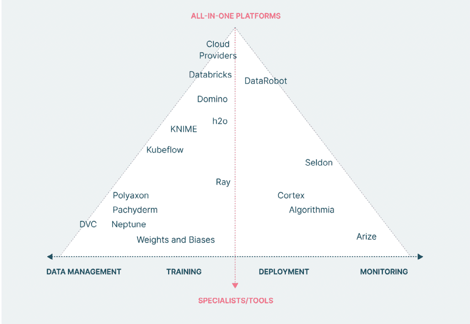
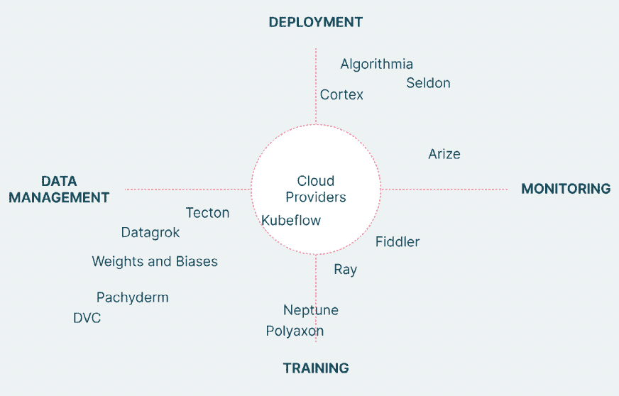
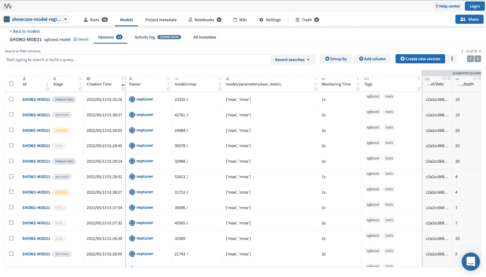
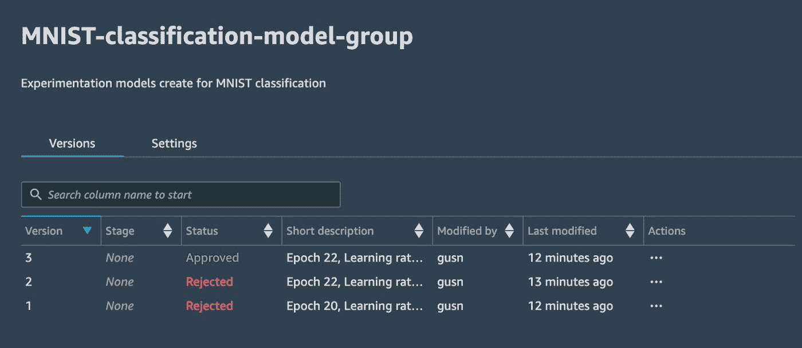

# 最佳 ML 模型注册工具

> 原文：<https://web.archive.org/web/https://neptune.ai/blog/ml-model-registry-best-tools>

**一个[模型注册中心](https://web.archive.org/web/20230304071956/https://neptune.ai/product/model-registry)** 是一个中央存储库，用于[版本控制机器学习(ML)模型](/web/20230304071956/https://neptune.ai/blog/version-control-for-ml-models)。它只是在模型在培训、生产、监控和部署之间移动时跟踪它们。它存储所有主要信息，例如:

*   元数据，
*   血统，
*   型号版本，
*   注释，
*   和培训工作。

由于模型注册表由从事同一机器学习项目的多个团队成员共享，**模型治理**是这些团队的主要优势。这些治理数据告诉他们:

*   哪个数据集用于训练，
*   他训练并出版了一个模型，
*   模型的预测性能如何，
*   最后，当模型被部署到生产中时。

通常，在团队中工作时，不同的团队成员倾向于尝试不同的东西，只有少数几个最终确定并推送到他们使用的版本控制工具。模型注册帮助他们解决这个问题，因为每个团队成员都可以尝试他们自己的模型版本，并且他们将**拥有他们在整个项目旅程中试验过的所有东西的记录**。

本文将讨论模型注册工具以及这些工具的评估标准。您还将看到不同模型注册工具的比较，例如:

1.  海王星. ai，
2.  MLflow，
3.  AWS Sagemaker，
4.  Verta.ai，
5.  还有彗星。

所以让我们开始吧！

模型注册中心是 [MLOps 平台/工具](/web/20230304071956/https://neptune.ai/blog/category/machine-learning-tools)的重要组成部分。市场上有很多工具可以满足您的 ML 工作流需求。这里有一个插图，它根据这些工具的专门化程度对它们进行了分类。

*Classification of model registry tools | [Source](https://web.archive.org/web/20230304071956/https://www.thoughtworks.com/content/dam/thoughtworks/documents/whitepaper/tw_whitepaper_guide_to_evaluating_mlops_platforms_2021.pdf)*

右下方的产品集中在[部署](/web/20230304071956/https://neptune.ai/blog/best-8-machine-learning-model-deployment-tools)和[监控](/web/20230304071956/https://neptune.ai/blog/ml-model-monitoring-best-tools)；左下方的按钮专注于训练和[跟踪](/web/20230304071956/https://neptune.ai/blog/best-ml-experiment-tracking-tools)。那些处于最顶端的人的目标是覆盖 ML 生命周期的每一个方面，而那些处于中顶端的人通过学习这样或那样的方式做大部分或所有的事情。

为了更精确地形象化，让我们来看另一张图片:

*More precise* *classification of model registry tools | [Source](https://web.archive.org/web/20230304071956/https://www.thoughtworks.com/content/dam/thoughtworks/documents/whitepaper/tw_whitepaper_guide_to_evaluating_mlops_platforms_2021.pdf)*

从上图可以推断，像 [Kubeflow](https://web.archive.org/web/20230304071956/https://www.kubeflow.org/) 和其他云提供商这样的工具是最平衡的，并且平等地覆盖了 ML 管道开发的每个阶段。像 [Neptune](/web/20230304071956/https://neptune.ai/) 和 [Polyaxon](https://web.archive.org/web/20230304071956/https://polyaxon.com/) 这样的专门工具最接近它们的轴，即主要集中在模型训练上。

*注意:上述这些工具的评估标准取决于这些工具在该时间点(2021 年 11 月)的特性。在过去的一年中，这些工具中的许多已经远远超出了它们的专业领域，所以对这个讨论要有所保留。*

然而，有一些永恒的因素是决定一个注册工具的有效性不可或缺的。从我自己的经验来看，其中一些是:

### 安装和集成

选择正确的模型注册工具通常会受到它的安装方式和它所提供的集成类型的影响。通常，组织根据他们的开发环境来选择工具。例如:

*   如果组织使用 [AWS](https://web.archive.org/web/20230304071956/https://aws.amazon.com/) 进行整个开发和部署，在这种情况下，Sagemaker 会很有意义，因为不会有兼容性问题。
*   但是如果组织没有使用 AWS，那么像 Neptune 或 [MLFlow](https://web.archive.org/web/20230304071956/https://mlflow.org/) 这样的工具可以用于模型注册。
*   另一方面，通常被视为端到端的工具，如 Sagemaker，对互操作性的概念越来越开放，用户可以用其他工具补充它们。

对于致力于当前技术选择的公司来说，集成可能是一个主要的担忧。如果一个组织正在使用一些持续集成工具，他们可能更喜欢容易融合的模型注册工具。

### 自动化的简易性

模型注册工具的另一个需求是开发团队使用该工具的难易程度。

*   一些工具要求您编写存储模型版本所需的所有东西，
*   而有些工具只需要很少的代码，你只需要拖放不同的组件就可以使用。
*   还有一些工具完全基于 AutoML 的概念，并且不需要您编写任何代码来存储您的模型版本。

Auto-ML 工具在定制方面灵活性较差，而低代码工具提供定制和自动化选项。最后，代码优先工具只提供编写代码的功能。您可以根据自己的需求选择工具。

### 更新的模型概述和模型阶段跟踪

模型注册工具的全部目的是提供一个开发团队已经尝试过的所有模型版本的简单概述。在选择工具时，您必须记住，该工具必须在每个阶段提供每个版本的模型概述。跟踪模型超越了开发；这样做是为了在试运行和生产中进行维护和增强。机器学习模型寿命包括:

*   培训，
*   分期，
*   和生产，

必须由模型注册工具跟踪。

### 管理模型依赖的能力

模型注册工具必须与 ML 模型需要的所有依赖项兼容。您应该检查机器学习库、Python 版本和数据的依赖能力。如果你正在处理一个需要特殊 ML 库的用例，而注册工具不支持它，那么这个工具对你来说没有多大意义。

### 提供团队协作的灵活性

你可以评估你和你的团队是否可以在注册的模型上合作。如果模型注册使您能够与您的团队在同一个 ML 模型上工作，那么您可以选择这个工具。

因此，您可以遵循评估标准，根据您的需求选择最佳的模型注册工具。

每个模型注册工具都有不同的特性，并执行各种独特的操作。以下是他们的对比:

| 功能 | Neptune.ai | 亚马逊 SageMaker | MLFlow | 彗星 | Verta.AI |
| --- | --- | --- | --- | --- | --- |
|  |  |  |  |  |  |
|  |  |  |  |  |  |
| 

版本化模型解释

 |  |  |  |  |  |
|  |  |  |  |  |  |
| 

主舞台过渡标签

 |  |  |  |  |  |
|  |  |  |  |  |  |
|  |  |  |  |  |  |
|  |  |  |  |  |  |
| 

对个人和研究人员免费，对团队收费

 | 个人和研究人员免费，团队付费 |  | 

对个人和研究人员免费，对团队收费

 | 个人和研究人员免费，团队付费 | 提供开源和付费版本 |

下面是一些在整个行业中使用的模型注册工具:

Neptune 是一个用于实验跟踪和模型注册的元数据存储库。所以注册模型是这个工具的两个关键功能之一。

总的来说，Neptune 允许你**记录、比较、显示、查询和组织所有与 ML 实验和模型相关的元数据**。只需要几行代码就可以将它与您的代码集成在一起，API 非常灵活，UI 对用户友好，但也为大量的日志元数据做好了准备。

Neptune 模型注册表的一些功能包括:

*Neptune dashboard showing a list of registered model versions | [Source](https://web.archive.org/web/20230304071956/https://app.neptune.ai/common/showcase-model-registry/m/SHOW2-MOD21/versions)*

它让您[注册模型和模型版本](https://web.archive.org/web/20230304071956/https://docs.neptune.ai/how-to-guides/model-registry/creating-model-versions)，以及与这些版本相关联的元数据。它可以对模型代码、图像、数据集、Git 信息和笔记本进行版本控制。

*   它允许您轻松过滤和排序版本化数据。
*   它让您[使用四个可用阶段来管理模型阶段转换](https://web.archive.org/web/20230304071956/https://docs.neptune.ai/how-to-guides/model-registry/managing-model-stages)。
*   然后您可以[查询并下载任何存储的模型文件](https://web.archive.org/web/20230304071956/https://docs.neptune.ai/how-to-guides/model-registry/querying-and-downloading-models-and-metadata)和元数据。
*   此外，它还在一个地方记录了所有用于机器学习模型开发的元数据和版本控制。
*   它还通过为其中央 ML 元数据存储和迄今为止所有运行的表提供持久链接和共享按钮，帮助您的团队在模型构建和实验方面进行协作。
*   它支持不同的连接模式，例如版本化元数据追踪的异步(默认)、同步、离线、只读和调试模式。
*   一个开源平台，可以用来管理 ML 模型的生命周期。借助 MLFlow 的 API，您可以跟踪 MLOps 的生命周期。它提供了模型版本控制、模型沿袭、注释，以及从开发到部署的转换功能。

MLflow 模型注册表的一些功能如下:

它提供了按时间顺序排列的模型谱系，即在给定时间哪个 MLflow 实验和运行产生了模型。

*   它提供了不同的预定义模型阶段，如归档、登台和生产，但一次为不同的模型版本分配一个模型阶段。
*   MLflow 允许您对顶级模型进行注释，并使用 markdown 分别对它们进行版本化。
*   它提供了 webhooks，这样你就可以基于注册表事件自动触发动作。
*   还提供了模型事件的电子邮件通知。
*   开发人员使用 Amazon SageMaker 来完全控制 ML 开发生命周期。您可以使用 SageMaker registry 对生产模型进行编目，关联元数据，并管理模型的版本和批准状态。

首先，您创建一个模型版本，并指定其各自的组。此外，您可以使用推理管道来用变量和容器规范注册模型。然后，您可以使用 AWS Python SDK 创建新的模型版本。此外，您还可以使用 AWS 将模型部署到模型注册中心之外。您可以将经过训练的机器学习模型部署到 SageMaker 端点，具有实时干扰和低延迟。可以使用 Amazon SageMaker 模型监控特性来监控这个部署的模型。

Amazon Sagemaker 模型注册中心的一些特性如下:

*Amazon SageMaker dashboard | [Source](https://web.archive.org/web/20230304071956/https://towardsdatascience.com/track-manage-discover-and-reuse-ai-models-better-using-amazon-sagemaker-model-registry-a238ec73351c) *

您可以创建一个模型组来解决特定的 ML 问题。它允许您查看与模型组相关联的所有模型版本。

*   使用 AWS Python SDK 或 Amazon Sagemaker Studio，您可以查看模型的特定版本的详细信息。
*   您还可以将元数据(如培训指标)与模型相关联，并将其作为一个整体进行版本化。
*   您可以在模型注册中心内批准或拒绝模型版本，如果批准，CI/CD 部署可以从那里轻松执行。
*   开发者可以使用 Comet 平台来管理机器学习实验。该系统允许您使用 Python SDK 实验来版本化、注册和部署模型。

Comet 跟踪模型版本和模型的实验历史。您可以查看所有型号版本的详细信息。此外，您可以使用模型复制和优化更有效地维护 ML 工作流。

功能丰富的 Comet 具有运行和跟踪 ML 模型实验的各种功能，包括:

Comet 允许您轻松地检查评估/测试运行的历史。

*   您可以使用 Comet 模型注册表轻松比较不同的实验。
*   它允许您在单个 UI 中访问代码、依赖项、超参数和指标。
*   它具有内置的报告和可视化功能，可以与团队成员和利益相关者进行交流。
*   它允许您配置 webhooks，并将 Comet 模型注册表与您的 CI/CD 管道集成。
*   您可以使用 Verta AI 工具在一个统一的空间中管理和操作模型。它提供了一个交互式的 UI，您可以在其中注册 ML 模型并发布元数据、工件和文档。然后，为了管理端到端的实验，您可以将模型连接到实验跟踪器。Verta AI 也提供 ML 项目的版本控制解决方案。

此外，它使您能够跟踪对数据、代码、环境和模型配置所做的更改。通过审计日志的可访问性，您还可以随时检查模型的可靠性和兼容性。您还可以创建适合您的项目的唯一批准序列，并将其与选定的票证系统合并。

Verta AI 的模型注册的一些主要特征是:

它支持端到端的信息跟踪，例如模型 ID、描述、标签、文档、模型版本、发布阶段、工件、模型元数据等等，这有助于选择最佳的模型。

*   它可以在 Kubernetes 和 [Docker](https://web.archive.org/web/20230304071956/https://www.docker.com/) 等容器工具上工作，并且可以与 [GitOps](https://web.archive.org/web/20230304071956/https://www.gitops.tech/) 和 [Jenkins](https://web.archive.org/web/20230304071956/https://www.jenkins.io/) 集成，这有助于自动跟踪模型版本。
*   它提供了对详细的合规性审核日志的访问。
*   它有一个类似 Git 的环境，使它变得直观。
*   您可以为编辑者、审阅者和协作者设置粒度访问控制。
*   摘要

## 阅读完本文后，我希望您现在知道什么是模型注册工具，以及在选择模型注册工具时必须考虑的不同标准。为了提供一个实用的视角，我们还讨论了一些流行的模型注册工具，并在几个方面对它们进行了比较。现在，让我们用一些关键要点来总结这篇文章:

Model registry 执行模型版本控制，并将它们发布到产品中。

*   在选择模型注册工具之前，您必须根据您的需求评估每个模型。
*   模型注册评估标准的范围从监控和管理不同 ML 模型阶段和版本的能力到易用性和定价。
*   您可以参考不同模型注册工具的突出特性，以更好地了解该工具与您的用例的兼容性。
*   考虑到这几点，我希望您的模型注册工具搜索会容易得多。

参考

### [https://www.phdata.io/blog/what-is-a-model-registry/](https://web.archive.org/web/20230304071956/https://www.phdata.io/blog/what-is-a-model-registry/)

1.  [https://Neptune . ai/blog/best-alternatives-to-ml flow-model-registry](https://web.archive.org/web/20230304071956/https://neptune.ai/blog/best-alternatives-to-mlflow-model-registry)
2.  [https://www . data revenue . com/en-blog/why-is-a-model-registry-valued](https://web.archive.org/web/20230304071956/https://www.datarevenue.com/en-blog/why-is-a-model-registry-valuable)
3.  [https://www.datarevenue.com/en-blog/why-is-a-model-registry-valuable](https://web.archive.org/web/20230304071956/https://www.datarevenue.com/en-blog/why-is-a-model-registry-valuable)