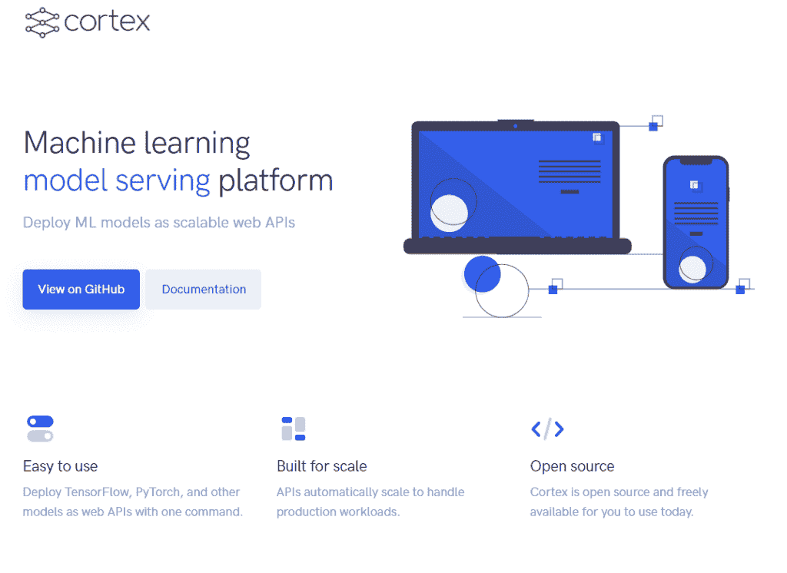

# 做 ML 模型服务的最佳工具

> 原文：<https://web.archive.org/web/https://neptune.ai/blog/ml-model-serving-best-tools>

机器学习中的模型服务工具可以为您提供数据工程师和 DevOp 关注的许多问题的解决方案。它们有许多功能，使管理您的模型变得更加容易。

您可以在 ML 项目的整个生命周期中使用它们，从构建一个训练有素的模型开始，到部署、监控、提供易访问性和生产。他们将自动化和优化你的工作，但也确保没有错误，使其易于[与其他人](/web/20220926093801/https://neptune.ai/blog/roles-in-ml-team-and-how-they-collaborate)协作，并实时跟踪变化。

让我们来看看能在模型服务中帮助你的最好的工具！

BentoML 标准化了模型打包，并为用户在广泛的部署环境中部署预测服务提供了一种简单的方法。该公司的开源框架旨在弥合数据科学和 DevOps 之间的差距，使团队能够以快速、可重复和可扩展的方式提供预测服务。

**下面是 BentoML 的总结:**

*   标准化的“便当”格式打包了模型、依赖项和代码
*   管理所有主要 ML 框架的依赖项和包
*   使用 [BentoCtl](https://web.archive.org/web/20220926093801/https://github.com/bentoml/bentoctl) 可在任何云环境中部署
*   通过 REST/GRPC 的在线 API 服务或离线批处理服务
*   自动生成和配置 docker 映像以进行部署
*   具有自适应微批处理支持的高性能 API 模型服务器
*   本机 Python 支持将推理工人与业务逻辑分开扩展
*   通过 Web UI 和 API 作为管理模型和部署流程的中心

Cortex 是一个用于部署、管理和扩展机器学习模型的开源平台。这是一个多框架工具，允许您部署所有类型的模型。

Cortex 基于 Kubernetes 构建，支持大规模机器学习工作负载。

**皮层–总结:**

*   自动扩展 API 以处理生产工作负载
*   对任何 AWS 实例类型运行推理
*   在单个 API 中部署多个模型，并在不停机的情况下更新已部署的 API
*   监控 API 性能和预测结果

TensorFlow Serving 是一个灵活的机器学习模型系统，专为生产环境而设计。它**处理机器学习**的推理方面。

它接受训练后的模型并管理它们的生命周期，通过高性能的引用计数查找表为您提供版本化访问。

以下是一些最重要的特性:

*   可以同时服务于多个模型或同一模型的多个版本
*   公开 gRPC 和 HTTP 推理端点
*   允许在不更改代码的情况下部署新的模型版本
*   让您灵活地测试实验模型
*   其高效、低开销的实现给推理时间增加了最小的延迟
*   支持许多服务:张量流模型、嵌入、词汇表、特征转换和非基于张量流的机器学习模型

TorchServe 是一款**灵活易用的工具，用于服务 PyTorch 模型**。这是一个开源框架，可以轻松地大规模部署训练有素的 PyTorch 模型，而无需编写定制代码。TorchServe 提供低延迟的轻量级服务，因此您可以部署您的模型进行高性能推理。

TorchServe 是实验性的，可能还会经历一些变化，但无论如何，它提供了一些有趣的功能。

**火炬服务-主要特点:**

*   多模式服务
*   A/B 测试的模型版本控制
*   监控指标
*   用于应用集成的 RESTful 端点
*   支持任何机器学习环境，包括亚马逊 SageMaker、Kubernetes、亚马逊 EKS 和亚马逊 EC2
*   TorchServe 可以在生产环境中用于许多类型的推理
*   提供易于使用的命令行界面

KFServing 提供了一个 Kubernetes 自定义资源定义(CRD ),用于在任意框架上服务机器学习模型。它**旨在通过为通用 ML 框架**如 Tensorflow、XGBoost、ScikitLearn、PyTorch 和 ONNX 提供高性能、高抽象的接口来解决生产模型服务用例。

该工具提供了一种无服务器的机器学习推理解决方案

部署模型的简单界面。

**KFServing 的主要特点:**

*   通过提供预测、预处理、后处理和可解释性，为您的生产 ML 推理服务器提供一个简单、可插入和完整的故事
*   可定制的推理服务，为 CPU、GPU、TPU 和内存请求和限制添加您的资源请求
*   批量处理单个模型推理请求
*   交通管理
*   从零开始缩放
*   修订管理
*   请求/响应日志记录
*   可扩展的多模型服务

多模型服务器(MMS)是一个灵活且易于使用的**工具，用于服务使用任何 ML/DL 框架训练的深度学习模型**。该工具可用于生产环境中的多种推理。它提供了一个易于使用的命令行界面，并利用基于 REST 的 API 来处理状态预测请求。

您可以使用 MMS 服务器 CLI 或预先配置的 Docker 图像来启动一个服务，该服务设置 HTTP 端点来处理模型推断请求。

**主要特性:**

*   高级配置允许深度定制彩信的行为
*   开发定制推理服务的能力
*   MMS 的内务处理单元测试
*   JMeter 通过 paces 运行 MMS 并收集基准数据
*   多型号服务器基准测试
*   亚马逊弹性推理服务模型
*   ONNX 模型导出功能支持深度学习框架的不同模型

Triton 推理服务器提供了**优化的云和边缘推理解决方案**。它针对 CPU 和 GPU 进行了优化。Triton 支持 HTTP/REST 和 GRPC 协议，允许远程客户端请求对服务器管理的任何模型进行推理。

对于 edge 部署，Triton 是一个带有 C API 的共享库，允许将 Triton 的全部功能直接包含在应用程序中。

**Triton 的主要特性:**

*   支持多种深度学习框架(TensorRT、TensorFlow GraphDef、TensorFlow SavedModel、ONNX 和 PyTorch TorchScript)
*   在同一个 GPU 或多个 GPU 上同时执行模型
*   动态配料
*   可扩展后端
*   支持模型集成
*   普罗米修斯数据格式的指标，指示 GPU 利用率、服务器吞吐量和服务器延迟

[ForestFlow](https://web.archive.org/web/20220926093801/https://forestflow.ai/) 是在 Apache 2.0 许可下授权的 LF AI 基金会孵化项目。

它是一个可扩展的基于策略的云原生**机器学习模型服务器，用于轻松部署和管理 ML 模型**。

它为数据科学家提供了一种简单的方法，以最小的摩擦将模型部署到生产系统，从而加速生产价值主张的开发。

**以下是 ForestFlow 的主要特性:**

*   可以作为单个实例(笔记本电脑或服务器)运行，也可以部署为协同工作并自动管理和分配工作的节点群集。
*   提供原生 Kubernetes 集成，只需少量配置即可轻松部署在 Kubernetes 集群上
*   允许在影子模式下部署模型
*   不使用时自动缩小(合并)模型和资源，并自动将模型重新合并到内存中以保持高效
*   多租户
*   允许为多个用例部署模型，并在不同的路由策略之间进行选择，以在服务于每个用例的模型变量之间引导推理流量

DeepDetect 是一个用 C++11 编写的深度学习 API 和服务器，以及一个用于**培训和管理模型**的纯 Web 平台。

DeepDetect 旨在使先进的深度学习易于使用并集成到现有的应用程序中。它支持后端机器学习库 Caffe、Caffe2、Tensorflow、XGBoost、Dlib 和 NCNN。

**DeepDetect 的主要特性:**

*   为图像标记、对象检测、分割、OCR、音频、视频、文本分类、表格数据和时间序列的 CSV 应用做好准备
*   用于培训和管理模型的 Web 用户界面
*   由于有超过 25 种预先训练的模型，训练速度很快
*   用纯 C++编写的快速服务器，适用于云、桌面和嵌入式的单一代码库
*   用于 GPU、CPU 和嵌入式设备的最有效架构的神经网络模板
*   从对象检测到 OCR 和情感分析，为一系列任务提供了现成的模型

[Seldon Core](https://web.archive.org/web/20220926093801/https://www.seldon.io/tech/products/core/) 是一个开源平台，它有一个框架，可以更容易、更快地在 Kubernetes 上大规模部署你的机器学习模型和实验。

这是一个独立于云的、安全、可靠且强大的系统，通过一致的安全和更新策略进行维护。

**谢顿核心——摘要:**

*   使用我们预先打包的推理服务器、定制服务器或语言包装器来容器化 ML 模型的简单方法
*   由预测器、转换器、路由器、组合器等组成的强大而丰富的推理图
*   元数据来源，以确保每个模型可以追溯到其各自的培训系统、数据和指标
*   集成到 Prometheus 和 Grafana 的高级和可定制指标。
*   通过模型输入输出请求的完全可审计性(与 Elasticsearch 的日志集成)

## 把它包起来

有大量的机器学习模型工具可供选择。在你选择你最喜欢的之前，确保它满足你的所有需求。虽然相似，但每个工具提供的不同功能可能不适合每个 ML 从业者。

### 保罗·查科夫

将市场营销引入机器学习世界。

* * *

**阅读下一篇**

## 你需要知道的最好的机器学习模型管理工具

9 分钟阅读|作者弗拉基米尔·利亚申科| 2021 年 7 月 14 日更新

开发您的模型是 ML 项目工作的重要部分。这通常是一个艰难的挑战。

每个数据科学家都必须面对它，还有困难，比如失去实验的线索。这些困难很可能既烦人又不明显，会让你时不时感到困惑。

这就是为什么简化管理 ML 模型的过程是有好处的，幸运的是有几个工具可以做到这一点。这些工具有助于:

*   实验跟踪
*   模型版本控制
*   测量推理时间
*   团队协作
*   资源监控

因此，寻找和使用适合您的项目的工具是常识和良好的实践。

在本文中，我们将探索模型管理工具的**前景。我将尝试向您展示各种工具，并强调它们的优点。**

我们将涵盖:

*   选择**模型管理工具**的标准
*   **模型管理工具** : **Neptune、亚马逊 SageMaker、Azure 机器学习、Domino 数据科学平台、Google Cloud AI 平台、Metaflow、MLflow**

[Continue reading ->](/web/20220926093801/https://neptune.ai/blog/best-machine-learning-model-management-tools)

* * *