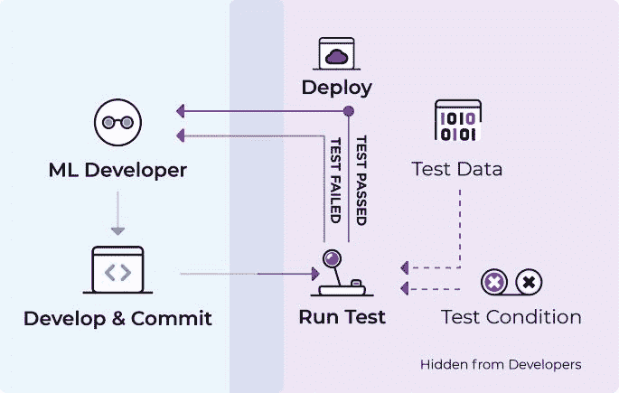
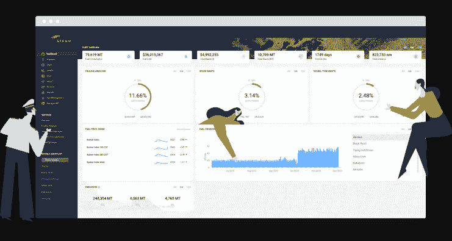
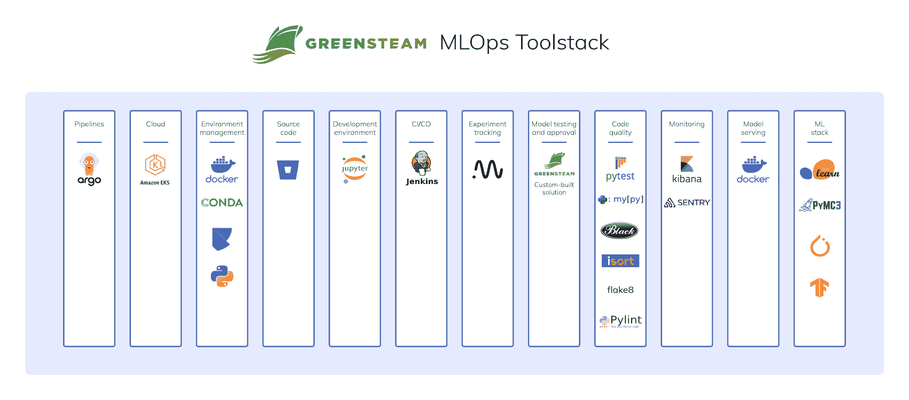
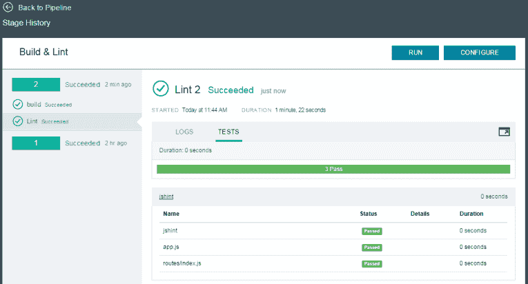
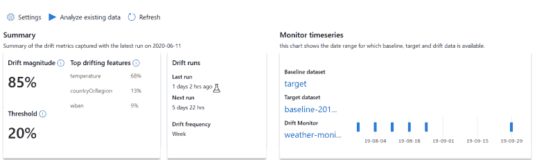

# ML 模型测试:4 个团队分享他们如何测试他们的模型

> 原文：<https://web.archive.org/web/https://neptune.ai/blog/ml-model-testing-teams-share-how-they-test-models>

尽管机器学习行业在开发帮助数据团队和从业者操作他们的机器学习模型的解决方案方面取得了进展，但测试这些模型以确保它们按预期工作仍然是将它们投入生产的最具挑战性的方面之一。

大多数用于**测试生产用途的 ML 模型的过程**是传统软件应用程序的原生过程，而不是机器学习应用程序。当开始一个机器学习项目时，标准的做法是对业务、技术和数据集要求进行严格的记录。尽管如此，团队经常忽略稍后的测试需求，直到他们准备好部署或者完全跳过部署前的测试。

## 团队如何测试机器学习模型？

对于 ML 测试，你在问这样的问题:“我如何知道我的模型是否有效？”本质上，您希望确保您学习到的模型行为一致，并产生您期望的结果。

与传统的软件应用程序不同，建立测试 ML 应用程序的标准并不简单，因为测试不仅依赖于软件，还依赖于业务环境、问题领域、使用的数据集和选择的模型。

虽然大多数团队习惯于在部署之前使用模型[评估指标](/web/20221117203604/https://neptune.ai/blog/performance-metrics-in-machine-learning-complete-guide)来量化模型的性能，但是[这些指标大多不足以](https://web.archive.org/web/20221117203604/https://www.jeremyjordan.me/testing-ml#what-s-the-difference-between-model-testing-and-model-evaluation)确保您的模型准备好投入生产。您还需要对您的模型进行彻底的测试，以确保它们在现实世界中足够健壮。

这篇文章将教你不同的团队如何对不同的场景进行测试。同时，值得注意的是，这篇文章不应该被用作模板(因为 ML 测试是与问题相关的),而应该是一个指南，指导你根据你的用例，为你的应用尝试什么类型的测试套件。

*Developing, testing, and deploying machine learning models | [Source](https://web.archive.org/web/20221117203604/https://ds3lab.ghost.io/ci/)*

### 小便笺

本文中分享的信息是基于我与团队代表的互动，这些团队代表要么在为他们的 ML 项目执行测试的团队中工作，要么仍然在这样的团队中工作。

如果你觉得文章中有任何需要更新的地方或有任何疑问，请随时通过 LinkedIn 联系我。

## 1.结合自动化测试和手动验证进行有效的模型测试

### 组织

[格林斯团队](https://web.archive.org/web/20221117203604/https://www.greensteam.com/)-一家 i4 洞察公司

### 工业

计算机软件

### 机器学习问题

各种 ML 任务

感谢格林斯团队前 ML 工程师[*Tymoteusz Wolodzko*](https://web.archive.org/web/20221117203604/https://www.linkedin.com/in/twolodzko/)*接受我的采访。本节利用了 Tymoteusz 在采访中得到的回复以及他在 Neptune.ai 博客上发表的* [*案例研究博文*](/web/20221117203604/https://neptune.ai/blog/mlops-at-greensteam-shipping-machine-learning-case-study) *。*

### 业务用例

[greens team](https://web.archive.org/web/20221117203604/https://www.greensteam.com/)–一家 i4 Insight 公司为海洋行业提供软件解决方案，帮助减少燃料消耗。过量使用燃料既费钱又对环境有害，国际海事组织要求船舶运营商更加环保，到 2050 年将二氧化碳排放量减少 50%。

*GreenSteam – an i4 insight company dashboard mock | [Source](https://web.archive.org/web/20221117203604/https://www.greensteam.com/)*

### 测试工作流程概述

为了在他们的项目中执行 ML 测试，这个团队有几个级别的测试套件，以及验证:

*   *模型验证的自动化测试*，
*   *手动模型评估和验证*。

为了在他们的工作流程中实现自动化测试，团队利用 [GitOps](https://web.archive.org/web/20221117203604/https://www.gitops.tech/) 运行代码质量检查 [Jenkins](https://web.archive.org/web/20221117203604/https://www.jenkins.io/) 和[冒烟测试](https://web.archive.org/web/20221117203604/https://en.wikipedia.org/wiki/Smoke_testing_(software))在测试环境中使用**类似生产的运行。结果，团队有一个模型代码的单一管道，每个拉请求都经过代码审查和自动化单元测试。**

[拉取请求](https://web.archive.org/web/20221117203604/https://www.atlassian.com/git/tutorials/making-a-pull-request)也通过了自动冒烟测试。自动化测试套件的目标是确保测试在开发过程的早期标记出错误的代码。

在自动化测试运行并通过模型管道之后，一个领域专家手动地检查评估度量，以确保它们有意义，验证它们，并标记它们为部署做好准备。

### 模型验证的自动化测试

自动化测试的工作流程是，每当团队中有人提交时，**冒烟测试**将运行以确保代码工作，然后**单元测试**将运行，确保代码和数据中的断言得到满足。最后，将运行**集成测试**，以确保该模型与管道中的其他组件配合良好。

#### 自动烟雾测试

每一个拉取请求都经过了自动化的冒烟测试，团队在测试中训练模型并进行预测，在一小块实际数据上运行整个端到端管道，以确保管道按预期工作，不会出现任何问题。

对 smoke suite 进行正确的测试可以让任何团队有机会在部署管道之前了解其质量。尽管如此，运行冒烟测试套件并不意味着整个管道都保证完全工作，因为代码通过了。因此团队不得不考虑单元测试套件来测试数据和模型假设。

#### 自动化单元和集成测试

团队运行的单元和集成测试是为了检查数据集的一些断言，以防止低质量的数据进入培训管道，并防止数据预处理代码出现问题。您可以将这些断言视为团队对数据做出的假设。例如，他们期望在数据中看到某种相关性，或者看到模型的预测界限是非负的。

单元测试机器学习代码比典型的软件代码更具挑战性。对团队来说，对模型代码的几个方面进行单元测试是很困难的。例如，为了准确地测试它们，他们必须训练模型，即使有适度的数据集，单元测试也可能需要很长时间。

此外，一些测试是不稳定的和不可靠的(随机失败)。运行单元测试来断言数据质量的挑战之一是，在样本数据集上运行这些测试比在整个数据集上运行它们更复杂，花费的时间也更少。对团队来说很难修复，但是要解决这些问题。他们选择取消部分单元测试，转而进行冒烟测试。

团队定义了验收标准，他们的测试套件随着他们的实验不断发展，添加新的测试，删除其他测试，获得更多关于什么有效什么无效的知识。

他们将在类似生产的环境中，针对每个新的拉取请求，在完整的数据集上训练模型，除了他们将超参数调整为快速产生结果的值。最后，他们将监控管道的健康状况，发现任何问题并及早发现。

*GreenSteam – an i4 insight company MLOps toolstack including testing tools | [Source](/web/20221117203604/https://neptune.ai/blog/mlops-at-greensteam-shipping-machine-learning-case-study)*

### 手动模型评估和验证

> “我们有一个人在回路的框架，在训练完模型后，我们用不同的图来创建报告，显示基于数据集的结果，这样领域专家就可以在模型发布前检查它们。”
> 
> [*Tymoteusz Wołodźko*](https://web.archive.org/web/20221117203604/https://www.linkedin.com/in/twolodzko/)*, a former ML Engineer at GreenSteam *

在训练模型之后，领域专家生成并审查了模型质量报告。专家将通过手动审核过程批准(或拒绝)模型，然后在获得验证并通过所有之前的测试后，最终由团队交付生产。

## 2.零售客户端应用程序的机器学习测试方法

### 组织

身份不明的

### 工业

零售和消费品

### 机器学习问题

分类

### 业务用例

这个团队使用机器学习帮助一个零售客户以自动化的方式解决了问题。当用户提出票证或由维护问题产生时，应用程序使用机器学习将票证分为不同的类别，帮助更快地解决问题。

### 测试工作流程概述

这个团队测试模型的工作流程包括在每次提交时在持续集成(CI)管道中生成构建。此外，[构建管道](https://web.archive.org/web/20221117203604/https://docs.microsoft.com/en-in/azure/devops/pipelines/build/triggers?view=azure-devops#classic-build-pipelines-and-yaml-pipelines)将运行**代码质量测试** ( *林挺测试*)以确保没有代码问题。

一旦管道生成了构建(一个容器映像)，模型就通过[发布管道](https://web.archive.org/web/20221117203604/https://docs.microsoft.com/en-in/azure/devops/pipelines/build/triggers?view=azure-devops#classic-release-pipelines)在类似生产的环境中**接受压力测试**。在部署之前，团队还会偶尔对模型进行 **A/B 测试**，以评估不同情况下的性能。

在团队部署管道之后，他们将运行部署和推理测试，以确保它不会破坏生产系统，并且模型能够持续正确地工作。

让我们来深入看看这个用例的一些团队测试。

### 代码质量测试

运行测试来检查代码质量对于任何软件应用程序都是至关重要的。您总是希望测试您的代码，以确保它:

*   正确，
*   可靠(在不同条件下不会断裂)，
*   安全，
*   可维护的，
*   和高性能。

在 CI 管道中构建任何容器映像之前，这个团队对他们的代码执行了[林挺测试](https://web.archive.org/web/20221117203604/https://www.freecodecamp.org/news/what-is-linting-and-how-can-it-save-you-time/)。**林挺测试确保他们能够执行编码标准和高质量的代码，以避免代码崩溃**。执行这些测试还允许团队在构建过程之前捕捉错误(当它们易于调试时)。

*A screenshot showing a mock example of linting tests | [Source](https://web.archive.org/web/20221117203604/https://www.ibm.com/garage/method/practices/code/tool_lint/)*

### A/B 测试机器学习模型

> “在部署模型之前，我们有时会做 A/B 测试，但不是每次都做，这取决于需要。”
> 
> *Emmanuel Raj, Senior Machine Learning Engineer*

根据用例，团队还执行了 [A/B 测试](https://web.archive.org/web/20221117203604/https://www.seldon.io/a-b-testing-for-machine-learning/)，以了解他们的模型在部署之前在不同条件下的表现，而不是纯粹依赖离线评估指标。通过从 A/B 测试中学到的东西，他们知道**新模型是否改进了当前模型**，并调整他们的模型以更好地优化业务指标。

### 压力测试机器学习模型

> *“我们使用发布管道对模型进行压力测试，每分钟对模型的部署进行 X 次推理。X 可以是 1000 或 100，取决于我们的测试。目标是看模型是否按照需要执行。”*
> 
> *Emmanuel Raj, Senior Machine Learning Engineer*

测试模型在极端工作负载下的性能对于通常期望来自用户的高流量的业务应用程序至关重要。因此，该团队执行了[压力测试](https://web.archive.org/web/20221117203604/https://en.wikipedia.org/wiki/Stress_testing_(software))，以查看在给定时间范围内，随着预测请求数量的增加，模型的响应能力和稳定性如何。

通过这种方式，他们对模型在负载下的可伸缩性进行了基准测试，并确定了模型的断点。此外，该测试还帮助他们确定模型的预测服务是否满足正常运行时间或响应时间指标所要求的服务级别目标(SLO)。

值得注意的是，对模型进行压力测试的目的，与其说是为了了解模型可以处理多少推理请求，不如说是为了了解当用户超过这样的流量时会发生什么。这样，您就可以了解模型的性能问题，包括加载时间、响应时间和其他瓶颈。

### 部署后测试模型质量

> *“在部署模型后的生产中，我们测试数据和模型漂移。我们也做后期制作审计；我们有季度审计来研究运营情况。”*
> 
> *Emmanuel Raj, Senior Machine Learning Engineer*

测试生产模型的目标是确保模型的部署是成功的，并且模型能够在生产环境中与其他服务一起正常工作。对于这个团队来说，在生产中测试模型的推理性能是持续提供商业价值的关键过程。

此外，该团队测试了数据和模型漂移，以确保模型可以被监控，并且在检测到这种漂移时可能会重新训练。另一方面，测试生产模型可以使团队通过领域专家的手动检查对他们的关键任务模型执行错误分析。

*An example of a dashboard showing information on data drift for a machine learning project in Azure ML Studio | [Source](https://web.archive.org/web/20221117203604/https://docs.microsoft.com/en-us/azure/machine-learning/how-to-monitor-datasets?tabs=azure-studio#understand-data-drift-results)*

## 3.金融科技初创公司机器学习应用的行为测试

### 组织

[MonoHQ](https://web.archive.org/web/20221117203604/https://mono.co/)

### 工业

金融技术

### 机器学习问题

自然语言处理(NLP)和分类任务

*感谢* [*埃梅卡鲍里斯*](https://web.archive.org/web/20221117203604/https://www.linkedin.com/in/emekaboris/) *在本节选出版前给予我采访和审阅。*

### 业务用例

MonoHQ 的交易元数据产品使用机器学习对交易语句进行分类，这些交易语句有助于各种企业客户应用程序，如信贷申请、资产规划/管理、BNPL(立即购买，稍后支付)和支付。基于叙述，该产品将数以千计的客户的交易分为不同的类别。

### 测试工作流程概述

在部署模型之前，团队进行行为测试。该测试由 3 个要素组成:

*   预测分布，
*   故障率，
*   潜伏。

如果模型通过了这三个测试，团队就会将其列为部署对象。如果模型没有通过测试，他们将不得不重新工作，直到它通过测试。他们总是确保为这些测试设置一个性能阈值作为度量。

他们还对他们的模型执行 A/B 测试，以了解哪个版本更适合投入生产环境。

### 检查预测质量的行为测试

该测试显示了模型如何响应推理数据，尤其是 NLP 模型。

1.  首先，团队运行一个[不变量](https://web.archive.org/web/20221117203604/https://deepchecks.com/how-to-test-machine-learning-models/#Invariance) [e 测试](https://web.archive.org/web/20221117203604/https://deepchecks.com/how-to-test-machine-learning-models/#Invariance)，将扰动引入输入数据。
2.  接下来，他们检查输入中的微小变化是否会影响模型响应——它对客户交易的叙述进行正确分类的能力。

本质上，他们试图在这里回答:在具有相似上下文的数据集中的微小调整会产生一致的输出吗？

### 机器学习模型的性能测试

为了测试模型在负载下的响应时间，团队配置了一个测试环境，在这个环境中，他们将向模型服务发送大量流量。这是他们的流程:

*   它们需要大量交易数据集，
*   创建一个表，
*   将数据流式传输到模型服务，
*   记录推理潜伏期，
*   最后，计算整个事务数据的平均响应时间。

如果响应时间超过了指定的延迟阈值，就可以部署了。如果没有，团队将不得不返工以改进它，或者设计另一种策略来部署模型以减少延迟。

### A/B 测试机器学习模型

> “我们进行 A/B 测试，看看哪个版本的模型最适合部署。”
> 
> *[Emeka Boris](https://web.archive.org/web/20221117203604/https://www.linkedin.com/in/emekaboris/), Senior Data Scientist at MonoHQ.*

对于这个测试，团队将两个模型封装起来部署到生产系统中，以便上游服务消费到生产系统中。他们部署其中一个模型来服务来自随机用户样本的流量，并部署另一个模型来服务不同用户样本的流量，以便他们可以衡量模型结果对其用户的实际影响。此外，他们可以使用真实客户来调整他们的模型，并衡量他们对模型预测的反应。

这个测试也有助于团队避免引入来自新训练的模型的复杂性，这些模型很难维护并且对他们的用户没有增加价值。

## 4.为机器学习应用程序执行工程和统计测试

### 组织

[方舟](https://web.archive.org/web/20221117203604/https://www.arkera.ai/)

### 工业

金融科技——市场情报

### 机器学习问题

各种 ML 任务

*感谢* [*拉斯洛·斯拉格纳*](https://web.archive.org/web/20221117203604/https://www.linkedin.com/in/laszlosragner/) *在本节选出版前给予我采访和审阅的机会。*

### 业务用例

一个处理来自新兴市场的新闻的系统，为交易员、资产经理和对冲基金经理提供情报。

*Arkera.ai LinkedIn cover image |* [*Source*](https://web.archive.org/web/20221117203604/https://media-exp1.licdn.com/dms/image/C4D1BAQGUazfINFmPXQ/company-background_10000/0/1569336475437?e=1638658800&v=beta&t=p8ZTZ5BCQnqx_sUxfdGGUFxl1cE9tsDZVcPTsdstsPM)

### 测试工作流程概述

这个团队对他们的机器学习项目进行了两种类型的测试:

*   *基于工程的测试(* ***)单元和集成测试*** *)* ，
*   *基于统计的测试(***)*)。*

 *工程团队运行单元测试，并检查模型是否抛出错误。然后，数据团队将交付(给工程团队)一个模拟模型，该模型具有与他们正在构建的模型相同的输入输出关系。此外，工程团队将测试该模型，以确保它不会破坏生产系统，然后为其提供服务，直到数据团队准备好正确的模型。

一旦数据团队和利益相关者评估并验证了模型可以部署，工程团队将使用原始模型运行集成测试。最后，如果可以的话，他们会将模拟模型与生产中的原始模型进行交换。

### 基于工程的机器学习模型测试

#### 单元和集成测试

为了运行一个初始测试来检查该模型是否能与生产中的其他服务很好地集成，数据团队将向工程团队发送一个模拟(或虚拟)模型。模拟模型与真实模型具有相同的结构，但是它只返回随机输出。工程团队将为模拟模型编写服务，并为测试做准备。

数据团队将向工程团队提供数据和输入结构，以测试输入-输出关系是否符合他们的预期，是否以正确的格式出现，并且不抛出任何错误。

工程团队不检查该模型是否是正确的模型；他们只从工程角度检查它是否可行。他们这样做是为了确保当模型投入生产时，不会打破产品管道。

当数据团队训练和评估正确的模型，并且涉众验证它时，数据团队将打包它并将其交给工程团队。工程团队将用正确的模型替换模拟模型，然后运行集成测试，以确保它按预期工作，并且不抛出任何错误。

### 机器学习模型的基于统计的测试

#### 模型评估和验证

数据团队将在真实世界数据和[统计评估指标](/web/20221117203604/https://neptune.ai/blog/performance-metrics-in-machine-learning-complete-guide)上训练、测试和验证他们的模型。数据科学负责人审核结果并批准(或拒绝)模型。如果有证据表明该模型是正确的模型，数据科学负责人将向必要的利益相关方报告结果。

他将解释模型的结果和内部运作，模型的风险，以及它产生的错误，并确认他们是否对结果感到满意或模型仍然需要重新工作。如果模型被批准，工程团队将模拟模型与原始模型交换，重新运行集成测试以确认它没有抛出任何错误，然后部署它。

## 结论

希望，正如您从用例及工作流中所了解到的，模型评估指标不足以确保您的模型为生产做好准备。您还需要对您的模型进行彻底的测试，以确保它们在现实世界中足够健壮。

为 ML 模型开发测试可以帮助团队系统地分析模型错误并检测故障模式，因此在将模型部署到生产环境之前制定并实现解决方案。

### 参考资料和资源*