# MLOps 架构指南

> 原文：<https://web.archive.org/web/https://neptune.ai/blog/mlops-architecture-guide>

一个成功的机器学习项目不仅仅是部署一个工作应用程序。这是关于传递积极的商业价值，并确保你继续传递它。

当你从事许多机器学习项目时，你发现其中一些项目在开发阶段工作得很好，但从未达到生产阶段。其他项目可以投入生产，但无法满足用户需求。然而，另一个项目在扩大规模后将过于昂贵而无法产生利润。

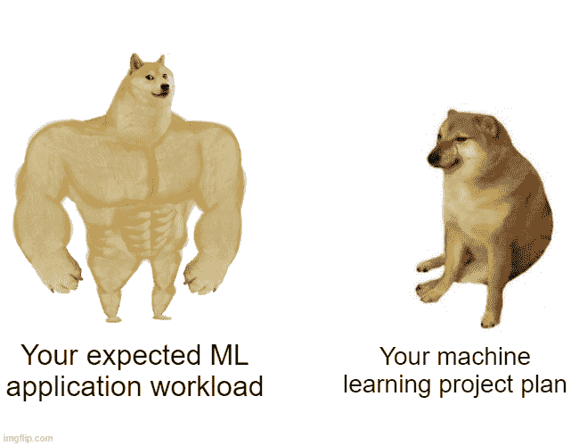

*Source: Author*

常规软件有 DevOps，我们有 [MLOps](/web/20221206141011/https://neptune.ai/blog/mlops-what-it-is-why-it-matters-and-how-to-implement-it-from-a-data-scientist-perspective) ，这个更重要。如果您想要成功，您需要针对开发和生产工作负载的最佳 MLOps 架构。

下图可能是整个 MLOps 社区中最常见的图表，它来自一篇被引用最多的 [ML 论文](https://web.archive.org/web/20221206141011/https://dl.acm.org/doi/10.5555/2969442.2969519)。

这个图表告诉我们，生产级机器学习系统不仅仅是设计学习算法和编写代码。能够为您的项目选择和设计最佳架构通常是弥合机器学习和操作之间的差距，并最终为您的 ML 系统中隐藏的技术债务买单。

在本文中，您将了解到:

在本文的某个地方，我还向您提出了一个挑战，那就是在给定一个业务问题的情况下，提出最佳架构。我希望你玩得开心，让我们直接进入文章吧！

## 生产级机器学习系统的现实

当您考虑从事机器学习项目时，一个非常详细的工作流程可能是:

[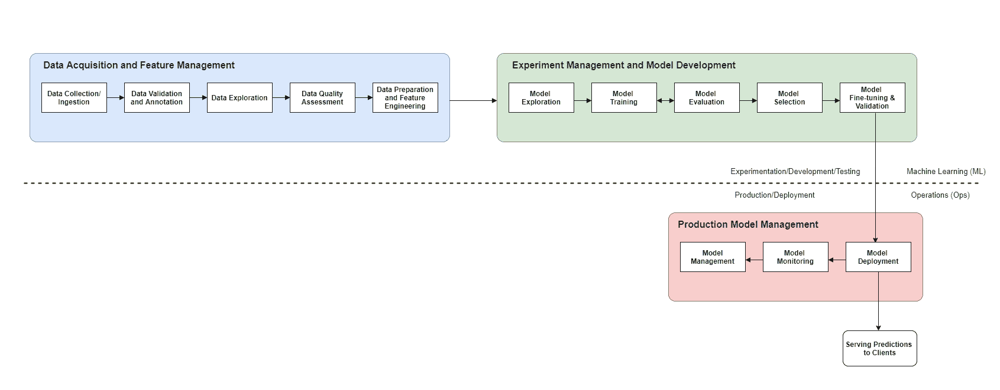](https://web.archive.org/web/20221206141011/https://i0.wp.com/neptune.ai/wp-content/uploads/2022/10/MLLifecycle.png?ssl=1)

*Image by the author (click to enlarge)*

事实上，您可能已经使用这样的工作流开发了您的模型，并且想要部署您的模型并为生产挑战做好准备，例如恶化、可伸缩性、速度、维护等等。

如果你在考虑实验和开发之外的生活，你可能需要彻底的重新思考——从选择正确的架构来在野外操作你的解决方案开始。

在一般水平上操作一个机器学习系统需要一个复杂的架构——或者在著名的“[机器学习系统中隐藏的技术债务](https://web.archive.org/web/20221206141011/https://papers.nips.cc/paper/5656-hidden-technical-debt-in-machine-learning-systems.pdf)”论文中是这样说的。

对于一个实时为用户服务的机器学习项目，你认为架构应该是什么样子的？你会考虑什么？你应该说明什么？

下面是在为您的项目寻找合适的架构时，您可能会发现的额外复杂性的说明(尽管它很多，但它仍然没有考虑到构建生产级机器学习系统所需的一切。

[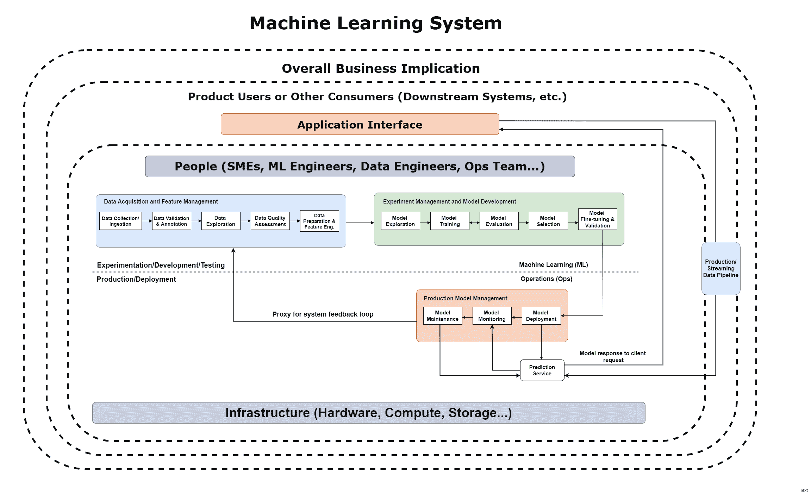](https://web.archive.org/web/20221206141011/https://i0.wp.com/neptune.ai/wp-content/uploads/2022/10/MLLifecycle_robust-4.png?ssl=1)

*Image by the author (click to enlarge)*

考虑的还挺多的！正如你所看到的，这个系统有一个机器学习(ML)部分和一个操作(Ops)部分。它们共同定义了机器学习系统的架构。

在 MLOps 的通用架构模式中，架构变更发生在 ML 阶段和 Ops 阶段，在这两个阶段中，您可以根据问题和数据采用不同的开发和部署模式。在下一节中，我们将看看 ML 系统的常见 MLOps 架构模式。

## MLOps 的通用架构模式

正如你在上面机器学习系统的(相当)复杂的表示中所看到的，MLOps 只是机器学习和操作混合在一起，运行在基础设施和资源之上。

MLOps 中的架构模式是关于培训和服务设计的。数据管道架构通常与培训和服务架构紧密耦合。

### 机器学习开发/培训架构模式

在您的培训和试验阶段，架构决策通常基于您接收的输入数据类型和您正在解决的问题。

例如，如果输入数据在生产中经常变化，您可能想要考虑一个**动态训练架构**。如果输入数据很少改变，你可能想考虑一个**静态训练架构**。

#### 动态培训架构

在这种情况下，您可以根据生产中不断变化的数据分布对模型进行重新训练，从而不断刷新模型。基于收到的输入和整体问题范围，有 3 种不同的体系结构。

#### 1.基于事件的培训架构(基于推送)

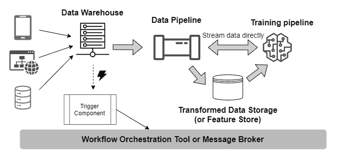

*Push-based training architecture | Source: Author*

针对基于事件的场景的培训体系结构，在这些场景中，某个操作(如将数据流入数据仓库)会导致触发器组件打开:

*   一个[工作流编排工具](/web/20221206141011/https://neptune.ai/blog/best-workflow-and-pipeline-orchestration-tools)(帮助编排数据仓库、数据管道和写出到存储或处理管道的特性之间的工作流和交互)，
*   或者一个[消息代理](https://web.archive.org/web/20221206141011/https://en.wikipedia.org/wiki/Message_broker)(作为中间人帮助协调数据工作和培训工作之间的过程)。

如果您希望您的系统持续训练从物联网设备获取实时数据，以进行流分析或在线服务，您可能需要此功能。

#### 2.协调的拉动式培训架构

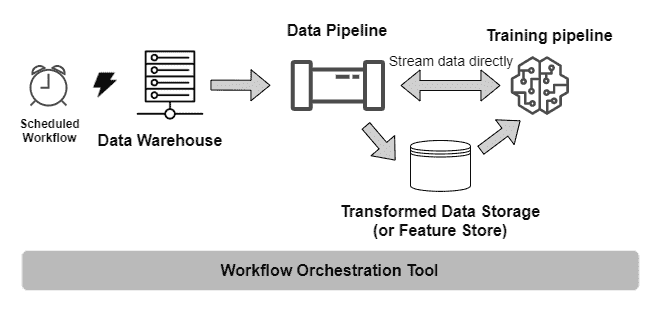

*Pull-based training architecture | Source: Author*

培训体系结构，适用于您必须按照预定的时间间隔重新培训模型的情况。您的数据在仓库中等待，工作流编排工具用于安排提取和处理，以及对新数据的模型重新训练。这种架构对于用户不需要实时评分的问题特别有用，比如内容推荐引擎(针对歌曲或文章)，当用户登录他们的帐户时，它会提供预先计算的模型推荐。

#### 3.基于消息的培训架构

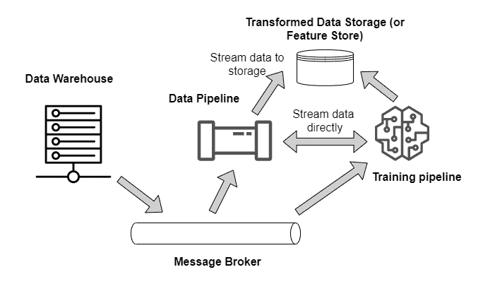

*Message-based training architecture | Source: author*

当您需要连续的模型训练时，这种训练架构是有用的。例如:

*   新数据来自不同的来源(如移动应用程序、web 交互和/或其他数据存储)，
*   数据服务订阅消息代理，以便当数据进入数据仓库时，它将消息推送到消息代理，
*   消息代理向数据管道发送消息，从仓库中提取数据。

一旦转换结束，数据被加载到存储中，一条消息将被再次推送到代理，以向训练管道发送一条消息，从而从数据存储中加载数据并开始训练作业。

从本质上讲，它将数据服务(数据管道)和培训服务(培训管道)结合到一个单一的系统中，因此培训在每项工作中都是连续的。例如，当您需要刷新您的实时事务模型(欺诈检测应用程序)时，您可能需要这个培训体系结构。

您还可以拥有一个**用户触发的培训架构**，其中用户向培训管道服务发送一个请求，开始对可用数据进行培训，并写出模型数据，也许还有培训报告。

### 静态培训架构

如果您的数据分布与离线时相比没有太大变化，那么可以考虑使用这种架构。这类问题的一个例子可能是贷款审批系统，在该系统中，决定是批准还是拒绝贷款所需的属性经历逐渐的分布变化，只有在像疫情这样的罕见情况下才会发生突然的变化。

下面是静态培训的参考架构——培训一次，偶尔再培训。

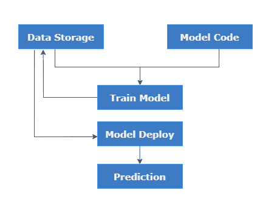

*Modified by the author and adapted from the [source](https://web.archive.org/web/20221206141011/https://app.pluralsight.com/library/courses/production-machine-learning-systems/table-of-contents).*

### 服务架构

您的服务架构有很多种。为了在生产中成功地操作该模型，它不仅仅是服务。您还必须在生产环境中监控、治理和管理它们。您的服务架构可能会有所不同，但它应该始终考虑这些方面。

您选择的服务架构将取决于业务环境和您提出的需求。

#### 通用操作体系结构模式

##### 批量架构模式

这可以说是在生产中为您的经验证的模型服务的最简单的架构。基本上，您的模型离线进行预测，并将它们放入可以按需提供的数据存储中。

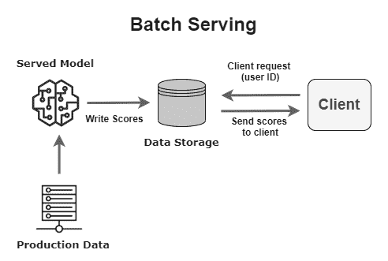

*Source: Author*

如果需求不涉及以秒或分钟为单位向客户提供预测，您可能希望使用这种服务模式。一个典型的用例是内容推荐系统(在用户登录帐户或打开应用程序之前，为用户预先计算推荐)。

##### 在线/实时架构模式

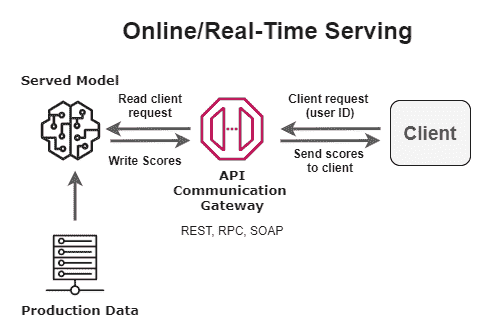

*Source: Author*

有些情况下，您希望以极小的延迟(几秒或几分钟内)向用户提供模型预测。您可能想考虑一个在线服务架构，它意味着在用户请求时实时向用户提供预测。

符合这种特征的用例的一个例子是在交易完成之前检测交易中的欺诈。

**其他值得您花费时间的架构有:**

*   [接近实时的服务架构](https://web.archive.org/web/20221206141011/https://youtu.be/IGfvVd-v3P8?t=573)–适用于个性化用例。
*   嵌入式服务架构–适用于数据和/或计算必须驻留在本地或边缘设备(如手机或微控制器)上的用例。

现在您已经看到了常见的 MLOPs 架构模式，让我们继续实现一个吧！

## 如何为项目选择“最佳”MLOps 架构

像任何其他产品或解决方案一样，你想设计出正确的设计是非常具体的问题。你会经常发现，类似的问题在架构上可能只有细微的变化。所以，“最好”可能是非常主观的，我想在这篇文章中说得非常清楚。我定义的“最佳”架构是这样的:

*   **围绕最终用户的需求而设计。**
*   考虑项目商业成功所需的必要项目要求。
*   **遵循模板最佳实践、原则、方法和技术**；对于最佳实践和设计原则，我参考了[机器学习镜头——AWS 架构良好的框架实践](https://web.archive.org/web/20221206141011/https://docs.aws.amazon.com/wellarchitected/latest/machine-learning-lens/welcome.html)，这似乎是目前为止最通用的模板。
*   **通过强大的工具和技术实施**。

您还会发现，根据您的 [MLOps 成熟度](https://web.archive.org/web/20221206141011/https://docs.microsoft.com/en-us/azure/architecture/example-scenario/mlops/mlops-maturity-model)，其中一些可能适用于您，也可能不适用于您，这使得架构选择更加主观。无论如何，我试图给出项目的全部细节，包括 MLOps 成熟度级别，同时考虑到运行系统的成本。

为了保持一致性，我们的项目用例考虑了 MLOps 的四大支柱:

1.  生产模型部署，
2.  生产模型监控，
3.  生产中的模型治理，
4.  模型生命周期管理(再培训、重塑、自动化管道)。

为了向您展示如何考虑这些架构，我遵循相同的模板:

*   **问题分析**:目标是什么？生意是关于什么的？现状？建议 ML 解决方案？项目的数据可用吗？
*   **需求考虑**:一个成功的项目运行需要哪些需求和规范？需求是我们希望整个应用程序做什么，在这种情况下，规范是我们希望应用程序如何做——在数据、实验和生产模型管理方面。
*   **定义系统结构**:通过方法论定义架构主干/结构。
*   **决定实施**:用*推荐的*健壮的工具和技术填充结构。
*   **使用 *AWS 架构良好的框架(机器学习镜头)*实践，思考为什么这样的架构是“最好的”**。

### 从 AWS 良好架构的框架(机器学习镜头)中调整好的设计原则

我们采用由 AWS 开发的架构良好的解决方案的 5 个支柱。他们使用良好设计原则和最佳实践的标准框架，帮助构建具有最佳商业价值的解决方案:

1.  **卓越运营**:专注于在生产中运营您的模型的能力，监控并洞察 ML 系统，以交付商业价值并持续改进支持流程和程序。
2.  **安全性**:关注保护信息、系统和资产(数据)的能力，同时通过风险评估和缓解策略提供商业价值。
3.  **可靠性**:关注系统从基础设施或服务中断中恢复的能力，动态获取计算资源以满足需求，以及减轻错误配置或短暂网络问题等中断的能力。
4.  **性能效率**:关注计算资源的高效使用以满足需求，以及如何随着需求的变化和技术的发展保持这种效率。
5.  **成本优化**:专注于构建和运营成本感知型 ML 系统的能力，以实现业务成果和成本最小化，从而让您的企业获得最大的投资回报。

### 面向机器学习的架构良好的框架架构设计原则

我根据您在规划架构时应该注意的这 5 个支柱的设计原则，为您创建了一个汇总表:

| 结构良好的柱子 | ML 系统的设计原则 |
| --- | --- |
|  | 

–建立跨职能团队。
—在 ML 工作流程的早期确定端到端的架构和运营模式。
–持续监控和测量 ML 工作负荷。
–建立一个再培训战略的模型:自动化？人为干预？
–版本机器学习输入和工件。
–自动化机器学习部署管道。

 |
|  | 

–限制对 ML 系统的访问。
–确保数据治理。
–实施数据传承。
–强制执行法规遵从性。

 |
|  | 

–通过自动化管理模型输入的变更。
–一次培训，跨环境部署。

 |
|  | 

–针对您的 ML 工作负载优化计算。
–为您的模型定义延迟和网络带宽性能要求。
–持续监控和测量系统性能。

 |
|  | 

–使用托管服务降低拥有成本。
–用小数据集做实验。
–合适规模的培训和模型托管实例。

 |

## 已定义项目的最佳 MLOps 架构

我们在下面选择了一个项目，在这里我们可以思考为每个项目选择架构的过程。开始了。

### 项目:新闻文章推荐系统

内容推荐系统有助于企业保持用户对相关内容的关注，从而使他们在平台上花费更多。尤其是在媒体领域，目标一直是提高客户参与度。

#### 方案

我们公司(一家新闻文章推荐公司)的一位业务分析师意识到，最近客户流失很多。在分析了这种情况后，他们得出的结论是，用户感觉不到与平台的互动，所以他们要么不继续订阅，要么干脆转向其他媒体平台。我们与业务分析团队和一些忠实客户密切合作，发现在我们能够为用户个性化平台之前，我们可能会看到他们完全脱离，甚至更糟，完全流失。

第一步是构建一个与现有产品集成的功能，该功能将推荐读者登录后可能会阅读的新闻文章，并将它们发送到他们的电子邮件中。

管理层同意我们建立系统，并在扩大范围之前对选定数量的用户进行测试。

…我们就是这样来到这里的。我们现在要干嘛？好了，让我们开始架构吧！

#### 问题分析

**业务理解**

*   该公司目前在 3 个地区(拉丁美洲、非洲和北美)拥有超过 521，000 名付费客户。
*   他们从各种出版物中挑选文章，为付费订户服务。
*   当用户第一次访问该平台并激活免费试用时，系统会提示他们选择感兴趣的相关类别的文章。他们获得该类别的最新文章，并收集他们与文章的互动以及他们在应用程序或网站的页面上停留多长时间的数据。

**业务目标是什么**？通过向用户推荐与任何特定登录会话最相关的文章来提高用户参与度，从而使他们能够不断回来，进而继续订阅该服务。

**业务指标是什么**？用户花在一篇文章上的时间增加了。我们使用这个指标而不是点击量的原因很简单，就是系统之外有更多的外部因素可以影响用户是否点击一篇文章。从标题到封面照片，或者副标题，到 UI 设计，等等。

项目的范围是什么？

*   项目范围是低风险的，主要是因为有一个可以采用的模板。
*   这是一个面向外部的项目，用户的体验将直接受到影响。
*   我们现在只构建项目和测试大约 15，000 个用户，因此企业可以适当地控制项目和管理影响。
*   业务利益相关者还要求我们在内部运行整个系统，因为我们正在对大约 15，000 名用户进行测试，当最终报告显示运行整个项目的成本时，我们可以对此进行更明确的讨论。
*   有时文章会传播错误信息和宣传，所以我们在管理系统时应该注意这一点。

**技术考虑因素**

*   团队:我们目前是两人团队；我自己和一个数据工程师(这对于这个范围来说很好)——我们必须找到让我们每个人的操作压力更小的方法！我们还可以访问该组织的运营团队，他们已经在 Kubernetes 集群上为我们的内部系统和私有云平台部署了应用程序和内部系统。
*   **硬件/基础设施供应:**我们一直在内部供应我们自己的资源来运行项目。我们还可以自由选择我们的工具——这可能不适合您，尤其是当您的运营团队拥有现有工具时。

**数据理解**

*   可用的历史数据包括文章的内容细节、内容类别、用户在特定文章上花费的时间、用户的唯一标识符、他们访问文章的总次数；
*   各种出版物预计每天约有 144，000 篇新文章；
*   文章附有链接、类别、发布日期、出版物名称和其他元数据。

#### 需求考虑

在考虑系统需求时，您需要了解几件事情:

*   如何确保良好的用户体验？记住，用户可以是真实的人，也可以是消费者(下游服务)，比如后端服务。
*   为了获得良好的用户体验，解决方案的哪些部分是最关键的？
*   为了将第一个版本提供给用户并收集反馈，我们能尽快实现的最低有价值的产品是什么？

为了提出项目的需求，您可以根据自己的需要修改 Volere 的[需求规格模板。对于我的要求，我使用了由](https://web.archive.org/web/20221206141011/https://www.volere.org/templates/volere-requirements-specification-template/)[迈克尔·柏林](https://web.archive.org/web/20221206141011/https://www.linkedin.com/in/michael-perlin-7227909/)策划的 GitHub 上[这个清单中的问题。](https://web.archive.org/web/20221206141011/https://github.com/ttzt/catalog_of_requirements_for_ai_products)

***需求:*** *该服务应通过移动应用程序或网站主页，根据用户对给定登录会话的兴趣，推荐用户可能阅读的前 10 篇文章。*

我们现在可以仔细看看 ML 系统每个组件的[规格](https://web.archive.org/web/20221206141011/https://en.wikipedia.org/wiki/Software_requirements_specification)。

**数据采集和特征管理规范**

*   由于文章是从各种来源获得的，因此将数据访问集中到数据仓库中是有意义的，这样我们就可以轻松地将生产数据接收到数据管道中。
*   我们将需要一个[特征库](https://web.archive.org/web/20221206141011/https://neptune.ai/blog/feature-stores-components-of-a-data-science-factory-guide)来存储从生产数据中提取的转换特征值，以便离线重新训练机器学习模型。
*   还应该启用数据版本控制，以便我们可以出于审计、调试或其他目的正确地跟踪数据沿袭。
*   我们还应该监控数据的质量，以便它是我们的自动化工作流所期望的。

**实验管理和模型开发规范**

*   训练应该离线进行，利用现有的用户数据和他们与以前文章的互动。
*   我们需要一个动态的训练架构来弥补发布的文章的新鲜度，以避免陈旧的模型和最终陈旧的推荐。
*   我们需要一个[模型注册表](/web/20221206141011/https://neptune.ai/blog/model-registry-makes-mlops-work)来存储实验的细节和来自我们训练运行的元数据。这也将支持正在部署的模型和数据的沿袭可追溯性。
*   培训管道将是必要的，因为我们需要自动化的再培训过程，因为每天都有新的文章进来。
*   因为我们的预算有限，我们的模型需要每天在合理的时间内进行训练，我们可能必须限制每次训练的数据量，因为我们不能花太多时间进行训练，也不能发布大量的新文章。
*   在我们的培训架构中，我们可能还希望利用模型检查点，以便培训和再培训不会花费太长时间(最好在他们进来的几个小时内，因为这通常是我们用户的登录高峰时间)。

**生产模式管理规范**

##### 1.**部署和服务规范**

*   看起来批量推理系统是值得的，因为我们不需要在用户浏览平台时实时向他们提供预测。这些推荐可以离线计算，存储在数据库中，并在用户登录时提供给用户。
*   为了与现有系统交互，我们可以将模型作为一个具有 RESTful 接口的服务来提供。
*   我们需要尽量避免处理服务依赖关系的变化，这样我们的自动化管道运行就不会因为这些变化而失败。
*   我们希望确保在成功评估后可以轻松地持续部署新的模型版本，并在每天都进行培训时对其进行跟踪。

##### **2。模型监控规范**

*   应该实时监控模型漂移，这样用户就不会得到过时的推荐，因为新闻事件是非常动态的，用户的阅读行为也可能变得不确定。
*   我们需要监控数据质量问题，因为有时候新文章的数量可能会比一天的预期数量少。还考虑了损坏的数据。
*   由于我们将频繁地重新训练我们的模型，我们需要跟踪每次运行的训练元数据，以便当一个模型无法执行时，我们可以审计它的训练细节并进行故障排除。
*   我们正在处理管道，因此我们需要监控组件来测量管道的健康状况。
*   我们需要收集一个人在一篇文章上花了多长时间的基本事实标签，以衡量我们的模型性能和模型漂移。
*   数据漂移也应与模型漂移一起监控，以捕捉用户偏好和文章特征的变化。
*   当管道发生故障时，我们还应该能够以仪表板视图和警报的形式获得报告，因为我们希望确保我们的模型不断更新。

##### 3.**模型管理规范**

*   由于大量的文章是基于事件随机出现的，我们可以建立一个基于拉的架构，该架构按计划执行工作流，以根据新数据重新训练我们的模型。
*   对于每个重新训练和重新部署的模型版本，模型版本化也需要到位，这样如果重新训练的模型性能更差，我们可以很容易地回滚。
*   将对已转换并加载到要素存储中的数据进行重新训练。

##### 4.**模型治理规范**

*   模型决策应该是可解释的，因为错误信息可以被审计，需要被监管。

**系统操作(Ops)规范**

*   我们需要定义您的模型如何能够在生产环境中运行。服务之间交互的标准是什么？这将如何定义整个系统的操作？基本上，最佳系统运行的性能要求。

*   推荐服务和后端服务器之间 95%的服务级别协议(SLA)。
*   当通过数据存储向数千用户提供批量预测时，提供低服务延迟和高吞吐量服务。
*   跟踪成功、失败和超时的 API 调用的数量。
*   应根据培训管道和整个系统消耗的资源量对其进行监控；I/O、CPU 使用率和内存。
*   基础设施必须与模型和运行时无关。
*   我们的生产环境不应该要求频繁的依赖关系更改，这可能会导致我们的数据和模型管道在执行时失败。它应该主要是确定性的。
*   我们还需要一个可复制的环境，因为它将在系统出现故障时启用我们的回滚策略。
*   我们应该确保对每个基础设施包进行正确的版本控制，这样就可以很容易地调试由于依赖关系的变化而产生的冲突。

#### 定义系统结构

基于上面列出的目标、需求和规范，我们可以为我们的系统设计出下面的结构。您可能会注意到，这里没有提到工具或实现。对！这更多的是关于设计一个考虑到商业目标和最终用户的系统。在设计你的架构时，你应该尽可能不考虑技术，只关注需求和规格。

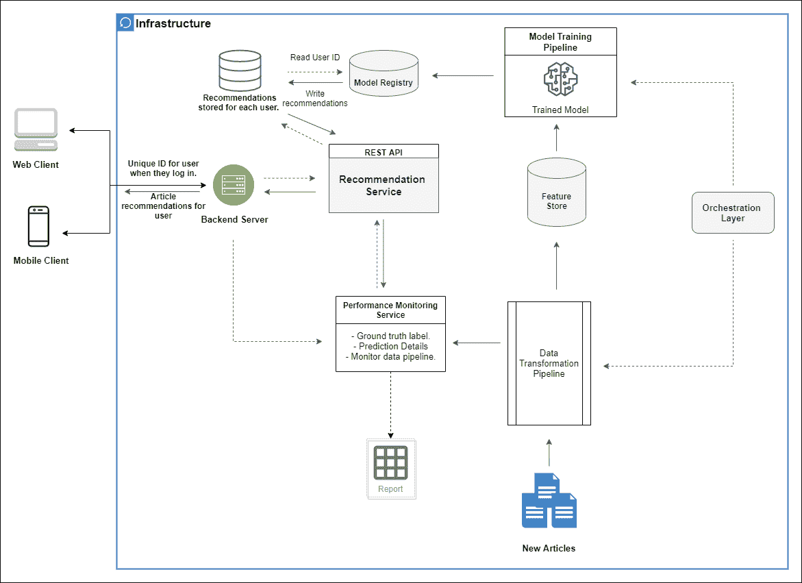

*Source: Author*

系统的结构是基于需求和规范的，而需求和规范是基于业务目标的。一旦您已经能够将结构就位，您现在就可以开始选择工具和技术来实现该结构。

除了像上面这样的架构图，通常被称为[基于组件的架构](https://web.archive.org/web/20221206141011/https://www.tutorialspoint.com/software_architecture_design/component_based_architecture.htm)——你可能想要更深入地挖掘图的每个部分，以确保你不会错过重要的东西。此外，考虑其他图表，例如:

*   [状态和序列图](https://web.archive.org/web/20221206141011/https://en.wikipedia.org/wiki/Sequence_diagram)显示你的架构的规格说明(比如数据、实验和生产管理阶段的规格说明)以及各个阶段和对象如何相互作用。在这里看一个状态图[的例子。](https://web.archive.org/web/20221206141011/https://cloud.google.com/architecture/mlops-continuous-delivery-and-automation-pipelines-in-machine-learning#characteristics_3)
*   你可能想看的另一张图是[活动图](https://web.archive.org/web/20221206141011/https://en.wikipedia.org/wiki/Activity_diagram)。

正如您可能已经猜到的那样，该架构在某种程度上处于 [MLOps 成熟度级别](https://web.archive.org/web/20221206141011/https://cloud.google.com/architecture/mlops-continuous-delivery-and-automation-pipelines-in-machine-learning)的第 1 级。

顺便说一下，这种结构对于你正在解决的 ML 问题是完全不可知的。这意味着无论您是在从事计算机视觉项目还是自然语言处理任务，它都可以工作——这是显而易见的，但当然，一些数据管理规范将会发生变化。

#### 决定实施

**决定实施时的考虑事项**

重申一下之前的观点，因为 MLOps 仍然是一个相当新兴的领域，**构建一个高效的 ML 系统需要结合遵循模板化的最佳实践和使用健壮的工具**(归功于 [Raghav Ramesh](https://web.archive.org/web/20221206141011/https://www.linkedin.com/in/raghavramesh/) 提出了[最初的想法](https://web.archive.org/web/20221206141011/https://youtu.be/sEZsIUBIhNk?t=85))。这实质上意味着，在根据您的需求和规范决定用于实现您的结构的各种组件的工具时，您必须深思熟虑。

目前，寻找对您想要实现的组件足够健壮的工具是有益的。最好是一个平台，它覆盖了整个水平堆栈(管理您的数据、实验和模型),并且足够动态，可以与您现有的生态系统集成，或者可以允许跨环境轻松迁移。令人欣慰的是，MLOps 社区令人惊叹，你可以在这个网站上找到 MLOps 工具的完整列表。

**在决定实施 MLOps 架构的工具(或“玩具”**)时，您可能需要考虑以下几点:

*   你多久需要一个 MVP 出来，你需要什么来发布一个？
*   你进行的风险评估有什么结果？就数据、模型和整个系统而言，平台的安全需求有多重要？
*   这个工具会很难学习并与我们现有的工具生态系统集成吗？
*   (如果你在团队中工作)你在团队中有使用特定工具或工具集的经验吗？
*   这些工具的成本是否合理地包含在您为此项目预留的预算中？在订阅或许可费(如果你正在购买)，托管费(如果你正在建设)，维护费，等等。

本质上，就决定您的实现而言，您希望根据范围、需求、风险和约束(如成本、涉众的怀疑，等等)来选择什么对您的项目是最佳的。

回到项目上来！在这种情况下，我将使用各种健壮的工具来实现组件。由于我的预算限制和目前项目的范围，我还会考虑开源解决方案。我会从基础设施的考虑开始。

**基础设施工具**

*   我们将从基础设施决策开始。为此，**我们希望整个系统是可移植的，可以在任何地方执行**,并且它应该是模型不可知的。
*   我们将**为我们的运行时环境**使用[**Kubernetes**](https://web.archive.org/web/20221206141011/https://kubernetes.io/)**引擎，因为这在规范方面是合理的，并且是开源的。**
*   **通过 Kubernetes 实现整个系统的可移植性**还将确保我们可以在需要时轻松地从本地解决方案迁移到云或混合解决方案。
*   由于预算的限制，我们可以使用 Kubernetes】指定一个系统资源限制,它会将整个系统限制在这个限制内。它也是开源的，我们有一个已经熟悉它的内部运营团队(回想一下我们的“技术考虑”部分)。
*   作为一种安全措施，我们还可以使用 Kubernetes 扩展进行系统范围的访问控制。

***NB:** 我知道使用 K8s (Kubernetes)进行机器学习的兔子洞，但我们现在就假装不知道 [Kubeflow](https://web.archive.org/web/20221206141011/https://www.kubeflow.org/) 。毕竟，这不是架构的最终形式，对吗？我们一定会吸取教训，在以后的某个时候重新审视这个架构！*

**数据采集和特征管理工具**

*   对于**数据存储**，我们将采用 [PostgreSQL](https://web.archive.org/web/20221206141011/https://www.postgresql.org/) ，一个用于结构化数据的开源、高效的数据库。此外，大多数托管解决方案通常基于 PostgreSQL 和 MySQL。
*   我们还需要一个**数据管道**，我们将使用 Apache Beam 来编写我们的 ETL(提取、转换、加载)。
*   为了**版本化数据管道**，我们将使用[数据版本控制(DVC)](https://web.archive.org/web/20221206141011/https://dvc.org/) ，一个类似 GIT 的开源工具，用于版本化数据集。
*   对于**功能商店**，我们将不得不选择[盛宴](https://web.archive.org/web/20221206141011/https://feast.dev/)，它是开源的，并且与其他存储工具(PostgreSQL)集成得很好。

**实验管理和模型开发工具**

*   对于**实验管理**，我们将选择 [Neptune](/web/20221206141011/https://neptune.ai/product/experiment-tracking) ，因此培训是可重复的，并且记录了关于硬件使用(CPU 和内存使用)和超参数值的必要元数据，我们可以轻松地可视化它们并共享它们。
*   Neptune 还帮助**对数据集**进行版本控制，并跟踪模型在哪个特定的数据集版本上被训练。
*   对于**模型开发**，我们将使用支持 Python 的框架；我们将在实现过程中选择它。
*   我现在还没有一个实现分布式训练的规范，所以我暂时把这个留下。

**生产模式管理**

##### 1.**部署和服务工具**

*   为了**打包我们的部署模型**，我们将使用 [Docker](https://web.archive.org/web/20221206141011/https://www.docker.com/) 。它几乎受所有平台的支持，在本地运行，并且可以在 Kubernetes 中管理。免费版本将做现在，因为没有妥协，看看我们的项目范围。
*   我们的 **API 协议**将是 REST API，API 网关我们将使用[孔网关](https://web.archive.org/web/20221206141011/https://konghq.com/kong/)，它是开源的，原生支持 Kubernetes，可以在本地运行。而且真的很容易设置！
*   为了**部署我们的模型代码**，我们将使用 [GitHub 动作](https://web.archive.org/web/20221206141011/https://github.com/features/actions)，因为我们所有的项目代码几乎都将驻留在我们的私有 GitHub 存储库中。这也将支持我们的 CI-CD 渠道。内部托管是免费的，但我们会密切监控我们的工作流程所花费的时间，以确定私有存储库的免费版本是否足以满足我们的需求。
*   根据我们使用的框架，我们将考虑使用**服务工具**来部署我们的模型即服务。我们现在正在考虑[烧瓶](https://web.archive.org/web/20221206141011/https://flask.palletsprojects.com/en/2.0.x/)或 [FastAPI](https://web.archive.org/web/20221206141011/https://fastapi.tiangolo.com/) 。也许我们还可以研究一下服务于的 [TensorFlow，但是基于范围，上面两个框架中的任何一个都应该足够了。](https://web.archive.org/web/20221206141011/https://www.tensorflow.org/tfx/guide/serving)

##### 2.**监控工具**

*   为了在生产中监控我们的模型，我们将使用完美的开源组合 [Prometheus 和 Grafana](https://web.archive.org/web/20221206141011/https://prometheus.io/docs/visualization/grafana/)——Prometheus 是一个时间序列数据库，用于收集监控数据，Grafana 将监控的指标和组件可视化在图表上。有非常有用的文档和教程，告诉我们如何将它们转换成 ML 监控服务。它们是非常强大的工具。
*   我们还将考虑使用 [Prometheus 的 Alertmanager](https://web.archive.org/web/20221206141011/https://prometheus.io/docs/alerting/latest/alertmanager/) 从我们的工具发送服务报告之外的通知，以实现持续监控和可观察性。
*   对于日志系统指标，我们将使用来自 [ELK 栈](https://web.archive.org/web/20221206141011/https://www.elastic.co/what-is/elk-stack)的 [Elasticsearch](https://web.archive.org/web/20221206141011/https://www.elastic.co/elasticsearch/) ，因为它是开源的，受流行平台支持。
*   我们还可以记录对我们系统的 API 调用的详细信息；成功的、失败的和超时的调用。
*   我们还可以跟踪吞吐量，因为这是一个核心规范，根据系统进行的交易量、它处理的请求数量以及交付前 n 名(这可能是前 5 名或前 10 名，取决于客户的请求)推荐文章所用的时间，以及它们在数据库中的相似性得分。

##### 3.**模型管理工具**

*   [Neptune.ai](/web/20221206141011/https://neptune.ai/product/model-registry) 可以作为每次训练运行的**模型注册表。模型版本可以被记录下来，以便进行追溯。**
*   对于**工作流调度和编排**，我们将使用 [Apache Airflow](https://web.archive.org/web/20221206141011/https://airflow.apache.org/) ，这可能是最广泛使用的编排工具。

##### 4.**模型治理工具**

*   在能够解释模型建议方面，我们将使用 [SHAP](https://web.archive.org/web/20221206141011/https://shap.readthedocs.io/en/latest/example_notebooks/overviews/An%20introduction%20to%20explainable%20AI%20with%20Shapley%20values.html) ，因为它可以给我们一个[总体解释](https://web.archive.org/web/20221206141011/https://stats.stackexchange.com/a/394944/216023)为什么模型做出某些预测。

这就是实现选择—您可以看到它是基于结构构建的，并且符合我们在规划阶段定义的需求和范围。我们现在将继续使用我们之前看到的 AWS 架构良好的框架(机器学习镜头)。

#### 用架构良好的框架内联评审架构

**卓越运营**

*   我们能够在 ML 工作流的早期识别端到端架构和操作模型。
*   我们确保整合对机器学习工作负载的持续监控和测量。
*   我们根据我们的问题陈述、需求和预算建立了一个模型再培训策略。
*   我们在培训管道中实现了对模型和工件进行版本控制的组件。
*   我们的自动化工作流和将我们的训练代码提交给工作流工具确保了我们模型的持续集成和部署。

**安全**

*   到目前为止，我们只实施了数据和模型谱系可追溯性——这是一个很好的补充。
*   在实施过程中，我们将使用的大多数工具都提供了访问级别控制，因此我们可以遵循安全最佳实践。
*   我们可以期待规划其他措施，例如生产环境的运营安全、灾难恢复，以及对传输中和静态的流数据源中的数据进行加密。
*   审计安全措施也将是这个架构允许我们做的事情。

**可靠性**

*   到目前为止，我们已经能够使我们的系统运行时不可知，并训练我们的模型一次，并在任何地方运行它。
*   对于 Apache Beam 和 Apache Airflow，我们需要做的一件事是为接收到数据管道中的数据实现可测试性。

**性能效率**

*   Kubernetes 可以限制资源来运行我们的工作负载，它会自动调整我们的工作负载，以优化 ML 工作负载的资源。
*   使用 Prometheus 和 Grafana 监控系统指标可以帮助我们跟踪模型的资源使用情况。
*   我们的监控工具将通过系统指标实现对系统性能的持续监控和测量。

**成本优化**

*   我们的架构允许流式传输任何大小的数据集，无论大小，我们都可以考虑尝试不同的大小。
*   我们的大多数工具目前都是内部部署的，但由于我们的运行时环境是可移植的，我们总是可以将其迁移到托管基础架构中。
*   我们可以在 Kubernetes 的 YAML 文件中指定 ML 工作负载所使用的资源。

### 你的挑战

一开始，我说我要给你一个挑战。这是:

对于承诺次日履行的企业，您将如何构建一个需要与订单管理服务集成的欺诈检测系统？

你可以随意定义你想要的业务，但是你可能要考虑一个比前一个项目更大的范围。

如果您准备好迎接挑战，您可以在本文末尾的“为您的项目选择最佳 MLOps 架构的参考资料”一节中找到我(基于该问题)提出的参考架构示例。祝你好运！

## 现在轮到您了:您应该如何为您的项目选择最佳的 MLOps 架构？

要为您的项目选择最佳架构，我建议您执行以下操作:

1.  **清楚地理解并阐明项目所需的需求、范围和约束**:这里有一个由 [Michael Perlin](https://web.archive.org/web/20221206141011/https://www.linkedin.com/in/michael-perlin-7227909/) 制作的 [3 集系列视频](https://web.archive.org/web/20221206141011/https://www.youtube.com/channel/UCMsO3QYSkzgixQ_4QgUtGYA)，你可以用它来开始这个项目。其他资源可以在参考和资源部分找到。您的需求应该清楚地陈述业务目标以及什么构成了良好的用户体验。
2.  **根据需求**设计系统的结构，此时不要考虑适合该结构的实现或技术。您的主要目标是根据上一步的要求定义结构。我建议看看其他人在这一点上根据他们自己的系统结构/架构已经做了什么/正在做什么。(*我在本文末尾的参考资料部分链接了一些你可以学习的架构中心*。)
3.  **现在是你决定自己实现的时候了**！在选择工具和技术时，要确保它们足够健壮，能够用于 ML 管道的任何阶段。如果它是一个监控工具，确保它是可扩展的，并且具有所有必要的功能。
4.  最后，**通过使用来自 AWS** 的 [**机器学习架构良好的框架**](https://web.archive.org/web/20221206141011/https://docs.aws.amazon.com/wellarchitected/latest/machine-learning-lens/welcome.html) **设计原则和最佳实践或者任何其他好的模板来证明你的架构。**

要明白，你的架构只是形成了基础，并为你提供了如何构建你的 ML 系统的途径。它不应该把你锁在一个实现盒子里，而应该只给你一个清晰的路径——理解当你迭代地构建你的 ML 系统时，你可以调整事情。这就是为什么敏捷 ML 软件构建是一条可行之路，因此您可以快速发现问题，甚至可以看到更好的工具或平台来帮助您的实现，并帮助您在必要的时间内交付最佳的 ML 系统。

### 您可能会发现一些有用的提示…

1.  遵循**已确立的最佳实践+健壮的工具和实现+尽快发布 MVP**以迭代构建最佳解决方案。
2.  您应该在机器学习项目生命周期的早期就开始考虑和规划您的 MLOps 架构。这将帮助您协调活动，并找到开发和操作中的盲点。
3.  给别人“烤”你的架构的机会。在 [MLOPs 社区](https://web.archive.org/web/20221206141011/https://mlops.community/) Slack 频道经常发生的事情是，我看到其他人上传他们架构的公共版本，让其他人有机会评论它并给出有用的反馈。你可以加入这样的社区，与其他从业者互动，设计你认为你的系统应该是什么样子。允许其他从业者通过共享公共版本和必要的需求来评论它。
4.  如果您发现您的需求可能涉及在一个平台上训练您的模型，并在另一个平台上为其提供服务，无论该平台是内部平台、不同的云供应商还是微控制器/边缘设备，您还可以深入研究[具有多云和多平台解决方案的混合 ML 系统](https://web.archive.org/web/20221206141011/https://www.kubeflow.org/docs/about/use-cases/#end-to-end-hybrid-and-multi-cloud-ml-workloads)以及嵌入式系统 MLOps 架构。

## 结论

在本文中，我们了解到:

*   用于培训和服务的通用 MLOps 架构模式，
*   如何为您的项目选择最佳的 MLOps 架构，
*   为您的项目选择最佳 MLOps 架构的框架，
*   最重要的是:

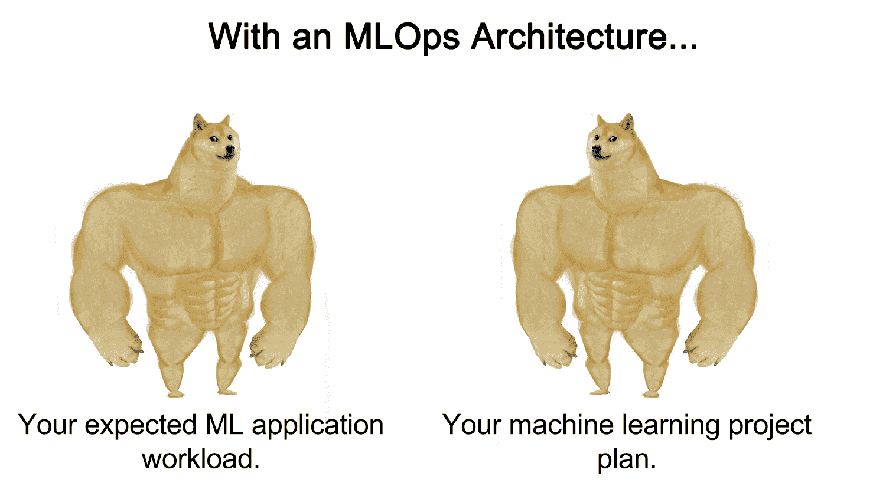

*Source: Author*

感谢您的阅读！

### 为您的项目选择最佳 MLOps 架构的资源

1.  如果您想了解有关分析数据科学业务需求的更多信息，请查看 Pluralsight 上的[课程。](https://web.archive.org/web/20221206141011/https://app.pluralsight.com/library/courses/data-science-business-requirements-analyzing/table-of-contents)
2.  对于**架构模板**，查看；

3.  想为您的 MLOps 实施选择强大的工具吗？在 [Neptune.ai 的博客](/web/20221206141011/https://neptune.ai/blog)上查看[这类文章](/web/20221206141011/https://neptune.ai/blog/category/machine-learning-tools)。
4.  想看看实际情况吗？退房；
    1.  你可以参加 [Kumaran Ponnambalam](https://web.archive.org/web/20221206141011/https://www.linkedin.com/learning/instructors/kumaran-ponnambalam) 在 LinkedIn 学习的课程“[架构大数据应用:实时应用工程](https://web.archive.org/web/20221206141011/https://www.linkedin.com/learning/architecting-big-data-applications-real-time-application-engineering)”和“[架构大数据应用:批处理模式应用工程](https://web.archive.org/web/20221206141011/https://www.linkedin.com/learning/architecting-big-data-applications-real-time-application-engineering)”。
    2.  同样，另一个更好地设计 ML 系统的方法是看看别人在做什么。关于 Quora、优步、网飞、DoorDash、Spotify 或其他不太知名的公司如何构建自己的系统，有一些网络研讨会和博客帖子。退房；
        1.  YouTube 上的 MLconf 是非常好的课程。
        2.  YouTube 上的数据块视频。
        3.  我最近写了一篇关于 8 家公司如何实施 MLOps 的文章，你可以在这里查看。
5.  这里有一个最近发布的[如何从零开始构建一个 ML 平台](https://web.archive.org/web/20221206141011/https://www.youtube.com/watch?v=s8Jj9gzQ3xA)，我想你会觉得有用。
6.  如果你想将你自己和你的团队从所有第三方工具中抽象出来，并为每个组件使用单独的工具，你可以考虑使用一些好的 MLOps 平台:[管理机器学习生命周期的最佳 MLOps 平台](/web/20221206141011/https://neptune.ai/blog/best-mlops-platforms-to-manage-machine-learning-lifecycle)
7.  我对所给挑战的解决方案。

### 参考