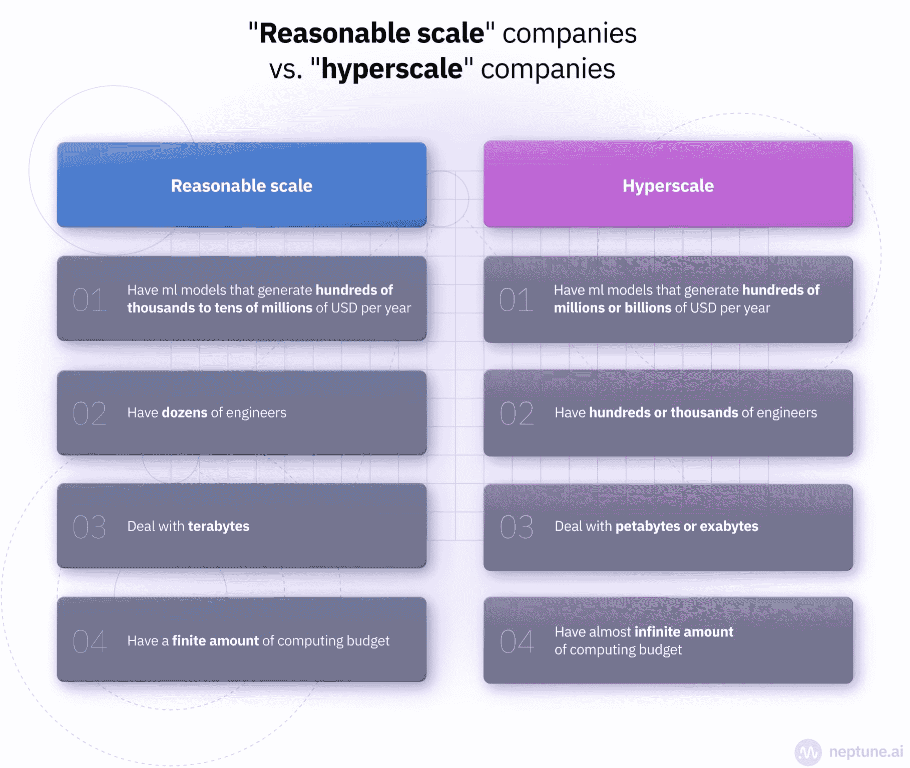
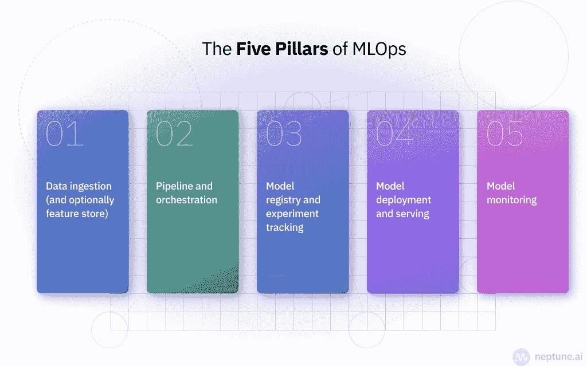
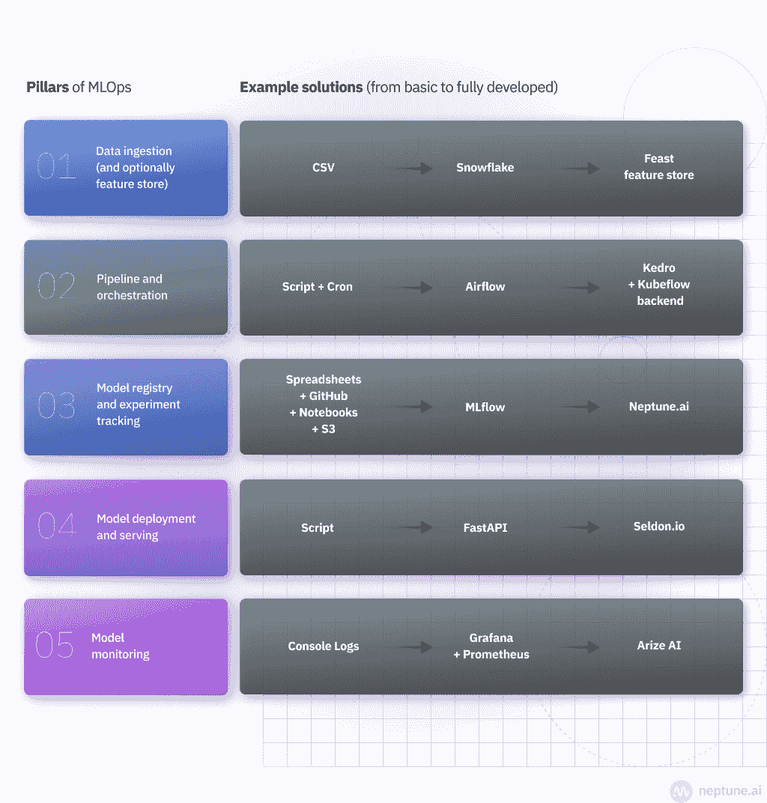
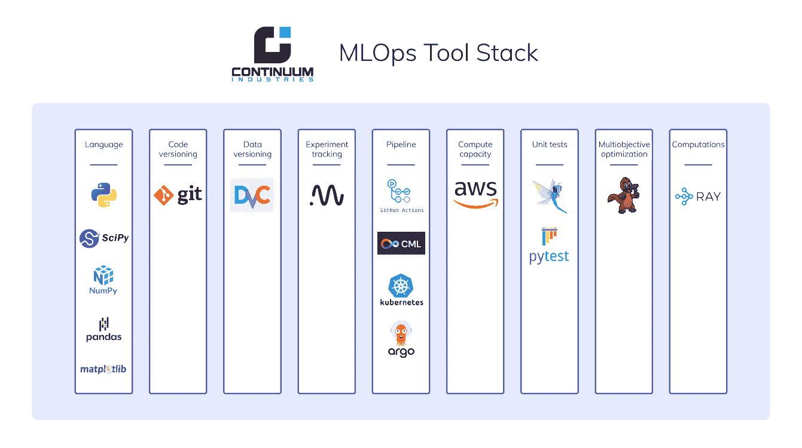
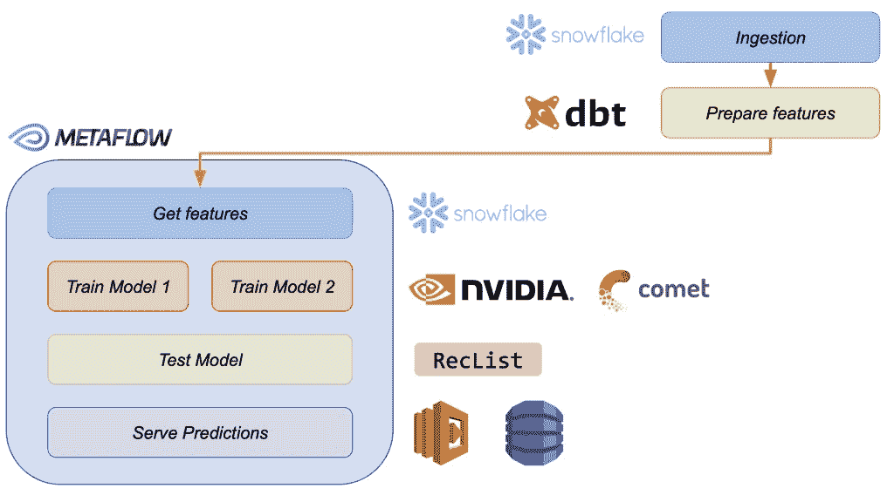

# 合理规模的 MLOps 终极指南]

> 原文：<https://web.archive.org/web/https://neptune.ai/blog/mlops-at-reasonable-scale>

几年来， [MLOps](/web/20230304071956/https://neptune.ai/blog/mlops) 可能是 ML 行业中使用最多的术语。人们想要部署到生产中的模型越多，他们就越想如何组织这个过程的操作部分。

自然地，市场上的大玩家——如谷歌、网飞和优步——已经决定了如何进行 MLOps。他们为社区所做的是伟大的，但他们解决了他们的 MLOps 问题。

大多数公司没有他们的问题。大多数 ML 团队的经营规模较小，面临不同的挑战。然而，他们是传销行业中最大的一部分，他们想知道以他们的规模，以他们的资源和限制，做传销的最好方法是什么。

**合理规模的 MLOps** 正在解决这一需求。“合理规模”是雅格布·塔利亚布埃去年创造的一个[术语，它指的是这样的公司:](https://web.archive.org/web/20230304071956/https://towardsdatascience.com/ml-and-mlops-at-a-reasonable-scale-31d2c0782d9c)

*   拥有每年产生几十万到几千万美元(而不是几亿或几十亿)的 ml 模型
*   有几十个工程师(而不是几百或几千个)
*   处理万亿字节(而不是千兆字节或千兆字节)
*   计算预算有限

在本指南中，您将在合理的范围内了解更多关于 MLOps 的信息，并了解有助于您理解如何在工作中实施它们的最佳实践、模板和示例。

在此之前，我们先退后几步，看看为什么我们还要谈论合理的规模。

## 规模合理的多点作业与多点作业

解决正确的问题和创建一个工作模型虽然仍然至关重要，但已经不够了。越来越多的公司需要将 ML 部署到生产中，以显示“业务的真正价值”。

否则，你的经理或你的经理的经理会开始问“我们的 AI 投资的 ROI”的问题。这意味着麻烦。

好的一面是，许多团队，无论大小，都已经过了那个阶段，他们的模型正在为企业做一些有价值的事情。问题是:

**您如何在生产中部署、维护和操作这些模型？**

答案似乎是 MLOps。

2021 年，如此多的团队围绕 ML 运营寻找工具和最佳实践，以至于 MLOps 成为一项真正的交易。许多工具和创业公司被创造出来。2021 年甚至被称为“MLOps 之年”。酷毙了。

但是建立 MLOps 意味着什么呢？

如果你通读在线资源，它会是:

*   可再生和协调的管道，
*   警报和监控，
*   版本化和可追踪的模型，
*   服务端点的自动扩展模型，
*   数据版本和数据沿袭，
*   功能商店，
*   还有更多。

但是它必须是全部吗？

您真的需要所有这些东西吗，或者它只是一个“标准的行业最佳实践”？那些“标准行业最佳实践”究竟来自哪里？

大多数好的博客文章、白皮书、会议演讲和工具都是由来自超先进、超大规模公司的人创造的。像谷歌、优步和 Airbnb 这样的公司。他们有数百人在处理 ML 问题，每月处理数万亿次请求。

这意味着您发现的大多数最佳实践自然偏向于超大规模。但是 **99%的公司没有在超大规模**进行生产 ML。

大多数公司要么还没有进行任何生产 ML，要么以合理的规模进行。合理的规模是指五个 ML 人员、十个模型、数百万个请求。合理，要求高，但没有疯狂和超大规模。

好吧，最佳实践偏向于超大规模，但这有什么错呢？

问题是当一个合理规模的团队采用“标准行业最佳实践”并试图构建或购买一个成熟的超大规模 MLOps 系统时。

用合理规模的 ML 团队的资源来构建超大规模的 MLOps 是行不通的。

超大规模公司需要一切。合理规模的公司需要解决当前最重要的挑战。他们需要明智而务实地对待他们现在需要的东西。

棘手的部分是告诉你的实际需求是什么，什么是潜在的，美好的，未来的需求。有这么多的博客文章和会议讨论，这很难。一旦你清楚了你的现实，你就成功了一半。

但是也有一些实例表明**务实的公司通过接受合理的规模 MLOps 限制而取得了巨大的成就**:

*   [柠檬水](https://web.archive.org/web/20230304071956/https://open.spotify.com/episode/6v1eDLc1PkQPzgzkxzBJXA?si=730b0a3fcda74d7a)仅用 2 名 ML 工程师服务 20 名数据科学家，就能从 ML 模型中产生超过 1 亿美元的年度经常性收入。
*   [Coveo](https://web.archive.org/web/20230304071956/https://open.spotify.com/episode/5AxI8KVtm5PsN8HzprUVG2?si=9951085620314616) 利用工具为数千家(几乎)没有 ML 基础设施人员的公司提供推荐系统。
*   [Hypefactors](https://web.archive.org/web/20230304071956/https://neptune.ai/customers/hypefactors) 用一个只有几个人的团队在整个社交媒体领域运行 NLP/CV 数据丰富管道。

您可能从未听说过它们，但是它们的问题和解决方案比您在其他选项卡中打开的网飞博客帖子或谷歌白皮书更接近您的用例。

查看[更多合理规模公司的故事](/web/20230304071956/https://neptune.ai/customers)了解他们如何解决 ML 工作流程的不同部分。

## MLOps 的支柱

好吧，假设你想做好多项工作，你会怎么做？尽管 MLOps 仍在发展中，但有些事情是明确的(ish ),例如，MLOps 的支柱可以作为如何开始思考该主题的一种指导。

### MLOps 的支柱–堆栈组件

第一种方法基于您需要以某种方式实施的 MLOps 的四个或五个主要支柱:

*   数据接收(以及可选的功能存储)
*   管道和流程编排
*   模型注册和实验跟踪
*   模型部署和服务
*   模型监控

我说四个或五个是因为数据接收部分并不总是作为支柱之一被提及。但我相信这是一个至关重要的因素，不应该被忽略。

*The pillars of MLOps*

根据您的需求，这些**中的每一个都可以通过简单的脚本或成熟的解决方案来解决。**

### 端到端与一流工具的规范组合

决定归结为你是否想要:

*   端到端平台与一堆同类最佳的单点解决方案
*   购买 vs 构建 vs 维护开源工具(或者购买、构建和维护 oss)。

一如既往，答案是“视情况而定”。

一些团队有一个相当标准的 ML 用例，并决定购买一个端到端的 ML 平台。

通过这样做，他们可以从盒子里取出所有的 MLOps，并且他们可以专注于 ML。

问题是，你离标准用例越远，就越难调整平台来适应你的工作流。而且**一开始一切看起来简单标准。**然后业务要变，需求要变，就不再那么简单了。

然后是定价讨论。当您真正需要的只是 10 个组件中的 3 个时，您能证明在端到端企业解决方案上花费“这么多”是合理的吗？有时候可以，有时候不行。

### 合理规模 MLOps 的支柱–组件

正因为如此，**许多团队远离端到端，决定从点解决方案**构建一个规范的 MLOps 堆栈，这些点解决方案只能很好地解决某些部分。

*Potential implementation of the pillars of MLOps*

这些解决方案有些是内部工具，有些是开源的，有些是第三方 SaaS 或内部工具。

根据他们的用例，他们可能有一些像 bash 脚本一样基本的东西用于他们的大多数 ML 操作，并在他们需要的地方得到一些更高级的东西。

**例如:**

*   你把你的模型移植到本地移动应用。您可能不需要模型监控，但是可能需要高级的模型打包和部署。
*   你有许多模型一起工作的复杂管道。那么你可能需要一些高级的流水线和编排。
*   您需要大量试验各种模型架构和参数。你可能需要一个可靠的实验跟踪工具。

通过务实地关注你现在实际存在的问题，你不会为未来设计过多的解决方案。你将有限的资源(作为一个团队，在合理的范围内进行 ML)投入到对你的团队/业务有影响的事情中。

### 合理规模 MLOps 的支柱——原则

还有另一种实现 MLOps 支柱的方法值得一提。Ciro Greco、Andrea Polonioli 和雅格布·塔利亚布埃在文章[haga kure for MLOps:ML 在合理规模下的四大支柱](https://web.archive.org/web/20230304071956/https://towardsdatascience.com/hagakure-for-mlops-the-four-pillars-of-ml-at-reasonable-scale-5a09bd073da)中提出了这一观点。他们写的原则是:

*   **数据优于建模:**迭代数据往往能收获更多，而不是模型(吴恩达用[“以数据为中心的人工智能”讲了很多)](https://web.archive.org/web/20230304071956/https://www.youtube.com/watch?v=06-AZXmwHjo)
*   **Log then transform** :您应该将数据接收(获取原始数据)与数据处理分开，以获得再现性和可重复性。你可以得到那个，例如用[雪花](https://web.archive.org/web/20230304071956/https://www.snowflake.com/) + [dbt](https://web.archive.org/web/20230304071956/https://www.getdbt.com/)
*   **PaaS & FaaS 优于 IaaS:** 你的资源有限。把它们集中在你有所作为的地方。不要构建和维护堆栈的每个组件，尽可能使用完全托管的服务。你团队的时间才是真正的成本，而不是订阅。
*   **垂直切入比分布式更深:**大多数情况下，你并不真的需要分布式计算架构。您可以使用容器化的云原生扩展。

## 以合理的规模设置 MLOps 的最佳实践和技巧

好了，我们已经讨论了[mlop 的支柱以及如何实现它们的原则](https://web.archive.org/web/20230304071956/https://neptune.ai/blog/mlops-principles)。现在是更实际的部分了。你可能想知道:

**合理的规模公司实际上是如何设置的(以及你应该怎么做)？**

以下资源将帮助您为您的用例构建实用的 MLOps 堆栈。

先说一些小技巧吧。

最近，我们采访了一些关于建立 MLOps 的 ML 从业者。

里面有很多好东西，但有一个想法我必须和你分享:

“我的第一条建议是，MLOps 不是一种工具。它不是一个产品。它描述了自动化和简化构建人工智能相关产品和服务的过程的尝试。

因此， ***花时间定义你的过程，然后找到适合那个过程的工具*** *和技术。*

例如，一家银行的流程与一家科技创业公司的流程大相径庭。所以最终的 MLOps 实践和堆栈也非常不同。"–Winder Research 首席执行官 Phil Winder

因此，在做任何事情之前，**要务实，考虑你的用例、工作流程和需求。**不是“行业最佳实践”。

我不断回想起*雅格布·塔利亚布埃*、*科威的人工智能负责人*，但事实是，没有他*T5，任何合理规模的 ML 讨论都是不完整的(毕竟，是他创造了这个术语，对吗？).在他的 [pivotal 博客文章](https://web.archive.org/web/20230304071956/https://towardsdatascience.com/mlops-without-much-ops-d17f502f76e8)中，雅格布提出了一个我们认为至关重要的思维转变(尤其是在你的 MLOps 之旅的早期):*

*“要在一个合理的规模上实现大规模生产，你应该* ***把你的时间投入到你的核心问题*** *(不管是什么)上，并购买其他所有东西。”*

你可以在这个斯坦福系统研讨会视频中看到他对这个主题的深入探讨。

[https://web.archive.org/web/20230304071956if_/https://www.youtube.com/embed/Ndxpo4PeEms?feature=oembed](https://web.archive.org/web/20230304071956if_/https://www.youtube.com/embed/Ndxpo4PeEms?feature=oembed)

视频

我想让你记住的第三个技巧来自 Orr Shilon，他是柠檬水的 ML 工程团队领导。

在 mlops.community 播客的这一期[中，他谈到了**平台思维。**](https://web.archive.org/web/20230304071956/https://open.spotify.com/episode/6v1eDLc1PkQPzgzkxzBJXA?si=47a80c9f2c334baf)

他指出，他们的**关注自动化，并尽可能务实地利用工具**是在 MLOps 中高效做事的关键。

通过这种方法，他的两个 ML 工程师团队一度成功支持了 20 多人的整个数据科学团队。这是一些基础设施杠杆。

还有一个地方可以让你更好地了解如何建立你的 MLOps，那就是 Andy McMahon 的 MLOps 社区聚会，名为[“建立它！让 ML 工程和 MLOps 变得真实的小技巧"](https://web.archive.org/web/20230304071956/https://mlops.community/watch/just-build-it-tips-for-making-ml-engineering-and-mlops-real_kiSp277D4ihFcm/)。安迪谈到:

*   当你想要操作你的 ML 模型时，从哪里开始？
*   什么先来——流程还是工具？
*   如何建立和组织一个 ML 团队？
*   …以及更多

[https://web.archive.org/web/20230304071956if_/https://www.youtube.com/embed/l1uhE9fEfo8?feature=oembed](https://web.archive.org/web/20230304071956if_/https://www.youtube.com/embed/l1uhE9fEfo8?feature=oembed)

视频

这是他在现实生活中做这些事情时学到的东西的一个很好的概述。那里有许多宝贵的经验。

现在，让我们看看示例 MLOps 堆栈！

有许多工具在许多 MLOps 类别中发挥作用，尽管有时很难理解谁做什么。

*MLOps tools landscape | Credit: Neptune.ai*

根据我们对合理规模团队如何建立堆栈的研究，我们发现:

务实的团队不会做所有的事情。他们专注于他们真正需要的东西。

例如，Continuum Industries 的团队需要深入了解他们优化算法的测试和评估套件。

因此，他们将 [Neptune 与 with GitHub actions 连接起来，以可视化和比较各种测试运行](/web/20230304071956/https://neptune.ai/blog/mlops-tool-stack-continuum-industries)。

*Continuum Industries tool stack | Credit: Neptune.ai*

格林斯团队需要能在混合整体微服务环境中工作的东西。

由于他们的定制部署需求，他们决定使用 Argo 管道进行工作流程编排，并使用 FastAPI 进行部署。

他们的堆栈:

*GreenSteam tool stack | Credit: Neptune.ai*

这些团队没有深入地解决所有问题，但是准确地指出了他们需要什么，并且做得很好。

我们的客户中有更多合理规模的团队，以下是一些值得研究的案例:

*   Zoined 与几位数据科学家谈论可扩展的 ML 工作流& ML 工程师
*   [Hypefactors](/web/20230304071956/https://neptune.ai/customers/hypefactors) 讲述如何管理数量可变的 ML 实验过程
*   [Deepsense.ai](/web/20230304071956/https://neptune.ai/customers/deepsense-ai) 谈论找到一种跟踪超过 100k 个模型的方法
*   [Brainly](/web/20230304071956/https://neptune.ai/customers/brainly) 谈论在与 SageMaker Pipelines 合作时如何管理他们的实验
*   [InstaDeep](/web/20230304071956/https://neptune.ai/customers/instadeep) 谈论建立一个有利于研究和团队的流程栈&

如果您想了解更多合理规模团队如何建立其 MLOps 的示例，请查看以下文章:

此外，如果你想深入了解，还有一个 slack 频道，人们可以在这里分享和**讨论他们的 MLOps 堆栈。**

你可以这样加入:

*   [加入 mlops.community slack](https://web.archive.org/web/20230304071956/https://go.mlops.community/slack)
*   找到**#煎饼堆**通道
*   在这个时候，来在 **#neptune-ai** 频道打个招呼，并询问我们关于这篇文章、MLOps 或其他任何东西的问题

好吧，堆栈很好，但是你可能也需要一些模板。

## MLOps 模板

最佳合理规模的 MLOps 模板来自，你猜对了，雅格布·塔利亚布埃及其合作者。

在[这个开源的 GitHub 知识库](https://web.archive.org/web/20230304071956/https://github.com/jacopotagliabue/you-dont-need-a-bigger-boat)中，他们将意图预测和会话推荐的端到端(基于元流)实现放在一起。

它展示了如何连接 MLOps 的[主要支柱，并构建一个端到端的工作 MLOps 系统。这是一个很好的起点，让您可以为每个组件使用默认或挑选工具。](https://web.archive.org/web/20230304071956/https://towardsdatascience.com/hagakure-for-mlops-the-four-pillars-of-ml-at-reasonable-scale-5a09bd073da#:~:text=The%20four%20pillars%20of%20ML%20at%20Reasonable%20Scale,-Photo%20by%20Jeremy&text=%E4%B8%80%20Data%20is%20superior%20to,Vertical%20cuts%20deeper%20than%20distributed.)

另一个值得一提的资源是 [MLOps 基础设施堆栈文章。](https://web.archive.org/web/20230304071956/https://ml-ops.org/content/state-of-mlops)

在那篇文章中，他们解释了如何:

***“mlop 必须是与语言、框架、平台和基础设施无关的实践。MLOps 应该遵循“配置之上的约定”实现。***

它附带了一个很好的图形模板，来自 [Valohai](https://web.archive.org/web/20230304071956/https://valohai.com/) 的人们。

它们解释了一般注意事项、工具类别以及每个组件的示例工具选择。总的来说，这是一本好书。

MyMLOps 为您提供了一个基于浏览器的工具堆栈构建器，它简要介绍了工具的作用以及它们在哪个类别中发挥作用。您还可以与其他人共享您的堆栈。

雅格布·塔利亚布埃的又一个模板。这是专门针对推荐系统的—[合理规模的推荐系统](https://web.archive.org/web/20230304071956/https://github.com/jacopotagliabue/recs-at-resonable-scale)。它的创建是为了以开源代码的形式发布一个现实的数据和 ML 管道，用于“刚刚工作”的尖端推荐系统。

*MLOps template for recommender systems | [Source](https://web.archive.org/web/20230304071956/https://github.com/jacopotagliabue/recs-at-resonable-scale)*

您也可以查看我们的一些资源，为堆栈的特定组件选择工具:

## 你下一步应该做什么？

好了，现在使用这些知识，去构建您的 MLOps 堆栈吧！

我们在这里收集了很多资源，应该会对你有所帮助。但是，如果你在路上有具体的问题，或者只是想更深入地挖掘这个主题，这里有更有用的东西。

*   MLOps 社区–我可能在重复我自己，但这绝对是最好的 MLOps 社区。在一个地方有将近 10，000 名练习者，他们问问题，分享知识，互相讨论关于 MLOps 的所有事情。
*   除了非常活跃的 Slack 频道， [MLOps 社区还运营一个播客，](https://web.archive.org/web/20230304071956/https://open.spotify.com/show/7wZygk3mUUqBaRbBGB1lgh?si=c66412e52dd740d8)组织聚会和阅读小组，并发送时事通讯。确保检查所有这些资源。
*   MLOps Live–这是由我们 Neptune.ai 组织的两周一次的活动，在这里，ML 从业者回答其他 ML 从业者关于一个选定的与 ML ops 相关的主题的问题。你可以在 [YouTube](https://web.archive.org/web/20230304071956/https://www.youtube.com/playlist?list=PLKePQLVx9tOczB07_oyDkdQqdNiqLV-zX) 上观看之前的剧集，或者作为[播客](https://web.archive.org/web/20230304071956/https://mlopspod.com/)收听。
*   ML 人的个人博客——许多 ML 从业者都有自己的博客，我们也强烈推荐。确保跟随例如[奇普·胡延](https://web.archive.org/web/20230304071956/https://huyenchip.com/)、[尤金·严](https://web.archive.org/web/20230304071956/https://eugeneyan.com/)、[杰瑞米·乔登](https://web.archive.org/web/20230304071956/https://www.jeremyjordan.me/)、[史瑞亚·尚卡尔](https://web.archive.org/web/20230304071956/https://www.shreya-shankar.com/)或[拉斯洛·斯朗格](https://web.archive.org/web/20230304071956/https://laszlo.substack.com/)。你也可以查看 [Outerbounds](https://web.archive.org/web/20230304071956/https://outerbounds.com/about/) 博客。
*   MLOps 博客–我们自己的博客也充满了由数据科学家和 ML 工程师撰写的与 MLOps 相关的文章。您将找到涵盖最佳实践、工具、真实 MLOps 管道等更多内容的文章。这里有几篇文章，我认为你应该从它们开始:
*   [走向数据科学](https://web.archive.org/web/20230304071956/https://medium.com/towards-data-science)——这可能是一个显而易见的资源，但当涉及到合理规模的 ML 团队分享他们的解决方案和实践时，你可以在那里找到很多黄金。
*   [apply(conf)](https://web.archive.org/web/20230304071956/https://www.applyconf.com/)–虽然也有来自超大规模公司的发言人，但本次会议在他们的议程中为合理规模的团队提供了大量空间。这是 ML 社区最喜欢的活动之一，所以这肯定是有原因的。
*   太棒了 MLOps GitHub repos——实际上有两个同名的 repos——[这里是](https://web.archive.org/web/20230304071956/https://github.com/visenger/awesome-mlops)这里是[这里是](https://web.archive.org/web/20230304071956/https://github.com/kelvins/awesome-mlops)。他们列出了从文章、书籍和论文到工具、时事通讯、播客和事件的所有内容。
*   如果您想后退一步，或者您刚刚开始了解 MLOps，请不要担心。每个人都有适合自己的东西。你可以去查其中一门课程:Coursera 上的 [MLOps Fundamentals](https://web.archive.org/web/20230304071956/https://www.coursera.org/learn/mlops-fundamentals?utm_source=gg&utm_medium=sem&utm_content=01-CatalogDSA-ML2-US&campaignid=12490862811&adgroupid=119269357576&device=c&keyword=&matchtype=&network=g&devicemodel=&adpostion=&creativeid=503940597764&hide_mobile_promo&gclid=CjwKCAjwp7eUBhBeEiwAZbHwkT2LvyxTJrO_ZjFy5mMvtUjNAe0W0lwWessNe1G2OJGTbLPegZwe2RoC2d0QAvD_BwE) ，DataTalks Club 组织的 [Zoomcamp](https://web.archive.org/web/20230304071956/https://github.com/DataTalksClub/mlops-zoomcamp) 或者 ML 制作的。