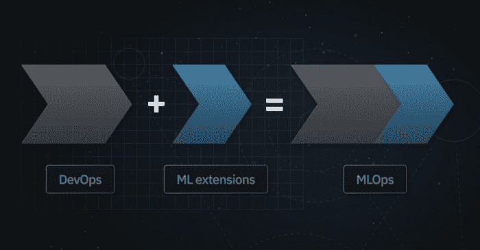

# MLOps 是 DevOps 的扩展。不是叉子——作为 MLOps 初创公司 CEO，我对 MLOPS 论文的看法

> 原文：<https://web.archive.org/web/https://neptune.ai/blog/mlops-is-extension-of-devops>

到现在为止，每个人都应该已经看到了 MLOps 文件。

[“机器学习操作(MLOps):概述、定义和架构”](https://web.archive.org/web/20230307061328/https://arxiv.org/pdf/2205.02302.pdf)

由 dominik kreuzberger，niklas kühl，sebastian hirschl 主持

很棒的东西。如果你还没有读过，一定要读。

作者对以下内容进行了全面概述:

*   什么是 MLOps，
*   MLOps 生态系统的原理和组成部分，
*   参与执行 MLOps 的人员/角色，
*   许多团队都有的 MLOps 架构和工作流。

他们解决了规范 MLOps 运动中的丑陋问题:所有这些 MLOps 堆栈组件实际上是如何相互关联并一起工作的？

在这篇文章中，我分享了我们作为 MLOps 工具公司的现实以及我个人对 MLOps 的看法。我今天将在这里谈论的许多事情我已经看到了。有些是我 3-4 年的赌注。

你要知道我从哪里来:

*   我有丰富的软件开发背景(15 年以上的软件工作经验)。经历了德沃普斯革命。从软件来到 ML。
*   创建了两家成功的软件服务公司。
*   创建了 [neptune.ai](/web/20230307061328/https://neptune.ai/) ，一个用于 [ML 元数据存储](/web/20230307061328/https://neptune.ai/blog/ml-metadata-store)的模块化 MLOps 组件，又名“实验跟踪器+模型注册表”。
*   我领导产品，观察这个市场角落的用户、客户和其他供应商在做什么。
*   我们的大多数客户都在以合理的规模进行 ML/MLOps，而不是大型高科技 FAANG 公司的超大规模。

如果你想要一个 **TLDR，**这里就是:

*   MLOps 是 DevOps 的扩展。不是分叉:
    –MLOps 团队应该由开发运维工程师、后端软件工程师、数据科学家+普通软件人员组成。我看不出 ML 和 MLOps 的工程师在这里会起什么特殊作用。
    —我们应该围绕 CI/CD 建立特定于 ML 的反馈循环(审核、批准)。
*   我们需要自动持续监控和定期人工检查。
*   将只有一种类型的 ML 元数据存储(模型优先)，而不是三种。
*   工作流编排组件实际上是两件事，工作流执行工具和管道创作框架。
*   我们不需要模型注册中心。如果有的话，它应该是一个工件库的插件。
*   模型监控工具将与 DevOps 监控堆栈合并。可能比你想象的要快。

好吧，我来解释一下。

## MLOps 是 DevOps 的扩展。不是叉子。

首先，谈论 MLOps 和 MLOps 堆栈组件很好，但归根结底，我们都只是在这里交付软件。

一种特殊类型的软件，里面有 ML，但仍然是软件。

我们应该考虑如何连接到现有的和成熟的 DevOps 实践、堆栈和团队。但是我们在 MLOps 中做的很多事情都是构建 DevOps 中已经存在的东西，并在它们上面打上 MLOps 的印记。

*MLOps is an extension of DevOps*

当公司将 ML 模型添加到他们的产品/服务中时，某些东西已经存在了。

那就是常规的软件交付过程和 DevOps 工具堆栈。

事实上，几乎没有人是从零开始的。

最后，我认为 MLOps 和 DevOps 堆栈不会彼此相邻，而不仅仅是一个堆栈。

我的意思是，如果你同意我说的“ML 只是一种特殊类型的软件”，MLOps 只是一种特殊类型的 DevOps。

因此，弄清楚 MLOps 架构和原则是很重要的，但我想知道这与扩展现有的 DevOps 原则、流程和工具堆栈有什么联系。

## 生产 ML 团队组成

让我们把这个“MLOps 是 DevOps 的扩展”的讨论带到团队结构中来。

我们需要谁来构建可靠的 ML 驱动的软件产品？

*   负责软件交付可靠性的人🙂
*   我们正在开发产品，因此产品和最终用户之间需要有明确的联系。
*   我们需要构建产品的 ML 特定部分的人。
*   我们需要构建产品的非 ML 特定部分的人。

很好，现在，那些人到底是谁？

我相信这个团队会是这样的:

*   软件交付可靠性:DevOps 工程师和 sre([devo PS vs SRE 这里](https://web.archive.org/web/20230307061328/https://www.trendmicro.com/en_gb/devops/22/f/devops-vs-sre.html?gclid=CjwKCAjw6fyXBhBgEiwAhhiZsjKUK1GJB8Rrvi1_uTnb3VuAzWk6tORlQTBJEX879swdi1vNergzKBoC8O4QAvD_BwE))
*   特定于 ML 的软件:软件工程师和数据科学家
*   非特定 ML 软件:软件工程师
*   产品:产品人员和主题专家

等等，军事行动工程师在哪里？

ML 工程师怎么样？

让我解释一下。

### MLOps 工程师只是 DevOps 工程师

这可能有点极端，但我没有在这个团队中看到任何特殊的 MLOps 工程师角色。

今天的 MLOps 工程师要么是 ML 工程师(构建特定于 ML 的软件)，要么是 DevOps 工程师。这里没什么特别的。

我们应该称一个主要操作 ML 驱动的软件交付的 DevOps 工程师为 MLOps 工程师吗？

我的意思是，如果你真的想，我们可以，但我不认为我们需要一个新的角色。这只是一个 DevOps 工程。

不管怎样，我们肯定需要这个人在团队里。

现在，让我感兴趣的是这里。

### 数据科学家 vs ML 工程师 vs 后端软件工程师

首先，数据科学家、ML 工程师、软件工程师和 ML 研究员之间的实际区别是什么？

今天我是这样看的。

总的来说，ML 研究人员非常重视特定于 ML 的知识，而不太擅长软件开发。

软件工程师擅长软件，不太擅长 ML。

数据科学家和 ML 工程师介于两者之间。

但那是今天，甚至可能是昨天。

有几个因素会很快改变这种情况:

*   业务需求
*   ML 教育的成熟

先说**业务需求**。

产品公司内部部署的大多数 ML 模型将不会是尖端的，超级重在调整。

他们不需要最先进的模型压缩技术来降低延迟或类似的调整。它们将是在该组织拥有的特定数据集上训练的一般模型。

这意味着数据科学家和 ML 研究人员对超级定制模型开发的需求将不会像构建包装和部署一般模型那样普遍。

肯定会有需要大量工作的团队。只是市场的大多数不会。尤其是那些基线模型变得如此之好。

好的，所以我们将更需要人工智能工程师而不是数据科学家，对吗？

没那么快。

再说说**计算机科学教育。**

我学 CS 的时候有一学期的 ML。今天，在同一个程序中，ML 内容增加了 4 倍以上。

我相信包装/构建/部署普通的 ML 模型将成为后端开发人员的常识。

即使在今天，如果需要的话，大多数后端软件工程师也可以很容易地学习足够的 ML 来做这件事。

再说一次，不要谈论那些棘手的训练，重在调整模型。我说的是好的基线模型。

所以考虑到:

*   基线模型会变得更好
*   经典 CS 项目中的 ML 教育将会改善
*   需要大量 ML 调整的业务问题将不再常见

我相信 ML 团队目前的角色将会发生变化:

*   ML 重要角色->数据科学家
*   软件重要角色->后端软件工程师

那么谁应该处理产品的 ML 特定部分呢？

我相信你永远都需要大量数据科学家和大量软件后端工程师。

后端软件工程师将打包这些模型，并将其“发布”到由 DevOps 工程师运营的生产管道中。

当商业问题是 ML-heavy 时，数据科学家将建立模型。

但是，即使问题不严重，你也需要数据科学家，后端软件工程师可以很容易地部署一般的模型。

为什么？

因为模型失败了。

当它们失败时，很难调试它们并理解根本原因。

真正理解模型的人是大量数据科学家。

但是，即使 ML 模型部分“如预期的那样”工作，ML 燃料的产品也可能失败。

这就是为什么你也需要密切参与交付 ML 驱动的软件产品的主题专家。

### 主题专家

好的产品交付需要频繁的反馈循环。有些反馈循环可以自动化，但有些不能。

尤其是在 ML。尤其是在没有您或主题专家查看结果的情况下，您无法真正评估您的模型的时候。

这些主题专家(SME)参与 MLOps 流程的次数似乎比您想象的要多。

我们看到时装设计师注册了我们的 ML 元数据商店。

什么？这是一个很大的惊喜，所以我们看了看。

结果是**团队非常希望中小型企业参与手工评估/测试。**

尤其是 AI-first 产品公司的团队希望他们的中小企业参与模型开发。

这是好事。

并非所有东西都可以用 AUC 或 R2 这样的指标来测试/评估。有时，人们只需要检查事情是否有所改善，而不仅仅是指标变好了。

这种人在回路的 MLOps 系统实际上在我们的用户中相当普遍:

所以这种人在回路中的设计使得真正的自动化变得不可能，对吗？

很糟糕，对吧？

乍一看似乎有问题，但这种情况在正规软件中是完全正常和常见的。

我们有质量保证(QA)或用户研究人员手动测试和调试问题。

这发生在自动化测试之上。所以不是“非此即彼”，而是“兼而有之”。

但是 SME 肯定存在于(手动)MLOps 反馈回路中。

## 原理和组件:与 DevOps 的区别是什么

我真的很喜欢 MLOps 论文作者做的一些事情。

他们从研究 MLOps 的原理开始。不仅仅是工具，还有原则。您希望通过使用工具、流程或任何其他解决方案来完成的事情。

它们进入以后解决不同问题的组件(工具)。

太多时候，这是完全相反的，讨论是由工具做什么来决定的。或者更具体地说，这些工具今天声称要做什么。

工具是暂时的。原则是永恒的。可以这么说。

在我看来，一些关键的 [MLOps 原则](https://web.archive.org/web/20230307061328/https://neptune.ai/blog/mlops-principles)缺失了，而其他一些原则应该以不同的方式“打包”。

更重要的是，其中一些东西不是“真正的 MLOps ”,而实际上只是 DevOps 的东西。

我认为作为 MLOps 工具的构建者和用户社区，我们应该考虑“真正的 MLOps”的原则和组件。扩展现有 DevOps 基础设施的东西。

这是我们为当前环境增加的价值。而不是重新发明轮子并贴上 MLOps 的标签。

所以，让我们开始吧。

### 原则

因此，CI/CD、版本控制、协作、可再现性和持续监控是 DevOps 中也有的东西。我们在 ML 中做的许多事情实际上都属于这些。

让我们深入这些细微差别。

#### CI/CD + CT/CE +反馈回路

如果我们说 MLOps 只是 DevOps +“一些东西”，那么 CI/CD 就是其中的一个核心原则。

使用 CI/CD，您可以获得自动触发的测试、批准、审查、反馈循环等等。

随着 MLOps 而来的是 CT(持续培训/测试)和 CE(持续评估)，它们对于一个干净的 MLOps 过程是必不可少的。

它们是独立的原则吗？

不，它们是同一原则的一部分。

使用 CI/CD，您希望以自动化或半自动的方式构建、测试、集成和部署软件。

训练 ML 模型不就是搭建吗？

评估/测试只是测试？

它有什么特别之处？

也许是对新型号的人工检查。

这感觉非常像通过查看差异和检查(通常)自动化测试是否通过来审查和批准一个拉请求。

不仅代码之间有区别，模型/数据集/结果之间也有区别。但还是有区别。

然后你批准，它就投入生产了。

我真的不明白为什么 CT/CE 不仅仅是 CI/CD 的一部分。如果不在命名，那么至少在把它们放在一起作为一个原则。

通过 CI/CD 的审查和批准机制非常有效。

我们不应该在 MLOps 工具中构建全新的模型批准机制。

我们应该将 CI/CD 整合到尽可能多的反馈回路中。就像人们在常规软件开发中做 QA 和测试一样。

#### 工作流程编排和管道创作

当我们谈到 ML 中的工作流编排时，我们通常会混淆两件事。

一个是调度、执行、重试和缓存。我们为确保 ML 管道正确执行所做的事情。这是一个经典的 DevOps 用例。没什么新鲜的。

但是这里有一些特别的东西:**轻松创建 ML 管道的能力。**

管道创作？

没错。

当使用 Kedro 创建[集成时，我们了解了这种区别。](https://web.archive.org/web/20230307061328/https://docs.neptune.ai/integrations/kedro/)

[Kedro 明确声明](https://web.archive.org/web/20230307061328/https://kedro.readthedocs.io/en/stable/faq/faq.html#how-does-kedro-compare-to-other-projects)它们是一个“管道创作”的框架，而不是工作流编排。他们说:

“我们关注的是另一个问题，即创作管道的过程，而不是运行、调度和监控管道。”

您可以使用不同的后端运行器(如 Airflow、Kubeflow、Argo、Prefect)，但您可以在一个框架中创作它们。

**Pipeline authoring 是 orchestrators** 之上的开发者体验(DevEx)层，满足数据科学用例的需求。这使得在这些管道上的合作更加容易。

不同团队之间的协作和管道的可重用性正是 Kedro 成立的原因。

如果你想要 ML 管道的可重用性，你需要解决可复制性。毕竟，如果您使用相同的输入重新使用模型训练管道，您会得到相同的结果。

#### 版本控制与 ML 元数据跟踪/记录

这不是两个独立的原则，实际上是一个原则的一部分。

我们已经花了数千个小时与用户/客户/潜在客户谈论这些东西。

你知道我们学到了什么吗？

模型、结果和 ML 元数据的版本化、日志、记录和跟踪是紧密相连的。

我不认为我们确切地知道一个在哪里结束，另一个在哪里开始，更不用说我们的用户了。

他们经常交替使用版本控制和跟踪。

这是有意义的，因为您希望对模型及其附带的所有元数据进行版本化。包括模型/实验历史。

你想知道:

*   模型是如何建立的，
*   结果如何，
*   使用了什么数据，
*   训练过程是什么样的，
*   它是如何被评估的，
*   等等。

只有这样，你才能谈论再现性和可追溯性。

所以在 ML 中，我们需要这种“版本控制+”，它基本上不仅仅是模型工件的版本控制，而是围绕它的一切(元数据)。

因此，也许“版本控制”的原则应该只是一个更广泛的“ML 版本控制”或“版本控制+”，其中也包括跟踪/记录。

#### 模型调试、检查和比较(缺失)

ML 模型、实验和流水线执行运行的**“调试、检查和比较”**是 MLOps 论文中缺失的原则。

作者们谈到了版本控制、跟踪和监控，但是我们看到人们想要但没有提到的一个原则是:

迄今为止，ML 中的很多东西都没有实现自动化。它们是手动或半手动的。

理论上，您可以自动优化每个模型的超参数到无穷大，但实际上，您是根据结果探索来调整模型配置。

当模型在生产中失败的时候，你不能马上从日志中知道发生了什么(大多数时候)。

您需要查看、检查、调试和比较模型版本。

显然，在模型开发过程中，您会进行大量实验，然后比较模型是关键。

但是，当这些手工构建的模型遇到再培训渠道时，会发生什么呢？

您仍然需要将 in-prod 自动重新训练的模型与初始的手动构建的模型进行比较。

尤其是当事情没有按计划进行，新的模型版本实际上并不比旧的版本更好的时候。

并且那些比较和检查是手动的。

#### 自动持续监控(+手动定期检查)

所以我完全支持自动化。

自动化平凡的任务。自动化单元测试。自动化健康检查。

当我们谈到持续监控时，它基本上是各种 ML 健康检查的自动监控。

在此之前，您需要回答两个问题:

*   你知道什么会出错，你能为此建立健康检查吗？
*   你真的有必要进行这些健康检查吗？

是的，许多团队并不真正需要生产模型监控。

我的意思是，你可以每周手动检查一次。找到你不知道自己存在的问题。更熟悉你的问题。

正如 Shreya Shankar 在她的“读博一年后对 ML 工程的思考”中所分享的那样，你可能不需要模型监控。只是定期重新训练你的模型。

> “研究人员认为分布转移非常重要，但源于自然分布转移的模型性能问题会随着再培训而突然消失。”史瑞亚·尚卡尔

你可以用 cron 作业来做。通过这种脏活产生的商业价值可能是你购买的工具的 10 倍。

好吧，但是有些队伍确实需要，百分百需要。

这些团队应该为他们知道可能出错的任何东西建立连续的监控、测试和健康检查。

但是即使这样，你也需要不时地手工检查/调试/比较你的模型。

捕捉你对自己的 ML 系统不了解的新事物。

没有度量标准可以捕捉的无声的错误。

我想这是一个很长的说法:

您不仅需要持续监控，还需要人工定期检查。

#### 数据管理

ML 中的数据管理不仅仅是版本控制，而是一个重要的、大得多的过程。

您可以对数据集进行数据标记、检查、探索、比较、供应和协作。

尤其是现在，当以数据为中心的 MLOps(迭代数据集比迭代模型配置更重要)的思想在 ML 社区获得如此多的关注时。

此外，根据您的生产数据变化的速度或您需要如何设置评估数据集和测试套件**，您的数据需求将决定您的堆栈的其余部分**。例如，如果您需要经常重新训练，您可能不需要模型监控组件，或者如果您只是解决 CV 问题，您可能不需要特征存储等。

#### 合作

当作者谈到合作时，他们会说:

> “五常协作。协作确保了在数据、模型和代码上协同工作的可能性。”

他们展示了这种协作(P5)发生在源代码库中:

这与我们观察到的现实相差甚远。

协作还发生在:

*   实验和模型构建迭代
*   数据注记、清理、共享数据集和要素
*   管道创作和重用/传输
*   CI/CD 审查/批准
*   主题专家参与的人在回路反馈循环
*   模型移交
*   处理生产模型中的问题以及来自第一线(用户、产品人员、主题专家)和模型构建者的沟通

澄清一下，我不认为我们作为一个 MLOps 社区在这里做得很好。

源代码回购中的协作是一个良好的开端，但它甚至没有解决 MLOps 中一半的协作问题。

好了，我们已经讨论了 MLOps 原则，现在让我们来讨论这些原则是/应该如何在工具堆栈组件中实现的。

### 成分

同样，CI/CD、源代码版本控制、培训/服务基础设施和监控等许多组件只是 DevOps 的一部分。

但是有一些额外的东西和一些现有的细微差别。

*   管道创作
*   数据管理
*   ML 元数据存储(是的，我知道，我有偏见，但我确实相信，与软件不同，实验、调试和手工检查在 ML 中起着核心作用)
*   模型监控作为应用程序监控的插件
*   不需要模型注册中心(yep)

#### 工作流执行者与工作流创作框架

正如我们之前在原则中提到的，我们有两个子类别的工作流编排组件:

*   **工作流程编排/执行工具**
*   **管道创作框架**

第一个是确保管道正确有效地执行。像 Prefect、Argo 和 Kubeflow 这样的工具可以帮助你做到这一点。

第二个是关于创建和重用管道的开发。像 Kedro、ZenML 和 Metaflow 这样的框架就属于这一类。

#### 数据管理

这个组件(或一组组件)应该理想地解决的问题是:

*   数据标记
*   特征准备
*   特征管理
*   数据集版本化
*   数据集审查和比较

如今，这似乎可以通过自主开发的解决方案或一系列工具来实现:

*   **特色店**像[泰克顿](https://web.archive.org/web/20230307061328/https://www.tecton.ai/)。有趣的是，现在他们更倾向于功能管理平台:“实时机器学习的功能平台”。
*   **贴标平台**如[贴标箱](https://web.archive.org/web/20230307061328/https://labelbox.com/)。
*   **数据集版本控制**与 [DVC](https://web.archive.org/web/20230307061328/https://dvc.org/) 。
*   **利用 [dbt 实验室进行特征转换和数据集预处理](https://web.archive.org/web/20230307061328/https://www.getdbt.com/)**。

应该将这些捆绑到一个“端到端数据管理平台”中，还是用同类最佳的模块化互操作组件来解决？

我不知道。

但是我相信不同部分的用户之间的合作是非常重要的。

尤其是现在这个更加以数据为中心的 MLOps 世界。当主题专家审查这些数据集时更是如此。

目前，没有任何工具/平台/堆栈在这方面做得很好。

#### ML 元数据存储(只有一个)

在论文中，ML 元数据存储在三个上下文中被提及，并且不清楚我们是在谈论一个组件还是多个组件。作者谈到:

*   配置在实验组件旁边的 ML 元数据存储
*   使用工作流编排配置的 ML 元数据存储
*   使用模型注册表配置的 ML 元数据存储

在我看来，**应该只有一个 ML 元数据存储库**来实现以下原则:

*   “再现性”
*   调试、比较、检查
*   “版本控制+”(版本控制+ ML 元数据跟踪/日志记录)，它包括来自不同阶段的任何测试和评估的元数据/结果(例如，在模型发布候选对象进入模型注册中心之前，它们的健康检查和测试结果)

让我回顾一下这三个 ML 元数据存储库，并解释我为什么这样认为。

1.  **配置在实验组件**旁边的 ML 元数据存储

这个很简单。也许是因为我在 Neptune 一直听到这个消息。

当您进行实验时，您想要迭代各种实验/运行/模型版本，检查结果，并调试问题。

您希望能够重现结果，并对准备生产的模型进行版本化。

您想要“跟踪”实验/运行配置和结果、参数、度量、学习曲线、诊断图表、解释器和示例预测。

你可以把它想象成一个**运行或者模型优先的 ML 元数据存储**。

也就是说，我们交谈的大多数人把解决它的组件称为“实验跟踪器”或“实验跟踪工具”。

当涉及到实验时,“实验追踪者”似乎是一个很棒的名字。

但是，然后您使用它来比较初始实验的结果与 CI/CD 触发的、自动运行的生产再培训管道，并且“实验”部分似乎不再起作用。

我认为 ML 元数据存储是一个更好的名字，因为它抓住了这个组件的本质。让“记录、存储、比较、组织、搜索、可视化和共享 ML 模型元数据”变得简单。

好了，解释了一个 ML 元数据存储。还有两个。

**2。配置了工作流编排的 ML 元数据存储**

这一个很有趣，因为**有两个独立的工作**人们想用这个来解决:与 ML 相关的(比较、调试)和与软件/基础设施相关的(缓存、高效执行、硬件消耗监控)。

从我们的用户来看，这两项工作是由两种不同类型的工具解决的:

*   人们通过使用本地解决方案或集成外部实验跟踪器来解决与 ML 相关的工作。他们希望在有实验结果的地方得到重新训练的跑步结果。当你想要比较/检查/调试它们时，这是有意义的。
*   与**软件/基础设施相关的工作**由 orchestrator 组件或 Grafana、Datadog 等传统软件工具完成。

等等，那么配置在工作流编排工具旁边的 ML 元数据存储不应该收集所有关于管道执行的元数据吗，包括特定于 ML 的部分？

也许应该。

但是**大多数配置了工作流编排器的 ML 元数据存储并不是按照“比较和调试”原则专门构建的**。

他们在其他方面也做得很好，比如:

*   缓存中间结果，
*   基于执行标志重试，
*   在可用资源上分配执行
*   提前停止执行

可能是因为我们[看到人们使用](/web/20230307061328/https://neptune.ai/customers/respo-vision)我们的实验跟踪器来[比较/调试复杂 ML 流水线执行的结果。](https://web.archive.org/web/20230307061328/https://app.neptune.ai/o/common/org/kedro-integration/experiments?split=tbl&dash=images&viewId=6e96f108-97e0-4a66-aef5-eb1ed6952eff)

因此，如果人们使用实验跟踪器(或运行/模型优先的 ML 元数据存储)来处理 ML 相关的东西，那么这个管道/执行优先的 ML 元数据存储会发生什么呢？

它应该只是工作流程编排器的一部分。事实往往如此。

它是一个内部引擎，使管道运行顺畅。通过设计，它与工作流编排器紧密结合。把它外包给一个独立的组件是没有意义的。

好了，再说第三个。

**3。用模型注册表**配置的 ML 元数据存储

引用论文:

> 可以在模型注册中心内配置另一个元数据存储，用于跟踪和记录每个训练作业的元数据(例如，训练日期和时间、持续时间等)。)，包括特定于模型的元数据—例如，使用的参数和产生的性能指标、模型谱系:使用的数据和代码”

好的，这里列出的几乎所有东西都会被记录到实验跟踪器中。

那里通常不记录什么？大概是:

*   生产前测试的结果、再培训运行的日志、CI/CD 触发的评估。
*   有关模型打包方式的信息。
*   关于模型何时被批准/在阶段之间转换(阶段/生产/归档)的信息。

现在，如果你像我一样，更广泛地将“实验跟踪器”视为一个 ML 元数据存储，它解决了“可再现性”、“调试、比较、检查”和“版本+”原则，那么大部分元数据实际上都在那里。

没有的东西，比如阶段转换时间戳，保存在诸如 [Github Actions](https://web.archive.org/web/20230307061328/https://docs.github.com/en/actions/managing-workflow-runs/reviewing-deployments) 、Dockerhub、Artifactory 或 CI/CD tools 之类的地方。

我不认为还有什么需要记录到一个特殊的“配置在模型注册中心旁边的 ML 元数据存储”中。

我也认为这是为什么我们交谈的这么多团队期望实验跟踪和模型注册之间的紧密耦合。

这很有意义:

*   他们想要实验跟踪器里所有的 ML 元数据。
*   他们希望在模型注册中心有一个生产就绪的打包模型
*   他们希望这两个部分之间有明确的联系

但是不需要另一个 ML 元数据存储。

只有一个 ML 元数据存储。有趣的是，大多数 ML 从业者甚至不称之为“ML 元数据存储”，而是称之为“实验跟踪器”。

好了，既然说到“模型注册”，我还有一件事要讨论。

#### 模型注册表。我们真的需要它吗？

前一段时间，我们向 Neptune 引入了[模型注册功能，并且我们一直致力于为我们的用户和客户改进它。](/web/20230307061328/https://neptune.ai/product/model-registry)

同时，如果您问我，从长远来看，MLOps/DevOps 中是否有/将会有对模型注册中心的需求，我会说没有！

对我们来说，“模型注册”是向用户和社区传达我们的 ML 元数据存储是存储和管理关于生产模型的 ML 元数据的正确工具栈组件的一种方式。

但它不是也不会是实现批准系统、进行模型供应(服务)、自动扩展、金丝雀测试等的正确组件。

从软件工程的角度来看，这就像是重新发明轮子一样。

像 Docker Hub 或 JFrog Artifactory 这样的工件注册中心不是更好吗？

难道你不想把包装好的模型放在 Kubernetes 的舵手图表里，然后就此收工吗？

当然，您需要参考模型构建历史或生产前测试的结果。

您希望确保新模型的输入-输出模式与预期的模式相匹配。

您希望在可以比较以前/新模型的同一位置批准模型。

但是所有这些并没有真正“存在”在新的模型注册组件中，不是吗？

它们主要存在于 CI/CD 管道、docker 注册表、生产模型监控工具或实验跟踪器中。

它们不在名为模型注册中心的闪亮的新 MLOps 组件中。

您可以通过完美集成以下内容来解决这个问题:

*   CI/CD 反馈循环包括手动批准和“部署按钮”(查看 [CircleCI](https://web.archive.org/web/20230307061328/https://circleci.com/docs/workflows#holding-a-workflow-for-a-manual-approval) 或 [GitLab](https://web.archive.org/web/20230307061328/https://docs.gitlab.com/ee/ci/environments/deployment_approvals.html) 如何做到这一点)
*   +模型打包工具(以获得可部署的包)
*   +容器/工件注册中心(有一个放置现成模型的地方)
*   + ML 元数据存储(获取完整的建模历史)

对吗？

我可以向我的 DevOps 朋友解释模型注册中心需要一个单独的工具吗？

我们交谈过的许多曼梯·里的人似乎都明白这一点。

但这是因为他们没有真正完全理解 DevOps 工具提供了什么吗？

我想可能是这样。

说实话，一些团队有自己开发的模型注册解决方案，它只是所有这些工具之上的一个薄层。

也许这就足够了。也许这正是注册管理机构的模式。一个抽象薄层，包含对 DevOps/MLOps 堆栈中其他工具的引用和挂钩。

#### 模型监控。等等，哪一个？

“模型监控”是 MLOps 领域中最模糊、最令人困惑的名称(“ML 元数据存储”排在第二位)。

“模型监控”对三个不同的人来说意味着六件不同的事情。

我们与团队交流的意思是:

*   **(1)在生产中监控模型性能:**看模型性能是否随时间衰减，你要重新训练。
*   **(2)监控模型输入/输出分布:**查看输入数据的分布、特征或预测分布是否随时间变化。
*   **(3)监控模型训练和再训练:**在训练和再训练过程中，查看学习曲线、训练后的模型预测分布或混淆矩阵。
*   **(4)监控模型评估和测试:**为您的自动化评估或测试管道记录度量、图表、预测和其他元数据
*   **(5)监控基础设施指标:**查看你的模型在训练和推断过程中使用了多少 CPU/GPU 或内存。
*   **(6)监控 CI/CD 管道的 ML:** 查看您的 CI/CD 管道作业的评估，并进行直观比较。

例如:

*   Neptune 在(3)和(4)上做得很好，(5)还可以(正在努力)，但是我们看到团队也在(6)上使用它
*   普罗米修斯+格拉法纳确实擅长(5)，但人们把它用于(1)和(2)
*   Whylabs 或者 Arize AI 真的很擅长(1)和(2)

因为我确实相信 MLOps 只是 DevOps 的一个扩展，所以我们需要了解像 Datadog、Grafana、NewRelic 和 ELK (Elastic、Logstash、Kibana)这样的软件可观测性工具在今天和未来适合 MLOps。

此外，一些部分本质上是非连续和非自动的。比如比较/检查/调试模型。有主题专家和数据科学家参与其中。我看不出这是如何持续和自动的。

但最重要的是，我们应该弄清楚什么是真正特定于 ML 的，并在那里构建模块化工具或插件。

对于其他的，我们应该使用更成熟的软件监控组件，很可能你的 DevOps 团队已经有了。

因此，也许下面的拆分会让事情变得更加明显:

*   生产模型的可观察性和监控(亚利桑那州 WhyLabs)
*   监控模型培训、再培训、评估和测试(MLflow、Neptune)
*   基础设施和应用监控(Grafana、Datadog)

我很想看看 Datadog 和 Arize AI 的首席执行官如何考虑他们在 DevOps/MLOps 中的长期位置。

漂移检测只是应用程序监控堆栈的一个“插件”吗？我不知道，但实际上似乎很合理。

## 最后的想法和公开的挑战

如果我想让你从这篇文章中学到什么，那就是这个。

**我们不应该考虑如何从头开始构建 MLOps 堆栈。**

我们应该考虑如何逐步扩展现有的 DevOps 堆栈，以满足您目前的特定 ML 需求。

作者说:

> “为了成功开发和运行 ML 产品，需要从模型驱动的机器学习向面向产品的学科进行文化转变
> 
> …
> 
> 尤其是在设计 ML 产品时，与这些活动相关的角色应该有一个以产品为中心的视角。

我认为我们需要更大的思维转变:

**ML 模型- > ML 产品- >使用 ML 的软件产品- >只是另一个软件产品**

并且你的 ML 驱动的软件产品被连接到交付软件产品的现有基础设施上。

我不明白为什么 ML 在这里长期是一片特殊的雪花。我真的不知道。

但是，即使查看所展示的 MLOps 堆栈，99%的团队实际需要的实用的 v1 版本是什么？

作者采访了拥有 6500 多名员工的公司的 ML 从业者。大部分做生产 ML 的公司都不是那样的。对于大多数团队来说，MLOps 堆栈要简单得多。

尤其是那些在合理规模做 [ML/MLOps 的。](/web/20230307061328/https://neptune.ai/blog/mlops-at-reasonable-scale)

他们可能会选择 1 到 2 个他们深入研究的组件，其余的则是超级基础的东西。

或者什么都没有。

你不需要:

*   cron 作业足够时的工作流程编排解决方案。
*   当 CSV 足够时存储功能。
*   当电子表格足够时，进行实验跟踪。

真的，你不知道。

我们看到许多团队通过务实和专注于目前对他们来说重要的事情来交付伟大的东西。

在某个时候，他们可能会将其 MLOps 堆栈增长到我们在本文中看到的规模。

或者参加 DevOps 会议，并意识到他们应该只是扩展 DevOps 堆栈😉

* * *

我偶尔会在我的 Linkedin 个人资料上分享我对 ML 和 MLOps 前景的看法。如果你对这个话题感兴趣，请随时跟我来。此外，如果你想和我聊聊，也可以联系我。