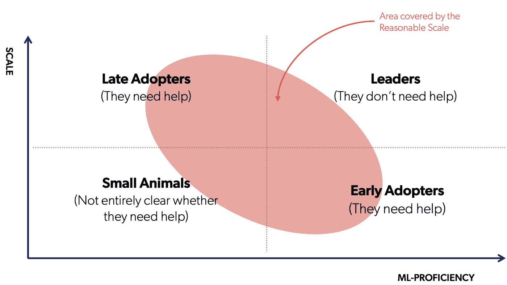

# 与雅格布塔利亚布埃公司一起建立合理规模的 MLOps

> 原文：<https://web.archive.org/web/https://neptune.ai/blog/mlops-reasonable-scale-jacopo-tagliabue>

本文最初是 MLOps Live 的第二集，这是一个互动 Q &环节，ML 从业者回答来自其他 ML 从业者的问题。

每集都专注于一个特定的 ML 主题，在这一集里，我们和雅格布·塔利亚布埃谈论了**合理规模的 MLOps。**

你可以在 YouTube 上观看:

[https://web.archive.org/web/20230117111501if_/https://www.youtube.com/embed/YeTjgzllGqw?feature=oembed](https://web.archive.org/web/20230117111501if_/https://www.youtube.com/embed/YeTjgzllGqw?feature=oembed)

视频

或者作为播客在以下位置收听:

但是，如果你喜欢书面版本，这里有！

您将了解到:

## 1 什么是合理的 MLOps 规模

*   2 如何建立合理规模的 MLOps】
*   使用什么工具，是购买还是制造工具

*   4 如何向客户交付模型

*   5 合理规模的界限是什么

*   6 还有更多。
*   让我们开始吧。

**Sabine Nyholm:** 很荣幸向大家介绍[雅格布·塔利亚布埃](https://web.archive.org/web/20230117111501/https://www.linkedin.com/in/jacopotagliabue)，他甚至被称为**合理规模营销**之父。绝对是机器学习摇滚明星。雅格布，你能向我们的观众介绍一下你自己吗？

雅格布·塔利亚布埃:当然。我现在是 Coveo 的 AI 总监。对于那些不了解 Coveo 的人来说， [Coveo](https://web.archive.org/web/20230117111501/https://www.coveo.com/en) 是一家在 TSX 上市的公司。我们基本上向客户提供机器学习模型，以服务于不同类型的用例。最重要的是电子商务，因为我来自那里。

这个想法是，让我们说你有一个网站，你想让你的网站有智能推荐，然后你会要求 Coveo 为你提供一个模型来做到这一点。

这很重要，不仅仅是为了告诉你一些关于我自己的事情，而且在接下来的一个小时里，这也很重要，告诉你我们从何而来，合理的规模 ML。

我们是一家 B2B 公司。我们没有客户直接使用模型，但我们为客户提供模型，用于他们的购物者或类似的事情。我认为这是一个重要的区别。

我加入 Coveo 是因为收购了我的公司 Tooso，它与我的联合创始人 Ciro 和 Mattia 在旧金山做着几乎相同的事情， **[自然语言处理](/web/20230117111501/https://neptune.ai/blog/category/natural-language-processing)和电子商务 AI**。所以我也曾是一名企业家。

我也喜欢成为研究和学术团体的一员。我是 NYU 大学的兼职教授，在那里我教授机器学习系统，所以实际上如何把所有这些机器学习部件放在一起让它们工作。我和我的团队尽我所能为电子商务技术社区做贡献——通过论文、开源和数据。

什么是合理的规模利润？

**萨宾:**优秀。非常感谢你雅格布。为了让你暖和起来，雅格布，你如何在一分钟内解释合理的规模？

## **雅格布:**当然可以。我们每天在博客文章或商业评论中读到的许多 ML 指南和 ML 实践都是“谷歌这样做了，或者脸书这样做了，你应该这样做”。

合理规模 ML 的理念是，如果你不是谷歌，那就没关系。不是谷歌也没关系。实际上，在不久的将来，绝大多数的 ML 用例将会出现在企业内部，或者不一定是大型科技公司的内部。

[https://web.archive.org/web/20230117111501if_/https://www.youtube.com/embed/Y8u8UkacIbY?feature=oembed](https://web.archive.org/web/20230117111501if_/https://www.youtube.com/embed/Y8u8UkacIbY?feature=oembed)

视频

这是合理规模的背景，但合理规模令人兴奋的部分是，由于开源工具或解决方案(例如 [Neptune](/web/20230117111501/https://neptune.ai/) )的不断增长和繁荣的生态系统，现在每个人都可以以非常低的门槛进入，所以有可能以合理的规模做尖端的 ML。这是一个巨大的差异，因为四年前，当我们开始创办我自己的公司 Tooso 时，许多现在我们认为理所当然的东西并不存在。

你需要大量的资源来实现这一点，但是现在第一次:

That’s the context for a reasonable scale, but the exciting part of a reasonable scale is that thanks to the growing and blooming ecosystem of open-source tools or solutions (like [Neptune](/web/20230117111501/https://neptune.ai/), for example) that are now available for everybody with a very low barrier to entry, it’s possible to do cutting-edge ML at reasonable scale. This is a huge difference because four years ago, when we started Tooso, my own company, a lot of things that now we take for granted were not there.

如果你从一个小团队开始

## 2 或者没有那么多资源，

*   你仍然可以做一个非常好的 ML。再次感谢这个不可思议的生态系统。
*   我们试图做的是向人们传播福音。这甚至不是我们自己的事情，但我们正试图向为我们工作的人宣传，帮助他们摆脱在生产中做 ML 是超级复杂的想法。如果你没有合适的工具，那就是了。如果你知道自己在做什么就不是了。

Stephen Oladele: 雅格布，我想知道是什么让你开始考虑合理的规模？这背后有什么故事？

**雅格布:**我们之前说过，记住，B2B 公司和 B2C 公司有很大不同。典型的 B2C 公司是 Airbnb 的 ML 堆栈，或者让我们说亚马逊，他们有一个推荐系统(为了简化)，他们有一个网站要处理。这是一个非常巨大和非常重要的网站，非常困难，但最终，他们控制了这个网站。

每次他们在推荐系统上做一点小的改进，他们都会把他们将要赚的钱装进口袋，在亚马逊的例子中，这是数十亿美元，值得投资这么做。

像 Tooso 或 Coveo 这样的 B2B 公司有一种不同的增长方式。我们通过增加顾客来发展。当然，我们的 ML 需要是好的，但是我们需要优化的不是一个特定的客户，而是跨越数百个客户的健壮性。

当你去拜访每一个客户时，他们中的每一个都不会是亚马逊，也许所有人都是，他们有太多太多的数据，但他们中的每一个都是合理规模的客户，每天有数百万次事件，而不是数万亿次。合理规模堆栈的想法来自于这样一种认识，即我们的大多数业务问题都是针对每个客户或组织的，并且世界上大多数组织都是合理规模的组织。

事实上，全球大多数组织都不是亚马逊，我们也想帮助他们。没有理由因为你不是亚马逊就没有好的 ML。那是 TL；博士这一切的口号。

建立合理规模的 MLOps

超大规模与合理规模的公司

## 斯蒂芬:谈到亚马逊、谷歌等等，这些都是像你提到的超大规模公司。你认为最大的区别是什么？如果你正在为一个小公司建立 ML，比如说，四个工程师或两个数据科学家，与亚马逊规模相比，你能指出的有帮助的区别是什么？

### **雅各:t1]**

第一个，回到我之前的观点，是**激励**的不同。有区别。

如果你在谷歌或亚马逊，你有动力在某件事情上做得更好，因为它在 X 上 0.1 的改进将转化成数十亿美元。

1.  对于一个合理规模的公司来说，这是不必要的。在激励方面，你构建团队的方式，例如，有多少数据工程师，多少数据科学家，以及你有多少机器学习研究，都取决于这个业务约束。
    *   第二点是**构建相对于购买相对于开源相对于你想要的任何东西**，但是它是你如何使用你的资源的想法。
    *   如果你的资源在某种程度上受到限制，你真的想花绝大部分时间，可能是全部时间，做高价值、高利润的活动。
2.  例如，如果我是一名数据科学家，在 Coveo 中构建您的推荐模型，我想做推荐模型。我不想处理基础设施、扩展、实验跟踪等等。我们可以说出他们所有人的名字。对我来说，购买或以某种方式利用这些东西中已经非常好的其他东西要好得多，这不是我的核心。它们对我的工作来说是必要的，但这不是我所做的，然后我可以专注于最好的事情。
    *   像谷歌和脸书这样的大公司，他们已经解决了所有的附属问题，因为这些问题对他们来说太重要了。他们可能不会选择其他供应商，因为他们的规模有一些特点。大多数理性的公司在这方面实际上都是相似的。比如，如果你在 Coveo 使用 [Metaflow](https://web.archive.org/web/20230117111501/https://metaflow.org/) 或其他什么[雪花](https://web.archive.org/web/20230117111501/https://www.snowflake.com/)，我敢肯定你可以用它来为一个非常相似的公司提供几乎相同的模式。

> 合理规模的工具组

1.  克里斯:雅格布，我很欣赏你对 B2B 和 B2C 的定义。我们销售给其他企业，所以我们称自己为 B2B，但实际上我们是 B2C。那些只是顾客。我们有自己的产品，我们有界面。(我这么说是为了框出或者帮助你解答。)

*Comparison of “reasonable scale” and “hyperscale” companies*

### 我们处于零阶段。我是一名机器学习工程师，几个月前刚刚入职，到目前为止，我花了所有的时间做软件工程，但我的任务是试图找出我认为最重要的机器学习实验，因为一个小型数据科学团队继续试图推进我们今天拥有的三个商业化数据科学模型。

最大的问题是，我们是一家 AWS 商店，所以我正在努力使用 [MLflow](https://web.archive.org/web/20230117111501/https://mlflow.org/) 、 [SageMaker](https://web.archive.org/web/20230117111501/https://aws.amazon.com/pm/sagemaker/?trk=dbee2005-cb7c-4fe1-b762-da3a9de0ac64&sc_channel=ps&sc_campaign=acquisition&sc_medium=ACQ-P%7CPS-GO%7CBrand%7CDesktop%7CSU%7CMachine%20Learning%7CSagemaker%7CEEM%7CEN%7CText%7CEU&s_kwcid=AL!4422!3!532493333032!e!!g!!sagemaker&ef_id=Cj0KCQjw54iXBhCXARIsADWpsG-Uqvl1DoEjcGlydVUV9q4jVF8QsWBiHKoN5fswzVQBxv4ZOMg4IskaAl3JEALw_wcB:G:s&s_kwcid=AL!4422!3!532493333032!e!!g!!sagemaker) 和 [Neptune](/web/20230117111501/https://neptune.ai/) 平台范例来开始。

雅格布:你说的只是整个管道的实验跟踪部分？你只是想专注于标本追踪吗？

克里斯:我得吃一小口。我认为一个三人团队试图包揽一切是错误的。

AWS 希望我们只需在上面签字，然后全部完成。我还没被 SageMaker 实验说服。

我还不赞成小公司承担 MLflow 资源需求的成本，尽管我们在 AWS 上的 [Kubernetes](https://web.archive.org/web/20230117111501/https://kubernetes.io/) 上支持这一点。

*   我们到了。一小口一小口。现在，我们正在讨论模型实验，控制它，在团队内部更好地了解我们每个人对主要核心组件做了什么。
*   **雅格布:**之后我会回到一般的点上，但我先来回答这个具体的问题。对于实验跟踪，我非常熟悉海王星、[重量&偏差](https://web.archive.org/web/20230117111501/https://wandb.ai/site)和[彗星](https://web.archive.org/web/20230117111501/https://www.comet.com/site/)产品。

深入比较 [海王星和重&偏](/web/20230117111501/https://neptune.ai/vs/wandb) 以及 [海王星和彗星](/web/20230117111501/https://neptune.ai/vs/comet) 。

我认为它们迎合了略有不同的用户类型，但对我来说，总的建议是，与 MLflow 相比，我更喜欢 [Neptune 提供的 SaaS 体验。](/web/20230117111501/https://neptune.ai/vs/mlflow)

不是因为 MLflow 不太好，我们以前也使用过，而是因为它不值得我们团队为这样的功能进行额外的维护和拥有成本，我们的团队非常重视尖端实验，而不是基础设施和基本维护。

我认为在这里你必须做出的第一个选择是在你托管的东西和这些工具中的一个之间。

在我看来，这是一个显而易见的 SaaS 的事情。这是特别小的团队应该去 SaaS 的事情之一，但是我理解其他一些人可能在安全或各种其他问题上有不同的限制。如果你问我，这是 SaaS，这是 100%购买。在宇宙中没有这种自我塑造的事情。

**Chris:** 是的，我认为第一阶段的安全性是我们最关心的问题，因为从公司的客户和客户的客户的角度来看，它都是 PII，所以它必须在我们的 VPN 后面，我们还没有就成本和复杂性与 Neptune 展开对话，以进行设置。

雅格布:我完全理解。据我所知，有了所有这些解决方案，您就可以开始了——对于实验跟踪部分，实际上，您似乎不需要发送太多敏感信息来从这个工具中获得价值。更多的是损失指标、聚合指标和评估。我认为对于所有这些工具来说，即使是采用 SaaS 也可能是一次旅程。

当您从安全性较低但仍能为您的试验周期提供价值的东西开始时。然后你建得越多，你的胃口就越大。我认为这里有一条路径，可以有一个短的采用周期，看看它如何进行，然后推迟安全性讨论，直到你需要上传工件或数据之类的东西。有意义吗？

克里斯:很多。谢谢，是的。

许多 SaaS 工具也可以部署在您的服务器上。查看 Neptune 的[内部发售。](/web/20230117111501/https://neptune.ai/pricing/server)

关于 AWS，我想说的另一件事是，有一个我们非常推荐的工具(它是开源的，所以没有人从中获得任何金钱)，它被称为 [Metaflow](https://web.archive.org/web/20230117111501/https://metaflow.org/) 。事实上，我们在 GitHub 上有几个[开源回购](https://web.archive.org/web/20230117111501/https://github.com/jacopotagliabue/you-dont-need-a-bigger-boat)，向你展示如何建立一个完整的端到端系统。对于使用 AWS 的人来说，我们总是发现 Metaflow 是一个很好的主干，可以放在上面，就像 Neptune 和 SageMaker for serving 或 [Seldon](https://web.archive.org/web/20230117111501/https://www.seldon.io/) 或任何你需要的东西。

我的建议是，如果你已经购买了 AWS，这并不意味着你需要走整个 SageMaker 的路，你可以选择一些其他的开源工具。他们非常擅长让你富有成效。

**Sabine:** 是的，我们实际上在聊天中有一个关于 Metaflow 的后续问题。它准备好了吗？

我不能正式说，因为我不知道最新的版本。我想我可以说它在工作中。不知道是已经出了还是在测试中。不过，我们使用它的是共享计算的 AWS。对我们来说，这没什么大不了的，因为我们正在 AWS Lambdas 中的 AWS 批处理之上使用它，这已经是我们基础架构的一部分。

我认为 Kubernetes 的东西很有趣，因为许多人使用它，当然，当他们查看他们的基础设施的现有主干时。

我认为 Chip 有一个很好的帖子说数据科学家不需要知道 Kubernetes。我会向前迈进一步，我会说很多 ML 团队根本不需要使用 Kubernetes。

在一个合理的规模上，有像 Kubernetes 一样好的解决方案来运行您的计算、培训和服务，可能只需要实际去 Kubernetes 的维护头痛的一小部分。

不管 Metaflow 和 Kubernetes 目前的状况如何，我相信这将会改善，我们在使用 AWS 过去的服务运行 Metaflow 时从未遇到任何问题，我们实际上非常非常看好使用这些过去的服务而不是自己维护集群的想法。

**Sabine:** 从时间计算存储或其他角度来看，MLOps 工具和流程中对您来说最昂贵的部分是什么？

那真的取决于你做什么。对我们来说，它是计算，特别是 AWS 补丁，特别是 GPU。对我的团队来说，按比例来说，这是我们账单中最大的一部分。

但我的团队所做的，要么是研究，前沿建模或原型，也有点前沿，但仍然是深度学习的东西，大量的数据，等等。我们账单的最大部分将会是那样的。

另一个重要的部分是雪花组件，它现在变得更便宜了。我们所有的数据都存储在数据仓库中，对我们来说，这是雪花。我们称之为真理的单一来源，因为我们通过设计把一切都储存在那里。

当您查询大量万亿字节的数据时，即使是合理的规模，在某些时候，账单也会堆积起来。

不过，我想说的是，虽然 GPU、雪花或 SageMaker 的成本很高，但这只是我的时间或像我这样的人的时间成本的一小部分。与美国一个熟练的 ML/AI 人员的花费相比，这只是微不足道的一小部分。我花在担心基础设施上的每一分钟都比付钱给杰夫·贝索斯让他给我要昂贵得多。

当然，在某些时候，这种类比是站不住脚的。

但是还是那句话，在合理的规模下，你人少的时候，你的成本就是人。从字面上看，你唯一的成本就是人。因为如果有人因为做 infra 而不是 ML 不开心，他们会离开。更换它们的成本会更高。

我们没有考虑所有这些隐性成本，因为这是人的成本。它们比你的 AWS 账单要大得多，大得多。在合理的尺度上为人民的幸福而优化。然后，当你真正变大时，你也可以针对计算进行优化。

> Sabine:shri Kant 向我们提出了一个硬件问题。雅格布，你的模型训练推理使用英伟达 GPU 驱动的计算吗？如果是，在一个模型中，针对不同功能的定制消费需求，GPU 的抽象程度如何？

是的，我们使用的是通过 AWS 提供的标准 NVIDIA 产品，是在 SageMaker 批量购买的。是的，我们使用 NVIDIA 的东西，我们正在评估使用 NVIDIA 开源推理服务 Triton 作为实际部署的软件堆栈。

这两件事并不排斥。您可以拥有一个基于 SageMaker 的端点，它运行 Triton 作为您的推理软件。

抽象实际上是相当透明的。当您实际告诉 Metaflow 在 AWS 批处理上运行什么时，您可以将 Metaflow 指向您用正确的依赖项构建的特定容器。

发生的情况是:你告诉 Metaflow，“嘿，在这个容器上运行这个 Keras 模型的训练代码，这个容器被证明可以在 AWS 补丁 GPU 支持的东西上运行”——它将开箱即用。对于 SageMaker 服务来说，也是一样的。为 GPU 预先制作的服务实例将自动在 GPU 之外工作。

对我们来说，这已经很抽象了。我不认为我们在 GPU 方面有 99%的复杂性，因为我们大部分的 GPU 工作都是为了研究和原型制作。这种设置可能无法满足那些希望以非常低的延迟提供 GPU 服务的人。就目前而言，这是一个我们不必面对的问题。但是对于研究和迭代，我们的 GPU 抽象和 AWS 补丁到目前为止工作得非常好。

Sabine: 一个关于组织 ML 工作流程的问题。拉斐尔一直使用[完美](https://web.archive.org/web/20230117111501/https://www.prefect.io/)和[气流](https://web.archive.org/web/20230117111501/https://airflow.apache.org/)。他说，“我愿意使用 SageMaker 推理端点来简化模型部署。你认为使用 SageMaker 管道来编排工作流有意义吗？”

**雅格布:**我没有 SageMaker 管道的经验，所以我在这里的意见可能不是决定性的。我有使用 Airflow 和 Prefect 的经验，如果你认为 Metaflow 是 ML orchestrator，那也是一个选择。

我不认为你被迫购买整个 SageMaker 管道只是为了从中获得价值。

比如，我们没有。我们用 SageMaker 进行训练。我们发现与普通 Python 相比，它作为 API 有点笨拙。我觉得你可以独立做出你的评价。如果你不想的话，没有理由跳进完整的 SageMaker 的东西。

另一方面，有很多理由使用 SageMaker 来处理与编排的其余部分完全无关的事情(例如，端点)。

如何建立合理规模的 MLOps

斯蒂芬:当你以合理的规模建造房屋时，你是如何考虑先放入哪些组件的？尤其是当你的团队中有两名数据科学家或四名工程师时？

### 

[https://web.archive.org/web/20230117111501if_/https://www.youtube.com/embed/JBK7FbYr1uI?feature=oembed](https://web.archive.org/web/20230117111501if_/https://www.youtube.com/embed/JBK7FbYr1uI?feature=oembed)

视频

**雅格布:**你的第一个 ML 项目需要做的第一件事，第一条规则永远是:如果可以，千万不要做 ML。

 **如果你的团队很小，我建议:

从数据开始。确保它是干净的，并妥善存放。我们可以讨论如何做到这一点。

然后，你可以对这些数据进行处理，产生一个小的端点。一开始，它不需要成为 MLM 点。它可以是一套规则，它可以是你能想到的最愚蠢的模型，它可以是一袋单词和一个侧面工具包来做测试分类。

1.  然后确保端到端的工作，从数据到你的模型，到预测，然后你可以捕捉到你的用例的任何反馈。比方说如果是推荐，那就是点击。如果是文本分类，可能是拇指向上或拇指向下，如果用户想留下评论或类似的东西。
2.  一旦你的两个数据科学家知道如何从数据到干净的数据，建模到终点，以及反馈，一旦所有这些指针都到位，解耦。
3.  只要你保持这些部分之间的接触完好无损，现在你就可以开始改善了。现在我们把单词袋拿掉，用你想要的任何东西来代替它们。现在我们让数据质量更好。我们可以使用 [Great Expectations](https://web.archive.org/web/20230117111501/https://greatexpectations.io/) 来检查分布情况或其他情况，而不只是检查我们有多少数据。
4.  从小处开始，但以薄片的形式开始。因为如果你从小处着手，只关注其中的一部分，你就失去了对问题的关注。你需要解决的是端到端。它从数据到用户，然后从用户反馈回到数据。
5.  我们试图做的，总是原型化一个特征的薄片。然后你回去，改善这一切。你改进得很好。你可以改善几个月。但首要的是花尽可能少的时间把东西拿出门来。如果你使用好的工具，这是可能的。如果你使用 SaaS 实验跟踪器。如果你不把时间浪费在愚蠢的事情上。那是非常重要的。

比方说，你考虑购买一个 SaaS 实验平台的时间最终会比你注册的花费更多。你用一个月，你出货，你看看效果如何，然后你再决定。真的很重要。

*Examples for pillars of MLOps | [Source](/web/20230117111501/https://neptune.ai/blog/mlops-at-reasonable-scale)*

同样，这来自于建立一个合理规模的公司的一种非常具体的方式，来自于当你不断迭代时的一种非常创业的心态。速度是一种美德。

我明白这并不是在所有情况下都是正确的。当然，我不会建议医疗保健或自动驾驶汽车这样做。在有些地方，快速移动不是一个价值，但在很多地方，快速移动是擅长 ML 的一个重要组成部分。

Sabine: 在 Robert 的聊天中，我们有一个问题。他在这里有一些数据隐私问题，他问你是否有任何关于建立完整 MLOps 管道的工具的建议，除了为一个小型 ML/AI 团队服务，三到五个人有在内部运行的硬性要求。他们有一些 GitLab CI 和 [DVC](https://web.archive.org/web/20230117111501/https://dvc.org/) 已经建立和运行。

不幸的是，或者对我来说幸运的是，电子商务是一个非常不敏感的数据领域，因为电子商务数据首先总是被散列或匿名化。我们处理的许多数据都是交互数据，或者人们在我们网站上做的事情都有正常的安全问题，但不是医疗保健，或者不是特别敏感。一旦您符合 GDPR 和一般法规，您作为数据科学家的工作就会因为业务案例而变得简单。

不幸的是，我在隐私优先的环境中没有丰富的经验。我知道 DVC 很棒，但我们所有的生活都是关于云和服务的生活，合理规模的东西是云和服务是好的，因为它们允许你比你自己维护员工更快地移动，这显然意味着有时当不可能时，你必须自己去做事情。

我不知道具体的用例，但我在经验中发现的另一件事是，与云提供商或 SaaS 提供商相比，许多人倾向于大大高估自己设置的安全性。如果有人真的去调查的话，它们提供了同样的甚至更好的安全性。

同样，我不知道具体的使用案例，但我知道在另一个领域的其他案例中，对迁移到云的抵制更多的是文化上的，而不是关于云不安全的实际问题，无论它是安全的还是私有的。

也许，在这种情况下，为数据集或数据访问或雪花或元流等设置良好的数据治理，可能是减轻这种隐私担忧的一种方式。

Stephen: 就公司而言，允许他们的数据和流程之类的东西在这个特定的堆栈之外是违反文化的。他们的文化依赖于内部拥有一切，他们如何解决这个问题？他们如何应对这种情况，他们如何采用合理规模的 MLOps 方法来处理事情？

[https://web.archive.org/web/20230117111501if_/https://www.youtube.com/embed/v22Hj7_8spw?feature=oembed](https://web.archive.org/web/20230117111501if_/https://www.youtube.com/embed/v22Hj7_8spw?feature=oembed)

视频

雅格布:这是最难的问题之一。这是一个关于人类的问题，而不是关于 Python 或 SageMaker 或其他什么的问题。很辛苦。在我与数十个组织合作的经验中，这些组织是我们以前的客户或现在的客户或我在整个行业中的朋友，文化方面是最难改变的。

事实上，我们对我们的 [Bigger Boat repo](https://web.archive.org/web/20230117111501/https://github.com/jacopotagliabue/you-dont-need-a-bigger-boat) 或其他开源解决方案的许多抵制是，“嗯，你很幸运，因为他们允许你在公司里做所有这些事情。在我的公司里，有一个团队负责数据，有一个团队负责模型，有一个团队负责部署或其他什么(你可以将这些映射到你自己的经历中)。”

对我们来说，这是所有战斗之母，如果你能战斗的话。我们赞同端到端机器学习实践者或数据科学家的想法。有个人说:

In fact, a lot of the pushback we have with our [Bigger Boat repo](https://web.archive.org/web/20230117111501/https://github.com/jacopotagliabue/you-dont-need-a-bigger-boat) or other solutions we put out as open sources is, “Well, you’re lucky because they allow you to all of these things in your company. In my company, there’s a team for data, there’s a team for the model, there’s a team for deployment or whatever (you can map this into your own experience).”

1 可以看到已经清理准备好的数据，当然是数据专家，

## 2 能准备自己的特写，

*   3 可以训练自己的模型，

*   4 并且可以运出去。
*   在我们做的每一件事情中，回到团队切片的想法是授权给一个人，甚至一个人，也许更多，但它甚至可以是一个人能够做所有这些事情并产生商业价值，而无需与任何其他人交谈。不跟 DevOps 的人，不跟工程师，不跟保安，不跟任何人谈。
*   其他一切都没有足够抽象，因此一个机器学习工程师可以从数据到端点，这是一个改进的机会。越多的公司理解这一点，他们从他们的 ML 计划中获得的流动性就越大。

这家以一个小型数据科学家团队起家的公司的问题之一是，他们没有将他们嵌入到公司的工作流程和文化中，而是将他们放在一个孤岛中做笔记本或笔记本电脑上的任何东西。

然后一年后，Gartner 说 97%的项目从未进入生产阶段(我的 LinkedIn feed 上几乎都是 Gartner 说人们从未将员工投入生产)。也许我们可以说这是数据科学家的错，但我们并没有真正为他们的成功做好准备。我们把它们放在一个泡泡里，然后做，“嘿，做一些神奇的东西。”现在无论他们做什么魔法，对我们来说，都不可能在公司里消耗掉。

我对人们创业的建议是违反直觉的，但是从很少的人开始，让人们理解端到端的价值。

他们不需要成为建模方面的最优秀的人，不需要成为 SQL 方面的最优秀的人，不需要成为基础设施方面的最优秀的人，但是他们理解所有这些问题。我知道这些人的成本往往很高，因为他们之前没有多少人真正做过这种端到端的工作。但是一两个知道自己在做什么的人会让接下来的 10 次招聘变得更加高效。

> 如果你走另一条路，从大学里雇佣 20 个知道 PyTorch 的人(这种情况我见过很多次)，现在你有 20 个相对昂贵的人，可能每人不太贵，但是相对昂贵。他们跑来跑去找数据，记在笔记本上，但什么也没做成。一年后，高管说，“嗯，这个 ML 的东西不工作。”

当然，它不是这样的。我建议另一种方法。当你首先雇佣专家的时候，你建立了一个生产力工具，然后你雇佣一些人来实际地做建模和改进。这是我对创业人士的建议。同样，这是最难的部分，因为这是一场文化之战；这不是技术战。

**Sabine:** 你会推荐全栈工程师还是更专业的数据科学家、ML 工程师或者软件工程师？

**Jacopo:** 为了构建 MLOps 的顶层部分，我认为有些人需要了解 ML 模型的生命周期。

**Sabine:** Would you recommend going with full-stack engineers or more specialized data scientists, ML engineers, or software engineers?

这可能是一个非常有才华的软件工程师，我不知道，他来自网飞，也接触过建模。

## 对 ML 有一定了解的数据工程师也可以。

*   也可以是一个对数据有一定了解的 ML 人员。
*   以我的经验来看，仅仅来自软件工程师背景的人，倾向于非常擅长其中的一些工具，但是他们倾向于低估 ML 中出现的一些其他问题，典型的是数据不断变化的事实。系统的行为实际上是一个分布，它不像一个线性路径，一个正常的软件。
*   仅仅是一个总是专注于建模的数据科学家的人可能会低估另一个复杂性——使数据清晰可用、可扩展等等有多难。

这就是为什么我要说，我知道很难找到这些什么都懂的人。但根据我的经验，他们往往是最好的人，至少可以建立一个良好的实践。他们是您的数据领导者。然后，在您获得数据领导者后，您可以让拥有最专业知识的人来完成他们的工作。

向客户交付模型并在生产中监控它们

Sabine: 然后，我们有几个关于不同话题的问题。

## Delivering models to customers and monitoring them in production

1 你如何将模型交付给客户？

## 他们使用你的 API 吗，或者它的工作方式有所不同？

*   你如何知道模型在生产中的表现？
*   例如，你如何知道何时更新它们呢？
*   雅格布:这是两个非常好的问题。对于第一个问题，我打算一分为二。一个是原型内部部署，一个是面向公众的全球可用性部署。因为，再一次，记住我们做的是字面上的 API，我们之前的产品 Coveo 或 Tooso 是字面上的 API。模型就是产品。我们不是植入 Airbnb 的模型，模型其实就是产品。
*   对于全球可用的东西，有一个由 Coveo 工程师用一年时间构建的完整基础架构，它基于我们自己的内部工具。它实际上是基于 Kubernetes 的，而且是在 Fargate 之类的过去的服务不太可用的时候完成的。

对于新的东西，比如我们做的原型和研究，特别是在我的团队中，我们非常乐意使用托管服务。

1.  如果是非常简单的东西，我们可以使用，比如说，Fargate。(Faregate 的 Fast API 就像是你可以在网上找到的标准数据科学教程。)
2.  对于稍微复杂一点的模型，我们使用 Sagemaker，因为它为您提供了这种基于 Python 的 API，这样，如果您使用 Metaflow，就像我们的情况一样，当您使用两行 Python 部署您的模型时，在实验跟踪等之后，您可以在管道中进行最后一步。它与 Metaflow 配合得很好，因为模型工件已经存储在 S3，所以您只需告诉 Sagemaker 模型工件在哪里，然后 Sagemaker 将为您创建一个端点。您会发现这是迭代和构建内部端点的一个非常好的方法。从任何角度来看，Sagemaker 都不是完美的。我们发现依赖项和定制容器的管理可以得到极大的改进，但是一旦你解决了这个问题，在你的 Python 基础上做一些事情实际上是非常快的。
    *   这很有希望回答了问题的第一部分。关于监控的第二部分更有趣。但对我们团队和公司来说，这是一个新的开始。
    *   监控空间在最近半年左右的时间里百花齐放。我们实际上正在评估该领域的开源平台和 SaaS 提供商，因为我们做的事情非常快，这就是信息检索。

我们所做的大部分工作要么是推荐，要么是搜索，因此这种使用情形不是人们在进行监控时通常提到的情形。也许他们提到了贷款预测问题或 NLP，但我们公司大多数人实际上是做信息检索的。所以它处理伪反馈，它有一个与大多数不同的约束。

当我们有了答案，我们可能会发表一篇博文或另一个开源回购来告诉你我们的想法。但就目前而言，监控领域对我们来说也是一个非常进步的领域。

扩展和改进 MLOps 工作流程

**Stephen:** 如果你在那张薄薄的幻灯片内开始我们合理的规模，MLOps，然后在那之上开始做事。你如何确定什么时候某个东西应该只是一个 bash 脚本，你可以在一个非常复杂的现成的 SaaS 平台上实现自动化？

## **雅格布:**对我来说，非常务实，一切管用就好。那个人常说，完美的实现不是因为没有什么可以增加，而是因为没有什么可以减少。你的移动部件越少，你的系统就越健壮。那是肯定的。如果您只需运行三行 Python 代码就可以解决您的问题，那么没有必要获得一个全新的基础设施。

我通常发现，如果你把工作的功能部分做对了，比如说，数据、清理、培训、跟踪、部署等等。如果你把它们放在这些盒子里，有些东西一开始可能会非常容易，也许是一个小脚本，三行模式，等等，但是当这三行 Python 不再有用时，它会给你留下一个成长的机会。

从 bash 脚本或您为一个用例所做的任何事情开始，但是总是将那个脚本或那行 Python 放到一个增长的管道中。人们通常不会因为盒子里的东西而慢下来，而是因为盒子是如何连接在一起的。这就是为什么我说第一个，弄清楚盒子是如何连接的，然后进入每个盒子(如果你想，如果你需要)使它们变得更好。

**Stephen:** 我还有一个关于扩展堆栈的问题。例如，如果我有一个用例，我已经建立了一个视觉模型，并且我可能一天服务几个请求。但我确信这些模型肯定会扩大规模。我将建立模型来解决不同的问题，比如一年 20 个模型。这些可能会服务于数百万的请求。

我如何思考从零到合理的规模，并且一路上不打破东西？不破坏我已经建立的 bash 脚本之类的东西？

[https://web.archive.org/web/20230117111501if_/https://www.youtube.com/embed/g94ovT1Kvw4?feature=oembed](https://web.archive.org/web/20230117111501if_/https://www.youtube.com/embed/g94ovT1Kvw4?feature=oembed)

视频

**Jacopo:** 如果您关注的是未来的可扩展性，这意味着我们从一个小数据集、小反馈、小服务开始，我们可以随着时间的推移不断增加。这是很重要的一点，增长可能不是均匀的。

也许训练数据保持不变，但现在你服务于 10 亿用户，因为你的模型更加成功。

或者一切都被放大了。

*   也许这是信息检索，所以你实际上摄取的是反馈数据，所以你的培训数据也会上升，因为你的服务是成功的。
*   也许它是稍微相关的，但也可能是完全独立的。因此，重要的是您的管道能够维持这种独立的扩展。
*   雪花解决方案将为您提供现成的**数据接收和准备**。它可以处理 100 千兆字节的数据和 100 太字节的数据。唯一要改变的是你的账单，但是你的代码会像没有改变一样运行。

在**培训**方面，你需要做的是，假设你正在使用 Metaflow AWS 批处理，你可以在代码中自动将其扩展到某个点。例如，如果一开始你使用一个 GPU，现在你可以使用四个，随着你的进步，这对于你的代码来说是一个可以忽略的变化。其他一切保持不变。

1.  现在我们进入**部署**部分。
2.  比方说，在第 0 天，你甚至可以不使用服务器。我还没试过。我知道它已经举行了两个月或什么的，但现在有一个 SageMaker 选项，这只是支付推理。没人查询的时候你甚至都不交钱。对于第一个模型，如你所说，每天有几个请求。所以对你来说可能是超级便宜的解决方案。第一个月基本上是免费的。
3.  当它变得更好时，也许你可以进入标准的自动缩放 SageMaker。在你的管道中可能会有两行不同的代码。
    *   当你真正达到规模时，SageMaker 的成本会很高，然后你可能不得不选择其他部署方案。但是这是一个简单的方法，你可以在第一天工作，在第 365 天工作 98%是一样的。
    *   “购买与构建和维护”的困境
    *   举例来说，看看小团队，一件非常重要的事情是软件行业中正在进行的或永恒的争论:构建对购买对开源。

## 在合理的规模堆栈背景下，您如何看待这一点？

**Jacopo:** 对我们来说，这可以归结为基础设施总是被购买(我想可能是因为我个人真的不擅长基础设施)。对我来说，任何需要维护的东西在一天结束时都是值得购买的。甚至衍生设置中的维护。

例如，我的公司 Tooso 就是建立在 EMR 和 Spark 之上，用于我们的数据处理。我是世界上最幸福的人之一，雪花被发明出来，因为我不用再和火花打交道了。我非常乐意购买所有的计算工具，只是为了更好地抽象出所有的问题，比如分布查询等等。

也是为了训练。我不能被一个或两个 GPU 所困扰。那真的没有好好利用我的时间。

在端点方面，正如我们所讨论的，在某个特定点之前，仅仅因为端点在那里就购买端点也是可以的。在一定程度上，这变得非常昂贵。还是那句话，事情会变的。对我来说，永远买计算。总是卸载事物如何运行和维护以及它们如何扩展。

因为说到底，我工作的价值是在 Python 的线中，在我的元流步骤中。这就是我得到的报酬。

然后，为了完成这项工作，我需要计算，我需要实验跟踪，我需要部署-但我的工作，在一天结束时，是我在这些生产线上投入的东西，对我来说，其他一切几乎都是购买。

我知道我在这方面很极端。但是，如果你再想想:

Then to do that job, I need to have computing, I need to have experiment tracking, I need to have deployment – but my job, at the end of the day, is what I put in those lines and everything else for me is almost always a buy. 

1 今天在美国，
一名 ML 工程师的费用是多少

## 2 还有我更换它们要花多少钱，

*   3 以及我对我团队中的这些人投入了多少，
*   最终，尽管过去的解决方案可能会花费很多，但它们只花费了我的团队的幸福对我的公司实际花费的一小部分。
*   **Stephen:** 您如何比较这些解决方案的定价？比方说，一个开源解决方案和一个典型的 SaaS 解决方案。你有看的东西吗？您是否有一个框架来比较您用于堆栈的工具的成本？

**雅各:t1]**

我们使用的一些工具没有其他选择，例如雪花。雪花的竞争只是你改变你的架构。比如你上了 Spark。这是我们所做的一个很大的拒绝。这是一方面。

对于其他东西，它真的取决于用例。对于 SaaS 实验平台来说，进入的门槛很小。他们让团队非常开心。这是代码库的一个小变化，让团队非常高兴，通常他们在合理的规模下花费了非常合理的金额。你可以从很少开始。这是我每次都会建议购买的东西。

1.  其他的，比如说，提督，一个管弦乐队。这是你筹码中非常重要的一部分。它要么为你自己开源，要么作为一个平台。你是做什么的？取决于你的感受，但这些工具中的大多数都是入门级的，在 SaaS 这边非常小。你可以从那开始，然后你可以随时回去。
2.  我最后的建议是从某件事开始。如果:
3.  你不知道你想要什么，或者你知道你想要什么，

但是你还没有达到能够在一天之内完成一个端到端的新模型的成熟水平(这就是我们现在的情况)，

*   但你还在起步阶段，
*   先买东西，看看你是否喜欢。
*   然后，如果你真的喜欢 Prefect，并且有 100 个人想在你的公司里使用它，好吧，也许你可以把它放在内部，自己维护它。

我们不要把马车放在马的前面。先看看喜不喜欢。然后如果我们喜欢它，我们总是可以决定在规模上做什么。

这就是我说 SageMaker 的原因——在 Kubernetes 上构建自己的部署之前，先构建一个现代的 SageMaker，看看它是否可行，看看它是否能提供价值。在那之后，你可以随时回去在 Kubernetes 重做这个。

我想很多人都害怕 SaaS 成本，因为实际上预先构建你甚至不知道是否需要的东西在预期中要昂贵得多。

从 SaaS 开始，然后你可以随时回去做别的事情，因为那会是一个“快乐的问题”。如果你建立的模型如此成功，以至于现在有数百万人在使用它 StageMaker 的问题是一个“快乐的问题”。

> 然而，如果我们已经教会了两位数据科学家如何使用 Kubernetes(这需要花费六个月的工资)，而现在这个模型没有人使用，那么我们浪费了六个月的时间，这将是非常糟糕的。这些人会离开是因为他们不开心。而不是只买现成的。

合理规模的界限

**萨宾:**合理规模的界限是什么？什么时候你大到不讲理了？你认为这是团队规模、模型数量或模型准确性、相关性的问题吗？

## **雅格布:**在[我和我的同事 Andrea 和 Ciro](https://web.archive.org/web/20230117111501/https://towardsdatascience.com/mlops-without-much-ops-d17f502f76e8) 共同编辑的 TDS 系列中，我们有很多维度。他们在某种程度上是相互关联的。这不是一个精确的定义，但它让你感觉到你在哪里。

一个是数据大小，当然，如果你一天有 1pb 的数据，合理的规模并不真正适用于你。

一个是团队规模——直到你有 5、6、7、10 个人，维护东西的开销几乎永远不会给你的团队生产力和快乐带来回报。所以合理规模完全适用。当然，当你变得更大时，事情可能会改变。

1.  另一点是用例——同样，我认为很多人(我这么说——没有伤害，就没有犯规),但很多人高估了他们的模型在第一天需要有多好才能产生价值。对于这个世界的亚马逊来说，这是个问题。这对大多数公司来说不是问题，当然，对大多数规模合理的公司来说也不是问题。
    大多数人现在正在启动 ML，一些最激动人心的 ML 用例现在都在企业内部。当要敲打的栏是 Excel 电子表格，当要敲打的栏是笨重的工作流程。
    如果你不在这五家公司中的任何一家工作，这就是价值所在。对你的 ML 来说，最重要的是它能工作。如果它在没有维护、良好监控和良好扩展的情况下工作，那实际上就是 90%的价值。我认为很多人认为他们没有达到合理的规模，因为他们有点想太多了。
    要达到的目标是以合理的成本提供相对于现状的商业价值。这实际上限定了大约 90%的用例。可惜不是你在网上看到的那样。我的比喻总是这样，“我们都在努力学习如何打网球，我们唯一看的就是罗杰·费德勒的训练。这很鼓舞人心，但是:
2.  我们不是罗杰费德勒；没有人是，
3.  即使现在我们不是罗杰·费德勒，在训练结束后成为罗杰·费德勒的人仍然很少。
    *   看看 YouTube、Lyft 和优步是怎么做的。那里有很多教训。但是不要试图把它们一一映射到你的生活中。因为你的生活很不一样。在某些限制方面非常不同，但在某些机会方面也很不同，因为你可以使用很多在优步规模下没有意义的工具。
    *   其他问题

*Graph showing area covered by the reasonable scale | [Source](https://web.archive.org/web/20230117111501/https://towardsdatascience.com/mlops-without-much-ops-d17f502f76e8)*

Sabine: 我们有一个来自 Chimoubi 的关于电子商务的问题。当建立一个图像分类模型对大约九个产品类别的图像进行分类时，我们是否需要为每个产品类别建立不同的模型，或者是否有其他的出路？

## **雅格布:**你的意思是:我给你一张产品的图片，它要么是鞋，要么是包，要么是 t 恤？不，它只是一个模型中的标准多类分类。最终，将会有九个可能的标签，您只需要根据您想要构建的模型，从九个标签中选择最佳的标签。所以你完全可以和一个模特在一起。

如果你正在做图像分类，有一些新的工作，其中一些来自我的团队，是关于使用 CLIP 的。做分类是开放的 AI 通用模型。我们实际上做了什么，我想我们上周发布了论文。实际上，你可以使用这个预训练模型，这个来自社区的大型模型，对他们进行微调以适应电子商务，然后你甚至不用做任何培训就可以免费获得这个分类。

如果你对产品分类的概念感兴趣，建议你去查一下。我们的论文叫做 [FashionCLIP](https://web.archive.org/web/20230117111501/https://arxiv.org/abs/2204.03972) 。我们也将很快发布代码。

学习 MLOps 的资源

Sabine: 我们有一个关于不同话题的问题。Shrikant 想知道您是否有任何关于获得改善机器学习交付生命周期的新视角的阅读建议。有书吗？

## **雅格布:**有两本很神奇的书。

一个已经出局了。它是由 Ville Tuulos，一个芬兰人共同创建的 Metaflow，叫做“[有效的数据科学基础设施](https://web.archive.org/web/20230117111501/https://www.manning.com/books/effective-data-science-infrastructure)

此外，Chip Huyen 即将出版一本关于 ML 系统的书。

1.  这是我热情推荐的两本书。
2.  如果你想从开源的、可获得的内容开始:

[Made with ML](https://web.archive.org/web/20230117111501/https://madewithml.com/) 是我朋友悟空提供的一个非常非常非常不可思议的资源。

Chip 在斯坦福大学的课程也是开源的，这是一门关于 ML 系统的课程。

1.  我在 NYU 大学的一部分课程也是开源的。你可以在 GitHub 上找到。
2.  这些是更多的课程，所以幻灯片和代码片段，比书多，但它们是免费的，你可以明天开始。
3.  [A part of my course at NYU](https://web.archive.org/web/20230117111501/https://github.com/jacopotagliabue/FREE_7773) is also open-source. You can find it on GitHub. 

These are more courses, so slides and snippets of code, more than books, but they’re free, and you can start tomorrow.**