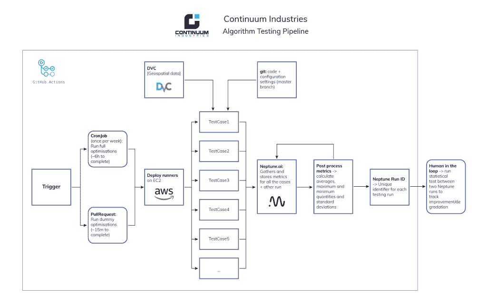
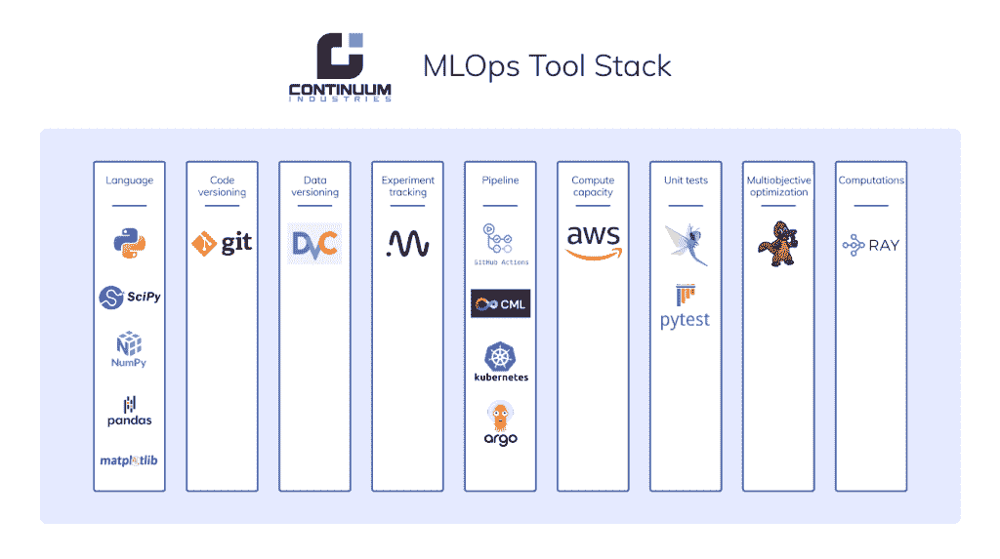

# 这是我们的 MLOps 工具堆栈:连续产业

> 原文：<https://web.archive.org/web/https://neptune.ai/blog/mlops-tool-stack-continuum-industries>

[Continuum Industries](https://web.archive.org/web/20220928194708/https://www.continuum.industries/) 是一家基础设施行业的公司，希望自动化和优化线性基础设施资产的设计，如水管、架空传输线、海底电力线或电信电缆。

它的核心产品 Optioneer 允许客户输入工程设计假设和地理空间数据，并使用进化优化算法来寻找可能的解决方案，以在给定约束的情况下连接 A 点到 B 点。

“建造像电力线这样的东西是一个巨大的项目，所以你必须在开始之前获得正确的设计。你看到的设计越合理，你就能做出更好的决定。Optioneer 可以在几分钟内为您提供设计资产，而成本只是传统设计方法的一小部分。”

但是，创建和操作 Optioneer 引擎比看起来更具挑战性:

*   目标函数不代表现实；
*   有大量土木工程师事先不知道的假设；
*   不同的客户会给它提出完全不同的问题，算法需要足够健壮来处理这些问题。

与其构建完美的解决方案，不如向他们展示一系列有趣的设计选项，以便他们做出明智的决策。

作为一个工程师团队，我们利用来自机械工程、电气工程、计算物理、应用数学和软件工程的各种技能来实现这一目标。我们还使用各种工具和框架。

目前，我们的目标是开发和采用强大的 QA 流程，确保返回给最终用户的解决方案:

*   好，意味着这是一个土木工程师可以看到并同意的结果。
*   正确，意味着计算并返回给最终用户的所有不同的工程数量尽可能正确。

对我们发动机性能的持续监控和可重复测试将是这些流程的核心。

“引擎”代码是用 **Python 编写的，我们在那里使用通常的嫌疑对象:scipy、numpy、pandas 和 matplotlib** 。

我们有一组“测试问题”,算法就是针对这些问题运行的。每个测试问题都由一个配置和一个包含所需地理空间数据的相对较大的文件来定义。代码使用 **[git](https://web.archive.org/web/20220928194708/https://git-scm.com/)** 版本化，地理空间数据使用 **[DVC](https://web.archive.org/web/20220928194708/https://dvc.org/)** 版本化。

通常，当我们试图对算法进行改进时，我们从这些测试问题中的一个开始，然后用我们希望进行的任何修改来运行它。我们通常在这部分过程中使用 **[【海王星】](/web/20220928194708/https://neptune.ai/product/experiment-tracking)** ，以便[跟踪实验](/web/20220928194708/https://neptune.ai/experiment-tracking)。这使我们能够轻松回顾到目前为止我们已经尝试过的内容，并计划接下来的步骤。

一旦我们设法在那个测试问题中产生更好的结果，我们就将测试扩展到整个测试问题集。开发人员可以运行完整的测试管道(见下图)，然后将结果与主分支上的最新运行进行比较。这让我们知道在我们做出改变后，是否在我们所有的测试问题上有显著的统计改进。这条管道运行在 **[Github Actions](https://web.archive.org/web/20220928194708/https://docs.github.com/en/actions)** 上，并使用一个名为 [**CML**](https://web.archive.org/web/20220928194708/https://cml.dev/) 的工具来部署 **[EC2](https://web.archive.org/web/20220928194708/https://aws.amazon.com/ec2/?ec2-whats-new.sort-by=item.additionalFields.postDateTime&ec2-whats-new.sort-order=desc)** 实例。

***Continuum Industries MLOps pipeline | Click to enlarge the image***

如果我们对结果满意，我们就开始“生产”我们写的任何代码:我们清理它，写单元测试，等等。对于单元测试，我们使用 **[pytest](https://web.archive.org/web/20220928194708/https://docs.pytest.org/en/6.2.x/)** 和 [**假设**](https://web.archive.org/web/20220928194708/https://hypothesis.readthedocs.io/en/latest/) 。后者是 python 单元测试的一个聪明的数据生成器，通常允许我们找到破坏代码的边缘情况并处理它们。

对于算法本身，我们使用的是 python 中 **[鸭嘴兽](https://web.archive.org/web/20220928194708/https://platypus.readthedocs.io/en/latest/)** 库的大幅修改版本。我们进行了广泛的修改，以实现更好的并行计算，并更好地适应我们的总体用例。

最后，我们使用 **[射线](https://web.archive.org/web/20220928194708/https://ray.io/)** 来并行计算。我们发现它比 python 中的多处理模块要快得多，并且它有可能轻松地跨多台机器进行水平伸缩(尽管我们还没有利用这一功能)。

对于我们的云，我们也使用 **[Kubernetes](https://web.archive.org/web/20220928194708/https://kubernetes.io/)** ，以及 **[Argo](https://web.archive.org/web/20220928194708/https://argoproj.github.io/)** 工作流。

***Continuum Industries tool stack | Click to enlarge the image***

## 我们喜欢当前设置的什么

*   整个测试管道都经过每个 PR 的单元测试，这意味着它运行可靠，不会在我们身上失败。
*   所有相关数据都记录在一个地方:git 版本、多次运行的度量、配置数据等。
*   通过 CUSTOM_RUN_ID 功能，我们可以在 CI/CD 管道的不同阶段轻松处理和聚合数据，然后更新相关的运行。
*   Neptune 的 UI 相当光滑，它使得跟踪、标记和管理跑步非常容易。
*   由于一切都是版本化的(用 git 编码，通过 DVC 的地理空间数据)，可重复性更容易实现。

## 我们不喜欢当前的设置

*   我们的 runners 是 spot 实例，因此它们被 AWS 杀死的频率比我们希望的要高，这意味着我们需要重启管道。
*   因为完整的管道需要几个小时来运行，并且因为我们的 CI/CD 的其余部分是如何设置的，所以它不部署任何东西。更确切地说，它是一个“健全检查”,看看我们是否在上周破坏了什么。理想情况下，我们希望将结果的批准与新版本算法的部署联系起来。
*   该过程的最后一步仍然是手动的。一个人必须进入并运行一个脚本，从两次运行中下载数据，并在它们之间执行统计比较，以便告诉我们哪一次更好。因为它是手动的，它不是真正的管道的一部分，因此信息没有存储在 Neptune 中，这是一个遗憾。

### 安德烈亚斯·马莱科斯

首席科学家@Continuum Industries

* * *

**阅读下一篇**

## 最佳 MLOps 工具以及如何评估它们

12 分钟阅读| Jakub Czakon |年 8 月 25 日更新

在我们的一篇文章中——[机器学习团队实际使用的最好的工具、库、框架和方法——我们从 41 家 ML 初创公司学到的东西](https://web.archive.org/web/20220928194708/https://neptune.ai/blog/tools-libraries-frameworks-methodologies-ml-startups-roundup)——Acerta 的 CTO Jean-Christophe Petkovich 解释了他们的 ML 团队如何接近 MLOps。

**据他所说，一个完整的 MLOps 系统有几个要素:**

*   您需要能够构建包含预处理数据和生成结果所需的所有信息的模型工件。
*   一旦您能够构建模型工件，您必须能够跟踪构建它们的代码，以及它们被训练和测试的数据。
*   您需要跟踪所有这三样东西，模型、它们的代码和它们的数据，是如何关联的。
*   一旦您可以跟踪所有这些内容，您还可以将它们标记为准备就绪，进行生产，并通过 CI/CD 流程运行它们。
*   最后，为了在该过程的最后实际部署它们，您需要某种方法来基于该模型工件旋转服务。

这是对如何在公司中成功实施 MLOps 的高度概括。但是理解高层需要什么只是拼图的一部分。另一个是采用或创建适当的工具来完成工作。

这就是为什么我们编制了一份**最佳 MLOps 工具**的清单。我们将它们分为六类，以便您可以为您的团队和业务选择合适的工具。让我们开始吧！

[Continue reading ->](/web/20220928194708/https://neptune.ai/blog/best-mlops-tools)

* * *