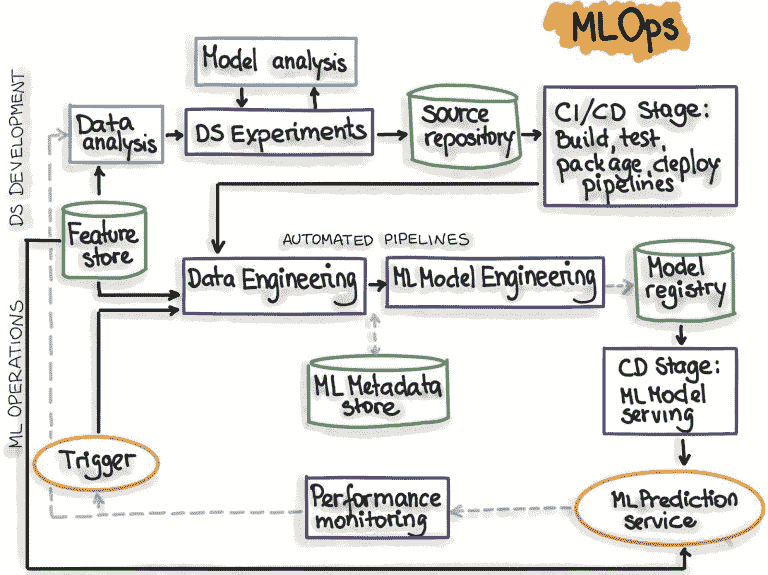

# NLP 项目的 MLOps 工具

> 原文：<https://web.archive.org/web/https://neptune.ai/blog/mlops-tools-for-nlp-projects>

聊天机器人、总结应用、Siri、Alexa——这些只是一些已经被大规模采用的很酷的自然语言处理(T2)项目。你有没有想过它们是如何管理、持续改进和维护的？这正是我们在本文中要回答的问题。

例如，[谷歌的自动更正](https://web.archive.org/web/20221206052610/https://cloud.google.com/blog/products/g-suite/everyday-ai-beyond-spell-check-how-google-docs-is-smart-enough-to-correct-grammar)每次都变得更好，但不是因为他们想出了一个不需要任何维护的超级好的模型。每次都变得更好，因为有一个管道，在早期通过在获得新数据时反复执行所有 ML 任务来自动化和改进模型。这是 MLOps 最好的例子。

在本文中，我将告诉您可以用于 NLP 项目的各种 [MLOps](/web/20221206052610/https://neptune.ai/blog/mlops-what-it-is-why-it-matters-and-how-to-implement-it-from-a-data-scientist-perspective) 工具。这包括很酷的开源平台，以及一些帮助您入门的代码。我还将对所有工具进行比较，以帮助您导航并为您想要使用的任何框架选择最佳工具。

以下是我们将要讨论的内容:

以下是我写这篇文章时所做的假设，只是为了让我们达成共识:

*   你知道什么是 NLP。你不需要知道很多，只要知道一点基本的和一些流程就够了。
*   您熟悉构建机器学习项目的过程。还是那句话，不需要知道太多。你之前至少应该建立一个机器学习项目，这样你就知道我将使用的术语。
*   你思想开放，乐于学习！

如果您是 MLOps 专家，您可以跳过介绍，直接使用工具。

## 什么是 MLOps？

数据会随着时间的推移而变化，这使得机器学习模型变得陈旧。ML 模型学习数据中的模式，但是这些模式随着趋势和行为的改变而改变。

我们不能阻止数据总是变化，但是我们可以让我们的模型随着新的趋势和变化而更新。为此，我们需要一个自动化的管道。这个自动化过程被称为 **MLOps** 。

MLOps 是数据科学家和运营专业人员之间进行协作和沟通的一套实践。

请注意 *MLOps 还没有完全自动化，至少*还没有。你还是要手动做一些事情，但是比起完全没有工作流来说，要轻松无比。

### MLOps 是如何工作的？

**MLOps，**即机器学习运算，与 DevOps 不同。

DevOps 是开发和操作大型软件系统的一种流行实践。它在软件系统开发中有两个概念:

典型的 DevOps 周期是:

*   代码，
*   测试，
*   部署，
*   监视器。

在 ML 项目中，有许多其他过程，如数据收集和处理、特征工程、培训和评估 ML 模型，DevOps 无法处理所有这些。

在 MLOps 中，您有:

*   进入系统的数据通常是条目，
*   预处理数据和选择有用特征的代码，
*   训练模型和评估模型的代码，
*   测试和验证它的代码，
*   要部署的代码，
*   诸如此类。

要将您的模型部署到生产中，您需要通过 CI/CD 管道来推动它。

一旦投入生产:

*   你需要经常检查性能，确保它是可靠的，
*   您需要一个自动警报或触发系统来通知您问题，并确保这些更改解决了出现的问题。

[](https://web.archive.org/web/20221206052610/https://i0.wp.com/neptune.ai/wp-content/uploads/2022/10/MLOps-automated-pipeline.jpg?ssl=1)

*MLOps automated pipeline | [Source](https://web.archive.org/web/20221206052610/https://ml-ops.org/content/mlops-principles)*

## 我们为什么需要 MLOps？

无论您尝试部署哪种解决方案，MLOps 都是项目成功的基础。

MLOps 不仅有助于协作和将 ML 集成到技术中，它还帮助数据科学家做他们最擅长的事情，开发模型。MLOps 自动执行由数据科学家手动完成的再培训、测试和部署。

机器学习有助于部署解决方案，通过创建更高效的工作流、利用数据分析进行决策和改善客户体验来释放以前未开发的收入来源、节省时间和降低成本。如果没有像 MLOps 这样的坚实框架，这些目标很难实现。

为您的 NLP 项目选择合适的 MLOps 工具取决于您的解决方案的工具。

您的选择取决于您的项目需求、成熟度和部署规模。你的项目必须结构合理( [Cookie Cutter](https://web.archive.org/web/20221206052610/https://drivendata.github.io/cookiecutter-data-science/) 是一个很好的项目结构工具，可以帮助你做到这一点)。

Verta 的创始人兼首席执行官 Manasi Vartak，[指出了您在选择任何 MLOps 工具之前应该问自己的一些问题](https://web.archive.org/web/20221206052610/https://blog.verta.ai/blog/ml-infrastructure-build-vs-buy-vs-open-source):

*   它应该对数据科学家友好，而不是限制您的数据科学团队使用特定的工具和框架。
*   它应该易于安装，易于设置，易于定制。
*   它应该可以与您现有的平台自由集成。
*   它应该能够重现结果；无论您是与团队成员合作，调试产品故障，还是迭代现有模型，再现性都是至关重要的。
*   它应该具有良好的伸缩性；选择一个能够满足您当前需求的平台，该平台可以针对实时和批处理工作负载进行扩展以满足未来需求，支持高吞吐量场景，随着流量的增加而自动扩展，并具有简单的成本管理和安全的部署和发布实践。

## NLP 项目的最佳开源 MLOps 工具

每个 MLOps 工具都有自己的工具。下面列出的开源平台是特定于 NLP 项目的，并根据它们拥有的 Github 星级数进行评级。一些商业化的平台专门用于 NLP 项目，但是其他的通常可以用于任何 ML 项目。

### [适配 NLP](https://web.archive.org/web/20221206052610/https://novetta.github.io/adaptnlp/#AdaptNLP-Install) (329 Github stars)

它是一个高级框架和库，用于运行、培训和部署最先进的自然语言处理(NLP)模型，以执行端到端任务。它建立在 Zalando Research 的天赋和拥抱脸的变形金刚库之上。

AdaptNLP 为机器学习研究人员和科学家提供了一种模块化和**自适应**的方法来完成各种 NLP 任务，并提供了一种**简单** API 来训练、推理和部署基于 NLP 的微服务。您可以使用 Fast-api 在本地或使用 docker 部署 Adapt-NLP 模型。

**AdaptNLP 特性:**

*   该 API 针对具有 SOTA 预训练模型的 NLP 任务进行了统一。您可以将它与 Flair 和 Transformer 模型一起使用。
*   提供用于训练和微调模型的界面。
*   使用 FastAPI 框架轻松即时地部署您的 NLP 模型。
*   您可以使用 Docker 在 GPU 上轻松构建和运行 AdaptNLP 容器。

**Linux/Mac 的安装要求:**

我建议您将它安装在新的虚拟环境中，以防止依赖性集群问题。如果您安装了 Python 3.7 版，您需要安装 Pytorch 的最新稳定版本(1.7 版)，如果您安装了 Python 3.6 版，您需要将 Pytorch 降级到< =1.6 版。

【Windows 的安装要求:

如果你还没有安装 Pytorch，你必须从 Pytorch 手动安装。

**使用画中画**，

```py
pip install adaptnlp
```

或者如果你想为发展做贡献，

```py
pip install adaptnlp[dev]
```

[教程 :](https://web.archive.org/web/20221206052610/https://novetta.github.io/adaptnlp/tutorial-intro)

### [auto gulon](https://web.archive.org/web/20221206052610/https://github.com/awslabs/autogluon)(3.5k Github stars)

自动登录是简单的文本，图像和表格数据的自动标记。它使您能够轻松地将 AutoML 扩展到深度学习、堆栈组装和其他现实世界的应用程序等领域。它自动执行机器学习任务，并在您的应用中为您的模型提供强大的预测性能。

只需几行代码，就可以在文本、图像和表格数据上训练和部署高精度的机器学习和深度学习模型。目前，它只为 Linux 和 MacOS 用户提供支持。

**自动登录功能:**

*   只需几行代码，就可以创建深度学习和 ML 解决方案的快速原型。
*   无需专业知识，自动使用最先进的技术。
*   您可以自动执行数据预处理、工具搜索、模型选择/集成和超参数调整。
*   AutoGulon 完全可以根据您的使用情况进行定制。

**安装:**

它要求您拥有 Python 3.6、3.7 或 3.8。目前只支持 Linux 和 MacOS。根据您的系统，您可以下载 CPU 版本或 GPU 版本。

**使用画中画**:

**对于 MacOS** :

```py
python3 -m pip install -U pip
python3 -m pip install -U setuptools wheel
python3 -m pip install -U "mxnet<2.0.0"
python3 -m pip install autogluon

```

目前不可用

**对于 Linux** :

```py
python3 -m pip install -U pip
python3 -m pip install -U setuptools wheel
python3 -m pip install -U "mxnet<2.0.0"
python3 -m pip install autogluon

```

```py
python3 -m pip install -U pip
python3 -m pip install -U setuptools wheel

python3 -m pip install -U "mxnet_cu101<2.0.0"
python3 -m pip install autogluon

```

教程:

### [gluonlp](https://web.archive.org/web/20221206052610/https://github.com/dmlc/gluon-nlp)(2.3k github stars)

它是一个支持 NLP 过程的框架，比如加载文本数据、预处理文本数据和训练 NLP 模型。Linux 和 MACOS 上都有。您也可以将其他形式的 NLP 模型转换成 GulonNLP。您可以转换的此类模型的几个[示例](https://web.archive.org/web/20221206052610/https://nlp.gluon.ai/master/model_zoo/conversion_toolkits/index.html)包括 BERT、ALBERT、ELECTRA、MobileBERT、RoBERTa、XLM-R、BART、GPT-2 和 T5。

**GulonNLP 特性:**

*   易于使用的文本处理工具和模块化 API
*   预训练模型动物园
*   用 Numpy 之类的 API 编写模型
*   通过 [Apache TVM](https://web.archive.org/web/20221206052610/https://tvm.apache.org/) 进行快速推理(孵化)(实验)
*   AWS 与 [SageMaker](https://web.archive.org/web/20221206052610/https://aws.amazon.com/sagemaker/) 的集成

[**安装**](https://web.archive.org/web/20221206052610/https://nlp.gluon.ai/master/index.html) :

在开始安装之前，请确保您的系统上有 MXNet 2 版本。以防万一，你可以从你的终端安装它。从以下选项中选择一个:

```py
python3 -m pip install -U --pre "mxnet-cu102>=2.0.0a"

python3 -m pip install -U --pre "mxnet-cu110>=2.0.0a"

python3 -m pip install -U --pre "mxnet>=2.0.0a"

```

现在，您可以继续安装 GulonNLP 了。打开您的终端并键入:

```py
python3 -m pip install -U -e
```

您也可以通过键入以下命令来安装所有额外的要求:

```py
python3 -m pip install -U -e ."[extras]"
```

如果您在安装过程中遇到任何与用户权限相关的问题，请参考本[指南](https://web.archive.org/web/20221206052610/https://github.com/dmlc/gluon-nlp)。

教程:

### [喀什噶尔](https://web.archive.org/web/20221206052610/https://github.com/BrikerMan/Kashgari) (2.1k github 星星)

强大的 NLP 迁移学习框架，可用于在 5 分钟内为命名实体识别(NER)、词性标注(POS)和模型分类构建最先进的模型。初学者、学者和研究人员都可以使用它。

**喀什特点:**

*   易于定制、有据可查且简单明了。
*   Kashgari 允许您在自然语言处理项目中使用最先进的模型。
*   它允许您构建多标签分类模型，创建定制模型，等等。点击了解更多
*   允许你调整你的模型的超参数，使用定制的优化器和回调，创建定制的模型，和[其他的](https://web.archive.org/web/20221206052610/https://kashgari.readthedocs.io/en/v2.0.1/tutorial/text-labeling/)。
*   Kashgari 有内置的预训练模型，这使得迁移学习非常容易。
*   Kashagri 简单、快速且可扩展
*   您可以导出您的模型，并使用 tensorflow 服务将它们直接部署到云中。

**安装**

Kashgari 要求您在系统上安装 Python 3.6+版本。

**使用画中画**

```py
pip install 'kashgari>=2.0.0
```

```py
pip install 'kashgari>=2.0.0
```

```py
pip install 'kashgari<1.0.0
```

**教程:**

### [LexNLP](https://web.archive.org/web/20221206052610/https://awesomeopensource.com/project/LexPredict/lexpredict-lexnlp) (460 颗 Github 星星)

由 LexPredict 开发的 LexNLP 是一个 Python 库，用于处理真实的非结构化法律文本，包括合同、政策、程序和其他类型的材料、分类器和条款类型、用于构建新的聚类和分类方法的工具、真实法律文档的数百个单元测试。

**特性:**

*   它提供了预训练的模型，用于分段、单词嵌入和主题模型，以及用于文档和子句类型的分类器。
*   事实提取。
*   构建新的聚类和分类方法的工具。

**安装:**

要求您已经安装了 Python 3.6

```py
pip install lexnlp

```

**教程:**

TensorFlow Text 提供了一组与文本相关的类和操作，可用于 TensorFlow 2.0。该库可以执行基于文本的模型所需的常规预处理，并包括 core TensorFlow 未提供的对序列建模有用的其他功能。

在文本预处理中使用这些操作的好处是它们是在张量流图中完成的。您不需要担心训练中的标记化与推理中的标记化不同，或者管理预处理脚本。

**Tensorflow 文本特征:**

*   为处理文本提供了一个大型工具包
*   允许与大量 Tensorflow 工具集成，以支持从问题定义到培训、评估和启动的项目
*   降低服务时间的复杂性并防止培训-服务偏差

**安装:**

**使用画中画**

请注意:*使用 pip install 安装 TF Text 时，请注意您正在运行的 TensorFlow 的版本，因为您应该指定 TF Text 的相应次要版本(例如，对于 tensorflow==2.3.x，请使用 tensorflow_text==2.3.x)* 。

```py
pip install -U tensorflow-text==<version>

```

**从源安装**

请注意 *TF Text 需要在与 TensorFlow 相同的环境下构建。因此，如果您手工构建 TF 文本，强烈建议您也构建 TensorFlow* 。

如果在 MacOS 上构建，*您必须安装 coreutils* 。自制可能是最容易做到的。

构建并安装 TensorFlow。

*   克隆 TF 文本 repo: git 克隆[https://github.com/tensorflow/text.git](https://web.archive.org/web/20221206052610/https://github.com/tensorflow/text.git)
*   运行构建脚本来创建 pip 包:。/oss_scripts/run_build.sh 这一步之后，应该会有一个*。当前目录中的 whl 文件。文件名类似 tensor flow _ text-2 . 5 . 0 rc0-cp38-cp38-Linux _ x86 _ 64 . whl。
*   将软件包安装到环境:pip install。/tensor flow _ text-*-*-*-OS _ platform . whl

**教程:**

文本预处理

文本分类

文本生成

### [通气管](https://web.archive.org/web/20221206052610/https://snorkel.readthedocs.io/en/v0.9.7/) (4.7k GitHub stars)

数据标记工具，您可以以编程方式标记、构建和管理培训数据。通气管管道的第一组件包括标记函数，其被设计为弱启发式函数，在给定未标记数据的情况下预测标记。

特点:

*   它支持 Tensorflow/Keras、Pytorch、Spark、Dask 和 Scikit-Learn。
*   它提供了用于标记、分析、预处理、切片、映射、实用程序和分类的 API。

**安装:**

通气管需要 Python 3.6 或更高版本。

**使用画中画(推荐)**

```py
pip install snorkel

```

**使用康达**

```py
conda install snorkel -c conda-forge

```

请注意:如果你使用的是 Windows，强烈推荐使用 Docker ( [教程示例](https://web.archive.org/web/20221206052610/https://github.com/snorkel-team/snorkel-tutorials/blob/master/Dockerfile))或 [Linux 子系统](https://web.archive.org/web/20221206052610/https://docs.microsoft.com/en-us/windows/wsl/faq)。

**教程:**

Lingvo 是一个在 Tensorflow 中构建神经网络的框架，尤其是序列模型。

**tensorlow lingvo 特征:**

*   Lingvo 支持自然语言处理(NLP)任务，但它也适用于用于图像分割和点云分类等任务的模型。
*   Lingvo 可用于训练“生产规模”数据集。
*   Lingvo 为同步和异步分布式训练提供了额外的支持。
*   量化支持已经直接内置到 Lingvo 框架中。

**安装:**

**使用画中画**:

```py
pip3 install lingvo

```

**从源安装**:

检查您是否满足以下先决条件

*   系统上安装的 TensorFlow 2.5
*   C++编译器(官方仅支持 g++ 7.3)
*   巴泽尔建筑系统。

参考 [docker/dev.dockerfile](https://web.archive.org/web/20221206052610/https://github.com/tensorflow/lingvo/blob/master/docker/dev.dockerfile) 了解一组工作要求。

现在，git 克隆存储库，然后使用 bazel 直接构建和运行目标。codelab 中的 python -m 模块命令需要映射到 bazel run 命令上。

**使用 docker** :

Docker 配置可用于这两种情况。可以在每个文件顶部的注释中找到说明。

[lib.dockerfile](https://web.archive.org/web/20221206052610/https://github.com/tensorflow/lingvo/blob/master/docker/lib.dockerfile) 预装了 Lingvo pip 包。

[dev.dockerfile](https://web.archive.org/web/20221206052610/https://github.com/tensorflow/lingvo/blob/master/docker/dev.dockerfile) 可用于从源代码构建 Lingvo。

**教程:**

### [空间](https://web.archive.org/web/20221206052610/https://github.com/explosion/spaCy) (21k Github stars)

spaCy 是 Python 和 Cython 中的高级自然语言处理库。它建立在最新的研究基础上，从第一天起就被设计用于真实的产品。

spaCy 带有预训练的管道，目前支持 60 多种语言的标记化和训练。它具有最先进的速度和神经网络模型，用于标记、解析、命名实体识别、文本分类等，多任务学习，具有像 [BERT](/web/20221206052610/https://neptune.ai/blog/bert-and-the-transformer-architecture-reshaping-the-ai-landscape) 这样预先训练的转换器，以及生产就绪的培训系统和简单的模型打包、部署和工作流管理。

**特性:**

*   支持 PyTorch、TensorFlow 和其他框架中的定制模型。
*   支持 60 多种语言。
*   支持预先训练的单词向量和嵌入。
*   简单的模型打包、部署和工作流管理。
*   语言驱动的标记化。

**安装:**

它支持 macOS / OS X、Linux 和 Windows (Cygwin、MinGW、Visual Studio)。您还需要在系统上安装 Python 3.6+版本(仅 64 位)。

**使用画中画**

在继续安装之前，请确保您的 pip、setuptools 和 wheel 是最新的。

```py
pip install -U pip setuptools wheel
pip install spacy

```

**使用康达**

```py
conda install -c conda-forge spacy
```

**教程:**

## [天赋](https://web.archive.org/web/20221206052610/https://github.com/flairNLP/flair) (11k GitHub 明星)

Flair 是最先进的 NLP 的简单框架。它允许您使用最先进的模型来完成 NLP 任务，如命名实体识别(NER)、词性标注(POS)、词义消歧和分类。它为[生物医学数据](https://web.archive.org/web/20221206052610/https://github.com/flairNLP/flair/blob/master/resources/docs/HUNFLAIR.md)提供了特殊的支持，也支持数量迅速增长的语言。

**天赋特性:**

*   它完全建立在 Pytorch 上，因此您可以轻松地构建和训练您的天赋模型。
*   最先进的自然语言处理模型，可以用于你的文本。
*   允许你用简单的接口组合不同的单词和文档嵌入。

**安装:**

它要求你有 Pytorch 1.5+，目前支持 Python 3.6。[下面是如何为 Ubuntu 16.04](https://web.archive.org/web/20221206052610/https://vsupalov.com/developing-with-python3-6-on-ubuntu-16-04/) 。

```py
pip install flair

```

**教程:**

### 适用于您的 NLP 项目的开源 MLOps 工具–比较

|  | Github stars | Windows 操作系统 | Linux 操作系统 | 马科斯 | Tensorflow | Pytorcht | 其他框架 | 数据标记 | 数据预处理 | 模型开发 | 模型部署 |
| --- | --- | --- | --- | --- | --- | --- | --- | --- | --- | --- | --- |
|  | **329** |  |  |  |  |  |  |  |  |  |  |
|  | **11k** |  |  |  |  |  |  |  |  |  |  |
|  | **21k** |  |  |  |  |  |  |  |  |  |  |
|  | **2.3k** |  |  |  |  |  |  |  |  |  |  |
|  | **4.7k** |  |  |  |  |  |  |  |  |  |  |
|  | **770** |  |  |  |  |  |  |  |  |  |  |
|  | **第 460 章** |  |  |  |  |  |  |  |  |  |  |
|  | **2.1k** |  |  |  |  |  |  |  |  |  |  |
|  | **2.3k** |  |  |  |  |  |  |  |  |  |  |
|  | **3.5k** |  |  |  |  |  |  |  |  |  |  |

## NLP 项目的最佳 MLOps 即服务工具

Neuro MLOps platform 为您提供成功的大规模 ML 开发所需的基础设施和流程的完整解决方案和管理。它提供完整的 MLOps 生命周期，包括数据收集、模型开发、模型培训、[实验跟踪](/web/20221206052610/https://neptune.ai/experiment-tracking)、部署和监控。Neu.ro 为成功的大规模 ML 开发提供基础设施和流程的管理。

**设置**

装置

建议首先创建一个新的虚拟环境。它要求您安装 Python 3.7。

```py
pip install -U neuromation

```

或者

```py
<pre class="hljs" style="display: block; overflow-x: auto; padding: 0.5em; color: rgb(51, 51, 51); background: rgb(248, 248, 248);">pip install -U neuromation
</pre>
```

**如何:**

*   在 neu.ro 注册
*   使用 webUI 或 CLI 上传数据
*   设置开发环境(允许您使用 GPU)
*   训练模型或下载预训练模型
*   运行笔记本(Jupyter)

看看这本 [ML 食谱](https://web.archive.org/web/20221206052610/https://github.com/neuro-inc/cookbook)来帮助你开始一个 NLP 项目。

AutoNLP 提供了一种自动训练最先进的 NLP 模型的方法，与拥抱脸生态系统无缝集成，并自动将其部署在可扩展的环境中。这是一种为不同任务训练、评估和部署最先进的 NLP 模型的自动化方式。它会根据您提供的数据集自动调整部署的工作模型。

**设置**

安装:

要使用画中画:

```py
pip install -U autonlp

```

请注意:您需要安装 git lfs 来使用 cli

**如何:**

*   登录您的帐户
*   创建新模型
*   上传数据集
*   训练你的自动模型
*   跟踪模型进度
*   做预测
*   部署您的模型

查看 [AutoNLP 文档](https://web.archive.org/web/20221206052610/https://huggingface.co/docs/autonlp/)了解您的具体使用案例。

Neptune 跟踪机器学习实验，存储您的模型的元数据(日志度量、性能图表、视频、音频、文本、记录数据探索)，提供一个模型注册表，您可以在其中版本化、存储并让您随时查询您的模型，并为您的团队提供一种有效的协作方式。Neptune 允许您定制 UI 并管理本地环境或云环境中的用户。

**设置**

装置

```py
pip install neptune-client
```

如何记录您的项目元数据，

*   创建一个海王星账户
*   在海王星上创建一个新项目

在代码编辑器中，

*   用您的 api 令牌初始化一次运行，并记录您想要的模型元数据。
*   运行您的代码，您在 Neptune 上的项目将自动更新！

查看 Neptune [文档](https://web.archive.org/web/20221206052610/https://docs.neptune.ai/),探索更多内容，无风险运行您的实验！

DataRobot 现在已经收购了 Algorithmia，它是一个平台，可以大规模地自动化构建、部署和维护机器学习(ML)和人工智能(AI)的端到端流程。它是一个无代码的应用构建器，是一个您可以在生产中部署、监控、管理和治理所有模型的平台，无论它们是如何创建的，何时何地部署的。

**设置**

[安装](https://web.archive.org/web/20221206052610/https://github.com/datarobot-community/quickstart-guide)

*   它目前支持 python 2.7 和> =3.4

```py
pip3 install datarobot

```

```py
pip3 install requests requests-toolbelt

```

**如何创建新项目:**

*   登录您的帐户
*   安装依赖项
*   加载并分析您的数据
*   开始建模
*   审查和解释模型
*   部署模型
*   选择应用程序

查看此[文档](https://web.archive.org/web/20221206052610/https://community.datarobot.com/t5/knowledge-base/automated-machine-learning-automl-walkthrough/ta-p/4825)了解如何使用这些步骤的正确演练。

它有助于您简化和实施生产机器学习模型的工具最佳实践。它是一个可扩展的框架，为 AWS ML 服务和第三方服务提供管理 ML 管道的标准接口。解决方案模板允许您上传训练好的模型，配置管道的编排，并监控管道操作。它允许您利用预先配置的 ML 管道，还可以自动部署带有推理端点的训练模型。

**如何设置新项目:**

*   登录您的 AWS 帐户
*   创建新的 pagemaker 工作室
*   创建新项目
*   选择所需的 MLOps 架构(开发、评估或部署)。
*   将数据添加到 AWS S3 时段
*   创建管道和培训文件。

查看此[文档](https://web.archive.org/web/20221206052610/https://docs.aws.amazon.com/sagemaker/latest/dg/sagemaker-projects-walkthrough.html)了解如何建立一个新项目。你也可以看看这篇关于如何创建一个简单项目的[教程](https://web.archive.org/web/20221206052610/https://towardsdatascience.com/a-practical-guide-to-mlops-in-aws-sagemaker-part-i-1d28003f565)。

Azure MLOps 允许您通过端到端的沿袭跟踪来试验、开发和将模型部署到生产中。它允许您创建可复制的 ML 管道，可重用的软件环境，从任何地方部署模型，管理 ML 生命周期，并密切监视生产中的模型的任何问题。它允许您使用管道自动化端到端的 ML 生命周期，这允许您更新模型、测试新模型，并持续部署新的 ML 模型。

**设置**

装置

你需要安装 [Azure CLI](https://web.archive.org/web/20221206052610/https://docs.microsoft.com/en-us/cli/azure/install-azure-cli)

**如何:**

*   登录到 [Azure devops](https://web.archive.org/web/20221206052610/http://dev.azure.com/)
*   创建新项目
*   导入项目存储库
*   设置项目环境
*   创建管道
*   培训和部署模型
*   设置持续集成管道

查看此[文档](https://web.archive.org/web/20221206052610/https://benalexkeen.com/creating-end-to-end-mlops-pipelines-using-azure-ml-and-azure-pipelines-part-7/)了解如何进行这些流程

Vertex AI 是一个机器学习平台，你可以在一个地方访问所有的谷歌云服务，以部署和维护 AI 模型。它将构建 ML 的 Google 云服务整合在一个统一的 UI 和 API 下。您可以使用 Vertex AI 通过 AutoML 或您的自定义代码轻松训练和比较模型，并将所有模型存储在一个中央模型库中。

**设置**

装置

你可以使用谷歌云控制台和云外壳，或者在你的系统中安装 T2 云软件开发工具包。

**如何创建新项目(使用云壳):**

*   登录您的[账户](https://web.archive.org/web/20221206052610/https://console.cloud.google.com/freetrial)
*   创建新项目(确保为您的帐户启用了计费)
*   激活云壳
*   创建一个存储桶
*   训练你的模型
*   部署到谷歌云

查看此[文档](https://web.archive.org/web/20221206052610/https://cloud.google.com/vertex-ai/docs/tutorials)以获得如何遵循这些步骤的演练。

### NLP 项目的 MLOps 即服务工具—比较

|  | 数据收集和管理 | 数据准备和特征工程 | 模型培训和部署 | 模型监控和实验跟踪 | ML 元数据存储 | 模型注册和管理 |
| --- | --- | --- | --- | --- | --- | --- |
|  |  |  |  |  |  |  |
|  |  |  |  |  |  |  |
|  |  |  |  |  |  |  |
|  |  |  |  |  |  |  |
|  |  |  |  |  |  |  |
|  |  |  |  |  |  |  |
|  |  |  |  |  |  |  |

结论

## 我已经谈到了为什么您需要 MLOps，以及如何为您的项目选择一个好的工具。我还列出了一些 NLP MLOps 工具，并强调了一些很酷的特性。不确定要试用哪种工具？查看我做的对照表，看看哪个最适合你的项目。我希望你尝试一些列出的工具，并让我知道你的想法。感谢阅读！

附加参考

## Additional references