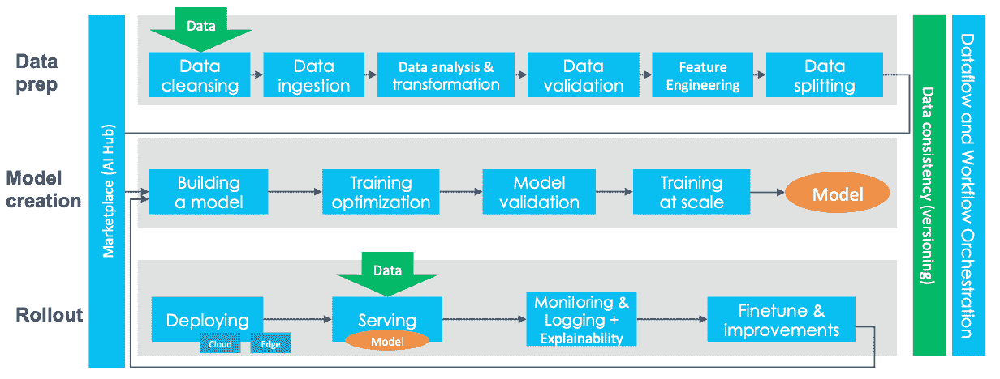

# MLOps:它是什么，为什么重要，以及如何实施

> 原文：<https://web.archive.org/web/https://neptune.ai/blog/mlops>

这是什么东西？

这是我脑海中的问题，但直到最近(我在 2020 年末写这篇文章)，我只在大型人工智能会议上听说过几次 MLOps，我在多年来阅读的论文中看到一些提及，但我不知道任何具体的东西。

有趣的是，大约在同一时间，我和一位在非洲莫桑比克工作的数据挖掘专家朋友进行了一次谈话。最近，他们开始创建自己的内部 ML 管道，巧合的是，我在对 MLOps 的神秘领域进行研究以将所有东西放在一个地方的同时，也开始写这篇文章。

在这一转变中，我了解到了传统公司(以及许多从事商业 ML 的科技公司)面临的许多棘手问题:

*   向云迁移；
*   创建和管理 ML 管道；
*   缩放；
*   大规模处理敏感数据；
*   以及无数其他问题。

因此，我把深入研究、进行广泛研究和尽可能多地学习作为我的职责，同时写下我自己的笔记和想法。

结果就是这篇文章。

但是为什么现在要研究这个话题呢？

据 [techjury](https://web.archive.org/web/20230309122215/https://techjury.net/blog/how-much-data-is-created-every-day/#gref) 报道，2020 年，每个人每秒至少创建 1.7 MB 的数据。对于像你我这样的数据科学家来说，这就像是提前过圣诞节，因为有太多的理论/想法需要探索、实验，有太多的发现和模型需要开发。

但是，如果我们想要认真对待，并让这些模型真正触及现实生活中的业务问题和真实的人，我们必须处理一些基本问题，如:

*   获取和清理大量数据；
*   为实验和模型训练运行设置跟踪和版本控制；
*   为投入生产的模型建立部署和监控管道。

我们需要找到一种方法来扩展我们的 ML 操作，以满足我们的 ML 模型的业务和/或用户的需求。

在过去，当我们需要扩展传统的软件系统以便更多的人可以使用它们时，也存在类似的问题。DevOps 的解决方案是一套开发、测试、部署和操作大规模软件系统的实践。有了 DevOps，开发周期变得更短，部署速度加快，系统发布变得可审计和可靠。

这就把我们带到了 **MLOps** 。它诞生于 **DevOps** 、**数据工程、**、**机器学习**的交汇点，与 DevOps **、**是类似的概念但执行不同。ML 系统本质上是实验性的，并且有更多的组件，这些组件的构建和操作要复杂得多。

让我们开始吧！

## 什么是 MLOps？

**MLOps** (机器学习运营)是数据科学家和运营专业人员之间协作和沟通的一套实践。应用这些实践可以提高质量，简化管理流程，并在大规模生产环境中自动部署机器学习和深度学习模型。更容易将模型与业务需求以及法规要求结合起来。

MLOps 正在慢慢发展成为 ML 生命周期管理的独立方法。它适用于整个生命周期——数据收集、模型创建(软件开发生命周期、持续集成/持续交付)、编排、部署、健康、诊断、治理和业务指标。

MLOps 的关键阶段是:

*   数据采集
*   数据分析
*   数据转换/准备
*   模型培训和开发
*   模型验证
*   模型服务
*   模型监控
*   模特再培训。

### DevOps 与 MLOps

DevOps 和 MLOps 有着基本的相似之处，因为 [MLOps 原则](https://web.archive.org/web/20230309122215/https://neptune.ai/blog/mlops-principles)源自 DevOps 原则。但是它们在执行上有很大的不同:

1.  与 DevOps 不同， **MLOps 本质上更具实验性**。数据科学家和 ML/DL 工程师必须调整各种功能——超参数、参数和模型——同时还要跟踪和管理数据和代码库，以获得可重复的结果。*除了所有的努力和工具，ML/DL 行业仍然在与实验的可重复性作斗争。这个主题超出了本文的范围，所以要了解更多信息，请查看参考资料最后的再现性小节。*

2.  混合团队的组成:在产品中构建和部署模型所需的团队不会只由软件工程师组成。在 ML 项目中，团队通常包括数据科学家或 ML 研究人员，他们专注于探索性数据分析、模型开发和实验。他们可能不是有经验的软件工程师，无法构建产品级的服务。

3.  **测试:**测试一个 ML 系统包括[模型验证](https://web.archive.org/web/20230309122215/https://link.medium.com/GxMQJqdQvbb)，模型训练等等——除了常规的代码测试，比如单元测试和集成测试。

4.  **自动化部署**:你不能仅仅将离线训练的 ML 模型作为预测服务来部署。您将需要一个多步骤的管道来自动重新训练和部署模型。这种管道增加了复杂性，因为您需要在部署之前自动执行数据科学家手动执行的步骤，以训练和验证新模型。

5.  **由于不断发展的数据配置文件或简单的培训服务偏差导致的系统生产性能下降**:生产中的 ML 模型可能会降低性能，这不仅是因为次优编码，还因为不断**发展的数据配置文件**。与传统的软件系统相比，模型会以更多的方式衰退，您需要为此做好计划。这可能是由以下原因造成的:

*   培训管道和服务管道中数据处理方式的差异。
*   训练和服役期间的数据变化。
*   反馈循环-当您选择错误的假设(即目标)进行优化时，这使您收集有偏差的数据来训练您的模型。然后，在不知道的情况下，你使用这个有缺陷的假设收集新的数据点，它被反馈回来重新训练/微调模型的未来版本，使模型更加偏向，雪球越滚越大。更多信息请阅读 Fastbook 关于机器学习固有的[限制的章节](https://web.archive.org/web/20230309122215/https://github.com/fastai/fastbook/blob/master/01_intro.ipynb)。

6.  **监控**:需要对生产中的模型进行监控。类似地，需要监控构建模型的数据的汇总统计，以便您可以在需要时刷新模型。这些统计数据会随着时间的推移而改变，当值偏离您的预期时，您需要通知或回滚过程。

当涉及到源代码控制的持续集成、单元测试、集成测试以及软件模块或软件包的持续交付时，MLOps 和 DevOps 是相似的。

然而，在 ML 中有一些显著的区别:

*   **持续集成** (CI)不再仅仅是测试和验证代码和组件，还包括测试和验证数据、数据模式和模型。
*   **持续部署** (CD)不再是关于一个单独的软件包或服务，而是一个系统(一个 ML 训练管道)，它应该自动部署另一个服务(模型预测服务)或从一个模型回滚变更。
*   **连续测试** (CT)是一个新的特性，是 ML 系统独有的，它涉及到自动重新训练和服务模型。

End-to-end machine learning platform | [*Source*](https://web.archive.org/web/20230309122215/https://www.kdnuggets.com/2020/07/tour-end-to-end-machine-learning-platforms.html)

### MLOps vs 实验跟踪 vs ML 模型管理

我们已经定义了什么是 MLOps，那么实验跟踪和 ML 模型管理呢？

#### 实验跟踪

[实验跟踪](/web/20230309122215/https://neptune.ai/experiment-tracking)是 MLOps 的一部分(或过程),重点是收集、组织和跟踪具有不同配置(超参数、模型大小、数据分割、参数等)的多次运行的模型训练信息。

如前所述，因为 ML/DL 本质上是实验性的，我们使用实验跟踪工具来对不同公司、团队或团队成员创建的不同模型进行基准测试。

#### 模型管理

为了确保 ML 模型是一致的，并且所有的业务需求在规模上得到满足，一个逻辑的、易于遵循的[模型管理](/web/20230309122215/https://neptune.ai/blog/machine-learning-model-management)策略是必不可少的。

MLOps 方法包括简化模型培训、打包、验证、部署和监控的流程。通过这种方式，您可以从端到端一致地运行 ML 项目。

通过为模型管理设置清晰、一致的方法，组织可以:

*   主动解决常见的业务问题(如法规遵从性)；
*   通过跟踪数据、模型、代码和模型版本，实现可复制的模型；
*   以可重复的配置打包和交付模型，以支持可重用性。

## 为什么 MLOps 很重要？

MLOps 是基础。机器学习帮助个人和企业部署解决方案，通过创建更高效的工作流、利用数据分析进行决策和改善客户体验来释放以前未开发的收入来源、节省时间和降低成本。

如果没有一个坚实的框架可以遵循，这些目标是很难实现的。借助 MLOps 实现模型开发和部署的自动化意味着更快的上市时间和更低的运营成本。它帮助管理人员和开发人员在决策时更加敏捷和更具战略性。

MLOps 作为一张地图，指导个人、小团队甚至企业实现他们的目标，而不管他们的限制是什么，敏感数据、更少的资源、小预算等等。

你决定你想要多大的地图，因为 MLOps 是实践，不是写在石头上的。您可以尝试不同的设置，只保留适合您的设置。

## MLOps 最佳实践

起初，我想只列出 10 个最佳实践，但是经过一些研究，我得出结论，最好涵盖 ML 管道的不同组件的最佳实践，即:团队、数据、目标、模型、代码和部署。

以下列表摘自参考文献中提到的各种来源:

### 组

### 数据

### 目标(指标和 KPI)

### 模型

### 密码

### 部署

这些最佳实践将作为您构建 MLOps 解决方案的基础，也就是说，我们现在可以深入实施细节了。

## 如何实现 MLOps

[根据 Google](https://web.archive.org/web/20230309122215/https://cloud.google.com/architecture/mlops-continuous-delivery-and-automation-pipelines-in-machine-learning) 的说法，有三种方法可以实现 MLOps:

*   MLOps 级别 0(手动流程)
*   MLOps 级(ML 管道自动化)
*   MLOps 二级(CI/CD 管道自动化)

### MLOps 级别 0

这对于刚刚开始 ML 的公司来说是典型的。如果您的模型很少被更改或训练，一个完全手工的 ML 工作流和数据科学家驱动的过程可能就足够了。

**特性**

*   **手动、脚本驱动、交互流程:**每一步都是手动的，包括数据分析、数据准备、模型训练、验证。它需要手动执行每个步骤，并从一个步骤手动转换到另一个步骤**。**
*   **ML 和运营之间的脱节:**该流程将创建模型的数据科学家和为模型提供预测服务的工程师分开。数据科学家将一个经过训练的模型作为工件交给工程团队部署到他们的 API 基础设施上。
*   **不频繁的发布迭代:**假设您的数据科学团队管理一些不经常更改的模型，要么更改模型实现，要么用新数据重新训练模型。新的模型版本每年只部署几次。
*   **无持续集成(CI):** 因为很少假设实现变化，所以忽略 CI。通常，测试代码是笔记本或脚本执行的一部分。
*   **无持续部署(CD):** 因为没有频繁的模型版本部署，所以不考虑 CD。
*   **部署是指预测服务**(即带有 REST API 的微服务)
*   **缺乏主动的性能监控:**流程不跟踪或记录模型预测和行动。

工程团队可能有自己复杂的 API 配置、测试和部署设置，包括安全性、回归和 load + canary 测试。

**挑战**

实际上，模型在现实世界中部署时经常会崩溃。模型无法适应环境动态的变化或描述环境的数据的变化。《福布斯》在这方面有一篇很棒的文章:[为什么机器学习模型在生产中崩溃和烧毁。](https://web.archive.org/web/20230309122215/https://www.forbes.com/sites/forbestechcouncil/2019/04/03/why-machine-learning-models-crash-and-burn-in-production/)

为了应对这一手动流程的挑战，最好对 CI/CD 和 CT 使用 MLOps 实践。通过部署 ML 培训管道，您可以启用 CT，并且可以设置 CI/CD 系统来快速测试、构建和部署 ML 管道的新实现

### MLOps 一级

MLOps 级的目标是通过自动化 ML 管道来执行模型的连续训练(CT)。这样，您就实现了模型预测服务的持续交付。

这种场景可能有助于在不断变化的环境中运行并需要主动应对客户行为、价格和其他指标变化的解决方案。

**特性**

*   **快速实验** : ML 实验步骤被编排并自动完成。
*   **生产中模型的 CT**:模型在生产中自动训练，使用基于实时管道触发器的新数据。
*   **实验-操作对称**:在开发或实验环境中使用的流水线实现在预生产和生产环境中使用，这是 MLOps 实践统一 DevOps 的一个关键方面。
*   **组件和管道的模块化代码:**为了构建 ML 管道，组件需要可重用、可组合，并且可能跨 ML 管道共享(即使用容器)。
*   **模型的连续交付**:模型部署步骤是自动化的，该步骤将经过训练和验证的模型作为在线预测的预测服务。
*   **管道部署:**在第 0 级中，您将一个经过训练的模型作为预测服务部署到生产中。对于级别 1，您将部署一个完整的训练管道，该管道会自动循环运行，以作为预测服务为已训练的模型提供服务。

**附加组件**

*   **数据和模型验证:**管道期望新的实时数据产生基于新数据训练的新模型版本。因此，在生产管道中需要自动化的数据验证和模型验证步骤。
*   **特性存储:**特性存储是一个集中的存储库，在这里您可以标准化特性的定义、存储和访问，以便进行培训和服务。
*   **元数据管理:**记录关于 ML 管道的每次执行的信息，以帮助数据和工件的传承、可再现性和比较。它还可以帮助您调试错误和异常
*   **ML 管道触发器**:根据您的使用情况，您可以自动化 ML 生产管道，用新数据重新训练模型:
    *   按需
    *   按照时间表
    *   关于新训练数据的可用性
    *   论模型性能退化
    *   数据分布的重大变化(不断发展的数据概况)。

**挑战**

当您基于新数据而不是基于新的 ML 思想部署新模型时，这种设置是合适的。

然而，您需要尝试新的 ML 思想，并快速部署 ML 组件的新实现。如果您在生产中管理许多 ML 管道，那么您需要一个 CI/CD 设置来自动化 ML 管道的构建、测试和部署。

### MLOps 二级

为了快速可靠地更新生产中的管道，您需要一个强大的自动化 CI/CD 系统。借助这一自动化 CI/CD 系统，您的数据科学家可以快速探索有关特征工程、模型架构和超参数的新想法。

这一级别适合技术驱动型公司，这些公司必须每天(如果不是每小时)重新培训他们的模型，在几分钟内更新它们，并同时在数千台服务器上重新部署。如果没有端到端的 MLOps 周期，这样的组织将无法生存。

该 MLOps 设置包括以下组件:

*   源代码控制
*   测试和构建服务
*   部署服务
*   模型注册表
*   功能存储
*   ML 元数据存储
*   ML 管道编制器。

**特性**

*   **开发和实验:**你迭代地尝试新的 ML 算法和新的建模，其中实验步骤被编排。这个阶段的输出是 ML 管道步骤的源代码，然后这些源代码被推送到源存储库。
*   **流水线持续集成**:你构建源代码，运行各种测试。这个阶段的输出是将在稍后阶段部署的管道组件(包、可执行文件和工件)。
*   **管道连续交付:**您将 CI 阶段产生的工件部署到目标环境中。这个阶段的输出是一个部署了模型的新实现的管道。
*   **自动触发:**流水线在生产中根据时间表或响应触发自动执行。这个阶段的输出是新训练的模型，该模型被推送到[模型注册处](/web/20230309122215/https://neptune.ai/blog/ml-model-registry)。
*   **模型连续交付:**你把训练好的模型作为预测的预测服务。此阶段的输出是一个已部署的模型预测服务。
*   **监控**:您基于实时数据收集模型性能的统计数据。这个阶段的输出是执行流水线或执行新的实验周期的触发器。

在管道开始新的实验迭代之前，数据分析步骤仍然是数据科学家的手动过程。模型分析步骤也是一个手动过程。

## 构建 vs 购买 vs 混合 MLOps 基础架构

云计算公司已经在基础设施和管理上投入了数千亿美元。

给你一点背景，canalys 的一份报告指出，公共云基础设施支出在 2018 年达到 778 亿美元，在 2019 年增长到 1070 亿美元。根据 [IDC](https://web.archive.org/web/20230309122215/https://www.idc.com/getdoc.jsp?containerId=prUS45340719) 的另一项研究，五年复合年增长率(CAGR)为 22.3%，预计到 2023 年云基础设施支出将增长至近 5000 亿美元。

2020 年第二季度，云基础设施服务的支出达到创纪录的 300 亿美元，亚马逊网络服务(AWS)、微软和谷歌云占客户支出的一半。

从供应商的角度来看，AWS 的市场份额保持在“长期的标志”?在 2020 年第二季度，约为 33%，其次是微软的 18%和谷歌云的 9%。与此同时，以阿里巴巴、腾讯和百度为首，中国云提供商现在占据了全球市场的 12%以上。

这些公司投资于专用硬件、软件和 SaaS 应用的研发，但也投资于 MLOps 软件。我想到了两个很好的例子:

*   AWS 及其 Sagemaker，这是一个完全托管的端到端云 ML 平台，使开发人员能够在云、嵌入式系统和边缘设备中创建、训练和部署机器学习模型。
*   谷歌最近宣布了人工智能平台 Pipelines，用于建立和管理 ML 管道，利用 TensorFlow Extended (TFX)的预建组件和模板为您做了大量的模型部署工作。

现在，你应该**建造还是购买**你的基础设施？也许你应该去**杂交**？

想要长期生存的科技公司通常有自己的团队，并建立定制的解决方案。如果他们拥有解决复杂问题的技能、知识和工具，这种方法没有任何问题。但是还有其他值得考虑的因素，比如:

*   时间和努力
*   人力资源
*   获利时间
*   机会成本。

### 时间和努力

根据 [cnvrg.io](https://web.archive.org/web/20230309122215/https://cnvrg.io/build-vs-buy-data-science-platform) 的一项调查，数据科学家经常花费时间构建解决方案，以添加到他们现有的基础设施中，从而完成项目。他们 65%的时间花在工程繁重、**非数据科学**任务上，如跟踪、监控、配置、计算资源管理、服务基础架构、特征提取和模型部署。

这种浪费的时间通常被称为“隐藏的技术债务”，是机器学习团队的常见瓶颈。构建内部解决方案或维护表现不佳的解决方案可能需要 6 个月到 1 年的时间。即使您已经构建了一个正常运行的基础架构，仅仅是维护基础架构并使其与最新技术保持同步，就需要生命周期管理和专门的团队。

### 人力资源

实现机器学习需要大量的工程设计。为了实现顺畅的机器学习工作流，每个数据科学团队都必须有一个运营团队，该团队了解部署机器学习模型的独特要求。

投资端到端 MLOps 平台，这些流程可以完全自动化，使运营团队更容易专注于优化其基础设施。

### 费用

拥有一个专门的运营团队来管理模型本身就很昂贵。如果你想扩大你的实验和部署，你需要雇佣更多的工程师来管理这个过程。这是一项重大投资，找到合适的团队是一个缓慢的过程。

开箱即用的 MLOps 解决方案在构建时考虑了可扩展性，而成本只是其一小部分。在计算了与雇佣和入职整个工程师团队相关的所有不同成本后，你的投资回报率下降了，这就引出了我们的下一个因素。

### 获利时间

建立一个正常运行的机器学习基础设施可能需要一年多的时间。可能需要更长的时间来构建能够为您的组织创造价值的数据管道。

像优步、网飞和脸书这样的公司已经投入了多年和大量的工程努力来扩展和维护他们的机器学习平台，以保持竞争力。

对于大多数公司来说，这样的投资是不可能的，也是没有必要的。自从优步、网飞和脸书最初建立自己的内部解决方案以来，机器学习领域已经成熟。

还有更多预构建的解决方案，能够以极低的成本提供您所需的一切。比如 [cnvrg.io](https://web.archive.org/web/20230309122215/https://cnvrg.io/build-vs-buy-data-science-platform) 客户不到 1 个月就可以交付盈利的车型。数据科学家可以专注于研究和实验，为他们的业务问题提供最佳模型，而不是构建使他们的模型可操作所需的所有基础设施。

### 机会成本

如上所述，一项调查显示，数据科学家 65%的时间花在了**非数据科学**任务上。使用 MLOps 平台可以自动执行技术任务，并减少开发运维瓶颈。

数据科学家可以花时间做更多他们受雇做的事情——交付高影响力的模型——而云提供商则负责剩下的事情。

采用端到端的 MLOps 平台具有相当大的竞争优势，可以让您的机器学习开发大规模扩展。

### 混合 MLOps 基础架构如何？

一些公司受托管理私人和敏感数据。它不能离开他们的服务器，因为在一个小漏洞的机会，连锁反应将是灾难性的。这就是面向 MLOps 的**混合**云基础架构的用武之地。

目前，在大多数情况下，云基础设施与本地系统并存。

混合云管理很复杂，但通常是必要的。根据 [Cloudcheckr](https://web.archive.org/web/20230309122215/https://click.cloudcheckr.com/rs/222-ENM-584/images/CloudCheckr-White-Paper-The-Cloud-Infrastructure-Report-2020.pdf) 的《2020 年云基础设施报告》,今天的基础设施是云和本地的混合。

云基础设施越来越受欢迎，但仍然很难找到一家完全放弃内部基础设施的大公司(大多数是出于显而易见的原因，如敏感数据)。

另一项由 [RightScale](https://web.archive.org/web/20230309122215/https://resources.flexera.com/web/media/documents/rightscale-2019-state-of-the-cloud-report-from-flexera.pdf) 进行的研究显示，混合云的采用率从 2018 年的 51%增长到了 2019 年的 58%。这是可以理解的，因为继续将基础架构保留在本地有多种原因。

### 为什么贵公司一直维护内部基础架构？

### 管理混合基础架构极具挑战性

管理任何类型的企业技术基础架构都不是一件轻而易举的事情。总会有与安全性、性能、可用性、成本等等相关的问题。

混合云环境增加了额外的复杂性，使管理 IT 变得更加困难。

绝大多数云利益相关方(96%)都面临着管理内部和云基础架构的挑战。

### 您的公司在管理内部和云基础架构方面面临哪些挑战？

报告的“其他”问题包括需要完全不同的技能组合，缺乏对专业计算和存储的访问。此外，必须转变现有员工的角色，让他们专门管理本地系统，并最终处理相同的持续可靠性问题(即超时、数据资源缺失、计算资源缺失、软件故障、数据库故障、硬件故障和网络故障)。

随着需求的增加，构建自己的平台和基础设施将会占据你越来越多的注意力。本可用于 **model R & D** 和**数据收集**的时间将被**基础设施管理**占用。除非这是你核心业务的一部分(如果你是一个云服务提供商，PaaS 或 IaaS)，否则这并不好。

**购买完全托管的平台**为您带来了极大的灵活性和可扩展性，但同时您也面临着合规性、法规和安全问题。

**面向 MLOps 的混合云基础架构**是两个世界中最好的，但它带来了独特的挑战，因此它是否适合您的业务模式取决于您。

***注*** *:我对敏感数据的安全保护、流式传输和统计研究的未来发展方向有一些想法，但这可能是未来文章的不同主题。*

## 结论

现在，您已经确定了贵公司所处的级别，您可以选择以下两种 MLOps 解决方案之一:

*   端到端
*   定制的 MLOps 解决方案(工具生态系统)

### 端到端 MLOps 解决方案

这些完全托管的服务为开发人员和数据科学家提供了快速构建、训练和部署 ML 模型的能力。顶级商业解决方案包括:

*   [**亚马逊 Sagemaker**](https://web.archive.org/web/20230309122215/https://aws.amazon.com/sagemaker/) ，一套构建、训练、部署和监控机器学习模型的工具
*   **微软 Azure MLOps 套件:**
*   **谷歌云 MLOps 套件:**

端到端解决方案非常棒，但您也可以通过将 MLOps 管道划分为多个微服务，使用您喜欢的工具构建自己的解决方案。

这种方法可以帮助您避免[单点故障](https://web.archive.org/web/20230309122215/https://en.wikipedia.org/wiki/Single_point_of_failure) (SPOF)，并使您的管道健壮——这使您的管道更容易审计、调试，并且更加可定制。如果微服务提供商出现问题，您可以轻松更换新的微服务提供商。

SPOF 最近的一个例子是自动气象站服务中断，这非常罕见，但也有可能发生。即使是歌利亚也会倒下。

微服务确保每个服务是互联的，而不是嵌入在一起的。例如，您可以拥有用于模型管理和实验跟踪的独立工具。

最后，有许多 MLOps 工具可供使用，我将仅提及我的 7 个最佳选择和一个荣誉奖:

*   【Jupyter 项目
*   [Nbdev](https://web.archive.org/web/20230309122215/https://github.com/fastai/nbdev)
*   [气流](https://web.archive.org/web/20230309122215/https://airflow.apache.org/)
*   [Kubeflow](https://web.archive.org/web/20230309122215/https://www.kubeflow.org/)
*   [MLflow](https://web.archive.org/web/20230309122215/https://mlflow.org/)
*   [Optuna](https://web.archive.org/web/20230309122215/https://optuna.org/)
*   [皮层](https://web.archive.org/web/20230309122215/https://www.cortex.dev/)
*   荣誉奖: [neptune.ai](/web/20230309122215/https://neptune.ai/) (因其简单快捷的实验跟踪和兼容 Sagemaker、MLflow 等大量工具；如果没有集成指南或预构建的解决方案，您可以使用他们的 Python 客户端 API 来构建自定义集成)

通过利用这些和许多其他工具，您可以通过将各种微服务结合在一起来构建端到端的解决方案。

有关现有最佳 MLOps 工具的更多详细信息，请参见 Jakub Czakon 的[最佳 MLOps 工具](/web/20230309122215/https://neptune.ai/blog/best-mlops-tools)。

MLOps 是一个快速发展的新领域，不断有新的工具和流程出现。如果您现在就加入 MLOps，您将获得巨大的竞争优势。

为了帮助你做到这一点，下面是一吨的参考资料，供你检查和吞食。玩得开心！

### 承认

特别感谢我在介绍中提到的我亲爱的朋友 Richaldo Elias。他总是提出激发我创造力的话题或问题，如果没有他分享他在大规模构建 ML 项目时遇到的一些问题，这篇文章就不会一样。

## 参考

### 再现性

### MLOps 最佳实践

### 构建 vs 购买 vs 混合