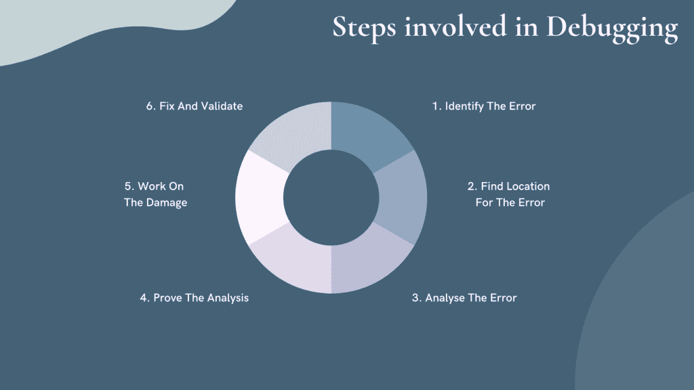
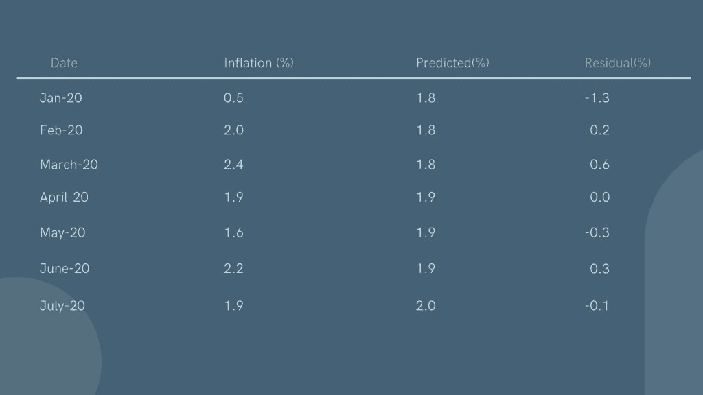

# 模型调试策略:机器学习指南

> 原文：<https://web.archive.org/web/https://neptune.ai/blog/model-debugging-strategies-machine-learning>

你不能基于一个错误的模型来部署软件。调试是机器学习中模型开发和部署的一个重要部分。

有没有一种银弹策略适用于所有类型的模型和应用程序？不尽然，有许多不同的模型调试策略，我们将在本文中探讨其中的 10 种。

## 模型调试说明

当您调试模型时，您会发现并修复工作流和结果中的错误。例如，调试可以揭示模型行为不当的情况，即使它的规范没有内部错误——调试也可以向您展示如何改进这样的问题。

### 为什么我们需要调试？

调试是软件开发的关键部分，不管它是什么类型的软件——因此，自然地，它也适用于机器学习。

在机器学习中，模型性能差可能有多种原因，调试可能需要大量工作。没有预测能力或次优值会导致模型表现不佳。因此，我们调试我们的模型以找到问题的根本原因。

模型被部署在越来越大的任务和数据集上，规模越大，调试模型就越重要。

调试的一般步骤是什么？

### 软件世界中的调试步骤



*Created by author with [Canva](https://web.archive.org/web/20220926100534/https://www.canva.com/)*

1.  **识别错误:**要修复问题，您首先需要知道您有问题。有很多方法可以识别错误，比如性能监控和用户反馈。
2.  **定位错误:**是时候看看错误到底发生在哪里了。彻底检查系统以找到它。
3.  **分析错误:**分析代码以识别更多的问题，并估计错误产生的风险。
4.  **验证分析:**使用自动化测试，在分析完 bug 之后，你可能会在应用程序中发现更多的错误。
5.  **处理损坏:**收集程序中所有需要修改的测试单元。现在您可以运行测试单元并监控它们的性能。
6.  **修复和验证:**修复问题，运行所有测试单元，监控性能。

这些调试步骤在传统的软件世界中非常有效。**机器学习或 AI 中的调试有区别吗？**

当你调试一个 ML 或者 AI 模型的时候，你不会那么关注代码。你必须更深入地确定为什么你的模型表现很差。

由于超参数中的次优值、数据集问题或缺乏预测能力，可能会出现性能不佳的情况。模型性能不好的原因有很多，调试机器学习模型的策略也有很多。

我们将探索开发人员和数据科学家使用的流行技术，以发现机器学习模型中的错误和改进它们的方法。但在此之前，我们先来探索不同类型的 bug。

### 机器学习模型中的常见错误

模型中最常见的问题是维度，这是由线性代数的性质决定的。大多数流行的库可以发现不一致的形状。在处理矩阵时，假设我们使用 shape(n1，n2)(n3，n4)，那么在矩阵乘法中，匹配 n1 和 n3 维对于矩阵运算非常重要。找到它们来自哪里也很重要。

如果您想要 PyTorch 中 Keras 的 Tensorflow 之类的模型摘要，只需使用:

```py
!pip install torchsummary
```

它将以表格格式显示每个图层的结果。

数据会经历一个漫长的过程，从准备、清理等开始。在这个过程中，开发人员经常会感到困惑或忘记正确的数据变量。因此，为了保持在正确的道路上，在构建我们的模型之前使用数据流图是一个好的实践。这将帮助我们找到正确的数据变量名、模型流和预期结果。

为了弄清楚我们的模型是否包含预测信息，首先在人类身上进行尝试。如果人类无法预测数据(图像或文本)，那么我们的 ML 模型就不会有任何作用。如果我们试图给它更多的输入，它仍然不会有所作为。该模型可能会失去其准确性。

一旦我们获得足够的预测信息，我们需要知道我们的数据是否足以训练模型并获得信号。一般来说，我们每个类至少需要 30 个样本，特定功能需要 10 个样本。

***数据集的大小∝模型中参数的数量***

上面等式的确切形状取决于你的机器学习应用。

当你从事机器学习项目时，你可能没有足够的数据。解决这个问题的一个好方法是扩充你的数据。您可以使用创成式模型和创成式对抗网络(如自动编码器)生成新数据。自动编码器有助于以无人监督的方式学习结构化数据编码。

外部数据，比如说在互联网上找到的或开源的数据，可能是有用的。一旦您收集了数据并对其进行了标记，您就可以将其用于培训。它还可以用于许多其他任务。就像外部数据一样，我们也可以使用由他人训练的外部模型，并在我们的任务中重用它。

使用高质量但较小的数据集是训练简单模型的最佳方式**。**有时，当您使用大型训练数据集时，您可能会浪费太多的资源和金钱。

*   **准备数据并避免常见问题**

准备要素时，测量测试数据集的比例因子、平均值和标准差至关重要。测量这些将提高测试数据集的性能。标准化将帮助您确保所有数据的标准差为 1，平均值为 0。如果数据有异常值，这种方法会更有效，并且是缩放要素的最有效方法。

超参数调整是关于改进超参数。这些参数控制学习算法的行为。例如，学习速率(α)或梯度下降优化中的复杂度参数(m)。

一个常见的超参数优化案例是通过使用交叉验证来选择最佳值，以便选择对看不见的数据最有效的方法。这评估了模型参数在训练期间是如何更新的。通常，这项任务是使用简单的试错法手动执行的。有很多不同的方法来调整超参数，例如网格搜索、随机搜索方法、贝叶斯优化方法和简单的有根据的猜测。

记录是监控任何问题的一种方式，但是最好不要记录无用的信息。有时候，评论/记录所有的决策和交换的信息是非常重要的。这可能很困难，但是应该可以规划出所有可能的场景，并使用日志来解决这个问题。

例如，重要的细节是参数的值、类的运行时类型、软件决策等等。这取决于您的问题类型。

通过验证策略，我们可以发现与实际模型无关的问题。我们可以验证模型的完整性(即验证它没有被更改或破坏)，或者模型是否正确和可维护。许多实践已经发展为验证，例如测试数据序列的自动生成，使用不同的输入值集运行多个分析，以及在将数据导入文件时执行验证检查。

让我们更深入地探讨一下开发人员和数据科学家用来发现机器学习模型中的 bug 的最常用和最重要的策略。

## 最常用的模型调试策略

### 灵敏度分析

敏感性分析是一种统计技术，用于估计模型、参数或其他量对输入参数相对于其标称值的变化有多敏感。这种分析显示了模型如何对看不见的数据做出反应，以及它从给定的数据中预测出什么。开发人员经常称之为“假设”分析。

假设我们有一个模型，在特定区域房价上涨 10%的情况下，该模型预测房价将上涨 10%。为了验证这一点，我们模拟了人口增长 10%的数据。如果预测正确，房价上涨 10%，就大功告成了。但是，如果预测是关闭的，例如，住房的预测值不变，则模型对其一个或多个输入变量的变化很敏感。通过敏感性分析，我们可以找出是哪个(哪些)输入变量导致了问题。如果价格上涨 10%、20%或 50%会怎么样？这将有助于我们证明价格对买家流量的变化很敏感。

上面的例子是对一个未知量(房价)的预测。对于预测已知数量的模型(如股票市场)，敏感性分析甚至更为重要。 [What-if-tool](https://web.archive.org/web/20220926100534/https://pair-code.github.io/what-if-tool/index.html#about) 是可视化监控经过训练的 ML 模型行为的最佳方式，只需最少的编码。

敏感性分析将帮助我们深入研究所有变量。正因为如此，预测变得更加可信。它还帮助开发人员认识到未来可以改进的地方。

### 残差分析

数据科学家和开发人员最常用的方法。这是对模型误差以及观察结果和预测结果之间差异的数值评估。残差图非常有助于确定模型的错误之处(错误分类数据点)。简单地说，残差可以通过从观测值中减去预测值来计算。



*Created by author with [Canva](https://web.archive.org/web/20220926100534/https://www.canva.com/)*

*残差=观察值(上图的膨胀)-预测值*

所以，我们以 2020 年 6 月为例。通货膨胀的观察值为 2.2%，模型的预测值为 1.9，因此残差为 0.3。残值小往往意味着模型正确，残值大往往意味着模型有问题。

残差分析图可以很容易地理解为 2D 图，其中横轴表示输入数据，纵轴表示预测或预测结果。本质上，残差分析描绘了不同数字之间的相似性，以确定是否存在异常。通常，这些异常是重要的 bug，可以利用断点等模型调试技术。残差图便于直观显示数据集中两个变量之间的距离。它们还让我们深入了解质量问题，例如异常值，如果不加以检查，这些异常值可能会扭曲预测并造成更大的伤害。寻找为残值创建的模式。我们将能够通过这些模式了解我们的模型。

在评估模型质量时，残差是至关重要的。当残差为零时，意味着模型预测是完美的。更多或更少的值意味着模型的准确性更低。当平均残差不为零时，意味着模型有偏差或可能有问题。诊断线性回归模型中的残差图通常使用以下两种图形方法。

1.  **分位数图**:分位数图是一种图形表示，用于查看残差的分布是否标准。这是实际分布和正态分布的分位数图。如果图表在对角线上重叠，那么它是正态分布的。它帮助我们测试许多分布方面。

2.  **散点图**:散点图是评估方差和线性的图形表示。这两个点描述了两个不同的值。它们可以帮助我们想象两个或更多的变量是如何相互关联的。这通常是分析数据和评估两个或多个项目之间关系的有效方法。另一个优点是，构建散点图只需要很少的数学技能，并且可以很好地理解我们在数据中看到的内容。

### 基准模型

基准模型是最易于使用、可靠、透明和可解释的模型，您可以用它来比较您的模型。最佳实践是检查您的新机器学习模型在测试数据集中的表现是否优于已知基准。

基准模型易于实现，不需要太多时间。使用任何标准算法找到合适的基准模型，然后将结果与模型预测进行比较。如果标准算法和最大似然算法之间有许多共同特征，那么简单的回归可能已经揭示了算法可能存在的问题。

此外，基准模型可以用来评估我们的 ML 模型在不同数据类上的表现。例如，如果我们对我们的 ML 模型过度拟合某些数据感到惊讶，基准模型可以帮助我们理解这是否是因为数据是特殊的。

### 安全审计

有许多针对机器学习模型的攻击会影响模型结果和数据集。常用的评估实践不能告诉我们一个模型是否安全。

有很多方法可以审计机器学习模型，以确保它们是安全的。一些攻击可以使用合成数据发起，当它们与真实的机器学习模型结合时，它们的分析变得非常具有挑战性。

这最适用于攻击者能够访问用于开发模型的训练集的情况。所有的数据、文档和信息应该只对授权成员开放。所有的数据都应该保持准确。我们需要确保进行常规备份、版本控制和所有的安全措施来保证数据的安全。

### 数据扩充

数据扩充是一种机器学习技术，可以帮助我们实现缺失数据。从最基本的定义来看，数据扩充是一种添加新的训练样本来填充数据集中有缺口的地方的方法。

我们可以增加:

1.  声音的
2.  文本
3.  形象
4.  任何其他类型的数据

机器学习解决方案将一组数据与数学方程相结合，将这些可用数据转化为关于我们想要找到的答案的结论。

数据扩充最常见的用途之一是填补我们训练数据集中缺失的数据缺口。在 ML 问题中，有一个训练数据集(也可能有一个验证数据集)没有所有可能的答案(或算法的参数)是很常见的。

但可能有许多答案或参数可以从可用数据中正确“预测”，这些答案或参数在我们的数据集中缺失，但却是模型所需要的。例如，对于图像，我们可以使用

*   几何变换，
*   色彩空间转换，
*   内核过滤器，
*   随机擦除，
*   混合图像。

对于文本，有单词重排、替换和语法操作。用于音频噪声注入—移位、音频速度等。

### 模型编辑和监控

模型编辑是一种技术，其中机器学习模型是为人类用户设计的，以便能够理解它们如何工作并编辑它们。这样做是为了模型在未来表现良好，因为一些 ML 变体被设计为可以被人类解释，如决策树和 GA2M。其他模型可能很难编辑，但是如果它们能够生成可读的结果，它们是可以编辑的。

监控和管理我们的机器学习模型是工作流程的重要组成部分。我们必须记录谁在什么时候训练了这些模型。我们必须保留所有数据集、输入和预测的记录。

这些事情不是一成不变的，会随着时间发生剧烈变化，因此监控我们的模型非常重要。假设我们的模型看起来运行得很好——我们有没有想过如果不是这样会发生什么？当我们的模型不再与现实一致时，我们怎么知道呢？

没有人喜欢惊喜，所以最好不要用监测和校准来等待。可能我们有了一个包含新信息的新数据集，我们想看看它如何改变我们的模型。或者也许我们的模型有一个严重的问题需要纠正。无论情况如何，我们都需要一种方法来检查我们是否应该重新优化和校准。

### 模型断言

模型断言有助于实时改进或覆盖模型预测。在机器学习建模的上下文中，业务规则可以通过检测模型何时未能预测或行为异常来帮助模型达到其指定的目标。由于许多原因，这可能是有益的，但主要的好处是面向目标的业务规则允许模型根据当时需要的操作提供不同级别的响应，因此它们更有可能在不可预测的情况下按预期行事。

与其他实现方法相比，模型断言有很多优点。与应用程序集成方法相比，它们很容易处理向已经部署的模型添加新规则，因为不需要对机器或机器上的任何其他应用程序进行更改。通过评估断言实施的规则是否被遵循，以及它们的准确性如何，也可以很容易地对断言进行评估。因此，与通过应用程序集成实现的业务规则相比，模型断言可以更加准确，而且更加省力。

### 异常检测

异常检测是一种强大的安全措施，它允许组织在异常行为发展的过程中对其进行检测。异常可能包括从组织的金融网络中发生的异常交易到黑客从公司窃取金钱或数据的任何事情。它与其他欺诈检测方法非常相似，但它不仅仅是寻找已知的欺诈交易或模式，还寻找这些模式中的异常和异常值。这意味着异常现象即使以前没有被发现，也能被检测出来。

## 用 Neptune 进行模型可视化和调试

Neptune 是为研究和生产团队开发的 MLOps 的元数据存储。它为我们提供了一个记录、存储、显示、组织、比较和查询机器学习生命周期中生成的所有元数据的中心。研究人员和工程师使用海王星进行[实验跟踪](/web/20220926100534/https://neptune.ai/experiment-tracking)和模型注册，以控制他们的实验和模型开发。

可视化如何帮助调试？

许多程序员都会同意调试是编程中最困难的部分之一。这需要高度的专注、对细节的持续关注和相当大的耐心。这也非常耗时。可视化技术通常通过发现代码中从他们的角度来看像是一个谜的区域来极大地帮助程序员。

可视化是计算机编程的重要组成部分，它允许数据科学家观察程序执行产生的输入和输出值。开发的一个常见问题是当程序产生不正确的结果时，缺乏对程序如何工作的理解。调试工具有助于这一点，它让我们了解程序实际在做什么以及它的输出——特别是对于可视化来说，我们可以洞察不同的数据点看起来像什么，让我们看到为什么我们代码的某些部分工作正常或不正常。使用正确的可视化技术，我们可以准确地看到错误来自哪里，以及在运行期间修改了哪些数据，从而使我们能够在为时已晚之前修复代码。

**使用 Neptune，您可以登录:**

*   模型预测
*   损失和指标
*   工件(数据版本、模型二进制文件)
*   Git 信息、代码或笔记本检查点
*   硬件利用率
*   培训完成后，在笔记本上进行错误分析
*   [绩效可视化](https://web.archive.org/web/20220926100534/https://ui.neptune.ai/neptune-ai/binary-classification-metrics/e/BIN-101/logs)如 ROC 曲线或混淆矩阵(在培训期间或之后)或任何其他东西(它变得交互式)‘metric _ charts’有很好的示例图表
*   [交互式可视化](https://web.archive.org/web/20220926100534/https://docs.neptune.ai/integrations-and-supported-tools/model-visualization-and-debugging)来自[牛郎星](https://web.archive.org/web/20220926100534/https://docs.neptune.ai/integrations-and-supported-tools/model-visualization-and-debugging/altair)、[散景](https://web.archive.org/web/20220926100534/https://docs.neptune.ai/integrations-and-supported-tools/model-visualization-and-debugging/bokeh)、 [Plotly](https://web.archive.org/web/20220926100534/https://docs.neptune.ai/integrations-and-supported-tools/model-visualization-and-debugging/plotly) 或其他 [HTML 对象](https://web.archive.org/web/20220926100534/https://docs.neptune.ai/integrations-and-supported-tools/model-visualization-and-debugging/html)
*   使用智能比较表比较多次运行的超参数和指标，该表突出显示了不同之处。

**让我们举一个使用 Altair 的简单例子:**

[Altair](https://web.archive.org/web/20220926100534/https://altair-viz.github.io/index.html) 是一个针对 Python 的声明式统计可视化库，基于 [Vega](https://web.archive.org/web/20220926100534/http://vega.github.io/vega) 和 [Vega-Lite](https://web.archive.org/web/20220926100534/http://vega.github.io/vega-lite) ，源码在 [GitHub](https://web.archive.org/web/20220926100534/http://github.com/altair-viz/altair) 上。这种集成让我们可以将 Altair 中生成的交互式图表记录到 Neptune 中。

让我们从初始化 Neptune 开始:

```py
import neptune.new as neptune
run = neptune.init(api_token='<API_KEY>',
project='<PROJECT_NAME>')
```

记录牛郎星图。

首先通过安装 vega_datasets 创建一个样例图形:

```py
pip install --upgrade --quiet vega_datasets==0.9.0
```

使用数据创建样图:

```py
import altair as alt
from vega_datasets import data

source = data.cars()

brush = alt.selection(type='interval')

points = alt.Chart(source).mark_point().encode(
    x='Horsepower:Q',
    y='Miles_per_Gallon:Q',
    color=alt.condition(brush, 'Origin:N', alt.value('lightgray'))
).add_selection(
    brush
)

bars = alt.Chart(source).mark_bar().encode(
    y='Origin:N',
    color='Origin:N',
    x='count(Origin):Q'
).transform_filter(
    brush
)

chart = points & bars

chart
```

记录数字:

```py
run['interactive_img'] = neptune.types.File.as_html(chart)
```

探索海王星的结果:

使用 *run.stop()* 停止记录。

现在让我们将 Matplotlib 数字记录到 Neptune:

按照上面第一步所示初始化 Neptune，从在环境中创建一个样例图形开始。确保安装了正确的版本。

```py
import matplotlib.pyplot as plt
import numpy as np
np.random.seed(42)
data = np.random.randn(2, 100)
```

记录为静态图像:

```py
run['static-img'] = neptune.types.File.as_image(figure)
```

将日志记录为交互式图表:

```py
run['interactive-img'] = neptune.types.File.as_html(figure)
```

使用简单的 *run.stop()* 停止日志记录。

*海王星对个人是免费的，你可以在这里生成* [*API 密匙*](https://web.archive.org/web/20220926100534/https://docs.neptune.ai/getting-started/installation#get-api-token)

## 提高模型性能的方法

有许多方法可以提高模型性能，但我们将只讨论几种顶级方法。

**更多数据**:增加更多数据是提高模型性能的最好方法。重采样、清理和获取更多数据也会提高性能。有时，您无法添加更多数据，但您仍然可以创建更多数据或从外部来源获取数据。添加更多数据是提高模型性能的最佳方式。**特征工程**:在统计或机器学习技术的帮助下，将原始观察数据转化为所需特征的简单过程。向模型中添加新特征总是一个好主意，因为这可以提高灵活性并减少差异。使用特征工程时，您需要确保拥有大量数据和充足的预算。你应该买得起这个。

**特性选择**:想象你的数据就像一大片树木的森林。特征选择是遍历森林并根据高度、宽度或颜色等特征决定要保留哪些树的过程。这个类比可以应用于你正在分析、过滤或筛选信息的数据。为了从数据集中提取有用的信息，确定我们要进一步分析数据集中的哪些要素非常重要。我们可能不需要所有的功能。我们可能只需要许多中的一两个，所以重要的是我们要明智地选择，并在它们占用我们机器学习训练算法的宝贵处理时间之前丢弃其余的。

**多种算法**:这里的目标是通过使用多种算法并聚合它们的输出来提高性能。一个众所周知的例子是谷歌的搜索引擎，它对搜索结果使用许多不同的统计模型。你可能会认为，如果所有模型都会产生相似的答案，那么使用多个模型就没有意义，但事实证明，这样做有一些令人惊讶的好处——即使是一天的数据。

**算法调优**:模型开发是一个试错的过程。这个过程中最重要的部分之一是调整你的算法，找到最适合你的算法。调整算法需要大量的时间，可能需要几周或几个月才能发现一个性能良好的算法。最终，你投入的所有时间和精力都是值得的。

**合奏**:最常用、最有效的方法。它结合弱模型的预测数据并产生更好的结果。这个方法有很多种。您可以使用相同或不同的算法创建多个模型，也可以为定型数据生成多个子样本并组合预测以获得性能更好的算法。

**交叉验证**:术语交叉验证用于描述采用一种算法并将其应用于尚未用于训练该算法的测试数据的过程。在机器学习中，这通常意味着采用一个未经学习的模型，并在一组验证数据上运行它，然后与原始训练集进行比较。交叉验证可以使用“留一法”或重复交叉验证方案来完成。

## 结论

模型调试可能是一项困难、耗时的任务。模型是用许多不同的变量构建的，并且通常具有抽象层，这使得调试很困难。

我们看到了什么是模型调试，以及我们为什么需要它。我们还讨论了一些常见的错误类型，以及最常用的模型调试实践。你可以尝试这些技术，让你的机器学习模型更值得信赖，性能更好。

希望你喜欢这篇文章，保持安全！

### 额外研究和推荐阅读

### 哈希尔·帕特尔

Android 开发者和机器学习爱好者。我热衷于开发移动应用程序、制造创新产品和帮助用户。

**阅读下一篇**

* * *

ML 实验跟踪:它是什么，为什么重要，以及如何实施

## 10 分钟阅读|作者 Jakub Czakon |年 7 月 14 日更新

10 mins read | Author Jakub Czakon | Updated July 14th, 2021

我来分享一个听了太多次的故事。

*“…我们和我的团队正在开发一个 ML 模型，我们进行了大量的实验，并获得了有希望的结果…*

> *…不幸的是，我们无法确切地说出哪种性能最好，因为我们忘记了保存一些模型参数和数据集版本…*
> 
> *…几周后，我们甚至不确定我们实际尝试了什么，我们需要重新运行几乎所有的东西"*
> 
> 不幸的 ML 研究员。
> 
> 事实是，当你开发 ML 模型时，你会进行大量的实验。

这些实验可能:

使用不同的模型和模型超参数

*   使用不同的培训或评估数据，
*   运行不同的代码(包括您想要快速测试的这个小变化)
*   在不同的环境中运行相同的代码(不知道安装的是 PyTorch 还是 Tensorflow 版本)
*   因此，它们可以产生完全不同的评估指标。

跟踪所有这些信息会很快变得非常困难。特别是如果你想组织和比较这些实验，并且确信你知道哪个设置产生了最好的结果。

这就是 ML 实验跟踪的用武之地。

This is where ML experiment tracking comes in. 

[Continue reading ->](/web/20220926100534/https://neptune.ai/blog/ml-experiment-tracking)

* * *