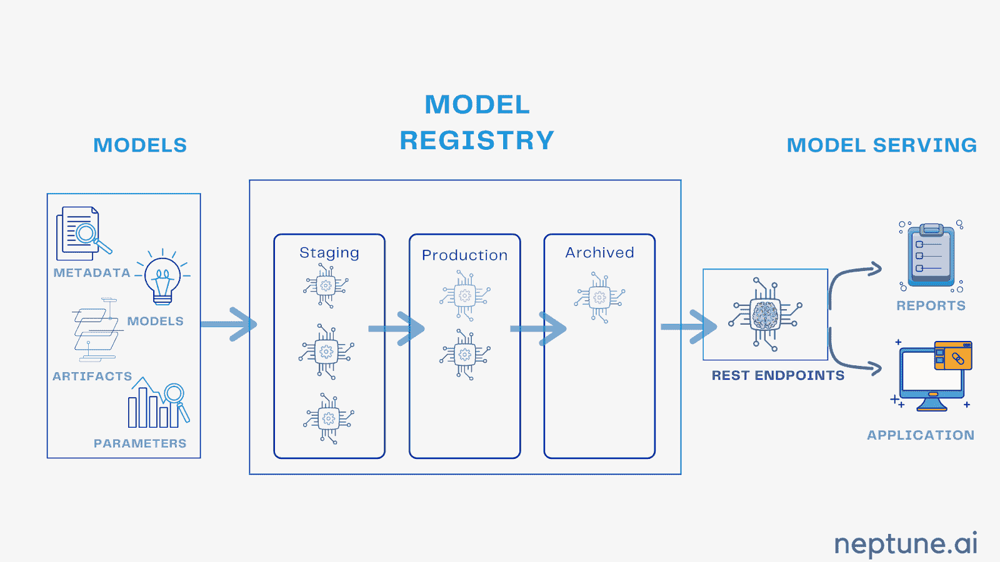

# 模型注册使 MLOps 工作:原因如下

> 原文：<https://web.archive.org/web/https://neptune.ai/blog/model-registry-makes-mlops-work>

[模型注册](https://web.archive.org/web/20221206102848/https://mlinproduction.com/model-registries-for-ml-deployment-deployment-series-06/)是机器学习生命周期或 MLOps 的一部分。它是一个管理多个模型工件的服务，在 ML 生命周期的不同阶段跟踪和治理模型。Model registry 是一个协作中心，团队可以在机器学习生命周期的不同阶段一起工作，从实验阶段开始到生产阶段。它实现了批准、治理和监控的无缝衔接，并提高了工作流性能。它帮助您管理 ML 模型的整个开发生命周期，并标准化部署。在未来几年，75%的公司/初创公司正计划将其机器学习项目从试点转向运营。因此，当涉及到生产时，我们有时会使用完全不适合数据科学家或 ML 工作流的 ML 工具。因此，**模型注册中心是让 MLops 工作的关键。我们将探索几个平台和 Model registry 的关键特性。**

## 什么是模型注册中心？

Model Registry 是一个允许机器学习工程师和数据科学家发布、测试、监控、管理和共享它们以便与其他团队合作的系统。本质上，当您完成了试验阶段，并准备好与团队和涉众共享时，就可以使用模型注册。



*Source: Author*

## 为什么我们需要模型注册

假设您已经花费了大量资源来开发一个 ML 算法，该算法运行良好，并且有很好的潜力来影响您的业务成果。将 ML 推向生产的过程极其缓慢，公司需要一年，有时两年才能发布一款产品。我们缺少的是透明度和与其他团队成员合作的方式。那么，如果你有一个中央回购平台来存放你所有的生产就绪模型，会怎么样呢？这将简化整个生产和工作流程。使用模型注册中心，您可以确保所有的键值(包括**数据、配置、环境变量、模型代码、版本和文档**)都在一个地方，每个人都可以访问。

**缺乏治理和安全性**是许多行业的主要问题。它最终会拖慢生产，然后**公司不得不回到白板前**思考哪里出了问题以及如何解决。现实生活中有许多缺乏适当管理导致严重问题的案例。适当的管理、治理和测试可能不会首先产生任何问题。借助模型注册，您可以:

*   管理模型生命周期
*   工作流的模型风险和批准
*   更快、无缝地推出
*   轻松协作和管理

## 关键特征

*   **中央存储库**:在一个地方无缝管理您的所有实验，管理带有版本和其他元数据的注册模型。这个协作中心帮助团队在一个地方轻松访问和共享所有类型的信息。
*   **模型版本化:**自动跟踪版本。你的机器学习模型有这么多不同的组成部分——数据使用、超参数、预定义算法或你自己开发的算法、模型架构。通过模型版本控制，您可以轻松地管理所有这些组件。版本控制是机器学习治理过程的重要组成部分。有许多版本控制工具可以帮助您改进 ML 工作流。下面是一些用于数据版本控制的顶级工具。
    *   Neptune:其直观的用户界面和易于使用的管理系统可以帮助您自动化、跟踪和监控您的实验。
    *   DVC:这是一个开源系统，允许你维护不同的数据类型、配置和代码。它帮助您跟踪完整的代码和数据来源。
    *   GIT (LFS): Git 用于监控和管理你的实验。Git 跟踪您的代码，让您存储、合并和实现这些更改。而 GIT LFS 是对大型文件和数据集进行版本控制的扩展。
*   **CI/CD 工作流集成:**这是一个工作流，允许开发人员和数据科学家更改、更新和合并代码到一个中央报告中。您可以控制试运行过程，批准和检查更改。它允许团队自动将模型转换到基于生产的状态，或者团队可以手动控制和验证生命周期阶段。
    *   每次更新代码时，CI 都依赖于一套自动化的测试。该套件让您知道什么时候出现了问题，让团队可以很容易地解决问题。
    *   它的架构允许你用小的迭代工作，并帮助你迭代发布。以可部署的方式保存代码。
    *   提高团队生产力，更快的部署，更频繁的发布，并且风险最小。
*   **模型管理:**将 ML 模型作为在线部署或测试的 API。公司在不同阶段往往会有成千上万的机器学习模型。模型注册使得在测试、实验和生产阶段的治理、跟踪和管理变得容易。有时，跟踪所有的机器学习实验可能具有挑战性，但通过适当的管理，事情可以变得非常简单。模型管理有助于您获得正确的见解、轻松的协作以及机器学习实验的详细记录。

## 示范登记册平台

让我们讨论几个最好的和最常用的模型注册工具。为了更好地理解，我们还将比较几个关键特性，并运行一个小型模型注册表演示。

Neptune 是 MLOps 的一个元数据存储库，为运行大量实验的研究和生产团队而构建。

它为您提供了一个中心位置来记录、存储、显示、组织、比较和查询机器学习生命周期中生成的所有元数据。个人和组织使用 Neptune 进行实验跟踪和模型注册，以控制他们的实验和模型开发。

*   **在一个地方记录和版本化**你所有的机器学习模型开发元数据。
*   无缝版本笔记本电脑，。git 信息、模型代码、数据集和图像。
*   **在中央 ML 模型注册表中组织模型**，版本存储，在仪表板中过滤、排序和分组所有机器学习模型训练运行。
*   Neptune 提供了一种简单的方法来**调试和比较您的模型度量**。它会在两次运行之间自动生成表格，让**毫不费力地**进行比较。
*   机器学习模型的团队协作**安全地与您的团队共享**一切。获取关于模型的变更内容、时间和人员的信息。
*   您可以**重新运行**您的 ML 模型，并跟踪所有运行及其结果。

#### 开始使用 Neptune 非常简单:

1.  **安装**

```py
pip install neptune-client
```

2.  **培训脚本准备**

创建一个文件(main.py)并粘贴下面提到的代码

```py
import neptune.new as neptune
run = neptune.init(project="your_workspace/your_project")

run["JIRA"] = "NPT-952"
run["parameters"] = {"learning_rate": 0.001,
"optimizer": "Adam"}

for epoch in range(100):
run["train/accuracy"].log(epoch * 0.6)
run["train/loss"].log(epoch * 0.4)
run["f1_score"] = 0.66

```

3.  **运行您的脚本**

转到终端并运行:

```py
python main.py
```

您将看到一个 Web 链接，您可以在 UI 中看到您的实验数据

查看他们的文档页面，了解一切是如何工作的。

#### 使用 Neptune 构建元数据的日志模型:

确保安装了正确的库，并从 Neptune 系统配置了 API。

1.  **连接海王星**

```py
import neptune.new as neptune
run = neptune.init(project='common/quickstarts',
api_token='ANONYMOUS')
```

2.  **测井参数**

```py
PARAMS = {'lr': 0.1, 'epoch_nr': 10, 'batch_size': 32}
run['parameters'] = PARAMS

```

3.  **添加指标和损失**

```py
loss = ...
run["train/loss"].log(loss)

```

下面是创建回调的示例，该回调使用 Keras 在每个时期后记录指标和损失:

```py
run = neptune.init(project='common/myproject',
                   api_token=”YOUR_API_TOKEN”)
class NeptuneLogger(keras.callbacks.Callback):
    def on_batch_end(self, batch, logs={}):
        for log_name, log_value in logs.items():
            run['batch/{}'.format(log_name)].log(log_value)

    def on_epoch_end(self, epoch, logs={}):
        for log_name, log_value in logs.items():
            run['epoch/{}'.format(log_name)].log(log_value)

```

*您可以从这里的*[](https://web.archive.org/web/20221206102848/https://docs.neptune.ai/getting-started/installation)*生成 API 令牌*

 *将其传递给回调参数:

```py
model.fit(x_train, y_train,
          epochs=PARAMS['epoch_nr'],
          batch_size=PARAMS['batch_size'],
          callbacks=[NeptuneLogger()])

```

4.  **测试分数记录**

```py
run['test/acc'] = 0.76
```

5.  **添加模型文件的日志**

```py
run["model"].upload('my_model.pkl')
```

[现在就试试 Neptune】或者阅读更多关于它的](/web/20221206102848/https://neptune.ai/register)[模型注册表特性](/web/20221206102848/https://neptune.ai/product/model-registry)。

### 2. **Azure 机器学习**

Azure ML 是一个基于云的平台，用于训练、部署、自动化、管理和监控所有的机器学习实验。Azure ML 使用 MLOPs 方法来提高机器学习实验的质量和性能。在 Azure 中，你可以选择用 UI 创建和注册一个模型，或者用 API 注册。

*   Azure 让你创建**可重用的管道和环境**，帮助你轻松处理模型训练、数据准备和机器学习模型的部署。
*   注册和部署 ML 模型，**从任何地方监控与您的模型相关联的元数据**。
*   **管理整个机器学习生命周期**，包括何时、何地以及谁对模型进行了更改。
*   **部署不同事件**的定制通知，例如您的实验完成或建模。
*   **监控和探索不同类型的指标**，为您的机器学习实验获取定制警报。

无论部署在哪里，Azure ML 工作流都是一样的。

1.  注册模型
2.  准备入口脚本和配置
3.  模型的部署(云/本地)
4.  监测和分析
5.  将模型重新部署到云中
6.  测试性能

**从本地机器注册模型**

```py
wget https://aka.ms/bidaf-9-model -o model.onnx
az ml model register -n bidaf_onnx -p ./model.onnx
```

将-p 设置为要注册的文件夹或文件的路径。

**从 Azure 机器学习的训练运行中注册模型**

```py
az ml model register -bidaf_onnx --asset-path outputs/model.onnx --experiment-name myexperiment --run-id myrunid --tag area=qna
```

**使用 API 注册模型**

有三种方法可以向 Azure 注册模型。

```py
with mlflow.start_run(run_name=<run-name>) as run:
  ...
  mlflow.<model-flavor>.log_model(<model-flavor>=<model>,
    artifact_path="<model-path>",
    registered_model_name="<model-name>"
  )

```

要用某个特定的名称注册一个模型，在运行完所有实验之后，使用 mlflow.register_model()方法。

```py
result=mlflow.register_model("runs:<model-path>", "<model-name>")
```

要创建一个具有惟一名称的新注册模型，您可以使用客户机 api 方法 create_registered_model()

```py
client = MlflowClient()
result = client.create_registered_model("<model-name>")
```

参考:[将机器学习模型部署到 Azure](https://web.archive.org/web/20221206102848/https://docs.microsoft.com/en-us/azure/machine-learning/how-to-deploy-and-where?tabs=azcli)

### 3. **MLFlow**

MLFlow 是一个开源平台，用于管理您的机器学习模型生命周期。这是一个带有 API 的集中式模型库，以及一个可轻松管理 MLops 生命周期的 UI。它提供了许多特性，包括模型沿袭、模型版本化、生产到部署的转换以及注释。

*   **使用名称、版本、部署阶段的 POC 和其他数据在模型注册中心注册模型**。
*   版本控制功能可以让你在机器学习模型更新时跟踪它们的版本。
*   不同的模型版本可以在特定的时间分配一个阶段，它提供了一个预定义的**模型阶段**。它可用于不同的阶段，如**准备、生产或存档**。
*   **自动记录转变**度量、事件或对您的机器学习实验所做的更改。
*   **注释和模型描述**，您可以注释顶级模型和任何对其他团队成员有用的描述或信息。例如，算法信息或数据集信息。
*   MLFlow 允许您查看并更改作为 **CI/CD 管道**一部分的每个阶段转换，以实现更好的治理和监控。

**MLFlow 模型注册工作流程**

您可以通过 UI 或 API 访问模型注册中心。如果您运行自己的服务器，则必须使用数据库支持的存储来访问 MLFlow 模型注册表。

**UI 工作流程**

*   **进入 MLFlow details 部分的工件页面，注册模型**。
*   在 Model **name** 字段中添加一个新模型，确保您为它提供了一个唯一的名称，否则您可以选择您的**现有模型。**
*   现在您的模型已经注册，您可以通过进入注册的**模型**部分查看模型的详细信息。
*   每个模型都有一个**细节部分**，其中显示了所有活动版本。
*   只需从下拉菜单中进行选择，您就可以将模型阶段从**准备阶段更改为生产阶段**。

**API 工作流程**

API 工作流是使用模型注册表的另一种方法。您可以在 MLflow 实验运行期间或所有实验运行之后注册模型。

```py
with mlflow.start_run(run_name="YOUR_RUN_NAME") as run:
    params = {"n_estimators": 5, "random_state": 42}
    sk_learn_rfr = RandomForestRegressor(**params)

    mlflow.log_params(params)
    mlflow.log_param("param_1", randint(0, 100))
    mlflow.log_metrics({"metric_1": random(), "metric_2": random() + 1})

    mlflow.sklearn.log_model(
        sk_model=sk_learn_rfr,
        artifact_path="sklearn-model",
        registered_model_name="sk-learn-random-forest-reg-model"
    )

```

*   从注册表获取 MLFlow 模型

```py
model_name = "sk-learn-random-forest-reg-model"
model_version = 1

model = mlflow.pyfunc.load_model(
    model_uri=f"models:/{model_name}/{model_version}"
)

model.predict(data)
```

*   从注册表提供 MLflow 模型

```py
export MLFLOW_TRACKING_URI=http://localhost:5000

mlflow models serve -m "models:/sk-learn-random-forest-reg-model/Production"
```

*   更新您的模型信息/描述

```py
client = MlflowClient()
client.update_model_version(
    name="sk-learn-random-forest-reg-model",
    version=1,
    description="This model version is a scikit-learn random forest containing 100 decision trees"
)

```

## 模型注册中心有什么问题吗？

大多数模型注册中心，包括我们在这里讨论的，都是灵活的，并且易于与其他 MLOps 框架一起使用。但是，并不是每个平台都会满足你所有的机器学习实验需求。

*   MLFlow 没有添加用户权限的选项，有时当您处于部署阶段时，事情会变得很棘手。
*   在 Azure ML 和 Neptune 中，日志记录更加容易和无缝，有时当您有更多的实验要运行时，MLFlow UI 会变得滞后。同时，Sagemaker 使用 Cloudwatch 来记录指标，而 cloud watch 和指标可视化在 sage maker 中不太受欢迎。
*   MLFlow 中不允许进行实验分析的跟踪，而 Neptune 和 Azure 提供了无缝的跟踪体验。

下面是我们讨论的工具之间的表格比较:

|  | 天蓝色* | 海王星 | MLFlow |
| --- | --- | --- | --- |
|  |  |  |  |
|  |  |  |  |
|  |  |  |  |
| 

笔记本和数据版本

 |  |  |  |
|  |  |  |  |
|  |  |  |  |
|  |  |  |  |
| 

监控模型性能

 |  |  |  |
|  |  |  |  |
|  |  |  |  |
|  | 

免费试用，

 | 

个人免费，
团队[有偿](/web/20221206102848/https://neptune.ai/pricing)

 |  |

**Azure 机器学习工作室*

无论您使用什么平台，模型注册都将帮助您加快推广过程，使您的 ML 实验易于管理，并使协作更容易。它将为您的团队创建一个无缝的移交，增加安全性和治理。每个平台都有自己的特点，取决于你的需要和你想如何跟踪所有的 ML 实验，你可以选择免费试用。这是了解哪个平台适合您的机器学习实验并帮助您推进部署的好方法。

## 额外研究和推荐阅读*