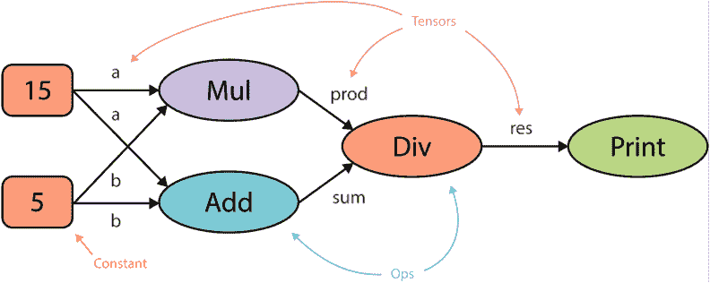

# 从 TensorFlow 迁移到 PyTorch

> 原文：<https://web.archive.org/web/https://neptune.ai/blog/moving-from-tensorflow-to-pytorch>

[深度学习框架、库和众多工具的概念](/web/20230131065431/https://neptune.ai/blog/best-mlops-tools)的存在是为了减少否则必须计算的大量手动计算。TensorFlow 和 PyTorch 是目前构造神经网络架构最流行的两种框架。

虽然 TensorFlow 比 PyTorch 早一年发布，但最近大多数开发人员都倾向于转向 PyTorch。在本文中，我们将探讨如何从 TensorFlow 切换到 PyTorch 的大部分细节。我们将首先理解使用这两种深度学习框架的原因。

然后，我们将更深入地研究这些库的安装过程以及成功过渡的实践方法。我们还将研究 PyTorch 库在 MNIST 的执行情况，并最终理解 PyTorch 在所有情况下是否都是最好的。

## 两种深度学习框架简介

在文章的这一部分，我们将简要概述这两个深度学习框架，即 [TensorFlow 和 PyTorch](https://web.archive.org/web/20230131065431/https://towardsdatascience.com/pytorch-vs-tensorflow-2021-d403504d7bc3) 。我们还将尝试理解为什么人们会从 TensorFlow 过渡到 PyTorch，并给出一些实际的解释，然后再用更实际的方法来解决这个问题。

### TensorFlow

[TensorFlow](https://web.archive.org/web/20230131065431/https://www.tensorflow.org/) 是谷歌在 2015 年推出的用于开发神经网络的深度学习框架的较老解释之一。谷歌大脑团队的产品总是最值得信赖的方法之一，用于开始任何类型的复杂任务。

TensorFlow 是一个开源库，使用它可以开发和构建大多数机器学习和人工智能模型。TensorFlow 2.0 的更新版本也集成了 Keras，是相应地培训、开发、操作和运行机器学习模型的一个很好的选择。

### PyTorch

PyTorch 由脸书人工智能研究(FAIR)团队于 2016 年 9 月开发。它已经获得了很多关注，尤其是最近，大多数数据科学家和研究人员都试图从 TensorFlow 成功过渡到 PyTorch。它与 Python 编程语言无缝集成，大多数开发人员发现使用它非常自然。

PyTorch 可以被认为是一个平台，在这个平台上，你可以与张量(类似于 NumPy 这样的库，我们使用数组)一起使用 GPU 加速来计算深度学习模型。在 PyTorch 的帮助下，您还能够获得动态图表，使用这些图表您可以动态地分析您的模型的工作方法。

## 为什么人们要从 TensorFlow 迁移到 PyTorch？

虽然 TensorFlow 似乎是您的军火库中用于大多数深度学习任务的一个很好的工具，但大多数人现在更喜欢从 TensorFlow 切换到 PyTorch。让我们讨论一下从一个深度学习框架过渡到另一个框架的一些主要原因。

*   Tensorflow 创建静态图，而 PyTorch 创建动态图。在 TensorFlow 中，机器学习模型的大多数计算图都应该完全从头开始定义

*   在 PyTorch 中，您可以定义、操作和适应特定的工作图，这在像 RNNs 中的可变长度输入这样的场景中特别有用。

*   使用 PyTorch 处理模型更加直观，因为它主要是用 Python 开发的，并且它与 Python 编程语言的自然工作方式无缝结合。

*   另一方面，TensorFlow 的学习曲线很陡，大多数用户乍一看会觉得很难掌握。即使当你学习张量流时，一些概念也需要重新审视。

*   PyTorch 最适合开发快速原型和研究项目，这就是为什么大多数人选择从 TensorFlow 过渡到 PyTorch。

## 从 TensorFlow 切换到 PyTorch 容易吗？

在文章的这一部分，我们将关注从 TensorFlow 切换到 PyTorch 是否容易。从任何深度学习框架转换的第一步是安装过程。该库必须易于安装，以便开发人员可以开始构建模型，而不必太担心安装过程的复杂细节。

虽然安装 TensorFlow 和 PyTorch 库的 CPU 版本非常简单，但是使用 CPU 来训练复杂的模型是很原始的。让我们来看看他们的 GPU 安装程序之间的快速概述和比较。

### 探索张量流安装的复杂过程

如果你试图在你的 Windows 操作系统或任何 Linux 系统上安装 TensorFlow 的 GPU 版本，整个过程相当复杂。即使您正在使用 Anaconda 软件来开发您的深度学习项目，获得 TensorFlow 最新版本的过程也比您预期的要长一些。但是，如果您对使用任何版本的 TensorFlow 感兴趣，可以使用以下命令在您的虚拟环境中安装 TensorFlow 2.0。

```py
conda install -c anaconda tensorflow-gpu
```

然而，TensorFlow 的版本不断更新，上面的安装并不总是这样。因此，在共享代码或从事研究项目时，可能会引发许多问题。

要在您的系统上安装最新版本的 TensorFlow，您需要确保下载了安装过程所需的特定驱动程序。您需要查看官方的 [TensorFlow 文档](https://web.archive.org/web/20230131065431/https://www.tensorflow.org/install/source#gpu),了解您需要下载并安装到系统上的 CUDA 文件和 CuDNN 版本的具体信息。

CUDA 和 CuDNN 版本由 Nvidia 不断更新，类似于它们的驱动程序。每当有 TensorFlow 最新版本的新发布，他们通常也会更新 CUDA 和 CuDNN 需求。

一些功能在新版本中被贬低，因此，下载新版本以保持更新变得至关重要。但是每次我们需要安装新的 TensorFlow 版本时，Cuda 和 CuDNN 更新都必须单独下载和安装。整个过程非常繁琐，每次更新都需要重复。

### 了解更简单的 PyTorch 安装

与 TensorFlow 安装相比，PyTorch 安装要简单得多。为了成功安装 PyTorch，您需要做的就是访问 PyTorch 官方网站获取安装指南，您可以通过此[链接](https://web.archive.org/web/20230131065431/https://pytorch.org/get-started/locally/)选择您的软件需求类型、您的开发包和您的计算平台。该网站将自动为您提供准确的命令，您可以复制粘贴在您的默认或虚拟环境中开始安装。安装语句示例如下:

```py
conda install pytorch torchvision torchaudio cudatoolkit=10.2 -c pytorch
```

## 如何从 TensorFlow 切换到 PyTorch

对于 TensorFlow 的专家来说，可能想知道从一个库切换到另一个库的区别。从 TensorFlow 转换到 PyTorch 并不复杂，因为 PyTorch 提供了一种*python 式的方法*来解决大多数问题。在本节中，我们将介绍从 TensorFlow 成功转换到 PyTorch 的一些主要基础知识。

我们将了解如何在这两个深度学习框架中实现张量并与之合作。然后我们将了解他们的图形工作机制，即 TensorFlow 中的静态图形方法和 PyTorch 中的动态图形。最后，在本节中，我们还将比较 TensorFlow 和 PyTorch 的训练循环。

### 理解如何实现张量

张量是 n 维数组，通过它你可以开发和构造大部分的机器学习项目。大多数深度学习框架的核心方面是张量的概念，张量是向量和矩阵的推广。在您的系统上安装 PyTorch 后，您可以继续比较 TensorFlow 和 PyTorch 的编码过程之间的一些基本差异。

让我们比较并实现一些基本实现，开始从一个库到另一个库的转换。我们将首先看看如何导入这两个库，初始化张量，并用这些张量执行一些基本操作。初始化张量的张量流代码如下:

```py
import tensorflow as tf

rank_2_tensor = tf.constant([[1, 2],
                             [3, 4],
                             [5, 6]], dtype=tf.int32)
```

在 PyTorch 中，同样的实现可以按如下方式完成:

```py
import torch

rank_2_tensor = torch.tensor([[1, 2],
                             [3, 4],
                             [5, 6]], dtype=torch.int32)
```

在这两个框架中，库的导入和张量的定义都非常简单。让我们分析一下如何在这两个库中执行一些基本的张量计算。首先，让我们看看下面的 TensorFlow 实现示例(注意，如果需要，您也可以将示例中显示的值直接定义为变量)。

```py
a = tf.constant([[1, 2],
                 [3, 4]])
b = tf.constant([[1, 1],
                 [1, 1]])

a = tf.Variable(a)
b = tf.Variable(b)

print(tf.add(a, b), "n")
print(tf.multiply(a, b), "n")
print(tf.matmul(a, b), "n")
```

在 PyTorch 中，以下实现可以解释如下:

```py
a = torch.tensor([1, 2, 3], dtype=torch.float)
b = torch.tensor([7, 8, 9], dtype=torch.float)

print(torch.add(a, b))
print(torch.subtract(b, a))
print(a.mul(b))

print(a.dot(b))
```

现在，我们已经简要了解了如何在这两个深度学习框架中与张量合作，让我们通过实践方法来理解它们的工作机制。

### 它们的工作机制(理解各自的图表)

大多数深度学习框架都利用了计算图。这些计算图定义了必须执行计算的顺序，以便我们可以相应地获得最佳结果。

通常有两个解释器用于深度学习问题的计算，其中每个解释器服务于不同的目的。其中一个解释器用于编程语言(大多数情况下是 Python)，另一个解释器根据需要管理计算图形。

因此，大多数深度学习框架利用像 Python 这样的编程语言来设置计算图，并且还设置了执行机制，这与宿主语言大不相同。

这种奇怪的设置主要是出于效率和优化的原因。计算图形可以在目标 GPU 中优化和并行运行。因此，由于并行性和依赖性驱动调度，整个计算过程被加速并且更高效。

在 TensorFlow 中，我们使用静态计算图。这些工作遵循典型的“定义并运行”惯例。？在这样的构建中，我们在开始时创建并连接所有的变量，并将它们初始化成一个静态的(不变的)会话。

然而，有必要在静态图中定义一些可变参数，这有时被认为是不方便的，尤其是对于使用 RNN 型网络的任务。我建议查看下面的[网站](https://web.archive.org/web/20230131065431/https://cs230.stanford.edu/section/5/)，了解更多关于这些静态图如何工作的详细信息。让我们看看静态张量流图的实现。

```py
import tensorflow as tf

a = tf.Variable(15)
b = tf.Variable(15)

prod = tf.multiply(a, b)
sum = tf.add(a, b)

result = prod/sum
print(result)
```

#### 输出

```py
 tf.Tensor(7.5, shape=(), dtype=float64)
```

#### 图表



*The computational graph | [Source](https://web.archive.org/web/20230131065431/https://builtin.com/data-science/pytorch-vs-tensorflow)*

在 PyTorch 中，我们利用了动态图，其中计算图是在我们键入代码时构建的。当用户最初声明变量时，直接构建计算图，并且在每次迭代训练后重新构建计算图。动态图和静态图都有其特定的用例，在特定的场景中，一个比另一个更好。

动态图通常比静态图更好，因为我们可以相应地修改感兴趣的元素，而无需强调其他因素，从而在训练和模型构建过程中实现更高的灵活性。使用这种方法的唯一缺点是，有时需要更长的时间来重建图形。下面显示的 GIF 表示是 PyTorch 中一个项目如何工作的最好例子之一。

### 训练循环的比较

在 TensorFlow 中，创建训练循环的过程有点复杂，而且不是很直观。我们通常使用一个 tf.function，它作为一个装饰器，根据静态图来编译模型。

TensorFlow 中的正常执行使用的是急切执行，这对于调试来说是好的，但是对于模型的更快的性能和实现来说是不好的。因此，我们利用 tf.function 使框架能够应用全局性能优化。

然后，我们定义训练步骤，在该步骤中，我们通常使用梯度带函数，该函数执行自动微分。然后，我们可以定义培训过程将要发生的模型，并相应地计算损失。

应用梯度值，经历反向传播过程，最后更新训练度量。在模型完成训练后，我们可以返回我们想要的指标和值。

```py
@tf.function
def train_step(x, y):
    with tf.GradientTape() as tape:
        logits = model(x, training=True)
        loss_value = loss_fn(y, logits)
    grads = tape.gradient(loss_value, model.trainable_weights)
    optimizer.apply_gradients(zip(grads, model.trainable_weights))
    train_acc_metric.update_state(y, logits)
    return loss_value
```

这种训练循环的 PyTorch 实现非常简单和直观。我们可以动态地创建变量和定义动态图，然后继续训练我们的模型。我们可以将我们的数据和目标分配给设备(CPU 或 GPU)的状态，并继续计算前向传播，这是神经网络的前馈计算。

一旦模型完成前馈训练过程，我们就可以在 PyTorch 中一些预定义实体的帮助下计算元素的反向传播。我们计算梯度，应用反向传播方法，并执行参数更新。以下计算的代码如下所示。

```py
for epoch in range(epochs):
    for batch, (data, target) in enumerate(train_loader):

        data = data.to(device=device)
        target = target.to(device=device)

        score = model(data)
        loss = criterion(score, target)

        optimizer.zero_grad()
        loss.backward()
        optimizer.step()
```

现在，我们已经理解了从 TensorFlow 切换到 PyTorch 的一些基本要求，让我们借助 PyTorch 深度学习框架来理解深度学习项目的代码演练。

## PyTorch 中 MNIST 的代码演练

在本文的这一部分，我们将了解 TensorFlow 和 PyTorch 之间的一些主要差异。进一步了解他们工作程序的最好方法之一是亲自动手实施一个项目。我们将在这个代码演练比较中对 MNIST 数据集中的数字进行分类，我们将在 PyTorch 的帮助下训练一个模型，对数字从 0 到 9 进行分类。

第一步是导入计算 MNIST 项目所需的所有基本库。因为我们正在从 TensorFlow 过渡到 PyTorch，所以我们将为这个项目导入所有需要的 PyTorch 库。使用这个深度学习框架，我们可以在我们将要构建的神经网络架构中构建所有需要的层。PyTorch 的必要导入在下面的代码块中描述如下。

```py

import torch
import torchvision
import torch.nn as nn
import torch.nn.functional as F
from torch.utils.data import DataLoader
import numpy as np
import matplotlib.pyplot as plt
```

我们的下一步是相应地设置设备参数。我们可以选择是否要将 PyTorch 中用于训练的默认设备设置为 CPU 或 GPU。如果你有一个可以使用的 GPU，那么使用它总是更好。然而，对于这个项目，即使一个 CPU 设备也能满足要求，培训不需要太长时间。在 TensorFlow 中，默认设备通常根据您的安装设置为 GPU 版本。

```py

device = torch.device('cuda' if torch.cuda.is_available() else cpu)
```

我们的下一步是定义一些超参数，用于模型的构建和训练。定义了添加到总共 10 个类别中的类别数(0-9)。我们将设置默认输入大小为 784 (28×28 是 MNIST 数据的图像大小)，学习率为 0.0001，批量大小为 64，并且我们将在总共 3 个时期上训练构建的模型。

```py

num_classes = 10
input_size = 784
batch_size = 64
lr = 0.0001
epochs = 3
```

下一步，我们将加载我们的数据。PyTorch 框架类似于 TensorFlow 库，可以访问一些默认数据集，MNIST 就是其中之一。我们将以训练和测试数据集的形式分离图像(大约 60000 个)。DataLoader 函数在加载我们的数据时提供了非常好的工具。下面的代码片段展示了如何在 PyTorch 中加载数据。

```py

T = torchvision.transforms.Compose([torchvision.transforms.ToTensor()])

X_train = torchvision.datasets.MNIST(root='/datasets', train=True, download=True, transform=T)
train_loader = DataLoader(dataset=X_train, batch_size=batch_size, shuffle=True)

X_test = torchvision.datasets.MNIST(root='/datasets', train=False, download=True, transform=T)
test_loader = DataLoader(dataset=X_test, batch_size=batch_size, shuffle=True)
```

现在我们已经收集了所需的数据，我们终于可以使用 PyTorch 深度学习框架来构建神经网络架构了。我们将使用完全连接的层类型构建来解决我们的问题。

使用 PyTorch 构建深度学习模型的过程非常简单，并且遵循 Pythonic 方法。我们将为神经网络定义一个类，并为我们的模型声明完全连接的层。功能。注意，在张量流的情况下，我们将对完全连接的层使用稠密函数。

```py

class neural_network(nn.Module):
    def __init__(self, input_size, num_classes):
        super(neural_network, self).__init__()
        self.fc1 = nn.Linear(in_features=input_size, out_features=50)
        self.fc2 = nn.Linear(in_features=50, out_features=num_classes)

    def forward(self, x):
        x = self.fc1(x)
        x = F.relu(x)
        x = self.fc2(x)
        return x
```

既然我们已经用 PyTorch 完成了数据收集和深度学习模型的构建，我们可以继续定义我们将利用的损失类型和最适合该任务的优化器类型。交叉熵损失对于像 MNIST 项目这样的多类分类问题来说是一个非常好的选择。

Adam 是最好的默认优化器之一，几乎可以在任何场景中找到效用。我们将为指定数量的纪元训练我们的模型。对于训练过程，我们将使用前馈完全卷积网络，然后应用反向传播来学习相应的最佳权重。

```py

criterion = nn.CrossEntropyLoss()
optimizer = torch.optim.Adam(model.parameters(), lr=lr)

for epoch in range(epochs):
    for batch, (data, target) in enumerate(train_loader):

        data = data.to(device=device)
        target = target.to(device=device)

        data = data.reshape(data.shape[0], -1)

        score = model(data)
        loss = criterion(score, target)

        optimizer.zero_grad()
        loss.backward()
        optimizer.step()
```

最后，现在我们的训练方法已经完成，我们可以继续训练和评估构建的模型，并相应地检查训练和测试的准确性。完成以下操作的步骤也非常简单，因为我们可以在正确分类的图像和错误分类的图像之间进行评估，并相应地计算准确度。

```py

def check_accuracy(loader, model):
    num_correct = 0
    num_samples = 0
    model.eval()

    with torch.no_grad():
        for x, y in loader:
            x = x.to(device=device)
            y = y.to(device=device)
            x = x.reshape(x.shape[0], -1)

            scores = model(x)
            _, predictions = scores.max(1)
            num_correct += (predictions == y).sum()
            num_samples += predictions.size(0)

        if num_samples == 60000:
            print(f"Train accuracy = "
                  f"{float(num_correct) / float(num_samples) * 100:.2f}")
        else:
            print(f"Test accuracy = "
                  f"{float(num_correct) / float(num_samples) * 100:.2f}")

    model.train()
check_accuracy(train_loader, model)
check_accuracy(test_loader, model)
```

通过这个构建模型来解决深度学习任务的简单过程，您可以在测试和训练数据上实现大约 91%的准确率。即使我们只利用了一个简单的全连接神经网络结构，我们也能够获得不错的结果。更重要的是，我们明白在 PyTorch 的帮助下，构建几乎任何类型的研究项目都非常简单。

## 该不该从 TensorFlow 转到 PyTorch？

在本节中，我们将权衡 PyTorch 的利弊，以得出最终结论，即是否值得从 TensorFlow 转换到 PyTorch。为了深度学习神经网络的研究和开发，研究人员花费所有时间从 TensorFlow 过渡到 PyTorch，这值得吗？让我们开始分析 PyTorch 的利弊。

### PyTorch 的优点

#### 1.自然界中的蟒蛇

PyTorch 的构建方式直观易懂，易于开发机器学习项目。PyTorch 中部署的大部分代码都是 Python 化的，这意味着过程化编码类似于 Python 的大部分元素。当使用 TensorFlow 时，代码更低级，更难理解，即使您对框架有很好的理解。

因此，现在有一个额外的 Keras 高级 API 集成到 TensorFlow 2.0 中，您可以在其中更轻松地开发模型。PyTorch 的功能可以很容易地用其他神奇的库实现，比如 Numpy、Scipy 和 Cython。因为 Pytorch 的大部分语法和应用程序与传统的 Python 编程非常相似，所以学习起来也非常容易。

#### 2.良好的文档和社区支持

PyTorch 拥有最好的[文档之一](https://web.archive.org/web/20230131065431/https://pytorch.org/docs/stable/index.html),可用于掌握大多数基本概念。他们有详细的描述，在那里你可以理解大部分的核心话题:火炬。张量，张量属性，张量视图，火炬。亲笔签名，等等。你也有一些深度学习项目的博客和教程支持。除了默认文档之外，整个社区都高度支持 PyTorch 及其相关项目。

#### 3.动态图表

正如在本文前面一节中详细讨论的，PyTorch 支持动态图，而不是 TensorFlow 的静态图。这个特性对于动态创建图表特别有用。当您无法预先确定特定计算的内存分配或其他细节时，动态创建的图形最有用。它们为用户开发项目提供了更高的灵活性。

#### 4.许多开发人员选择 PyTorch 进行项目

最近，开发人员和研究人员倾向于更多地转向 PyTorch 来构建深度学习项目。大多数研究人员更喜欢在 GitHub 等网站上分享他们的代码和他们的 PyTorch 项目实现。

这个社区充满了奇妙的资源，当人们对某个特定的话题有任何困惑时，他们愿意伸出援助之手。在研究项目中，工作、共享和开发 PyTorch 项目更加容易。

### PyTorch 的缺点

#### 1.缺乏可视化技术

在 Tensorboard 的帮助下，TensorFlow 为其开发的模型的工作可视化提供了最佳选择之一。Tensorboard 是一个非常棒的数据可视化工具包，通过它您可以监控一些功能，如训练和验证的准确性和损失、模型图、查看构建的直方图、显示图像等等。PyTorch 在可视化方面没有太大的选择，通常最好将 [Tensorboard](https://web.archive.org/web/20230131065431/https://pytorch.org/tutorials/recipes/recipes/tensorboard_with_pytorch.html) 与 PyTorch 一起使用。

#### 2.生产所需的 API 服务器

TensorFlow 相对于 PyTorch 的另一个优势是，它有许多生产工具，可以随时部署已开发的模型。TensorFlow 提供的可伸缩性很高，因为它是为生产准备的。

TensorFlow 服务为针对生产环境设计的机器学习模型提供了一个灵活的高性能服务系统。它处理大多数推理方面，并管理训练模型的生命周期。

另一方面，我们有 TorchServe，它灵活且易于使用，但它没有 TensorFlow 的紧凑性，在与高级部署工具竞争之前还有很长的路要走。

## 结论

在本文中，我们已经涵盖了从 TensorFlow 深度学习框架成功过渡到 PyTorch 所需的大部分要素。PyTorch 非常适合快速原型的开发。现代的开发人员在大多数研究项目中使用 PyTorch 来产生快速有效的结果。

|  | TensorFlow | PyTorch |
| --- | --- | --- |
|  |  |  |
|  |  |  |
|  |  | 

直截了当的蟒方法

 |
|  | 

用于高质量可视化的张量板

 | 

在这方面稍有欠缺

 |
|  | 

复低阶张量流码

 |  |
|  |  |  |
|  |  | 

研究型快速原型开发

 |

深度神经网络实现的多功能性、Pythonic 性质、巨大的灵活性和构造的高速度使得该框架成为研究和开发的最佳选择之一。

### 相关来源