# 构建自己的神经网络指南[以乳腺癌分类为例]

> 原文：<https://web.archive.org/web/https://neptune.ai/blog/neural-network-guide>

这是一个关于[为乳腺癌分类建立自己的神经网络](https://web.archive.org/web/20230103154737/https://towardsdatascience.com/how-to-build-your-own-neural-network-from-scratch-in-python-68998a08e4f6)的实践指南。我将从基础开始，然后通过实现。

准确识别和分类乳腺癌亚型的任务是一项至关重要的临床任务，训练有素的病理学家可能需要数小时才能完成。因此，我们将尝试通过分析乳腺组织学图像，使用图像分类、PyTorch 和深度学习来自动进行乳腺癌分类。

我的重点将是为新的数据科学家或那些想要修改基础知识的人提供指南，并继续构建自己的神经网络。我们将涵盖:

1.  神经网络是如何工作的？
2.  卷积神经网络如何工作？
3.  从零开始用 CNN 实现乳腺癌分类

## 什么是神经网络，它们是如何工作的？

为了理解神经网络，我们必须从感知机开始。

感知器或人工神经元是模仿生物神经元的数学模型。像神经元一样，感知器接受几个二进制输入，给出一个二进制输出。简单！

每个输入的重要性可以通过向输入添加权重来表示。神经元的输出，0 或 1，取决于加权和是大于还是小于*阈值。*从数学上讲，它是:

其中 **w** 是每个输入的权重， **x** 是输入。

通过改变权重和阈值，我们可以得到不同的模型。现在，为了简化我们表达感知机的方式，让我们把阈值移到不等式的另一边，用感知机的偏差 b =-阈值来代替。使用偏差代替阈值，感知器规则可以写成:

其中 **W** 和 **x** 为向量，其分量分别为权重和输入。

现在，当这些神经元排列在多个层次上时，它被称为神经网络。神经元并不是一个完整的决策模型，但它说明了神经元如何权衡不同种类的证据以做出决策。一个复杂的神经元网络可以做出非常微妙的决定，这似乎是合理的。

**激活函数**是用来获取神经元输出的函数。有两种类型的激活函数:线性和非线性(上面的函数是线性激活函数)。非线性函数是最常用的，因为它可以使模型更好地概括各种各样的数据——我们将在本文中使用一个。一些最常用的激活功能有:

1.  Sigmoid 函数
2.  Tanh 激活函数
3.  整流器线性单元或 relu
4.  李奇注意到了

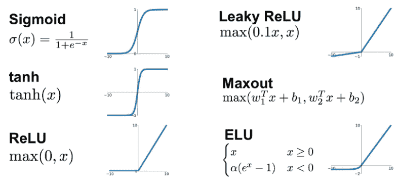

*Different activation functions and their graphs | [Source](https://web.archive.org/web/20230103154737/https://medium.com/@shrutijadon10104776/survey-on-activation-functions-for-deep-learning-9689331ba092)*

这是一个简单的神经网络的样子:

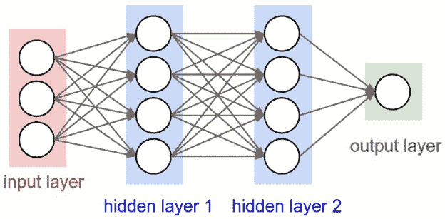

*Simple two layer Neural Network | [Source](https://web.archive.org/web/20230103154737/https://towardsdatascience.com/coding-neural-network-forward-propagation-and-backpropagtion-ccf8cf369f76)*

第一层称为输入层，最右边的一层是输出层。这两层之间的层称为隐藏层。在这个网络中，第一层感知器通过权衡输入做出决策。输出被馈送到第二层，依此类推，直到最后一层。

由于每个感知器都是通过权衡来自前一层的输入来做出决策，因此决策的复杂性会随着层的降低而增加。这样，多层感知器网络参与复杂的决策任务。一层的输出用作下一层的输入的神经网络称为**前馈网络**。

现在，我们知道什么是神经网络，所以让我们讨论它们如何学习给出正确的输出。当我们说网络学习时，这意味着通过计算或遵循一些过程，网络已经找到了正确的权重和偏差集，从而使其损失最小。

损失是目标和我们从 **w** 和 **b** 的值得到的预测输出之间的差异。我们的目标是最小化该误差，以获得最精确的 **w** 和**b**值。让我们使用均方误差函数来计算我们的误差函数。

计算均方误差有三个步骤:

1.  对于给定的 x，找出实际 y 值和预测 y 值之间的差值(y = wx + b)。
2.  平方这个差值。
3.  求 x 中每个值的平方的平均值。

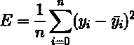

这里 yᵢ是实际值，ȳᵢ是预测值。让我们代入ȳᵢ:的值


所以我们求误差的平方，然后求平均值。因此得名均方误差。

为什么要引入误差函数？毕竟，我们主要感兴趣的不是网络正确分类的图像数量吗？为什么不尝试直接最大化这个数字，而不是最小化一个像误差函数这样的代理测量？

问题在于，正确分类的图像数量不是网络中权重和偏差的平滑函数。在大多数情况下，**对权重和偏差进行小的改变根本不会导致正确分类的训练图像的数量发生任何变化**。请进入[这个博客](https://web.archive.org/web/20230103154737/https://eng.libretexts.org/Bookshelves/Computer_Science/Book%3A_Neural_Networks_and_Deep_Learning_(Nielsen)/01%3A_Using_neural_nets_to_recognize_handwritten_digits/1.06%3A_Learning_with_gradient_descent)进一步阅读。

这使得很难找出如何改变权重和偏差来提高性能。如果我们改为使用平滑的成本函数，如上面定义的误差函数，则很容易找出如何对权重和偏差进行小的改变，以获得成本的改善。这就是为什么我们首先关注最小化误差函数，只有在这之后我们才会检查分类精度。

## 梯度下降

既然已经定义了损失函数，那就进入有趣的部分——最小化，求 **w** 和 **b.** 现在，梯度下降算法是一种求函数最小值的迭代优化算法。这里我们的函数是我们之前定义的误差函数。我将使用标量值解释梯度下降，并在稍后讨论图像分类时跳转到矩阵运算，因为图像基本上是一个矩阵。

让我们尝试对 **w** 和 **b** 应用梯度下降，并逐步接近它:

1.最初设 w = 4，b = 0。设 **L** 为我们的学习率。这控制了每一步 **w** 的值变化的程度。 **L** 可以是 0.0001 这样的小值，以获得良好的精度。请记住，权重 **w** 应始终随机初始化，而不是 1 或 0 [ [更多详情](https://web.archive.org/web/20230103154737/https://stackoverflow.com/questions/20027598/why-should-weights-of-neural-networks-be-initialized-to-random-numbers) ]

2.计算损失函数相对于 **w** 的偏导数，将 x、y、w、b 的当前值代入其中，得到导数值 **D** 。

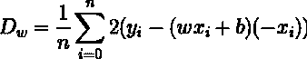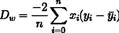

现在 Dw 是相对于 **w** 计算的值。让我们相对于 **b** 来计算 D，即 Db。

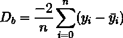

3.现在，我们使用以下等式更新 **w** 和 **b** 的当前值:

***w = w–L * D[w]***

***b = b–L * D[b]***

4.我们重复这个过程，直到我们的损失函数是一个非常小的值或理想的 0(这意味着 0 误差或 100%的准确性)。我们现在剩下的 **w** 和 **b** 的值将是最佳值。现在有了 **w** 和 **b** 的最佳值，我们的模型就可以进行预测了！请注意，找到最佳值的“正确集合”至关重要。请查看本文中的[以了解数据的过拟合和欠拟合，它们会干扰找到最佳值的“正确集合”。](https://web.archive.org/web/20230103154737/https://machinelearningmastery.com/overfitting-and-underfitting-with-machine-learning-algorithms/)

为了使梯度下降正确工作，我们需要选择一个足够小的学习速率 **L** ，以便上面的方程是一个很好的近似，但不能太小，否则梯度下降将工作得太慢。

梯度下降通常工作得非常好，在神经网络中，我们会发现这是最小化成本函数和帮助网络学习的一种强有力的方法。

现在，应用梯度下降规则有一个挑战。快速浏览一下误差函数:


告诉我们这是单个训练样本误差的平均值。实际上，为了计算梯度 **D** ，我们需要为每个训练输入 x 分别计算梯度 **D** x，然后将它们平均。不幸的是，当训练输入的数量非常大时，这可能需要很长时间，因此学习发生得很慢。

为了处理这个问题，可以使用*随机梯度下降*。这里，不是计算精确的梯度 **D，**，而是为随机选择的训练输入的小样本或小批量计算估计的梯度。通过对这个小批量求平均，我们可以很快得到真实梯度的良好估计，这有助于加速梯度下降和学习。

这与神经网络中的学习有什么联系？让 **w** 和 **b** 成为我们网络中的权重和偏差。随机梯度下降的工作原理是挑选出一个随机选择的小批训练输入，并用它们进行训练。然后它随机挑选出另一批，用这些来训练。这一直持续到训练输入被耗尽，也就是说完成了一个*时期*的训练。此时，一个新的训练时代开始了。

有一种计算误差函数梯度的快速算法，称为反向传播。

**反向传播**是关于改变网络中的权重和偏差如何改变误差函数。反向传播的目标是计算误差函数 **E** 相对于网络中任何权重 **w** 或偏差 **b** 的偏导数 Dw 和 db。

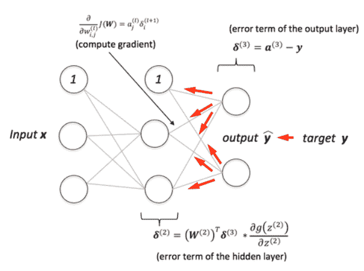

*Visual representation of backpropagation | [Source](https://web.archive.org/web/20230103154737/https://sebastianraschka.com/faq/docs/visual-backpropagation.html)*

为了计算这些，让我引入一个中间值δ^lT2 j，它将是 l ^第层中第 j ^第个神经元的误差。反向传播将给我们一个计算δl^(t【9】t 10】j 的过程，然后将与 Dw 和 Db 相关联。)

让我们来理解这个误差是如何影响我们的神经网络的。错误出现在第 l ^(层的第 j ^个个神经元上。当神经元的输入进来时，错误扰乱了神经元的操作。它给神经元的加权输入增加了一点变化∏e^l[j]，所以神经元输出的不是 y(e^lj)，而是 y(e^lj+∏e^lj)。这种变化通过网络中的后续层传播，最终导致总成本变化 D[e^lj]∏e^l[j]。)

反向传播基于四个基本方程:

1.**输出层错误**

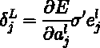

其中 E 是误差函数，σ是激活函数。∂e/∂a^lj 测量**t5】误差函数作为 j ^(th) 输出激活的函数变化有多快。第二项σ'e ^l [j] ，测量激活函数在 e^lj 的变化速度。为了简化，让我们把 E 看作一个向量，重写上面的表达式(等式 1):**

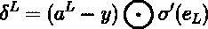

2.**误差就下一层的误差而言** **(等式 2)**

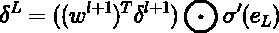

其中(w ^(l+1) ) ^T 是第(l+1)^(层的权重矩阵 w ^(l+1) 的转置。这看起来很复杂，但是让我来分解一下。假设我们知道第(l+1) ^(层的误差δ ^(l+1) 。当我们应用转置权重矩阵时，(w ^(l+1) ) ^T ，我们可以认为这是通过网络将误差向后移动，从而在第 l ^层层的输出端提供某种误差测量。然后我们取点积，O 代表点积。这通过层 l 中的激活函数向后移动误差，给出层 l 的加权输入中的误差δ ^l 。通过组合**(等式 1)** 和**(等式 2)** ，我们可以计算网络中任何层的误差δ ^l 。我们首先使用δ ^(L-1) ，然后再次使用**(等式 2)** 来计算δ ^(L-2) ，以此类推，一直通过网络返回。))

3.**误差函数相对于网络中任何偏差的变化率(等式 3)**

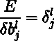

即误差**δ^(^l[j])正好等于变化率∂E / ∂b ^l [j] 。**(eq 1)****(eq 2)**已经给了我们δ ^(l [j]) 。我们可以把 **(eq 3)** 简化为:**

**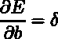

其中可以理解，δ在与偏差 **b.** 相同的神经元处被评估

4.**误差相对于网络中任何权重的变化率(等式 4)**

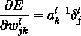

这显示了如何根据我们已经知道如何计算的量δ ^l 和 al-1 计算偏导数∂e/∂w^lJK。这里 a ^(l-1) 是神经元输入到权值 **w** 的激活，δ ^l 是神经元输出到权值**w**的误差通过查看 **(eq 4)，**我们可以说当a ^(l-1) ≈ 0 时，梯度项也会趋于小，这意味着权值学习得慢，或者梯度换句话说，我们可以说**(等式 4)** 的结果是低激活神经元输出的权重学习缓慢。

总之，现在你已经看到，如果输入神经元是低激活的，或者输出神经元已经饱和，即高或低激活，权重将学习缓慢。

这四个基本方程适用于任何激活函数，不仅仅是标准的 sigmoid 函数或我们在开始讨论的感知器。让我们以伪算法的形式写出来:

1.  **输入** x **:** 设置输入层对应的激活 a ¹ 。
2.  **前馈:**对于每个 l = 2，3，…，L 计算 e^L= w^La^(L-1)+b^L和 a ^l =σ(e ^l )。
3.  **输出误差δ ^L :** 计算矢量δ^L=∈[a]EOσ’(e^L)。
4.  **反向传播误差:**对于每个 l=L-1，L-2，…，2 计算δ^L=((w^(L+1))^Tδ^(L+1))oσ'(e^L)。
5.  **输出:**误差函数的梯度由∂e/∂w^lJK= a^(l-1)[k]^l[j]和∂e/∂b^l[j]=δ^(^l[j])给出。

检查该算法，您可以看到为什么它被称为 *back* propagation。我们从最后一层开始，反向计算误差向量**δ^L。看起来很奇怪，我们在网络中倒退。但是如果你考虑反向传播的证据，反向传播是成本是网络输出的函数这一事实的结果。为了理解成本如何随着先前的权重和偏差而变化，我们需要重复应用链式法则，通过各层反向工作以获得可用的表达式。如果你不熟悉链式法则，请看看这个由 Josh Starmer 制作的[视频。](https://web.archive.org/web/20230103154737/https://youtu.be/wl1myxrtQHQ)**

如果你仍然不清楚反向传播的本质，我建议你看看这个[视频](https://web.archive.org/web/20230103154737/https://youtu.be/Ilg3gGewQ5U)和这个[视频](https://web.archive.org/web/20230103154737/https://youtu.be/tIeHLnjs5U8)来了解反向传播演算。

对于博客的其余部分，我将使用 PyTorch 的 loss.backward()，因为它已经过优化。为了使用它，您需要使用 zero_grad()函数清除现有的渐变，否则渐变将会累积。

如何用 [Neptune-PyTorch 集成](https://web.archive.org/web/20230103154737/https://docs.neptune.ai/integrations-and-supported-tools/model-training/pytorch)跟踪模型训练元数据？

我们一直专注于前馈神经网络。现在，对于乳腺癌分类的任务，我们来看一个以图像分类闻名的神经网络。

## 什么是卷积神经网络？它们是如何工作的？

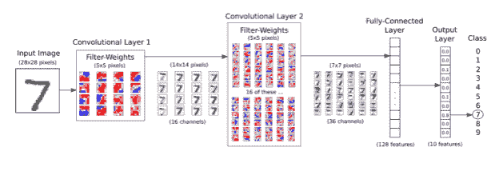

*MNIST Data flow in CNN | [Source](https://web.archive.org/web/20230103154737/https://github.com/Hvass-Labs/TensorFlow-Tutorials/blob/master/02_Convolutional_Neural_Network.ipynb)*

先说为什么我们需要卷积神经网络(ConvNets，CNN)而不是前馈神经网络。

考虑一个小图像，大小为 100100。对于前馈神经网络，第二层中的每个神经元有 10000 个权重。这使得网络容易过拟合数据。还有，把图像扁平化，缩小到 10000 权重，就失去了图像的本质。

CNN 是前馈神经网络(全连接神经网络)的正则化版本。常规的正则化方法包括随着损失函数的最小化而改变权重，同时随机调整连通性。

CNN 利用图像数据中的分层模式；在每一层中，它们捕捉小的局部特征(相对于前一层)，但是随着深度的增加，这些特征相对于输入图像的复杂性增加。因此，这种局部过滤器(在一个小区域上局部连接的神经元)的堆叠使 CNN 能够捕捉复杂和空间不变的特征，如狗、猫、汽车等。与完全连接的网络相比，具有较少数量的可训练参数。我们可以说，它们在从图像中捕捉相关特征方面比完全连接的网络更有效。要了解更多关于 CNN 在图像分类中的重要性，请看这个由计算机爱好者制作的[视频。](https://web.archive.org/web/20230103154737/https://youtu.be/py5byOOHZM8)

卷积神经网络是一种特殊类型的神经网络，它在至少一层中使用卷积(滤波器/内核与输入图像卷积以生成激活)而不是常规的矩阵乘法。CNN 的架构类似于全连接神经网络的架构。有一个输入层，隐藏层和最终输出层。

这里，隐藏层执行卷积。接下来是执行其他功能的其他层，如汇集层、全连接层和标准化层。让我们详细看看这些部分。

### 卷积层

正如我前面提到的，卷积发生在隐藏层中。准确地说，核心或者我们这里称之为滤波器，移动到图像中的不同位置，改变图像上卷积的步幅。对于过滤器的每个位置，计算过滤器和过滤器下的图像像素之间的点积，这导致输出图像中的单个像素。

因此，在整个输入图像上移动滤波器会产生新的图像。这些图像被称为特征地图。在第一卷积层中生成的特征图被下采样。这些特征图然后通过第二卷积层。这里，对于这些新生成的图像中的每一个，需要滤波器权重。结果图像被进一步下采样。如果你有兴趣深入了解卷积如何作用于图像，可以参考这篇关于执行卷积运算的[博客。](https://web.archive.org/web/20230103154737/https://developer.apple.com/library/archive/documentation/Performance/Conceptual/vImage/ConvolutionOperations/ConvolutionOperations.html)

### 汇集层

现在，除了通过改变卷积的步幅来进行下采样，还有其他可靠的方法来对图像进行下采样，如使用池层。池层通过将一层的神经元簇的输出合并到下一层的单个神经元中来减少数据维度。本地池合并小型集群，通常为 2 x 2。这进一步降低了分辨率。有两种类型的池:

1.  最大池化–为每个特征图选取前一层的每个神经元簇的最大值
2.  平均池化–为每个特征图选取每个神经元集群的平均值

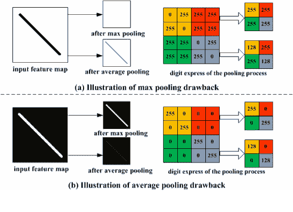

*Difference between max pooling and average pooling | [Source](https://web.archive.org/web/20230103154737/https://www.researchgate.net/figure/Toy-example-illustrating-the-drawbacks-of-max-pooling-and-average-pooling_fig2_300020038)*

最大池通常是首选，因为它执行去噪和降维。

汇集有助于提取位置不变的主要特征。此外，维度的减少降低了处理数据所需的计算能力。

### 完全连接的层

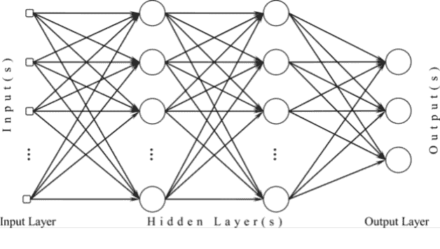

*A three layer fully connected multilayer perceptron structure that is identical to a fully connected layer in convolutional neural networks with only difference being the input layer | [Source](https://web.archive.org/web/20230103154737/https://www.mdpi.com/1424-8220/10/9/8363/htm)*

最后一层是一个完全连接的层，它对我们的图像进行分类。卷积网络的输出然后被展平成列向量，并被馈送到完全连接的神经网络；反向传播应用于训练的每次迭代。

在一系列时期内，该模型能够区分图像中的主要和低级特征，并使用 **softmax 分类**技术对其进行分类。我不会详细介绍 softmax，但用几句话来说，softmax 分类器给出了每个类别的概率。要了解更多关于 softmax 分类的信息，请浏览 Adrian Rosebrock 的[博客，他在博客中精彩地解释了 softmax 分类。](https://web.archive.org/web/20230103154737/https://www.pyimagesearch.com/2016/09/12/softmax-classifiers-explained/)

## CNN 代码

现在，我们已经完成了基本知识，让我们构建自己的 CNN，看看它在 MNIST 数据集上的表现如何，在 Colab 中使用 Pytorch，使用 GPU。

首先，导入库。

```py
import torch
import torchvision
import torchvision.transforms as transforms
import torch.nn as nn
import torch.nn.functional as F
```

下载培训和测试数据集。

```py
transform = transforms.Compose(
    [transforms.ToTensor(),
     transforms.Normalize((0.5,), (0.5,))]
    )
trainset = torchvision.datasets.MNIST(
    root='./data', train=True, download=True, transform=transform)
trainloader = torch.utils.data.DataLoader(trainset, batch_size=64,
                                          shuffle=True, num_workers=2)
```

```py
testset = torchvision.datasets.MNIST(
    root='./data', train=False, download=True, transform=transform)
testloader = torch.utils.data.DataLoader(testset, batch_size=20,
                                         shuffle=False, num_workers=2)
```

让我们想象一下我们将要用作输入的训练图像。

```py
import matplotlib.pyplot as plt
import numpy as np

def imshow(img):
    npimg = img.numpy()
    plt.imshow(np.transpose(npimg, (1, 2, 0)))
    plt.show()

dataiter = iter(trainloader)
images, labels = dataiter.next()

imshow(torchvision.utils.make_grid(images[:6], nrow=3))
```

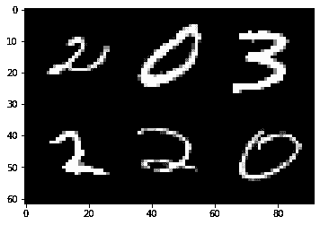

```py
device = torch.device('cuda' if torch.cuda.is_available() else "cpu")
```

现在，是时候建立我们的 cnn 了。

```py
class NumClassifyNet(nn.Module):
  def __init__(self):
    super(NumClassifyNet, self).__init__()

    self.conv1 = nn.Conv2d(1, 16, kernel_size=5)
    self.conv2 = nn.Conv2d(16, 32, kernel_size=5)
    self.pool = nn.MaxPool2d(2, 2)
    self.fc1 = nn.Linear(512, 120)
    self.fc2 = nn.Linear(120, 10)

  def forward(self, x):
    x = self.pool(F.relu(self.conv1(x)))
    x = self.pool(F.relu(self.conv2(x)))
    x = x.view(-1, self.flat_features(x))
    x = F.relu(self.fc1(x))
    x = self.fc2(x)
    return x

  def flat_features(self, x):
    size = x.size()[1:]
    num_features = 1
    for s in size:
      num_features *= s
    return num_features

net = NumClassifyNet()
net = net.to(device)
```

```py
import torch.optim as optim

criterion = nn.CrossEntropyLoss()
optimizer = optim.SGD(net.parameters(), lr = 0.001)
```

是时候让模型接受训练了！

```py
test_data_iter = iter(testloader)
test_images, test_labels = test_data_iter.next()
for epoch in range(10):
  running_loss = 0
  for i, data in enumerate(trainloader, 0):
    input_imgs, labels = data
    optimizer.zero_grad()
    input_imgs = input_imgs.to(device)
    labels = labels.to(device)
    outputs = net(input_imgs)
    loss = criterion(outputs, labels)
    loss.backward()
    optimizer.step()

    running_loss += loss.item()
    if i % 1000 == 0:
      print('epoch', epoch+1, 'loss', running_loss/1000)
      imshow(torchvision.utils.make_grid(test_images[0].detach()))
      test_out = net(test_images.to(device))
      _, predicted_out = torch.max(test_out, 1)
      print('Predicted : ', ' '.join('%5s' % predicted_out[0]))
print('Training finished')
```

我们上一个巴赫的输出是:

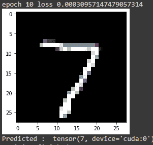

损失少，预测准确，现在可以停止训练，用这个模型做预测了。

整个测试集达到的精度为:

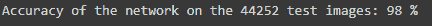

## 使用 CNN 的乳腺癌分类

### 关于数据集的信息:乳腺组织病理学图像

乳腺组织病理学图片可以从 [Kaggle 的网站](https://web.archive.org/web/20230103154737/https://www.kaggle.com/paultimothymooney/breast-histopathology-images)下载。图像数据由 1，77，010 个 50×50 像素的小块组成，提取自以 40°扫描的乳腺癌样本的 162 个完整载片图像。数据包含阴性和阳性样本的图像。

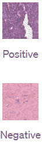

让我们把数据从 kaggle 下载到我们的硬盘上，这样我们就可以使用它了。我发现文档含糊不清，所以我将用自己的话来解释如何做。希望有帮助。这是一次性设置:

1.**设置 Kaggle API 访问:**收集您的 Kaggle API 访问令牌。导航到您的 Kaggle 个人资料“帐户”页面。找到“创建您的 API 令牌”。下载包含用户名和密钥的 JSON 文件形式的令牌。

2.**在 Drive 中保存 API 令牌:**在你的 Google Drive 中为 Kaggle 创建一个文件夹。将 API 令牌的副本作为私有文件保存在该文件夹中，以便于访问。

3.将 Google Drive 安装到 Colab :这将确保您不必在每次重启运行时下载数据。

```py
from google.colab import drive
drive.mount('/content/gdrive')
```

4.**使用操作系统**配置“Kaggle 环境”:这将把 API 键和值存储为操作系统环境对象[t](https://web.archive.org/web/20230103154737/https://www.geeksforgeeks.org/python-os-environ-object/)/变量。当您运行 Kaggle 终端命令时(在下一步中)，您的机器将通过您的 API 令牌链接到您的帐户。链接到驱动器中的私有目录可以确保您的令牌信息保持隐藏。

```py
import os
os.environ['KAGGLE_CONFIG_DIR'] = "/content/gdrive/MyDrive/kaggle"
```

5.**下载数据**

```py
os.chdir('../content/gdrive/MyDrive/kaggle')
!kaggle datasets download -d paultimothymooney/breast-histopathology-images
```

现在我们有了数据集，让我们开始构建我们的网络吧！

```py
import torch
import torchvision
from torchvision import transforms
from torchvision.datasets import ImageFolder
import torch.nn as nn
import torch.nn.functional as F
from torch.utils.data import random_split
import torch.optim as optim
from collections import Counter
import matplotlib.pyplot as plt
import numpy as np
```

将图像转换为张量。

```py
data_dir = "/content/gdrive/MyDrive"
folder_name = "kaggle"
image_folders = os.path.join(data_dir, folder_name)

transform = transforms.Compose([transforms.Resize((50, 50)), transforms.ToTensor()])
images = []
for file in os.listdir(image_folders):
    try:
      images.append(ImageFolder(os.path.join(image_folders, file), transform=transform))
    except:
      print(file)
datasets = torch.utils.data.ConcatDataset(images)
```

检查数据集，找出每个类中的样本数。

```py
i=0
for dataset in datasets.datasets:
    if i==0:
        result = Counter(dataset.targets)
        i += 1
    else:
        result += Counter(dataset.targets)

result = dict(result)
print("""Total Number of Images for each Class:
    Class 0 (No Breast Cancer): {}
    Class 1 (Breast Cancer present): {}""".format(result[0], result[1]))
```

输出:

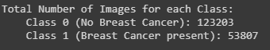

现在，将数据集分成 75%的训练集和 25%的测试集。

```py
random_seed = 42
torch.manual_seed(random_seed)

test_size = int(0.25*(result[0]+result[1]))
print(test_size)
train_size = len(datasets) - test_size
train_dataset, test_dataset = random_split(datasets, [train_size, test_size])
```

```py
trainloader = torch.utils.data.DataLoader(train_dataset, batch_size=128,
                                          shuffle=True, num_workers=2)
testloader = torch.utils.data.DataLoader(test_dataset, batch_size=64,
                                         shuffle=False, num_workers=2)
```

现在，看看我们的数据集。

```py

def imshow(img):
    npimg = img.numpy()
    plt.imshow(np.transpose(npimg, (1, 2, 0)))
    plt.show()

dataiter = iter(trainloader)
images, labels = dataiter.next()

imshow(torchvision.utils.make_grid(images[:6], nrow=3))

labels[:6]
```

输出:

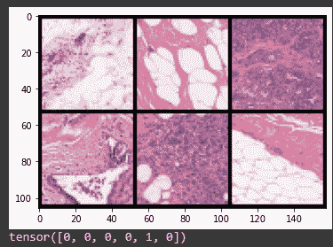

使用 GPU。

```py
device = torch.device('cuda' if torch.cuda.is_available() else "cpu")
```

建立乳腺癌分类神经网络。

```py
class BreastCancerClassifyNet(nn.Module):
  def __init__(self):
    super(BreastCancerClassifyNet, self).__init__()
    self.conv1 = nn.Conv2d(3, 64, kernel_size=3)
    self.conv2 = nn.Conv2d(64, 128, kernel_size=3)
    self.conv3 = nn.Conv2d(128, 256, kernel_size=3)
    self.pool = nn.MaxPool2d(2, 2)
    self.fc1 = nn.Linear(4096, 1024)
    self.fc2 = nn.Linear(1024, 512)
    self.fc3 = nn.Linear(512, 1)

  def forward(self, x):
    x = self.pool(F.relu(self.conv1(x)))
    x = self.pool(F.relu(self.conv2(x)))
    x = self.pool(F.relu(self.conv3(x)))
    x = x.view(-1, self.flat_features(x))
    x = F.relu(self.fc1(x))
    x = F.relu(self.fc2(x))
    x = self.fc3(x)
    x = F.log_softmax(x)
    return x

  def flat_features(self, x):
    size = x.size()[1:]
    num_features = 1
    for s in size:
      num_features *= s
    return num_features

net = BreastCancerClassifyNet()
net = net.to(device)
```

使用二元交叉熵损失，就像我们做二元分类一样。

```py
criterion = nn.BCELoss()
optimizer = optim.SGD(net.parameters(), lr = 0.001)
```

该训练了！

```py
test_data_iter = iter(testloader)
test_images, test_labels = test_data_iter.next()
for epoch in range(20):
  running_loss = 0
  for i, data in enumerate(trainloader, 0):
    input_imgs, labels = data
    input_imgs = input_imgs.to(device)
    labels = labels.to(device)
    optimizer.zero_grad()
    outputs = net(input_imgs)
    labels = labels.unsqueeze(1).float()
    loss = criterion(outputs, labels)
    loss.backward()
    optimizer.step()

    running_loss += loss.item()
    if i % 10000 == 0:
      print('epoch', epoch+1, 'loss', running_loss/10000)
      imshow(torchvision.utils.make_grid(test_images[0].detach()))
      test_out = net(test_images.to(device))
      _, predicted_out = torch.max(test_out, 1)
      print('Predicted : ', ' '.join('%5s' % predicted_out[0]))
print('Training finished')
```

最后，在所有数据集上测试我们训练的模型并计算准确性。

```py
correct = 0
total = 0
with torch.no_grad():
  for data in testloader:
    test_images, test_labels = data
    test_out = net(test_images.to(device))
    _, predicted = torch.max(test_out.data, 1)
    total += test_labels.size(0)
    for _id, out_pred in enumerate(predicted):
      if int(out_pred) == int(test_labels[_id]):
        correct += 1

print('Accuracy of the network on the 44252 test images: %d %%' % (
        100 * correct / total))
```

输出:

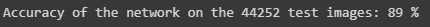

现在，这个精度似乎比我们之前达到的要低，但是请注意，我们使用了一个更复杂的数据集，并且我们从头开始构建了这个模型。尽管如此，我们仍然达到了 20 个时期的良好精度。

为了实现更高的准确性，您可以使用在数百万数据集上训练的预训练网络作为基础，并在此基础上构建您的分类模型，即通过应用迁移学习。

## 结论

我们从定义神经网络发展到建立自己的乳腺癌分类神经网络。让我们回顾一下我们所学的内容:

*   我们首先研究了神经网络的定义。神经元代表什么，它们是如何形成网络的？
*   然后转到他们是如何工作的。简要了解激活函数后，我们进入误差函数，以及梯度下降如何帮助减少误差。
*   我们进一步研究了反向传播，我对它的数学做了简单的解释。
*   然后我们转向 CNN 及其每一层，然后从头开始构建我们自己的 CNN 来对 MNIST 数据集进行分类。
*   凭借我们对神经网络的集体知识，我们为**乳腺癌分类**建立了自己的神经网络。

### 资源

我向您展示了如何构建自己的乳腺癌分类网络，但我希望这篇博客将有助于为任何数据集构建自己的分类神经网络。

我希望你喜欢这次旅行！感谢阅读。**