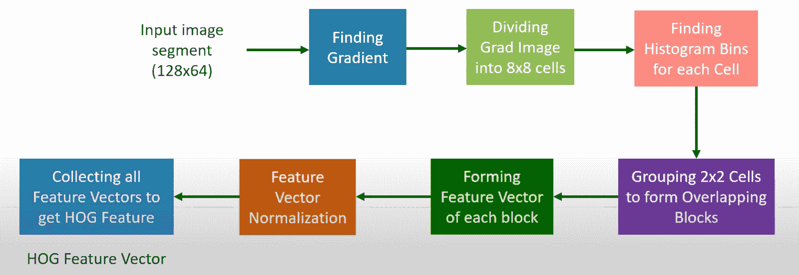
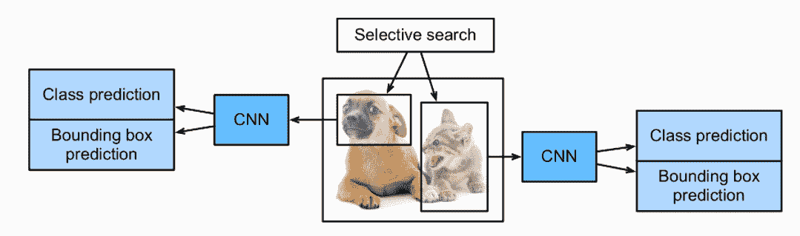
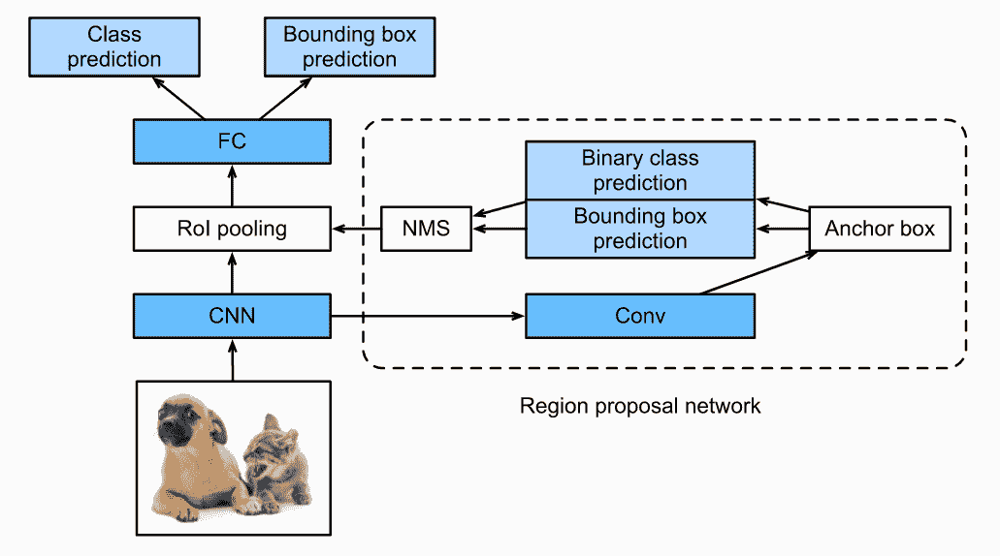
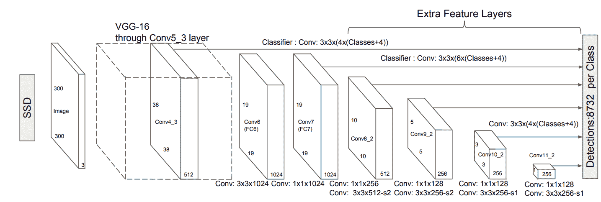
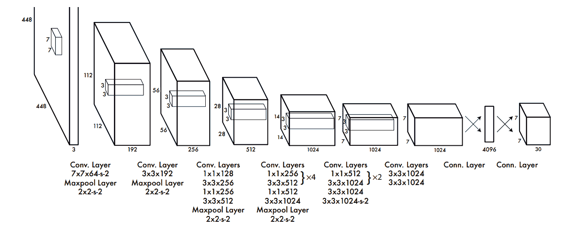
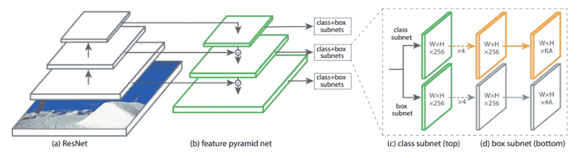

# 对象检测算法和库

> 原文：<https://web.archive.org/web/https://neptune.ai/blog/object-detection-algorithms-and-libraries>

对象检测在图像中找到并识别事物，这是深度学习和图像处理的最大成就之一。为对象创建本地化的一种常用方法是借助边界框。您可以训练一个对象检测模型来识别和检测多个特定对象，因此它是通用的。

[物体检测](https://web.archive.org/web/20221208033052/https://machinelearningmastery.com/object-recognition-with-deep-learning/)模型通常被训练来检测特定物体的存在。所构建的模型可用于图像、视频或实时操作。即使在深度学习方法和现代图像处理技术之前，对象检测也有很高的兴趣范围。某些方法(如 SIFT 和 HOG 及其特征和边缘提取技术)在对象检测方面取得了成功，该领域的其他竞争者相对较少。

随着卷积[神经网络](/web/20221208033052/https://neptune.ai/blog/neural-network-guide)(CNN)的引入和计算机视觉技术的适应，对象检测在当前一代变得更加普遍。具有深度学习方法的对象检测的新浪潮打开了看似无限的可能性。

对象检测利用每个类的特殊和唯一属性来识别所需的对象。在寻找正方形形状时，对象检测模型可以寻找将导致正方形形状的垂直角，每个边具有相同的长度。在寻找圆形对象时，对象检测模型将寻找中心点，从这些中心点可以创建特定的圆形实体。这种识别技术用于面部识别或物体跟踪。

在这篇文章中，我们将探索不同的对象检测算法和库，但首先，一些基础知识。

## 物体检测用在哪里？

在我们的日常生活中，物体检测已经无处不在。比如你的智能手机用人脸检测解锁的时候。或者在商店或仓库的视频监控中，它可以识别可疑活动。

以下是物体检测的几个主要应用:

*   **车牌识别**–使用物体检测和光学字符识别(OCR)技术来识别车辆上的字母数字字符。您可以使用对象检测来捕捉图像并检测特定图像中的车辆。一旦模型检测到车牌，OCR 技术就会将二维数据转换成机器编码的文本。
*   **[人脸检测和识别](/web/20221208033052/https://neptune.ai/blog/create-a-face-recognition-application)**——如前所述，物体检测的主要应用之一是人脸检测和识别。在现代算法的帮助下，我们可以检测图像或视频中的人脸。由于一次性学习方法，现在甚至可以只用一张经过训练的图像来识别人脸。
*   **[物体追踪](/web/20221208033052/https://neptune.ai/blog/dive-into-football-analytics-with-tensorflow-object-detection-api)**——观看棒球或板球比赛时，球可能会打到很远的地方。在这些情况下，跟踪球的运动以及它所经过的距离是很好的。为此，目标跟踪可以确保我们获得关于球运动方向的连续信息。
*   **[自动驾驶汽车](/web/20221208033052/https://neptune.ai/blog/self-driving-cars-with-convolutional-neural-networks-cnn)**——对于自动驾驶汽车来说，在驾驶时研究汽车周围的不同元素至关重要。在多个类别上训练以识别不同实体的对象检测模型对于自主车辆的良好性能变得至关重要。
*   **机器人**–许多任务，如提升重物、取放操作以及其他实时工作都由机器人完成。物体检测对于机器人检测事物和自动化任务是必不可少的。

## 目标检测算法

自从深度学习在 2010 年代早期普及以来，用于解决对象检测的算法的质量一直在不断进步和提高。我们将探索最流行的算法，同时了解它们的工作原理、优点以及它们在特定场景中的缺陷。

### 1.方向梯度直方图(HOG)

#### →简介

[方向梯度直方图](https://web.archive.org/web/20221208033052/https://towardsdatascience.com/hog-histogram-of-oriented-gradients-67ecd887675f)是最古老的物体检测方法之一。它于 1986 年首次推出。尽管在接下来的十年中有一些发展，但这种方法直到 2005 年才开始在许多与计算机视觉相关的任务中使用。HOG 使用特征提取器来识别图像中的对象。

HOG 中使用的特征描述符是图像的一部分的表示，我们只提取最必要的信息，而忽略其他任何东西。特征描述符的功能是将图像的整体大小转换成数组或特征向量的形式。在 HOG 中，我们使用梯度方向过程来定位图像的最关键部分。

#### →架构概述

*HOG – Object Detection Algorithm | [Source](https://web.archive.org/web/20221208033052/https://www.youtube.com/watch?v=QmYJCxJWdEs)*

在我们理解 HOG 的整体架构之前，先来看看它是如何工作的。对于图像中的特定像素，通过考虑垂直和水平值来计算梯度的直方图，以获得特征向量。借助于梯度幅度和梯度角度，我们可以通过探索水平和垂直环境中的其他实体来获得当前像素的明确值。

如上图所示，我们将考虑一个特定大小的图像片段。第一步是通过将图像的整个计算分成 8×8 个单元的梯度表示来找到梯度。在获得的 64 个梯度向量的帮助下，我们可以将每个单元分割成角度箱，并计算特定区域的直方图。该过程将 64 个向量的大小减少到 9 个值的较小大小。

一旦我们获得每个单元的 9 点直方图值(仓)的大小，我们就可以选择为单元块创建重叠。最后的步骤是形成特征块，归一化获得的特征向量，并收集所有的特征向量以获得整体 HOG 特征。查看以下链接了解更多信息:[【1】](https://web.archive.org/web/20221208033052/https://www.youtube.com/watch?v=QmYJCxJWdEs)和[【2】](https://web.archive.org/web/20221208033052/https://www.youtube.com/watch?v=XmO0CSsKg88)。

#### HOG 的成就

1.  创建对执行对象检测有用的特征描述符。
2.  能够与支持向量机(SVMs)相结合，实现高精度的物体检测。
3.  为每个位置的计算创建滑动窗口效果。

#### →需要考虑的要点

1.  **限制**–虽然梯度方向直方图(HOG)在物体检测的初始阶段具有革命性，但这种方法存在许多问题。对于图像中复杂的像素计算来说，这是非常耗时的，并且在某些空间较紧的对象检测场景中是无效的。
2.  **什么时候用 HOG？**–HOG 应经常被用作对象检测的第一种方法，以测试其他算法及其各自的性能。无论如何，HOG 在大多数对象检测和面部标志识别中具有相当高的准确度。
3.  **示例用例**–HOG 最受欢迎的用例之一是行人检测，因为它边缘平滑。其他一般应用包括特定对象的对象检测。更多信息，请参考下面的[链接](https://web.archive.org/web/20221208033052/https://stackoverflow.com/questions/17159885/histogram-of-oriented-gradients-object-detection)。

### 2.基于区域的卷积神经网络

#### →简介

[基于区域的卷积神经网络](https://web.archive.org/web/20221208033052/https://medium.com/@selfouly/r-cnn-3a9beddfd55a)是对之前 HOG 和 SIFT 方法的对象检测过程的改进。在 R-CNN 模型中，我们试图通过使用选择性特征来提取最基本的特征(通常大约 2000 个特征)。选择最重要的提取的过程可以在选择性搜索算法的帮助下计算，该算法可以实现这些更重要的区域提议。

#### →R-CNN 的工作过程

*R-CNN – Object Detection Algorithm | [Source](https://web.archive.org/web/20221208033052/https://d2l.ai/chapter_computer-vision/rcnn.html)*

用于选择最重要的区域建议的选择性搜索算法的工作程序是确保您在特定图像上生成多个子分割，并为您的任务选择候选条目。然后，可以利用贪婪算法来相应地组合有效条目，用于循环过程，以将较小的片段组合成合适的较大片段。

一旦选择性搜索算法成功完成，我们接下来的任务就是提取特征并做出适当的预测。然后，我们可以做出最终的候选提议，并且卷积神经网络可以用于创建 n 维(2048 或 4096)特征向量作为输出。在预先训练好的卷积神经网络的帮助下，我们可以轻松地完成特征提取的任务。

R-CNN 的最后一步是对图像进行适当的预测，并相应地标记相应的边界框。为了获得每个任务的最佳结果，通过计算每个任务的分类模型来进行预测，同时使用回归模型来校正提议区域的边界框分类。有关该主题的更多阅读和信息，请参考以下[链接](https://web.archive.org/web/20221208033052/https://towardsdatascience.com/r-cnn-fast-r-cnn-faster-r-cnn-yolo-object-detection-algorithms-36d53571365e)。

#### →R-CNN 的问题

1.尽管利用预先训练的 CNN 模型产生了有效的特征提取结果，但是利用当前算法提取所有区域提议以及最终最佳区域的整体过程极其缓慢。
2。R-CNN 模型的另一个主要缺点不仅是训练速度慢，而且预测时间长。该解决方案需要使用大量的计算资源，增加了该过程的整体可行性。因此，整体架构可以认为是相当昂贵的。
3。有时，由于在这一特定步骤中缺乏改进，在初始步骤中可能会出现糟糕的候选人选择。这可能会导致训练模型中的许多问题。

#### →需要考虑的要点

1.  **何时使用 R-CNN？**–与 HOG 物体检测方法类似的 R-CNN 必须用作测试物体检测模型性能的第一基线。预测图像和物体所花费的时间可能比预期的要长一点，所以通常更现代版本的 R-CNN 更受欢迎。
2.  **示例用例**–R-CNN 有几种应用，用于解决与对象检测相关的不同类型的任务。例如，从无人机安装的摄像头跟踪对象，在图像中定位文本，以及在谷歌镜头中启用对象检测。查看以下[链接](https://web.archive.org/web/20221208033052/https://en.wikipedia.org/wiki/Region_Based_Convolutional_Neural_Networks)了解更多信息。

### 3.更快的 R-CNN

#### →简介

虽然 R-CNN 模型能够执行对象检测的计算并获得期望的结果，但是有一些主要的不足之处，尤其是模型的速度。因此，必须引入更快的方法来解决这些问题，以克服 R-CNN 中存在的问题。首先，快速 R-CNN 被引入以对抗 R-CNN 的一些预先存在的问题。

在快速 R-CNN 方法中，整个图像通过预先训练的卷积神经网络，而不是考虑所有的子片段。感兴趣区域(RoI)池是一种特殊的方法，它采用预训练模型和选择性搜索算法的两个输入来提供一个具有输出的全连接图层。在本节中，我们将了解更快的 R-CNN 网络，它是对快速 R-CNN 模型的改进。

#### →了解更快的 R-CNN

*Faster R-CNN – Object Detection Algorithm | [Source](https://web.archive.org/web/20221208033052/https://d2l.ai/chapter_computer-vision/rcnn.html)*

更快的 R-CNN 模型是 R-CNN 家族中最好的版本之一，与它的前辈相比极大地提高了性能速度。虽然 R-CNN 和快速 R-CNN 模型利用选择性搜索算法来计算区域提议，但是更快的 R-CNN 方法用更好的区域提议网络来代替这种现有方法。区域提议网络(RPN)计算来自大范围和不同尺度的图像，以产生有效的输出。

区域建议网络减少了边缘计算时间，通常每幅图像 10 ms。这个网络由卷积层组成，从中我们可以获得每个像素的基本特征图。对于每个特征地图，我们有多个锚定框，它们具有不同的比例、不同的大小和纵横比。对于每个锚定框，我们对特定的二进制类进行预测，并为其生成一个边界框。
来自非最大抑制的输出通过感兴趣的区域，并且其余的过程和计算类似于快速 R-CNN 的工作。

#### →需要考虑的要点

1.  **限制**–更快的 R-CNN 方法的主要限制之一是不同对象的命题中的时间延迟量。有时，速度取决于所用系统的类型。
2.  **什么时候用更快的 R-CNN？**–与其他 CNN 方法相比，预测时间更快。虽然 R-CNN 通常需要大约 40-50 秒来预测图像中的对象，但快速 R-CNN 需要大约 2 秒，但更快的 R-CNN 只需大约 0.2 秒即可返回最佳结果。
3.  **用例示例**–更快 R-CNN 的用例示例与 R-CNN 方法中描述的相似。然而，有了更快的 R-CNN，我们可以更好地执行这些任务，更有效地取得成果。

### 4.单发探测器(SSD)

#### →简介

用于多框预测的[单次检测器](https://web.archive.org/web/20221208033052/https://towardsdatascience.com/review-ssd-single-shot-detector-object-detection-851a94607d11)是实现物体检测任务实时计算的最快方法之一。虽然更快的 R-CNN 方法可以实现高精度的预测，但是整个过程非常耗时，并且需要实时任务以大约每秒 7 帧的速度运行，这是远远不理想的。

单镜头检测器(SSD)通过将每秒帧数提高到比更快的 R-CNN 模型快近五倍来解决这个问题。它不再使用区域建议网络，而是使用多尺度特征和默认框。

#### →架构概述

*SSD – Object Detection Algorithm | [Source](https://web.archive.org/web/20221208033052/https://arxiv.org/pdf/1512.02325.pdf)*

单次触发多盒探测器架构可分为三个主要部分。单次检测器的第一阶段是特征提取步骤，选择所有关键的特征图。这个架构区域仅由完全卷积层组成，没有其他层。提取完所有的本质特征图后，接下来就是检测人头的过程。这一步也包括完全卷积神经网络。

然而，在探测头的第二阶段，任务不是找到图像的语义。相反，主要目标是为所有特征图创建最合适的边界图。一旦我们计算了两个基本阶段，最后一个阶段是使其通过非最大抑制层，以减少由重复的边界框引起的错误率。

#### →固态硬盘的局限性

1.  SSD 虽然显著提升了性能，但会降低图像的分辨率，从而降低图像质量。
2.  对于小规模对象，SSD 架构的性能通常比更快的 R-CNN 差。

#### →需要考虑的要点

1.  **什么时候用 SSD？**–单次检测器通常是首选方法。使用单次检测器的主要原因是因为我们更喜欢对图像进行更快的预测，以检测更大的对象，在这种情况下精度不是非常重要的问题。然而，为了更准确地预测更小和更精确的物体，必须考虑其他方法。
2.  **示例用例**–单次检测器可以在多种数据集上进行训练和实验，如 PASCAL VOC、COCO 和 ILSVRC 数据集。它们可以很好地执行较大的对象检测，如人、桌子、椅子和其他类似实体的检测。

### 5.YOLO(你只看一眼)

#### →简介

你只看一次( [YOLO](https://web.archive.org/web/20221208033052/https://pjreddie.com/darknet/yolo/) )是物体检测最流行的模型架构和算法之一。通常，在谷歌上搜索物体检测算法的第一个概念是 YOLO 架构。YOLO 有几个版本，我们将在接下来的章节中讨论。YOLO 模型使用最好的神经网络原型之一来产生高精度和整体处理速度。这种速度和准确性是其受欢迎的主要原因。

#### →YOLO 的工作过程

*YOLO – Object Detection Algorithm | [Source](https://web.archive.org/web/20221208033052/https://arxiv.org/pdf/1506.02640.pdf)*

YOLO 体系结构利用三个主要术语来实现其目标检测。理解这三种技术对于了解为什么与其他对象检测算法相比，该模型执行得如此快速和准确是非常重要的。YOLO 模型中的第一个概念是残差块。在第一个建筑设计中，他们使用 7×7 的剩余块在特定的图像中创建网格。

这些网格中的每一个充当中心点，并且相应地对这些网格中的每一个做出特定的预测。在第二种技术中，考虑特定预测的每个中心点来创建边界框。虽然分类任务对每个格网都很有效，但是为每个预测分离边界框会更复杂。第三种也是最后一种技术是使用并集的交集(IOU)来计算特定对象检测任务的最佳边界框。

#### →YOLO 的优势

1.  YOLO 的计算和处理速度是相当高的，特别是与大多数其他训练方法和目标检测算法相比实时性更好。
2.  除了快速的计算速度之外，YOLO 算法还设法提供整体的高精度，同时减少了在其他方法中看到的背景误差。
3.  YOLO 的建筑允许模型更有效地学习和发展对众多物体的理解。

#### →YOLO 的局限性

1.  由于召回率较低，无法检测图像或视频中的较小对象。
2.  由于边界框的限制，无法检测两个彼此非常接近的对象。

#### →YOLO 的版本

YOLO 架构是最有影响力和最成功的对象检测算法之一。随着 2016 年 YOLO 架构的推出，他们的连续版本 YOLO v2 和 YOLO v3 于 2017 年和 2018 年问世。虽然 2019 年没有新版本，但 2020 年有三个快速版本:YOLO v4、YOLO v5 和 PP-YOLO。YOLO 的每一个新版本都比前一个版本稍有改进。微小的 YOLO 也被发布，以确保嵌入式设备可以支持对象检测。

#### →需要考虑的要点

1.  什么时候使用 YOLO？–虽然之前讨论的所有方法在图像和视频目标检测分析中表现都很好，但 YOLO 架构是实时目标检测的首选方法之一。它在大多数实时处理任务上实现了很高的准确性，具有相当快的速度和每秒帧数，具体取决于运行该程序的设备。
2.  **示例用例**–除了对众多对象进行对象检测之外，YOLO 架构的一些流行用例还包括车辆检测、动物检测和人员检测。更多信息，请参考以下[链接](https://web.archive.org/web/20221208033052/https://www.pixelsolutionz.com/application-of-yolo-in-real-life/)。

### 6.RetinaNet

#### →简介

2017 年推出的 [RetinaNet](https://web.archive.org/web/20221208033052/https://towardsdatascience.com/review-retinanet-focal-loss-object-detection-38fba6afabe4) 模型成为这段时间内单次物体检测能力能够超越其他流行物体检测算法的最佳模型之一。当 RetinaNet 架构发布时，对象检测能力超过了 Yolo v2 和 SSD 模型。在保持与这些型号相同的速度的同时，它还能够在准确性方面与 R-CNN 家族竞争。由于这些原因，RetinaNet 模型在通过卫星图像探测物体方面有很高的使用率。

#### →架构概述

*RetineNet – Object Detection Algorithm | [Source](https://web.archive.org/web/20221208033052/https://arxiv.org/pdf/1708.02002.pdf)*

RetinaNet 架构的构建方式使得以前的单次检测器问题得到某种程度的平衡，从而产生更有效和高效的结果。在这种模型架构中，以前模型中的交叉熵损失被焦点损失代替。焦点损耗处理 YOLO 和 SSD 等架构中存在的[类不平衡问题](/web/20221208033052/https://neptune.ai/blog/how-to-deal-with-imbalanced-classification-and-regression-data)。RetinaNet 模型是三个主要实体的组合。

RetinaNet 使用三个因素构建，即 ResNet 模型(特别是 ResNet-101)、特征金字塔网络(FPN)和焦点损失。特征金字塔网络是克服先前架构的大部分缺点的最佳方法之一。它有助于将低分辨率图像的语义丰富的特征与高分辨率图像的语义较弱的特征相结合。

在最终输出中，我们可以创建分类和回归模型，类似于前面讨论的其他对象检测方法。分类网络用于适当的多类预测，而回归网络被构建来预测分类实体的适当边界框。关于这个主题的更多信息和阅读，请分别从以下链接查看文章或视频指南，[【1】](https://web.archive.org/web/20221208033052/https://developers.arcgis.com/python/guide/how-retinanet-works/)和[【2】](https://web.archive.org/web/20221208033052/https://www.youtube.com/watch?v=infFuZ0BwFQ)。

#### →需要考虑的要点

1.  **何时使用 RetinaNet？**–retina net 是目前众多不同任务中物体检测的最佳方法之一。它可以作为单次检测器的替代品，用于多种任务，以获得快速准确的图像结果。
2.  **示例用例**–re Tina net 对象检测算法可用于多种应用。RetinaNet 的一个高级应用程序用于航空和卫星图像中的物体检测。

## 对象检测库

### 1.ImageAI

#### →简介

ImageAI 库旨在为开发人员提供大量的计算机视觉算法和深度学习方法，以完成与对象检测和图像处理相关的任务。ImageAI 库的主要目标是提供一种用几行代码编写对象检测项目的有效方法。

关于这个主题的更多信息，请务必通过下面的[链接](https://web.archive.org/web/20221208033052/https://imageai.readthedocs.io/en/latest/)访问 ImageAI 库的官方文档。大多数可用的代码块都是在 Python 编程语言和流行的深度学习框架 Tensorflow 的帮助下编写的。截至 2021 年 6 月，该库使用 PyTorch 后端来计算图像处理任务。

#### →概述

ImageAI 库支持大量与对象检测相关的操作，即图像识别、图像对象检测、视频对象检测、视频检测分析、自定义图像识别训练和推理以及自定义对象检测训练和推理。图像识别功能可以识别特定图像中多达 1000 个不同的对象。

图像和视频对象检测任务将有助于检测日常生活中最常见的 80 个对象。视频检测分析将有助于计算在视频中或实时检测到的任何特定对象的及时分析。也可以引入自定义图像来训练该库中的样本。在更新的图像和数据集的帮助下，您可以为对象检测任务训练更多的对象。

#### → GitHub 参考

有关 ImageAI 库的更多信息和阅读，请参考以下 [GitHub 参考](https://web.archive.org/web/20221208033052/https://github.com/OlafenwaMoses/ImageAI)。

### 2.格鲁恩科夫

#### →简介

GluonCV 是最好的库框架之一，拥有各种计算机视觉应用的深度学习算法的大多数最先进的实现。这个库的主要目标是帮助这个领域的爱好者在更短的时间内获得富有成效的结果。它拥有一些最好的特性，包括大量的训练数据集、实现技术和精心设计的 API。

#### →概述

GluonCV 库框架支持您可以用它完成的大量任务。这些项目包括图像分类任务、图像、视频或实时中的对象检测任务、语义分割和实例分割、用于确定特定身体姿势的姿势估计，以及用于检测正在执行的人类活动类型的动作识别。这些特性使这个库成为最好的对象检测库之一，可以更快地获得结果。

这个框架提供了执行前面提到的任务所需的所有最新技术。它支持 MXNet 和 PyTorch，并且有大量的教程和额外的支持，您可以从中开始探索许多概念。它包含大量的训练模型，您可以从中探索和创建您选择的特定机器学习模型来执行特定的任务。

在虚拟环境中安装了 MXNet 或 PyTorch 之后，您可以通过这个[链接](https://web.archive.org/web/20221208033052/https://cv.gluon.ai/install.html)开始简单安装这个对象检测库。您可以选择库的特定设置。它还允许您访问模型动物园，这是轻松部署机器学习模型的最佳平台之一。所有这些特性使得 GluonCV 成为一个伟大的对象检测库。

#### → GitHub 参考

关于这个库的更多信息和阅读，请查看下面的 [GitHub 参考资料](https://web.archive.org/web/20221208033052/https://github.com/dmlc/gluon-cv)。

### 3.检测器 2

#### →简介

由脸书人工智能研究(FAIR)团队开发的 Detectron2 框架被认为是下一代库，支持大多数最先进的检测技术、对象检测方法和分割算法。 [Detectron2](https://web.archive.org/web/20221208033052/https://ai.facebook.com/blog/-detectron2-a-pytorch-based-modular-object-detection-library-/) 库是一个基于 PyTorch 的对象检测框架。该库具有高度的灵活性和可扩展性，为用户提供了多种高质量的实现算法和技术。它还支持脸书上的许多应用和生产项目。

#### →概述

FaceBook 在 PyTorch 上开发的 Detectron2 库有着巨大的应用，可以在单个或多个 GPU 上进行训练，以产生快速有效的结果。在这个库的帮助下，您可以实现几种高质量的对象检测算法，以达到最佳效果。该库支持的这些最先进的技术和对象检测算法包括

DensePose、panoptic 功能金字塔网络，以及开创性的 Mask R-CNN 模型系列的许多其他变体。[【1】](https://web.archive.org/web/20221208033052/https://ai.facebook.com/blog/-detectron2-a-pytorch-based-modular-object-detection-library-/)

Detectron2 库还允许用户轻松训练自定义模型和数据集。以下内容的安装过程非常简单。您需要的唯一依赖项是 PyTorch 和 COCO API。一旦您满足了以下要求，您就可以开始安装 Detectron2 模型，并轻松训练多个模型。要了解更多并理解如何使用下面的库，您可以使用下面的[指南](https://web.archive.org/web/20221208033052/https://towardsdatascience.com/object-detection-in-6-steps-using-detectron2-705b92575578)。

#### → GitHub 参考

关于这个库的更多信息和阅读，请查看下面的 [GitHub 参考资料](https://web.archive.org/web/20221208033052/https://github.com/facebookresearch/detectron2)。

### 4\. YOLOv3_TensorFlow

#### →简介

YOLO v3 车型是 2018 年发布的 YOLO 系列的成功实现之一。YOLO 的第三个版本是对以前型号的改进。这个模型的性能在速度和准确性方面都优于它的前辈。与其他架构不同，它还可以在较小的对象上以良好的精度运行。与其他主要算法相比，唯一主要关注的是速度和准确性之间的权衡。

#### →概述

YOLOv3_TensorFlow 库是用于对象检测处理和计算的 YOLO 体系结构的最早实现之一。它提供了极快的 GPU 计算，有效的结果和数据管道，重量转换，更快的训练时间，等等。虽然可以从下一节提供的链接中获得该库，但对该框架的支持已经停止(与大多数其他框架类似)，现在由 PyTorch 支持。

#### → GitHub 参考

有关 YOLO 的更多信息和阅读，请参考下面的 [GitHub 参考](https://web.archive.org/web/20221208033052/https://github.com/wizyoung/YOLOv3_TensorFlow)。

### 5.暗流

#### →简介

Darkflow 的灵感来自于 darknet 框架，基本上是一个翻译，以适应 Python 编程语言和 TensorFlow，使其可以被更广泛的受众访问。Darknet 是一个用 C 和 CUDA 实现的对象检测库的早期实现。这个库的安装和工作过程非常简单，易于执行。该框架还支持对象检测任务的 CPU 和 GPU 计算，以在任一场景中获得最佳结果。

#### →概述

暗流框架的实现需要一些基本的必需品。这些基本需求包括 Python3、TensorFlow、Numpy 和 Opencv。有了这些依赖，您可以轻松地开始与对象检测相关的计算任务。有了暗流库，可以实现很多任务。暗流框架可以访问 YOLO 模型，您可以下载各种模型的自定义权重。

darkflow 库帮助您完成的一些任务包括解析注释、根据特定配置设计网络、绘制流图、训练新模型、训练自定义数据集、创建实时或视频文件、为其他类似应用程序使用 Darkflow 框架，最后，它还允许您将这些模型保存在 protobuf(.pb)格式。

#### → GitHub 参考

有关更多信息和阅读，请参考以下 [GitHub 参考](https://web.archive.org/web/20221208033052/https://github.com/thtrieu/darkflow)。

## 结论

物体检测仍然是迄今为止最重要的深度学习和计算机视觉应用之一。我们已经看到了物体检测方法的许多改进和进步。

它始于像梯度方向直方图这样的算法，这种算法早在 1986 年就被引入，用于以相当高的精度对图像进行简单的对象检测。现在，我们有了现代架构，如更快的 R-CNN、Mask R-CNN、YOLO 和 RetinaNet。

对象检测的限制不限于图像，因为它们可以在视频和实时镜头上以高精度有效地执行。在未来，更多成功的物体检测算法和库仍在等待着我们。