# YOLO 物体检测:实践教程

> 原文：<https://web.archive.org/web/https://neptune.ai/blog/object-detection-with-yolo-hands-on-tutorial>


*Object detection in action. 
[Source](https://web.archive.org/web/20221117203617/https://ai.googleblog.com/2017/06/supercharge-your-computer-vision-models.html): Supercharge your Computer Vision models with the TensorFlow Object Detection API, 
Jonathan Huang, Research Scientist and Vivek Rathod, Software Engineer,
Google AI Blog*

## 作为计算机视觉任务的目标检测

我们生活中每天都会遇到物体。环顾四周，你会发现多个物体围绕着你。作为一个人，你可以很容易地发现和识别你看到的每一个物体。这很自然，不需要太多努力。

然而，对于计算机来说，检测物体是一项需要复杂解决方案的任务。对计算机来说,“检测物体”意味着处理输入图像(或视频中的单个帧),并以图像上的物体及其位置的信息做出响应。用计算机视觉的术语来说，我们把这两个任务叫做*分类*和*定位*。我们希望计算机能说出给定图像上呈现的是哪种物体，以及它们的确切位置。

已经开发了多种解决方案来帮助计算机检测物体。今天，我们将探索一种叫做 YOLO 的最先进的算法，它能以实时速度实现高精度。特别是，我们将学习如何在 TensorFlow / Keras 中的自定义数据集上训练该算法。

首先，让我们看看 YOLO 到底是什么，它以什么而闻名。

## 作为实时物体探测器的 YOLO

### 什么是 YOLO？

YOLO 是“你只看一次”的首字母缩写(不要和《辛普森一家》中的“你只活一次”混淆)。顾名思义，单个“外观”就足以找到图像上的所有对象并识别它们。

用机器学习的术语来说，我们可以说所有的物体都是通过单次算法运行检测到的。这是通过将图像划分为网格并预测网格中每个单元的边界框和分类概率来实现的。如果我们想使用 YOLO 进行汽车检测，下面是网格和预测边界框的样子:


*Grid that YOLO builds (black cells).
Bounding box that YOLO predicts for the first car is in red.
Bounding box that YOLO predicts for the second car is yellow.*
*[Source](https://web.archive.org/web/20221117203617/https://heartbeat.fritz.ai/gentle-guide-on-how-yolo-object-localization-works-with-keras-part-2-65fe59ac12d)* *of the image.*

上面的图像只包含过滤后得到的最后一组盒子。值得注意的是，YOLO 的原始输出包含同一个对象的许多边界框。这些盒子的形状和大小不同。正如您在下图中所看到的，一些盒子在捕捉目标对象方面表现得更好，而算法提供的其他盒子则表现不佳。

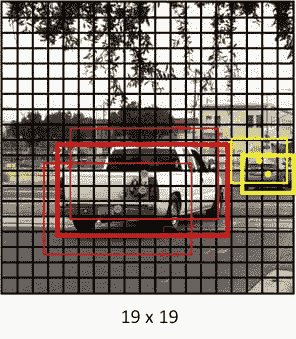

*All bounding boxes in red are predicted by YOLO to capture the first car.
All yellow boxes are for the second car.
The bold red and yellow boxes are the best for car detection.
[Source](https://web.archive.org/web/20221117203617/https://heartbeat.fritz.ai/gentle-guide-on-how-yolo-object-localization-works-with-keras-part-2-65fe59ac12d)* *of the image.*

为了选择给定对象的最佳边界框，应用了[非最大抑制(NMS)](https://web.archive.org/web/20221117203617/https://towardsdatascience.com/non-maximum-suppression-nms-93ce178e177c) 算法。

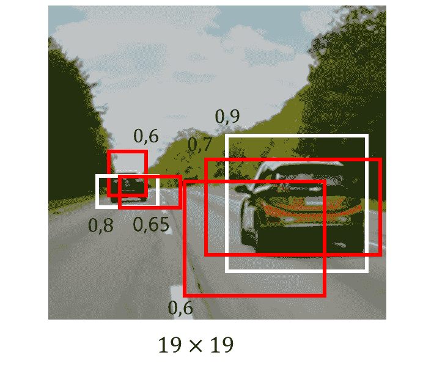

*Non-maximum suppression will handle the multiple bounding 
boxes predicted for the cars to keep only those that best capture objects.
[Source](https://web.archive.org/web/20221117203617/http://datahacker.rs/deep-learning-non-max-suppression/) of the image.*

YOLO 预测的所有盒子都有与之相关联的置信度。NMS 使用这些置信度值来去除预测可信度低的框。通常，这些都是预测置信度低于 0.5 的框。

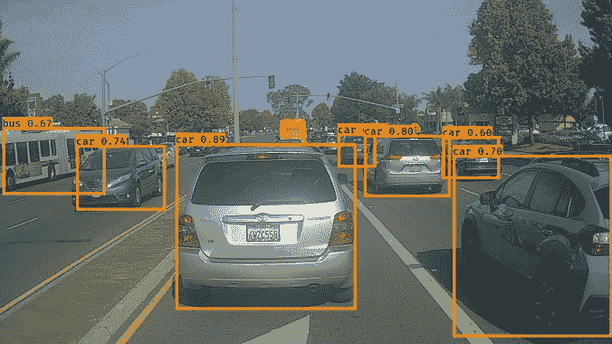

*Each bounding box is predicted with a confidence level.
You can see the confidence scores in the top-left corner of each box, next to the object name.
[Source](https://web.archive.org/web/20221117203617/https://sandipanweb.wordpress.com/2018/03/11/autonomous-driving-car-detection-with-yolo-in-python/) of the image.*

当所有不确定的边界框都被移除时，只留下具有高置信度的框。为了从表现最好的候选中选出最好的一个，NMS 选择了可信度最高的盒子，并计算它与周围其他盒子的交集。如果一个[交点](https://web.archive.org/web/20221117203617/https://www.pyimagesearch.com/2016/11/07/intersection-over-union-iou-for-object-detection/)高于特定的阈值水平，则具有较低置信度的边界框被移除。如果 NMS 比较两个具有低于选定阈值的交集的框，则两个框都保留在最终预测中。

### YOLO 与其他探测器相比

虽然卷积神经网络(CNN)在 YOLO 的引擎盖下使用，但它仍然能够实时检测对象。这是可能的，因为 YOLO 有能力用一步到位的方法同时进行预测。

其他较慢的对象检测算法(如[更快的 R-CNN](https://web.archive.org/web/20221117203617/https://arxiv.org/abs/1506.01497) )通常使用两阶段方法:

*   在第一阶段，选择感兴趣的图像区域。这些是图像中可能包含任何对象的部分；
*   在第二阶段，使用卷积神经网络对这些区域中的每一个进行分类。

通常，在一幅图像上有许多带有物体的区域。所有这些区域都被送去分类。分类是一项耗时的操作，这就是两阶段对象检测方法比一阶段检测方法执行速度慢的原因。

YOLO 不会选择图像中有趣的部分，这是没有必要的。取而代之的是，它在一次正向网络传递中预测整个图像的边界框和类。

下面你可以看到与其他流行的探测器相比，YOLO 的速度有多快。

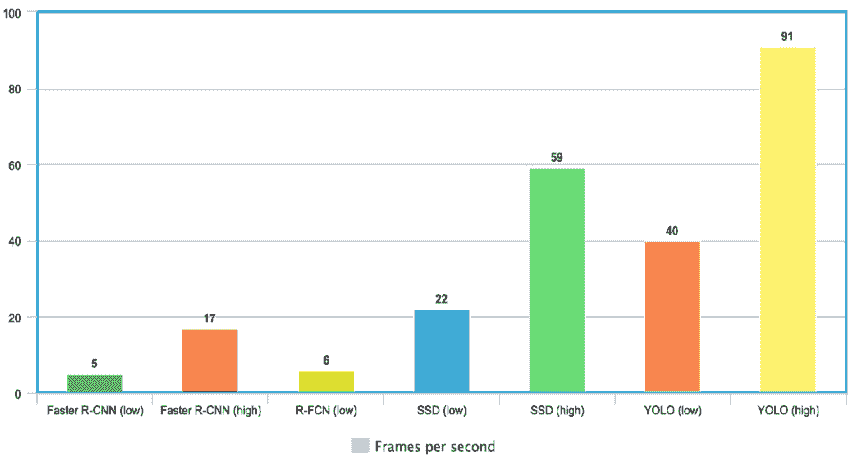

*Frames per second (FPS) is a metric that lets us compare the speed of different object detectors.
SSD and YOLO are one stage object detectors whereas Faster-RCNN 
and R-FCN are two-stage object detectors.
[Source](https://web.archive.org/web/20221117203617/https://www.researchgate.net/figure/Comparison-of-frames-processed-per-second-FPS-implementing-the-Faster-R-CNN-R-FCN-SSD_fig6_342570032) of the image.*

### YOLO 的版本

2015 年，Joseph Redmon 在其名为“你只看一次:统一、实时的物体检测”的研究论文中首次介绍了 YOLO。

自那以后，YOLO 发生了很大的变化。2016 年，Joseph Redmon [在《YOLO9000:更好、更快、更强》中描述了第二个 YOLO 版本](https://web.archive.org/web/20221117203617/https://arxiv.org/abs/1612.08242)。

大约在第二次 YOLO 升级两年后，Joseph 提出了另一个网络升级。他的论文名为“ [YOLOv3:增量改进](https://web.archive.org/web/20221117203617/https://arxiv.org/abs/1804.02767)”，引起了许多计算机工程师的注意，并在机器学习社区中流行起来。

2020 年，Joseph Redmon 决定停止研究计算机视觉，但这并没有阻止 YOLO 被其他人开发。同年，一个由三名工程师组成的团队(阿列克谢·博奇科夫斯基、钱和廖宏远)设计了第四版的 YOLO，比以前更快更精确。他们在 2020 年 4 月 23 日发表的“ [YOLOv4:物体探测的最佳速度和精度](https://web.archive.org/web/20221117203617/https://arxiv.org/abs/2004.10934)”论文中描述了他们的发现。

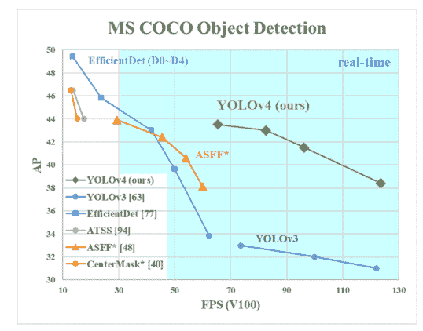

*YOLOv4 compared to other detectors, including YOLOv3.
AP on the Y-axis is a metric called “average precision”. It describes the accuracy of the net.
FPS (frames per second) on the X-axis is a metric that describes speed.
[Source](https://web.archive.org/web/20221117203617/https://neurohive.io/en/news/yolo-v4-is-the-new-state-of-the-art-object-detector/) of the image.*

第四版发布两个月后，独立开发者 Glenn Jocher 发布了 YOLO 的第五版。这一次，没有发表研究论文。这个网络作为 PyTorch 实现出现在 Jocher 的 GitHub 页面上。第五版的精确度和第四版差不多，但速度更快。

最后，在 2020 年 7 月，我们得到了另一个大的 YOLO 更新。在一篇名为“ [PP-YOLO:物体探测器](https://web.archive.org/web/20221117203617/https://arxiv.org/abs/2007.12099)的有效和高效实现”的论文中，项龙和他的团队提出了一个新版本的 YOLO。YOLO 的这一迭代是基于第三个模型版本，并超过了 YOLO v4 的性能。

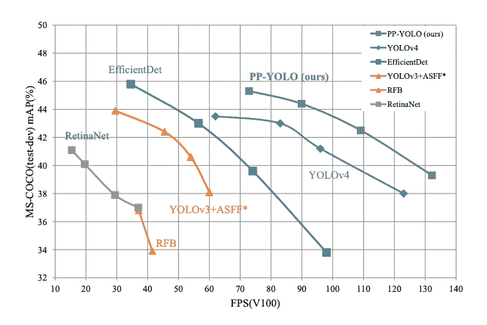

*PP-YOLO compared to other detectors, including YOLOv4.
The mAP on the Y-axis is a metric called “ mean average precision”. It describes the accuracy of the net.
FPS (frames per second) on the X-axis is a metric that describes speed.
[Source](https://web.archive.org/web/20221117203617/https://neurohive.io/en/news/yolo-v4-is-the-new-state-of-the-art-object-detector/) of the image.*

在本教程中，我们将仔细研究 YOLOv4 及其实现。为什么是 YOLOv4？三个原因:

*   它在机器学习社区得到了广泛的认可；
*   这个版本已经在广泛的探测任务中证明了它的高性能；
*   YOLOv4 已经在多个流行的框架中实现，包括我们将要合作的 TensorFlow 和 Keras。

### YOLO 应用示例

在我们进入本文的实际部分，实现我们自定义的基于 YOLO 的对象检测器之前，我想向您展示几个很酷的 YOLOv4 实现，然后我们将进行我们的实现。

注意预测有多快多准！

这是 YOLOv4 可以做的第一个令人印象深刻的例子，从不同的游戏和电影场景中检测多个物体。

或者，您可以从现实生活的摄像机视角查看[这个物体检测演示](https://web.archive.org/web/20221117203617/https://www.youtube.com/watch?v=-d6-thAu9dc)。

## YOLO 作为 TensorFlow & Keras 中的对象检测器

### 机器学习中的 TensorFlow 和 Keras 框架

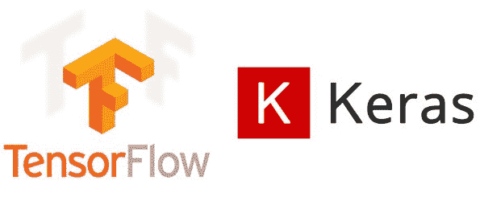

*TensorFlow & Keras logos.
[Source](https://web.archive.org/web/20221117203617/https://habr.com/ru/post/482126/) of the image.*

框架在每个信息技术领域都是必不可少的。机器学习也不例外。在 ML 市场上有几个成熟的玩家帮助我们简化整体的编程体验。PyTorch、scikit-learn、TensorFlow、Keras、MXNet 和 Caffe 只是值得一提的几个。

今天，我们将与 TensorFlow/Keras 密切合作。毫不奇怪，这两个是机器学习领域中最受欢迎的框架。这主要是因为 TensorFlow 和 Keras 都提供了丰富的开发能力。这两个框架非常相似。无需深究细节，需要记住的关键事情是 Keras 只是 TensorFlow 框架的一个包装器。

### TensorFlow & Keras 中的 YOLO 实现

在撰写本文时，[有 808 个存储库](https://web.archive.org/web/20221117203617/https://github.com/search?q=yolo+keras)在 TensorFlow / Keras 后端实现了 YOLO。YOLO 版本 4 是我们将要实现的。将搜索限制在 YOLO v4，我得到了 [55 个存储库](https://web.archive.org/web/20221117203617/https://github.com/search?q=yolov4+keras)。

仔细浏览所有这些，我发现[是一个有趣的候选人](https://web.archive.org/web/20221117203617/https://github.com/taipingeric/yolo-v4-tf.keras)继续下去。

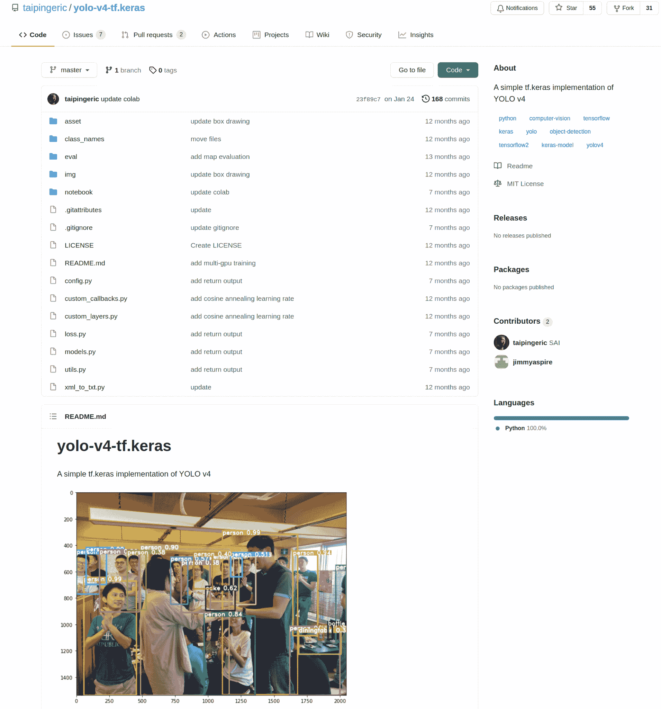

*Repo with the YOLO implementation that we’re going to work with.
[Source](https://web.archive.org/web/20221117203617/https://github.com/taipingeric/yolo-v4-tf.keras) of the image.*

这个实现是由 [taipingeric](https://web.archive.org/web/20221117203617/https://github.com/taipingeric) 和 [jimmyaspire](https://web.archive.org/web/20221117203617/https://github.com/jimmyaspire) 开发的。如果你以前使用过 TensorFlow 和 Keras，这非常简单和直观。

要开始使用这个实现，只需将 repo 克隆到您的本地机器上。接下来，我将向您展示如何使用 YOLO 开箱即用，以及如何训练您自己的自定义对象检测器。

### 如何开箱即用地运行预先培训的 YOLO 并获得结果

查看回购的[“快速启动”部分](https://web.archive.org/web/20221117203617/https://github.com/taipingeric/yolo-v4-tf.keras)，您可以看到，要启动并运行一个模型，我们只需导入 YOLO 作为一个类对象，并加载模型权重:

```py
from models import Yolov4
model = Yolov4(weight_path='yolov4.weights',
               class_name_path='class_names/coco_classes.txt')
```

请注意，您需要提前手动下载模型权重。YOLO 附带的模型权重文件来自 COCO 数据集，可以在 GitHub 的 [AlexeyAB 官方 darknet 项目页面获得。](https://web.archive.org/web/20221117203617/https://github.com/AlexeyAB/darknet)

紧接着，模型完全准备好在推理模式下处理图像。只需对您选择的图像使用 predict()方法。该方法是 TensorFlow 和 Keras 框架的标准。

```py
pred = model.predict('input.jpg')

```

例如，对于此输入图像:

我得到了以下模型输出:

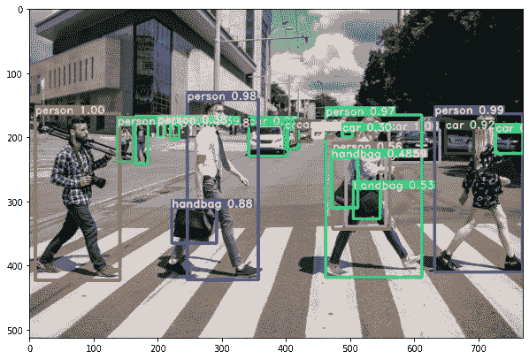

*Prediction made by pre-trained YOLOv4*

模型做出的预测以熊猫数据框的形式方便地返回。我们得到每个检测到的对象的类名、盒子大小和坐标:

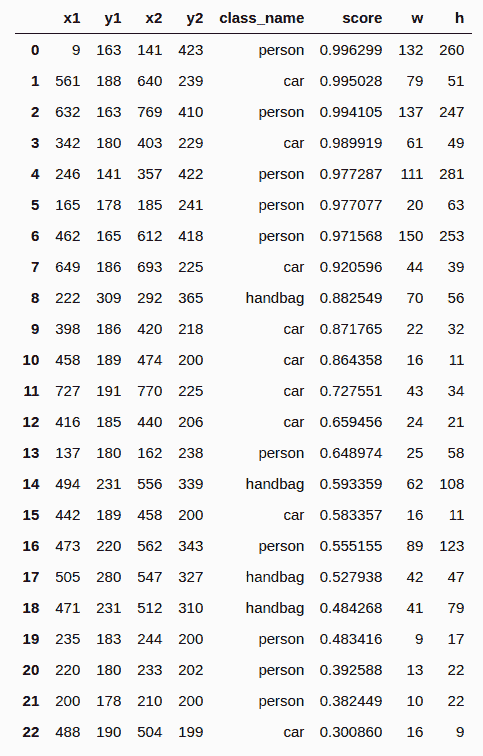

*DataFrame returned as a result of prediction. 
Lots of useful information about the detected objects*

predict()方法中有多个参数，让我们指定是否要用预测的边界框、每个对象的文本名称等来绘制图像。查看 predict()方法附带的 docstring，以熟悉我们可以使用的内容:

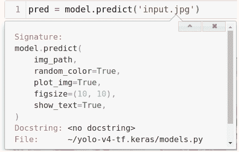

*Parameters available within the predict method*

您应该预料到您的模型将只能检测严格限于 COCO 数据集的对象类型。要了解预训练的 YOLO 模型能够检测哪些对象类型，请查看…/yolo-v4-tf.kers/class_names/中的 coco_classes.txt 文件。那里有 80 种对象类型。

## 如何训练您的自定义 YOLO 对象检测模型

### 任务陈述

要设计一个对象检测模型，你需要知道你想要检测什么对象类型。这应该是您想要为其创建检测器的有限数量的对象类型。当我们转移到实际的模型开发时，准备一个对象类型的列表是很好的。

理想情况下，您还应该有一个包含您感兴趣的对象的带注释的数据集。该数据集将用于训练检测器并对其进行验证。如果您还没有数据集或注释，不要担心，我将向您展示在哪里以及如何获得它。

### 数据集和注释

#### 从哪里获取数据

如果你有一个带注释的数据集，跳过这一部分，进入下一章。但是，如果您的项目需要数据集，我们现在将探索您可以获取数据的在线资源。

你在哪个领域工作并不重要，很有可能已经有一个开源数据集可以用于你的项目。

我推荐的第一个资源是由 [Abhishek Annamraju](https://web.archive.org/web/20221117203617/https://medium.com/towards-artificial-intelligence/50-object-detection-datasets-from-different-industry-domains-1a53342ae13d?source=rss----98111c9905da---4) 撰写的“[来自不同行业领域的 50 多个对象检测数据集](https://web.archive.org/web/20221117203617/https://towardsai.net/p/computer-vision/50-object-detection-datasets-from-different-industry-domains)”文章，他收集了时尚、零售、体育、医药等行业的精彩注释数据集。

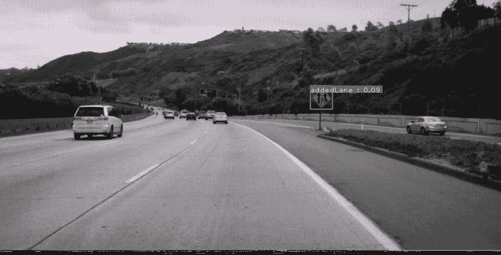

*Example of an annotated dataset for the driving car systems.
[Source](https://web.archive.org/web/20221117203617/https://towardsai.net/p/computer-vision/50-object-detection-datasets-from-different-industry-domains) of the image.*

另外两个寻找数据的好地方是[paperswithcode.com](https://web.archive.org/web/20221117203617/https://paperswithcode.com/datasets?task=object-detection&page=1)和[roboflow.com](https://web.archive.org/web/20221117203617/https://public.roboflow.com/object-detection)，这两个地方提供高质量的对象检测数据集。

查看以上资产，收集您需要的数据或丰富您已经拥有的数据集。

#### 如何为 YOLO 标注数据

如果您的图像数据集不带注释，您必须自己完成注释工作。这个手动操作是相当耗时的，一定要保证自己有足够的时间去做。

作为一个注释工具，你可以考虑[多个选项](https://web.archive.org/web/20221117203617/https://neptune.ai/blog/annotation-tool-comparison-deep-learning-data-annotation)。我个人会推荐使用[Labe](https://web.archive.org/web/20221117203617/https://github.com/tzutalin/labelImg)lImg。这是一个轻量级和易于使用的图像注释工具，可以直接输出 YOLO 模型的注释。

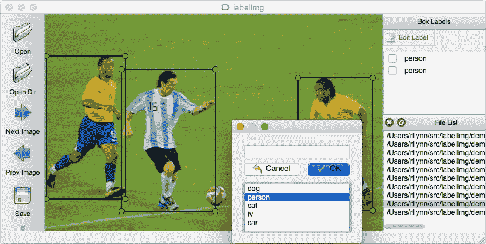

*Annotation work in LabeIIimg shown.
[Source](https://web.archive.org/web/20221117203617/https://github.com/tzutalin/labelImg) of the image.*

### 如何将数据从其他格式转换到 YOLO

YOLO 的注释是 txt 文件的形式。YOLO 的 txt 文件中的每一行必须具有以下格式:

```py
image1.jpg 10,15,345,284,0
image2.jpg 100,94,613,814,0 31,420,220,540,1
```

我们可以分解 txt 文件中的每一行，看看它由什么组成:

*   一行的第一部分指定了图像的基名:*image1.jpg*，【image2.jpg】T2

*   线的第二部分定义边界框坐标和类标签。例如， *10，15，345，284，0* 表示 xmin，ymin，xmax，ymax，class_id

*   如果一个给定的图像上有多个对象，那么在图像基本名称旁边会有多个框和类标签，用空格分隔。

边界框坐标是一个清晰的概念，但是指定类标签的 *class_id* 数字呢？每个 *class_id* 都与另一个 txt 文件中的特定类相链接。例如，预先训练好的 YOLO 带有 *coco_classes.txt* 文件，看起来像这样:

```py
person
bicycle
car
motorbike
aeroplane
bus
...
```

类文件中的行数必须与您的检测器将要检测的类数相匹配。编号从零开始，这意味着 classes 文件中第一个类的 *class_id* 号将为 0。位于类 txt 文件第二行的类的编号为 1。

现在你知道 YOLO 的注释是什么样子了。要继续创建自定义对象检测器，我建议您现在做两件事:

1.  创建一个 classes txt 文件，在其中存放您希望检测器检测的类。记住上课顺序很重要。

2.  创建带注释的 txt 文件。如果你已经有了注释，但是是 VOC 格式的。XMLs)，你可以用[这个文件](https://web.archive.org/web/20221117203617/https://github.com/taipingeric/yolo-v4-tf.keras/blob/master/xml_to_txt.py)把 XML 转换成 YOLO。

#### 将数据分割成子集

和往常一样，我们希望将数据集分成两个子集:用于训练和验证。这可以简单地做到:

```py
from utils import read_annotation_lines

train_lines, val_lines = read_annotation_lines('../path2annotations/annot.txt', test_size=0.1)
```

#### 创建数据生成器

当数据被分割时，我们可以进行数据生成器初始化。我们将为每个数据文件准备一个数据生成器。在我们的例子中，我们将有一个用于训练子集和验证子集的生成器。

以下是数据生成器的创建方式:

```py
from utils import DataGenerator

FOLDER_PATH = '../dataset/img'
class_name_path = '../class_names/bccd_classes.txt'

data_gen_train = DataGenerator(train_lines, class_name_path, FOLDER_PATH)
data_gen_val = DataGenerator(val_lines, class_name_path, FOLDER_PATH)
```

总而言之，下面是数据分割和生成器创建的完整代码:

```py
from utils import read_annotation_lines, DataGenerator

train_lines, val_lines = read_annotation_lines('../path2annotations/annot.txt', test_size=0.1)

FOLDER_PATH = '../dataset/img'
class_name_path = '../class_names/bccd_classes.txt'

data_gen_train = DataGenerator(train_lines, class_name_path, FOLDER_PATH)
data_gen_val = DataGenerator(val_lines, class_name_path, FOLDER_PATH)
```

### 模型培训所需的安装和设置

让我们来谈谈创建您自己的对象检测器所必需的先决条件:

*   如果你的计算机有一个支持 CUDA 的 GPU(NVIDIA 制造的 GPU)，那么需要一些相关的库来支持基于 GPU 的训练。如果你需要启用 GPU 支持，请查看 NVIDIA 网站上的指南。您的目标是为您的操作系统安装 CUDA 工具包和 cuDNN 的最新版本；

*   你可能想组织一个独立的虚拟环境来工作。此项目需要安装 TensorFlow 2。所有其他的库将在后面介绍；

*   至于我，我在 Jupyter 笔记本开发环境中构建和训练我的 YOLOv4 模型。尽管 Jupyter Notebook 似乎是一个合理的选择，但是如果您愿意，可以考虑在您选择的 IDE 中进行开发。

### 模特培训

#### 先决条件

到目前为止，您应该已经:

*   数据集的拆分；

*   初始化两个数据生成器；

*   包含类的 txt 文件。

#### 模型对象初始化

要为培训作业做好准备，请初始化 YOLOv4 模型对象。确保使用 *None* 作为 *weight_path* 参数的值。在这一步，您还应该提供类 txt 文件的路径。以下是我在项目中使用的初始化代码:

```py
class_name_path = 'path2project_folder/model_data/scans_file.txt'

model = Yolov4(weight_path=None,
               class_name_path=class_name_path)
```

上述模型初始化导致创建具有默认参数集的模型对象。考虑通过将字典作为值传递给 *config* 模型参数来更改模型的配置。

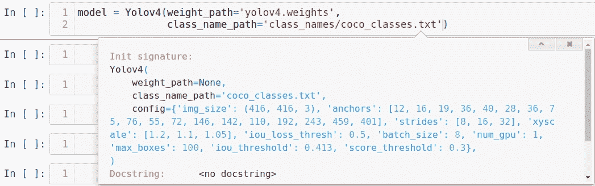

*Model object initialization parameter displayed.*

*Config* 指定 YOLOv4 模型的一组参数。

默认模型配置是一个很好的起点，但是您可能想要尝试其他配置以获得更好的模型质量。

我特别强烈推荐尝试*主播*和 *img_size* 。*锚点*指定将用于捕捉对象的锚点的几何图形。锚点的形状越符合对象的形状，模型的性能就越高。

增加 *img_size* 在某些情况下也是有用的。请记住，图像越高，模型进行推理的时间就越长。

如果您想使用 Neptune 作为跟踪工具，您还应该初始化一次实验运行，如下所示:

```py
import neptune.new as neptune

run = neptune.init(project='projects/my_project',
                   api_token=my_token)
```

#### 定义回调

TensorFlow & Keras 让我们使用回调来监控训练进度、设置检查点和管理训练参数(例如学习率)。

在拟合您的模型之前，定义对您的目的有用的回调。确保指定存储模型检查点和相关日志的路径。以下是我在我的一个项目中是如何做到的:

```py

dir4saving = 'path2checkpoint/checkpoints'
os.makedirs(dir4saving, exist_ok = True)

logdir = 'path4logdir/logs'
os.makedirs(logdir, exist_ok = True)

name4saving = 'epoch_{epoch:02d}-val_loss-{val_loss:.4f}.hdf5'

filepath = os.path.join(dir4saving, name4saving)

rLrCallBack = keras.callbacks.ReduceLROnPlateau(monitor = 'val_loss',
                                             factor = 0.1,
                                             patience = 5,
                                             verbose = 1)

tbCallBack = keras.callbacks.TensorBoard(log_dir = logdir,
                                         histogram_freq = 0,
                                         write_graph = False,
                                         write_images = False)

mcCallBack_loss = keras.callbacks.ModelCheckpoint(filepath,
                                            monitor = 'val_loss',
                                            verbose = 1,
                                            save_best_only = True,
                                            save_weights_only = False,
                                            mode = 'auto',
                                            period = 1)

esCallBack = keras.callbacks.EarlyStopping(monitor = 'val_loss',
                                          mode = 'min',
                                          verbose = 1,
                                          patience = 10)
```

你可能已经注意到，在上面的回调中，set TensorBoard 被用作跟踪工具。考虑使用海王星作为一个更先进的实验跟踪工具。如果是这样的话，不要忘记初始化另一个回调来支持与 Neptune 的集成:

```py
from neptune.new.integrations.tensorflow_keras import NeptuneCallback

neptune_cbk = NeptuneCallback(run=run, base_namespace='metrics')
```

#### 拟合模型

要开始训练工作，只需使用 TensorFlow / Keras 中的标准 *fit()* 方法来拟合模型对象。我是这样开始训练我的模型的:

```py
model.fit(data_gen_train,
          initial_epoch=0,
          epochs=10000,
          val_data_gen=data_gen_val,
          callbacks=[rLrCallBack,
                     tbCallBack,
                     mcCallBack_loss,
                     esCallBack,
                     neptune_cbk]
         )
```

当培训开始时，您会看到一个标准的进度条。

训练过程将在每个时期结束时评估模型。如果您使用一组类似于我在拟合时初始化并传入的回调，那些显示模型在较低损失方面有所改进的检查点将被保存到指定的目录中。

如果没有错误发生并且训练过程顺利进行，则训练作业将会停止，这或者是因为训练时期数结束，或者是因为早期停止回调没有检测到进一步的模型改进并停止整个过程。

在任何情况下，您都应该有多个模型检查点。我们希望从所有可用的选项中选择最好的一个，并使用它进行推理。

### 推理模式下的定型自定义模型

在推理模式下运行已训练模型类似于开箱即用地运行预训练模型。

您初始化一个模型对象，传递到最佳检查点的路径以及带有类的 txt 文件的路径。下面是我的项目的模型初始化的样子:

```py
from models import Yolov4
model = Yolov4(weight_path='path2checkpoint/checkpoints/epoch_48-val_loss-0.061.hdf5',
               class_name_path='path2classes_file/my_yolo_classes.txt')
```

当模型初始化后，只需对您选择的图像使用 predict()方法来获得预测。概括地说，该模型所做的检测以熊猫数据帧的便利形式返回。我们得到每个检测到的对象的类名、盒子大小和坐标。

## 结论

您刚刚学习了如何创建一个定制的 YOLOv4 对象检测器。我们已经讨论了端到端的过程，从数据收集、注释和转换开始。你对第四代 YOLO 探测器及其与其他探测器的不同已经有了足够的了解。

现在没有什么能阻止你在 TensorFlow 和 Keras 中训练自己的模型。你知道从哪里得到一个预训练的模型，以及如何开始训练工作。

在我即将发表的文章中，我将向您展示一些有助于提高最终模型质量的最佳实践和生活窍门。和我们在一起！