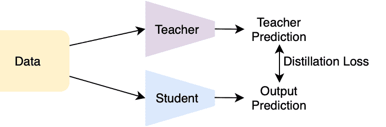
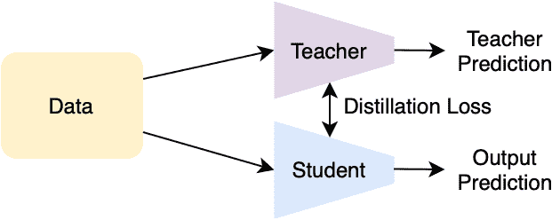
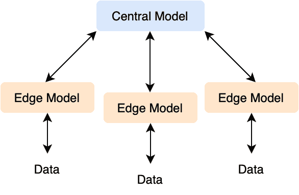

# 优化部署和推理模型

> 原文：<https://web.archive.org/web/https://neptune.ai/blog/optimizing-models-for-deployment-and-inference>

人工智能和机器学习的发展是迅速的，也是出乎意料的。这些先进的模型描绘了你家后院的梵高风格的画，抓取了你在高中毕业舞会上听到的熟悉曲调的名字，并为你的客户完成了你精心措辞的电子邮件。它们无处不在，各公司都在拼命调整自己的商业模式，以迎合不断增长的需求，挖掘潜在的机会。

诸如此类的重大而仓促的转变往往会导致微小的差距，而这种差距只会在规模扩大后进一步扩大；**当部署到大规模场景时，模型缺乏鲁棒性/推理时间慢是在温室环境中使用合成和高度监督数据集进行培训时经常被忽视的主要问题之一**。

虽然具有挑战性，但有一些方法几乎可以保证有助于缩小这些训练和推理时间的差距。这篇文章深入探讨了管理和优化部署和推理模型的六种方法。具体来说，我们重点关注神经网络——这是一种最难管理的架构，因为它需要大量的参数和内存。每种方法都附有例子/教程，告诉你如何把它应用到你自己的问题中。

*本文假设理解深度学习和神经网络的先决条件，以及使用 PyTorch 等框架实现它们的能力。*

## 知识升华下的记忆管理

记忆一直是深度学习模型的主要缺点。在训练期间，每个要更新的参数必须保留用于反向传播计算的梯度。虽然由于不再需要梯度，该问题在推断过程中略有缓解，但是大量的参数仍然存在，并且如果计算不够强大，在推断过程中仍然可能是一个问题。知识提炼是解决这一问题的直接方法。

从本质上讲，知识提炼的目的是将复杂模型中学习到的知识转移到空间容量小得多的模型中。由于有数百万个参数，神经网络经常表现出过度参数化的现象，这意味着许多中间神经元/权重实际上对最终预测是无用的；这样的问题使得采用具有更少数量的层/每层神经元的网络并且仍然捕获原始网络的大部分成为可能。

一种知识提炼方法，包括教师网络和学生网络。教师网络通常是一个更复杂的模型，使用整个训练数据集进行训练。网络中的大量参数使得收敛相对简单。之后，应用知识转移模块提取教师学到的知识到学生网络中。

### 如何应用知识转移？

根据要转移的知识类型的不同，知识转移有多种方式。我们介绍两种比较常见的知识及其相应的迁移方法。

*   **基于响应的知识**:基于响应的知识侧重于网络的最终输出。换句话说，目标是让学生学会输出与教师网络相似的预测。因此，执行这种知识转移的典型方式是通过基于教师和学生的预测计算损失，而不是基于学生和原始事实之间的比较。优化鼓励学生权重更新到与教师相似的空间，实现知识转移的目标。来自老师的这种软概率通常允许学生比实际使用基础真理学得更好。



*Example of response-based knowledge | Source: Author*

*   **基于特征的知识**:基于特征的知识强调教师和学生之间中间表征的差异，而不是输出的相似性。因此，传递要素需要在中间表示相似性过程中计算损失，而不是在最终输出中计算。这确保了学生的处理/提取方法也与教师的相似。



*Example of feature-based Knowledge | Source: Author*

## 使用模型量化和层融合加速推理

深而宽的体系结构固有地需要大量的矩阵运算。乘法可以在 GPU 的帮助下以并行方式计算，但在模型加载时以及需要同时进行大量推理时，它仍然会相当慢。为此，模型量化是解决这个问题的一个很好的工具。

### 什么是模型量化？

由 PyTorch 等流行库构建的传统模型通常具有较高的浮点精度，这有助于在训练期间获得尽可能高的精度。量化是以较低位宽度计算和存储参数的技术，以减少推断时间并提高效率。因此，在这种设置下，矩阵计算可以更加紧凑和高效。

### PTQ 诉沙特

量化方法大致有两种:

## 

*   1 训练后量化(PTQ)，精度下降仅发生在模型训练之后。
*   2 量化感知训练(QAT)，其中训练将量化考虑在内。

对于 PTQ，我们可以进一步将其分为 PTQ-动态和 PTQ-静态。PTQ 动态是最容易实现的，因为所有的模型权重被预先量化，并且只有激活在推理过程中被动态量化。如果在模型推理过程中加载权重比矩阵乘法本身要花费大量时间，那么 PTQ 动态法就是一个不错的选择。PTQ 静态，另一方面，使用一个代表性的数据集来寻找最佳的方法来量化权重和激活。

#### **PTD-Q 实施**

```py
 ```
model_fp32 = M()

model_int8 = torch.quantization.quantize_dynamic(
    model_fp32,
    {torch.nn.Linear},  
    dtype=torch.qint8)  

```py 
```

通过上面这个简单的方法，你可以在训练后直接创建一个量化的模型。为了展示量化的能力，我们可以用下面的代码来测量之前和之后的模型大小。

```py
 ```
def print_size_of_model(model, label=""):
    torch.save(model.state_dict(), "m.p")
    size=os.path.getsize("m.p")
    print("model: ",label,' \t','Size (KB):', size/1e3)
    os.remove('temp.p')
    return size

f=print_size_of_model(model_fp32,"fp32")
q=print_size_of_model(model_int8,"int8")
print("The model is {0:.2f} times smaller".format(f/q))

```py 
```

例如，1024 个输入和 256 个输出声道的线性层在量化后将比小 **3.97 倍。你可以通过测量随机 torch 张量需要多长时间来推断时间，你也会看到量子化的显著改善。**

*欲了解更多信息，请访问 [Pytorch 文档](https://web.archive.org/web/20230106143853/https://pytorch.org/docs/stable/quantization.html)。*

#### **量化的权衡**

简而言之，PTQ(尤其是 PTQ 动态)更容易用当前的库来实现，因为您可以以完美的精度正常地训练模型，然后选择在之后进行量化。缺点也是显而易见的:随着 PTQs 的增加，模型的精度可能会降低，因为随着顺序的矩阵乘法，网络变得相当不准确。

qat 在一定程度上改善了前述的准确性问题，但在训练中直接应用量化更具挑战性，并且很难确定原始模型的真实潜力。假设计算是允许的，并且硬件相当先进，建议暂停量化，直到您了解模型的全部潜力，然后通过实现折衷对模型应用足够的量化。

### 层融合

另一种提高模型效率的成熟技术是通过层融合来压缩网络。执行层融合的方法可以有很大的不同，但我们提供了一个简单的示例层融合算法如何工作的概述。

本质上，给定一组神经网络，您可以通过某个距离度量找到层之间的成对相似性。这个距离度量可以简单到两组权重的余弦相似性。然后，选择前 k 个相似层，对于每个层，只需冻结一组权重和权重梯度。如果许多层彼此相似，这将允许模型的效率增加，而不会损害太多的准确性。

*检查[参考伪算法](https://web.archive.org/web/20230106143853/https://arxiv.org/abs/2007.14917)。*

## 使用 ONNX 库

在决定任何形式的部署之前，优化模型的一个关键步骤是使用 ONNX 库。

[ONNX](https://web.archive.org/web/20230106143853/https://onnx.ai/) ，开放神经网络交换的简称，是一个开源的生态系统，希望将复杂多样的机器学习库整合在一起。如今，人们可以在各种深度学习框架上编写复杂的网络——最著名的是 [Tensorflow](https://web.archive.org/web/20230106143853/https://www.tensorflow.org/) 和 [PyTorch](https://web.archive.org/web/20230106143853/https://pytorch.org/) 。虽然它们在语法上很相似，但实际上却大相径庭，不能互换。

ONNX 是一个增加互操作性的库——来自不同库的每个模型都可以转换为 ONNX 格式，这可以很容易地针对不同的硬件进行优化。根据不同的部署目标(例如 CPU、GPU)，ONNX 可以相应地帮助优化它。

当你的机器学习模型是从一个公司内的多个团队开发出来的时候，这一点特别有帮助。每个团队可以根据他们自己的偏好试验模型和库，并且仍然可以无缝地将模型组合在一起，最终用于生产。

欲了解更多信息，请查看关于 ONNX 图书馆的[优势的文章。](https://web.archive.org/web/20230106143853/https://medium.com/trueface-ai/two-benefits-of-the-onnx-library-for-ml-models-4b3e417df52e)

## 确定部署模式

在完成了前面几点之后，现在是时候在实际用例的压力下对您的模型进行测试了。这一步相当棘手，因为模型的不同用例可能需要不同类型的部署。我们列出了几种常见的部署模式及其主要区别。

### 单样本推理部署

也许机器学习模型最常见的用例是将它作为服务(通过 API 或 direct UI)为客户端请求打开，一次一个样本(例如，使用 Google API 对特定图像执行图像分割)。在这种情况下，需要对单个样本进行推断以进行实时响应。因此，如果模型仅在客户端请求时初始化，模型将导致运行时间变慢，过多的模型共存，并超出机器的内存容量。

避免这种情况的标准方法是将模型部署为 web 服务，并将其配置为持续待机模式。像 [Flask](https://web.archive.org/web/20230106143853/https://flask.palletsprojects.com/en/2.2.x/) 这样的库允许这样的部署，可以很容易地集成到 PyTorch 管道中。简而言之，您应该在 web 服务器上预先加载现有的模型和权重，以便从客户端接收到的任何请求都被发送到已经加载的模型进行推理。

*py torch 模型在烧瓶上的简单实现可以在这里找到*[](https://web.archive.org/web/20230106143853/https://pytorch.org/tutorials/intermediate/flask_rest_api_tutorial.html)**。**

 *请注意，在大量请求和大量数据传输的情况下，此管道仍然可能遇到瓶颈。因此，在设计 Flask 或其他基于服务器的模型时，有两个主要细节需要考虑:

1.  避免向服务器端发送不必要的数据。以图像识别为例:如果模型接受的图像大小为(224，224)，则在终端机器上执行图像预处理比以全分辨率发送图像更可行。对于检测等任务，将预测作为边界框坐标发送，而不是直接发回图像。
2.  同时打开多个模型。这将避免交通高峰期的拥挤。然而，根据公司的计算能力，太多的模型同时驻留在 GPU 中也可能导致总体推理时间变慢和内存错误。

### 批量部署

另一方面，如果客户端需要同时分析批量数据，更可行的替代方法是部署模型，使其在处理之前接受批量数据。例如，一家制造公司在生产线上执行异常检测。成批的产品图像可以同时用于预测，因此顺序推断每个图像实际上会减慢时间线。

今天，神经网络体系结构被设计成能够同时接受成批的输入，以加速矩阵乘法过程。因此，您的网络应该接受多个数据条目，并在将它们输入网络之前成批收集它们。像 Flask 这样的 Web 服务部署仍然是可行的，但是当从潜在的多个客户端收集条目时，应该暂停模型。

### 将模型部署到边缘设备上

与基于网络服务的模型相反，在基于网络服务的模型中，客户端必须将数据传输到中央服务器以获得反馈，在边缘设备(例如，个人移动电话)上部署相同的模型也是一种可能的替代方案。这种部署方法将允许推断时间更快，特别是对于大量数据(传输瓶颈)。然而，精确的模型，尤其是基于深度学习的模型，通常需要非常繁重的计算，而手机或其他边缘设备无法执行。对于这种部署模式，必须牺牲更多的精华/更轻的架构，甚至牺牲精度。

## 优化模型中的模型修剪

另一个需要考虑的重要步骤是模型修剪，这将极大地提高模型投入生产时的效率。

网络剪枝实质上是在网络权重上覆盖二进制掩码，以便使用较少的权重进行预测。根据修剪方法的不同，屏蔽的具体方式会有所不同，但最常见的方式是简单地修剪具有最小幅度(即，对结果的影响最小)的权重。修剪会导致以下影响:

## 

*   1 减少延迟和推理成本
*   2 增加内存空间，降低功耗。

### PyTorch 中的修剪

对于 PyTorch 之类的库，修剪可以非常简单，例如:

```py
 ```
import torch.nn.utils.prune as prune

```py 
```

现在，给定一个模型，您可以简单地调用任何您想要的修剪函数，例如:

```py
 ```
prune.random_unstructured(module, name="weight", amount=0.3)
```py 
```

Tensorflow 中的修剪

### 如果你是 Tensorflow 而不是 PyTorch 的粉丝，还有一个为你指定的优化库，称为 TensorFlow 优化工具包。该工具包介绍了一种减少网络权重和增加网络负载的重要方法——剪枝。

*更多详情请参考[张量流模型优化](https://web.archive.org/web/20230106143853/https://www.tensorflow.org/model_optimization)。*

用于模型优化的在线深度学习

## 数据特征经常随着时间而变化:时间序列数据的分析不再适用于黑天鹅事件；一个物体的照片随着更好的照相机而发展。因此，优化模型以进行部署的主要工作是在通过不断的监控和改进部署模型之后开始的。

虽然通过合并新收集的数据进行简单的重新训练解决了这个问题，但是从头开始重新训练的计算最终是昂贵的，并且通常是耗时的(在 ImageNet-22k 上训练模型可能需要几天，即使使用高级 GPU 也是如此)。本节介绍了从头再培训的替代方案:在线深度学习。

什么是在线深度学习？

### 传统的深度学习是通过优化方法来执行的，例如对整个数据集进行随机梯度下降。在线深度学习旨在解决只有新来的数据可用的限制，并对当前训练的模型执行在线梯度下降(OGD ),以适应学习的新特征。在 OGD 的前提下，还引入了其他方法，如对冲反向传播，以通过确定模型的适当深度来进一步改进在线深度学习方法。

数据隐私问题

### 然而，使用新检索的数据仍然会导致隐私问题。您的服务的客户可能不希望他们的数据被发送回中央服务器以进行进一步的模型优化。为此，引入了学习算法的一个分支，即联邦学习。

联合学习旨在在边缘设备(或客户端)上执行训练，并使用该训练来更新中心模型。一种常见的方法如下所示:



*Model optimization | Source: Author*

Federated learning aims to perform the training on the edge devices (or customer end) and use that to update the central model. A common approach is illustrated as the following:

## 1 中央服务器端模型将模型复制到边缘设备。

*   2 边缘设备模型使用在线学习算法和给定数据进行优化。
*   3 模型被发送回服务器以优化中央模型。
*   3 The models are sent back to the server to optimise the central model.

关于如何执行这种联合学习算法，存在多种变体，但是总而言之，它们防止了机密数据的传输，并且仍然相应地改进了中央模型。

尾注

## 本文作为一个端到端的指南，帮助您将机器学习模型连接到部署和推理的最佳状态。我们首先通过引入知识提炼和量化来提高网络的内存和速度容量，以及 ONNX 来优化网络以适应不同的硬件。

之后，我们介绍了要考虑的不同部署模式，并简要介绍了 Tensorflow 的修剪功能。最后，我们介绍了将模型投入生产时的错误检测方法，以及在线学习和联合学习机制，以继续优化您的模型，使其尽可能达到最佳性能。每个场景都是不同的，但希望这篇文章可以使优化深度学习模型以进行部署的艰巨过程稍微顺利一些。

参考

### [https://neptune.ai/blog/must-do-error-analysis](https://web.archive.org/web/20230106143853/https://neptune.ai/blog/must-do-error-analysis)

1.  [https://www.tensorflow.org/model_optimization](https://web.archive.org/web/20230106143853/https://www.tensorflow.org/model_optimization)
2.  [https://pytorch.org/docs/stable/quantization.html](https://web.archive.org/web/20230106143853/https://pytorch.org/docs/stable/quantization.html)
3.  [https://py torch . org/tutorials/intermediate/flask _ rest _ API _ tutorial . html](https://web.archive.org/web/20230106143853/https://pytorch.org/tutorials/intermediate/flask_rest_api_tutorial.html)
4.  [https://medium . com/true face-ai/two-benefits-of-the-onnx-library-for-ml-models-4 B3 e 417 df 52e](https://web.archive.org/web/20230106143853/https://medium.com/trueface-ai/two-benefits-of-the-onnx-library-for-ml-models-4b3e417df52e)
5.  [https://medium.com/trueface-ai/two-benefits-of-the-onnx-library-for-ml-models-4b3e417df52e](https://web.archive.org/web/20230106143853/https://medium.com/trueface-ai/two-benefits-of-the-onnx-library-for-ml-models-4b3e417df52e)*