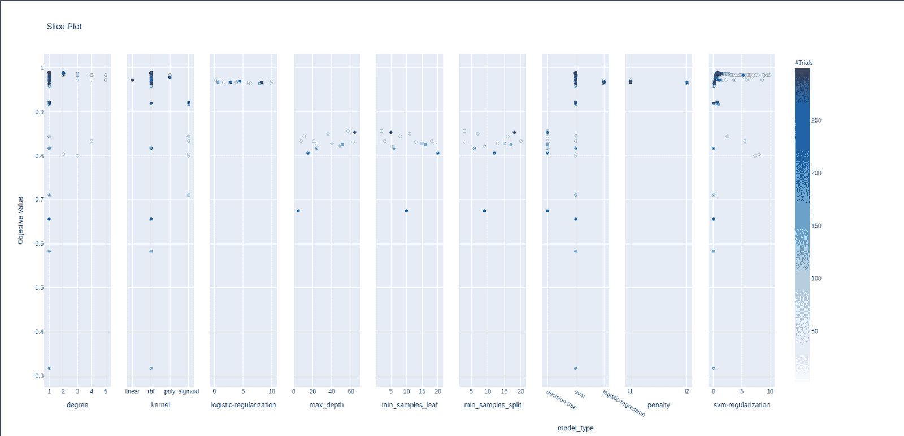

# Optuna 指南:如何监控超参数优化运行

> 原文：<https://web.archive.org/web/https://neptune.ai/blog/optuna-guide-how-to-monitor-hyper-parameter-optimization-runs>

[超参数搜索](/web/20221206040852/https://neptune.ai/blog/how-to-track-hyperparameters)几乎是每个机器学习和深度学习项目的一部分。当您选择一个候选模型时，您要确保它以最好的方式概括您的测试数据。

如果是线性回归这样的简单模型，手动选择最佳超参数很容易。对于像神经网络这样的复杂模型，手工调整是很困难的。

例如，如果我们训练一个只有线性层的神经网络，下面是一组潜在的超参数:

*   层数
*   每层单位
*   正则化强度
*   激活功能
*   学习率
*   优化器参数(2-3 个变量)
*   丢失保持概率

即使这 8 个变量中的每一个都有 2 个候选值，你最终会得到 2^8 = 256 个实验。对于更大的网络和更多的候选值，这个数字变得难以承受。

在本文中，我们将探索如何使用流行的框架 [Optuna](https://web.archive.org/web/20221206040852/https://optuna.readthedocs.io/en/stable/) 为复杂模型设置超参数。

## 如何进行超参数选择

我们需要考虑寻找最佳超参数值的有效策略。

**一种简单的超参数搜索方法是网格搜索**，如上例所示:我们为每个超参数手动设置候选值，并对每个超参数值组合进行模型训练和评估。

*对于具有 m1，m2，…，mk 个候选值的 k 个超参数，*
***实验次数= m1*m2* … *mk***

这种方法的主要缺点是:

*   资源密集型——执行大量实验将需要大量计算资源。
*   非最优–即使该策略穷尽了所有可能的组合，候选值也是由我们设定的。最佳值可能完全不在此候选池中。
*   耗时——在深度学习中，一个实验需要几个小时才能完成，这种策略效率不高。

另一种传统方法是随机搜索。在这里，您在一个定义的值范围内随机选择一个变量。这种方法比网格搜索更具探索性，限制更少，而且与网格搜索相比，您还可以测试更大范围的候选值。

这些方法都不能满足我们收敛到最佳超参数值集的需要。我们需要更有效的算法，以更少的试验来估计最佳超参数。

**一些算法使用贝叶斯优化来实现这一点**。这个想法是对搜索过程进行概率建模。该模型使用通过使用某些超参数组合集获得的度量值来选择下一个组合，使得度量的改进最大化。

在 Python 中有许多框架可以用来实现这些算法——HyperOpt、Scikit-Optimize、Optuna 等等。

我们将重点讨论 Optuna——可以说是所有选项中最简单的一个。

## Optuna 的最佳功能

### 由运行定义范例

据 Optuna 的作者称，Optuna 的三个特征使其脱颖而出(来源:[论文](https://web.archive.org/web/20221206040852/https://arxiv.org/abs/1907.10902))

1.  *通过运行定义程序，允许用户动态构建搜索空间。*
2.  *高效的采样算法和剪枝算法，允许一些用户定制。*
3.  *易于设置的多功能架构，可部署用于各种类型的任务*。

Optuna 很容易安装。考虑论文中描述的情况:

```py
import optuna
import ...

def objective (trial):
    n layers = trial. suggest int (’n layers ’, 1, 4)

    layers = []
    for i in range( n layers ):
    layers.append(trial. suggest int (’n units l {} ’.
    format(i), 1, 128))

    clf = MLPClassifier (tuple(layers))

    mnist = fetch mldata (’MNIST original’)
    x train , x test , y train , y test = train test split (
    mnist.data , mnist.target)

    clf.fit( x train , y train )

    return 1.0 − clf.score( x test , y test )

study = optuna. create study ()
study.optimize(objective , n trials =100)
```

[*来源*](https://web.archive.org/web/20221206040852/https://arxiv.org/abs/1907.10902)

目的是通过优化隐层和每层中单元的数量来搜索最佳的神经网络结构。我们定义一个函数，在本例中是 ***目标*** ，它接受一个名为 ***的对象进行试验*** 。

这个 ***试验*** 对象用于在目标函数内部构建一个模型。在这种情况下，我们使用 trial 的 **suggest_int** 方法选择层数和每层中的单元数。此方法选择 1 到 4 之间的一个值。有许多类型的 **suggest_** 方法可用，涵盖不同的场景。 ***试验*** 对象负责建议提供最佳结果的超参数值。

目标函数返回需要最小化或最大化的单个数字——准确度、损失、f1 分数。然后，创建一个研究对象，并传递两个参数——目标函数和希望研究持续的实验次数。就是这样。

请注意，我们根本没有预定义模型架构。它是完全动态构建的。在另一个称为 ***远视*** 的框架中考虑同样的任务:

```py
import hyperopt
import ...

space = {
    ’n_units_l1 ’: hp.randint(’n_units_l1 ’, 128) ,
    ’l2’: hp.choice(’l2’, [{
        ’has_l2 ’: True ,
        ’n_units_l2 ’: hp.randint(’n_units_l2 ’, 128) ,
        ’l3’: hp.choice(’l3’, [{
            ’has_l3 ’: True ,
            ’n_units_l3 ’: hp.randint(’n_units_l3 ’, 128) ,
            ’l4’: hp.choice(’l4’, [{
                ’has_l4 ’: True ,
                ’n_units_l4 ’: hp.randint(’n_units_l4 ’, 128) ,
            }, {’has_l4 ’: False }]) ,
        }, {’has_l3 ’: False }]) ,
    }, {’has_l2 ’: False }]) ,
}

def objective (space):
    layers = [space[’n_units_l1 ’] + 1]
    for i in range(2, 5):
        space = space[’l{} ’.format(i)]
        if not space[’has_l {} ’.format(i)]:
            break
        layers.append(space[’n_units_l {} ’.format(i)] +
1)

    clf = MLPClassifier (tuple(layers))

    mnist = fetch mldata (’MNIST original’)
    x_train , x_ test , y_train , y_test = train test split (mnist.data , mnist.target)

    clf.fit(x_train , y_train)

    return 1.0 − clf.score(x_test , y_test )

hyperopt.fmin(fn=objective , space=space , max_evals =100 ,
algo=hyperopt .tpe.suggest)

```

[*来源*](https://web.archive.org/web/20221206040852/https://arxiv.org/abs/1907.10902)

一开始，你看到一个叫做 ***空间*** 的大嵌套字典。用英语来说应该是这样的:

*决定是否包含第一层。如果是，建议隐藏单元的数量。决定是否包含第二层。如果是，建议隐藏单元的数量。决定第三个…*

不是很有活力。这不像 Optuna 的运行定义特性，我们在运行中定义模型。Hyoperopt 更明确和运行。

### 高效采样

#### **树 Parzen 估计器(TPE)**

默认情况下，Optuna 使用一种称为 Tree-Parzen estimator 的技术，根据实验历史选择下一步要尝试的超参数集。考虑一个简单的例子，其中历史包括 100 次试验，列表如下:

我们将该表的行分成 2 部分，一部分损失< 0.03(好结果表)，其余部分(不太好结果表)。在我们用 X 轴作为参数值，Y 轴作为损耗来绘制这两个分布的函数之后，我们得到这样的图(为了便于解释而过度简化):

上面的图是使用好的结果(带有损失< 0.03). We call it *g(x)* 构建的，其中 x 是参数值。下图显示了不太好的结果。我们称之为 *l(x)。*

对于一个新的实验，这个超参数的一个新值是使用:

#### **协方差矩阵自适应进化策略(CMA-ES)**

Optuna 还提供了另一种采样策略，CMA-ES。它通过更新超参数的均值和方差来动态构建搜索空间。

对于 *k* 超参数，在 *N* 次实验之后，我们使用最好的，比如说，25%的实验(这里的最好是根据感兴趣的度量——精确度，f1 来决定的)。我们计算了这些超参数联合分布的均值和协方差矩阵。

这里的一个巧妙之处是，在估计协方差矩阵时，使用上一代(一组试验)的平均值，而不是使用以前的试验为这一代估计的平均值。像这样:

*计算下一代(g+1)的均值。来源:[Otoro.net](https://web.archive.org/web/20221206040852/https://blog.otoro.net/2017/10/29/visual-evolution-strategies/)*

正如您在上面的等式中看到的，下一代( *g+1* )的方差和协方差值是使用当前一代 *g* 的平均值来估计的。

一旦我们有了这个更新的分布，我们就可以通过从这个超参数值的分布中取样来进行实验。查看[这篇](https://web.archive.org/web/20221206040852/https://blog.otoro.net/2017/10/29/visual-evolution-strategies/)文章了解更多详情。

### 修剪

Optuna 通过修剪节省您的时间。简单地说，如果一个实验基于损失或验证度量的中间值看起来没有希望，那么这个实验就被中止。

Optuna 使用之前实验的信息来做出决定。它问在这个时期中间损失的值是多少，在同一阶段以前的实验的损失是多少。

例如，中位数普鲁纳将特定步骤的当前实验与同一步骤的先前实验进行比较。如果表现好于之前实验的中间值，试验将继续，如果不是，试验将中止。

## 在代码中使用 Optuna(案例研究)

### 代码

让我们深入研究代码。我们将使用来自 **sklearn.datasets** 的数字数据集。它有 8*8 大小的图像存储为一维数组。有 10 个标签。

#### **导入相关包**

打开一个 jupyter 笔记本，导入这些包和函数。确保在 python 环境中安装这些包。

```py
import sklearn
from sklearn import datasets
from sklearn.model_selection import train_test_split
import numpy as np
import optuna
from sklearn.tree import DecisionTreeClassifier
from sklearn.linear_model import LogisticRegression
from sklearn.svm import SVC
from sklearn.metrics import accuracy_score
from collections import Counter
import time
```

#### **加载数据**

如上所述，我们加载数字数据集。Sklearn 会自动给你下载。我们将数据分成训练集和验证集。

```py
data = datasets.load_digits()

X = data.data
y = data.target

X_train, X_val, y_train, y_val = train_test_split(X, y, test_size=0.2, shuffle=True)

print("Train data shape: ", X_train.shape)
print("Validation data shape: ", X_val.shape)
```

输出:

```py
Train data shape:  (1437, 64)
Validation data shape:  (360, 64)
```

检查标签:

```py
Counter(y_train)

```

输出:

```py
Counter({6: 142,
         4: 147,
         7: 143,
         8: 141,
         1: 151,
         3: 147,
         9: 145,
         2: 142,
         0: 134,
         5: 145})
```

我们选择准确性作为感兴趣的衡量标准，因为不存在等级不平衡:

```py
def model_performance(model, X=X_val, y=y_val):
    """
    Get accuracy score on validation/test data from a trained model
    """
    y_pred = model.predict(X)
    return round(accuracy_score(y_pred, y),3)
```

**model_performance** 只是我们前面使用的一个辅助函数。

在进行任何超参数搜索之前，让我们考虑一个简单的决策树，看看它在未调优时的性能。

```py
model = DecisionTreeClassifier()
model.fit(X_train, y_train)

print("Validation accuracy: ", model_performance(model))
```

输出:

```py
Validation accuracy:  0.861

```

我们将记住这个分数，以了解我们通过使用 Optuna 获得了多少改进。

#### **创建超参数优化过程**

我们最终开始创建我们的目标函数并研究:

```py
def create_model(trial):
    model_type = trial.suggest_categorical('model_type', ['logistic-regression', 'decision-tree', 'svm'])

    if model_type == 'svm':
        kernel = trial.suggest_categorical('kernel', ['linear', 'poly', 'rbf', 'sigmoid'])
        regularization = trial.suggest_uniform('svm-regularization', 0.01, 10)
        degree = trial.suggest_discrete_uniform('degree', 1, 5, 1)
        model = SVC(kernel=kernel, C=regularization, degree=degree)

    if model_type == 'logistic-regression':
        penalty = trial.suggest_categorical('penalty', ['l2', 'l1'])
        if penalty == 'l1':
            solver = 'saga'
        else:
            solver = 'lbfgs'
        regularization = trial.suggest_uniform('logistic-regularization', 0.01, 10)
        model = LogisticRegression(penalty=penalty, C=regularization, solver=solver)

    if model_type == 'decision-tree':
        max_depth = trial.suggest_int('max_depth', 5, X_train.shape[1])
        min_samples_split = trial.suggest_int('min_samples_split', 2, 20)
        min_samples_leaf = trial.suggest_int('min_samples_leaf', 2, 20)
        model = DecisionTreeClassifier(
            max_depth=max_depth, min_samples_split=min_samples_split, min_samples_leaf=min_samples_leaf
          )

    if trial.should_prune():
            raise optuna.TrialPruned()

    return model
def objective(trial):
    model = create_model(trial)
    model.fit(X_train, y_train)
    return model_performance(model)
```

**create_model** 是一个助手函数，它接受一个试验对象并返回一个模型**。**我们在搜索领域使用了三种不同的模型——逻辑回归、决策树和 SVM。试用对象使用**建议分类**方法从这三个中选择一个。根据模型的类型，进一步选择超参数。

在**目标**函数中，我们使用 **create_model** 来生成一个模型，并将其拟合到我们的训练数据上。我们返回模型精度:

```py
study = optuna.create_study(direction='maximize', study_name="starter-experiment", storage='sqlite:///starter.db')
```

此时，我很快在 neptune.ai 上创建了一个名为 **blog-optuna** 的项目，继续使用代码，您可以在笔记本上创建一个关于 neptune 的实验。我的实验名称是 **optuna guide** 。请注意，使用 neptune 运行 optuna 研究并不是必需的。如果您希望稍后尝试 neptune，只需注释前面代码中提到的代码行。

在 [neptune.ai](/web/20221206040852/https://neptune.ai/) 上注册即可获得 neptune API 令牌(只需一分钟)。

*   导入 neptune 并创建跑步记录

```py
import neptune.new as neptune

run = neptune.init(
              project=”<YOUR_PROJECT_NAME>”
	  api_token = "<YOUR_API TOKEN>"
)

```

*   导入并初始化 NeptuneCallback

```py
import neptune.new.integrations.optuna as optuna_utils

neptune_callback = optuna_utils.NeptuneCallback(run)

```

使用 [Neptune-Optuna 集成](https://web.archive.org/web/20221206040852/https://docs.neptune.ai/integrations-and-supported-tools/hyperparameter-optimization/optuna)，Neptune 将自动记录所有有价值的信息，并为我们创建可视化效果。

```py
study = optuna.create_study(direction='maximize', study_name="starter-experiment", storage='sqlite:///starter.db')

```

因为我们想要最大化目标函数的返回值，方向参数被设置为最大化。我们可以使用 study_name 参数为我们的研究命名。

如果我们希望将实验存储在 sql-lite 数据库中，我们可以将存储参数值设置为类似于“sqlite:/// <path to="" your="" .db="" file="">”的值。</path>

最后，我们可以将 neptune_callback 传递给 study.optimize() callbacks 参数，并开始超参数优化过程。我已经设置了 300 次试验。

```py
study.optimize(objective, n_trials=300, callbacks=[neptune_callback])

```

输出:

```py
[I 2020-12-12 16:06:18,599] A new study created in RDB with name: starter-experiment
[I 2020-12-12 16:06:18,699] Trial 0 finished with value: 0.828 and parameters: {'model_type': 'decision-tree', 'max_depth': 12, 'min_samples_split': 16, 'min_samples_leaf': 19}. Best is trial 0 with value: 0.828.
[I 2020-12-12 16:06:20,161] Trial 1 finished with value: 0.983 and parameters: {'model_type': 'svm', 'kernel': 'rbf', 'svm-regularization': 6.744450268290869, 'degree': 5.0}. Best is trial 1 with value: 0.983.
[I 2020-12-12 16:06:20,333] Trial 2 finished with value: 0.964 and parameters: {'model_type': 'logistic-regression', 'penalty': 'l2', 'logistic-regularization': 7.0357613534815595}. Best is trial 1 with value: 0.983.
[I 2020-12-12 16:06:20,437] Trial 3 finished with value: 0.983 and parameters: {'model_type': 'svm', 'kernel': 'poly', 'svm-regularization': 9.24945497106145, 'degree': 3.0}. Best is trial 1 with value: 0.983.
.
.
.

```

最后，为了获得最佳模型:

```py
best_model = create_model(study.best_trial)
best_model.fit(X_train, y_train)
print("Performance: ", model_performance(best_model))
```

输出:

```py
Performance:  0.989
```

## 用海王星来观察这个过程

我们用一行代码集成了 Neptune 和 Optuna。让我们看看我们生成了什么。要获得这些图，请在 neptune.ai 上进行实验，并在*工件*选项卡下下载图表。如果你没有在你的代码中使用 neptune，请随意浏览我的项目[这里](https://web.archive.org/web/20221206040852/https://ui.neptune.ai/dhruvil/blog-optuna/e/BLOG-15/logs)。


*Link to the charts – [here](https://web.archive.org/web/20221206040852/https://ui.neptune.ai/dhruvil/blog-optuna/e/BLOG-15/artifacts?path=charts%2F)*

上面的图显示了我们的目标度量在 300 次试验中的进展。我们看到在最初的 120 次试验中达到了最佳值。

在下面的切片图中，我们可以看到各个参数的哪些值有助于实现最佳性能:



*Link to the charts – [here](https://web.archive.org/web/20221206040852/https://ui.neptune.ai/dhruvil/blog-optuna/e/BLOG-15/artifacts?path=charts%2F)*

还有一些——等高线图和平行坐标。这些可视化使得搜索过程不再是一个黑箱。

即使您必须运行新的研究，了解这些图表也有助于您确定哪些超参数对感兴趣的指标不重要，以及为了更好、更快地收敛，应该考虑哪些值的范围。

## 高级选项

为了使您的项目工作更简单，您可以使用 Optuna 提供的这些高级配置:

*   **使用 RDB 后端恢复研究**–如果您创建了一个具有某个名称和某个数据库后端的研究，您可以在任何时间点恢复它。例子([链接](https://web.archive.org/web/20221206040852/https://optuna.readthedocs.io/en/stable/tutorial/003_rdb.html#rdb)):

```py
import optuna
study_name = 'example-study'  
study = optuna.create_study(study_name=study_name, storage='sqlite:///example.db')
```

要加载该研究:

```py
study = optuna.create_study(study_name='example-study', storage='sqlite:///example.db', load_if_exists=True)
study.optimize(objective, n_trials=3)

```

*   **分布式优化【T1—**对于大规模实验，分布式优化可以让你的收敛时间减少几个数量级。最重要的是，使用它非常简单。当您使用终端运行脚本时(如下所示):****

```py
$ python foo.py

```

只需打开另一个终端，并在这个新窗口中运行脚本。这两个流程共享试验历史记录。创建病历报告时，确保您使用的是 sqlite 存储器。([参考](https://web.archive.org/web/20221206040852/https://optuna.readthedocs.io/en/v1.1.0/tutorial/distributed.html)

*   使用 CLI 的 Optuna-使用 Optuna 中的 CLI 选项，您可以避免大量的 boiler-plate 代码。考虑这个例子([链接](https://web.archive.org/web/20221206040852/https://optuna.readthedocs.io/en/stable/tutorial/005_cli.html)):

您的 python 脚本应该定义一个目标函数。

```py
def objective(trial):
    x = trial.suggest_uniform('x', -10, 10)
    return (x - 2) ** 2

```

在您的 CLI 中:

```py
$ STUDY_NAME=`optuna create-study --storage sqlite:///example.db`
$ optuna study optimize foo.py objective --n-trials=100 --storage sqlite:///example.db --study-name $STUDY_NAME

```

就是这样。

*   **多目标研究–**在我们的示例中，目标函数返回一个数字，我们选择将其最小化或最大化。然而，我们也可以返回多个值。我们只需要为它们中的每一个指定方向。考虑下面的例子([链接](https://web.archive.org/web/20221206040852/https://optuna.readthedocs.io/en/stable/reference/multi_objective/generated/optuna.multi_objective.study.create_study.html#optuna.multi_objective.study.create_study)):

```py
import optuna
def objective(trial):
    x = trial.suggest_float("x", 0, 5)
    y = trial.suggest_float("y", 0, 3)

    v0 = 4 * x ** 2 + 4 * y ** 2
    v1 = (x - 5) ** 2 + (y - 5) ** 2
    return v0, v1
study = optuna.multi_objective.create_study(["minimize", "minimize"])
study.optimize(objective, n_trials=3)

```

如您所见，我们返回两个值，而不是 optuna.create_study，而是使用 optuna . multi _ objective . create _ study。此外，方向是一个字符串列表，而不仅仅是一个字符串。

## 结论和结束语

数据科学项目有许多活动的部分。它们会很快变得很乱。

您可以通过使用干净的方法选择最佳的模型超参数来减少这种混乱。

对于大多数类型的 ML/DL 建模，Optuna 是最简单的框架之一。将它与 Neptune 集成，您可以跟踪所有的扫描和可视化，并轻松地将您的结果传达给您的团队。

试试看你是否喜欢它，我知道我肯定会使用 Optuna 一段时间。**