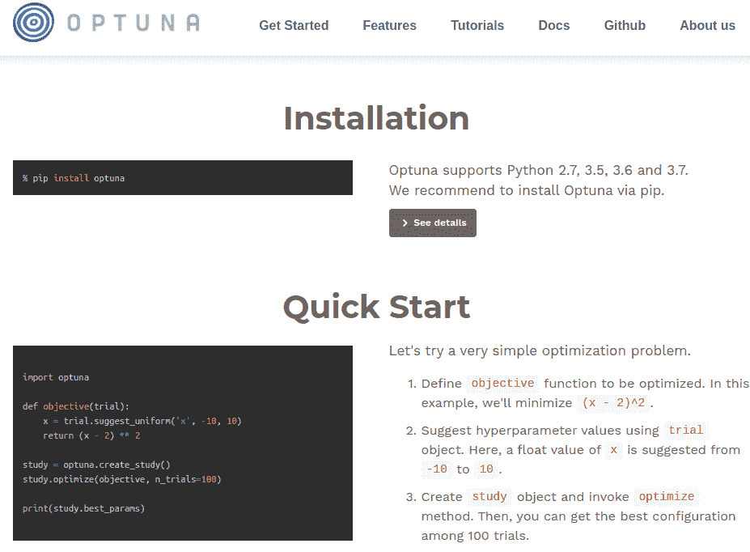
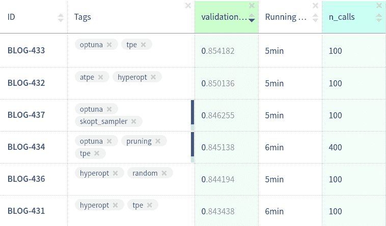

# Optuna vs Hyperopt:应该选择哪个超参数优化库？

> 原文：<https://web.archive.org/web/https://neptune.ai/blog/optuna-vs-hyperopt>

思考应该选择哪个库进行超参数优化？

使用远视有一段时间了，想改变一下吗？

刚刚听说了 Optuna，你想看看它是如何工作的吗？

很好！

在本文中，我将:

*   向您展示一个在实际问题中使用 Optuna 和 Hyperopt 的示例，
*   在 API、文档、功能等方面比较 Optuna 和 Hyperopt，
*   给你我的综合评分和你应该使用哪个超参数优化库的建议。

让我们开始吧。

## 评定标准

## 易用性和 API

在这一节中，我想看看如何为这两个库运行一个基本的超参数调优脚本，看看它有多自然和易用，以及什么是 API。

## optina

您在一个函数中定义了您的**搜索空间和目标。**

此外，您从*试验*对象中抽取超参数。因此，**参数空间是在执行**时定义的。对于那些因为这种**命令式方法而喜欢 Pytorch 的人来说，** Optuna 会感觉很自然。

```py
def objective(trial):
    params = {'learning_rate': trial.suggest_loguniform('learning_rate', 0.01, 0.5),
              'max_depth': trial.suggest_int('max_depth', 1, 30),
              'num_leaves': trial.suggest_int('num_leaves', 2, 100),
              'min_data_in_leaf': trial.suggest_int('min_data_in_leaf', 10, 1000),
              'feature_fraction': trial.suggest_uniform('feature_fraction', 0.1, 1.0),
              'subsample': trial.suggest_uniform('subsample', 0.1, 1.0)}
    return train_evaluate(params)
```

然后，创建*研究*对象并对其进行优化。最棒的是**你可以选择**是否要**最大化或最小化**你的目标。这在优化 AUC 等指标时非常有用，因为您不必在训练前改变目标的符号，然后在训练后转换最佳结果以获得正分数。

```py
study = optuna.create_study(direction='maximize')
study.optimize(objective, n_trials=100)

```

就是这样。

您可能想知道的关于优化的一切都可以在*研究*对象中找到。

我喜欢 Optuna 的一点是，我可以定义如何动态地对我的搜索空间进行采样，这给了我很大的灵活性。选择优化方向的能力也很不错。

如果你想看完整的代码示例，你可以[向下滚动到示例脚本](/web/20221007120429/https://neptune.ai/blog/optuna-vs-hyperopt#12)。

### **10 / 10**

## 远视

首先定义参数搜索空间:

```py
SPACE = {'learning_rate': 
hp.loguniform('learning_rate',np.log(0.01),np.log(0.5)),
         'max_depth': 
hp.choice('max_depth', range(1, 30, 1)),
         'num_leaves': 
hp.choice('num_leaves', range(2, 100, 1)),
         'subsample': 
hp.uniform('subsample', 0.1, 1.0)}
```

然后，创建一个想要最小化的目标函数。这意味着你将不得不**翻转你的目标**的符号，以获得更高更好的指标，如 AUC。

```py
def objective(params):
    return -1.0 * train_evaluate(params)
```

最后，实例化 *Trials()* 对象，并在参数搜索*空间*最小化*目标*。

```py
trials = Trials()
_ = fmin(objective, SPACE, trials=trials, algo=tpe.suggest, max_evals=100)
```

…完成了！

关于被测试的超参数和相应分数的所有信息都保存在*试验*对象中。

我不喜欢的是，即使在最简单的情况下，我也需要实例化 *Trials()* 。我宁愿让 *fmin* 返回*试用版*并默认进行实例化。

### **9 / 10**

这两个库在这里都做得很好，但是我觉得 **Optuna 稍微好一点**,因为它具有灵活性、对采样参数的命令式方法以及较少的样板文件。

**易用性和 API**

* * *

> **>远视**
> 
> **选项、方法和超级(超级参数)**

 *** * *

## 在现实生活中，运行超参数优化需要远离黄金路径的许多额外选项。我特别感兴趣的领域有:

搜索空间

*   优化方法/算法
*   回收
*   持续和重新开始参数扫描
*   修剪没有希望的运行
*   处理异常
*   在这一节中，我将比较 Optuna 和 Hyperopt。

搜索空间

### 在本节中，我想比较搜索空间的定义、定义复杂空间的灵活性以及每个参数类型(浮点型、整数型、分类型)的采样选项。

optina

## 您可以找到所有超参数类型的采样选项:

对于分类参数，您可以使用*trials . suggest _ categorial*

*   对于整数有 *trials.suggest_int*
*   对于浮点参数，您有*个试验.建议 _ 统一*、*个试验.建议 _ 统一*甚至更奇特的*个试验.建议 _ 离散 _ 统一*
*   特别是对于整数参数，您可能希望有更多的选项，但它处理的是大多数用例。这个库的最大特点是，你可以从参数空间中动态采样，你可以随心所欲。您可以使用 if 语句，可以更改搜索间隔，可以使用来自 *trial* 对象的信息来指导您的搜索。

太棒了，你可以做任何事情！

```py
def objective(trial):
    classifier_name = trial.suggest_categorical('classifier', ['SVC', 'RandomForest'])
    if classifier_name == 'SVC':
        svc_c = trial.suggest_loguniform('svc_c', 1e-10, 1e10)
        classifier_obj = sklearn.svm.SVC(C=svc_c)
    else:
        rf_max_depth = int(trial.suggest_loguniform('rf_max_depth', 2, 32))
        classifier_obj = sklearn.ensemble.RandomForestClassifier(max_depth=rf_max_depth)

    ...
```

**10 / 10**

### 远视

## 搜索空间是 Hyperopt 真正为您提供大量采样选项的地方:

对于分类参数，您有 *hp.choice*

*   对于整数，你得到 *hp.randit* ， *hp.quniform* ， *hp.qloguniform* 和 *hp.qlognormal*
*   对于浮动，我们有 *hp.normal* ， *hp.uniform* ， *hp.lognormal* 和 *hp.loguniform*
*   据我所知，这是目前最广泛的采样功能。

您可以在运行优化之前定义您的搜索空间，但是您可以创建非常复杂的参数空间:

通过将 *hp.choice* 与其他采样方法相结合，我们可以拥有条件空间。当你在为涉及预处理、特征工程和模型训练的机器学习管道优化超参数时，这**是有用的。**

```py
SPACE = hp.choice('classifier_type', [
    {
        'type': 'naive_bayes',
    },
    {
        'type': 'svm',
        'C': hp.lognormal('svm_C', 0, 1),
        'kernel': hp.choice('svm_kernel', [
            {'ktype': 'linear'},
            {'ktype': 'RBF', 'width': hp.lognormal('svm_rbf_width', 0, 1)},
            ]),
    },
    {
        'type': 'dtree',
        'criterion': hp.choice('dtree_criterion', ['gini', 'entropy']),
        'max_depth': hp.choice('dtree_max_depth',
            [None, hp.qlognormal('dtree_max_depth_int', 3, 1, 1)]),
        'min_samples_split': hp.qlognormal('dtree_min_samples_split', 2, 1, 1),
    },
    ])
```

**10 / 10**

### 不得不说**他们俩**我都喜欢。我可以很容易地定义嵌套搜索空间，并且我有很多针对所有参数类型的采样选项。 **Optuna 有命令式的参数定义**，提供了更多的灵活性，而**hyperpt 有更多的参数采样选项**。

**搜索空间**

* * *

> Optuna =远视
> 
> 优化方法

* * *

### Optuna 和 Hyperopt **都使用相同的优化方法**。他们有:

***rand.suggest*** 【远视】***samplers . random sampler***【Optuna】

你对参数的标准随机搜索。

***tpe.suggest*** (远视)和***samplers . TPE . sampler . TPE sampler***(Optuna)

Parzen 估计树(TPE)。这种方法背后的想法类似于之前关于 [Scikit Optimize](/web/20221007120429/https://neptune.ai/blog/scikit-optimize) 的博文中所解释的。我们**使用一个便宜的代理模型来估计昂贵的目标函数**在一组参数上的性能。

Scikit Optimize 和 Parzen Tree Estimators(TPE)中使用的方法之间的区别在于，我们要估计尾部的密度，而不是估计实际性能(点估计)。我们希望能够判断跑步是好的(右尾)还是坏的(左尾)。

我喜欢 AutoML.org 弗莱堡的[的了不起的人们从](https://web.archive.org/web/20221007120429/https://www.automl.org/) [AutoML_Book](https://web.archive.org/web/20221007120429/https://www.automl.org/wp-content/uploads/2019/05/AutoML_Book.pdf) 中摘录的以下解释。

树 Parzen 估计器对密度函数 p(λ|y < α)和 p(λ|y ≥ α)进行建模，而不是对给定配置λ的观测值 y 的概率 p(y|λ)进行建模。给定百分位数α(通常设置为 15%)，观察值分为好的观察值和坏的观察值，简单的一维 Parzen 窗口用于模拟这两种分布。

> 通过使用 p(λ|y < α)和 p(λ|y ≥ α),您可以估计参数配置相对于以前最佳配置的预期改进。

有趣的是，对于 Optuna 和 Hyperopt 来说，在优化器中都没有指定 **α** 参数的选项。

optina

## ***一体化。***

Optuna 允许您使用来自 Scikit-Optimize (skopt)的采样器。

Skopt 提供了许多基于树的方法作为代理模型的选择。

为了使用它们，您需要:

创建一个 *SkoptSampler* 实例，在 *skopt_kwargs* 参数中指定代理模型和获取函数的参数，

*   将*采样器*实例传递给 *optuna.create_study* 方法
*   ***梅干。成功 halvingpruner***

```py
from optuna.integration import SkoptSampler

sampler = SkoptSampler(skopt_kwargs={'base_estimator':'RF',
                                     'n_random_starts':10,
                                     'base_estimator':'ET',
                                     'acq_func':'EI',
                                     'acq_func_kwargs': {'xi':0.02})
study = optuna.create_study(sampler=sampler)
study.optimize(objective, n_trials=100)
```

你也可以使用多臂 bandit 方法之一，称为异步连续减半算法(ASHA)。如果你对细节[感兴趣，请阅读论文](https://web.archive.org/web/20221007120429/https://arxiv.org/abs/1810.05934)，但大意是:

运行一段时间的参数配置

*   每隔一段时间删除(一半)最没有希望的运行
*   多运行一些参数配置
*   每隔一段时间删除(一半)最没有希望的运行
*   当只剩下一个配置时停止
*   通过这样做，搜索可以集中在更有希望的运行上。然而，配置预算的静态分配在实践中是一个问题(一种叫做 [HyperBand](https://web.archive.org/web/20221007120429/https://arxiv.org/abs/1603.06560) 的新方法解决了这个问题)。

在 Optuna 中使用 ASHA 非常容易。只需将一个*成功的 HalvingPruner* 传递给*。create_study()* 一切就绪:

简单明了。

```py
from optuna.pruners import SuccessiveHalvingPruner

optuna.create_study(pruner=SuccessiveHalvingPruner())
study.optimize(objective, n_trials=100)
```

如果你想了解更多，你可以看看我的关于 Scikit Optimize 的文章。

总的来说，现在优化函数有很多选择。然而，有一些重要的，如[超级乐队或 BOHB](https://web.archive.org/web/20221007120429/https://github.com/automl/HpBandSter) 失踪。

**8 / 10**

### 远视

 **## 最近添加的自适应 TPE 是由 ElectricBrain 发明的，它实际上是他们在 TPE 基础上实验的一系列(不那么)小的改进。

作者在这篇引人入胜的博文中彻底解释了他们对 TPE 的方法和修改。

超级好用。代替 *tpe.suggest* 你需要将 *atpe.suggest* 传递给你的 *fmin* 函数。

我真的很喜欢这种在库中包含新优化算法的努力，特别是因为这是一种新的原创方法，而不仅仅是与现有算法的集成。

希望在未来的多臂 bandid 方法，如 Hyperband，BOHB，或基于树的方法，如 SMAC3 也将包括在内。

```py
from hyperopt import fmin, atpe

best = fmin(objective, SPACE, 
            max_evals=100, 
            algo=atpe.suggest)

```

**8 / 10**

**优化方法**

### Optuna =远视**  *** * *

> 复试
> 
> 在这一节中，我想看看在每次迭代之后定义回调来监控/快照/修改训练有多容易。这是有用的，尤其是当你的训练是长期的和/或分散的。

* * *

### optina

用户回调在*的*回调*参数下**得到了很好的支持**。优化()*方法。只需传递一个将*研究*和*试验*作为输入的可调用列表，您就可以开始了。

## 因为您可以访问*研究*和*试验*，所以您可以灵活地检查、提前停止或修改未来的搜索。

**10 / 10**

```py
def neptune_monitor(study, trial):
    neptune.log_metric('run_score', trial.value)
    neptune.log_text('run_parameters', str(trial.params))
...
study.optimize(objective, n_trials=100, callbacks=[neptune_monitor])
```

远视

### 本质上没有回调，但是你可以把你的回调函数放在*目标*中，它将在每次调用*目标*时被执行。

## 我不喜欢它，但我想我可以忍受。

**2010 年 6 月**

```py
def monitor_callback(params, score):
    neptune.send_metric('run_score', score)
    neptune.send_text('run_parameters', str(params))

def objective(params):
    score = -1.0 * train_evaluate(params) 
    monitor_callback(params, score)
    return score
```

Optuna 让*回调*参数变得非常简单，而在 Hyperopt 中，你必须修改目标。

### **回调**

**>远视**

 *** * *

> 注意:
> 
> *opt . utils . Neptune _ monitor*:记录运行分数和运行参数，并绘制迄今为止的分数

* * *

### *opt_utils.log_study* :记录最佳结果、最佳参数和研究对象本身

*   只需将此添加到您的脚本中:
*   持续和重新启动

保存和加载您的超参数搜索可以节省您的时间和金钱，并有助于获得更好的结果。让我们比较一下这两个框架。

```py
import neptune
import neptunecontrib.monitoring.optuna as opt_utils

neptune.init('jakub-czakon/blog-hpo')
neptune.create_experiment(name='optuna sweep')

monitor = opt_utils.NeptuneMonitor()
study = optuna.create_study(direction='maximize')
study.optimize(objective, n_trials=100, callbacks=[monitor])
opt_utils.log_study(study)
```

### optina

简单地使用 *joblib.dump* 来腌制*试验*对象。

## …您可以稍后使用 *joblib.load* 加载它以重新开始搜索。

就是这样。

```py
study.optimize(objective, n_trials=100)
joblib.dump(study, 'artifacts/study.pkl')
```

对于**分布式设置**,您可以使用研究的**名称**,以及数据库的 **URL，在此您将分布式研究用于实例化新研究。例如:**

```py
study = joblib.load('../artifacts/study.pkl')
study.optimize(objective, n_trials=200)
```

很好很容易。

关于在[速度和并行化](/web/20221007120429/https://neptune.ai/blog/optuna-vs-hyperopt#11)部分使用 Optuna 运行分布式超参数优化的更多信息。

```py
study = optuna.create_study(
                    study_name='example-study', 
                    storage='sqlite:///example.db', 
                    load_if_exists=True)

```

**10 / 10**

远视

### 与 Optuna 类似，使用 *joblib.dump* 来处理*试验*对象。

## …用 *joblib.load* 加载并重启。

简单和工程没有问题。

```py
trials = Trials()  
_ = fmin(objective, SPACE, trials=trials, 
         algo=tpe.suggest, max_evals=100)
joblib.dump(trials, 'artifacts/hyperopt_trials.pkl')
```

如果您正在以一种**分布式**方式优化超参数，您可以加载连接到 MongoDB 的 *MongoTrials()* 对象。在[速度和并行化](/web/20221007120429/https://neptune.ai/blog/optuna-vs-hyperopt#11)一节中有更多关于使用 Hyperopt 运行分布式超参数优化的信息。

```py
trials = joblib.load('artifacts/hyperopt_trials.pkl')
_ = fmin(objective, SPACE, trials=trials, 
         algo=tpe.suggest, max_evals=200)
```

**10 / 10**

两者都使工作变得容易并完成。

### **持续并重启**

Optuna =远视

* * *

> 运行修剪
> 
> 并非所有的超参数配置都是相同的。对于他们中的一些人，你可以很快看出他们不会得到高分。理想情况下，您希望尽快停止这些运行，而是尝试不同的参数。
> 
> Optuna 为您提供了一个通过**修剪回调的选项。**支持多种机器学习框架:

* * *

### *KerasPruningCallback, TFKerasPruningCallback*

*TensorFlowPruningHook*

*pytorchchinitelusingandler，pytorchlineninginingcallback*

*   *FastAIPruningCallback*
*   light gbmpunigcallback
*   *XGBoostPruningCallback*
*   *还有更*
*   你可以在文档中读到它们。
*   例如，在 lightGBM 训练的情况下，您可以将这个回调传递给 *lgb.train* 函数。
*   只有 Optuna 给你这个选择，所以这是一个明显的胜利。

**运行修剪**

**>远视**

```py
def train_evaluate(X, y, params, pruning_callback=None):
    X_train, X_valid, y_train, y_valid = train_test_split(X, y, test_size=0.2, random_state=1234)

    train_data = lgb.Dataset(X_train, label=y_train)
    valid_data = lgb.Dataset(X_valid, label=y_valid, reference=train_data)

    callbacks = [pruning_callback] if pruning_callback is not None else None

    model = lgb.train(params, train_data,
                      num_boost_round=NUM_BOOST_ROUND,
                      early_stopping_rounds=EARLY_STOPPING_ROUNDS,
                      valid_sets=[valid_data],
                      valid_names=['valid'],
                      callbacks=callbacks)
    score = model.best_score['valid']['auc']
    return score

def objective(trial):
    params = {'learning_rate': trial.suggest_loguniform('learning_rate', 0.01, 0.5),
              'max_depth': trial.suggest_int('max_depth', 1, 30),
              'num_leaves': trial.suggest_int('num_leaves', 2, 100),
              'min_data_in_leaf': trial.suggest_int('min_data_in_leaf', 10, 1000),
              'feature_fraction': trial.suggest_uniform('feature_fraction', 0.1, 1.0),
              'subsample': trial.suggest_uniform('subsample', 0.1, 1.0)}

    pruning_callback = LightGBMPruningCallback(trial, 'auc', 'valid')
    return train_evaluate(params, pruning_callback)
```

处理异常

* * *

> 如果由于错误的参数组合、随机训练错误或其他问题导致您的一次运行失败，您可能会丢失到目前为止在研究中评估的所有*parameter _ configuration:score*对。
> 
> 您可以在每次迭代后使用回调来保存这些信息，或者使用 DB 来存储这些信息，如[速度和并行化](/web/20221007120429/https://neptune.ai/blog/optuna-vs-hyperopt#11)一节中所述。

* * *

### 但是，即使出现例外情况，您也可能希望让这项研究继续进行。为了使之成为可能，Optuna 允许您将允许的异常传递给*。optimize()* 方法。

还是那句话，只有 Optuna 支持这个。

**处理异常**

**>远视**

```py
def objective(trial):
    params = {'learning_rate': trial.suggest_loguniform('learning_rate', 0.01, 0.5),
              'max_depth': trial.suggest_int('max_depth', 1, 30),
              'num_leaves': trial.suggest_int('num_leaves', 2, 100)}

    print(non_existent_variable)

    return train_evaluate(params)

study = optuna.create_study(direction='maximize')
study.optimize(objective, n_trials=100, catch=(NameError,))
```

证明文件

* * *

> 当你是一个库或框架的用户时，在你需要的时候找到你需要的信息是绝对重要的。这就是文档/支持渠道发挥作用的地方，它们可以创建或破坏一个库。
> 
> 让我们看看 Optuna 和 Hyperopt 在这方面的比较。

* * *

## optina

是**真的好**。

有一个[适当的网页](https://web.archive.org/web/20221007120429/https://optuna.org/)解释了所有的基本概念，并告诉你在哪里可以找到更多的信息。

## 此外，有一个完整的和非常容易理解的[文档。](https://web.archive.org/web/20221007120429/https://optuna.readthedocs.io/en/latest/tutorial/index.html)

它包含:

包含简单和高级示例的教程



API 参考与所有的函数包含美丽的文件字符串。为了给你一个概念，想象一下在你的 docstrings 中有图表，这样你可以更好地理解在你的函数中发生了什么。如果你不相信我，请查看一下 *[BaseSampler](https://web.archive.org/web/20221007120429/https://optuna.readthedocs.io/en/latest/reference/samplers.html#optuna.samplers.BaseSampler)* 。

还有一点很重要，那就是来自 [Preferred Networks](https://web.archive.org/web/20221007120429/https://preferred.jp/ja/) 的支持团队非常关心这个项目。他们对 Github 的问题做出回应，社区也围绕着 Github 不断成长，有很多很棒的功能想法和 pr 出现。查看 [Github 项目问题版块](https://web.archive.org/web/20221007120429/https://github.com/pfnet/optuna/issues)，看看那里发生了什么。

*   **10 / 10**
*   远视

它最近更新了，现在已经很好了。

### 这里可以找到[。](https://web.archive.org/web/20221007120429/http://hyperopt.github.io/hyperopt/scaleout/mongodb/)

## 您可以轻松找到以下信息:

如何开始

如何定义简单和高级搜索空间

如何运行安装

*   如何通过 MongoDB 或 Spark 并行运行 Hyperopt
*   不幸的是，有些事情我不喜欢:
*   文档字符串中缺少 API 引用所有函数/方法
*   大多数方法/函数都缺少 docstrings 本身，这迫使您阅读实现(这里有一些积极的副作用:)

没有使用自适应 TPE *的例子。*我不确定我是否正确使用了它，我是否应该指定一些额外的(超级)超级参数。缺少 docstrings 在这里对我也没有帮助。

*   文档里有一些 404 的链接。
*   总的来说，最近有了很大的进步，但我有时还是会有点迷失。我希望随着时间的推移，它会变得更好，所以请保持关注。
*   好的是**，有很多关于它的博文**。其中一些我认为有用的是:
*   文档不是这个项目最强的方面，但是因为它是经典的，所以有很多资源。

**2010 年 6 月**

**文档**

**>远视**

 **### 形象化**  *** * *

> 可视化超参数搜索非常有用。您可以获得参数之间交互的信息，并了解下一步应该在哪里搜索。
> 
> 这就是为什么我想比较 Optuna 和 Hyperopt 提供的可视化套装。

* * *

## optina

在***optuna . visualization***模块中有一些很棒的可视化效果:

*plot_contour:* 在交互图表上绘制参数交互。您可以选择想要探索的超参数。

## *plot _ optimization _ history:*显示所有试验的分数，以及到目前为止每个点的最佳分数。

*plot _ parallel _ coordinate:*交互可视化超参数和分数

*   *plot_slice:* 展示了搜索的**演变。你可以看到在超参数空间中你的搜索去了哪里，以及**空间的哪些部分被探索得更多。****

```py
plot_contour(study, params=['learning_rate',
                            'max_depth',
                            'num_leaves',
                            'min_data_in_leaf',
                            'feature_fraction',
                            'subsample'])
```

*   总的来说，Optuna 中的**可视化是不可思议的**！

```py
plot_optimization_history(study)
```

*   它们允许您放大超参数交互，并帮助您决定如何运行下一次参数扫描。了不起的工作。

```py
plot_parallel_coordinate(study)
```

*   **10 / 10**

```py
plot_slice(study)
```

Optuna 中可用的可视化给我留下了非常深刻的印象。有用、互动、美观。

**可视化**

### **>远视**

 **注意:

* * *

> 如果你想玩这些可视化，你可以使用我为每个实验保存为“study.pkl”的 ***研究*** 对象。
> 
> 速度和并行化

* * *

### 当谈到超参数优化时，能够在您的机器或许多机器(集群)上分布您的训练可能是至关重要的。

这就是为什么，我检查了 Optuna 和 Hyperopt 的分布式训练选项。

optina

您可以在一台机器或一群机器上运行分布式超参数优化，这实际上非常简单。

对于一台机器，你只需改变你的*中的 *n_jobs* 参数。优化()*方法。

## 要在集群上运行它，您需要**创建一个驻留在数据库**中的研究(您可以[在许多关系数据库](https://web.archive.org/web/20221007120429/https://optuna.readthedocs.io/en/latest/tutorial/004_distributed.html#distributed)中进行选择)。

有两种选择可以做到这一点。您可以通过命令行界面来完成:

您也可以在优化脚本中创建一个研究。

## 通过使用 *load_if_exists=True* 你可以**以同样的方式对待你的主脚本和工作脚本**，这简化了很多事情！

最后，您可以从多台机器上运行您的工作脚本，它们都将使用来自研究数据库的相同信息。

容易和工作像一个魅力！

```py
study.optimize(objective, n_trials=100, n_jobs=12)
```

**10 / 10**

远视

```py
optuna create-study \
    --study-name "distributed-example" \
    --storage "sqlite:///example.db"
```

你可以将你的计算分布在一群机器上。很好，一步一步的指导可以在 Tanay Agrawal 的博客文章中找到，但是简单来说，你需要:

**启动一个装有 MongoDB** 的服务器，它将从您的工人培训脚本中获取结果，并发送下一个参数集进行尝试，

```py
study = optuna.create_study(
    study_name='distributed-example', 
    storage='sqlite:///example.db',
    load_if_exists=True)
study.optimize(objective, n_trials=100)
```

在您的训练脚本中，创建一个指向您在上一步中启动的数据库服务器的 *MongoTrials()* 对象，而不是 *Trials()* ，

```py
terminal-1$ python run_worker.py
```

```py
terminal-25$ python run_worker.py
```

将你的*目标*函数移动到一个单独的*目标. py* 脚本中，并将其重命名为函数，

### 编译您的 Python 训练脚本，

## 跑 ***远视-蒙哥-工***

虽然它完成了任务，但感觉并不完美。您需要围绕*目标*函数做一些杂耍，在 CLI 中启动 MongoDB 可能会使事情变得更容易。

*   值得一提的是，**通过 *SparkTrials* 对象与 Spark** 的集成是最近才添加的。有一个[逐步指南](https://web.archive.org/web/20221007120429/http://hyperopt.github.io/hyperopt/scaleout/spark/)来帮助你开始，你甚至可以使用 [spark-installation 脚本](https://web.archive.org/web/20221007120429/https://github.com/hyperopt/hyperopt/blob/master/download_spark_dependencies.sh)来使事情变得更容易。
*   完全按照您期望的方式工作。
*   简单又好看！
*   **9 / 10**
*   两个库都支持分布式培训，这很好。然而，Optuna 在更简单、更友好的界面方面做得更好。

**速度和并行化**

**>远视**

```py
best = hyperopt.fmin(fn = objective,
                     space = search_space,
                     algo = hyperopt.tpe.suggest,
                     max_evals = 64,
                     trials = hyperopt.SparkTrials())
```

实验结果*

*需要明确的是，这些是针对一个示例问题和**的**结果，每个库/配置运行一次**，它们不保证通用性。要运行一个合适的基准测试，您需要在不同的数据集上运行多次。**

### 也就是说，作为一名从业者，我希望看到对每个问题的随机搜索有所改进。否则，为什么要去 HPO 图书馆呢？**  **好的，作为一个例子，让我们在一个表格，**二元分类**问题上调整 **lightGBM** 模型的超参数。如果您想像我一样使用相同的数据集，您应该:

* * *

> 为了让训练更快，我将**的助推轮数固定为 300，并提前 30 轮停止**。
> 
> 所有的训练和评估逻辑都放在 *train_evaluate* 函数中。我们可以**将其视为一个黑盒**，它获取数据和超参数集并生成 AUC 评估分数。

* * *

## 注意:

您实际上可以将每个以参数作为输入并输出分数的脚本转换成这样的 **train_evaluate。**完成后，您可以将其视为黑盒并调整您的参数。

要根据一组参数训练模型，您需要运行如下内容:

对于这项研究，我试图在 **100 运行预算**内找到最佳参数。

我做了 6 个实验:

```py
import lightgbm as lgb
from sklearn.model_selection import train_test_split

NUM_BOOST_ROUND = 300
EARLY_STOPPING_ROUNDS = 30

def train_evaluate(X, y, params):
    X_train, X_valid, y_train, y_valid = train_test_split(X, y, 
                                                          test_size=0.2, 
                                                          random_state=1234)

    train_data = lgb.Dataset(X_train, label=y_train)
    valid_data = lgb.Dataset(X_valid, label=y_valid, reference=train_data)

    model = lgb.train(params, train_data,
                      num_boost_round=NUM_BOOST_ROUND,
                      early_stopping_rounds=EARLY_STOPPING_ROUNDS,
                      valid_sets=[valid_data], 
                      valid_names=['valid'])

    score = model.best_score['valid']['auc']
    return score
```

随机搜索(来自 hyperopt)作为参考

### Optuna 和 Hyperopt 的 Parzen 估计量搜索策略树

来自 Hyperopt 的自适应 TPE

来自 Optuna 的 TPE，带有修剪回调，用于更多运行，但在相同的时间范围内。结果是，有修剪的 400 次运行与没有修剪的 100 次运行花费的时间一样多。

```py
import pandas as pd

N_ROWS=10000
TRAIN_PATH = '/mnt/ml-team/minerva/open-solutions/santander/data/train.csv'

data = pd.read_csv(TRAIN_PATH, nrows=N_ROWS)
X = data.drop(['ID_code', 'target'], axis=1)
y = data['target']

MODEL_PARAMS = {'boosting': 'gbdt',
                'objective':'binary',
                'metric': 'auc',
                'num_threads': 12,
                'learning_rate': 0.3,
                }

score = train_evaluate(X, y, MODEL_PARAMS)
print('Validation AUC: {}'.format(score))
```

基于 skopt 的 Optuna 随机森林替代模型。取样器

参见[超参数优化脚本](https://web.archive.org/web/20221007120429/https://ui.neptune.ai/jakub-czakon/blog-hpo/e/BLOG-433/source-code?path=.&file=search_optuna.py)示例。

*   如果你想更详细地探索所有这些实验，你可以简单地进入[实验仪表板](https://web.archive.org/web/20221007120429/https://ui.neptune.ai/jakub-czakon/blog-hpo/experiments?viewId=817cbbbb-103e-11ea-9a39-42010a840083)。
*   **Optuna 和 Hyperopt 都比随机搜索**有所改进，这很好。
*   来自 **Optuna 的 TPE 实现略好于 Hyperopt 的**自适应 TPE，但好不了多少。另一方面，当运行超参数优化时，这些小的改进正是您想要的。
*   有趣的是，HPO 和 Optuna 的 TPE 实现在这个问题上给出了非常不同的结果。也许好的和坏的参数配置 ***λ*** 之间的分界点选择不同，或者采样方法的默认值更适合这个特定的问题。
*   此外，**使用修剪减少了 4 倍的训练时间**。我可以在不修剪的情况下运行 100 次搜索的时间内运行 400 次搜索。另一方面，**使用修剪得到了较低的分数。**您的问题可能不同，但在决定是否使用修剪时，考虑这一点很重要。

对于这一部分，我根据对随机搜索策略的改进来打分。

[](https://web.archive.org/web/20221007120429/https://ui.neptune.ai/jakub-czakon/blog-hpo/experiments?viewId=817cbbbb-103e-11ea-9a39-42010a840083)

*Experiments for Optuna and Hyperopt in different configurations*

**远视**得到(0.850–0.844)* 100 =**6**

**Optuna**got(0.854–0.844)* 100 =**10**

**实验结果**

**>远视**

 **结论

*   让我们来看看总体得分:
*   即使你大方地看待它，只考虑两个库共有的特性， **Optuna 也是一个更好的框架。**

* * *

> 在所有标准上，它都达到或略好于标准，并且:
> 
> 它有更好的文档
> 
> 它有更好可视化套件

* * *

## 它有一些 hyperopt 不支持的特性，比如修剪、回调和异常处理

在做了所有这些研究之后，我确信 **Optuna 是一个很棒的超参数优化库**。

此外，我认为**如果你在过去使用超远眼镜**,你应该强烈考虑更换。

雅各布·查肯

*   大部分是 ML 的人。构建 MLOps 工具，编写技术资料，在 Neptune 进行想法实验。
*   **阅读下一篇**
*   如何跟踪机器学习模型的超参数？

卡米尔·卡什马雷克|发布于 2020 年 7 月 1 日

Moreover, I think that **you should strongly consider switching from Hyperopt** if you were using that in the past. 

### **机器学习算法可通过称为超参数**的多个量规进行调整。最近的深度学习模型可以通过数十个超参数进行调整，这些超参数与数据扩充参数和训练程序参数一起创建了非常复杂的空间。在强化学习领域，您还应该计算环境参数。

数据科学家要**控制好** **超参数** **空间**，才能**使** **进步**。

* * *

在这里，我们将向您展示**最近的** **实践**，**提示&技巧，**和**工具**以最小的开销高效地跟踪超参数。你会发现自己掌控了最复杂的深度学习实验！

## 为什么我应该跟踪我的超参数？也就是为什么这很重要？

几乎每一个深度学习实验指南，像[这本深度学习书籍](https://web.archive.org/web/20221007120429/https://www.deeplearningbook.org/contents/guidelines.html)，都建议你如何调整超参数，使模型按预期工作。在**实验-分析-学习循环**中，数据科学家必须控制正在进行的更改，以便循环的“学习”部分正常工作。

哦，忘了说**随机种子也是一个超参数**(特别是在 RL 领域:例如检查[这个 Reddit](https://web.archive.org/web/20221007120429/https://www.reddit.com/r/MachineLearning/comments/76th74/d_why_random_seeds_sometimes_have_quite_large/) )。

超参数跟踪的当前实践是什么？

让我们逐一回顾一下管理超参数的常见做法。我们关注于如何构建、保存和传递超参数给你的 ML 脚本。

Here, we will show you **recent** **practices**, **tips & tricks,** and **tools** to track hyperparameters efficiently and with minimal overhead. You will find yourself in control of most complex deep learning experiments!

## Why should I track my hyperparameters? a.k.a. Why is that important?

Almost every deep learning experimentation guideline, like [this deep learning book](https://web.archive.org/web/20221007120429/https://www.deeplearningbook.org/contents/guidelines.html), advises you on how to tune hyperparameters to make models work as expected. In the **experiment-analyze-learn loop**, data scientists must control what changes are being made, so that the “learn” part of the loop is working.

Oh, forgot to say that **random seed is a hyperparameter** as well (especially in the RL domain: check [this Reddit](https://web.archive.org/web/20221007120429/https://www.reddit.com/r/MachineLearning/comments/76th74/d_why_random_seeds_sometimes_have_quite_large/) for example).

## What is current practice in the hyperparameters tracking?

Let’s review one-by-one common practices for managing hyperparameters. We focus on how to build, keep and pass hyperparameters to your ML scripts.

[Continue reading ->](/web/20221007120429/https://neptune.ai/blog/how-to-track-hyperparameters)

* * *******************