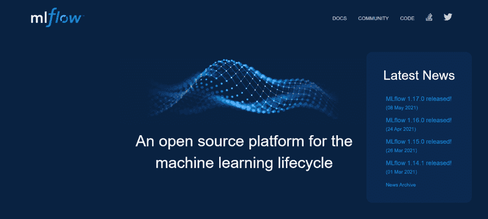

# 打包 ML 模型:Web 框架和 MLOps

> 原文：<https://web.archive.org/web/https://neptune.ai/blog/packaging-ml-models>

在本文中，我们将了解**顶级打包工具——基于网络的框架和 MLOps**——数据科学和 ML 项目的内容、原因和方式。数据科学家和机器学习工程师需要特定的工具来端到端地构建、部署和监控这些项目。

我们将详细介绍几种工具，以及它们的关键组件和特性。不需要介绍，我们走吧！

### 可能有用

找到最适合您的使用情形的 MLOps 工具👉 [MLOps 工具景观](https://web.archive.org/web/20221007164322/https://mlops.neptune.ai/)

## 机器学习开发生命周期

我们处理的所有 ML 项目都有许多迭代步骤，需要同步执行才能获得最佳结果。当 ML 模型和数据不断增长时，数据科学团队手动管理这些步骤变得很乏味。

这就产生了操作整个机器学习开发生命周期的想法。但是最好的方法是什么呢？理想情况下，我们需要在关键利益相关者之间划分 ML 项目工作，并且每个团队成员需要以高度协作的方式工作，以使项目成功。

## 机器学习和数据科学生命周期的利益相关者

为了了解如何以迭代和自动化的方式处理任何机器学习项目，我们需要首先了解平均机器学习和数据科学生命周期的所有利益相关者。中小企业、数据科学家和数据工程师是最受欢迎的角色，但每个利益相关者在 ML 项目的成功中都扮演着重要的角色。让我们看看不同的团队成员通常负责什么。

**主题专家(SME)**

*   专注于非常重要的业务问题。
*   确保模型性能满足业务需求/目标。
*   分析业务需求和目标。

**数据分析师/业务分析师**

*   处理数据分析和 EDA。
*   协助开发数据功能。
*   为 ML 流程(ETL)优化和构建数据提取。

**数据工程师**

*   分析和组织数据。
*   构建重要的数据管道。
*   在项目上与 SME、数据分析师、数据科学家和数据架构师合作。

**数据科学家**

*   开发模型来回答中小企业提出的问题。
*   应用预测分析和统计。
*   审查模型结果、准确性并重新培训模型。

**ML 工程师**

*   测试模型，并将它们交付到生产中，以产生商业价值。
*   根据客户要求设计和开发机器学习应用程序。
*   扩展和丰富了用于深度学习和机器学习的现有框架和库

**软件工程师**

*   开发使用 ML 模型的 API 或应用程序。
*   使用各种工具验证机器学习模型是否正确运行。
*   使用 API 将 ML 应用集成为 Web 应用。

**机器学习架构师**

*   作为生产部署的一部分，优化机器学习模型的架构。
*   支持在生产中部署模型的扩展。
*   与数据科学团队的每个成员合作，并指导 ML 项目。

开发工程师

*   为所有环境中的模型处理持续集成和持续部署管道。
*   处理支持模型的体系结构的安全性、集成和性能。

**BI(商业智能)开发人员**

*   开发、部署和维护界面，如数据可视化、查询工具和业务仪表板。
*   将业务需求转化为技术需求。设定 BI 工具的业务需求。

涉众通常被隔离在不同的小组和团队中。有了 ML 打包工具，利益相关者可以作为一个合作团体来计算和避免公司的风险。将模型从开发转移到生产和扩展是伴随 ML 项目的常见挑战。它们会导致实现和部署模型的交付时间延长。

ML 打包工具是为了优化数据科学和 ML 生命周期而创建的。多亏了这些工具，沟通和实施流程得以简化。您可以避免突然有太多的涉众无法跟踪谁做了什么的情况，因为工具可以为您跟踪这一点。请记住，这些角色和职责在不同的公司会有所不同。

## 数据科学和 ML 项目面临的五大问题

在数据科学项目中，我们可能会遇到以下五个挑战:

**1。围绕**的大肆宣传带来了很高的期望

*   围绕机器学习的炒作如此之多，人们的期望值通常都定得太高了。数据科学和 ML 需要根据它们的局限性来解释，而不仅仅是潜在的好处。

*   营销人员和媒体往往无法解决这种情况的全部现实，所以他们描绘了一幅强大的技术自动解决问题的美好画面。但是人工智能和人工智能是复杂的技术，任何公司都需要时间来实施和充分利用。他们消耗大量资源来实现投资回报。ML 生命周期中的利益相关者需要从一开始就管理期望。

**2。模特不喜欢匆忙的时间线**

*   创建一个好的机器学习模型需要大量的工作，数据科学家并不总是能够预见准确的开发和实施时间。数据科学项目不应该有严格的里程碑和截止日期。

*   数据科学团队可能在比预期更短或更长的时间内取得成功。企业需要表现出耐心，并继续为团队提供他们需要的资源。

**3。模型应该面向未来，无需维护**

*   在数据科学团队在构建和测试模型上投入了如此多的辛勤工作之后，经常会出现这样的问题:他们的模型是否已经了解了他们所需要的一切。
*   机器学习模型需要不断训练和维护，以适应未来。团队和企业应该确保他们在开始一个 ML 项目时考虑到这样做的成本。

**4。数据收集消耗一半以上的时间**

*   数据在任何数据科学用例中都扮演着至关重要的角色。数据科学团队 60%的工作在于收集数据。对于尝试机器学习的初学者来说，他们可以很容易地找到各种托管公开可用数据的网站。

*   为了实现真实世界的场景，您需要通过 web 抓取、通过 API 收集数据，或者(为了解决业务问题)**从客户端收集数据**(在这种情况下，数据科学家或 ML 工程师需要与主题专家协调和合作来收集数据)。

*   数据一旦被收集，在数据库中可能具有非结构化的格式。正确格式化数据需要数据工程知识。

**5。模型和应用部署**

数据科学生命周期遵循构建应用程序的 7 个步骤:

1)数据收集，

2)数据清洗，

3)特征工程，

4)分析模式，

5)模型训练和优化，

6)验证模型，

7)模型测试、部署和维护。

啊，部署！研究人员和开发人员通常可以执行所有的构建步骤，但是有时**缺乏部署**的技能。由于缺乏实践和依赖性问题，对业务的底层模型理解不足，以及模型不稳定，将他们的应用程序投入生产已经成为最大的挑战之一。这是 DevOps 工程师、ML 工程师可以参与进来将您的模型部署到生产中的地方。

通常，许多开发人员从网站上收集数据，并开始训练他们的模型，但在现实世界中，需要获取动态的数据收集源。离线学习或批量学习不能用于这种类型的可变数据。该系统经过培训，然后投入生产，无需学习即可运行。数据和模型可能会漂移，因为它们可能会经常改变。

我们需要一个打包工具，比如基于 web 的框架或 MLOps 工具，来避免或减轻项目涉众所面临的挑战。

将机器学习解决方案构建为一个端到端的系统，并随着时间的推移不断改进，这是在数据科学项目中实现商业价值的主要障碍。打包工具对此有所帮助。

## ML 项目中的挑战

ML 项目的两大挑战是:

1.  **将 ML 模型投入生产，只有 47%的模型完全部署！**(来源: [Gartner，2019](https://web.archive.org/web/20221007164322/https://www.gartner.com/en/newsroom/press-releases/2018-10-16-gartner-survey-of-more-than-3000-cios-reveals-that-enterprises-are-entering-the-third-era-of-it) )

创建的模型数量和实际投入生产的模型数量之间的差距是企业机器学习成功的巨大障碍。一旦组织能够超越这一点，组织将能够从他们的机器学习投资中获得更大的价值。

2.  **部署机器学习和深度学习模型的时间非常长。**(来源: [Algorithmia，2020](https://web.archive.org/web/20221007164322/https://info.algorithmia.com/hubfs/2019/Whitepapers/The-State-of-Enterprise-ML-2020/Algorithmia_2020_State_of_Enterprise_ML.pdf) )

一项调查显示，将 ML & DL 模型投入生产部署——最终开始增加商业价值——平均需要从 ***8 到 90 天*** 的**时间。更糟糕的是，高达 75%的 ML 项目从未超过实验阶段。**

以下是几个使项目难以进入生产的额外挑战:

*   数据和模型的可扩展性问题，
*   开源试点，不是生产级的，
*   难以部署到业务应用程序和流程中，
*   缺乏开发和集成技能，
*   缺乏资金和合适的工具，
*   数据质量和完整性问题，
*   输入和输出的数据治理和安全性。

## 数据科学中的新兴角色

传统的商业智能和趋势人工智能都在出现，因为它们都使用数据建模(商业智能使用统计技术来分析过去，人工智能进行预测)。

数据科学资源的整体缺乏将导致越来越多的软件开发人员参与创建和管理机器学习模型。( [Gartner 首席信息官调查](https://web.archive.org/web/20221007164322/https://www.gartner.com/en/newsroom/press-releases/2018-10-16-gartner-survey-of-more-than-3000-cios-reveals-that-enterprises-are-entering-the-third-era-of-it))

同样类型的工作将会出现更多的角色名称和职位名称。为此，我们看到数据科学领域涌现出大量热门职位，例如:

*   机器学习工程师，
*   ML 显影剂，
*   ML 架构师，
*   数据工程师，
*   深度学习专家，
*   NLP 工程师，
*   计算机视觉工程师，
*   机器学习操作(MLOps)，
*   人工智能行动。

行业扩张，公司试图将他们自己和他们的才能与众不同。

作为将机器学习模型投入生产的挑战和问题的合理解决方案， **[MLOps](https://web.archive.org/web/20221007164322/https://neptune.ai/blog/mlops-what-it-is-why-it-matters-and-how-to-implement-it-from-a-data-scientist-perspective) 是伴随着现有的 web 和移动开发框架打包方式而出现的新趋势**。

## 如何打包 ML 项目

重要的是将 ML 项目管道(或数据科学生命周期，如下图所示)打包到一个端到端系统中，以实现良好的 ROI。

有两种方法可以打包 ds 和 ML 项目:

1.  基于网络的框架
2.  MLOps

## 1.用基于网络的框架打包 ML 项目

基于 web 的框架是一个代码库，它通过为构建可靠、可伸缩和可维护的 web 应用程序提供通用模式，使 web 开发更快、更有效、更容易。大多数时候，专业的 web 开发项目总是使用现有的 web 框架，如 Flask、FastAPI、Django 或 Pyramid。

### 框架的优势

1.  开源的，
2.  良好的文档和社区，
3.  高效，
4.  安全，
5.  轻松集成。

### 为什么基于 web 的框架有用？

基于 Web 的框架使得非常常见的 HTTP 操作的代码可重用性变得容易&构建项目，使得任何具有框架知识的人都可以快速地构建、维护和支持应用程序。

#### 常见的基于 web 的框架的功能

框架提供了执行常见操作的功能，包括:

*   **输入表单处理和验证**–这个想法是验证数据，然后保存表单，如果它需要一些输入，
*   **URL 路由**–路由机制用于将 URL 直接映射到最终创建网页的代码。
*   **使用模板引擎输出格式**–使用模板引擎生成任何广泛使用的内容类型，如 HTML、XML 和 JSON。
*   **数据库连接**–通过对象关系映射(ORM)进行持久数据操作和数据库连接配置。
*   **Web 安全**–框架为 Web 提供安全保护，防止跨站点脚本(XSS)、跨站点请求伪造(CSRF)、SQL 注入和其他恶意攻击。
*   **会话存储和检索**–无论何时页面会话结束，存储在会话存储器中的数据都会被清除。

#### 全栈框架

全栈框架是一个一体化的地方，其中的库被配置为彼此无缝协作。它可以帮助您构建后端服务、数据库和前端。全栈框架提供了软件开发者构建应用所需的一切。

#### 微观框架

微框架没有全栈框架的大部分功能，比如 web 模板引擎、帐户、授权、认证或输入验证。微框架只提供应用程序所需的组件集。

### 4 个令人惊叹的 Python 基于 web 的框架

#### 1.烧瓶(微框架)

[**Flask**](https://web.archive.org/web/20221007164322/https://flask.palletsprojects.com/en/2.0.x/) 是一个著名且广泛使用的 Python web 框架。这是一个第三方 Python 库，用于开发基于 web 的应用程序。Flask 依赖于 Werkzeug WSGI 工具箱和 Jinja2 模板。最终目的是帮助开发一个强大的 web 应用程序基础。

**烧瓶的主要特征:**

*   内置的开发服务器和快速调试器。
*   RESTful 用于分派请求。
*   HTTP 的请求处理。
*   集成单元测试支持(代码质量)。
*   即插即用任意对象关系映射(ORM)。
*   使用 Jinja2 模板(标签、过滤器、宏等等)。
*   基于 Unicode。
*   100%符合 WSGI 1.0。
*   社区提供的多个扩展简化了新功能的集成。
*   安全 cookies 支持。

#### 2.FastAPI(微框架)

[**FastAPI**](https://web.archive.org/web/20221007164322/https://fastapi.tiangolo.com/) 是一个现代的基于 web 的 API 构建框架，使用 Python 3.6+版本，基于标准 Python 类型，提供高性能。

**FastAPI 的主要特性:**

*   非常好的性能，接近 NodeJS 和 Go，因为它使用了 Starlette 和 Pydantic。目前最快的 Python 框架之一。
*   健壮:获取生产就绪代码。令人惊讶的交互式文档。
*   代码速度:提高开发特性组件的速度，接近 300%*
*   基于标准:完全兼容 API、OpenAPI 和 JSON 模式的开放标准。
*   较小的错误:减少大约 40%的开发人员引起的错误。*
*   轻松学习使用耗时更少的文档。
*   简短:来自每个参数声明的多个特性。
*   直观:强大的编辑器支持，无处不在的完成，更少的调试时间。

#### 3.Django(全栈框架)

[**Django**](https://web.archive.org/web/20221007164322/https://www.djangoproject.com/) 是一个基于 Web 的 Python 框架，它是一个高级的框架，可以快速开发安全且可维护的网站。Django 消除了 web 开发的大部分问题，因此编写应用程序变得非常容易，而不必重新发明轮子。

**Django 的主要特点:**

*   *快得不可思议的*–帮助所有开发人员尽可能快地完成他们基于网络的应用程序的构思。
*   *满载的*–开箱即可处理内容管理、用户认证、站点地图、RSS 订阅源以及更多任务。
*   极度可伸缩性–Django 快速灵活扩展的能力是一个了不起的特性。
*   为了避免许多常见的安全错误，Django 认真对待安全性并帮助开发人员。
*   不可思议的多功能——公司和政府已经使用 Django 建立了各种各样的东西，从内容管理系统，通过社交网络，到科学计算网站。
*   帮助你在应用程序中定义 URL 的模式。
*   最终内置的认证系统。
*   简单而强大的 URL 系统和路由。
*   缓存框架、模板引擎、数据库模式迁移和 ORM。

#### 4.金字塔(介于全栈和微框架之间)

[**金字塔**](https://web.archive.org/web/20221007164322/https://trypyramid.com/) 是一个开源的轻量级 Python web 框架，专注于将小应用程序变成大应用程序。金字塔基于模型-视图-控制器(MVC)架构模式，这是一个 WSGI web 框架。Pyramid 有一个座右铭——从小处开始，大处结束，坚持完成构建的框架在全栈和微框架之间架起了一座桥梁。

**金字塔的主要特征:**

*   包罗万象的模板和资产细节。
*   能够很好地运行小型和大型应用。
*   认证和批准的灵活性。
*   2 种不同的方式–web helpers 和 URL dispatch 可用于基于路由配置的 URL 映射。
*   测试、支持和综合数据文档。
*   HTML 结构的验证和生成。

### 基于 web 的框架之间的差异

*   从烧瓶转移到 FastAPI:[https://testdriven.io/blog/moving-from-flask-to-fastapi](https://web.archive.org/web/20221007164322/https://testdriven.io/blog/moving-from-flask-to-fastapi/)
*   姜戈 vs 弗拉斯克 vs 金字塔:[https://www.airpair.com/python/posts/django-flask-pyramid](https://web.archive.org/web/20221007164322/https://www.airpair.com/python/posts/django-flask-pyramid)
*   Django 的 ORM 无法在非关系(NoSQL)数据库(如 MongoDB 或 Cassandra)上工作，而 Django 的 ORM 层允许开发人员用 Python 代码编写关系数据库读、写、查询和删除操作，而不是用 SQL。
*   Web 框架，如 Pyramid & Flask，通过使用少量 Python 库，更容易与非关系数据库一起使用。

现在，进入第二种打包 ML 项目的方法——mlop。

## 2.用 MLOps(机器学习操作)打包 ML 项目

“人工智能运营是三个不同但合作的领域的交汇点——机器学习，DevOps &数据工程，用于操作你的人工智能模型。”

MLOps 是人工智能模型交付的学科。MLOps 使您和您的公司能够在生产环境中扩展生产能力，以提供更快、更高效的结果，产生巨大的价值。

DataOps 通过将 DevOps 的概念扩展到数据世界，提供了一种令人惊叹的方法来运营您的数据和 AI 平台。作为 DevOps 的扩展，DataOps 构建在一个相当简单的 CI/CD 框架上:持续集成、持续交付和持续部署。

当数据科学和机器学习项目缺乏坚实的框架和架构来支持模型构建、部署、治理和监控时，它们就会失败。为了取得成功，您需要数据科学团队成员(如数据科学家、DevOps 工程师、数据分析师、数据架构师和数据工程师)之间的协作，将 ML 算法产品化，并将其大规模交付到生产中。当您将这个简单但有效的框架进一步扩展到数据市场时，您会得到一个坚实的框架，这就是 MLOps。

### MLOps 的 4 个核心原则

1.  **持续集成(CI)–**代码、数据和模型的持续测试和验证。
2.  **连续交付(CD)–**交付自动部署另一个 ML 模型预测服务的 ML 培训管道。
3.  **连续训练(CT)–**自动重新训练 ML 模型以进行重新部署。
4.  **持续监控(CM)–**监控生产数据和模型性能指标。

### MLOps 的优势以及我们为什么需要它？

**1。加速实现价值的时间**

务实地优化 ML 模式的部署，以缩短从培训到生产的时间——从几个月到几分钟。因此，它会不断改进和优化，以便高效地扩展。

**2。优化团队的生产力**

与现有框架、工作流和工具集成，以提供透明的角色并优化瓶颈。定期监控和报告所有项目，以便做出适当的决策。

**3。管理基础设施**

系统地控制模型上的计算资源，以符合业务成果和性价比要求，从而大幅降低价格。部署在您想要的任何地方，本地、云或混合环境。

**4。保护您的业务**

跨用户、数据、ML 模型和资源建立企业级基于角色的访问和安全控制，以确保您的业务通过持续交付而发展。

### MLOps 解决什么问题？

数据必须始终有一个主要的业务焦点。可操作化有助于在获得洞察力和将有价值的洞察力转化为可操作的价值之间形成闭环。简单的想法，然而执行起来一点也不简单。

**建立一个机器学习运营战略可以在很多方面让你的公司或团队受益:**

*   复杂的黑盒 ML 算法带来的障碍减少了，运营和数据团队的专业知识和协作得到了更好的分配。

*   随着机器学习成为主流，运营的监管前沿是一项关键职能。ML Operations 将您的运营团队置于新规则和最佳实践的前沿。他们可以掌控监管流程，而您的数据团队则专注于部署令人惊叹的模型。

*   您的运营团队拥有行业知识，而您的 DS 团队了解数据。MLOps 结合了双方的专业知识，实现了利用双方经验的有效 ML。

### 每个 MLOps 工具的特定功能的比较表

MLOps 功能

MLFlow

Google Kubeflow

TensorFlow Lite & TensorFlow Extended

Azure 机器学习

aws pagemaker

数据和管道版本控制

TensorFlow Lite & TensorFlow Extended:

是

Azure Machine Learning:

是

TensorFlow Lite & TensorFlow Extended:

是

Azure Machine Learning:

是

模型和实验版本化

TensorFlow Lite & TensorFlow Extended:

使用机器学习元数据(MLMD)

Azure Machine Learning:

是

超参数调整/优化

TensorFlow Lite & TensorFlow Extended:

是

Azure Machine Learning:

是

TensorFlow Lite & TensorFlow Extended:

是

Azure Machine Learning:

有限的

生产/实验跟踪中的模型部署和监控

TensorFlow Lite & TensorFlow Extended:

是

Azure Machine Learning:

是

MLOps 功能

MLFlow

Google Kubeflow

TensorFlow Lite & TensorFlow Extended

Azure 机器学习

aws pagemaker

开放源码

开放源码

Google Kubeflow:

云

TensorFlow Lite & TensorFlow Extended:

是

Azure Machine Learning:

不

TensorFlow Lite & TensorFlow Extended:

当地的

Azure Machine Learning:

云

TensorFlow Lite & TensorFlow Extended:

是

Azure Machine Learning:

是

TensorFlow Lite & TensorFlow Extended:

可扩展用于大量实验

Azure Machine Learning:

不

是

TensorFlow Lite & TensorFlow Extended:

是

Azure Machine Learning:

是

TensorFlow Lite & TensorFlow Extended:

Yes

Azure Machine Learning:

5 MLOps 工具

1.MLflow

### Databricks 的 [**MLflow**](https://web.archive.org/web/20221007164322/https://mlflow.org/) 是一个开源的 ML 生命周期管理平台。它拥有在训练和运行过程中监控 ML 模型的工具，以及存储模型、在生产代码中加载模型和构建管道的能力。MLflow 适合个人和各种规模的团队。这个神奇的工具是库不可知的。你可以把它和任何你想要的 ML 库和编程语言一起使用。

#### **关键部件:**

**ml flow Tracking—**记录和查询实验:数据、配置、代码&结果。对于查询，它提供了一个 web 界面。

**MLflow 项目—**将 ML 代码捆绑成一种格式，以便在任何平台上重现运行。它总是以一种可重用和可复制的方式提供一种打包 DS 代码的格式。除此之外，API 和命令行工具包含在项目组件中，用于运行 ML 项目，这使得将项目链接到工作流中成为一种可取的方式。

*   **MLflow 模型–**在几种辅助环境中，可以部署 ML 模型。对于包装机器学习模型，它使用一种标准格式，可以在下游工具的混合中使用。例如，通过 Apache Spark 或 REST API 上的批处理推理进行实时服务。该格式定义了一个协议，允许您以各种“风格”保存机器学习模型，这些风格可以被各种下游工具理解。
*   **模型注册–**在一个中央存储库中，您可以存储、发现、管理&注释 ML 模型。
*   2\. TensorFlow Lite & Tensorflow Extended
*   [**TensorFlow Lite**](https://web.archive.org/web/20221007164322/https://www.tensorflow.org/lite/guide) 是一个基于深度学习的框架，应用于设备上的推理。这是一个开源框架，提供了一套工具来实现设备上的 ML，并帮助开发人员在移动、物联网&嵌入式设备上运行他们的模型。

#### ****tensor flow Lite 的主要特性:****

 ****设备上的 ML 优化**–处理五个重要约束:隐私、功耗、连接性、尺寸和延迟。

**支持多种平台**–Android&iOS 设备、微控制器、嵌入式 Linux。

1.  **支持多种语言**–Python、Objective-C、Java、C++和 Swift。
2.  **性能** **造高**——靠硬件加速&优化机型。
3.  **说明性的例子是端到端的**——几乎所有常见的人工智能任务，如各种平台上的问答、物体检测、姿态估计、图像分类&文本分类。
4.  [**【tensor flow Extended(TFX)**](https://web.archive.org/web/20221007164322/https://www.tensorflow.org/tfx)是一个端到端的机器学习平台，用于在生产中部署模型和数据管道，由 Google 实现。它是通用的，由 TensorFlow 演化而来。要将您的模型从研究阶段转移到生产阶段，您可以使用 TFX 轻松创建和管理 ML 生产管道。
5.  **关键部件:**

**TensorFlow 数据验证—**探索&验证用于机器学习的数据。

**TensorFlow 变换–**创建变换图，这些图在训练和对可用数据进行全通分析阶段的过程中始终如一地应用。

*   **TensorFlow 模型分析—**在海量数据集上计算全通&切片模型指标，并使用库和可视化元素进行分析。
*   **TensorFlow 服务—**TF 服务专为生产环境而设计。这是一个灵活、高性能的机器学习模型服务系统。
*   3.Azure ML 和 Azure 管道
*   [**Azure ML**](https://web.archive.org/web/20221007164322/https://docs.microsoft.com/en-us/azure/machine-learning/concept-model-management-and-deployment) 提供以下 MLOps 功能:

#### **帮助创建可复制的 ML 管道。** ML 管道允许您为数据准备定义可重复使用的&可重复步骤，轻松培训&模型评估技术。

**创建可重用的软件环境**用于训练&部署机器学习模型。

*   您可以从任何地方注册、打包和部署模型。您还可以遵循使用 ML 模型所需的关联元数据。
*   **治理数据** **可以被** **捕获**为端到端的 ML 生命周期。记录的信息包括为什么进行了更改，当 ML 模型被用于生产时，谁最终发布了模型&。
*   **通知机器学习生命周期中的事件完成。**示例:模型注册、数据漂移检测、模型部署&实验完成。
*   **可以对机器学习应用进行监控**以发现与 ML 相关的&操作问题，例如通过监控来提供关于您的 ML 基础架构指标的警报&。
*   使用 Azure ML & Azure Pipelines 等工具自动化数据科学和机器学习生命周期。使用管道有助于您定期更新机器学习模型，测试新模型，并与您的其他应用程序服务一起不断推出新模型&。
*   4\. Kubeflow
*   [**Kubeflow**](https://web.archive.org/web/20221007164322/https://www.kubeflow.org/#overview) 是一个终极的 ML 平台，旨在使用 ML 管道来编排在 Kubernetes 上运行的复杂工作流。Kubeflow 最初是基于谷歌内部部署 TensorFlow 模型的方式，名为(TFX)TensorFlow Extended。

#### Kubeflow 项目致力于使机器学习工作流在 Kubernetes 上的部署变得简单、可扩展和可移植。他们的目标是提供一种简单的方法，将机器学习开源的最佳系统部署到不同的基础设施中。

**kube flow 的主要特性:**

为了管理和跟踪实验、运行和作业，Kubeflow 提供了一个良好的用户界面。

多框架集成& SDK 使用笔记本电脑与系统进行交互。

*   为了快速构建端到端解决方案，您可以重用所有提供的组件和管道。
*   Kubeflow 中的管道既可以是 Kubeflow 的核心组件，也可以是独立安装。
*   完美适合每一个 Kubernetes 用户。无论你在哪里运行 Kubernetes，你都可以运行 Kubeflow。
*   5.AWS Sagemaker
*   [**亚马逊 SageMaker**](https://web.archive.org/web/20221007164322/https://aws.amazon.com/sagemaker/) 是一个完整的 MLOps 生态系统，支持数据科学团队快速构建、培训、&部署任意规模的 ML 和 DL 模型。AWS SageMaker 整合了一些模块，这些模块可以共同或独立地用于训练、构建&部署您的 AI & ML 模型。它有一个工作室环境，将 Jupyter 笔记本与实验跟踪&管理、批量转换、模型监视器、具有弹性推理的部署、针对天真用户的 Auto ML 的“自动驾驶仪”以及模型调试器混合在一起。

#### **AWS Sagemaker 的主要亮点:**

**亚马逊网络服务(AWS)是 2021 年 Gartner 魔力象限**中的一个远见者。在评估 AWS 产品时，对大多数支持 AWS 组件&的服务进行了仔细分析。其中包括亚马逊 EMR(包括 S3)、AWS Glue、AWS CloudWatch、SageMaker Ground Truth、Amazon Clarify、Data Wrangler、SageMaker Studio IDE、SageMaker Pipelines、AWS CloudTrail、SageMaker Neo &等等。

AWS 基于地理位置而多样化，其客户群横跨多个行业和业务部门。

*   亚马逊 SageMaker 仍然是市场牵引力中的一个强大参与者，拥有可观的资源和强大的生态系统。

*   实验跟踪——如何让模型包装更顺畅
*   在一个中心位置跟踪你的机器学习实验(使用像 [Neptune](/web/20221007164322/https://neptune.ai/product) 这样的工具)很有帮助。Neptune 是 MLOps 的一个元数据库，为研究和生产团队开发，用于运行大量的实验(以百万计)。它为记录、存储、组织、显示、查询和比较整个 ML 生命周期中生成的所有元数据提供了一个主要位置。

## 用于 MLOps 的 Neptune 元数据存储=客户端库+元数据数据库+仪表板/UI(用于过滤、排序和比较实验)。

Neptune 提供了一个开源的 Python 库，允许用户记录任何实验。该工具旨在提供一种易于使用和快速学习的方法来保持所有实验的跟踪。它还集成了近 30 个针对 ML、DL 和 RL 的 Python 库。

**海王星存在的 3 种主要元素:**

数据版本化——有了助手，数据位置和数据散列可以记录到 Neptune。

实验跟踪——比较实验和模型(优化、经典 ML、深度学习、强化学习等)，完全不需要额外的努力。

1.  模型注册——跟踪模型血统和版本。
2.  这三个主要元素使海王星成为 MLOps 生命周期几个部分之间的桥梁。
3.  结论

就是这样——现在就在您的项目中挑选和使用的 10 ML 打包工具。在选择适合您特定需求的平台时，请确保寻找组件、功能和相关因素。这样你就能从工作中获得最大收益。

## 在生产中开发和部署机器学习模型一直是数据科学和 ML 生命周期的重要元素。在过去，它需要所有 ML 生命周期利益相关者的大量努力，正如我们在本文开头所看到的。打包工具有限，而且该过程是手动的，非常耗时。多亏了这些打包工具，这种情况再也不会发生了。

希望这篇文章能帮助你为你的项目选择合适的 ML 打包工具，这将使你的工作更加愉快和高效。快乐探索和学习！

参考

Vetrivel PS

### 他是机器学习顾问，也是 AI 领域的获奖博主。Kaggle 专家，热衷于参加黑客马拉松比赛，撰写技术笔记和博客。他喜欢分享知识&帮助初学者和数据科学爱好者成功过渡到数据科学和机器学习这一有趣的领域。

### **阅读下一篇**

机器学习模型管理:它是什么，为什么你应该关心，以及如何实现它

* * *

13 分钟阅读|作者卡努马王子| 2021 年 7 月 13 日更新

## Machine Learning Model Management: What It Is, Why You Should Care, and How to Implement It

机器学习正在兴起。因此，新的问题不断涌现，ML 开发者和技术公司一起不断构建新的工具来解决这些问题。

如果我们以一种非常基本的方式来看待 ML，我们可以说 ML 在概念上是一种增加了一点智能的软件，但与传统软件不同，ML 本质上是实验性的。与传统的软件开发相比，它有一些新的组成部分，例如:健壮的数据、模型架构、模型代码、超参数、特性等等。因此，自然地，工具和开发周期也不同。软件有 DevOps，机器学习有 MLOps。

如果听起来不熟悉，下面是 DevOps 和 MLOps 的简短概述:

DevOps 是一套开发、测试、部署和操作大规模软件系统的实践。有了 DevOps，开发周期变得更短，部署速度加快，系统发布变得可审计和可靠。

MLOps 是数据科学家和运营专业人员之间进行协作和沟通的一套实践。应用这些实践可以提高最终质量，简化管理流程，并在大规模生产环境中自动部署机器学习和深度学习模型。这使得模型更容易与业务需求和法规要求保持一致。

MLOps 的关键阶段是:

数据采集

数据分析

*   数据转换/准备
*   模型开发
*   模特培训
*   模型验证
*   模型服务
*   模型监控
*   模型再训练
*   我们将深入研究这一过程，所以拿起一杯你最喜欢的饮料，我们走吧！
*   Model re-training

We’re going to do a deep dive into this process, so grab a cup of your favorite drink and let’s go!

[Continue reading ->](/web/20221007164322/https://neptune.ai/blog/machine-learning-model-management)

* * ***