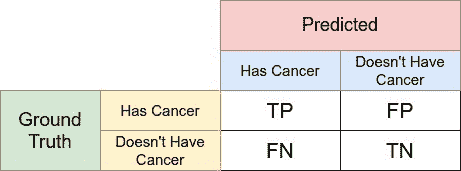
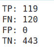
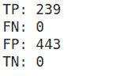
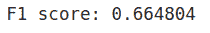
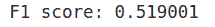
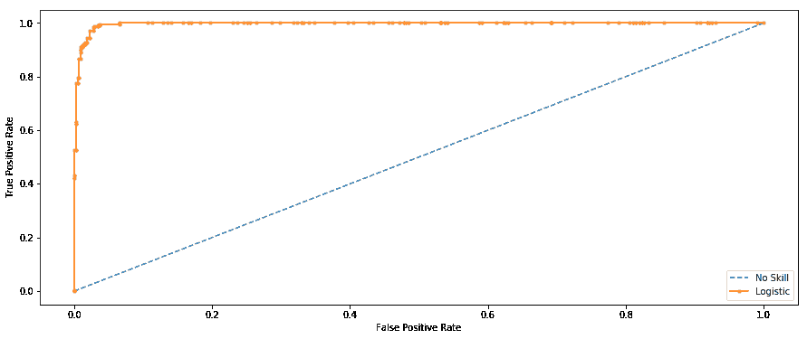

# 机器学习中的性能指标[完整指南]

> 原文：<https://web.archive.org/web/https://neptune.ai/blog/performance-metrics-in-machine-learning-complete-guide>

[性能指标](https://web.archive.org/web/20230118033244/https://towardsdatascience.com/20-popular-machine-learning-metrics-part-1-classification-regression-evaluation-metrics-1ca3e282a2ce)是每个机器学习管道的一部分。他们会告诉你是否有进步，并给你一个数字。所有的机器学习模型，无论是线性回归，还是像[伯特](/web/20230118033244/https://neptune.ai/blog/bert-and-the-transformer-architecture-reshaping-the-ai-landscape)这样的 SOTA 技术，都需要一个衡量标准来判断性能。

每个机器学习任务都可以分解为*回归*或*分类*，就像性能指标一样。这两个问题有几十个度量标准，但是我们将讨论流行的标准以及它们提供的关于模型性能的信息。了解你的模型如何看待你的数据很重要！

如果你曾经参加过 Kaggle 比赛，你可能会注意到[评估](/web/20230118033244/https://neptune.ai/blog/the-ultimate-guide-to-evaluation-and-selection-of-models-in-machine-learning)部分。通常情况下，他们有一个衡量你表现的标准。

**指标不同于损失函数**。损失函数显示了模型性能的度量。它们用于训练机器学习模型(使用某种优化，如梯度下降)，它们通常在模型的参数中是可微分的。

度量用于监控和测量模型的性能(在训练和测试期间)，并且不需要可区分。

然而，如果对于某些任务，性能度量是可微分的，那么它也可以用作损失函数(可能添加了一些正则化)，例如 MSE。

如果你正在寻找一种自动化的方法来监控你的模型的性能指标，请查看 [neptune.ai](/web/20230118033244/https://neptune.ai/) 。这里是解释跟踪度量如何工作的[文档](https://web.archive.org/web/20230118033244/https://docs.neptune.ai/logging/metrics/)(有例子)。

## 回归度量

回归模型有连续的输出。因此，我们需要一个基于计算*预测*和*实际情况之间某种距离的度量。*

为了评估回归模型，我们将详细讨论这些指标:

*   平均绝对误差(MAE)，
*   均方误差(MSE)，
*   均方根误差(RMSE)，
*   R (R 的平方)。

注意:我们将使用波士顿[住宅数据集](https://web.archive.org/web/20230118033244/https://www.kaggle.com/vikrishnan/boston-house-prices)来实现回归指标。你可以在这里找到[笔记本，里面包含了本博客使用的所有代码。](https://web.archive.org/web/20230118033244/https://ui.neptune.ai/theaayushbajaj/sandbox/n/f884bbea-5263-4aeb-aa35-18d74b2835b9/41813125-2b9d-4332-b73f-f07c3b977372)

### 均方误差

均方差可能是回归问题中最常用的度量。它实际上是找到目标值和回归模型预测值之间的平均平方差。

其中:

*   y_j:地面真实值
*   y_hat:回归模型的预测值
*   n:基准数

与 MSE 相关的几个要点:

*   它是可微的，所以可以更好地优化。
*   它通过平方它们来惩罚甚至很小的错误，这实质上导致了对模型有多差的高估。
*   误差解释必须考虑平方因子(标度)。例如，在我们的波士顿住房回归问题中，我们得到 MSE=21.89，它主要对应于(价格)。
*   由于平方因子，它比其他指标更容易出现异常值。

这可以简单地用 Python 中的 NumPy 数组来实现。

```py
mse = (y-y_hat)**2
print(f"MSE: {mse.mean():0.2f} (+/- {mse.std():0.2f})")
```

### 平均绝对误差

平均绝对误差是实际值和预测值之间差值的平均值。数学上，它表示为:

其中:

*   y_j:地面真实值
*   y_hat:回归模型的预测值
*   n:基准数

MAE 的几个关键点

*   对于异常值，它比 MAE 更健壮，因为它没有夸大错误。
*   它为我们提供了预测与实际产出之间的差距。然而，由于 MAE 使用残差的绝对值，它不能给我们一个误差方向的概念，即我们是否低估或高估了数据。
*   错误解释不需要第二个想法，因为它完全符合变量的原始程度。
*   MAE 是不可微的，而 MSE 是可微的。

与 MSE 类似，这个指标也很容易实现。

```py
mae = np.abs(y-y_hat)
print(f"MAE: {mae.mean():0.2f} (+/- {mae.std():0.2f})")
```

### 均方根误差(RMSE)

均方根误差对应于目标值和回归模型预测值之间的平方差的平均值的平方根。基本上就是 sqrt(MSE)。数学上它可以表示为:

它解决了 MSE 的一些缺点。

与 RMSE 相关的几个要点:

*   它保留了 MSE 的可微性。
*   它通过平方根处理 MSE 产生的较小错误的惩罚。
*   误差解释可以顺利完成，因为规模现在是相同的随机变量。
*   因为比例因子本质上是标准化的，所以在异常值的情况下不太容易挣扎。

实现类似于 MSE:

```py
mse = (y-y_hat)**2
rmse = np.sqrt(mse.mean())
print(f"RMSE: {rmse:0.2f}")
```

### 决定系数

r 决定系数实际上是一个后指标，这意味着它是一个使用其他指标计算的指标。

甚至计算这个系数的意义在于回答问题**“Y(目标)的总变化有多少(什么%)是由 X(回归线)的变化解释的”**

这是使用误差平方和计算的。让我们通过公式来更好地理解它。

Y 的总变化(Y 的方差):

描述回归线的变化百分比:

随后，变异百分比描述了回归线:

最后，我们有决定系数的公式，它可以告诉我们回归线的拟合程度有多好或多差:

这个系数可以简单地用 Python 中的 NumPy 数组实现。

```py
SE_line = sum((y-y_hat)**2)
SE_mean = sum((y-y.mean())**2)
r2 = 1-(SE_line/SE_mean)
print(f"R^2 coefficient of determination: {r2*100:0.2f}%")
```

与 R 结果相关的直觉很少:

*   如果回归线的误差平方和很小=> R 将接近 1(理想值)，这意味着回归能够捕获目标变量中 100%的方差。
*   相反，如果回归线的误差平方和很高=> R 将接近于 0，这意味着回归不能捕捉目标变量的任何方差。
*   你可能认为 R 的范围是(0，1)，但实际上是(-∞，1)，因为如果回归线的平方误差太高(>平均值的平方误差)，回归线和平均值的平方误差之比可以超过值 1。

### 调整后 R

香草 R 方法有一些缺点，比如误导研究者相信当分数增加时模型在改进，但实际上，学习并没有发生。当模型过度拟合数据时会发生这种情况，在这种情况下，解释的方差将是 100%，但学习尚未发生。为了纠正这一点，R 根据独立变量的数量进行调整。

调整后的 R 始终低于 R，因为它针对增加的预测因子进行了调整，并且只有在确实有改善的情况下才显示出改善。

其中:

*   n =观察次数
*   k =独立变量的数量
*   Ra =调整后的 R

## 分类指标

分类问题是世界上研究最广泛的领域之一。用例存在于几乎所有的生产和工业环境中。语音识别、人脸识别、文本分类——不胜枚举。

分类模型有离散的输出，所以我们需要一个以某种形式比较离散类的度量*。分类度量标准*评估一个模型的性能，并告诉你分类的好坏，但它们中的每一个都以不同的方式评估它。

因此，为了评估分类模型，我们将详细讨论这些指标:

*   准确(性)
*   混淆矩阵(不是一个度量标准，但对其他人来说是基本的)
*   精确度和召回率
*   f1-分数
*   奥-罗克

注意:我们将使用 UCI [乳腺癌](https://web.archive.org/web/20230118033244/https://archive.ics.uci.edu/ml/datasets/Breast+Cancer+Wisconsin+%28Diagnostic%29)数据集来实现分类指标。你可以在这里找到[笔记本，里面包含了本博客使用的所有代码。](https://web.archive.org/web/20230118033244/https://ui.neptune.ai/theaayushbajaj/sandbox/n/f884bbea-5263-4aeb-aa35-18d74b2835b9/41813125-2b9d-4332-b73f-f07c3b977372)

### 准确(性)

分类准确度可能是使用和实现最简单的度量，定义为正确预测的**数除以预测总数**乘以 100 **。**

我们可以通过在一个循环中比较实际值和预测值来实现这一点，或者简单地利用 scikit-learn 模块来为我们完成繁重的工作(在本例中没有那么重)。

从从*度量*类导入 *accuracy_score* 函数开始。

```py
from sklearn.metrics import accuracy_score
```

然后，只需传递基本事实和预测值，就可以确定模型的准确性:

```py
print(f'Accuracy Score is {accuracy_score(y_test,y_hat)}')
```

### 混淆矩阵

混淆矩阵是**地面实况标签与模型预测**的可视化表格。混淆矩阵的每一行代表预测类中的实例，每一列代表实际类中的实例。混淆矩阵不完全是一个性能指标，而是一种其他指标评估结果的基础。

为了理解混淆矩阵，我们需要为作为假设的零假设设置一些值。例如，从我们的乳腺癌数据中，让我们假设我们的**零假设 H⁰** 是“*该个体患有癌症*”。



*Confusion Matrix for H⁰*

混淆矩阵中的每个单元代表一个评估因子。让我们逐一了解这些因素:

*   **真阳性(TP)** 表示您的模型正确预测了多少阳性类别样本。
*   **True Negative(TN)** 表示您的模型正确预测了多少个负类样本。
*   **假阳性(FP)** 表示您的模型错误预测了多少个阴性类别样本。这个因子代表统计术语中的**I 型误差**。混淆矩阵中的错误定位取决于零假设的选择。
*   **假阴性(FN)** 表示您的模型错误预测了多少阳性类别样本。该因子代表统计术语中的**II 型**误差。混淆矩阵中的错误定位也取决于零假设的选择。

我们可以使用下面的代码计算单元格的值:

```py
def find_TP(y, y_hat):

   return sum((y == 1) & (y_hat == 1))
def find_FN(y, y_hat):

   return sum((y == 1) & (y_hat == 0))
def find_FP(y, y_hat):

   return sum((y == 0) & (y_hat == 1))
def find_TN(y, y_hat):

   return sum((y == 0) & (y_hat == 0))
```

我们将使用逻辑回归分类器中的两组超参数来查看两种不同状态下的混淆矩阵。

```py
from sklearn.linear_model import LogisticRegression
clf_1 = LogisticRegression(C=1.0, class_weight={0:100,1:0.2}, dual=False, fit_intercept=True,
                  intercept_scaling=1, l1_ratio=None, max_iter=100,
                  multi_class='auto', n_jobs=None, penalty='l2',
                  random_state=None, solver='lbfgs', tol=0.0001,       verbose=0,
                  warm_start=False)
clf_2 = LogisticRegression(C=1.0, class_weight={0:0.001,1:900}, dual=False, fit_intercept=True,
                  intercept_scaling=1, l1_ratio=None, max_iter=100,
                  multi_class='auto', n_jobs=None, penalty='l2',
                  random_state=None, solver='lbfgs', tol=0.0001, verbose=0,
                  warm_start=False)
```

### 精确

精度是预测的真阳性和总阳性的比率:

0

精度度量关注于**类型 I 误差** (FP)。当我们拒绝一个真正的空 Hypothesis(H⁰时，就会出现一个第一类错误。因此，在这种情况下，第一类错误是错误地将癌症患者标记为非癌症患者。

精度分数接近 1 将意味着您的模型没有遗漏任何真正的阳性，并且能够很好地区分癌症患者的正确和错误标记。它不能测量的是第二类错误的存在，即假阴性，即非癌症患者被识别为癌症患者的情况。

低精度分数(< 0.5)意味着您的分类器有大量的假阳性，这可能是不平衡的类或未调整的模型超参数的结果。在不平衡类问题中，为了抑制 FP/FN，你必须事先准备好数据，包括过采样/欠采样或焦点损失。

对于第一组超参数:

```py
TP = find_TP(y, y_hat)
FN = find_FN(y, y_hat)
FP = find_FP(y, y_hat)
TN = find_TN(y, y_hat)
print('TP:',TP)
print('FN:',FN)
print('FP:',FP)
print('TN:',TN)
precision = TP/(TP+FP)
print('Precision:',precision)
```


上述代码片段的输出

通过查看混淆矩阵值，您可能已经猜到，FP 为 0，因此对于给定超参数设置的 100%精确模型来说，该条件是完美的。在这种情况下，没有 I 型错误被报告，因此该模型在抑制错误地将癌症患者标记为非癌症患者方面做了大量工作。

对于第二组超参数:

```py
TP = find_TP(y, y_hat)
FN = find_FN(y, y_hat)
FP = find_FP(y, y_hat)
TN = find_TN(y, y_hat)
print('TP:',TP)
print('FN:',FN)
print('FP:',FP)
print('TN:',TN)
precision = TP/(TP+FP)
print('Precision:',precision)
```


上述代码片段的输出

由于在这种设置中只剩下第一类误差，因此尽管第二类误差为 0，但精度会下降。

我们可以从我们的例子中推断出，只有精度不能告诉你你的模型在各种情况下的性能。

### 回忆/敏感度/命中率

一个**回忆**本质上是真实的肯定与地面真相中所有肯定的比率。

0

召回指标侧重于**类型二错误** (FN)。当我们**接受一个假的空 hypothesis(H⁰)** 时，就会出现第二类错误。因此，在这种情况下，第二类错误是错误地将非癌症患者标记为癌症患者。

向 1 回忆将意味着你的模型没有错过任何真正的阳性，并且能够很好地分类正确和错误标记的癌症患者。

它不能测量的是 I 型错误的存在，这是假阳性，即癌症患者被识别为非癌症患者的情况。

低召回分数(< 0.5)意味着您的分类器有大量的假阴性，这可能是不平衡的类或未调整的模型超参数的结果。在不平衡类问题中，为了抑制 FP/FN，你必须事先准备好数据，包括过采样/欠采样或焦点损失。

对于第一组超参数:

```py
TP = find_TP(y, y_hat)
FN = find_FN(y, y_hat)
FP = find_FP(y, y_hat)
TN = find_TN(y, y_hat)
print('TP:',TP)
print('FN:',FN)
print('FP:',FP)
print('TN:',TN)
recall = recall_score(y, y_hat)
print('Recall: %f' % recall)
```



上述代码片段的输出

从上述混淆矩阵值来看，第一类错误的可能性为 0，而第二类错误的可能性很大。这就是低召回分数背后的原因。它只关注第二类错误。

对于第二组超参数:

```py
TP = find_TP(y, y_hat)
FN = find_FN(y, y_hat)
FP = find_FP(y, y_hat)
TN = find_TN(y, y_hat)
print('TP:',TP)
print('FN:',FN)
print('FP:',FP)
print('TN:',TN)
recall = recall_score(y, y_hat)
print('Recall: %f' % recall)
```



上述代码片段的输出

这个集合中唯一持久的错误是 I 类错误，没有报告 II 类错误。这意味着这个模型在遏制错误地将非癌症患者标记为癌症方面做了很大的工作。

以上两个度量标准的主要亮点是它们都只能在特定的场景中使用，因为它们都只能识别一组错误。

### 精确-召回权衡

要改进你的模型，你可以提高精确度或召回率，但不能两者兼得！如果您试图减少非癌症患者被标记为癌症(FN/II 型)的病例，对被标记为非癌症的癌症患者不会产生直接影响。

这里有一个描绘同样权衡的图:

```py
from sklearn.metrics import plot_precision_recall_curve
disp = plot_precision_recall_curve(clf, X, y)
disp.ax_.set_title('2-class Precision-Recall curve: '
                  'AP={0:0.2f}'.format(precision))
```

这种权衡对真实场景有很大的影响，因此我们可以推断，仅仅依靠精确度和召回率并不是很好的衡量标准。这就是为什么你会看到许多公司报告和在线竞赛敦促提交指标是精确度和召回的结合。

### f1-分数

F1 得分指标结合了精确度和召回率。其实 F1 的分数**就是两者的调和平均值。**这两个公式本质上是:

现在，高 F1 分数象征着高精确度和高回忆。它在精确度和召回率之间呈现了良好的平衡，并且在[不平衡分类问题](/web/20230118033244/https://neptune.ai/blog/how-to-deal-with-imbalanced-classification-and-regression-data)上给出了良好的结果。

F1 分数低(几乎)说明不了什么——它只能告诉你在某个阈值时的表现。低召回率意味着我们没有尽力在整个测试集的大部分上做得很好。低精度意味着，在我们识别为阳性的病例中，我们没有正确识别出许多病例。

但是低 F1 并没有说是哪些情况。高 F1 意味着我们可能对决策的大部分具有高精确度和高回忆性(这是信息性的)。F1 低，不清楚是什么问题(低精度还是低召回？)，以及模型是否遭受 I 型或 II 型误差。

那么，F1 只是一个噱头吗？不完全是，它被广泛使用，并被认为是收敛到决策的一个很好的度量，但也有一些调整。将 FPR(假阳性率)与 F1 一起使用将有助于抑制 I 型错误，并且您将了解 F1 分数低背后的元凶。

对于第一组超参数:

```py
f1_score = 2*((precision*recall)/(precision+recall))
print('F1 score: %f' % f1_score)
```



如果你还记得我们在 set-I 参数中的得分，P=1，R=0.49。因此，通过使用这两个指标，我们得到了 0.66 的分数，这并没有给你什么类型的错误是显著的信息，但在推断模型的性能时仍然是有用的。

对于第二组超参数:

```py
f1_score = 2*((precision*recall)/(precision+recall))
print('F1 score: %f' % f1_score)
```



对于第二组，参数为 P=0.35，R=1。因此，F1 分数在某种程度上总结了 P 和 r 之间的界限。尽管如此，低 F1 并不能告诉你发生了哪个错误。

F1 无疑是判断模型性能最流行的指标之一。它实际上是被称为 F 分数的更广泛指标的子集。

输入β= 1 将得到 F1 的分数。

### 受试者工作特性曲线下面积

更好地称为 AUC-ROC 评分/曲线。它利用真阳性率(TPR)和假阳性率(FPR)。

*   直觉上 **TPR/recall** 对应于相对于所有正数据点被正确认为是正的正数据点的比例。换句话说，TPR 越高，我们错过的正面数据点就越少。
*   直觉上**FPR/辐射**对应于相对于所有负数据点而言被错误地认为是正的负数据点的比例。换句话说，FPR 越高，我们错误分类的负面数据点就越多。

为了将 **FPR** 和 **TPR** 组合成一个单一指标，我们首先使用许多不同的逻辑回归阈值来计算前两个指标，然后将它们绘制在一个图表上。得到的曲线称为 ROC 曲线，我们考虑的度量是这条曲线下的面积，我们称之为 AUROC。

```py
from sklearn.metrics import roc_curve
from sklearn.metrics import roc_auc_score
from matplotlib import pyplot
ns_probs = [0 for _ in range(len(y))]

lr_probs = clf_1.predict_proba(X)

lr_probs = lr_probs[:, 1]

ns_auc = roc_auc_score(y, ns_probs)
lr_auc = roc_auc_score(y, lr_probs)

print('No Skill: ROC AUC=%.3f' % (ns_auc))
print('Logistic: ROC AUC=%.3f' % (lr_auc))

ns_fpr, ns_tpr, _ = roc_curve(y, ns_probs)
lr_fpr, lr_tpr, _ = roc_curve(y, lr_probs)

pyplot.plot(ns_fpr, ns_tpr, linestyle='--', label='No Skill')
pyplot.plot(lr_fpr, lr_tpr, marker='.', label='Logistic')
pyplot.xlabel('False Positive Rate')
pyplot.ylabel('True Positive Rate')
pyplot.legend()
pyplot.show()
```



*No Skill: ROC AUC=0.500
Logistic: ROC AUC=0.996*

无技能分类器是一种不能区分类别的分类器，在所有情况下都会预测随机类别或固定类别。无技能线的变化是基于积极类和消极类的分布。它是一条水平线，带有数据集中阳性病例的比率值。对于平衡数据集，它是 0.5。

该面积等于随机选择的正面例子排名在随机选择的负面例子之上的概率(被认为正面的概率高于负面的概率)。

因此，高 ROC 仅仅意味着随机选择的正例的概率确实是正的。高 ROC 也意味着你的算法在排列测试数据方面做得很好，大部分负面情况在一个范围的一端，而正面情况在另一端。

当你的问题存在巨大的阶级不平衡时，ROC 曲线不是一个好的选择。其中的原因并不简单，但可以通过公式直观地看出，你可以[在这里](https://web.archive.org/web/20230118033244/http://ftp.cs.wisc.edu/machine-learning/shavlik-group/davis.icml06.pdf)了解更多信息。在处理不平衡集或使用焦点损失技术后，您仍然可以在这种情况下使用它们。

除了学术研究和比较不同的分类器之外，AUROC 指标没有其他用途。

## 结论

我希望您现在理解了性能度量在模型评估中的重要性，并且知道一些古怪的小技巧来理解您的模型的灵魂。

需要注意的一件非常重要的事情是，您可以调整这些指标来迎合您的特定用例。

举个例子，拿一个**加权 F1 分**。它计算每个标签的指标，并根据支持度(每个标签的真实实例数)找到它们的平均权重。

另一个例子可以是加权精度，或者用技术术语来说:**平衡精度**。二元和多类分类问题中的平衡精度用于处理不平衡数据集。它被定义为每节课的平均回忆。就像我们提到的，*【迎合特定用例】*，就像不平衡的类。

你可以在这里找到包含本博客中使用的所有代码的[笔记本。](https://web.archive.org/web/20230118033244/https://ui.neptune.ai/theaayushbajaj/sandbox/n/f884bbea-5263-4aeb-aa35-18d74b2835b9/41813125-2b9d-4332-b73f-f07c3b977372)

继续实验！

就这些了，感谢您的阅读，敬请期待更多内容！再见！

## 参考