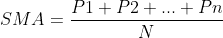
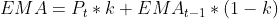

# 使用机器学习预测股票价格

> 原文：<https://web.archive.org/web/https://neptune.ai/blog/predicting-stock-prices-using-machine-learning>

众所周知，股票市场是不稳定的，动态的，非线性的。由于多种(宏观和微观)因素，如政治、全球经济状况、意外事件、公司财务表现等，准确的股价预测极具挑战性。

但是，所有这些也意味着有大量的数据可以从中发现模式。因此，金融分析师、研究人员和数据科学家不断探索分析技术，以检测股市趋势。这就产生了[算法交易](https://web.archive.org/web/20230125184217/https://en.wikipedia.org/wiki/Algorithmic_trading)的概念，它使用自动化、预编程的交易策略来执行订单。

在本文中，我们将使用传统的量化金融方法和机器学习算法来预测股票走势。我们将讨论以下主题:

*   股票分析:基本面与技术面分析
*   作为时间序列数据的股票价格及相关概念
*   用移动平均技术预测股票价格
*   LSTMs 简介
*   用 LSTM 模型预测股票价格
*   对新方法的最终想法，如 ESN

免责声明:本项目/文章无意提供金融、交易和投资建议。不保证模型的准确性。在使用本文介绍的方法或准则做出任何投资决定之前，受众应进行尽职调查。

## 股票分析:基本面分析与技术面分析

说到股票，基本面分析和技术分析是市场分析的两个极端。

*   基本面分析(你可以在这里阅读更多信息[):](https://web.archive.org/web/20230125184217/https://www.investopedia.com/terms/f/fundamentalanalysis.asp#:~:text=Fundamental%20analysis%20(FA)%20is%20a,related%20economic%20and%20financial%20factors.&text=The%20end%20goal%20is%20to,security%20is%20undervalued%20or%20overvalued.)
    *   通过检查公司的内在价值来评估公司的股票，包括但不限于有形资产、财务报表、管理有效性、战略计划和消费者行为；基本上是一个公司的所有基本要素。
    *   作为长期投资的相关指标，基本面分析依赖于历史和当前数据来衡量收入、资产、成本、负债等。
    *   一般来说，基本面分析的结果不会随着短期消息而改变。
*   技术分析(你可以在这里了解更多信息[):](https://web.archive.org/web/20230125184217/https://www.investopedia.com/terms/t/technicalanalysis.asp)
    *   分析股票市场活动的可测量数据，如股票价格、历史回报和历史交易量；即可以识别交易信号和捕捉股票市场运动模式的定量信息。
    *   像基本面分析一样，技术分析侧重于历史数据和当前数据，但它主要用于短期交易。
    *   由于其短期性，技术分析结果很容易受到消息的影响。
    *   流行的技术分析方法包括移动平均线(MA)，[支撑位和阻力位](https://web.archive.org/web/20230125184217/https://www.investopedia.com/trading/support-and-resistance-basics/)，以及[趋势线和通道](https://web.archive.org/web/20230125184217/https://www.investopedia.com/terms/t/trendline.asp)。

在我们的练习中，我们将只看技术分析，重点是简单的移动平均线和指数移动平均线技术来预测股票价格。此外，我们将利用 LSTM(长短期记忆)，一个时间序列的深度学习框架，来建立一个预测模型，并将其性能与我们的技术分析进行比较。

如免责声明所述，股票交易策略不在本文讨论范围之内。我使用交易/投资术语只是为了帮助你更好地理解分析，但这不是财务建议。我们将使用这样的术语:

## 作为时间序列数据的股票价格

尽管存在波动，股票价格并不只是随机产生的数字。因此，它们可以被分析为一系列[离散时间](https://web.archive.org/web/20230125184217/https://en.wikipedia.org/wiki/Discrete_time_and_continuous_time)数据；换句话说，在连续时间点(通常是每天)进行的时间序列观察。[时间序列预测](/web/20230125184217/https://neptune.ai/blog/time-series-prediction-vs-machine-learning)(根据历史值预测未来值)非常适用于股票预测。

由于时间序列数据的序列性质，我们需要一种方法来聚合这种信息序列。在所有潜在的技术中，最直观的是马，他能够消除短期波动。我们将在下一节讨论更多的细节。

## 数据集分析

在这个演示练习中，我们将使用过去 21 年(1999 年 11 月 1 日至 2021 年 7 月 9 日)苹果股票(股票代码 AAPL)的收盘价。分析数据将从 [Alpha Vantage](https://web.archive.org/web/20230125184217/https://www.alphavantage.co/documentation/) 加载，它为历史和实时股市数据提供了一个免费的 API。

要从 Alpha Vantage 获取数据，需要一个免费的 API 键；可以在这里找到[的演练教程。不想创建 API？别担心，我的](https://web.archive.org/web/20230125184217/https://www.alphavantage.co/) [Github repo](https://web.archive.org/web/20230125184217/https://github.com/YiLi225/NeptuneBlogs/blob/main/stock_market_data-AAPL.csv) 里也有分析数据。如果你想探索其他股票，下载数据的代码也可以在这个 [Github repo](https://web.archive.org/web/20230125184217/https://github.com/YiLi225/NeptuneBlogs/blob/main/Predicting_StockPrices.py) 中找到。一旦有了 API，您所需要的就是特定股票的股票代码。

对于模型训练，我们将使用最老的 80%的数据，并将最近的 20%保存为保留测试集。

```py
test_ratio = 0.2
training_ratio = 1 - test_ratio

train_size = int(training_ratio * len(stockprices))
test_size = int(test_ratio * len(stockprices))
print("train_size: " + str(train_size))
print("test_size: " + str(test_size))

train = stockprices[:train_size][['Date', 'Close']]
test = stockprices[train_size:][['Date', 'Close']]
```

## 创建海王星项目

关于模型训练和性能比较，Neptune 使用户可以方便地跟踪与模型相关的一切，包括超参数规范和评估图。本[完整指南](https://web.archive.org/web/20230125184217/https://docs.neptune.ai/setup/installation/)提供了如何用 Python 设置和配置 Neptune 项目的分步说明。

现在，让我们为这个特定的练习创建一个项目，并将其命名为“ **StockPrediction** ”。

## 评估指标和助手功能

由于股票价格预测本质上是一个回归问题，因此 [RMSE(均方根误差)](https://web.archive.org/web/20230125184217/https://en.wikipedia.org/wiki/Root-mean-square_deviation)和 [MAPE(平均绝对百分比误差%)](https://web.archive.org/web/20230125184217/https://www.statisticshowto.com/mean-absolute-percentage-error-mape/) 将是我们当前的模型评估指标。两者都是预测准确性的有用衡量标准。

，*其中 N =时间点个数，At =实际/真实股价，Ft =预测/预测值*。

RMSE 给出了预测值和真实值之间的差异，而 MAPE (%)测量了相对于真实值的这种差异。例如，12%的 MAPE 值表示预测股价和实际股价之间的平均差异为 12%。

接下来，让我们为当前的练习创建几个辅助函数。

*   将股票价格数据分成训练序列 X 和下一个输出值 Y，

```py
def extract_seqX_outcomeY(data, N, offset):
    """
    Split time-series into training sequence X and outcome value Y
    Args:
        data - dataset
        N - window size, e.g., 50 for 50 days of historical stock prices
        offset - position to start the split
    """
    X, y = [], []

    for i in range(offset, len(data)):
        X.append(data[i-N:i])
        y.append(data[i])

    return np.array(X), np.array(y)
```

*   计算 RMSE 和 MAPE (%)，

```py
def calculate_rmse(y_true, y_pred):
    """
    Calculate the Root Mean Squared Error (RMSE)
    """
    rmse = np.sqrt(np.mean((y_true-y_pred)**2))
    return rmse

def calculate_mape(y_true, y_pred):
    """
    Calculate the Mean Absolute Percentage Error (MAPE) %
    """
    y_pred, y_true = np.array(y_pred), np.array(y_true)
    mape = np.mean(np.abs((y_true-y_pred) / y_true))*100
    return mape
```

*   计算技术分析的评估指标并登录到 Neptune(带 arg。logNeptune = True)，

```py
def calculate_perf_metrics(var, logNeptune=True, logmodelName='Simple MA'):

    rmse = calculate_rmse(np.array(stockprices[train_size:]['Close']), np.array(stockprices[train_size:][var]))

    mape = calculate_mape(np.array(stockprices[train_size:]['Close']), np.array(stockprices[train_size:][var]))

    if logNeptune:
        npt_exp['RMSE'].log(rmse)
        npt_exp['MAPE (%)'].log(mape)

    return rmse, mape
```

*   绘制股票价格的趋势，并将该图记录到 Neptune(带参数。带参数。logNeptune = True)，

```py
def plot_stock_trend(var, cur_title, stockprices=stockprices, logNeptune=True, logmodelName='Simple MA'):
    ax = stockprices[['Close', var,'200day']].plot(figsize=(20, 10))
    plt.grid(False)
    plt.title(cur_title)
    plt.axis('tight')
    plt.ylabel('Stock Price ($)')

    if logNeptune:
        npt_exp[f'Plot of Stock Predictions with {logmodelName}'].upload(neptune.types.File.as_image(ax.get_figure()))
```

## 用移动平均技术预测股票价格

MA 是一种在股票市场消除随机波动的流行方法。类似于滑动窗口，均线是沿时间尺度/周期移动的平均值；随着新数据点的增加，旧数据点会被丢弃。

短期、中期和长期投资常用的周期分别是 [20 天、50 天和 200 天 MA](https://web.archive.org/web/20230125184217/https://www.investopedia.com/articles/active-trading/052014/how-use-moving-average-buy-stocks.asp) 。

金融分析师最喜欢两种移动平均线:简单移动平均线和指数移动平均线。

### 简单的人

SMA 是简单移动平均线的缩写，它计算一系列股票(收盘)价格在该范围内特定时间段的平均值。SMA 的公式为:

，*其中 P**N**= N 个时间点的股价，N =时间点的个数。*

在这个构建 SMA 模型的练习中，我们将使用下面的 Python 代码来计算 50 天的 SMA。为了更好的衡量，我们还会添加一个 200 天的均线。

```py
window_size = 50

npt_exp = neptune.init(
        api_token=os.getenv('NEPTUNE_API_TOKEN'),
        project=myProject,
        name='SMA',
        description='stock-prediction-machine-learning',
        tags=['stockprediction', 'MA_Simple', 'neptune'])

window_var = str(window_size) + 'day'

stockprices[window_var] = stockprices['Close'].rolling(window_size).mean()

stockprices['200day'] = stockprices['Close'].rolling(200).mean()

plot_stock_trend(var=window_var, cur_title='Simple Moving Averages', logmodelName='Simple MA')
rmse_sma, mape_sma = calculate_perf_metrics(var=window_var, logmodelName='Simple MA')

npt_exp.stop()

```

在我们的 Neptune 项目中，我们将在测试集上看到性能指标；RMSE = 43.79，MAPE = 12.53%。

此外，下面的趋势图显示了 50 天，200 天的 SMA 预测与真实的股票收盘价的比较。

不足为奇的是，从中期趋势来看，50 日均线是比 200 日均线更好的趋势指标。尽管如此，这两个指标给出的预测似乎比实际值要小。

### 指数毫安

与对所有历史数据点分配相同权重的 SMA 不同，EMA(指数移动平均线的缩写)对最近的价格应用较高的权重，即在我们的示例中 50 天 MA 的尾部数据点。加权因子的大小取决于时间段的数量。计算 EMA 的公式是:

，

*其中 P* *t* *=时间点 t 的价格，*

*均线* *t-1 点**= t-1 点均线，*

*N = EMA 中的时间点数，*

*和加权因子 k = 2/(N+1)。*

均线优于均线的一个优点是，均线对价格变化更敏感，这使得它对短线交易很有用。下面是 EMA 的 Python 实现:

```py
npt_exp = neptune.init(
        api_token=os.getenv('NEPTUNE_API_TOKEN'),
        project=myProject,
        name='EMA',
        description='stock-prediction-machine-learning',
        tags=['stockprediction', 'MA_Exponential', 'neptune'])

window_ema_var = window_var+'_EMA'

    stockprices[window_ema_var] = stockprices['Close'].ewm(span=window_size, adjust=False).mean()
    stockprices['200day'] = stockprices['Close'].rolling(200).mean()

plot_stock_trend(var=window_ema_var, cur_title='Exponential Moving Averages', logmodelName='Exp MA')
    rmse_ema, mape_ema = calculate_perf_metrics(var=window_ema_var, logmodelName='Exp MA')

npt_exp.stop()

```

检查 Neptune 中跟踪的性能指标，我们得到 RMSE = 36.68，MAPE = 10.71%，这比 RMSE 和 MAPE 的 SMA 分别为 43.79 和 12.53%有所提高。

从这个均线模型生成的趋势图也暗示了它的表现优于均线。

### SMA 和 EMA 预测性能的比较

下面的剪辑显示了 SMA 和 EMA 在 Neptune 中并排的比较；蓝色和粉色的线分别是 SMA 和 EMA。

## 时间序列数据的 LSTMs 简介

现在，让我们继续讨论 LSTM 模型。LSTM 是长短期记忆的缩写，是一种非常强大的时间序列算法。它可以捕捉历史趋势模式，并以高精度预测未来值。

简而言之，理解 LSTM 模型的关键组件是细胞状态( *C* *t* )，它代表了细胞内部的短期和长期记忆。

为了控制和管理单元状态，LSTM 模型包含三个门/层。值得一提的是，这里的“门”可以被视为让信息进来(被记住)或出去(被忘记)的过滤器。

顾名思义，遗忘门决定从当前单元状态中丢弃哪些信息。数学上，它应用一个 [sigmoid 函数](https://web.archive.org/web/20230125184217/https://en.wikipedia.org/wiki/Sigmoid_function)来输出/返回来自前一个单元格状态的每个值的[0，1]之间的值(*Ct-1*)；这里“1”表示“完全通过”,而“0”表示“完全过滤掉”

它用于选择在当前单元格状态中添加和存储哪些新信息。在这一层中，实现一个 sigmoid 函数来减少输入向量中的值( *i* *t* )，然后一个 tanh 函数挤压[-1，1]之间的每个值( *C* *t* )。 *i* *t* 和 *C* *t* 的逐元素矩阵乘法表示需要添加到当前单元状态的新信息。

输出门用于控制流向下一个单元状态的输出。与输入门类似，输出门先应用一个 sigmoid 函数，然后应用一个 tanh 函数来过滤掉不想要的信息，只保留我们决定让其通过的信息。

为了更详细地了解 LSTM，你可以查看这个文档。

了解了 LSTM 理论，你一定想知道它是如何预测现实世界的股票价格的。我们将在下一节找到答案，通过建立一个 LSTM 模型，并将其性能与两个技术分析模型进行比较:SMA 和 EMA。

### 用 LSTM 模型预测股票价格

首先，我们需要创建一个专用于 LSTM 的海王星实验，其中包括指定的超参数。

```py
layer_units, optimizer = 50, 'adam'
    cur_epochs = 15
    cur_batch_size = 20

    cur_LSTM_pars = {'units': layer_units,
                     'optimizer': optimizer,
                     'batch_size': cur_batch_size,
                     'epochs': cur_epochs
                     }

npt_exp = neptune.init(
        api_token=os.getenv('NEPTUNE_API_TOKEN'),
        project=myProject,
        name='LSTM',
        description='stock-prediction-machine-learning',
        tags=['stockprediction', 'LSTM','neptune'])
npt_exp['LSTMPars'] = cur_LSTM_pars

```

接下来，我们缩放 LSTM 模型规则的输入数据，并将其分成训练集和测试集。

```py
scaler = StandardScaler()
scaled_data = scaler.fit_transform(stockprices[['Close']])
    scaled_data_train = scaled_data[:train.shape[0]]

X_train, y_train = extract_seqX_outcomeY(scaled_data_train, window_size, window_size)
```

几个注意事项:

*   我们使用*标准定标器*，而不是你之前可能见过的*最小最大定标器*。原因是股票价格是不断变化的，没有真正的最小值或最大值。使用 *MinMaxScaler* 是没有意义的，虽然这种选择最终很可能不会导致灾难性的结果；
*   原始格式的股票价格数据不能直接用于 LSTM 模型；我们需要使用我们预定义的` *extract_seqX_outcomeY`* 函数来转换它。例如，为了预测第 51 个价格，该函数预先创建 50 个数据点的输入向量，并使用第 51 个价格作为结果值。

继续，让我们开始 LSTM 建模过程。具体来说，我们正在构建一个具有两个隐藏层的 LSTM，以及一个基于输出的“线性”激活函数。还有，这个模型登录的是海王星。

```py
def Run_LSTM(X_train, layer_units=50, logNeptune=True, NeptuneProject=None):
    inp = Input(shape=(X_train.shape[1], 1))

    x = LSTM(units=layer_units, return_sequences=True)(inp)
    x = LSTM(units=layer_units)(x)
    out = Dense(1, activation='linear')(x)
    model = Model(inp, out)

    model.compile(loss = 'mean_squared_error', optimizer = 'adam')

    if logNeptune:
       model.summary(print_fn=lambda x: NeptuneProject['model_summary'].log(x))

    return model

model = Run_LSTM(X_train, layer_units=layer_units, logNeptune=True, NeptuneProject=npt_exp)

history = model.fit(X_train, y_train, epochs=cur_epochs, batch_size=cur_batch_size,
                    verbose=1, validation_split=0.1, shuffle=True)
```

模型超参数和概要已经登录到海王星。

一旦培训完成，我们将根据我们的坚持集测试模型。

```py
def preprocess_testdat(data=stockprices, scaler=scaler, window_size=window_size, test=test):
    raw = data['Close'][len(data) - len(test) - window_size:].values
    raw = raw.reshape(-1,1)
    raw = scaler.transform(raw)

    X_test = []
    for i in range(window_size, raw.shape[0]):
        X_test.append(raw[i-window_size:i, 0])

    X_test = np.array(X_test)

    X_test = np.reshape(X_test, (X_test.shape[0], X_test.shape[1], 1))
    return X_test

X_test = preprocess_testdat()

predicted_price_ = model.predict(X_test)
predicted_price = scaler.inverse_transform(predicted_price_)

test['Predictions_lstm'] = predicted_price
```

是时候计算性能指标并将其记录到 Neptune 了。

```py
rmse_lstm = calculate_rmse(np.array(test['Close']), np.array(test['Predictions_lstm']))
mape_lstm = calculate_mape(np.array(test['Close']), np.array(test['Predictions_lstm']))

npt_exp['RMSE'].log(rmse_lstm)
npt_exp['MAPE (%)'].log(mape_lstm)

def plot_stock_trend_lstm(train, test, logNeptune=True):
    fig = plt.figure(figsize = (20,10))
    plt.plot(train['Date'], train['Close'], label = 'Train Closing Price')
    plt.plot(test['Date'], test['Close'], label = 'Test Closing Price')
    plt.plot(test['Date'], test['Predictions_lstm'], label = 'Predicted Closing Price')
    plt.title('LSTM Model')
    plt.xlabel('Date')
    plt.ylabel('Stock Price ($)')
    plt.legend(loc="upper left")

    if logNeptune:
        npt_exp['Plot of Stock Predictions with LSTM'].upload(neptune.types.File.as_image(fig))

plot_stock_trend_lstm(train, test)

npt_exp.stop()
```

在海王星，很神奇的看到我们的 LSTM 模型取得了 RMSE = 12.63，MAPE = 2.37%的成绩；这是对 SMA 和 EMA 模型的巨大改进！

趋势图显示了我们测试集的预测收盘价和实际收盘价近乎完美的叠加。

## SMA、EMA 和 LSTM 模型的比较

LSTM 会占用大量的计算和内存资源吗？毕竟，这是一个比 SMA 或 EMA 等传统技术分析模型更复杂的算法。如果 LSTM 模式确实需要更多的资源来运行，那么扩大规模将是一个挑战，对吗？

幸运的是，海王星自动为我们监控这些信息。

正如我们所看到的，这三种型号的 CPU 和内存使用量相当接近；LSTM 模式并不比并购模式消耗更多的资源。

## 关于新方法的最后想法

在预测苹果股票价格的例子中，我们已经看到了 LSTMs 相对于传统 MA 模型的优势。对其他股票进行归纳时要小心，因为与其他平稳的时间序列不同，股票市场数据几乎没有季节性，而且更加混乱。

在我们的例子中，苹果作为最大的科技巨头之一，不仅建立了成熟的商业模式和管理，其销售数字也受益于创新产品或服务的发布。这两个因素都有助于降低苹果股票的隐含波动率，使得 LSTM 模型的预测相对容易，而不同的高波动率股票则相反。

为了解释股票市场的混乱动态，回声状态网络(ESN)被提出。作为 RNN(递归神经网络)家族中的一项新发明，ESN 利用了一个隐藏层，该隐藏层具有几个流动且松散互连的神经元；这个隐藏层被称为“储层”,用于捕获输入数据的非线性历史信息。

在高层次上，ESN 接受时间序列输入向量，并将其映射到高维特征空间，即动态库(神经元不像网络那样连接，而是像一个库)。然后，在输出层，应用线性激活函数来计算最终预测。

如果你有兴趣了解更多关于这种方法的知识，请查阅耶格和哈斯的原创论文。

此外，在新闻和社交媒体上结合关于股票市场以及感兴趣的给定股票的情绪分析也是令人感兴趣的。另一种更好的股票价格预测方法是混合模型，我们将 MA 预测作为输入向量添加到 LSTM 模型中。你可能也想探索不同的方法。

希望你喜欢读这篇文章，就像我喜欢写它一样！完整的代码/脚本可以在我的 Github repo [这里](https://web.archive.org/web/20230125184217/https://github.com/YiLi225/NeptuneBlogs/blob/main/Predicting_StockPrices_NewVersion.py)找到，我们目前的 Neptune 项目可以在[这里](https://web.archive.org/web/20230125184217/https://app.neptune.ai/katyl/StockPredictionNewVersion/experiments?split=bth&dash=charts&viewId=standard-view)找到供你参考。