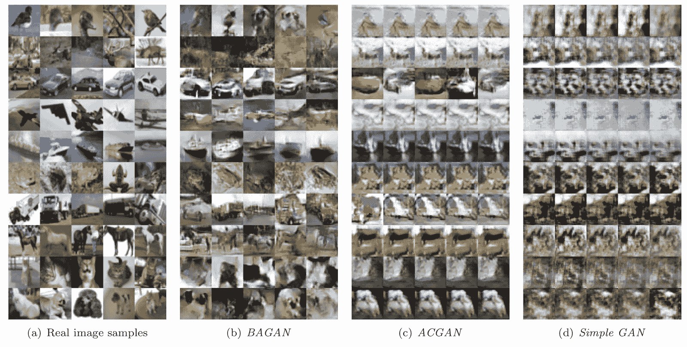
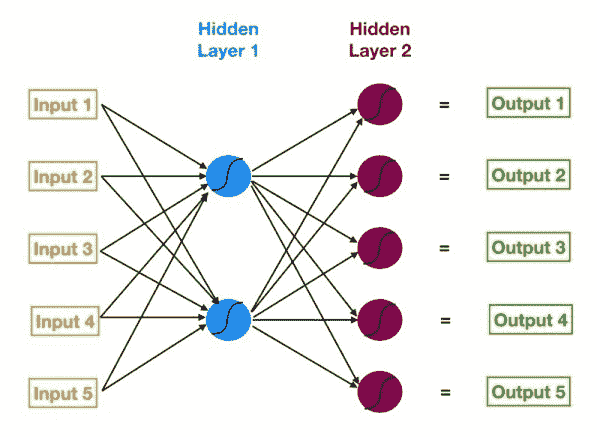
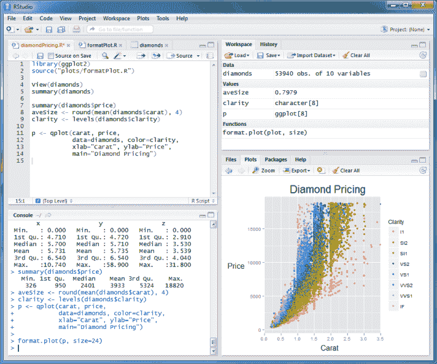
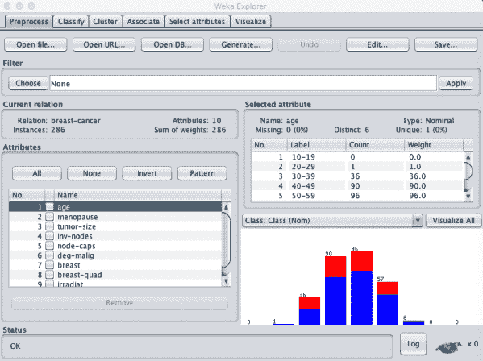

# 最流行的编程语言&为什么它们在机器学习中有用

> 原文：<https://web.archive.org/web/https://neptune.ai/blog/programming-languages-machine-learning>

在线论坛和数据科学博客有很多建议:学习那种语言，跟上那个框架，你看过那个库吗？很难跟上所有最新的技术，尤其是在机器学习领域，这个领域几乎每天都在变化。

在本文中，我们将带它回到基础，并讨论对机器学习最有用的编程语言。除了简要概述这些语言如何工作，我们还将涵盖机器学习的基础知识、数据科学家的流行趋势、有用的库、用例以及范例。让我们开始吧！

## 构建机器学习模型的基本概述

在了解为什么某些编程语言更适合 ML 之前，理解构建 ML 模型的基础是很重要的。

机器学习是最接近模仿人脑的东西。ML 算法在大量数据(图像、数字或单词)中搜索模式，以便做出预测。在搜索引擎和内容推荐系统的引擎盖下，是这些强大的机器学习算法。

构建机器学习模型有 4 个基本步骤:

### 步骤 1:整合数据集

数据集必须反映模型将做出的真实生活预测。训练数据可以分类；该模型将挑选出不同类别之间的不同特征和模式，以学习如何区分它们。例如，如果您训练一个模型对斑马和长颈鹿进行分类，数据集将包含这两种动物的图像，并进行适当的标记。

您希望准备一个包含一切的数据集，这样模型的预测就不会不准确或有偏差。数据集应该是随机的、经过重复数据删除的、全面的，并分成训练集和测试集。

您使用训练集来训练模型，使用测试集来确定模型的准确性，并确定潜在的警告和改进。训练集和测试集不应该有重叠的数据。



*Example of an image dataset that could be used for object detection | [Source](https://web.archive.org/web/20230104135859/https://scx2.b-cdn.net/gfx/news/hires/2018/restoringbal.jpg)*

### 步骤 2:选择合适的算法

根据手头的任务、训练数据量以及数据是否有标签，可以使用特定的算法。

标记数据的常见算法包括:

*   回归算法
*   决策树
*   基于实例的算法

无标签数据的常见算法包括:



*A neural network acts as a human brain in order to recognize relationships within huge amounts of data. | [Source](https://web.archive.org/web/20230104135859/https://miro.medium.com/max/1592/1*yGMk1GSKKbyKr_cMarlWnA.jpeg)*

### 步骤 3:在数据集上训练算法

该模型在数据集上反复训练，根据不正确的输出调整权重和偏差。例如，如果我们有一条直线的方程:y = mx + b，训练的可调值是“m”和“b”，或者我们的权重和偏差。我们无法影响输入(y)或输出(x ),因此我们必须在训练过程中调整 m(斜率)和 b (y 截距),随机值被分配给 m 和 b，直到线的位置受到影响，从而获得最正确的预测。随着不断迭代，模型的精度不断提高。

### 步骤 4:测试+改进模型

您可以通过对以前从未用于训练的新数据进行测试或评估来检查模型的准确性。这将帮助你理解你的 ML 模型在现实世界中的表现。评估后，您可以微调我们在训练过程中最初假设的超参数；根据数据集、模型和训练过程的具体情况，调整这些超参数在某种程度上可以成为一个不断变化的实验过程。

## 机器学习的应用

既然我们已经学习了构建简单机器学习模型背后的理论，让我们来探索现实世界中的各种应用。一旦你学会了机器学习，这就是你将能够建立的！

### 推荐引擎

几乎各大平台都有推荐系统。他们收集用户数据来推荐产品、服务或信息。推荐系统可能会跟踪数据，如用户的观看历史、用户观看某个内容的时间、他们对该内容的反应等。

### 社会化媒体

社交媒体平台使用各种各样的 ML 工具来保持它们的使用。例如，脸书分析你喜欢什么内容，以便提供相关的广告。Instagram 通过图像处理识别视觉效果。Snapchat 跟踪你的面部运动，同时使用计算机视觉对其进行过滤。

### 无人驾驶汽车

为了避开附近的物体，如行人和其他汽车，自动驾驶汽车通过传感器和摄像头收集周围的数据。使用 SIFT(尺度不变特征变换)等 ML 算法，汽车可以表现得好像有人真的在方向盘后面一样。

### 教育

ML 可用于识别苦苦挣扎的学生或教育平台中的差距。Anki 和 Quizlet 等抽认卡工具使用算法来跟踪记忆和保持率。

### 医学+健康

ML 技术正在成为医疗保健行业的重要组成部分。ML 算法可用于确定最佳治疗过程，帮助进行更准确的诊断和药物开发，等等。医疗保健管理系统使用 ML 来绘制和治疗传染病，并为患者提供个性化护理。

### 人物检测

人物检测让您可以通过摄像机或视频来识别和跟踪人物。这项技术用于安全设备，最近正在亚马逊 Go 杂货店实施，该技术在顾客购物时跟踪他们，所以他们不必结账。

## ML 编程语言

您现在已经对 ML 及其现实世界的应用程序有了基本的了解，但是可能很难知道从哪里或者如何开始。最重要的第一步是了解至少一种用于机器学习的主要编程语言。

在我们深入讨论之前，我们先来谈谈数据科学家的受欢迎程度。Stack Overflow 在 2018 年进行的开发者调查显示，Python 是最受欢迎的编程语言，其次是 Java 和 Javascript。

Python 拥有无可争议的受欢迎程度。Python 的创造者 Guido Van Rossum 说:“我当然没有打算创造一种面向大众消费的语言。”可以肯定地说，他做了相反的事情，因为 Python 为那些回避编码的人带来了编码的前沿——过于复杂的语法早已成为过去。

这个描述流行 Python 用例的图表是开发者调查的另一个成果。最初，web 开发似乎是 Python 最受欢迎的用途，约占 26%。然而，数据分析和机器学习的结合揭示了惊人的 27%。那么为什么*对 ML 来说* Python 这么受欢迎呢？

在我们深入研究之前，我们必须了解人工智能项目在技术栈和所需技能方面不同于传统的软件项目。因此，选择一种稳定、灵活、拥有多样化工具的编程语言是非常重要的。Python 满足了所有这些。

除了简单性和一致性，它还有一个很棒的社区，可以帮助构建各种 ML 框架和库。这些是预先编写的 Python 代码包，可以帮助机器学习工程师快速解决常见任务，并更快地开发产品。

| 大众图书馆 | 特定用途 | 利益 |
| --- | --- | --- |
|  | 

支持多个后端神经计算引擎

 | 

用户友好，易于学习和建立模型，广泛采用

 |
|  | 

大型数值计算/多层神经网络

 | 

漂亮的计算图，库管理，调试，可扩展性，流水线

 |
|  | 

ML 和统计建模工具

 | 

进行各种任务，包括预处理、聚类、模型选择等。大量的功能，以及为各种目的而建造的

T3 |
|  | 

从事线性代数、傅立叶变换和矩阵领域的工作

 | 

减少存储数据的内存使用量

 |
|  | 

构建在 NumPy 扩展之上，让用户操作和可视化数据

 | 

为了可视化和操纵数据的高级命令和类

 |
|  | 

用于数据分析、清理、探索、转换、可视化

 | 

多种功能，处理大数据，精简数据表现形式

 |
|  | 

建立在 Matplotlib 的基础上，创建漂亮而丰富的统计图形

 | 

美学与内置剧情

 |

正如您所看到的，Python 为 ML 提供了一种其他语言无法提供的简单体验:您不必重新发明轮子。

Python 比其他编程语言更直观，因为它的语法非常简单，是团队实现的最佳选择。开发人员可以专注于手头的 ML 任务，如复杂的算法或通用的工作流，而不是语言的细节。看一下这个简单的例子:

**C:**

**Java:**

```py

main()
{
    printf("Hello World");
}
```

Python 还具有难以置信的灵活性和平台无关性，因为它不需要 Python 解释器就能得到 Linux、Windows 和 macOS 的支持。这也使得在使用自己的 GPU 时，训练变得更加便宜和简单。57%的机器学习工程师报告使用 Python，其中 33%的人更喜欢将其用于开发。

```py
public class HelloWorld {
   public static void main(String[] args) {
      System.out.println("Hello, World");
   }
}
```

然而，对于任何事情，我们也必须考虑 Python 的缺点:

几乎没有统计模型包

*   由于全局解释器锁(GIL ), Python 中的线程化很成问题，多线程 CPU 绑定的应用程序比单线程运行得慢。
*   稀有

### 现在让我们来看看 R。R 是为高级统计和数据可视化而构建的。对于任何想要理解机器学习或统计中涉及的数学计算的人来说，这是适合你的语言。

在数据分析和可视化方面，Python 中的 R beats。它允许快速原型和数据集工作，以建立您的 ML 模型。例如，如果你想将大段文字分解成单词或短语来寻找模式，R 会击败 Python。

r 还附带了一个令人印象深刻的库和工具集，以帮助您的机器学习追求。这些高级数据分析包涵盖了建模前和建模后阶段，是为模型验证或数据可视化等特定任务而设计的。

有用的包和库包括:

大众图书馆

| 特定用途 | 利益 |  |
| --- | --- | --- |
| 

用来“整理”你的数据并使其易于与

一起工作的集合 | 用于“整理”您的数据并使其易于使用的集合 | 更高效的代码、有组织的数据 |
| 

Tidyr 的一部分，将图形分解成语义组件的数据可视化包

 | Tidyr 的一部分，数据可视化包，将图形分解成语义组件 | 更轻松地浏览数据，同时创建复杂的可视化效果 |
| 

Tidyr 的一部分，帮助挑战

 | Tidyr 的一部分，帮助应对数据操作挑战 | 快速，直接连接到外部数据库，链函数，以减少混乱和编码，语法简单 |
| 

用于业务和财务分析

 | 用于业务和财务分析 | 模型和规模财务分析 |

除了一个活跃而有用的开源社区，R 还可以免费下载并附带 GNU 包，这使它跻身于 SAS 和 Matlab 等昂贵的替代软件之列。R Studio 是一个 IDE，它允许开发人员创建 ML 算法的统计可视化。r 附带了一个控制台、语法高亮编辑器和其他有用的工具，比如绘图、历史、调试、工作空间管理。

要开始使用 R 并下载 R studio，请查看其[网站](https://web.archive.org/web/20230104135859/https://rstudio.com/)。



*Screenshot of R Studio | [Source](https://web.archive.org/web/20230104135859/http://www.rstudio.com/wp-content/uploads/2014/04/rstudio-windows.png)*

现在我们来谈谈不那么有趣的部分。R 的缺点包括:

陡峭的学习曲线: R 是一门难学的语言，这可能会增加为一个项目或团队寻找专家的难度。您使用的任何新包都需要学习，并且没有完整的 r 文档。

*   r 可能不一致，因为它的算法来自第三方。
*   说到 ML，最大的问题往往是 R 或 Python。两者各有优缺点，但 Python 更适合数据操作和重复性任务。如果你想构建某种使用 ML 的产品，那就用 Python 吧。如果你需要一些深入的分析，R 是你最好的选择。

朱莉娅

### 我们已经相当深入地讨论了 ML 的两种巨型语言。但是 Julia 是一个真正的失败者:虽然不像 Python 和 R 那样受欢迎，但它的功能与 Python、MATLAB 和 R 相当，并且具有 C++和 Java 的执行速度。现在这个理由足够让你记住它了！Java 有两个巨大的优势:速度+为并行而设计。因为它感觉像一种脚本语言，所以转换起来也不困难，所以 Python / R 开发人员可以很容易地掌握它。

在 AI 方面，Julia 最适合深度学习(仅次于 Python)，并且非常适合快速执行基础数学和科学。Julia 专注于科学计算领域，非常适合这个领域。由于这些计算能力，Julia 具有可伸缩性，并且比 Python 和 r 更快。

其强大的本地工具包括:

大众图书馆

| 特定用途 | 利益 |  |
| --- | --- | --- |
| 

轻量级的 ML 库，有用的工具，帮助你使用朱莉娅的全部力量

 | 轻量级 ML 库，有用的工具，帮助您使用朱莉娅的全部权力 | 用 Julia 编写，具有与 Tensorflow 相同的功能 |
| 

深度学习框架，在 Julia

中使用模型的动态计算图支持 GPU 运算和自动微分 | 深度学习框架，使用 Julia 中的模型的动态计算图支持 GPU 操作和自动微分 | 用朱莉娅写的，活跃社区 |
| 

可用于数据处理&操纵、性能评估、交叉验证、模型调整等。

 | 可用于数据处理和操作、性能评估、交叉验证、模型调整等。 |  |
| 

Julia 版 Tensorflow

 | 张量流的 Julia 版本 | 用 Julia 编写，提供了将计算表示为数据流图的灵活性 |
| 

茱莉亚版 Scikit 学

 | 朱莉娅版 Scikit Learn | 用 Julia 写的，让你进行预处理，聚类，模型选择等。:多种用途 |

Julia 还可以调用 Python、C 和 Fortran 库，并带有交互式命令行和全功能调试器。

然而，与 Python 相比，Julia 在面向对象编程、可伸缩性、社区和各种库方面有所欠缺。它还处于初级阶段。大多数 ML 专家都使用两者:Julia 用于后端深度学习，在那里它实现了最佳的性能比率，Python 用于前端。

Java Script 语言

### 当您想到 ML 时，JavaScript 肯定不是第一个想到的。虽然 JavaScript 主要用于 web 开发，但它已经用 TensorFlow.js 滑入了机器学习，TensorFlow.js 是 Google 创建的开源库，它使用 JavaScript 在浏览器中构建机器学习模型，或者在 Node.js 中，JavaScript。对于那些只熟悉 web 开发的人来说，TensorFlow.js 是进入 ML 的绝佳入口。TensorFlow.js 支持 WebGL，所以你的 ML 模型可以在有 GPU 的情况下运行；例如，如果用户在手机上打开网页，该模型可以利用感官数据。Tensorflow.js 允许您导入现有的预训练模型，重新训练导入的模型，并在浏览器中创建模型。我们来看看 TensorFlow.js 的利弊


*An example of what you can do with TensorFlow.js | [Source](https://web.archive.org/web/20230104135859/https://miro.medium.com/max/3200/0*hfplSJ9gMJCjluG-)*

赞成的意见

| 骗局 | 

具有很高的计算性能

 |
| --- | --- |
| 具有很高的计算性能 | 数据限制:无法访问浏览器，这意味着数据资源有限 |
| 高度安全，设备在运行应用程序时可抵御外部威胁 | 对硬件加速的有限支持 |
| 几个用例:浏览器中的 Javascript 应用程序、Node.js 环境中的服务器、桌面、移动设备等。 | 单线程，这会限制性能 |

许多开发人员将 ML 从后端服务器带到前端应用程序。TensorFlow.js 允许开发人员在没有复杂后端系统的情况下，用纯 HTML 创建和运行 ML 模型。这种简单性让您可以轻松地创建伟大的项目。这里有几个例子:

自动图片处理:通过卷积神经网络生成艺术

*   使用人工智能的游戏
*   内容推荐引擎
*   了解本地网络/设备使用模式的活动监控
*   对象检测，例如识别照片中的许可证
*   斯卡拉

### Scala 比 Python 快得多，并且将面向对象和函数式编程的精华带到了一种高级语言中。它最初是为 Java 虚拟机(JVM)构建的，非常容易与 Java 代码交互。开发人员可以轻松构建高性能系统，同时通过 Scala 使用静态类型来避免错误。

Scala 有几个用于线性代数、随机数生成、科学计算等的库。：

大众图书馆

| 特定用途 | 利益 |  |
| --- | --- | --- |
| 

用于通过数组支持、2D 数据结构等进行数据操作。

 | 用于通过阵列支持、2D 数据结构等进行数据操作。 | 构建在阵列支持的数据结构之上 |
| 

一个快速 GPU 和 CPU 加速库

 | 快速 GPU 和 CPU 加速库 |  |
| 

主要科学计算库，最好来自 MATLAB 的数据结构和来自 Python 的 Numpy 类

 | 主要的科学计算库，最好来自 MATLAB 的数据结构和 Python 的 Numpy 类 | 对数据阵列进行快速高效的操作 |
| 

Scala 版 MATLAB 计算功能

 | MATLAB 计算功能的 Scala 版本 | 附带 Scala 的可伸缩性和强大功能 |
| 

用于自然语言处理

 | 用于自然语言处理 | 由于高速和 GPU 的使用，可以解析成千上万的句子 |

从性能、学习曲线和易用性来看，Scala 也是 Apache Spark 的绝佳选择(Apache Spark 是一个数据处理框架，用于在巨型数据集上处理任务，并将数据处理任务分布到多台计算机上)。

现在我们来比较一下 Scala 的优缺点:

赞成的意见

| 骗局 | 

允许利用 JVM 库，常用于企业代码

 |
| --- | --- |
| 允许利用 JVM 库，经常在企业代码中使用 | 陡峭的学习曲线结合了函数式编程和面向对象编程 |
| 几个可读的语法特性 | 有限的开发人员社区、资源 |
| 功能特性，如字符串比较、模式匹配等。 | C/C++ |

C/C++和机器学习是一对困难的组合。从一开始，Python 似乎就比 C/C++有许多优势:

### Python 更灵活，语法简单，也更容易学习

使用 Python 可以让你专注于 ML 的细微差别，而不是语言

*   大量的库和包
*   您可以通过 Python 解释器，仅通过命令行与数据交互工作
*   用 C/C++调试 ML 算法要困难得多
*   然而，使用 C/C++也有一些优点:
*   C/C++是最有效的语言之一，机器学习算法需要很快。

使用 C/C++可以让你控制从内存、CPU 等开始的单个资源。

*   很多 ML 框架比如 TensorFlow，caffe，vowpal，wabbit，libsvm 等等。实际上是用 C++实现的
*   你一定会在招聘人员和公司面前脱颖而出
*   作为最古老的编程语言之一，C 和 C++在机器学习方面是一个利基。C 可以用来补充现有的机器学习项目，计算机硬件工程师更喜欢 C，因为它的速度和控制水平-你可以使用 C/C++从头实现算法。
*   通常，在以下情况下使用 C/C++:

速度极其重要

没有适合您的用例的 Python 库

*   您希望控制内存的使用，因为您将达到系统的极限

*   大众图书馆

特定用途

| 利益 |  | 

大型数值计算/多层神经网络

 |
| --- | --- | --- |
| 大型数值计算/多层神经网络 | 

漂亮的计算图，库管理，调试，可扩展性，流水线

 | 

微软认知工具包

 |
| 

深度学习工具包，使用有向图描绘神经网络一系列计算步骤

 | 

开源，让你使用庞大的数据集

 |  |
| 深度学习框架，让您可以使用富有表现力的架构、可扩展的代码等。 |  | 

让你更快的实现 ML 算法

 |
| 让您更快地实现 ML 算法 | 

强调扩展性和速度，易于使用

 | 

【DyNet】

 |
| 

支持 NLP、图结构、强化学习等的神经网络库。

 | 

高性能，在 CPU 或 GPU 上高效运行

 |  |
| 有各种各样的 ML 方法，如多种数据表示，算法类，通用工具等。 | 

开源，各种工具

 | Java 语言(一种计算机语言，尤用于创建网站) |

许多公司的基础设施、软件、应用程序等。都是用 Java 构建的，这意味着集成和兼容性问题被最小化了

### 许多流行的数据科学框架，如 Fink、Hadoop、Hive 和 Spark 都是用 Java 编写的



*Screenshot of the Weka Machine Learning Workbench | [Source](https://web.archive.org/web/20230104135859/https://machinelearningmastery.com/wp-content/uploads/2016/06/Weka-Explorer-Preprocess-Tab.png)*

Java 可用于数据科学中的各种过程，如清理数据、数据导入和导出、统计分析、深度学习、NLP 和数据可视化

*   Java 虚拟机允许开发人员编写跨多个平台的相同代码，并且可以更快地构建工具
*   用 Java 构建的应用程序易于扩展
*   Java 像 C/C++一样运行迅速，这就是为什么 Linkedin、脸书和 Twitter 使用 Java 来满足他们的一些 ML 需求
*   Java 是一种强类型编程语言，这意味着开发人员必须对变量和数据类型有明确而具体的了解
*   生产代码库通常用 Java 编写
*   Java 也为 ML 配备了各种工具和库:

*   大众图书馆

特定用途

利益

|  | 

用于通用机器学习:算法、数据挖掘、数据分析、预测建模

 | 用于通用机器学习:算法、数据挖掘、数据分析、预测建模 |
| --- | --- | --- |
| 

开源，各种工具

 | 开源，各种各样的工具 | 

用于创建可扩展的机器学习算法

 |
| 

可扩展的、现成的大型数据挖掘任务框架

 | 适用于大型数据挖掘任务的可扩展、即用型框架 | 

开源软件，用于实时对数据流进行数据挖掘

 |
|  |  | 广泛支持深度学习算法的框架 |
| 

开源，提供高处理能力

 | 开源，提供高处理能力 | 

专门用于自然语言处理的工具包，可以用于主题建模、文档分类、聚类、信息抽取

 |
| 

建立在 Java 之上，让你用 ML 来处理文本文档

 | 构建于 Java 之上，允许您使用 ML 来处理文本文档 | 所有编程语言的能源数据 |

正如所料，在我们今天讨论的所有语言中，C 语言被证明是最快和最节能的。

## 所有编程语言的比较

让我们最后看一下这些语言提供的各种特性:

## Comparison of all the programming languages  

计算机编程语言

稀有

| 朱莉娅 | java 描述语言 | 斯卡拉 | C/C++ | Java 语言(一种计算机语言，尤用于创建网站) |  | **面向对象、命令式、函数式、面向方面、反射式** | **面向对象和函数式编程的混合，命令式，反射式** |
| --- | --- | --- | --- | --- | --- | --- | --- |
| **多重调度，因此易于表达面向对象和函数式编程模式** | **命令式、面向对象、功能性、反思性** | **面向对象、功能性、通用性** | **祈使句** | **命令式、面向对象、通用、反射式** |  | **否，因为语言参考包含在每个版本的文档中** | **否** |
|  | **是** | **是** | **是** | **是** |  | **强** | **强** |
| **强** | **虚弱** | **强** | **虚弱** | **强** |  | **安全** | **安全** |
| **安全** |  | **安全** | **不安全** | **安全** |  | **隐含的** | **隐含的** |
| **隐含的** | **隐含的** | **部分隐式** | **显式** | **显式** |  |  | **鸭子，结构** |
|  |  | **主格结构** | **主格** | **主格** |  | **动态** | **动态** |
| **动态** | **动态** | **静态** | **静态** | **静态** |  | **按值** | **所需值** |
| **“路过共享”** | **按值** | **按值+名称** | **通过值/指针** | **按值** |  | **是** | **是** |
| **是** | **是** | **是** | **Optional** | **是** |  | ML，网络开发。，游戏开发。，软件开发。 | **统计计算与图形、数值计算、可视化** |
| 

并行性，//r//n//r//n“我们想要像 Python 一样可用于一般编程，像 R 一样易于统计，像 Perl 一样自然地处理字符串，像 Matlab 一样强大地处理线性代数，像 shell 一样善于将程序粘在一起。”[出处](https://web.archive.org/web/20230104135859/https://julialang.org/blog/2012/02/why-we-created-julia/)

 | 并行性，//r//n//r//n“我们想要像 Python 一样适用于一般编程，像 R 一样易于统计，像 Perl 一样自然地处理字符串，像 Matlab 一样强大地处理线性代数，像 shell 一样善于将程序粘合在一起。”[来源](https://web.archive.org/web/20230104135859/https://julialang.org/blog/2012/02/why-we-created-julia/) | Web 脚本、Web +移动开发、Web 服务器+游戏开发。 | **通用语言、并行计算、DSL 和计算** | 应用程序、服务器端、后端开发、Android 开发。 |  | **生产力、代码可读性、简单性、模块化** | **交互式、全面的数据集分析，高级数据分析** |
| **通用、全面的数据集分析、强大且快速** | Web 开发。 | **Java 的更好替代方案，简洁、类型安全、可伸缩、平台独立** | **低级别访问** | **简单、安全、分布式、面向对象、健壮、可移植的“一次编写，随处运行”** | 

**人气:**
**【按优先级排列】**

 | **人气:**
**【优先顺位】** | **57%** |
| **31%** | **28%** | **不适用** | **43%** | **41%** |  | **33%** | **5%** |
| **不适用** | **7%** | **不适用** | **19%** | **16%** |  | **情感分析、NLP/chatots、网络挖掘** | **情感分析、生物工程/生物信息学、欺诈检测** |
| **科学计算** | 搜索引擎，网络开发。 | **大数据** | **游戏中的人工智能、机器人移动、网络安全+网络攻击检测** | **客户支持管理、网络安全+网络攻击检测+欺诈检测** | 

**进入 ML 前的专业背景***

 | **进入 ML 前的专业背景*** | **数据科学** |
| **数据分析师/统计师** | **前端 web 开发人员** | **不适用** | **嵌入式计算硬件，电子工程师** | **前端桌面应用开发者** |  | **对 ML 好奇** | **数据科学** |
|  | 增加获得工作的机会 |  | **将机器学习添加到现有应用中** | **公司** |  | **Keras, Tensorflow, Scikit learn, NumPy, SciPy, Pandas, Seaborn** | **Tidyr，Ggplot2，Dplyr，tidy quat** |
| **流动、膝、MLBase.jl、tensorflow . jl、ScikitLearn.jl** | **TensorFlow.js** | **鞍座、气雾、微风、标量、NLP** | **Tensorflow，微软认知工具包，Caffe，MLpack，DyNet，幕府将军** | **Weka，Apache mahout，海量在线分析，Deeplearning4j，Mallet** | 

**资源/文档/社区**

 | **资源/文档/社区** | **伟大的** |
| **伟大的** | **可能对 ML 更好** | **可能更大** | **好的** | **好的** | **Could be bigger** | **Good** | **Good** |