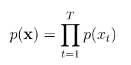
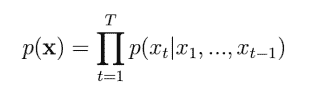
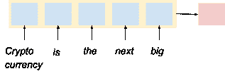
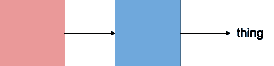

# 递归神经网络指南:RNN 的深度探索

> 原文：<https://web.archive.org/web/https://neptune.ai/blog/recurrent-neural-network-guide>

[序列建模是对序列数据](https://web.archive.org/web/20220928182040/https://towardsdatascience.com/introduction-to-sequence-modeling-problems-665817b7e583)进行建模的任务。建模序列数据是指创建一个数学概念来理解和研究序列数据，并使用这些理解来为特定应用程序生成、预测或分类序列数据。

顺序数据有三个属性:

1.  序列中的元素可以重复
2.  它遵循顺序(上下文安排)
3.  数据长度变化(可能是无限的)

顺序数据例子有:

1.  文本和句子
2.  音频(如语音和音乐)
3.  电影或视频
4.  时间序列数据(如股票市场数据)
5.  DNA 序列，蛋白质结构
6.  材料成分
7.  决策

序列数据因其属性而难以建模，需要不同的方法。例如，如果顺序数据通过前馈网络输入，它可能无法很好地建模，因为**顺序数据具有可变长度**。前馈网络对于固定大小的输入工作良好，并且没有很好地考虑结构。

另一方面，卷积神经网络是为了处理结构或数据网格(如图像)而创建的。他们可以处理长的数据序列，但是受限于**他们不能正确排序序列**。

那么，**我们如何建立可以对序列数据建模的深度学习模型呢？**对顺序数据建模并不是一件容易的事情。

例如，当对监督学习任务建模时，我们的方法是向神经网络提供一对输入(x)和输出(y)。在训练期间，模型通过逼近一个更接近原始值的值来学习将输入与输出进行映射。

*和【f】[θ](x)*

在每次迭代期间，该模型试图通过损失函数来校正近似输出，即，通过获取原始或基本真实值与预测值的差，并同时通过优化过程来更新模型的参数。这样，可以确保它们之间的差异减小，近似值尽可能接近原始值。

当我们处理序列数据时，我们试图对输入序列进行建模。与监督学习任务不同，在监督学习任务中，我们将输入与输出进行映射，在序列建模中，我们尝试对序列的**概率**进行建模。

这使得机器学习或深度学习模型能够生成令人喜欢的序列，或者能够估计序列的可能性。计算损失函数和优化的其余过程保持不变。

## 如何对序列建模

让我们用一个例子来理解如何对序列建模。

在下面的例子中，我们将使用英语单词(句子)序列进行建模，因为它们继承了我们前面讨论过的相同属性。

### 建模 p(x)

假设一个句子中的单词相互独立，我们可以使用一个语料库来告诉我们每个单词在英语中出现的概率。

一旦我们知道了每个单词的概率(从语料库中)，我们就可以通过将单个单词彼此相乘来找到整个句子的概率。

例如，如果我们对句子“*加密货币是下一件大事*”进行建模，那么它看起来会像这样:

p(" *加密货币* ")p(" *是* ")p(" *的* ")p(" *下一个* ")p(" *大的* ")p(" *事*")

上述模型可以用一个公式来描述:



每个单词都有一个时间戳:t，t-1，t-2，t-n，它描述了单个单词的位置。

但是，事实证明，上述模型并没有真正捕捉到序列的结构。为什么？

因为任何特定单词的概率都可能高于单词的其余部分。在我们的示例中，单词“**”*的概率比任何其他单词都高，因此得到的序列将是“*The The The The "*。*

 *### 建模 p(x |上下文)

虽然我们仍然可以通过引入 **[条件概率](https://web.archive.org/web/20220928182040/https://www.statisticshowto.com/probability-and-statistics/statistics-definitions/conditional-probability-definition-examples/#:~:text=Conditional%20probability%20is%20the%20probability,probability%20of%200.5%20(50%25).)** 来修改相同的模型，但假设每个单词现在都依赖于其他每个单词，而不是独立的，我们现在可以按照以下方式对序列建模:p(x[T])= p(x[T]| x[1]…。，x [T-1] )。

同一句话“*加密货币是下一个大 _ _ _ _ _ _ _ _*”现在可以有一系列选项可供选择。例如:

***本质上，条件概率描述的是下一个词会是什么。***

但是上面的例子可以一次预测一个单词；为了预测单词序列，我们需要根据条件句计算**联合概率。**



举个例子，

p(x|context):

p(x3|x2，x1)

*加密货币是下一个的*****

p(x|context):

p(x4|x3，x2，x1)

*加密货币是下一个**大***

p(x|context):

p(x5|x4，x3，x2，x1)

*加密货币是下一个大**的东西***

p(x|context):

p(x6|x5，x4，x3，x2，x1)

**预测的单词以粗体书写*

**the predicted words are written in bold*

到目前为止，我们了解了如何使用单词语料库(包含概率值)对句子序列进行建模，然后计算句子中每个单词的**联合**和**条件**概率，我们可以从语料库中选择适当的单词，并预测句子中的下一个单词。

这种类型的方法很适合一些句子，并且**很好地捕捉了数据的结构**。但是当我们处理段落时，我们必须处理**可伸缩性**。当这种模型被引入大句时，处理能力增加，效率降低。

N-grams

### 为了应对可扩展性问题，NLP(自然语言处理)研究人员引入了 **[N 元语法](https://web.archive.org/web/20220928182040/https://kavita-ganesan.com/what-are-n-grams/#.YEyLImhKiUk)** 的概念，其中考虑了“N”个单词的条件和联合概率。例如，如果 n 等于 2，那么只有句子的前两个单词将用于计算联合概率，而不是整个句子。

目标

p(x |上下文)和 n=2

p(x1)

p(x2|x1)

p(x|context) and n=2:

p(x3|x2，x1)

p(x|context) and n=2:

*加密货币就是下一个的*****

p(x|context) and n=2:

p(x4|x3，x2)

*加密货币是下一个**大***

p(x|context) and n=2:

p(x5|x4，x3)

*加密货币是下一个大**的东西***

p(x|context) and n=2:

p(x6|x5，x4)

**预测的单词以粗体书写*

p(x|context) and n=2:

p(x6|x5,x4)

这种方法减少了可伸缩性问题，但不是完全减少。

N 元语法的缺点是:

如果句子很长，句子的上下文就会丢失。

小规模减少可伸缩性问题

上下文矢量化

1.  上下文矢量化是一种方法，其中输入序列被概括为向量，使得该向量然后被用于预测下一个单词可能是什么。
2.  f h

### f *[θ]* 这样总结 h 中的上下文:

p(x [t] |x [1] ，…，x[t-1])≈p(x[t]| h)

一旦我们找到上下文向量 **h** ，我们就可以使用**第二函数** g，它产生**概率分布**。



*h g[θ]*

上下文矢量化的优点是:

秩序得以维持

可以在可变长度的序列中操作



它可以学习微分(反向传播)

1.  上下文保存在短句或序列中。
2.  到目前为止，我们已经了解了什么是顺序数据以及如何对其建模。在下一节中，我们将了解 rnn 以及它们如何使用上下文矢量化来预测下一个单词。
3.  什么是递归神经网络？
4.  [递归神经网络](https://web.archive.org/web/20220928182040/https://towardsdatascience.com/recurrent-neural-networks-d4642c9bc7ce)用于用时间步长索引 t 对序列数据建模，并结合了上下文矢量化技术。

上下文矢量化充当“存储器”,它捕获关于到目前为止已经计算的信息，并使 rnn 能够记住过去的信息，其中它们能够保存长的和可变的序列的信息。因此，RNNs 可以接受一个或多个输入向量，并产生一个或多个输出向量。

## 通过设计，rnn 类似于深度神经网络。它们有输入向量、权重向量、隐藏状态和输出向量。隐藏状态将序列的模式或上下文捕获到一个摘要向量中。输出不仅受应用于输入的权重(如常规神经网络)的影响，还受表示基于先前输入的上下文信息的“隐藏”状态向量的影响，使得相同的输入可以根据序列中输入的上下文产生不同的输出。

RNN 是如何工作的？

如上所述，rnn 有四个主要组成部分:

投入

## 隐藏状态

重量或参数

1.  输出
2.  为了更好地理解 RNN，我们需要看看多层感知器如何处理序列数据。
3.  多层感知器
4.  在[多层感知器(MLP)](https://web.archive.org/web/20220928182040/https://machinelearningmastery.com/neural-networks-crash-course/) 中，我们有一个输入层、一个隐藏层和一个输出层。输入层接收输入，通过应用激活的隐藏层传递输入，然后返回输出。

当存在多个隐藏层时，激活被应用到第一个隐藏层的每个节点，然后被发送到下一个隐藏层，依此类推，直到它到达最后一个层以产生输出。每个隐藏层都有自己的权重和偏差，使它们相互独立。

### 但是这两者之间的关系是无法建立的，除非我们把这些隐藏的层结合在一起，因为我们处理的是序列。**如果隐藏层相互独立，那么结构和顺序将会丢失**。因此，为了将这些隐藏层组合在一起，我们应该为每个隐藏层设置相同的权重和偏差。

为了实现输入和输出之间的这种连续和结构化的关系，我们需要将输入句子一个字一个字地输入到序列中的所有隐藏层，同时将前一个神经元的输出输入到下一个神经元。

这种方法使整个过程结构化和有关联。

这是递归神经网络的开端，其中先前的输入与当前的输入相结合，从而保持当前输入(x2)与先前输入(x1)的某种关系。

本质上，rnn 是 MLP 的一个修改版本，其中数据被输入到每个隐藏层。

递归神经网络

在 RNNs 中，x(t)在时间步长 t 时作为网络的输入。RNN 中的时间步长 t 表示单词在句子或序列中出现的顺序。隐藏状态 h(t)表示在时间 t 的**上下文向量**，并且充当网络的**存储器**。基于当前输入和前一时间步的隐藏状态计算上下文向量 h(t)。

例如，以句子“*加密货币是下一件大事”为例。*在时间 T1“加密货币”将被馈送到网络中，在时间 t2“是”被馈送到网络中，在时间 t3“是”被馈送到网络中，等等。

### 我们用这个公式来表示隐藏状态:

*h[t]= tanh(W[h]h[t-1]+W[x]x[t])*

当 t = 1 时，

*h[1]= tanh(W[h]h[0]+W[x]x[1])*，其中 x [1] 为“加密货币”，h**0 初始化为零**

当 t = 2 时，

*h[2]= tanh(W[h]h[1]+W[x]x[2])*，其中 x [1] 为‘是’。

当 t = 3 时，

*h[3]= tanh(W[h]h[2]+W[x]x[3])*，其中 x [2] 为‘the’。

隐藏状态和输入的权重参数都是可学习的，这意味着在训练期间，它将使用反向传播来更新自身。

如果你注意到上面的公式，你会发现参数={Wh，Wx，Wy}在每个输入中都保持不变。这被称为**参数共享**。参数共享使 RNNs 能够构建和保留上下文信息，即使句子的长度是可变的。当我们想要对一个数据经常重复出现的序列建模时，这种共享是很重要的。**rnn 在几个时间步长上共享相同的权重。**

rnn 预测来自最后一个隐藏状态的输出以及输出参数 Wy。预测更像是一项分类任务，其中使用了一个 **softmax** 函数来确保英语句子中所有可能单词的概率。

培训注册护士

计算梯度:通过时间反向传播

到目前为止，我们已经了解了前馈在 RNNs 中的工作原理，即输入进入网络并向前移动，同时在每个时间步长内共享相同的参数。在反向传播过程中，它必须返回时间步长以更新参数。

## 那么它是如何发生的呢？

### 如前所述，预测 RNN 的产量是一项分类任务，因此我们使用**交叉熵**来计算损失。

*L [θ] (y，y’)[t]=-y[t]logy[t]’*

其中 *θ={W [h] ，W [x] ，W [y] }*

我们知道参数是可共享的，正是 RNNs 的这种能力使网络变得不同；很难区分。为了解决这个问题，网络需要扩展，或者说**展开**，这样参数就可以根据时间步长在整个网络中进行区分——这就是术语“时间反向传播”(BPTT)。

从上图中，你可以看到一个展开的循环网络是什么样子。

由于神经网络一次只处理一个单词，因此损失是基于每个单词计算的。整个过程如下所示:

你可以看到公式是如何展开的。

对于 Wy 的区分，程序应该如下所示:

所以，让我们总结一下反向传播:

使用当前输出计算损耗，使用交叉熵损耗计算实际输出

网络是展开的或扩展的，因此反向传播可以通过隐藏层和时间发生

为递归神经元(即隐藏状态)和密集层更新权重参数

1.  渐变的问题
2.  在顺序数据的反向传播期间出现的两个常见问题是消失和爆炸梯度。
3.  消失渐变

### 当微分向量以指数方式快速变为零时，这反过来使网络难以学习一些长周期相关性，问题是**消失梯度**。

回到 RNNs 中的反向传播，我们看到网络中的每一个神经元都参与了关于成本函数的输出计算。正因为如此，**我们必须确保每个神经元的参数都得到更新，以最小化误差，并且这可以及时返回到所有神经元。**所以，你必须通过时间一路传播回这些神经元。

#### 我们还知道，**上下文向量，或隐藏状态** **参数**，在整个网络中共享，以保持顺序和连续性。在初始化期间，参数被赋予一个接近于零的随机数，当隐藏状态在时间上向前移动时

在不同的时间步长上相乘，使得梯度 Wh 越来越小，基本上为零，直到消失。

**梯度越低，网络越难更新权重，如果梯度为零，则权重不会更新。**

爆炸渐变

当由于不稳定的过程而累积大的梯度时，会发生爆炸梯度，并导致参数的非常大的更新。

在 RNNs 中，爆炸梯度可能发生在反向传播期间，并导致非常大的梯度，实质上对网络参数进行大的更新。在极端情况下，权重值可能会变得很大，以至于变成 NaN 值。

#### 克服梯度问题

rnn 中的梯度问题可以通过以下方法解决:

渐变剪辑

### 门控网络

渐变剪辑

1.  渐变裁剪是一种用于避免渐变爆炸的技术。假设 rnn 以近似线性方式运行是合理的，这使得梯度不稳定。
2.  为了控制渐变，它被修剪或整形为较小的值。裁剪渐变有两种方法:

#### 就在参数更新之前，从小批量中裁剪渐变

使用测量范数||g||的超参数 C，其中 g 是梯度。如果||g|| > C 那么 gg。C/||g||

**^(阅读)** [了解渐变裁剪(以及如何修复爆炸渐变问题)](/web/20220928182040/https://neptune.ai/blog/understanding-gradient-clipping-and-how-it-can-fix-exploding-gradients-problem)

1.  门控网络
2.  为了解决渐变消失的问题，您可以使用具有门控机制的新架构。像长短期记忆和门控循环网络这样的结构已经被证明可以解决消失梯度。我们将在下一节深入探讨它们。

* * *

RNN 摘要(至今):

* * *

#### 序列的顺序被保留

能够映射:

## 将变量序列输入到固定大小的向量中

1.  将固定大小的向量序列输入到序列中
2.  输入序列转换为相同长度的输出序列。
    1.  它是差分的(所以它可以学习)
    2.  由于梯度问题，当处理长序列时，序列的上下文丢失
    3.  RNN 的类型
3.  到目前为止，我们已经了解了:
4.  序列建模

## 这是什么？

我们如何对序列建模？

1.  上下文矢量化
    1.  递归神经网络
    2.  它们是什么？
    3.  它们是如何工作的？
2.  穿越时间的反向传播
    1.  教师强迫
    2.  训练时的 RNNs 问题
    3.  克服梯度问题
    4.  现在，我们将继续讨论不同类型的 rnn，同时阐明普通 rnn 的局限性。我们将讨论五种类型的 RNN:
    5.  双向 RNN
    6.  编码器-解码器序列到序列架构

LSTM

1.  苏军总参谋部情报总局
2.  卷积递归神经网络
3.  双向 RNN
4.  在序列建模中，到目前为止，我们假设我们的目标是给定一个特定的句子序列，对下一个输出进行建模。在 NLP 任务中，可能会出现上下文依赖于未来句子的情况。
5.  例如:

### 我是 __。

我饿了。

我饿了，我能吃掉整个馅饼。

*   在上面的例子中，答案可以分别是‘饿’，‘不’，‘非常’。但是为了理解上下文，特别是当整体上下文依赖于未来单词时，我们需要设计一个将未来单词考虑在内的模型。
*   RNNs 的一个缺点是它们及时考虑了过去和现在的单词，而不是未来的单词。这使得 RNNs 成为一个**单向顺序网络**，其中信息单向流动，通常是正向流动。
*   为了解决这个问题，我们必须引入一种机制，在这种机制中:

序列的信息反向传播

神经网络考虑了过去、现在和未来这三个时间步，并在此基础上预测输出。

双向 RNN 是解决这个问题的一种网络。这是一种将两个独立的 rnn 放在一起的架构。一个以传统方式工作，即向前工作，另一个向后工作。

1.  从上图可以看出，两个网络在每个时间步都根据**过去-现在**(正向 RNNs)信息和**未来-现在**(反向 RNNs)信息输出各自的输出。
2.  编码器-解码器序列到序列架构

在顺序建模中使用 RNNs 的优势在于它可以:

将输入序列映射到固定大小的向量

### 将固定大小向量映射到序列

将输入序列映射到相同长度的输出序列。

1.  但是假设我们想训练一个 RNN 来映射一个输入序列到一个输出序列，不一定是相同的长度。特别是当我们想把一种语言翻译成另一种语言时，这种情况就会出现。
2.  编码器-解码器序列到序列是一种处理这类问题的架构。顾名思义，它有两种类型的架构:编码器和解码器。
3.  编码器 RNN 接收可变长度的输入序列，并对其进行处理以返回一个向量或向量序列，称为“上下文”向量 *C* 。

解码器 RNN 以固定长度的向量为条件来产生输出序列。同样，编码器的最后隐藏状态是解码器的初始隐藏状态。

长短期记忆(LSTM)

建立长短期记忆是为了**保存 RNN 缺乏的序列的长期上下文信息**。

[LSTM](https://web.archive.org/web/20220928182040/https://towardsdatascience.com/understanding-rnn-and-lstm-f7cdf6dfc14e) 的核心思想是确保梯度长时间流动，不会消失或爆炸。

### 正如我们前面看到的，RNNs 有一个标准的体系结构，其中隐藏状态形成了某种循环机制来保存和共享每个时间步长的信息。嗯，LSTM 也有一个循环机制。不是只有一个神经网络层，而是有四个神经网络，以某种方式相互作用，以保存和共享长的上下文信息。

让我们一步步了解 LSTM 网络的工作原理:

**细胞状态**:长时记忆**通常称为细胞状态，用 Ct-1 表示，自然界中有**递归**。小区状态允许以前的信息存储在 LSTM 网络中。它由内部门调制，即:遗忘门和输入门。**

**遗忘门**:单元格状态与遗忘门相连，遗忘门指示哪些信息要保留，哪些信息要遗忘。它通过一个 sigmoid 函数来实现这一点。它查看 ht-1 和 xt 的初始状态，并为每个单元状态 Ct-1 输出一个介于 0 和 1 之间的数字。如果遗忘门返回的信息为 1，则存储该信息，如果返回 0，则删除该信息。

**输入门**:输入门从相同的初始状态 ht-1 取相同的输入 XT，并通过两个非线性激活函数:sigmoid(返回 0 和 1 之间的值)和 tanh(返回-1 和 1 之间的值)，分别是**输入门**it 和**候选存储器****C****`****t**。这有助于单元状态保存新信息，同时将单元状态从 Ct-1 更新为 Ct。输入门的想法是在单元状态中存储新的信息，以及从遗忘门删除的记忆。

1.  **输出门**:输出将基于单元状态 Ct、初始隐藏状态 ht-1 和输入 xt。隐藏状态和输入将通过一个 sigmoid 传递，因此值在 0 和 1 之间。同时，我们通过 tanh 传递单元状态 CT 以获得 1 和-1 之间的值，并将其乘以 sigmoid 门的输出，以便我们只输出与上下文相关的内容。

2.  总而言之:

3.  第一个 **sigmoid 激活**功能是遗忘门，它确保应该从先前的单元状态(Ct-1)中遗忘什么信息。

4.  第二个 **sigmoid** 和第一个 **tanh** 激活函数用于输入门，确保什么信息应该与先前修剪的信息一起保存到单元状态。

最后一个 sigmoid 是单元的输出门和 tanh，它突出显示哪些信息应该进入下一个隐藏状态。

1.  门控循环单元(GRU)
2.  [GRU](https://web.archive.org/web/20220928182040/https://towardsdatascience.com/understanding-gru-networks-2ef37df6c9be) 是新一代的递归神经网络，它是 LSTM 的修改版，但复杂度更低。gru 使用隐藏状态而不是单元状态来传递信息。它也只有两个门，一个复位门和更新门。
3.  **更新门:**更新门选择需要添加和/或忽略的信息。它类似于 LSTM 输入门。

### **重置门:**重置门用于决定忘记多少过去的信息。

由于 gru 的运行规模较小，因此比 LSTM 网络更快。LSTMs 和 gru 成功的原因是因为它们的门控机制:

保留上下文信息和长期序列。

避免梯度问题。

选通函数允许网络调整梯度消失的程度，因为它被复制了四次，所以在每个时间步长取不同的值。它们采用的值是当前输入和隐藏状态的学习函数。

1.  卷积递归神经网络
2.  [卷积递归神经网络](https://web.archive.org/web/20220928182040/https://towardsdatascience.com/an-approach-towards-convolutional-recurrent-neural-networks-a2e6ce722b19)是两种神经网络的组合:卷积神经网络和递归神经网络。两者都有自己独特的属性，这有助于他们在工作中脱颖而出。

由于类似网格的操作，CNN 非常善于从任何给定的数据中提取特征和表示。另一方面，rnn 非常适合顺序数据建模，这反过来又保留了顺序、结构和上下文。

### CRNN 架构通常用于产生更好/最佳的音频信号处理结果。由于像音乐这样的音频信号非常复杂(大量噪声聚集在一起)，提取低维模式和表示变得相当困难。为什么我们需要低维模式？

因为高维模式不能提供对数据结构的更好理解。使用 CNN，我们可以更深入地挖掘高维序列结构，这样它就给我们低维表示，然后可以馈入 RNN，甚至 LSTM，这可以用来生成/预测另一个序列。

CRNN 也用于图像序列应用示例图像字幕，也可用于从句子生成图像，也称为序列到图像。

RNN 在 Keras / Tensorflow 和 Python 中的实现

让我们看看如何用 keras 为**字符文本预测**实现 [RNN。](https://web.archive.org/web/20220928182040/https://www.tensorflow.org/guide/keras/rnn)

我们将使用两个库:numpy 和 tensorflow-keras。

## 你可以在这里下载数据集[。](https://web.archive.org/web/20220928182040/https://github.com/dakrone/corpus/blob/master/data/alice-in-wonderland.txt)

数据预处理

数据预处理是必要的，因为数据包含 ASCII 字符，这可能会干扰我们的建模过程并给出不正确的结果。

```py
import numpy as np

from tensorflow.keras.layers.recurrent import SimpleRNN
from tensorflow.keras.models import Sequential
from tensorflow.keras.layers import Dense, Activation
```

清理完数据后，我们可以创建一个查找表。查找表基本上从数据中创建唯一字符的表。该表将把文本中的字符转换成数字，然后将数字输入到 RNNs 中。

```py
INPUT_FILE = "data/wonderland.txt"
```

### 现在，我们将创建输入和标签。重要的是要理解，在序列建模中，输入将从索引 0 开始，而标签将从索引 1 开始。

例如，如果我们输入“加密货币是下一件大事”，那么:

```py
print("Extracting text from input")
file = open(INPUT_FILE, 'rb')
lines = []
for line in file:
    line = line.strip().lower()
    line = line.decode("ascii", "ignore")
    if len(line) == 0:
        continue
    lines.append(line)
file.close()
text = " ".join(lines)
```

After the data is cleaned, we can create a look-up table. The look-up table basically creates a table of unique characters from the data. This table will convert the characters in the text to numbers, which will then be fed into the RNNs. 

```py
chars = set([c for c in text])
nb_chars = len(chars)
char2index = dict((c, i) for i, c in enumerate(chars))
index2char = dict((i, c) for i, c in enumerate(chars))

print(index2char)
```

```py
{0: '!',
 1: 's',
 2: '7',
 3: 'p',
 4: 'x',
 5: '.',
 6: ']',
 7: '3',
 8: 'a',
 9: 'z',
 10: '9',
 11: '5',
 12: '6',
 13: 'h',
 14: ',',
 15: 'c',
 16: 'r',
 17: '@',
 18: 'k',
 19: 'w',
 20: 'd',
 21: '(',
 22: 'o',
 23: 'f',.....}
```

Now, we’ll create inputs and labels. It’s important to understand that in sequence modeling, the input will start from index 0, where the label will start from index 1. 

* *值得一提的是，这是一个角色级别的 RNN，所以你将与角色*一起工作，而不是文字

一次热编码

将序列转换为一位热编码向量。

模拟 RNN

定义模型:

```py
print("Creating input and label")
SEQ_LEN = 10 
STEP = 1
print("The table is ready")
```

```py
input_chars = []
label_chars = []
for i in range(0, len(text) - SEQ_LEN, STEP):
    input_chars.append(text[i:i + SEQ_LEN])
    label_chars.append(text[i + SEQ_LEN])

print(input_chars)
```

```py
['project gu',
 'roject gut',
 'oject gute',
 'ject guten',
 'ect gutenb',
 'ct gutenbe',
 't gutenber',
 ' gutenberg',
 'gutenbergs',...]
```

### RNN 将包含 128 个隐藏的州

永远记住，密集层应该等于文本中唯一字符的数量

```py
print("Vectorizing input and label text...")
X = np.zeros((len(input_chars), SEQ_LEN, nb_chars), dtype=np.bool)
y = np.zeros((len(input_chars), nb_chars), dtype=np.bool)
for i, input_char in enumerate(input_chars):
    for j, ch in enumerate(input_char):
        X[i, j, char2index[ch]] = 1
    y[i, char2index[label_chars[i]]] = 1
```

### 训练模型

结论

1.  在本文中，我们讨论了:
2.  如何有效地模拟序列以捕捉结构和上下文。

```py
HIDDEN_SIZE = 128
BATCH_SIZE = 128
NUM_ITERATIONS = 25
NUM_EPOCHS_PER_ITERATION = 1
NUM_PREDS_PER_EPOCH = 100

model = Sequential()
model.add(SimpleRNN(HIDDEN_SIZE, return_sequences=False,
                    input_shape=(SEQ_LEN, nb_chars),
                    unroll=True))
model.add(Dense(nb_chars))
model.add(Activation("softmax"))

model.compile(loss="categorical_crossentropy", optimizer="rmsprop")
```

### 上下文向量如何提供一种有效的方法来概括一个序列

```py
for iteration in range(NUM_ITERATIONS):
    print("=" * 50)
    print("Iteration #: %d" % (iteration))
    model.fit(X, y, batch_size=BATCH_SIZE, epochs=NUM_EPOCHS_PER_ITERATION)

    test_idx = np.random.randint(len(input_chars))
    test_chars = input_chars[test_idx]
    print("Generating from seed: %s" % (test_chars))
    print(test_chars, end="")
    for i in range(NUM_PREDS_PER_EPOCH):
        Xtest = np.zeros((1, SEQ_LEN, nb_chars))
        for i, ch in enumerate(test_chars):
            Xtest[0, i, char2index[ch]] = 1
        pred = model.predict(Xtest, verbose=0)[0]
        ypred = index2char[np.argmax(pred)]
        print(ypred, end="")

        test_chars = test_chars[1:] + ypred
    print()
```

## 如何将多层感知器转换为 RNN，方法是在给定的时间步长将输入直接顺序输入隐藏层。

参数共享如何将一个独立的神经网络转化为一个连续的神经网络，该神经网络可以被微分并保持序列的完整性。

1.  梯度的问题以及如何纠正。
2.  不同类型的无线网络:
3.  双向 RNNs:它考虑了基于上下文的学习的未来顺序。
4.  编码器-解码器 RNNs:它使用两种架构来将输入序列映射到可变长度的输出序列，这是普通的 RNN 无法做到的。
5.  LSTMs:它通过引入门控机制纠正了消失梯度的问题，并且还保留了长期依赖性或长期上下文。
6.  GRU:和 LSTM 一样，但建筑更简单。
    1.  CRNN:使用 CNN 和 RNN 的组合架构，更好地将高维特征提取为低维特征，并分别对提取的低维进行序列建模。
    2.  内容很多，所以如果你能坚持到最后——感谢你的阅读！我希望这个指南是有帮助的。
    3.  资源:
    4.  尼尔什·巴拉
    5.  我是最近一家初创公司 perceptronai.net 的创始人，该公司旨在通过我们的深度学习算法提供医疗和材料科学方面的解决方案。我也阅读和思考了很多。有时我把它们以绘画或音乐的形式表现出来。当我需要喘口气时，我会去跑步。

**阅读下一篇**

### 如何组织深度学习项目——最佳实践范例

### 13 分钟阅读|作者 Nilesh Barla |年 5 月 31 日更新

I am the founder of a recent startup perceptronai.net which aims to provide solutions in medical and material science through our deep learning algorithms. I also read and think a lot. And sometimes I put them in a form of a painting or a piece of music. And when I need to catch a breath I go for a run.

* * *

一个成功的深度学习项目，你需要很多迭代，很多时间，很多努力。为了让这个过程不那么痛苦，你应该尽量利用你的资源。

## 一个好的循序渐进的工作流程将帮助你做到这一点。有了它，你的项目变得**高效、可复制、**和**可理解**。

在本文中，您将看到如何构建深度学习项目的工作——从开始到部署，监控部署的模型，以及中间的一切。

在这个过程中，我们将使用 Neptune 来运行、监控和分析您的实验。Neptune 是提高 ML 项目生产率的一个很酷的工具。

在本文中，您将了解到:

关于项目的生命周期。

定义项目目标的重要性。

根据项目需求收集数据。

模型训练和结果探索，包括:

1.  为更好的结果建立基线。
2.  采用现有的开源最新模型研究论文和代码库中的技术和方法。
3.  实验跟踪和管理
4.  避免欠拟合和过拟合的模型优化技术，例如:
    1.  控制超参数
    2.  规范化
    3.  修剪
5.  在部署之前测试和评估您的项目。
    1.  模型部署
    2.  项目维护
    3.  Pruning
6.  Testing and evaluating your project before deployment.
7.  Model deployment
8.  Project maintenance

[Continue reading ->](/web/20220928182040/https://neptune.ai/blog/how-to-organize-deep-learning-projects-best-practices)

* * **