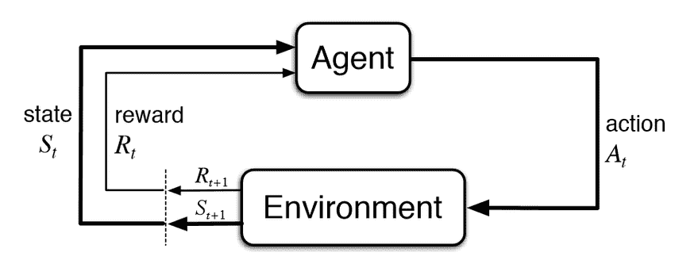
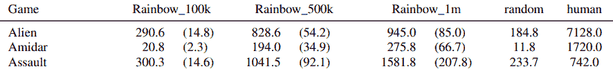
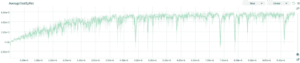
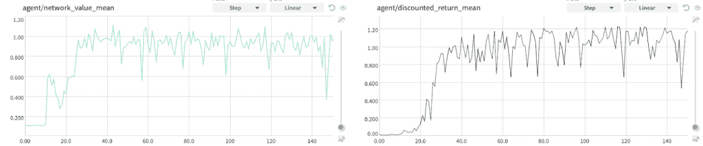
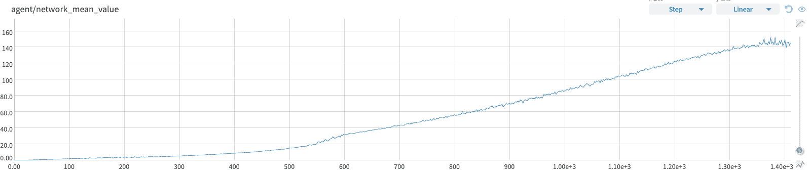
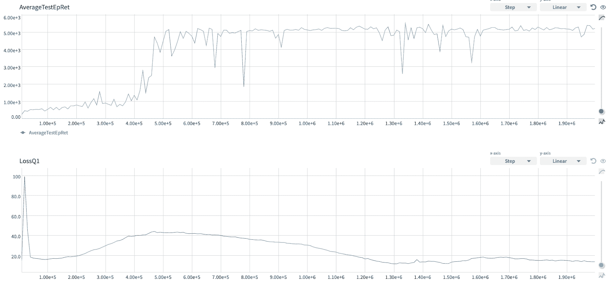
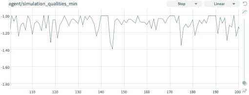
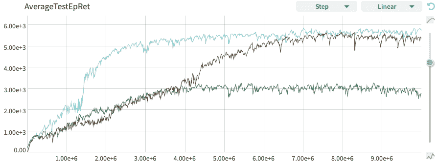

# 如何理解强化学习代理？在培训和调试过程中，我记录了什么，为什么要记录

> 原文：<https://web.archive.org/web/https://neptune.ai/blog/reinforcement-learning-agents-training-debug>

基于简单地观察一个代理在环境中的行为，很难说出它为什么这样做以及它在内部是如何工作的。这就是为什么建立指标来说明为什么代理以某种方式执行是至关重要的。

这很有挑战性，尤其是当**代理不按照我们希望的方式运行的时候……就像总是**。每个人工智能从业者都知道，无论我们做什么，大多数时候都不会简单地开箱即用(否则他们不会给我们这么多钱)。

在这篇博文中，你将学习**如何跟踪检查/调试你的代理学习轨迹**。我假设你已经熟悉强化学习(RL)代理环境设置(见图 1)，并且你至少听说过一些最常见的 RL [算法](https://web.archive.org/web/20230101212153/https://spinningup.openai.com/en/latest/user/algorithms.html)和[环境](https://web.archive.org/web/20230101212153/https://gym.openai.com/envs/#atari)。

然而，如果你刚刚开始你的 RL 之旅，不要担心。我试着不太依赖读者的先验知识，在不能省略某些细节的地方，我会引用有用的资料。

*Figure 1: The Reinforcement Learning framework (Sutton & Barto, 2018).*

我将从**讨论**有用的**指标**开始，这些指标让我们对代理的培训和决策过程有所了解。

然后，我们将重点关注这些指标的**汇总统计数据，如 average，这将帮助我们分析代理在整个培训过程中播放的许多剧集。这些将有助于解决代理出现的任何问题。**

在每一步，我都会根据自己在 RL 研究中的经验提出建议。让我们直接开始吧！

## 我用来检查 RL 代理培训的指标

有多种类型的指标可以遵循，每一种都为您提供了关于模型性能的不同信息。因此，研究人员可以获得有关…的信息

### **…代理表现如何**

在这里，我们将进一步了解诊断代理整体性能的三个指标。

#### **剧集回归**

这是我们最关心的。整个代理培训都是为了达到**可能的最高预期回报**(见图 2)。如果这一指标在整个培训过程中不断上升，这是一个好迹象。

*图二:[RL 问题](https://web.archive.org/web/20230101212153/https://spinningup.openai.com/en/latest/spinningup/rl_intro.html#the-rl-problem)。找一个使目标 J 最大化的政策π，目标 J 是环境动态 p 下的期望收益 E[R]，τ是代理人(或其政策π)所玩的轨迹。*

然而，当我们知道期望什么样的回报，或者什么是好的分数时，它对我们更有用。

这就是为什么你应该**总是寻找基线**，别人的结果在你工作的环境中，把你的结果和他们比较。

随机代理基线通常是一个良好的开端，它允许您重新校准，感受环境中什么是真正的“零”分，即您只需简单地使用控制器即可获得的最小回报(见图 3)。

*Figure 3\. Table 3 from the [SimPLe](https://web.archive.org/web/20230101212153/https://arxiv.org/pdf/1903.00374.pdf) paper with their results on Atari environments compared to many baselines alongside the random agent and human scores.*

#### **剧集长度**

这是一个结合剧集回归进行分析的有用指标。它告诉我们，如果我们的代理人能够生存一段时间前终止。在 MuJoCo 环境中，不同的生物学习走路(见图 4)，它会告诉你，例如，你的代理人是否在翻转和重置到剧集开始之前做了一些动作。

#### **求解速率**

又一个分析剧集回归的指标。如果你的环境有一个**被解决的概念**，那么检查它能解决多少集是有用的。例如，在推箱子游戏中(见图 5 ),将一个箱子推到目标上可以获得部分奖励。也就是说，只有当所有箱子都在目标上时，房间才被解决。

*图 5。推箱子是一个运输难题，玩家必须将房间中的所有箱子推到存储目标上。*

因此，代理有可能有一个积极的情节回报，但仍然没有完成要求它解决的任务。

另一个例子是谷歌研究足球(见图 6)及其学院。朝着对手的目标移动会有一些部分奖励，但学院插曲(例如在较小的小组中练习反击情况)只有在代理人的团队进球时才被视为“解决”。

### **…训练进度**

有多种方法来表示“时间”的概念，以及用什么来衡量 RL 中的进度。以下是前四名。

#### **总环境步骤**

这个简单的指标告诉您**在环境步骤或时间步骤方面，代理已经收集了多少经验**。这通常比休息时间更能说明训练进度(步数)，休息时间在很大程度上取决于您的机器模拟环境和在神经网络上进行计算的速度(见图 6)。

*Figure 7\. DDPG training on the MuJoCo Ant environment. Both runs took 24h, but on different machines. One did ~5M steps and the other ~9.5M. For the latter, it was enough time to converge. For the former not and it scored worse.*

此外，我们还报告了最终的代理分数，以及训练它需要多少环境步骤(通常称为样本)。**分数越高，样本越少，代表样本效率越高。**

#### **训练步骤**

我们用随机梯度下降(SGD)算法训练神经网络(参见[深度学习书籍](https://web.archive.org/web/20230101212153/http://www.deeplearningbook.org/))。

**训练步骤指标告诉我们对网络进行了多少次批量更新**。当从非策略重放缓冲区进行训练时，我们可以将其与总的环境步骤进行匹配，以便更好地理解平均来说，来自环境的每个样本被显示给网络多少次以从中学习:

*批量规模*培训步骤/总环境步骤=批量规模/首次展示长度*

其中 *rollout length* 是我们在训练步骤之间的数据收集阶段(当数据收集和训练按顺序运行时)平均收集的新时间步数。

上述比率，有时称为训练强度，**不应该低于 1** ，因为这将意味着一些样本甚至一次也没有显示给网络！其实应该远高于 1，比如 256(比如 [DDPG](https://web.archive.org/web/20230101212153/https://docs.ray.io/en/latest/rllib-algorithms.html#deep-deterministic-policy-gradients-ddpg-td3) 的 RLlib 实现中设置的，找“训练强度”)。

#### **墙壁时间**

这只是告诉我们**实验运行了多长时间**。

在计划未来我们需要多少时间来完成每个实验时，这是很有用的:

*   2-3 个小时？
*   通宵吗？？
*   或者几天？？？
*   整整一周？！？！？！

是的，有些实验可能需要在你的电脑上花上整整一周的时间来完全收敛或训练到你所使用的方法能达到的最大单集回报率。

令人欣慰的是，在开发阶段，较短的实验(几个小时，最多 24 小时)在大多数情况下足以简单地判断代理是否有效，或者测试一些改进想法。

> *注意，你总是想以这样一种方式来计划你的工作，当你在做其他事情时，比如编码、阅读、写作、思考等，一些实验在后台运行。*

这就是为什么一些只用于运行实验的专用工作站可能是有用的。

#### **每秒步数**

**代理每秒执行多少环境步骤**。这个值的平均值允许您计算运行一些环境步骤需要多少时间。

### **…代理在想什么/做什么**

最后，让我们看看代理人的大脑内部。在我的研究中——根据项目的不同——我使用价值函数和政策熵来了解正在发生的事情。

#### **状态/动作值功能**

Q-learning 和 actor-critic 方法利用了[价值函数](https://web.archive.org/web/20230101212153/https://spinningup.openai.com/en/latest/spinningup/rl_intro.html#value-functions) (VFs)。

查看**他们预测的值来检测一些异常是有用的，并查看代理如何评估其在环境**中的可能性。

在最简单的情况下，我在每集的时间步长记录网络状态值估计，然后在整个剧集中对它们进行平均(下一节将详细介绍)。随着更多的训练，这一指标应开始与记录的发作返回相匹配(见图 7 ),或更经常地，与用于训练 VF 的打折发作返回相匹配。如果没有，那就是一个不好的迹象。

*Figure 8\. An experiment on the Google Research Football environment. With time, as the agent trains, the agent’s value function matches the episode return mean.*

此外，在 VF 值图表上，我们可以看到是否需要一些额外的数据处理。

例如，在 Cart Pole 环境中，一个代理在它倒下并死去之前，每一个时间步长都会得到 1 的奖励。剧集回归很快就到了几十上百的量级。VF 网络的初始化方式是在训练开始时输出 0 附近的小值，很难捕捉到这个范围的值(见图 8)。

这就是为什么在用它训练之前需要一些额外的**返回标准化**。最简单的方法是简单地除以可能的最大回报，但不知何故我们可能不知道什么是最大回报，或者根本没有最大回报(例如，参见[穆泽罗](https://web.archive.org/web/20230101212153/https://arxiv.org/pdf/1911.08265.pdf)论文中的 Q 值归一化，附录 B–备份)。

*Figure 9\. An experiment on the Cart Pole environment. The value function target isn’t normalized and it has a hard time catching up with it.*

我将在下一节讨论一个例子，当这个特殊的度量结合极端聚合帮助我检测代码中的一个 bug 时。

#### **政策熵**

因为一些 RL 方法利用了随机策略，所以我们可以计算它们的熵:**它们有多随机**。即使使用确定性策略，我们也经常使用ε-贪婪探索策略，我们仍然可以计算它的熵。

策略熵 H 的等式，其中 a 是动作，p(a)是动作概率。
最大熵值等于 ln(N)，其中 N 是动作的个数，表示策略随机统一选择动作。最小熵值等于 0，这意味着总是只有一个动作是可能的(有 100%的概率)。

如果您观察到代理策略的**熵快速下降，这是一个不好的迹象**。这意味着你的代理很快停止探索。如果你使用随机策略，你应该考虑一些熵正则化方法(例如[软演员评论家](https://web.archive.org/web/20230101212153/https://spinningup.openai.com/en/latest/algorithms/sac.html))。如果您使用确定性策略和ε-贪婪探索性策略，可能您对ε衰变使用了过于激进的调度。

### **…训练进展如何**

最后，但同样重要的是，我们有一些更标准的深度学习指标。

#### **KL 发散**

像[Vanilla Pol](https://web.archive.org/web/20230101212153/https://spinningup.openai.com/en/latest/algorithms/vpg.html)[I](https://web.archive.org/web/20230101212153/https://spinningup.openai.com/en/latest/algorithms/vpg.html)[cy Gradient](https://web.archive.org/web/20230101212153/https://spinningup.openai.com/en/latest/algorithms/vpg.html)(VPG)这样的基于策略的方法在从当前策略中采样的一批经验上训练(它们不使用任何带有经验的重放缓冲器来训练)。

这意味着**我们所做的对我们所学的有很大的影响**。如果你把学习率设置得太高，那么近似梯度更新可能会在某些看似有希望的方向上迈出太大的步伐，这可能会把代理推入状态空间的更差区域。

因此，代理将比更新前做得更差(参见图 9)！这就是为什么我们需要监控新旧政策之间的差异。它可以帮助我们，例如设定学习率。

*图 10。VPG 在车杆环境下的训练。在 y 轴上，我们有一集的长度(在这个环境中它等于一集的回报)。橙色线是分数的滑动窗口平均值。左图，学习率太大，训练不稳定。右图中，学习率被适当微调(我用手找到的)。*

[KL 散度](https://web.archive.org/web/20230101212153/https://machinelearningmastery.com/divergence-between-probability-distributions/)是两个分布之间距离的度量。在我们的例子中，这些是动作分布(策略)。我们不希望我们的政策在更新前后有太大差异。还有像 [PP](https://web.archive.org/web/20230101212153/https://spinningup.openai.com/en/latest/algorithms/ppo.html) [O](https://web.archive.org/web/20230101212153/https://spinningup.openai.com/en/latest/algorithms/ppo.html) 这样的方法，对 KL 散度进行约束，根本不允许太大的更新！

#### **网络权重/梯度/激活直方图**

记录每层的激活、梯度和权重直方图可以帮助您监控人工神经网络训练动态。您应该寻找以下迹象:

*   垂死的 ReLU:
    如果一个 ReLU 神经元在正向传递中被箝位到零，那么它在反向传递中就不会得到梯度信号。甚至可能发生的情况是，由于不恰当的初始化或训练期间的过大更新，一些神经元对于任何输入都不会兴奋(返回非零输出)。
    “有时，你可以通过一个训练过的网络转发整个训练集<，即 RL >中的重放缓冲区，然后发现你的神经元中有很大一部分(例如 40%)一直为零。”~ [是的，你应该了解安德烈·卡帕西的背景](https://web.archive.org/web/20230101212153/https://medium.com/@karpathy/yes-you-should-understand-backprop-e2f06eab496b)
*   消失或爆炸渐变:
    **渐变更新的非常大的值可以指示爆炸渐变**。渐变剪辑可能会有所帮助。
    另一方面，梯度更新的非常低的值可以指示消失的梯度。使用 [ReLU 激活](https://web.archive.org/web/20230101212153/https://adventuresinmachinelearning.com/vanishing-gradient-problem-tensorflow/)和 [Glorot 统一初始化器](https://web.archive.org/web/20230101212153/https://towardsdatascience.com/weight-initialization-in-neural-networks-a-journey-from-the-basics-to-kaiming-954fb9b47c79)(又名 Xavier 统一初始化器)应该有所帮助。
*   消失或爆炸激活:
    激活的良好标准偏差在 0.5 到 2.0 的数量级。明显超出此范围可能表明**消失或激活**爆炸，这反过来可能导致梯度问题。尝试分层/批量标准化，以控制您的激活分布。

一般来说，层权重(和激活)的分布接近正态分布(没有太多异常值的零附近的值)是健康训练的标志。

以上提示应该有助于您通过培训保持网络健康。

#### **政策/价值/质量/…头损失**

即使我们优化了一些损失函数来训练一个代理，你也应该知道这不是一个典型意义上的损失函数。具体来说，它不同于监督学习中使用的损失函数。

我们优化了图 2 中的目标。为此，在策略梯度方法中，您[推导出该目标](https://web.archive.org/web/20230101212153/https://spinningup.openai.com/en/latest/spinningup/rl_intro3.html#deriving-the-simplest-policy-gradient)的梯度(称为策略梯度)。然而，因为 TensorFlow 和其他 DL 框架是围绕自动梯度构建的，所以您[定义了一个 s](https://web.archive.org/web/20230101212153/https://spinningup.openai.com/en/latest/spinningup/rl_intro3.html#implementing-the-simplest-policy-gradient) [u](https://web.archive.org/web/20230101212153/https://spinningup.openai.com/en/latest/spinningup/rl_intro3.html#implementing-the-simplest-policy-gradient) [rrogate 损失函数](https://web.archive.org/web/20230101212153/https://spinningup.openai.com/en/latest/spinningup/rl_intro3.html#implementing-the-simplest-policy-gradient)，在其上运行自动梯度后，产生的梯度等于策略梯度。

请注意，数据分布取决于策略，并随着训练而变化。这意味着**损失函数不必为了训练继续进行而单调减少**。当代理发现状态空间的一些新区域时，它有时会增加(参见图 10)。

*Figure 11\. SAC training on the MuJoCo Humanoid environment. When the episode return starts to go up (our agent learns successfully), the Q-function loss goes up too! It starts to go down again after some time.*

而且，它并不能衡量代理人的表现！经纪人的**真实表现是一集回归**。记录损失作为健全检查是有用的。但是，不要把你对训练进度的判断建立在这上面。

## 汇总统计数据

当然，对于一些度量标准(比如状态/行动值)，为每个实验的每个环境时间步长记录它们是不可行的。通常，你会计算每一集或几集的统计数据。

对于其他指标，我们处理随机性(例如，当环境和/或政策是随机的时，事件返回)。因此，我们必须使用抽样来估计预期的度量值(样本=事件返回案例中的一个代理事件)。

在任何一种情况下，聚合统计都是解决方案！

### **平均值和标准偏差**

当您处理**随机环境**(例如，《吃豆人》中的幽灵随机行动)和/或**您的策略随机采取行动**(例如 VPG 的随机策略)时，您应该:

*   播放多集(10-20 集应该可以)，
*   他们的平均指标，
*   记录这个平均值和标准偏差。

与简单的一集相比，平均值将更好地估计真实的预期回报，标准差为您提供了播放多集时指标变化的提示。

方差太大，你应该取更多的样本进行平均(播放更多的剧集)或者使用平滑技术，如[指数移动平均](https://web.archive.org/web/20230101212153/https://www.datacamp.com/community/tutorials/moving-averages-in-pandas)。

### **最小/最大值**

在寻找 bug 时**检查极端情况真的很有用。我用例子来讨论一下。**

我和我的代理在 Google Research Football 上进行实验，使用当前时间步长的随机展开来计算动作质量，我注意到这些动作质量的一些奇怪的最小值。

平均统计值是有意义的，但是具有最小值的东西是不好的。它们低于合理的最小值(低于负 1，见图 11)。

*Figure 12\. The mean qualities are all above zero. The minimum qualities are very often below minus one, which is lower than should be possible.*

经过一番挖掘，我发现我使用了 *np.empty* 来创建一个动作质量数组。

*np.empty* 是实现 *np.zeros* 的一种奇特方式，它分配内存，但并不初始化 NumPy 数组。

因此，有时一些操作会更新来自未被擦除的已分配内存位置的分数(覆盖数组中的初始值)!

我把 *np.empty* 改成了 *np.zeros* ，问题就解决了。

### **中位数**

同样的想法，我们用平均随机事件，可以适用于整个培训！

我们知道，深度学习使用的算法叫做*随机*梯度下降。它是随机的，因为我们随机抽取训练样本，然后分批打包。这意味着**多次进行一项训练会产生不同的结果。**

你应该总是用不同的种子(伪随机数发生器初始化)运行你的训练多次，并且**报告这些运行的中间值，以确保分数不是那么高或那么低，仅仅是偶然的**。

*Figure 13\. SAC training on the MuJoCo Ant environment. All runs have the same hyper-parameters, only different seeds. Three runs, three results.*

[深度强化学习还没有起作用](https://web.archive.org/web/20230101212153/https://www.alexirpan.com/2018/02/14/rl-hard.html)所以你的代理可能无法训练任何东西，即使你的实现是正确的。它可能只是偶然失败，例如，由于不幸的初始化(见图 12)。

## 结论

现在您知道了**您应该记录**的内容和原因，以便全面了解代理培训流程。此外，您知道在这些日志中要寻找什么，甚至知道如何处理常见问题。

在我们结束之前，请再看一下图 12。我们看到，训练曲线虽然不同，但遵循相似的路径，甚至三分之二收敛到相似的结果。知道这意味着什么吗？

敬请关注以后的帖子！