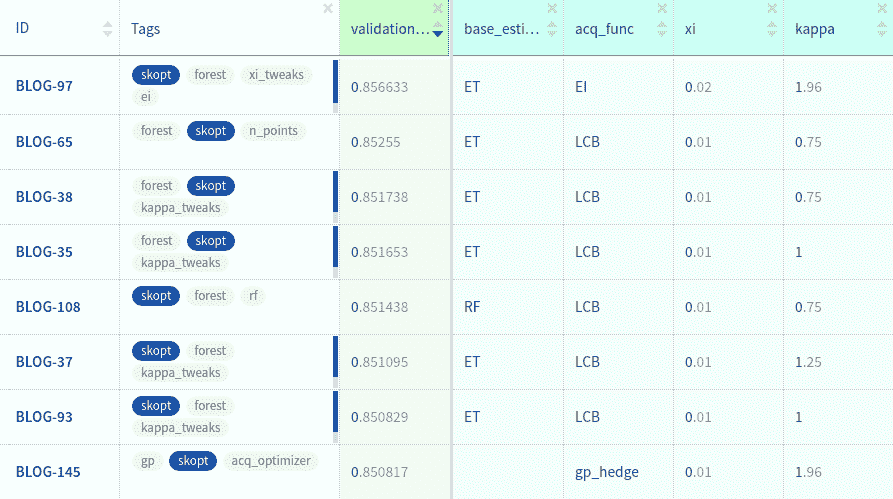

# scikit Optimize:Python 中的贝叶斯超参数优化

> 原文：<https://web.archive.org/web/https://neptune.ai/blog/scikit-optimize>

需要调整机器学习模型的超参数，但不想手动完成？

正在考虑执行贝叶斯超参数优化，但您不确定具体如何操作？

听说过各种超参数优化库，想知道 [Scikit Optimize](https://web.archive.org/web/20221008042213/https://scikit-optimize.github.io/) 是否是适合您的工具？

你来对地方了。

在本文中，我将:

*   向您展示一个使用 skopt 在实际问题上运行贝叶斯超参数优化的**示例，**
*   **根据 API、速度和实验结果等各种标准评估该库**，
*   给你我的**总评分和何时使用的建议**。

我们开始吧，好吗？

## 评定标准

## 易用性和 API

API 太棒了。它是如此简单，以至于你几乎不用看文档就能猜到。说真的，让我给你看看。

您定义搜索空间:

```py
SPACE = [
   skopt.space.Real(0.01, 0.5, name='learning_rate', prior='log-uniform'),
   skopt.space.Integer(1, 30, name='max_depth'),
   skopt.space.Integer(2, 100, name='num_leaves'),
   skopt.space.Integer(10, 1000, name='min_data_in_leaf'),
   skopt.space.Real(0.1, 1.0, name='feature_fraction', prior='uniform'),
   skopt.space.Real(0.1, 1.0, name='subsample', prior='uniform')]
```

您定义想要最小化的目标函数(修饰它，以保留参数名称):

```py
@skopt.utils.use_named_args(SPACE)
def objective(**params):
    all_params = {**params, **STATIC_PARAMS}
    return -1.0 * train_evaluate(X, y, all_params)
```

并运行优化:

```py
results = skopt.forest_minimize(objective, SPACE, **HPO_PARAMS)

```

就是这样。您需要的所有信息，比如每次迭代的最佳参数或分数，都保存在 results 对象中。这里是一个完整脚本的例子，带有一些额外的附加功能。

超级简单的设置和直观的 API。

> **10 / 10**

* * *

## 选项、方法和(超级)参数

### 搜索空间

对于超参数搜索空间，您可以从三个选项中进行选择:

*   *空间。实数*-浮点参数由(a，b)范围内的均匀对数均匀采样，
*   *空间。整数*-整数参数从(a，b)范围内均匀采样，
*   *空间。分类*-用于分类(文本)参数。将从选项列表中抽取一个值。例如，如果你正在训练 lightGBM，你可以通过['gbdt '，' dart '，' goss']。

没有对嵌套搜索空间的支持，嵌套搜索空间考虑了超参数的一些组合完全无效的情况。有时候真的很方便。

### 优化方法

有四种优化算法可以尝试。

**dummy_minimize**

您可以对参数进行简单的随机搜索。这里没有什么特别的，但是如果需要的话，在同一个 API 中使用这个选项进行比较是很有用的。

**forest_minimize 和 gbrt_minimize**

这两种方法以及下一节中的方法都是贝叶斯超参数优化的例子，也称为基于序列模型的优化 SMBO。这种方法背后的思想是用[随机森林](/web/20221008042213/https://neptune.ai/blog/random-forest-regression-when-does-it-fail-and-why)、额外的树或者梯度增强树**回归量**来**估计**用户定义的**目标函数** **。**

在目标函数上每次运行超参数后，算法进行**有根据的猜测，哪组超参数最有可能提高分数**，并且应该在下一次运行中尝试。它是通过获得许多点(超参数集)上的回归预测，并根据所谓的获取函数选择最佳猜测点来完成的。

有许多采集功能选项可供选择:

*   ***EI 和 PI*** :负预期改善和负概率改善。如果你选择其中一个，你也应该调整***【Xi】***参数。基本上，当您的算法寻找下一组超参数时，您可以决定您愿意在实际目标函数上尝试的预期改进有多小。该值越高，回归变量预期的改善(或改善概率)就越大。
*   ***【LCB】***:置信下限。在这种情况下，你要谨慎选择你的下一个点，限制下行风险。你可以决定每次跑步要冒多大的风险。通过使***κ***参数变小，你倾向于**利用**你所知道的，通过使其变大，你倾向于**探索**搜索空间。

还有选项***【EIPS】***和 ***PIPS*** 考虑到目标函数产生的分数和执行时间，但我没有尝试过

**gp_minimize**

不使用树形回归，目标函数由高斯过程近似。

从用户的角度来看，这种方法的附加价值是，你可以让算法在每次迭代中选择 EI、PI 和 LCB 中最好的一个，而不是事先决定一个采集函数。只需将采集功能设置为 *gp_hedge* 并试用即可。

还有一点要考虑的是每次迭代使用的**优化方法**、*采样*或 *lbfgs* 。对于这两者，采集函数是在搜索空间中随机选择的点数( *n_points* )上计算的。如果进行采样，则选择具有最低值的点。如果您选择 *lbfgs* ，该算法将从一些(n _ restarts _ optimizer)最佳的、随机尝试的点中选取，并将从每个点开始运行 *lbfgs* 优化。所以如果你不在乎执行时间，基本上 *lbfgs* 方法只是对采样方法的一个改进。

### 回收

我真的很喜欢有一个通过回调的简单选项。例如，我可以通过简单地添加 3 行代码来监控我的训练:

```py
def monitor(res):
    neptune.send_metric('run_score', res.func_vals[-1])
    neptune.send_text('run_parameters', 
                      str(to_named_params(res.x_iters[-1])))
...
results = skopt.forest_minimize(objective, SPACE, 
                                callback=[monitor], **HPO_PARAMS)
```

您可以使用此选项的其他事情是，在每次迭代中提前停止或保存结果。

* * *

请注意，由于最近的 [API 更新](/web/20221008042213/https://neptune.ai/blog/neptune-new)，这篇文章也需要一些改变——我们正在努力！与此同时，请检查[海王星文档](https://web.archive.org/web/20221008042213/https://docs.neptune.ai/)，那里的一切都是最新的！🥳

* * *

### 持续和重新启动

有*目的转储*和*目的加载*函数处理*结果*对象的保存和加载；

```py
results = skopt.forest_minimize(objective, SPACE, **HPO_PARAMS)
skopt.dump(results, 'artifacts/results.pkl')
old_results = skopt.load('artifacts/results.pkl')
```

您可以通过 *x0* 和 *y0* 参数从保存的结果重新开始训练。例如:

```py
results = skopt.forest_minimize(objective, SPACE,
                                x0=old_results.x_iters,
                                y0=old_results.func_vals,
                                **HPO_PARAMS)
```

简单和工程没有问题。

总的来说，有很多调整(超)超参数的选项，您可以通过回调来控制训练。另一方面，您只能在平坦的空间中搜索，并且您需要自己处理那些被禁止的参数组合。

> **2010 年 7 月**

* * *

## 证明文件

一件艺术品。

它有很多例子，所有函数和方法的文档字符串。我只花了几分钟就进入了最佳状态，并把事情做好了。

去[文档网页](https://web.archive.org/web/20221008042213/https://scikit-optimize.github.io/)自己看。

它可以更好一点，在 docstrings 中有更多的解释，但总体体验非常好。

> **9 / 10**

* * *

## 形象化

这是这个图书馆我最喜欢的特色之一。在 *skopt.plots* 模块中有三个绘图工具，我非常喜欢:

*   *plot _ convergence*-它通过显示每次迭代的最佳结果来可视化您的优化进度。

```py
import skopt.plots

skopt.plots.plot_convergence(results)
```

它的酷之处在于，你可以通过简单地传递一个 *results* 对象列表或者一个(name，results)元组的**列表来比较许多策略的进展。**

```py
results = [('random_results', random_results),
           ('forest_results', forest_results),
           ('gbrt_results', gbrt_results),
           ('gp_results', gp_results)]

skopt.plots.plot_convergence(*results)
```

*   这个图让你看到搜索的发展。对于每个超参数，我们可以看到探测值的直方图。对于每一对超参数，采样值的散点图用颜色表示，从蓝色到黄色。

例如，当我们查看**随机搜索策略**时，我们可以看到没有进化。它只是随机搜索:

但是对于*forest _ minimize***策略，**我们可以清楚地看到，它收敛到它探索得更多的空间的某些部分。

*   *plot _ objective*-它让你获得对超参数的分数敏感度的直觉。您可以决定空间的哪些部分可能需要更细粒度的搜索，以及哪些超参数几乎不影响分数，并且可能会从搜索中删除。

总的来说，可视化非常好。

> **10 / 10**

* * *

### 注意:

我非常喜欢它，所以我创建了一组函数来帮助不同 HPO 库之间的转换，这样你就可以对每个库使用这些可视化。我已经把它们放在了 neptune-contrib 包中，你可以查看一下。

## 速度和并行化

每个优化函数都带有 *n_jobs* 参数，该参数被传递给 *base_estimator* 。这意味着，即使优化运行按顺序进行，您也可以通过利用更多的资源来加速每次运行。

我还没有为所有的优化方法和 n_jobs 运行一个合适的计时基准。然而，因为我记录了所有实验的总执行时间，所以我决定给出我运行的所有实验的平均时间:

显然，**随机搜索方法是最快的**，因为它在两次运行之间不需要任何计算。其次是**梯度增强树回归器**和**随机森林方法**。通过**优化高斯过程是最慢的**，但我只测试了 *gp_hedge* 采集函数，这可能就是原因。

因为没有在运行级别上，在一个工人集群上分配它的选项，所以我必须拿走几个点。

> **2010 年 6 月**

* * *

## 实验结果

作为一个例子，让我们在一个表格，**二元分类**问题上调整 **lightGBM** 模型的超参数。如果您想像我一样使用相同的数据集，您应该:

为了让训练更快，我将**的助推轮数固定为 300，并提前 30 轮停止**。

```py
import lightgbm as lgb
from sklearn.model_selection import train_test_split

NUM_BOOST_ROUND = 300
EARLY_STOPPING_ROUNDS = 30

def train_evaluate(X, y, params):
    X_train, X_valid, y_train, y_valid = train_test_split(X, y, 
                                                          test_size=0.2, 
                                                          random_state=1234)

    train_data = lgb.Dataset(X_train, label=y_train)
    valid_data = lgb.Dataset(X_valid, label=y_valid, reference=train_data)

    model = lgb.train(params, train_data,
                      num_boost_round=NUM_BOOST_ROUND,
                      early_stopping_rounds=EARLY_STOPPING_ROUNDS,
                      valid_sets=[valid_data], 
                      valid_names=['valid'])

    score = model.best_score['valid']['auc']
    return score
```

所有的训练和评估逻辑都放在 **train_evaluate** 函数中。我们可以**将其视为一个黑盒**，它获取数据和超参数集并生成 AUC 评估分数。

### 注意:

你可以把每一个以参数为输入，输出分数的脚本都变成这样的 **train_evaluate。**完成后，您可以将其视为一个黑盒，并调整您的参数。

要根据一组参数训练模型，您可以运行如下内容:

```py
import pandas as pd

N_ROWS=10000
TRAIN_PATH = '/mnt/ml-team/minerva/open-solutions/santander/data/train.csv'

data = pd.read_csv(TRAIN_PATH, nrows=N_ROWS)
X = data.drop(['ID_code', 'target'], axis=1)
y = data['target']

MODEL_PARAMS = {'boosting': 'gbdt',
                'objective':'binary',
                'metric': 'auc',
                'num_threads': 12,
                'learning_rate': 0.3,
                }

score = train_evaluate(X, y, MODEL_PARAMS)
print('Validation AUC: {}'.format(score))
```

对于这项研究，我将尝试在 **100 次运行预算**内找到最佳参数。

如果你**在超参数**上随机搜索**，你可以得到 0.864** ，正如我在这个 [ml 实验](https://web.archive.org/web/20221008042213/https://ui.neptune.ai/jakub-czakon/blog-hpo/e/BLOG-90/logs)中所示。

为了找到最佳模型，我尝试了来自[选项、方法和 hyper(超参数)](/web/20221008042213/https://neptune.ai/blog/scikit-optimize#2)部分的优化器和 hyper(超参数)的各种配置。您也可以在这里查看示例 [skopt 参数调整](https://web.archive.org/web/20221008042213/https://ui.neptune.ai/jakub-czakon/blog-hpo/e/BLOG-90/source-code?file=search_random.py)脚本。

我总共进行了 87 次实验，让我们来看看前几项:

[](https://web.archive.org/web/20221008042213/https://ui.neptune.ai/jakub-czakon/blog-hpo/experiments?viewId=817cbbbb-103e-11ea-9a39-42010a840083&trashed=false&searchMode=simple&lbViewUnpacked=true&tags=%5B%22skopt%22%5D)

*Experiments for different skopt configurations*

如果你想更详细地探索所有这些实验，你可以简单地进入[实验仪表板](https://web.archive.org/web/20221008042213/https://ui.neptune.ai/jakub-czakon/blog-hpo/experiments?viewId=817cbbbb-103e-11ea-9a39-42010a840083&trashed=false&searchMode=simple&lbViewUnpacked=true&tags=%5B%22skopt%22%5D)。

*forest_minimize* **方法是明显的赢家**，但是为了获得好的结果，稍微调整一下(超级)超参数是至关重要的。对于 *LCB* 采集函数来说，*κ*(剥削)的值越低越好。让我们来看看这个实验的评估图:

它利用了低 *num_leaves* 子空间，但对于 *max_depth* 和 *feature_fraction* 来说，它非常具有探索性。值得一提的是，这些图在不同的实验中差别很大。这让你想知道陷入局部最小值有多容易。

然而，**最佳结果是通过 EI 采集**功能获得的。再次，调整 *xi* 参数是必要的。看这个实验的客观情节:

我觉得，通过删除一些不敏感的维度(*子样本*、*最大深度*)并对其他超参数进行更细粒度的搜索，我可能会得到更好的结果。

令我惊讶的是，当我使用 lbfgs 采集函数优化时，*gp _ minimize*的结果明显更差。他们不能打败随机搜索。将优化改为采样获得了更好的 AUC，但仍然比 *forest_minimize* 和 *gbrt_minimize* 差。去[高斯工艺实验](https://web.archive.org/web/20221008042213/https://ui.neptune.ai/jakub-czakon/blog-hpo/experiments?viewId=dc5bdd19-0ff3-4ac8-9d4a-b695545ab68d)自己看。

总的来说，我能得到的最高分是 0.8566 ，比随机搜索的 0.8464 高出 0.01。我将把它翻译成 **10 点** (0.01*100)。

> **10/10**

* * *

## 结论

让我们来看看所有标准的结果:

总的来说，**我非常喜欢 Scikit-Optimize** 。这是一个愉快的使用，给你很大的结果，和有用的可视化。此外，它有许多选项，可以用强大的文档来指导您完成它。

另一方面，很难**(如果不是不可能的话)**将它并行化运行**并分布在一个机器集群上。我认为今后，这将变得更加重要，并可能使这个库不适合某些应用程序。**

 **我的建议是，如果你不太关心速度和并行化，就使用它，但是如果这些对你的项目至关重要，就去别处看看。

### 雅各布·查肯

大部分是 ML 的人。构建 MLOps 工具，编写技术资料，在 Neptune 进行想法实验。

* * *

**阅读下一篇**

## 如何跟踪机器学习模型的超参数？

卡米尔·卡什马雷克|发布于 2020 年 7 月 1 日

**机器学习算法可通过称为超参数**的多个量规进行调整。最近的深度学习模型可以通过数十个超参数进行调整，这些超参数与数据扩充参数和训练程序参数一起创建了非常复杂的空间。在强化学习领域，您还应该计算环境参数。

数据科学家要**控制好** **超参数** **空间**，才能**使** **进步**。

在这里，我们将向您展示**最近的** **实践**，**提示&技巧，**和**工具**以最小的开销高效地跟踪超参数。你会发现自己掌控了最复杂的深度学习实验！

## 为什么我应该跟踪我的超参数？也就是为什么这很重要？

几乎每一个深度学习实验指南，像[这本深度学习书籍](https://web.archive.org/web/20221008042213/https://www.deeplearningbook.org/contents/guidelines.html)，都建议你如何调整超参数，使模型按预期工作。在**实验-分析-学习循环**中，数据科学家必须控制正在进行的更改，以便循环的“学习”部分正常工作。

哦，忘了说**随机种子也是一个超参数**(特别是在 RL 领域:例如检查[这个 Reddit](https://web.archive.org/web/20221008042213/https://www.reddit.com/r/MachineLearning/comments/76th74/d_why_random_seeds_sometimes_have_quite_large/) )。

## 超参数跟踪的当前实践是什么？

让我们逐一回顾一下管理超参数的常见做法。我们关注于如何构建、保存和传递超参数给你的 ML 脚本。

[Continue reading ->](/web/20221008042213/https://neptune.ai/blog/how-to-track-hyperparameters)

* * ***