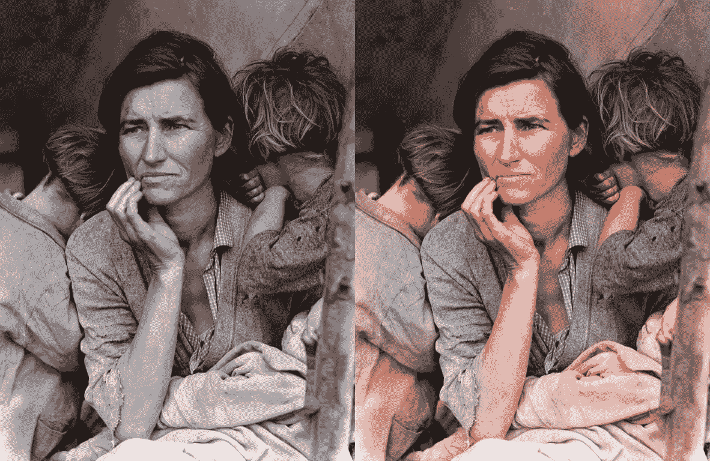
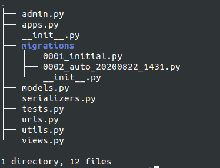
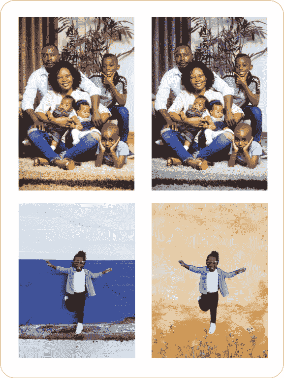
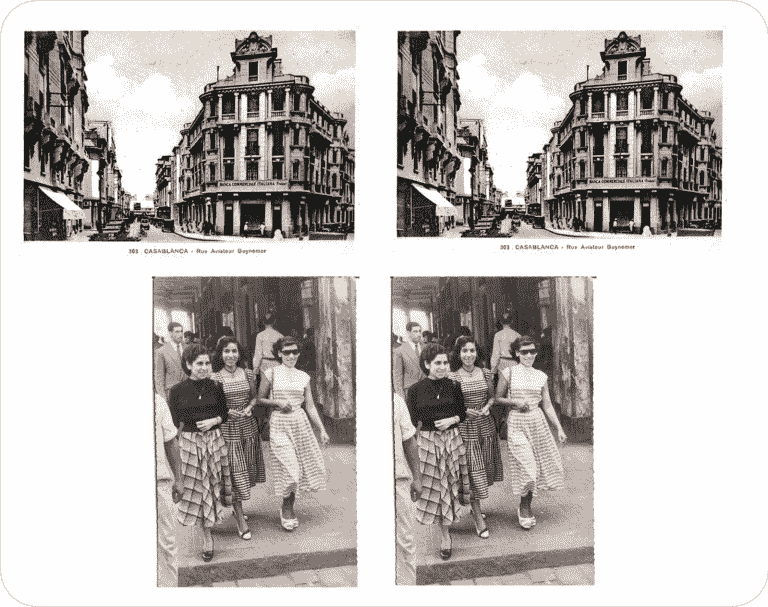

# 使用 Deoldify 和 Django API 在 IOS 应用程序中分割和着色图像

> 原文：<https://web.archive.org/web/https://neptune.ai/blog/segmenting-and-colorizing-images-in-ios-app>

[图像分割](https://web.archive.org/web/20221206013957/https://www.analyticsvidhya.com/blog/2019/04/introduction-image-segmentation-techniques-python/)属于涉及[深度物体检测](https://web.archive.org/web/20221206013957/https://machinelearningmastery.com/object-recognition-with-deep-learning/)和识别的成像领域。如果我们通过按像素分离的方式将一幅图像分成多个区域，场景中的每个对象都允许我们为需要高标准图像分析和上下文解释的任务训练复杂的深度学习模型。以这种方式训练的模型可以确定检测到的物体的形状，预测检测到的物体将进入的方向，并产生许多其他见解。

我们将通过动手开发一个处理模型服务的后端 API 和一个使用服务的小型 IOS 应用程序来学习图像分割的工作原理。

API 将由在不同阶段处理输入图像的多个视图组成。后端服务的处理逻辑就像每个视图都是负责单个功能的嵌套微服务一样运行，从背景定制到背景灰度和旧图像着色。

图像分割可以用各种技术完成，每种技术都有其优点和缺点:

| 分割技术 | 描述 | 优势 | 不足之处 |
| --- | --- | --- | --- |
|  | 

根据图像直方图峰值寻找特定阈值

 | 

最简单的方法。不需要以前的信息

 | 

空间细节考虑不周全，很大程度上取决于颜色变化和峰值

 |
|  | 

应用间断检测技术

 | 

对物体间对比度好的图像表现很好

 | 

图像中有太多边缘时不适合

 |
|  | 

同质图像分割以找到特定区域

 | 

当相似性标准可以很容易地定义时有用

 | 

在时间和空间复杂度方面相当昂贵

 |
|  | 

基于模拟的学习过程进行决策

 | 

神经网络架构，无需编写复杂程序

 | 

要求大量的训练数据

 |

有三种主要类型的图像分割:

*   **语义分割**:识别可训练对象类，*相应地分离*。
*   **实例分割**:检测每个对象类的实例数量。因此，它可以更准确地分离组件，并有助于将整个图像分解为多个标记区域，这些区域引用模型被训练的类别。
*   **全景分割**:语义和实例分割的统一版本。

我们还将看看最近的图像技术，这些技术可以准确地给旧的黑白照片上色。用于执行这种艺术任务的算法是特定的 [**生成对抗** **网络**【GANs】](/web/20221206013957/https://neptune.ai/blog/generative-adversarial-networks-gan-applications)的组合，这些网络生成与图像中存在的对象相匹配的精确颜色颜料。模型分割图像，并根据它们被训练的类别对每个像素进行着色。

我们将使用的库是[去文件夹](https://web.archive.org/web/20221206013957/https://github.com/jantic/DeOldify#about-deoldify)。他们有一个配备齐全的 Github repo，里面有很多例子和教程，可以帮助你快速入门。



*Deoldify example from their github repo | [Source](https://web.archive.org/web/20221206013957/https://github.com/jantic/DeOldify#about-deoldify)*

对于本文，我们将讨论以下内容:

*   关于图像分割的 DeepLab V3+的一些技术背景，
*   使用 DeepLab-ResNet101 的 Pytorch 实现，
*   测试 Deoldify 处理黑白图像并提出彩色版本，
*   将所有模型包装在一个 API 中为它们服务，
*   创建一个小的 IOS 应用程序来获取图像结果，
*   结论。

你可以在我的 [Github repo](https://web.archive.org/web/20221206013957/https://github.com/aymanehachcham/Background-Customization) 中查看这个项目的全部代码。

## DeepLab V3+的技术背景

### 阿特鲁空间金字塔汇集卷积

大多数分割模型使用 FCNN 作为第一处理阶段，以在对象检测阶段之前正确地放置所需的遮罩和边界。DeepLab V3+是谷歌 DeepLab 细分模型的最新和最复杂的迭代。

开发 DeepLab 的众多原因之一是它能够实现众多应用，例如在 Pixel 2 智能手机的人像模式功能中使用的[合成浅景深效果](https://web.archive.org/web/20221206013957/https://ai.googleblog.com/2017/10/portrait-mode-on-pixel-2-and-pixel-2-xl.html)。

DeepLab V3+版本包括建立在 CNN 架构主干之上的模型，但该模型主要依赖于新引入的[阿特鲁空间金字塔池卷积](https://web.archive.org/web/20221206013957/https://arxiv.org/pdf/1706.05587.pdf) (ASPP)。总体结构呈现以下阶段:

*   使用 CNN 主干提取图像特征。在我们的例子中，主干是 ResNet-101，它将识别和检测将被馈送到进一步阶段的掩模特征图。
*   控制输出的大小，使语义信息不会丢失太多。
*   在最后阶段，ASPP 对输出图像的不同像素进行分类，并通过 1×1 卷积层进行处理，以恢复正确的原始大小。

## DeepLab-ResNet101 的 PyTorch 实现

为了快速体验 DeepLab，我们将使用 PyTorch 实现，该实现提出了一个以 ResNet101 为基础的 deeplab v3 版本，该版本在 COCO 数据集上进行了预先训练，并且可以从 torchvision 包中轻松加载。

我将尽可能详细地描述编写调用模型的 Python 模块所需的不同步骤。我们将从头开始。

### 启用您的 Python 虚拟环境

使用 *virtualenv* 或 *anaconda* 为项目创建一个虚拟环境，在其中您将安装所有需要的依赖项。请记住，我们将要测试的预训练版本是基于 GPU 的。

1.下载安装 Anaconda: [网站](https://web.archive.org/web/20221206013957/https://docs.anaconda.com/anaconda/install/)

2.创建您的虚拟环境:

```py
conda create --name seg_env python=3.6

```

3.激活虚拟环境:

```py
conda activate seg_env
```

4.安装所需的库:

```py
conda install pytorch torchvision cudatoolkit=10.2 -c pytorch

pip install opencv-python

pip install numpy

pip install Pillow=2.2.1
```

### 安装验证要求

*   克隆 Deoldify Github repo 并安装 requirements.txt

https://github.com/jantic/DeOldify.git

### 实现数据加载器类

在开始编码 Python 模块来包装模型行为之前，我们需要编码一个数据加载器来处理输入图像文件。数据加载器的主要目的是预处理所有图像输入文件，将它们转换为具有特定属性和特性的高级对象，这将有助于在我们想要针对一批原始输入训练或评估模型时简化工作。

```py
class SegmentationSample(Dataset):

    def __init__(self, root_dir, image_file, device):

        self.image_file = os.path.join(root_dir, image_file)
        self.image = Image.open(self.image_file)

        if device == 'cuda' and torch.cuda.is_available():
            self.device = 'cuda'
        if device == 'cpu':
            self.device = 'cpu'

        self.preprocessing = transforms.Compose([
            transforms.ToTensor(),
            transforms.Normalize(mean=[0.485, 0.456, 0.406], std=[0.229, 0.224, 0.225])
        ])
        self.unload_tensor = transforms.ToPILImage()

        self.processed_image = self.preprocessing(self.image)
        self.processed_image = self.processed_image.unsqueeze(0).to(self.device)

    def __getitem__(self, item):
        return self.processed_image

    def print_image(self, title=None):
        image = self.image
        if title is not None:
            plt.title = title
        plt.imshow(image)
        plt.pause(5)
        plt.figure()

    def print_processed(self, title='After processing'):
        image = self.processed_image.squeeze(0).detach().cpu()
        image = self.unload_tensor(image)
        plt.title = title
        plt.imshow(image)
        plt.pause(5)
        plt.figure()
```

*   init 方法:获取 root_dir 和 image 文件，并将其转换为 Pillow image 对象，然后转换为 torch 张量。原始输入图像的像素值根据特定的平均值和标准值进行归一化。一旦所有的变换发生，我们就得到一个形状良好的量纲张量。因此，我们保证输入和模型维度完全匹配。

### 创建 Python 包装器来服务 DeepLab 模型

该模块必须初始化 deeplab-resnet101 型号版本的预训练权重。它还要求用户指定在推理期间是使用 CPU 还是 GPU 加速。

此外，该模型还将实现自定义背景的方法。

```py
class SemanticSeg(nn.Module):
    def __init__(self, pretrained: bool, device):
        super(SemanticSeg, self).__init__()
        if device == 'cuda' and torch.cuda.is_available():
            self.device = 'cuda'
        if device == 'cpu':
            self.device = 'cpu'

        self.model = self.load_model(pretrained)

    def forward(self, input: SegmentationSample):

        with torch.no_grad():
            output = self.model(input.processed_image)['out']

        reshaped_output = torch.argmax(output.squeeze(), dim=0).detach().cpu()
        return reshaped_output

    def load_model(self, pretrained=False):
        if pretrained:
            model = models.deeplabv3_resnet101(pretrained=True)
        else:
            model = models.deeplabv3_resnet101()

        model.to(self.device)
        model.eval()
        return model
```

*   `forward(self, input: SegmentationSample)`:对采样图像输入进行推理，并返回张量预测。
*   `load_model(self, pretrained=**False**)`:加载 ***Pytorch cloud*** 中的 deeplabv3_resnet101 预训练版本。将模型检查点的 ***eval*** 模式保存到相应的设备。

之后，我们将添加后处理方法来帮助在模型预测的顶部重新映射定制的背景。请记住，输出张量有 21 个通道与模型训练的每个目标类的预测结果相匹配。因此，我们需要解码张量形状以输出正确的图像结果。

```py
def background_custom(self, input_image, source, background_source,number_channels=21):

        label_colors = np.array([(0, 0, 0),  

                                 (128, 0, 0), (0, 128, 0), (128, 128, 0), (0, 0, 128), (128, 0, 128),

                                 (0, 128, 128), (128, 128, 128), (64, 0, 0), (192, 0, 0), (64, 128, 0),

                                 (192, 128, 0), (64, 0, 128), (192, 0, 128), (64, 128, 128), (192, 128, 128),

                                 (0, 64, 0), (128, 64, 0), (0, 192, 0), (128, 192, 0), (0, 64, 128)])

        r = np.zeros_like(input_image).astype(np.uint8)
        g = np.zeros_like(input_image).astype(np.uint8)
        b = np.zeros_like(input_image).astype(np.uint8)

        for l in range(0, number_channels):
            if l == 15:
                idx = input_image == l
                r[idx] = label_colors[l, 0]
                g[idx] = label_colors[l, 1]
                b[idx] = label_colors[l, 2]

        rgb = np.stack([r, g, b], axis=2)

        foreground = cv2.imread(source)
        foreground = cv2.resize(foreground, (r.shape[1], r.shape[0]))
        foreground = cv2.cvtColor(foreground, cv2.COLOR_BGR2RGB)

        background = cv2.imread(background_source, cv2.IMREAD_COLOR)
        background = cv2.resize(background, (rgb.shape[1], rgb.shape[0]), interpolation=cv2.INTER_AREA)
        background = cv2.cvtColor(background, cv2.COLOR_BGR2RGB)

        th, alpha = cv2.threshold(np.array(rgb), 0, 255, cv2.THRESH_BINARY)

        foreground = foreground.astype(float)
        background = background.astype(float)

        alpha = alpha.astype(float) / 255

        foreground = cv2.multiply(alpha, foreground)

        background = cv2.multiply(1.0 - alpha, background)

        outImage = cv2.add(foreground, background)

        return outImage / 255
```

*   `background_custom(self, input_image, source, background_source, channels=21)`:该方法采用具有高度、宽度和 21 个特征图预测[1，21，H，W]的输出张量、图像源文件的路径和背景图像文件的路径。该逻辑包括从剩余特征中仅提取人物特征图(特征 15 ),并将所有剩余特征标记为属于背景。最后，将先前标记的特征作为背景与新的图像源文件合并。

### 将 Deoldify 添加到模块中

```py
from deoldify import device
from deoldify.device_id import DeviceId
import torch
import fastai
from deoldify.visualize import *

def colorize_image(self, input_image, output_image, render_factor=35):
    torch.backends.cudnn.benchmark = True

    colorizer = get_image_colorizer(artistic=False)
    colorized_image = colorizer.get_transformed_image(input_image, render_factor, watermarked=False)
    colorized_image.save(output_image)
```

*   colorize_image(self，input_image，output_image):获取输入图像并调用 colorizer . get _ transformed _ image(input _ image)，后者运行推理并返回输出彩色图像。

## 将模型包装在一个 API 中

正如我们通常所做的那样，我们将使用 Django 来创建一个小型的 Restful API，它定义了本地托管的端点，以通过 forward POST 和 GET 调用来测试我们的模型。

通常，API 是数据库的一个窗口。API 后端处理数据库查询和响应格式化。您收到的是一个静态响应，通常是 JSON 格式的，是您请求的任何资源的静态响应。

### 让我们设置姜戈部分

安装 Django 和 Django Rest 框架:

```py
pip install django djangorestframework
```

一旦正确安装了依赖项，转到根文件夹并初始化 Django 应用程序:

```py
django-admin startproject semantic-seg
```

现在你的 Django 项目已经准备好了。剩下唯一要做的就是实例化 ***Django rest 框架*** ，并在初始项目文件夹中为它创建一个特定的文件夹。

*   启动您的 api 应用程序:python manage.py startapp api
*   将新创建的 api 文件夹的路径添加到 general settings.py 文件中:

```py
INSTALLED_APPS = [
'api.apps.ApiConfig',
'django.contrib.admin',
'django.contrib.auth',
...
]
```

API 文件夹的树结构应该如下所示:



*Tree print of the project folder structure*

一旦所有配置就绪，我们将继续对模型和序列化程序进行编码，这些模型和序列化程序将最终处理所有涉及来回请求的图像数据的事务性流程。

由于 API 将负责检索得到的修改图像，您可以利用 [Neptune 的图像记录](https://web.archive.org/web/20221206013957/https://docs.neptune.ai/you-should-know/what-can-you-log-and-display#images)系统来跟踪和记录整个模型迭代中产生的不同图像版本。

基本上，每个输出图像都可以保存在您的 Neptune 平台中，并告知模型的性能和准确性。每一次迭代都会给出更好的结果，因此你可以用一种结构化的、组织良好的方式来比较所有的结果。

关于如何在 Neptune 中记录内容的更多信息，无论是表格、图表还是图像，我强烈建议您看看我以前的文章:

检查您可以[在 Neptune](https://web.archive.org/web/20221206013957/https://docs.neptune.ai/you-should-know/what-can-you-log-and-display) 中记录和显示哪些元数据。

### 姜戈模具模块

为了简化 Django，我们正在构建一个 ML 后端的简化版本，我们可以依赖 Django 提供的 ORM 类。它们的重要性在于，我们需要第三方软件来管理和存储从 API 调用中生成的所有数据。对于我们的特殊情况，我们需要发布图像，应用模型推理来获得语义过滤器，然后恢复它们。

因此，我们需要两个主要组件:

1.  ***模型*** 表示图像对象互换的类，
2.  ***输入*** 和 ***输出*** 图像串行化器帮助将图像存储在数据库中。

#### 模特班

继承自 django.db.models.Model 类的 Python 类，定义了一组与图像对象相关的属性和特征。

*   `models.FileField`:存储图像文件的路径
*   `models.UUIDField`:为每个图像实例生成一个特定的 id
*   `models.CharField`:命名每个对象实例的方法
*   `models.DateTimeField`:保存它们被存储或更新的准确时间

```py
from django.db import models
from API.utils import get_input_image_path, get_output_image_path

class ImageSegmentation(models.Model):
    uuid = models.UUIDField(primary_key=True, default=uuid.uuid4, editable=False)
    name = models.CharField(max_length=255, null=True, blank=True)
    input_image = models.FileField(upload_to=get_input_image_path, null=True, blank=True)
    output_image = models.FileField(upload_to=get_output_image_path, null=True, blank=True)
    verified = models.BooleanField(default=False)
    created_at = models.DateTimeField(auto_now_add=True)
    updated_at = models.DateTimeField(auto_now=True)

    def __str__(self):
        return "%s" % self.name
```

编写完类的代码后，将您的更改迁移到 SQL 数据库:

```py
python manage.py makemigrations
```

```py
python manage.py migrate
```

#### 输入和输出图像串行器

用 image 对象的相应属性定义 Django 序列化程序。我们将制作两个序列化器来处理传入和传出的图像对象。

```py
class InputImageSerializer(serializers.ModelSerializer):
    class Meta:
        model = ImageSegmentation
        fields = ('uuid', 'name', )

class OutputImageSerializer(serializers.ModelSerializer):
    class Meta:
        model = ImageSegmentation
        fields = ('uuid', 'name', 'input_image', 'output_image', 'created_at', 'updated_at')
```

最后，在完成所有更改后，您需要在管理门户中注册您的新模型。只需转到 admin.py 文件并添加以下行即可:

```py
admin.site.register(ImageSegmentation)
```

### 构建 API 端点

对于 POST 请求，将有两个部分。一种方法处理背景定制，另一种方法用于着色部分。

*   ***贴背景定制*** :发送两张文件图片，原始照片，匹配背景。它处理它们并把它们保存到相应的文件夹中。

```py
@api_view(['POST'])
@never_cache
def run_inference(request):
    property_id = request.POST.get('property_id')

    images = dict((request.data).lists())['image']
    flag = 1
    arr = []
    for img_name in images:
        modified_data = modify_input_for_multiple_files(property_id,
                                                        img_name)
        file_serializer = ImageSerializer(data=modified_data)
        if file_serializer.is_valid():
            file_serializer.save()
            arr.append(file_serializer.data)
        else:
            flag = 0

    if flag == 1:
        image_path = os.path.relpath(arr[0]['image'], '/')
        bg_path = os.path.relpath(arr[1]['image'], '/')
        input_image = ImageSegmentation.objects.create(input_image=image_path, name='image_%02d' % uuid.uuid1())
        bg_image = ImageSegmentation.objects.create(input_image=bg_path, name='image_%02d' % uuid.uuid1())
        RunDeepLabInference(input_image, bg_image).save_bg_custom_output()
        serializer = OutputImageSerializer(input_image)
        return Response(serializer.data)
```

```py
@api_view(['POST'])
@never_cache
def run_grayscale_inference(request):
    file_ = request.FILES['image']
    image = ImageSegmentation.objects.create(input_image=file_, name='image_%02d' % uuid.uuid1())
    RunDeepLabInference(image).save_grayscale_output()
    serializer = OutputImageSerializer(image)
    return Response(serializer.data)
```

*   ***POST for the Colorizing de oldify model***:解析请求，提取 base64 图像字符串。对 base64 字符串进行解码，并在将其保存到输出图像文件夹之前执行彩色化滤镜。

```py
@api_view(['POST'])
@never_cache
def colorize_image(request):
    file_image = request.FILES['image']
    image = ImageSegmentation.objects.create(input_image=file_image, name='image_%02d' % uuid.uuid1())
    image_string = base64.b64decode(image)
    image_data = BytesIO(image_string)
    img = Image.open(image_data)
    img.save(INPUT_IMAGE)
    colorized_image = colorizer.get_transformed_image(file_image, render_factor=35, watermarked=False)
    colorized_image.save()
    serializer = OutputImageSerializer(image)
    return Response(serializer.data)
```

***GET 方法*** 将简单地检索我们存储在数据库中的转换后的图像，并将它们作为静态文件提供。

```py
@api_view(['GET'])
@never_cache
def get_images(request):
    property_id = request.POST.get('property_id')

    images = dict((request.data).lists())['image']
    flag = 1
    arr = []
    for img_name in images:
        modified_data = modify_input_for_multiple_files(property_id,
                                                        img_name)
        file_serializer = ImageSerializer(data=modified_data)
        if file_serializer.is_valid():
            file_serializer.save()
            arr.append(file_serializer.data)
        else:
            flag = 0

    if flag == 1:
        return Response(arr, status=status.HTTP_201_CREATED)
    else:
        return Response(arr, status=status.HTTP_400_BAD_REQUEST)
```

#### 配置 API 路由

1.在 urls.py 文件中设置 URL 模式的路径:

```py
app_name = 'api'

urlpatterns = [
    path(r'test/', views.test_api, name='test_api_communication'),
    path(r'images/', views.get_images, name='get_images'),
    path(r'inference/', views.run_inference, name='run_inference_on_images'),
    path(r'grayscale/', views.run_grayscale_inference, name='run_grayscale_inference_on_images'),
    path(r'colorize/', views.colorize_image, name='run_deoldify_colorize_filter_on_images'),
    path(r'clean/', views.clean_folders, name='clean_output_folder')
]
```

2.在 api.urls.py 文件中创建 API 端点的地址:

```py
urlpatterns = [
 path(r'test/', views.test_api, name='test_api_communication'),
 path(r'images/', views.get_images, name='get_images'),
 path(r'api/', views.run_inference, name='run_inference_on_images'),
]
```

## 构建 IOS 应用程序

总结一下，现在我们的 API 已经完美地运行了，我们需要做的就是构建一个小的 IOS 应用程序，它有两个 viewcontrollers 来上传图片并取回它们漂亮的转换版本，带有背景定制和颜色过滤。

我们最终将在应用程序界面中获得的结果类似于 API 中的这些示例:

我喜欢完全以编程方式在 Swift 中编写代码，我承认我对故事板和任何与 XML 相关的 UI 开发有一种厌恶。因此，让我们通过移除主故事板并设置 SceneDelegate.swift 文件来保持事情的简单和娱乐性。

1.  删除文件中的故事板名称
2.  相应更改 SceneDelegate 文件:

```py
func scene(_ scene: UIScene, willConnectTo session: UISceneSession, options connectionOptions: UIScene.ConnectionOptions) {
    guard let windowScene = (scene as? UIWindowScene) else { return }

    window = UIWindow(frame: windowScene.coordinateSpace.bounds)
    window?.windowScene = windowScene
    window?.rootViewController = ViewController()
    window?.makeKeyAndVisible()
}
```

### 创建入口点 ViewController

第一个 ViewController 将充当我们的应用程序的入口点。它将使用两个按钮定义基本布局，这两个按钮可以让用户拍照或从库中上传照片。

手动约束布局，避免自动布局自动元素定位。

该布局包含两个垂直对齐的按钮，顶部有一个 UIImageView 徽标。

#### 徽标图像

*   小 UIImageView 作为应用程序的徽标

```py
let logo: UIImageView = {
    let image = UIImageView(image: 
    image.translatesAutoresizingMaskIntoConstraints = false
   return image
}()
```

#### 小跟班

```py
lazy var openCameraBtn : CustomButton = {
   let btn = CustomButton()
    btn.translatesAutoresizingMaskIntoConstraints = false
    btn.setTitle("Camera", for: .normal)
    let icon = UIImage(named: "camera")?.resized(newSize: CGSize(width: 45, height: 45))
    let tintedImage = icon?.withRenderingMode(.alwaysTemplate)
    btn.setImage(tintedImage, for: .normal)
    btn.tintColor = 
    btn.addTarget(self, action: 
    return btn
}()
```

*   图片上传按钮:

```py
lazy var openToUploadBtn : CustomButton = {
   let btn = CustomButton()
    btn.addTarget(self, action: 
    btn.translatesAutoresizingMaskIntoConstraints = false
    return btn
}()
```

#### 为每个 UI 元素设置常规布局和约束

```py
fileprivate func addButtonsToSubview() {
    view.addSubview(logo)
    view.addSubview(openCameraBtn)
    view.addSubview(openToUploadBtn)
}
fileprivate func setupView() {

    logo.centerXAnchor.constraint(equalTo: self.view.centerXAnchor).isActive = true
    logo.topAnchor.constraint(equalTo: self.view.safeAreaLayoutGuide.topAnchor, constant: 20).isActive = true

    openCameraBtn.centerXAnchor.constraint(equalTo: view.centerXAnchor).isActive = true
    openCameraBtn.widthAnchor.constraint(equalToConstant: view.frame.width - 40).isActive = true
    openCameraBtn.heightAnchor.constraint(equalToConstant: 60).isActive = true
    openCameraBtn.bottomAnchor.constraint(equalTo: openToUploadBtn.topAnchor, constant: -40).isActive = true

    openToUploadBtn.centerXAnchor.constraint(equalTo: view.centerXAnchor).isActive = true
    openToUploadBtn.widthAnchor.constraint(equalToConstant: view.frame.width - 40).isActive = true
    openToUploadBtn.heightAnchor.constraint(equalToConstant: 60).isActive = true
    openToUploadBtn.bottomAnchor.constraint(equalTo: view.bottomAnchor, constant: -120).isActive = true

}
```

*   处理打开相机动作:

```py
@objc func openCamera() {
        if UIImagePickerController.isSourceTypeAvailable(.camera) {
            let imagePicker = UIImagePickerController()
            imagePicker.delegate = self
            imagePicker.sourceType = .camera
            imagePicker.allowsEditing = true
            self.present(imagePicker, animated: true, completion: nil)
        }
    }
```

*   处理从库上传操作:

```py
@objc func uploadLibrary() {
        if UIImagePickerController.isSourceTypeAvailable(.photoLibrary) {
            let imagePicker = UIImagePickerController()
            imagePicker.delegate = self
            imagePicker.sourceType = .photoLibrary
            imagePicker.allowsEditing = false
            self.present(imagePicker, animated: true, completion: nil)
        }
    }
```

*   从***UIImagePickerControllerDelegate***中覆盖***imagePickerController***:

```py
func imagePickerController(_ picker: UIImagePickerController, didFinishPickingMediaWithInfo info: [UIImagePickerController.InfoKey : Any]) {
        if let image = info[.originalImage] as? UIImage {
            let segmentationController = ImageSegmentationViewController()
            segmentationController.modalPresentationStyle = .fullScreen
            segmentationController.inputImage.image = image
            dismiss(animated: true, completion: nil)
            self.present(segmentationController, animated: true, completion: nil)

        }
    }
```

### 处理 API 回调

为了管理分段控制器中的 HTTP API 调用，我们将使用 Alamofire，这是一个广泛使用的 Swift 包，用于处理与 Swift 的优雅 HTTP 联网。用你喜欢的方法安装软件包，我用的是 CocoaPod。

POST 方法需要一个[String: String]类型的字典，键是图像，值是原始图像的 base64 格式。

实现回调的步骤如下:

1.  将 UIImage 转换为无压缩比的 base64 编码，
2.  创建将用于发送要编码的 POST 请求值的参数，
3.  用 Alamofire 请求方法执行请求，
4.  处理 API 结果，
5.  用筛选后的图像更新 UIImageView。

```py
func colorizeImages() {
    let imageDataBase64 = inputImage.image!.jpegData(compressionQuality: 1)!.base64EncodedString(options: .lineLength64Characters)
    let parameters: Parameters = ["image": imageDataBase64]

    AF.request(URL.init(string: self.apiEntryPoint)!, method: .post, parameters: parameters, encoding: JSONEncoding.default, headers: .none).responseJSON { (response) in

    switch response.result {
        case .success(let value):
                if let JSON = value as? [String: Any] {
                    let base64StringOutput = JSON["output_image"] as! String
                    let newImageData = Data(base64Encoded: base64StringOutput)
                    if let newImageData = newImageData {
                       let outputImage = UIImage(data: newImageData)
                        let finalOutputImage = outputImage
                        self.inputImage.image = finalOutputImage
                        self.colorizedImage = finalOutputImage
                    }
                }
            break
        case .failure(let error):
            print(error)
            break
        }
    }
}
```

### 结果



*Results obtained applying the background customization and gray filtering*



*Results obtained from colorize filters, transforming old black and white photographs into fully colorized ones.*
*Top left corner original photo | Source: [Old pictures Casablanca](https://web.archive.org/web/20221206013957/http://www.skyscrapercity.com/showthread.php?t=440044), bottom right original photograph | Source: [Souvenirs, Souvenirs](https://web.archive.org/web/20221206013957/http://www.darnna.com/phorum/read.php?3,15599,page=7)*

## 结论

我们已经通过图像分割进行了一次全面的旅行，一些应用程序被证明是易于实现和相当有趣的。通过我提出的这个小应用程序，我希望我已经为你的创造力增加了一点活力。

我鼓励你用同样的画布测试其他应用程序。DeepLab V3 还可以实现其他一些很酷的特性。

最后，我推荐你查阅以下参考资料: