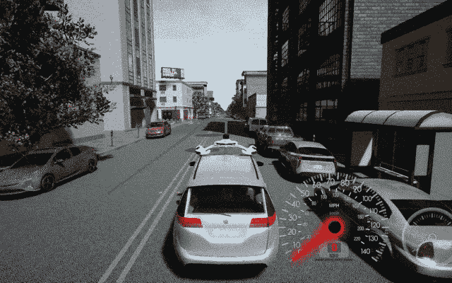

# 带有卷积神经网络(CNN)的自动驾驶汽车

> 原文：<https://web.archive.org/web/https://neptune.ai/blog/self-driving-cars-with-convolutional-neural-networks-cnn>

人类等待自动驾驶汽车已经几十年了。由于技术的飞速发展，这个想法最近从“可能”变成了“在特斯拉汽车上实现商业化”。

深度学习是实现自动驾驶的主要技术之一。这是一个多功能的工具，几乎可以解决任何问题——它可以用于物理学，例如，大型强子对撞机中的[质子-质子碰撞](https://web.archive.org/web/20221201175445/https://arxiv.org/pdf/2006.10159.pdf)，以及在[谷歌镜头](https://web.archive.org/web/20221201175445/https://lens.google/)中对图片进行分类。深度学习是一种可以帮助解决几乎任何类型的科学或工程问题的技术。

在本文中，我们将重点关注自动驾驶汽车中的深度学习算法——**卷积神经网络** (CNN)。CNN 是这些系统用来识别和分类道路的不同部分并做出适当决定的主要算法。

在这个过程中，我们将看到特斯拉、Waymo 和英伟达如何使用 CNN 算法来使他们的汽车无人驾驶或自动驾驶。

## 自动驾驶汽车是如何工作的？

第一辆自动驾驶汽车发明于 1989 年，它是神经网络 (ALVINN)中的**自动陆地车辆。它使用神经网络来检测线路，分割环境，自我导航和驾驶。它工作得很好，但是受到处理能力慢和数据不足的限制。**

如今的高性能显卡、处理器、海量数据，自驾比以往任何时候都强大。如果成为主流，将减少交通拥堵，增加道路安全。

自动驾驶汽车是自主决策系统。它们可以处理来自相机、激光雷达、雷达、GPS 或惯性传感器等不同传感器的数据流。然后，使用深度学习算法对这些数据进行建模，然后做出与汽车所处环境相关的决策。

*A modular perception-planning-action pipeline | [Source](https://web.archive.org/web/20221201175445/https://arxiv.org/pdf/1910.07738.pdf)*

上图显示了用于做出驾驶决策的模块化**感知-规划-行动**管道。这种方法的关键部分是从环境中获取数据的不同传感器。

为了理解自动驾驶汽车的工作原理，我们需要考察四个主要部分:

1.  **感知**
2.  **本地化**
3.  **预测**
4.  **决策制定**
    1.  高级路径规划
    2.  行为仲裁
    3.  运动控制器

### 感觉

自动驾驶汽车必须具备的最重要的属性之一是**感知**，它帮助汽车看到周围的世界，以及识别和分类它看到的东西。为了做出好的决策，汽车需要即时识别物体。

因此，汽车需要看到并分类红绿灯、行人、路标、人行道、停车点、车道等等。不仅如此，它还需要知道自己和周围物体的确切距离。感知不仅仅是看到和分类，它使系统能够评估距离，并决定减速或刹车。

为了实现如此高水平的感知，自动驾驶汽车必须有三个传感器:

1.  照相机
2.  激光雷达
3.  雷达

#### 照相机

摄像机为汽车提供视觉，实现多种任务，如**分类、分割、**和**定位**。相机需要高分辨率，并准确地呈现环境。

为了确保汽车接收到来自各个方向的视觉信息:前、后、左、右，摄像头被缝合在一起，以获得整个环境的 360 度视图。这些相机提供远至 200 米的宽视野，以及更集中感知的短视野。

*Self-driving car’s camera | [Source](https://web.archive.org/web/20221201175445/https://heartbeat.fritz.ai/computer-vision-at-tesla-cd5e88074376)*

在一些像停车这样的任务中，摄像头还可以提供全景视图，以便更好地做出决策。

尽管相机完成所有与感知相关的任务，但在极端条件下，如雾、大雨，尤其是晚上，它几乎没有任何用处。在极端条件下，摄像机捕捉到的只是噪音和差异，这可能会危及生命。

为了克服这些限制，我们需要既能在没有光线的情况下工作又能测量距离的传感器。

#### 激光雷达

激光雷达代表光探测和测距，这是一种通过发射激光束，然后测量它被某物反射所需时间来测量物体距离的方法。

摄像机只能给汽车提供它周围的图像。当它与激光雷达传感器结合时，它可以增加图像的深度——它突然对汽车周围的情况有了 3D 感知。

所以，激光雷达感知**空间信息**。当这些数据被输入深度神经网络时，汽车可以预测靠近它的物体或车辆的行动。这种技术在复杂的驾驶场景中非常有用，比如在多出口的十字路口，汽车可以分析所有其他汽车，并做出适当、最安全的决定。

<https://web.archive.org/web/20221201175445im_/https://neptune.ai/wp-content/uploads/2022/11/Self-driving-car-LiDAR.mp4>

*Object detection with LiDAR | [Source](https://web.archive.org/web/20221201175445/https://shangzhouye.tech/other-projects/deeplidar_detection_tracking/)* 

2019 年，埃隆·马斯克公开表示“[任何依赖激光雷达的人都注定……](https://web.archive.org/web/20221201175445/https://www.youtube.com/watch?v=HM23sjhtk4Q)”。为什么？好吧，激光雷达有可能是灾难性的局限性。例如，激光雷达传感器使用激光或光线来测量附近物体的距离。它可以在晚上和黑暗的环境中工作，但当有雨或雾的噪音时，它仍然会失败。这就是为什么我们还需要一个雷达传感器。

#### receivable accounts data-entry and retrieval system 可接受的账目数据登录及修复系统

无线电探测和测距(雷达)是许多军事和消费应用中的关键组件。它首先被军方用来探测物体。它使用**无线电波信号**计算距离。今天，它被用于许多车辆，并已成为自动驾驶汽车的主要组成部分。

雷达非常有效，因为它们使用无线电波而不是激光，所以它们在任何条件下都可以工作。

重要的是要明白雷达是噪声传感器。这意味着即使摄像头没有看到障碍物，雷达也会探测到一些障碍物。

上图显示了自动驾驶汽车(绿色)使用激光雷达检测周围的物体，并计算物体的距离和形状。对比同样的场景，但是用下面的雷达传感器捕捉到的，可以看到很多不必要的噪点。

为了做出好的决策和预测，应该对雷达数据进行清理。我们需要把弱信号和强信号分开；这被称为**阈值**。我们还使用**快速傅立叶变换** (FFT)来过滤和解释信号。

如果你看上面的下图，你会注意到雷达和激光雷达信号是基于点的数据。应该对这些数据进行分类，以便更好地解释。诸如**欧几里德聚类**或 K 均值聚类之类的聚类算法被用于实现这一任务。

### 本地化

自动驾驶汽车中的定位算法计算车辆导航时的位置和方向，这种科学称为视觉里程计(VO)。

VO 通过匹配连续视频帧中的关键点来工作。对于每一帧，关键点被用作映射算法的输入。映射算法，例如同步定位和映射(SLAM)，计算附近每个对象相对于前一帧的位置和方向，并帮助对道路、行人和周围的其他对象进行分类。

深度学习一般用于提高 VO 的性能，对不同的对象进行分类。诸如 PoseNet 和 VLocNet++的神经网络是使用点数据来估计 3D 位置和方向的一些框架。这些估计的 3D 位置和方向可用于推导场景语义，如下图所示。

### 预言；预测；预告

理解人类司机是一项非常复杂的任务。它涉及情感而非逻辑，这些都是由**反应**推动的。附近的司机或行人的下一步行动变得非常不确定，因此可以预测其他道路使用者的行动的系统对于道路安全非常重要。

这款汽车拥有 360 度的环境视角，能够感知和捕捉所有信息并进行处理。一旦输入到深度学习算法中，它就可以提出其他道路使用者可能做出的所有可能的举动。这就像一个游戏，玩家有有限的移动次数，并试图找到最好的移动来击败对手。

自动驾驶汽车中的传感器使它们能够执行图像分类、物体检测、分割和定位等任务。通过各种形式的数据表示，汽车可以预测周围的物体。

深度学习算法可以在训练过程中对这些信息(来自激光雷达和雷达的图像和云数据点)进行建模。同样的模型，但在推理过程中，可以帮助汽车为所有可能的动作做准备，包括刹车、停止、减速、变道等等。

深度学习的作用是解释复杂的视觉任务，在环境中定位自己，增强感知，并在自动驾驶汽车中启动运动学机动。这确保了道路安全和方便通勤。

但是棘手的部分是从有限的动作中选择正确的动作。

### 决策

决策在自动驾驶汽车中至关重要。他们需要一个在不确定环境中动态精确的系统。它需要考虑到，并非所有的传感器读数都是真实的，人类在驾驶时可能会做出不可预测的选择。这些东西是无法直接衡量的。即使我们可以测量它们，我们也不能准确地预测它们。

*A self-driving car moving towards an intersection | [Source](https://web.archive.org/web/20221201175445/https://ieeexplore.ieee.org/document/7995949)*

上图显示了一辆自动驾驶汽车正在向一个十字路口行驶。另一辆蓝色的车也向十字路口开去。在这种情况下，自动驾驶汽车必须预测另一辆汽车是直行、左转还是右转。在每种情况下，汽车必须决定应该采取什么样的策略来避免碰撞。

为了做出决定，汽车应该有足够的信息，以便它可以选择必要的行动。我们了解到，传感器可以帮助汽车收集信息，深度学习算法可以用于定位和预测。

概括地说，定位使汽车能够知道它的初始位置，而预测则根据环境创造出 *n* 个可能的行动或移动。问题是:在众多预测的行动中，哪一个选择是最好的？

在做决策时，我们使用深度强化学习(DRL)。更具体地说，一种被称为**马尔可夫决策过程** (MDP)的决策算法位于 DRL 的核心(我们将在后面讨论强化学习的部分了解更多关于 MDP 的知识)。

通常，MDP 用于预测道路使用者的未来行为。我们应该记住，如果对象的数量增加，尤其是移动的对象，场景会变得非常复杂。这最终增加了自动驾驶汽车本身可能的移动次数。

为了解决为自己找到最佳移动的问题，深度学习模型使用**贝叶斯优化**进行优化。也有这样的情况，由隐马尔可夫模型和贝叶斯优化组成的框架被用于决策。

一般来说，自动驾驶汽车中的决策是一个分层的过程。这个过程有四个组成部分:

*   **路径或路线规划**:从本质上讲，路线规划是汽车必须做出的四个决定中的第一个。进入环境，汽车应该计划从其当前位置到请求的目的地的最佳可能路线。想法是在所有其他解决方案中找到一个最佳解决方案。
*   **行为仲裁**:一旦规划好路线，汽车需要在路线中自行导航。汽车知道静态元素，如道路、十字路口、平均道路拥堵等，但它无法确切知道其他道路使用者在整个旅程中会做什么。其他道路使用者行为中的这种不确定性通过使用像 MDPs 这样的概率规划算法来解决。
*   **运动规划**:一旦行为层决定如何导航通过某条路线，运动规划系统就会协调汽车的运动。轿厢的运动对于乘客来说必须是可行和舒适的。运动规划包括车速、变道等等，所有这些都应该与汽车所处的环境相关。
*   **车辆控制**:车辆控制用于执行运动规划系统的参考路径。

## 用于自动驾驶汽车的 CNN

卷积神经网络(CNN)用于模拟空间信息，如图像。CNN 非常擅长从图像中提取特征，它们通常被视为通用的非线性函数逼近器。

随着网络深度的增加，CNN 可以捕捉到不同的模式。例如，网络起始处的图层将捕捉边，而深层图层将捕捉更复杂的要素，如对象的形状(树上的叶子或车辆上的轮胎)。这也是 CNN 在自动驾驶汽车中作为主要算法的原因。

CNN 的关键部分是卷积层本身。它有一个卷积内核，通常称为*滤波器矩阵*。滤波器矩阵与输入图像的局部区域进行卷积，该局部区域可以定义为:

其中:

*   运算符*表示卷积运算，
*   w 是滤波器矩阵，b 是偏置，
*   x 是输入，
*   y 是输出。

实际中滤波器矩阵的尺寸通常是 3×3 或 5×5。在训练过程中，过滤器矩阵会不断更新自己，以获得合理的权重。CNN 的属性之一就是权重是可共享的。相同的权重参数可以用于表示网络中的两种不同的变换。共享参数节省了大量的处理空间；它们可以产生由网络学习的更多样的特征表示。

CNN 的输出通常被馈送到非线性激活函数。激活函数使网络能够解决线性不可分问题，这些函数可以在低维流形中表示高维流形。常用的激活函数有 Sigmoid、Tanh 和 ReLU，如下所示:

值得一提的是，ReLU 是首选的激活函数，因为它比其他激活函数收敛得更快。除此之外，卷积层的输出由 max-pooling 层修改，max-pooling 层保留关于输入图像的更多信息，如背景和纹理。

CNN 的三个重要属性使它们变得多才多艺，成为自动驾驶汽车的主要组成部分，这三个属性是:

*   **局部感受野，**
*   **共享权重，**
*   **空间采样**。

这些属性减少了过度拟合，并存储了对图像分类、分割、定位等至关重要的表示和特征。

接下来，我们将讨论开创无人驾驶汽车的三家公司使用的三个 CNN 网络:

1.  特斯拉的 HydraNet
2.  谷歌 Waymo 的司机网
3.  英伟达自动驾驶汽车

### HydraNet——自动驾驶汽车的语义分段

HydraNet 由 [Ravi 等人于 2018 年](https://web.archive.org/web/20221201175445/https://rmullapudi.bitbucket.io/data/hydranet_cvpr_final.pdf?utm_source=Jeremy+Cohen&utm_campaign=15c163eaa1-EMAIL_CAMPAIGN_2020_07_10_08_05&utm_medium=email&utm_term=0_9a0160b0e8-15c163eaa1-)推出。它是为语义分割开发的，用于提高推理时的计算效率。

HydraNets 是动态架构，所以它可以有不同的 CNN 网络，每个分配给不同的任务。这些块或网络被称为分支。HydraNet 的想法是获取各种输入，并将其输入到特定任务的 CNN 网络中。

以自动驾驶汽车为例。一个输入数据集可以是静态环境，如树木和道路栏杆，另一个可以是道路和车道，另一个是交通灯和道路，等等。这些输入在不同的分支中被训练。在推理时间内，**门**选择运行哪些分支，合并器汇总分支输出并做出最终决定。

在特斯拉的例子中，他们稍微修改了这个网络，因为在推理过程中很难分离各个任务的数据。为了克服这个问题，特斯拉的工程师开发了一种共享主干网。共享主干通常是经过修改的 ResNet-50 块。

这个 HydraNet 是在所有对象的数据上训练的。有特定于任务的标题，允许模型预测特定于任务的输出。标题基于语义分段架构，如 U-Net。

特斯拉 HydraNet 还可以投影鸟瞰图，这意味着它可以从任何角度创建环境的 3D 视图，为汽车提供更多维度来正确导航。要知道特斯拉并没有使用激光雷达传感器。它只有两个传感器，一个摄像头和一个雷达。虽然激光雷达明确地为汽车创造了深度感知，但特斯拉的 hydranet 非常高效，它可以将其中 8 个摄像头的所有视觉信息缝合起来，创造深度感知。

### 司机网:利用模仿学习训练自动驾驶汽车

[司机网](https://web.archive.org/web/20221201175445/http://roboticsproceedings.org/rss15/p31.pdf)是谷歌 Waymo 使用的一个基于 RNN 的神经网络，然而，CNN 实际上是这里的核心组件之一，它用于从感知系统中提取特征。

司机网络中的 CNN 被描述为卷积特征网络，或特征网络，其提取由其他网络共享的上下文特征表示。然后，这些表示被输入到递归代理网络(AgentRNN ),该网络反复产生驾驶轨迹中连续点的预测。

这个网络背后的想法是使用模仿学习来训练自动驾驶汽车。在 Bansal 等人发布的论文《[司机网:通过模仿最好的，综合最差的](https://web.archive.org/web/20221201175445/https://arxiv.org/abs/1812.03079)来学习驾驶》中，他们认为，即使有 3000 万个例子，训练一辆自动驾驶汽车也是不够的。为了解决这一限制，作者在合成数据中训练了汽车。这种合成数据引入了偏差，例如对轨迹路径引入扰动、添加障碍物、引入不自然的场景等。他们发现，这样的合成数据能够比正常数据更有效地训练汽车。

通常，自驾车有一个端到端的过程，正如我们前面看到的那样，感知系统是深度学习算法的一部分，与规划和控制一起。在司机网的情况下，感知系统不是端到端过程的一部分；相反，它是一个中级系统，其中网络可以有来自感知系统的不同变化的输入。

drick net 通过观察来自传感器的场景的中级表示来产生驾驶轨迹，使用输入和合成数据来模仿专家驾驶员。

*上图中，青色路径描绘的是输入路线，绿色方框是自动驾驶汽车，蓝色圆点是智能体过去的路线或位置，绿色圆点是预测的未来路线或位置。*

从本质上来说，中级表示不直接使用原始传感器数据作为输入，排除了感知任务，因此我们可以将真实和模拟数据结合起来，以便于迁移学习。这样，网络可以创建环境的高层次鸟瞰图，最终产生更好的决策。

### 英伟达自动驾驶汽车:自动驾驶汽车的极简主义方法

英伟达也使用卷积神经网络作为其自动驾驶汽车的主要算法。但与特斯拉不同的是，它使用 3 个摄像头，一边一个，前面一个。见下图。

该网络能够在没有车道标志的道路上运行，包括停车场。它还可以学习检测有用道路特征所必需的特征和表示。

与问题的显式分解(如车道标志检测、路径规划和控制)相比，这种端到端系统同时优化了所有处理步骤。

更好的性能是内部组件自我优化以最大化整体系统性能的结果，而不是优化人工选择的中间标准，如车道检测。可以理解的是，选择这样的标准是为了便于人工解释，这并不能自动保证最大的系统性能。较小的网络是可能的，因为系统学习用最少的处理步骤来解决问题。

## 用于自动驾驶汽车的强化学习

[强化学习](/web/20221201175445/https://neptune.ai/blog/best-reinforcement-learning-tutorials-examples-projects-and-courses) (RL)是一种机器学习的类型，其中代理通过探索和与环境交互来学习。在这种情况下，自动驾驶汽车是一个**代理**。

我们之前讨论了神经网络如何根据感知数据预测一些动作。但是，选择适当的行动需要深度强化学习(DRL)。在 DRL 的核心，我们有三个重要变量:

1.  **状态**描述给定时间内的当前情况。在这种情况下，它将是道路上的一个位置。
2.  **动作**描述了汽车可能做出的所有动作。
3.  **奖励**是每当汽车采取某个动作时收到的反馈。

通常，代理不会被告知要做什么或采取什么行动。到目前为止，我们已经看到，在监督学习中，算法将输入映射到输出。在 DRL，算法通过探索环境来学习，每次互动都会产生一定的回报。回报可以是正面的，也可以是负面的。DRL 的目标是最大化累积回报。

在自动驾驶汽车中，遵循相同的程序:网络根据感知数据进行训练，学习应该做出什么决定。因为 CNN 非常擅长从输入中提取表征的特征，所以 DRL 算法可以在这些表征上进行训练。在这些表示上训练 DRL 算法可以产生好的结果，因为这些提取的表示是高维流形到更简单的低维流形的转换。对较低表示的训练产生推理所需的效率。

需要记住的一个关键点是，自动驾驶汽车不能在现实世界的场景或道路中进行训练，因为它们将极其危险。相反，无人驾驶汽车在完全没有风险的模拟器上接受训练。

一些开源模拟器有:

1.  [卡拉](https://web.archive.org/web/20221201175445/https://carla.org/)
2.  [峰会](https://web.archive.org/web/20221201175445/https://github.com/AdaCompNUS/summit)
3.  [AirSim](https://web.archive.org/web/20221201175445/https://microsoft.github.io/AirSim/)
4.  [DeepDrive](https://web.archive.org/web/20221201175445/https://deepdrive.io/index.html)
5.  [流量](https://web.archive.org/web/20221201175445/https://flow-project.github.io/)

*A snapshot from Voyage Deepdrive | [Source](https://web.archive.org/web/20221201175445/https://news.voyage.auto/introducing-voyage-deepdrive-69b3cf0f0be6)*

*A snapshot from Voyage Deepdrive | [Source](https://web.archive.org/web/20221201175445/https://news.voyage.auto/introducing-voyage-deepdrive-69b3cf0f0be6)*

这些汽车(代理)在部署到现实世界之前，经过了数千次高难度模拟训练。

在训练过程中，智能体(汽车)通过在特定状态下采取特定动作来学习。基于这个**状态-动作**对，它接收一个**奖励**。这个过程反复发生。每次代理更新它的奖励记忆时。这就是所谓的 T4 政策。

策略被描述为代理如何做出决策。这是一个决策规则。该策略定义了代理在给定时间的行为。

代理人每做出一个否定的决定，政策就会改变。所以为了避免负面的回报，代理人会检查某个动作的质量。这是由**状态值函数测量的。**状态值可以用**贝尔曼期望方程来度量。**

贝尔曼期望方程，连同马尔可夫决策过程(MDP)，构成了 DRL 的两个核心概念。但是当谈到自动驾驶汽车时，我们必须记住**来自感知数据的观察应该与适当的动作**相映射，而不仅仅是将底层状态映射到动作。这就是需要部分观察的决策过程或**部分可观察马尔可夫决策过程(POMDP)** 的地方，它可以根据观察做出决策。

## 用于自动驾驶汽车的部分可观测马尔可夫决策过程

[马尔可夫决策过程](https://web.archive.org/web/20221201175445/https://neptune.ai/blog/markov-decision-process-in-reinforcement-learning)给了我们一种将决策顺序化的方法。当代理与环境交互时，它会随时间顺序进行。每次代理与环境交互时，它都会给出环境状态的某种表示。给定状态的表示，代理选择要采取的动作，如下图所示。

所采取的动作被转换到某个新的状态，并且代理被给予奖励。这个评估状态、采取行动、改变状态、奖励的过程不断重复。在整个过程中，代理人的目标是最大化奖励总额。

让我们对整个过程有一个更有建设性的想法:

1.  在给定时间 t，环境的状态为 St
2.  代理观察当前状态 St，并在
3.  然后，环境转换到新的状态 St+1，同时代理被奖励 Rt

在**部分可观察马尔可夫决策过程** (POMDP)中，代理通过从感知数据接收的观察来感知环境状态，并采取特定的行动，然后接收奖励。

POMDP 有六个分量，可以表示为 POMDP *M:= (I，S，A，R，P，* γ)，其中，

*   一:意见
*   状态的有限集合
*   答:有限的一组动作
*   r:奖励函数
*   p:转移概率函数
*   γ——未来奖励的折现系数。

DRL 的目标是找到期望的政策，在每个给定的时间步最大化回报，或者换句话说，找到一个最优的价值-行动函数(Q 函数)。

### 用于自动驾驶汽车的 Q-learning

[Q-learning](https://web.archive.org/web/20221201175445/https://towardsdatascience.com/simple-reinforcement-learning-q-learning-fcddc4b6fe56) 是自动驾驶汽车最常用的 DRL 算法之一。它属于**无模型学习**的范畴。在无模型学习中，代理将试图逼近最优状态-动作对。**策略**仍然决定哪些动作值对或 Q 值被访问和更新(见下面的等式)。目标是通过与环境交互找到最佳策略，同时在代理出错时修改环境。

有了足够的样本或观测数据，Q-learning 会学习到最优的状态-动作值对。在实践中，Q-learning 已经被证明以概率 1 收敛到 MDP 的最佳状态-动作值，假设所有状态中的所有动作是无限可用的。

Q-learning 可以用下面的等式来描述:

其中:

α ∈ [0，1]是学习率。它控制给定 t 下 Q 值的更新程度。

重要的是要记住，代理将通过反复试验发现好的和坏的行为。

## 结论

自动驾驶汽车旨在通过提高安全性和效率来彻底改变汽车旅行。在本文中，我们概述了一些关键组件，如激光雷达、雷达、相机，以及最重要的是——使无人驾驶汽车成为可能的算法。

虽然很有希望，但仍有很大的改进空间。例如，目前的自动驾驶汽车处于第五级发展中的第二级，这意味着在必要时仍然需要有人随时干预。

需要注意的事情很少:

1.  所使用的算法还没有优化到足以感知道路和车道，因为一些道路缺乏标记和其他标志。
2.  用于定位、绘图和感知的最佳感测模态仍然缺乏准确性和效率。
3.  车对车通信仍然是一个梦想，但这方面的工作也正在进行。
4.  人机交互领域的探索还不够，有很多开放的、未解决的问题。

尽管如此，我们迄今为止开发的技术仍然令人惊叹。通过协调一致的努力，我们可以确保自动驾驶系统是安全、稳健和革命性的。

### 延伸阅读:

1.  [自动驾驶深度学习技术综述](https://web.archive.org/web/20221201175445/https://arxiv.org/pdf/1910.07738.pdf)
2.  [自动驾驶调查:常见实践和新兴技术](https://web.archive.org/web/20221201175445/https://arxiv.org/pdf/1906.05113.pdf)
3.  [考虑周围车辆相互作用和不确定预测的自动驾驶决策](https://web.archive.org/web/20221201175445/https://ieeexplore.ieee.org/document/7995949)
4.  [使用 CNN 深度学习算法的自动驾驶汽车](https://web.archive.org/web/20221201175445/https://iopscience.iop.org/article/10.1088/1742-6596/1869/1/012071/pdf)
5.  [自动驾驶的深度强化学习:综述](https://web.archive.org/web/20221201175445/https://arxiv.org/pdf/2002.00444.pdf)
6.  [自动驾驶汽车的有线指南](https://web.archive.org/web/20221201175445/https://www.wired.com/story/guide-self-driving-cars/)
7.  [自动驾驶汽车的深度学习](https://web.archive.org/web/20221201175445/https://towardsdatascience.com/deep-learning-for-self-driving-cars-7f198ef4cfa2)
8.  [利用强化学习训练自动驾驶汽车](https://web.archive.org/web/20221201175445/https://towardsdatascience.com/reinforcement-learning-towards-general-ai-1bd68256c72d)
9.  [一(长)窥强化学习](https://web.archive.org/web/20221201175445/https://lilianweng.github.io/lil-log/2018/02/19/a-long-peek-into-reinforcement-learning.html)