# 自我监督学习及其应用

> 原文：<https://web.archive.org/web/https://neptune.ai/blog/self-supervised-learning>

在过去的十年里，人工智能的研究和发展突飞猛进，特别是在 2012 年 ImageNet 比赛结果公布之后。焦点主要集中在[监督学习方法](https://web.archive.org/web/20220926104145/https://www.upgrad.com/blog/types-of-supervised-learning/)上，这些方法需要大量的标记数据来为特定用例训练系统。

在本文中，我们将探索**自我监督学习(SSL)**——机器学习社区中的一个热门研究话题。

## 什么是自我监督学习(SSL)算法？

**自我监督学习(SSL)** 是一种不断发展的机器学习技术，旨在解决标签数据过度依赖带来的挑战。多年来，使用机器学习方法构建智能系统在很大程度上依赖于高质量的标记数据。因此，高质量注释数据的成本是整个训练过程中的一个主要瓶颈。

人工智能研究人员的首要任务之一是开发具有非结构化数据的自我学习机制，这些机制可以以低成本规模化通用人工智能系统的研发。实际上，要收集和标注各种各样的数据是不可能的。

为了解决这个问题，研究人员正在研究能够捕捉数据中细微差别的自我监督学习(SSL)技术。

在我们进入自我监督学习之前，让我们先了解一些在构建智能系统中使用的流行学习方法的背景。

### 1.监督学习

一种流行的学习技术，用于根据特定任务的标记数据训练神经网络。你可以把监督学习想象成一个教室，一个老师用许多例子教学生。例如用于对象分类。

### 2.无监督学习

无监督学习是一种深度学习技术，用于发现数据中的隐含模式，而无需对标记数据进行显式训练。与监督学习不同，它不需要注释和反馈回路来进行训练。例如用于聚类。

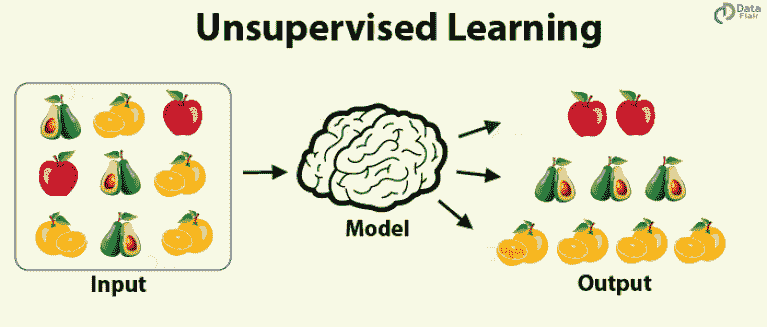

*Unsupervised learning | [Source](https://web.archive.org/web/20220926104145/https://data-flair.training/blogs/types-of-machine-learning-algorithms/)*

### 3.半监督学习

半监督学习是一种机器学习方法，其中我们有输入数据，输入数据的一部分被标记为输出。它是监督学习和非监督学习的混合。

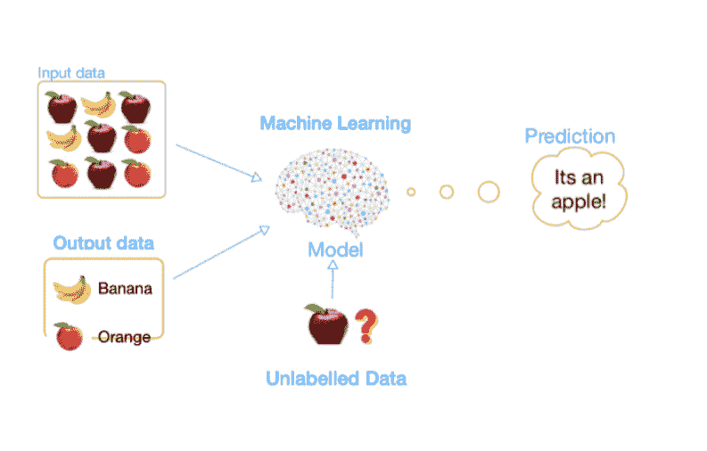

*Semi-supervised learning | [Source](https://web.archive.org/web/20220926104145/https://medium.com/enjoy-algorithm/supervised-unsupervised-and-semi-supervised-learning-64ee79b17d10)*

在我们只有少量标记数据点来训练模型的情况下，半监督学习可能是有用的。训练过程可以使用一小块已标记的数据，并对数据集的其余部分进行伪标记。

例如，一个学生被老师教了几个问题，他必须自己想出其余问题的答案。

### 4.强化学习

强化学习是一种利用奖励反馈策略训练 AI 智能体在特定情境下学习环境行为的方法。

举个例子:把它想象成一个在游戏中努力赢得舞台的孩子。

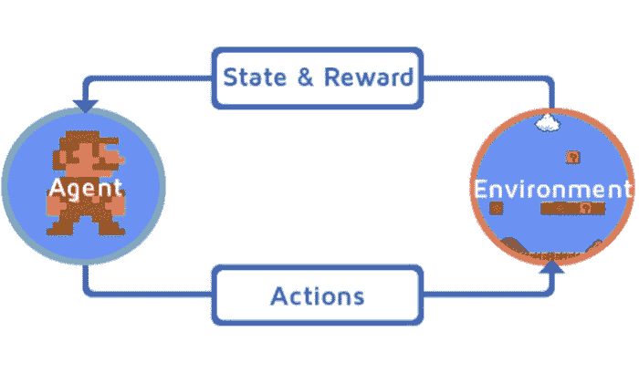

*Reinforcement learning process | [Source](https://web.archive.org/web/20220926104145/https://blog.clairvoyantsoft.com/reinforcement-learning-the-third-paradigm-of-machine-learning-1d7f61af9be4)*

## 什么是自我监督学习？

自我监督学习是一个机器学习过程，其中模型训练自己从输入的另一部分学习输入的一部分。它也被称为预测学习或借口学习。

在这个过程中，通过自动生成标签将无监督问题转化为有监督问题。为了利用大量的未标记数据，设置正确的学习目标以从数据本身获得监督是至关重要的。

自我监督学习方法的过程是从输入的任何未隐藏部分中识别输入的任何隐藏部分。

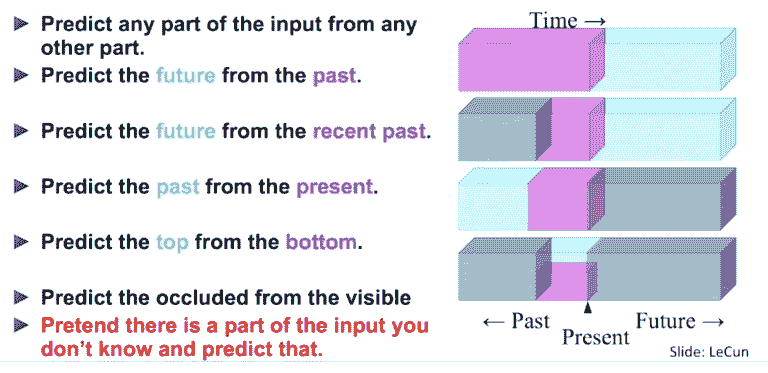

*Self-supervised learning | [Source](https://web.archive.org/web/20220926104145/https://www.youtube.com/watch?v=7I0Qt7GALVk)*

例如，在自然语言处理中，如果我们有几个单词，使用自我监督学习我们可以完成句子的其余部分。同样，在视频中，我们可以根据可用的视频数据预测过去或未来的帧。自我监督学习使用数据的结构来利用大型数据集的各种监督信号——所有这些都不依赖于标签。

## 自我监督学习和无监督学习有什么区别？

许多人混淆了这两个术语，并互换使用。然而，这两种学习技巧有不同的目标。

自监督学习和无监督学习方法可以被认为是互补的学习技术，因为两者都不需要标记数据集。无监督学习可以被认为是自监督学习的超集，因为它没有任何反馈循环。相反，自我监督学习有许多监督信号，在训练过程中起反馈作用。

一种更简单的说法是,“无监督”学习技术非常关注模型而不是数据，而“自我监督学习”技术的工作方式正好相反。然而，无监督学习方法擅长聚类和降维，而自监督学习是用于回归和分类任务的借口方法。

## 为什么我们需要自我监督学习？

自我监督学习的出现是因为在其他学习过程中持续存在以下问题:

*   **高成本**:大部分学习方法都需要标注数据。就时间和金钱而言，高质量标记数据的成本非常高。
*   **漫长的生命周期:**数据准备生命周期是开发 ML 模型的漫长过程。它需要根据培训框架进行清理、过滤、注释、审查和重组。
*   **Generic AI:** 自我监督学习框架离将人类认知嵌入机器又近了一步。

现在让我们来谈谈自我监督学习在不同领域的效用。

## 自监督学习在计算机视觉中的应用

多年来，计算机视觉中学习方法的焦点一直是朝着完善模型架构和假设我们拥有高质量数据的方向发展。然而，在现实中，如果没有高成本的时间和精力，很难获得高质量的图像数据，从而导致次优的训练模型。

最近，研究重点的很大一部分已经放在开发跨不同应用的计算机视觉中的自监督方法上。用未标记的数据训练模型的能力加快了整体训练过程，并使模型能够在不引入标记偏差的情况下学习潜在的语义特征。

为了训练自监督模型，主要有两个阶段:

我们用于预训练的任务被称为借口任务。借口任务(也称为监督任务)的目的是指导模型学习数据的中间表示。它有助于理解潜在的结构意义，这对实际的下游任务是有益的。

生成模型可以被认为是自我监督的模型，但是具有不同的目标。例如，在 GANs 中，它们用于为鉴别器生成逼真的图像，而自我监督训练的目的是识别可用于各种任务的良好特征，而不仅仅是欺骗鉴别器。

下游任务是托词模型到具体任务的 ***知识转移过程*** 。向下游任务提供更少量的标记数据。

视觉领域中的下游任务也称为目标任务，可以是对象识别、对象分类、对象再识别等。在托词模型上做了微调。

研究人员已经为使用 SSL 方法训练不同的基于图像的任务提出了许多想法。

### 补丁定位

**目的:**托辞任务的目的是使用自我监督学习来识别图像中不同斑块之间的关系。

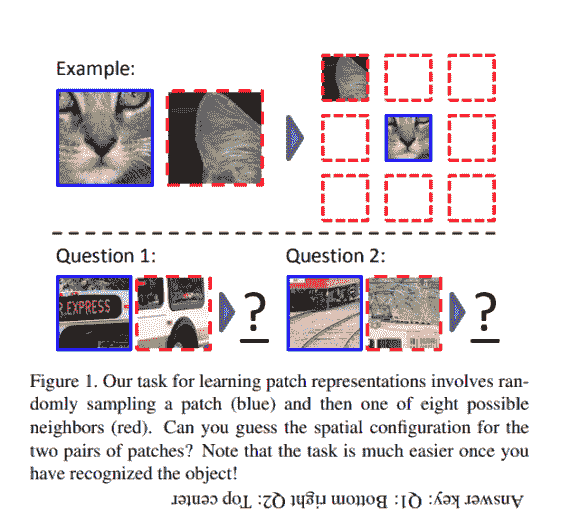

*Patch localization in image | [Source](https://web.archive.org/web/20220926104145/https://arxiv.org/pdf/1505.05192.pdf)*

**训练算法** [**论文**](https://web.archive.org/web/20220926104145/https://arxiv.org/pdf/1505.05192.pdf)

 **1.  从图像中随机抽取一块样本。
2.  最近邻:假设第一个面片位于 3×3 网格的中间，第二个面片从其 8 个相邻位置采样。
3.  引入增强功能，如补片之间的间隙、[色差](https://web.archive.org/web/20220926104145/https://en.wikipedia.org/wiki/Chromatic_aberration)、补片的下采样和上采样，以处理像素化和色彩抖动。这有助于模型不过度拟合某些低电平信号。
4.  该任务的目的是识别 8 个相邻位置中的哪一个是第二块。该任务被设计成一个超过 8 类的分类问题。

在完成托词任务时，重要的是要确保它不是在学习与全局模式下的高级潜在特征相比微不足道的模式。例如，像面片之间的边界纹理这样的低级线索可以被认为是微不足道的特征。然而，对于某些图像，存在一个微不足道的解决方案。这是由于相机镜头效应造成的，称为色差，色差是由于不同波长的光的焦点不同而产生的。

卷积神经网络能够通过检测品红色(蓝色+红色)和绿色之间的差异来学习补丁的相对位置。最近邻实验证明，很少有小块从绝对相同的位置提取区域，因为小块显示相似的像差。

### 上下文感知像素预测

**目的:**使用编码器-解码器基于图像的整体上下文来预测图像中未知块的像素值。

**训练算法** [**论文**](https://web.archive.org/web/20220926104145/https://arxiv.org/pdf/1604.07379.pdf)

 **1.  使用普通的编码器-解码器架构来训练托词任务。
2.  编码器( [Pathak 等人，2016](https://web.archive.org/web/20220926104145/https://arxiv.org/abs/1604.07379) )使用具有涂黑区域的输入图像产生图像的潜在特征表示。
3.  解码器使用来自编码器的潜在特征表示，并使用重建损失(MSE)来估计丢失的图像区域。
4.  编码器和解码器之间的通道式全连接层允许解码器中的每个单元对整个图像内容进行推理。

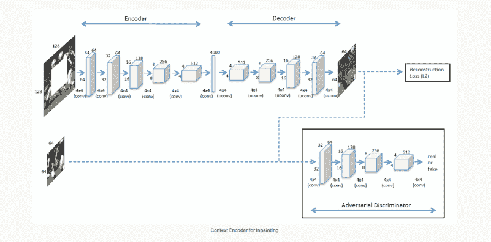

*Context encoder architecture | [Source](https://web.archive.org/web/20220926104145/https://arxiv.org/pdf/1604.07379.pdf)*

**损失函数**

训练中使用的损失函数是 ***重建*** 损失和 ***对抗*** 损失。

**重建损失**

*   重建(L2)损失负责捕获相对于完整图像背景的显著特征。
*   重建损失定义为输入图像的*归一化屏蔽距离 x* 。
    *   **M** :对应于被去除图像区域的二进制掩码，对于输入像素值为 0，不考虑像素时为 1。
    *   **F:** 产生编码器输出的函数

**敌对损失**

*   对手损失被建模以使预测看起来真实，并学习它被训练的输入数据的潜在空间。
*   因为鉴别器 D 能够利用修补区域和原始上下文中的永久不连续性，所以只有生成器 G 针对输入掩码进行调节。

**关节损失**

*   联合损失是通过结合重建和对抗损失发展起来的
*   然而，在实验中，作者意识到，只有在不利损失的情况下，修复效果最好。

语义修复是使用 SSL 方法通过辅助监督和学习强特征表示来实现的。早在 2016 年，这篇论文就是使用 SSL 方法训练竞争形象模型的早期先驱之一。

## 自监督学习在自然语言处理中的应用

在 SSL 成为主流计算机视觉研究的一部分之前，SSL 已经在自然语言处理(NLP)领域取得了巨大的进步。从文档处理应用程序、文本建议、句子完成等等，语言模型几乎无处不在。

然而，自从 2013 年发表了革新 NLP 领域的 ***Word2Vec*** 论文以来，这些模型的学习能力已经发生了演变。单词嵌入方法的想法很简单:我们不需要一个模型来预测下一个单词，我们可以让它根据之前的上下文来预测下一个单词。

由于这些进步，我们能够通过单词嵌入的分布来获得有意义的表示，这可以用于许多场景，如句子完成、单词预测等。如今，NLP 中最流行的 SSL 方法之一是 ***BERT。***

在过去的十年中，NLP 领域的研究和开发不断涌现。让我们在下面提取一些重要的。

### 下一句预测

在下一句预测(NSP)中，我们从一个文档中选取两个同时出现的句子，并从相同或不同的文档中随机选取一个句子，比如句子 A、句子 B 和句子 c。然后我们询问模型句子 A 相对于句子 B 的相对位置？–并且模型输出 IsNextSentence 或 IsNotNextSentence。我们对所有组合都这样做。

**考虑以下场景:**

1.  放学后，迈克回家了。
2.  将近 50 年后，载人登月任务终于开始了。
3.  一回到家，迈克看着网飞放松。

如果我们让一个人重新排列任何两个符合我们逻辑理解的句子，他们很可能会选择 ***句子 1*** ，然后是 ***句子 3*** 。

这个模型的主要目的是基于长期的上下文依赖来预测句子。

[***来自变形金刚的双向编码器表示(BERT)***](https://web.archive.org/web/20220926104145/https://arxiv.org/pdf/1810.04805.pdf) 谷歌人工智能团队的研究人员发表的一篇论文已经成为自然语言推理(MNLI)、问答(SQuAD)等几项 NLP 任务的黄金标准。

对于这样的下游任务，BERT 提供了一种很好的方法来捕捉句子之间的关系，这是通过其他语言建模技术不可能实现的。下面是下一句预测的工作原理。

1.  为了让 BERT 处理各种下游任务，输入表示能够明确地表示一对在单个序列中打包在一起的句子。“序列”是指 BERT 的输入令牌序列。

2.  每个序列的第一个标记总是一个特殊的分类标记([CLS])。对应于该令牌的最终隐藏状态被用作分类任务的聚集序列表示。

3.  我们用两种方法区分句子。首先，我们用一个特殊的标记([SEP])将它们分开。第二，我们向每个标记添加一个学习嵌入，指示它是属于句子 A 还是句子 b。

4.  我们将输入嵌入表示为 E，将特殊[CLS]标记的最终隐藏向量表示为 C，将第 I 个^(输入标记的最终隐藏向量表示为 T[I .]该向量 C 用于下一句预测(NSP))

**这个任务可以从下面的例子来理解:**

如果你想利用 BERT 模型来完成这个任务，你可以参考拥抱脸文档。

### 自回归语言建模

虽然像 BERT 这样的自动编码模型利用自监督学习来完成像句子分类(next 或 not)这样的任务，但自监督方法的另一个应用是文本生成领域。

像 GPT(预训练生成转换器)这样的自回归模型是在经典的语言建模任务中预训练的——在阅读了所有前面的单词后预测下一个单词。这种模型对应于变压器的解码器部分，并且在整个句子的顶部使用了一个遮罩，以便注意力只能够看到文本中之前的内容，而不是之后的内容。

让我们通过查看 GPT 的训练框架来更深入地了解这些模型是如何工作的。

培训程序包括两个阶段:

1.  **无监督预训练**

第一阶段是在大型文本语料库上学习高容量语言模型。

给定一个无监督的记号集 U = {u [1] ，。。。，u [n] }，我们使用标准语言建模目标来最大化以下可能性:

其中 k 是上下文窗口的大小，并且条件概率 P 使用具有参数θ的神经网络来建模。使用随机梯度下降来训练这些参数。

这里训练的模型是语言模型的多层 transformer 解码器，它是 transformer 的变体。该模型在输入上下文标记上应用多头自关注操作，随后是逐位置前馈层，以产生目标标记上的输出分布:

其中 U =(U[—k]，。。。，u[—1]是记号的上下文向量，n 是层数，W [e] 是记号嵌入矩阵，W [p] 是位置嵌入矩阵。这种受约束的自我关注(每个标记都可以关注其左侧的上下文)将自我监督的方法带入了画面。

在这一步中，我们假设一个带标签的数据集 C，其中每个实例由一系列输入标记 x ¹ 组成。。。输入通过我们预先训练的模型，以获得最终变压器块的激活 h^ml，然后将其馈送到添加的线性输出层，该输出层具有参数 W [y] 以预测 y:

这为我们提供了以下最大化目标:

将语言建模作为微调的辅助目标有助于学习——提高监督模型的泛化能力，加速收敛。具体来说，我们优化以下目标(权重为λ):

总的来说，在微调过程中，我们需要的唯一额外参数是 W [y] ，以及分隔符标记的嵌入。

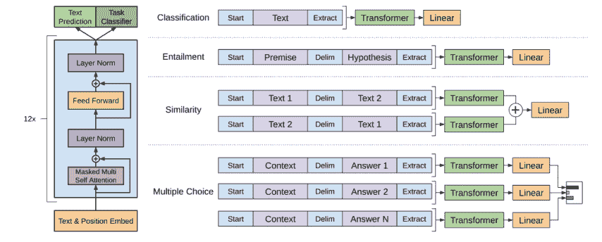

*(left) Transformer architecture and training objectives used in this work
(right) Input transformations for fine-tuning on different tasks | [Source](https://web.archive.org/web/20220926104145/https://cdn.openai.com/research-covers/language-unsupervised/language_understanding_paper.pdf)*

在上图中，左边是 Transformer 架构和培训目标，右边是针对不同任务进行微调的输入转换。我们将所有结构化输入转换为令牌序列，由我们预先训练的模型进行处理，然后是线性+softmax 层。对于不同的任务，需要不同的处理，就像对于文本蕴涵，我们连接前提(p)，包含文本和假设(h)，包含文本，标记序列，中间有分隔符标记($)。

对最初的 GPT 模型进行了多次改进，要了解如何将它用于您自己的用例，您可以参考此[页](https://web.archive.org/web/20220926104145/https://huggingface.co/gpt2)。

## 自我监督学习应用:工业案例研究

到目前为止，我们已经讨论了如何使用自我监督的方法来训练流行的模型，以及如何自己训练或使用可用库中的模型。

**现在，让我们来看看业界是如何利用这项技术来解决关键问题的。**

### 1.脸书的仇恨言论检测

> “我们认为，自我监督学习(SSL)是在人工智能系统中建立背景知识和近似常识形式的最有前途的方法之一。”
> 
> [AI Scientists](https://web.archive.org/web/20220926104145/https://ai.facebook.com/blog/self-supervised-learning-the-dark-matter-of-intelligence/), Facebook

脸书不仅通过基础、开放的科学研究在许多领域推进自我监督学习技术,而且他们还将这一前沿工作应用于生产，以快速提高其产品中内容理解系统的准确性，从而确保人们在其平台上的安全。

一个这样的例子是 XLM，脸书人工智能的跨多种语言训练语言系统的方法，不依赖手动标记的数据集来提高仇恨言论检测。

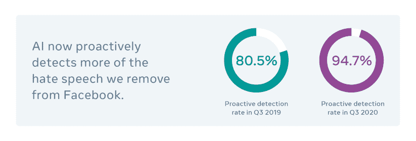

*Hate-speech detection at Facebook | [Source](https://web.archive.org/web/20220926104145/https://ai.facebook.com/blog/how-ai-is-getting-better-at-detecting-hate-speech/)*

这种自我监督学习的应用使得他们的模型更加健壮，他们的平台更加安全。让我们简单谈谈 XLM 是什么，以及它是如何做出如此改变的。

#### XLM

##### 型号

它是一个基于 Transformers 的架构，使用三个语言建模目标之一进行预训练:

1.  **随意语言建模(CLM):** 根据句子中前面的单词，对一个单词的概率进行建模，即 P(w [t] |w [1] ，。。。，w[t1]，θ)。

2.  掩蔽顾岚**年龄建模(MLM):**BERT 的掩蔽语言建模目标，即使用[MASK]关键字掩蔽随机选择的标记，并尝试预测它们。

3.  **翻译语言建模(TLM):**MLM 的新增和扩展，它不考虑单语文本流，而是连接平行句子，如下图所示。源句子和目标句子中的单词都被屏蔽。为了预测英语句子中隐藏的单词，模型可以关注周围的英语单词或法语翻译，鼓励模型对齐英语和法语表示。如果英语上下文不足以推断被屏蔽的英语单词，该模型还可以利用法语上下文。

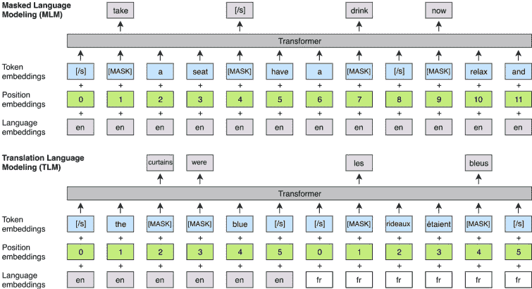

*Cross-lingual language model pertaining | [Source](https://web.archive.org/web/20220926104145/https://arxiv.org/pdf/1901.07291.pdf)*

因此，XLM 是一个跨语言的语言模型，其预训练可以在 CLM、MLM 或 MLM 与 TLM 结合使用的情况下进行。现在，让我们来看看 XLM 带来的好处。

**性能分析**

1.  **跨语言分类**

XLM 为零射击跨语言分类提供了更好的句子编码器初始化，并能够通过 MLM 方法在相同的句子编码器上获得 71.5%的准确度，从而实现最先进的(SOTA)性能。结合 MLM 和 TLM 将性能进一步提高到 75.1%。

2.  **机器翻译系统**

类似于第一点，它提供了监督和非监督神经机器翻译系统的更好的初始化。具有 MLM 目标的预训练显示了在无监督系统的情况下的显著改进，而相同的目标导致了在有监督系统中的 SOTA 性能，BLEU 得分为 38.5。

3.  **低资源语言的语言模型**

对于资源较少的语言来说，利用类似但资源较多的语言中的数据通常是有益的，尤其是当它们共享很大一部分词汇表时。发现 XLM 通过利用来自印地语(一种相对流行的具有大量资源的语言)的信息来改进尼泊尔语语言模型(一种低资源语言)，因为它们共享相同的 Devnagari 文字。

4.  **无监督的跨语言单词嵌入**

XLM 在跨语言单词嵌入方面优于先前的工作，在源单词和它们的翻译之间达到了 0.69 的 SOTA 水平皮尔逊相关分数。

有了这样的进步，XLM 确实在自然语言处理方面有所作为。

### 2.谷歌的医学影像分析模型

在医学领域，训练深度学习模型一直是一项困难的任务，因为标记的数据有限，而且标注这些数据既耗时又昂贵。为了解决这个问题，谷歌的研究团队引入了一种新的多实例对比学习(MICLe)方法，该方法使用每个患者病例的潜在病理的多个图像，为自我监督学习构建更多信息的阳性对。

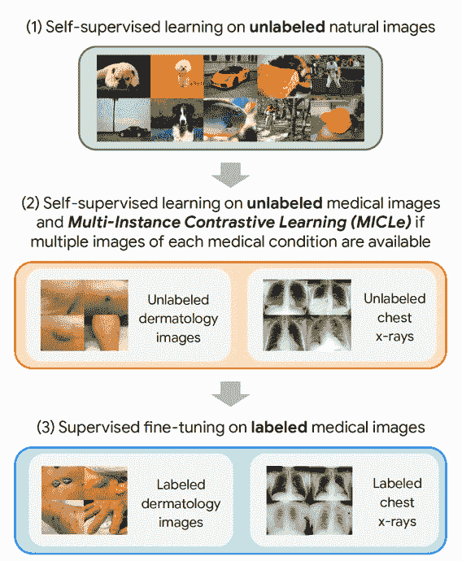

*Google’s medical imaging analysis model | [Source](https://web.archive.org/web/20220926104145/https://arxiv.org/pdf/2101.05224.pdf)*

关于图示的方法，需要记住几件事:

*   第一步是使用 SimCLR 进行的，这是 Google 为图像的自我监督表示学习设计的另一个框架。我们将很快讨论它。
*   与步骤(1)不同，步骤(2)和(3)是特定于任务和数据集的。

所以还是一步一步来。

#### 步骤 1:sim clr 框架

它代表了视觉表征对比学习的一个简单框架，极大地推动了自监督和半监督学习的发展，并在有限的类别标记数据下实现了图像分类的新纪录。

*   SimCLR 首先在未标记的数据集上学习图像的通用表示，然后可以用少量的标记图像进行微调，以实现给定分类任务的良好性能(就像医学成像任务一样)。

*   遵循一种称为对比学习的方法*，通过同时最大化同一图像的不同变换视图之间的一致性和最小化不同图像的变换视图之间的一致性来学习通用表示。*使用这种对比目标来更新神经网络的参数使得对应视图的表示彼此“吸引”,而不对应视图的表示彼此“排斥”。

*   首先，SimCLR 从原始数据集中随机抽取示例，使用简单扩充的组合将每个示例转换两次，创建两组对应的视图。

*   然后，它使用基于 ResNet 架构的 CNN 来计算图像表示。

*   最后，SimCLR 使用全连接网络(即，MLP)计算图像表示的非线性投影，这放大了不变特征并最大化了网络识别同一图像的不同变换的能力。

经训练的模型不仅在识别同一图像的不同变换方面做得很好，而且还学习相似概念的表示(例如，椅子对狗)，这些概念稍后可以通过微调与标签相关联。

#### 米克尔

在用 SimCLR 对未标记的自然图像完成初始预训练之后，训练该模型以捕捉医学图像数据集的特殊特征。这也可以用 SimCLR 来完成，但是这种方法只能通过增强来构建阳性对，而不能轻易地利用患者的元数据来构建阳性对。因此这里使用 MICLe。

*   给定给定患者病例的多个图像，MICLe 通过从来自同一患者病例的两个不同图像中绘制两个裁剪来构建用于自我监督对比学习的正对。这种图像可以从不同的视角拍摄，并显示具有相同潜在病理的不同身体部位。

*   这为自监督学习算法提供了一个很好的机会，以直接方式学习对视点、成像条件和其他混淆因素的变化具有鲁棒性的表示。

#### 第三步:微调

*   该模型在微调期间被端到端地训练，使用预训练网络的权重作为下游监督任务数据集的初始化。
*   对于微调期间的数据增强，在两个任务(皮肤病学和胸部 x 光)中对图像进行了随机颜色增强、带大小调整的裁剪、模糊、旋转和翻转。
*   对于预训练策略和下游微调任务的每个组合，执行广泛的超参数搜索。

#### 技术性能分析

1.  自监督学习利用未标记的特定领域医学图像，并且显著优于监督 ImageNet 预训练。

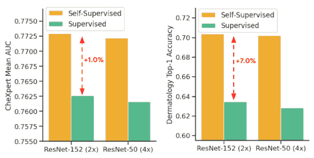

*Comparison of supervised and self-supervised pre-training, followed by supervised fine-tuning using two architectures on dermatology and chest X-ray classification | [Source](https://web.archive.org/web/20220926104145/https://ai.googleblog.com/2021/10/self-supervised-learning-advances.html)*

2.  自我监督预训练模型可以更好地概括分布变化，其中最小预训练导致最大增益。这是一个有价值的发现，因为分布转移下的泛化对临床应用至关重要。

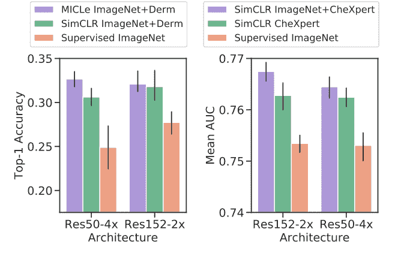

*Evaluation of models on distribution-shifted datasets | [Source](https://web.archive.org/web/20220926104145/https://arxiv.org/pdf/2101.05224.pdf)*

3.  使用自监督模型的预训练可以补偿医学图像分类的低标签效率，并且在采样的标签部分中，自监督模型始终优于监督基线。事实上，MICLe 仅使用 ResNet-50 (4x)的 20%的训练数据和 ResNet152 (2x)的 30%的训练数据就能够匹配基线。

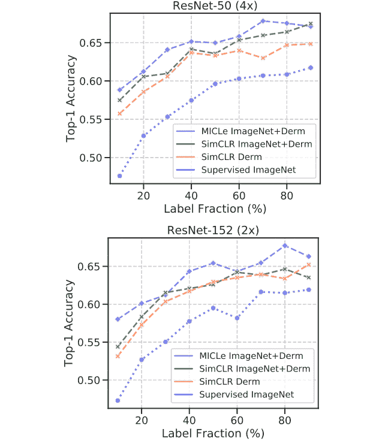

*Top-1 accuracy for dermatology condition classification for MICLe, SimCLR, and supervised models under different unlabeled pretraining dataset and varied sizes of label fractions | [Source](https://web.archive.org/web/20220926104145/https://arxiv.org/pdf/2101.05224.pdf)*

## 自我监督学习的挑战

到目前为止，我们已经讨论了自我监督学习如何在机器学习社区的几乎每个领域取得进展，但它也有一些缺点。自我监督学习试图实现“一种方法解决所有问题”的方法，但它远没有实现。SSL 领域的一些关键挑战是:

*   **准确性:**虽然 SSL 技术的前提是不使用带标签的数据，但这种方法的缺点是您要么需要大量数据来生成准确的伪标签，要么会牺牲准确性。需要注意的是，在初始步骤中进行训练时，生成的不准确标签会产生反作用。

*   **计算效率:**由于多阶段训练(1。生成伪标签 2。在伪标签上训练)与监督学习相比，训练模型所花费的时间较高。此外，当前的 SSL 方法需要大量的数据来实现接近监督学习的准确性。

*   **托辞任务:**为你的用例选择合适的托辞任务非常重要。例如，如果您选择 autoencoder 作为您的托词任务，其中图像被压缩，然后重新生成，它也会试图模仿原始图像的噪声，如果您的任务是生成高质量的图像，这种托词任务将弊大于利。

## 关键要点

在本文中，我们了解了什么是自我监督学习，为什么它越来越受欢迎，以及与它相关的风险和挑战是什么。我们还讨论了使用这种方法训练的流行模型，并深入探讨了大型科技公司如何利用自我监督学习来解决一些真正紧迫的问题。

总结一下我们目前所学的知识:

*   在我们处理与数据相关的挑战的用例中，自我监督学习是一种福气。从用于数据集准备的资源不足到耗时的标注问题，不一而足。
*   另一个好处是下游任务，即迁移学习。模型可以在未标记的数据集上以自我监督的方式进行预训练，然后可以针对特定的用例进行进一步的微调。
*   作为前两点的结果，如果你想建立一个可扩展的 ML 模型，自我监督学习显然是一种可行的方法。
*   然而与此同时，人们必须意识到使用这种方法所附带的条件。

虽然我们试图在本文中涵盖很多内容，但显然我们讨论的内容并不详尽。关于自我监督学习还有很多东西要学。如果您想了解更多有关其当前和潜在使用案例的信息，您可以参考以下资料:

快乐学习！

### 参考

### 德瓦尔·沙阿

对智能软件系统很好奇。作为我日常生活的一部分，我编写程序，写关于人工智能的新研究趋势，阅读关于技术、文化、政治和体育的书籍。

### 阿布舍克·贾

一个好奇的家伙，目前正在建造模型，希望有一天能建造天网。跟随这个空间，学习未被理清的数据科学概念，并站在未来的正确一边！

* * *

**阅读下一篇**

## 如何构建和管理自然语言处理(NLP)项目

Dhruvil Karani |发布于 2020 年 10 月 12 日

如果说我在 ML 行业工作中学到了什么的话，那就是:**机器学习项目很乱。**

这并不是说人们不想把事情组织起来，只是在项目过程中有很多事情很难组织和管理。

你可以从头开始，但有些事情会阻碍你。

一些典型的原因是:

*   笔记本中的快速数据探索，
*   取自 github 上的研究报告的模型代码，
*   当一切都已设置好时，添加新的数据集，
*   发现了数据质量问题并且需要重新标记数据，
*   团队中的某个人“只是快速地尝试了一些东西”,并且在没有告诉任何人的情况下改变了训练参数(通过 argparse 传递),
*   从高层推动将原型转化为产品“仅此一次”。

多年来，作为一名机器学习工程师，我学到了一堆**东西，它们可以帮助你保持在事物的顶端，并检查你的 NLP 项目**(就像你真的可以检查 ML 项目一样:)。

在这篇文章中，我将分享我在从事各种数据科学项目时学到的关键指针、指南、技巧和诀窍。许多东西在任何 ML 项目中都是有价值的，但有些是 NLP 特有的。

[Continue reading ->](/web/20220926104145/https://neptune.ai/blog/how-to-structure-and-manage-nlp-projects-templates)

* * *****