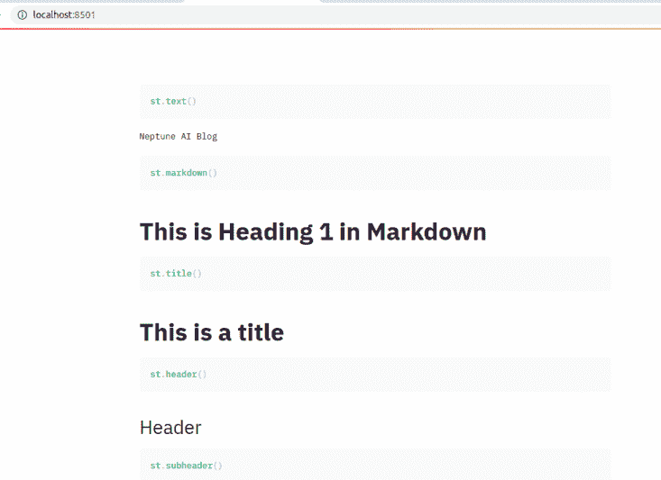

# Streamlit 指南:如何构建机器学习应用程序

> 原文：<https://web.archive.org/web/https://neptune.ai/blog/streamlit-guide-machine-learning>

构建机器学习应用程序变得越来越容易。有了 [Streamlit](https://web.archive.org/web/20221207112623/https://www.streamlit.io/) ，你可以快速轻松地开发机器学习应用。您还可以使用 Streamlit 共享平台，只需点击几下鼠标即可部署您的应用。

使用 Streamlit 开始开发并不需要很长时间，因为您甚至不需要任何前端 web 开发经验。有了 Streamlit，你可以用 Python 编写任何东西。Streamlit 还与您可能知道的数据科学库兼容。

在本文中，我们将了解如何利用 Streamlit 开发您的机器学习应用程序。

## 细流安装

准备好 Python 环境后，Streamlit 的安装非常简单:

```py
$ pip install streamlit
```

如果您只是尝试一下，您可以运行 hello world 示例:

```py
$ streamlit hello
```

在官方回购中还有更大的例子。使用 Streamlit 时，您通常会将其作为“st”导入。

### 如何运行细流应用程序

假设您已经在一个名为“app.py”的文件中编写了 Streamlit 代码，您可以使用以下命令运行该应用程序:

```py
$ streamlit run app.py
```

“运行 app.py”将开始在您的本地计算机上运行应用程序，并提供一个链接，您可以使用该链接在网络上访问应用程序。

Streamlit 通过提供小部件使开发 web 应用程序变得容易。让我们来看看其中的一些。

### 在细流中显示文本

Streamlit 有几个用于显示文本的小部件，例如:

*   ` st.text '显示固定宽度和预格式化的文本
*   ` st.markdown '显示降价文本
*   ` st.latex '显示 latex 格式的数学表达式
*   “st.write”根据给它的输入有不同的行为。例如:
    *   当您将数据框传递给它时，它会将数据框打印为表格
    *   当向函数传递函数时，显示有关函数的信息
    *   当一个 Keras 模型传递给它时，显示该模型
    *   ` st.title `以标题格式显示文本
    *   ` st.header `以页眉格式显示文本
    *   ` st.code '显示代码

这里有一个例子说明了它们的作用:

```py
import streamlit as st
st.code("st.text()", language='python')
st.text('Neptune AI Blog')
st.code("st.markdown()", language='python')
st.markdown('# This is Heading 1 in Markdown')
st.code("st.title()", language='python')
st.title('This is a title')
st.code("st.header()", language='python')
st.header('Header')
st.code("st.subheader()", language='python')
st.subheader('Sub Header')
st.code("st.latex()", language='python')
st.latex(r'''
...     a + ar + a r^2 + a r^3 + cdots + a r^{n-1} =
...     sum_{k=0}^{n-1} ar^k =
...     a left(frac{1-r^{n}}{1-r}right)
...     ''')
st.code("st.write()", language='python')
st.write('Can display many things')
```



### 在细流中显示数据

Streamlit 也可以显示数据。数据可以显示为 JSON、表或数据框。

```py
df = pd.read_csv("data.csv")
st.dataframe(df)
st.table(df)
st.json(json_data) 
```

### 在细流中显示媒体

Streamlit 还允许您向应用程序添加媒体。您可以添加音频、视频或图像。为此，您可以使用“音频”、“视频”和“图像”小部件。

```py
from PIL import Image
icon = Image.open("icon.png")
image = Image.open("logo.png")
st.image(image)

video_file = open("video.mp4", "rb")
video_bytes = video_file.read()
st.video(video_bytes)

audio_file = open("video.wav", "rb")
audio_bytes = audio_file.read()
st.audio(audio_bytes)
```

### 在 Streamlit 中显示代码

使用' with st.echo()'命令显示其后的代码。例如，此代码将显示代码，然后显示数据框:

```py
with st.echo():
    df = pd.read_csv("data.csv")
    st.dataframe(df)

```

### 在 Streamlit 中显示进度和状态

构建应用程序时，显示用户进度或某些状态总是一个好习惯。例如，加载大型数据集时，可以显示进度条。您可以在 Streamlit 中使用的一些其他状态和进度小部件包括:

*   ` st.spinner()`在执行代码块时显示临时消息
*   ` st.balloons()`显示庆祝气球
*   ` st.error()`显示错误消息
*   ` st.warning '显示警告信息
*   ` st.info '显示信息性消息
*   ` st.success '显示成功消息
*   ` st.exception '在应用程序中传达一个异常

```py
import time
my_bar = st.progress(0)
for percent_complete in range(100):
    time.sleep(0.1)
    my_bar.progress(percent_complete + 1)
st.spinner()
with st.spinner(text='In progress'):
    time.sleep(5)
    st.success('Done')
st.balloons()
st.error('Error message')
st.warning('Warning message')
st.info('Info message')
st.success('Success message')
e = RuntimeError('This is an exception of type RuntimeError')
st.exception(e)
```

### 在细流中显示图表

Streamlit 支持以下库中的可视化:

Streamlit 还提供了几个函数来执行基本的可视化:

*   折线图的“st.line_chart(data)”
*   面积图的“st.area_chart(data)”
*   ` st.bar_chart(data)`显示条形图
*   ` st.map(data)`用于在地图上绘制数据

### 细流中的交互式小部件

Streamlit 还有一些小部件，让用户可以与您的应用程序进行交互，例如:

*   您可以使用选择框让用户在几个选项之间进行选择(比如，允许用户根据某个类别过滤数据)
*   多选小部件类似于选择框，但允许多重选择
*   文本区域和文本输入小部件可以用来收集用户输入
*   日期和时间输入可用于收集时间和日期输入
*   您还可以让用户使用文件上传器小部件上传文件(当您已经构建了图像分类器或对象检测模型，并且希望用户上传图像并查看结果时，这可能会很方便)

```py
st.button('Click here')
st.checkbox('Check')
st.radio('Radio', [1,2,3])
st.selectbox('Select', [1,2,3])
st.multiselect('Multiple selection', [21,85,53])
st.slider('Slide', min_value=10, max_value=20)
st.select_slider('Slide to select', options=[1,2,3,4])
st.text_input('Enter some text')
st.number_input('Enter a number')
st.text_area('Text area')
st.date_input('Date input')
st.time_input('Time input')
st.file_uploader('File uploader')
st.color_picker('Color Picker')
```

### 细流中的缓存

在任何应用程序中，缓存服务器通过确保数据和某些功能在用户需要时可用来改善用户体验。例如，您可以让应用程序缓存数据，以减少获取数据所花费的时间。您还可以缓存返回数据的函数的结果。

```py
@st.cache
def fetch_data():
    df = pd.read_csv("data.csv")
    return df

data = fetch_data()
```

第一次使用“@st.cache”运行函数时，结果将存储在本地缓存中。如果下次调用函数时，代码、输入参数和函数名称没有改变，Streamlit 将跳过执行并读取缓存的结果。

## 个性化细流应用

在 Streamlit 中，您可以个性化:

*   页面的标题
*   页面的图标
*   页面布局(居中或宽)
*   是否最初加载侧边栏

```py
icon = Image.open("icon.png")
st.set_page_config(
    page_title="Data Application",
    page_icon=icon,
    layout="centered",
    initial_sidebar_state="auto",
)
```

## 细流配置

Streamlit 在默认配置下运行良好。您可以使用下面的命令检查您当前的配置。

```py
$ streamlit config show
```

但是，有时您会遇到迫使您添加或更改默认设置的情况。有四种不同的方法。

### 在全局文件中

在这种情况下` ~/。编辑了适用于 macOS/Linux 的 streamlit/config.toml。在 Windows 中，将为“%userprofile%/”。例如，您可以更改运行 streamlit 的默认端口。

```py

port = 8502
```

### 在每个项目的配置文件中

在这种情况下，配置被传递到`＄CWD/streamlit/config.toml `文件，其中 CWD 是运行 streamlit 的文件夹。

### 通过环境变量

这里,“STREAMLIT_*”环境变量通过终端传递:

```py
$ export STREAMLIT_SERVER_PORT=8502
```

### 作为命令行上的标志

您也可以在执行 Streamlit“run”命令时使用标志来设置配置。

```py
$ streamlit run app.py --server.port 8502
```

## 将可视化库集成到细流

让我们看看如何将 Streamlit 与常见的可视化库结合使用。

### 在 Streamlit 中使用 Matplotlib 和 Seaborn

在 Streamlit 中使用 Matplotlib 和 Seaborn 时，您唯一要做的事情就是定义一个图形并将其传递给' st.pyplot'。

```py
fig = plt.figure(figsize=(12, 5))
st.pyplot(fig)
```

### 在细流中进行 plotly 集成

使用 Plotly 时，您将定义一个图形，并将其传递给' plotly _ chart` Streamlit 函数。

```py
fig = px.scatter(
      ….
    )
    st.plotly_chart(fig)
```

### 在 Streamlit 中使用 Vega-Lite

如果您正在使用 Vega-Lite，您将使用“vega_lite_chart”函数，如下所示:

```py
st.vega_lite_chart(
        df,
        {
            "mark": {...},
            "width": width,
            "height": height,
            "encoding": {
                "x": {...},
                "y": {...},
                "size": {...},
                "color": {...},
            },
        },
    )
```

### 在细流中使用 altair

使用 Altair 时，您将使用` altair.Chart()'定义一个图表，然后使用` st.altair_chart()'显示它:

```py
chart = (
            alt.Chart(data)
            .mark_bar()
            .encode(x=alt.X(...)
            .properties(...)
            .interactive()
        )
st.altair_chart(chart)
```

### 用细流可视化地图

您可以使用' st.map()'在地图上绘制数据。它是“st.pydeck_chart”的包装器，在地图上创建散点图:

```py
map_data = df[["lat", "lon"]]
st.map(map_data)
```

使用此功能时，您必须使用一个[个人地图框令牌](https://web.archive.org/web/20221207112623/https://www.mapbox.com/)。您可以在` ~/中设置它。streamlit/config.toml `:

```py
[mapbox]
token = "YOUR_MAPBOX_TOKEN"
```

## 细流组件

您可能会发现 Streamlit 并不正式支持您需要的某种功能。这就是 [Streamlit 组件](https://web.archive.org/web/20221207112623/https://www.streamlit.io/components)派上用场的地方。这些是社区在 Streamlit 之上构建的一组包。例如，您可以使用 [Streamlit embed code](https://web.archive.org/web/20221207112623/https://github.com/randyzwitch/streamlit-embedcode) 组件来嵌入来自 Github Gist、CodePen snippets、Gitlab snippets 等的代码片段。

```py
from streamlit_embedcode import github_gist
github_gist(gist_url)
```

Streamlit 还有一个 API，您可以使用它来[构建您的组件](https://web.archive.org/web/20221207112623/https://docs.streamlit.io/en/stable/streamlit_components.html)。

## 布局您的 Streamlit 应用程序

Streamlit 允许您使用容器和列来布局应用程序。然而，这项功能仍处于测试阶段。正如您将看到的，方法有' beta_ '前缀。一旦这些特性变得稳定，你所要做的就是去掉 beta 前缀。` beta_columns '并排布置容器。

` beta_container '插入一个可用于保存多个元素的不可见容器。您可以使用的另一个函数是“beta_expander ”,它可以生成一个可以展开和折叠的多元素容器。下面是所有这些项目的一个实例。

```py
with left_column:
    st.altair_chart(chart)
with right_column:
    st.altair_chart(chart)
with st.beta_container():
    st.altair_chart(chart)
with st.beta_expander("Some explanation"):
    st.write("This is an explanation of the two graphs..")
```

## 认证 Streamlit 应用

目前，Streamlit 中还没有对身份验证的官方支持。但是，有一些变通办法。如果您熟悉 Flask，您可以编写您的身份验证函数并将其编织到 Streamlit 中。

另一种方法是使用这个[会话状态要点](https://web.archive.org/web/20221207112623/https://gist.github.com/tvst/036da038ab3e999a64497f42de966a92)来添加每个会话状态以简化它。您可以使用“st.empty”小部件来初始化单个元素容器。这很有用，因为一旦用户输入正确的密码，你就可以放弃它，显示你想要的功能。

```py
PASSWORD = config('PASSWORD')
session_state = SessionState.get(username='', password='')
if (session_state.password == PASSWORD):
    your_function()

elif ( session_state.password != PASSWORD):
    password_placeholder = st.empty()
    password = password_placeholder.text_input("Enter Password:", type="password")
    session_state.password = password

    if (password and session_state.password == PASSWORD):
        password_placeholder.empty()
        st.success("Logged in successfully")
        your_function()
    elif(password and session_state.password != PASSWORD):
        st.error("Wrong password")
```

## 在细流中上传和处理文件

让我们看看如何在 Streamlit 中上传和处理文件。虽然您可以上传其他文件，如 CSV 文件等，但是这个示例将集中在图像数据上。

### 使用 Streamlit 构建影像分类应用程序

对于这个示例，让我们使用一个预先训练的 TensorFlow Hub 模型来构建一个应用程序，该应用程序可以根据植物的叶子图像来识别疾病的类型。这是这个应用程序的一个演示。稍后，您将致力于将其投入生产。

对于这个应用程序，您需要以下软件包:

*   显然是“简化”
*   ` [pillow](/web/20221207112623/https://neptune.ai/blog/pil-image-tutorial-for-machine-learning) `用于调整用户将要上传的图像的大小
*   用于显示图像的“matplotlib”
*   用于加载预训练模型的“tensorflow_hub”
*   用于扩展图像尺寸的“numpy”

```py
import streamlit as st
from PIL import Image
import matplotlib.pyplot as plt
import tensorflow as tf
import tensorflow_hub as hub
import numpy as np
from tensorflow.keras import preprocessing
```

该应用程序将有两个主要功能:

*   主要功能:让用户上传图片
*   预测功能:对上传的图像进行推理

先说主要功能。如前所述，您可以使用“header”来设置应用程序标题。

在 main 函数中，您使用“st.file_uploader”让用户上传图像。您也可以在文件上传程序中指定可接受的文件类型。上传图像后，枕头上的“图像”被用来打开它。接下来，运行预测函数并显示结果。您可以在结果下方绘制图像。

```py
st.header("Predict if plant is healthy")

def main():
    file_uploaded = st.file_uploader("Choose File", type=["png","jpg","jpeg"])

    if file_uploaded is not None:
        image = Image.open(file_uploaded)
        fig = plt.figure()
        plt.imshow(image)
        plt.axis("off")
        predictions = predict(image)
        st.write(predictions)
        st.pyplot(fig)
```

现在来看预测函数。在这个函数中，您需要做几件事情:

*   从 TensorFlow Hub 加载预训练模型
*   将用户上传的图像调整到所需的大小(此型号需要 300 x 300 的图像)
*   将图像转换为数组，并将其标准化
*   在图像维度中包含批量大小(这只是一个图像，因此批量大小为 1)
*   运行预测并将它们映射到类名

```py
def predict(image):
    classifier_model = "https://tfhub.dev/agripredict/disease-classification/1"
    IMAGE_SHAPE = (300, 300,3)
    model = tf.keras.Sequential([
    hub.KerasLayer(classifier_model,input_shape=IMAGE_SHAPE)])
    test_image = image.resize((300,300))
    test_image = preprocessing.image.img_to_array(test_image)
    test_image = test_image / 255.0
    test_image = np.expand_dims(test_image, axis=0)
    class_names = [
          'Tomato Healthy',
          'Tomato Septoria Leaf Spot',
          'Tomato Bacterial Spot',
          'Tomato Blight',
          'Cabbage Healthy',
          'Tomato Spider Mite',
          'Tomato Leaf Mold',
          'Tomato_Yellow Leaf Curl Virus',
          'Soy_Frogeye_Leaf_Spot',
          'Soy_Downy_Mildew',
          'Maize_Ravi_Corn_Rust',
          'Maize_Healthy',
          'Maize_Grey_Leaf_Spot',
          'Maize_Lethal_Necrosis',
          'Soy_Healthy',
          'Cabbage Black Rot']
    predictions = model.predict(test_image)
    scores = tf.nn.softmax(predictions[0])
    scores = scores.numpy()
    results = {
          'Tomato Healthy':0,
          'Tomato Septoria Leaf Spot':0,
          'Tomato Bacterial Spot':0,
          'Tomato Blight':0,
          'Cabbage Healthy':0,
          'Tomato Spider Mite':0,
          'Tomato Leaf Mold':0,
          'Tomato_Yellow Leaf Curl Virus':0,
          'Soy_Frogeye_Leaf_Spot':0,
          'Soy_Downy_Mildew':0,
          'Maize_Ravi_Corn_Rust':0,
          'Maize_Healthy':0,
          'Maize_Grey_Leaf_Spot':0,
          'Maize_Lethal_Necrosis':0,
          'Soy_Healthy':0,
          'Cabbage Black Rot':0
}

    result = f"{class_names[np.argmax(scores)]} with a { (100 * np.max(scores)).round(2) } percent confidence."
    return result
```

最后一步是运行主函数。

```py
if __name__ == "__main__":
    main()
```

点击查看完整示例[。](https://web.archive.org/web/20221207112623/https://github.com/mwitiderrick/Streamlit/blob/master/disease/app.py)

## 用 Streamlit 开发一个自然语言处理应用

再来看另一个例子:用[拥抱脸](https://web.archive.org/web/20221207112623/https://github.com/huggingface/transformers/blob/master/notebooks/03-pipelines.ipynb)构建自然语言处理 app。这个应用程序使用“拥抱脸”的“变形金刚”包，所以不要忘记通过“pip”安装它。

您可以使用该软件包执行的一些功能包括:

*   文本摘要
*   文本翻译
*   文本分类
*   问题回答
*   命名实体识别

让我们转换一些句子。

您可以从导入本例所需的两个包开始，然后创建一个选择框，让用户选择一个任务。

```py
import streamlit as st
from transformers import pipeline

option = st.selectbox(
    "Select Option",
    [
        "Classify Text",
        "Question Answering",
        "Text Generation",
        "Named Entity Recognition",
        "Summarization",
        "Translation",
    ],
)
```

运行任何任务都需要在任务的同时初始化“管道”。下面是一个文本分类和问答的例子。为了可读性，其他的都被省略了。

```py
if option == "Classify Text":
    text = st.text_area(label="Enter a text here")
    if text:
        classifier = pipeline("sentiment-analysis")
        answer = classifier(text)
        st.write(answer)
elif option == "Question Answering":
    q_a = pipeline("question-answering")
    context = st.text_area(label="Enter the context")
    question = st.text_area(label="Enter the question")
    if context and question:
        answer = q_a({"question": question, "context": context})
        st.write(answer)
```

你可以在这里找到完整的[拥抱脸示例](https://web.archive.org/web/20221207112623/https://github.com/mwitiderrick/Streamlit/blob/master/13%20Hugging%20Face/app.py)。

## 部署细流应用程序

构建应用程序后，您希望将其托管在某个地方，以便用户可以访问它。让我们看看如何托管我们之前开发的植物病害应用程序。有几个选项可以做到这一点:

### 细流共享

Streamlit 共享是将您的 Streamlit 应用程序投入生产的最简单快捷的方式。有一个警告——它必须在 Github 上公开托管。

如果您的应用程序是公开的，那么这是一个很好的选择。然而，目前，在您可以访问 Streamlit 共享平台之前，您需要[请求邀请](https://web.archive.org/web/20221207112623/https://share.streamlit.io/)。

收到邀请后，只需点击一个按钮，即可完成部署您的 Streamlit 应用程序。您只需选择回购，然后单击“部署”。你需要确保你把你的应用程序和你的应用程序在 requirements.txt 文件中的需求一起推送到 Github。

### Heroku

要将您的 Streamlit 应用程序部署到 Heroku，您需要三个文件:

*   告知 Heroku 应用程序类型的 Procfile(在本例中是 Python)
*   requirement.txt 包含应用程序所需的所有包
*   包含有关 Streamlit 配置信息的“setup.sh”文件

准备就绪后，您将继续您通常的 Heroku 部署过程。检查该关联回购的[部署文件夹，查看上述文件的内容。](https://web.archive.org/web/20221207112623/https://github.com/mwitiderrick/Streamlit/tree/master/14%20Deploy)

## 细流和海王星 ai

您还可以使用 Streamlit 为您的 Neptune 实验构建自定义可视化。让我们假设您有一个 [LightGBM 实验](/web/20221207112623/https://neptune.ai/blog/how-to-organize-your-lightgbm-ml-model-development-process-examples-of-best-practices)，并且想要可视化运行时间与参数提升类型。当然，您可以根据需要可视化任意多的项目；这只是如何做到这一点的一个例子。

好的，首先，你需要从 Neptune 获取仪表板数据。第一步是用 API 键初始化 Neptune:

```py
project = neptune.init(project_qualified_name='mwitiderrick/LightGBM', api_token='YOUR_API_KEY')
```

接下来，定义一个从 Neptune 加载数据的函数。您还可以根据实验的频率来缓存数据。在这种情况下，使用 60 秒，这意味着缓存将在 60 秒后过期。该函数返回一个数据帧，该数据帧随后存储在一个“df”变量中。

```py
@st.cache(ttl=60)
def get_leaderboard_data():
    leaderboard = project.get_leaderboard()
    return leaderboard

df = get_leaderboard_data()
```

下一步是使用您最喜欢的可视化工具绘制数据框中的列。这里就用 [Plotly](/web/20221207112623/https://neptune.ai/blog/plotly-python-tutorial-for-machine-learning-specialists) 吧。

```py
def visualize_leaderboard_data():
    fig = px.pie(
        df,
        hole=0.2,
        values="running_time",
        names="parameter_boosting_type",
        title="Running time vs Parameter boosting type",
        color_discrete_sequence=px.colors.sequential.Blackbody,
    )
    st.plotly_chart(fig)

if __name__ == "__main__":
    visualize_leaderboard_data()
```

点击查看完整示例[。](https://web.archive.org/web/20221207112623/https://github.com/mwitiderrick/Streamlit/blob/master/Neptune/app.py)

### 用细流可视化 neptune 项目进度

有了这些背景知识，让我们看看如何使用 Streamlit 来可视化海王星实验的进展。这个例子将建立在前一个例子的基础上，因为这里仍然需要排行榜数据。

对于这个例子，你需要[安装](https://web.archive.org/web/20221207112623/https://neptune-contrib.readthedocs.io/installation.html) `neptunecontrib`。

之后，您可以从排行榜数据框中提取进度信息。为此，您可以使用“neptunecontrib.api.utils”中的“extract_project_progress_info”函数。

```py
def get_progress_data():
    leaderboard = project.get_leaderboard()
    progress_df = extract_project_progress_info(leaderboard,
                                            metric_colname='running_time',
                                            time_colname='created')
    return progress_df
```

该函数需要您选择的度量列和时间戳格式的时间列。然后，它提取与分析项目进度相关的信息。

这是进度数据帧的视觉效果:

然后，可以使用“neptunecontrib.viz.projects”中的“project_progress”功能来显示进度数据框。

该函数创建一个交互式项目进度探索图。由于它返回一个 Altair 图表，您可以使用“st.altair_chart”在您的 Streamlit 应用程序中显示它。

```py
progress_df = get_progress_data()

def visualize_progress():
    plot = project_progress(progress_df, width=400, heights=[50, 200])
    st.altair_chart(plot)
```

点击查看完整的[示例。](https://web.archive.org/web/20221207112623/https://github.com/mwitiderrick/Streamlit/blob/master/Visualize%20Neptune%20Project%20Progress/app.py)

## 最后的想法

在本文中，我们探讨了如何使用 Streamlit 构建应用程序，并执行了几个示例。为了可读性，完整的例子被省略了，否则这篇文章会太长。

但是，您可以查看本报告中所有完整的[示例。由于它们是 Streamlit 应用程序，您可以克隆它们并将其部署到 Streamlit 共享上进行查看。或者，您可以在本地机器上运行它们。](https://web.archive.org/web/20221207112623/https://github.com/mwitiderrick/Streamlit)

我等不及要看你造的东西了！

### 其他资源: