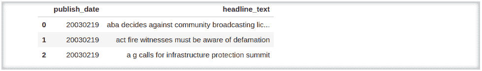

# 文本分类:来自 5 场 Kaggle 比赛的所有提示和技巧

> 原文：<https://web.archive.org/web/https://neptune.ai/blog/text-classification-tips-and-tricks-kaggle-competitions>

在本文中，我将讨论一些提高文本分类模型性能的技巧和诀窍。这些技巧是从 Kaggle 的一些顶级 NLP 竞赛的解决方案中获得的。

也就是说，我经历了:

发现了很多好主意。

没有太多的延迟，让我们开始吧。

## 处理更大的数据集

你在任何机器学习竞赛中可能面临的一个问题是数据集的大小。如果您的数据量很大，对于 Kaggle 内核和更基本的笔记本电脑来说是 3GB +,您会发现在有限的资源下很难加载和处理。这里是我发现在这种情况下有用的一些文章和内核的链接。

## 小型数据集和外部数据

但是，如果数据集很小，我们该怎么办呢？让我们来看看解决这种情况的一些技巧。

提高任何机器学习模型的性能的一种方法是使用一些包含一些影响谓词变量的变量的外部数据框架。

让我们看看一些外部数据集。

## 数据探索和获得洞察力

数据探索总是有助于更好地理解数据并从中获得洞察力。在开始开发机器学习模型之前，顶级竞争对手总是会针对数据阅读/做大量探索性的数据分析。这有助于特征工程和数据清理。

## 数据清理

数据清理是任何自然语言处理问题的重要组成部分之一。文本数据总是需要一些预处理和清理，然后才能以合适的形式表示出来。

## 文本表示

在我们将文本数据输入到神经网络或 ML 模型之前，文本输入需要以合适的格式表示。这些表示在很大程度上决定了模型的性能。

语境嵌入模型

*   来自变压器的双向编码器表示
*   [GPT](https://web.archive.org/web/20221027163737/https://github.com/openai/finetune-transformer-lm)
*   Roberta 稳健优化的 BERT
*   一个用于自我监督语言表达学习的 Lite BERT
*   伯特的一个较轻版本
*   [XLNET](https://web.archive.org/web/20221027163737/https://github.com/zihangdai/xlnet/)

## 建模

### 模型架构

选择正确的架构对于开发适当的机器学习模型非常重要，像 LSTMs、GRUs 这样的序列对序列模型在 NLP 问题中表现良好，总是值得尝试。堆叠两层 LSTM/GRU 网络是一种常见的方法。

### 损失函数

为你的神经网络模型选择一个合适的损失函数，通过允许它在表面上很好地优化，确实增强了你的模型的性能。

您可以尝试不同的损失函数，甚至编写一个与您的问题相匹配的自定义损失函数。一些流行的损失函数有

### 优化者

### 回调方法

在训练时，回调对于监控模型的性能总是有用的，并触发一些可以增强模型性能的必要操作。

## 评估和交叉验证

选择一个合适的验证策略是非常重要的，以避免模型在私有测试集中的巨大变动或不良性能。

传统的 80:20 分割在很多情况下并不适用。在大多数情况下，交叉验证比传统的单一训练验证分割更有效，以评估模型性能。

k 折叠交叉验证有不同的变体，如应相应选择的 k 折叠组。

## 运行时技巧

您可以执行一些技巧来减少运行时间，并在运行时提高模型性能。

## 模型组装

如果你在竞争环境中，没有集合，你就不会在排行榜上名列前茅。选择合适的组装/堆叠方法对于充分发挥模型的性能非常重要。

让我们来看看一些在 Kaggle 比赛中使用的流行组合技术:

## 最后的想法

在本文中，您看到了许多改进 NLP 分类模型性能的流行而有效的方法。希望你会发现它们对你的项目有用。

### 沙胡尔 ES

数据科学家，非常熟悉机器学习、NLP 和音频处理领域。他是 Kaggle 大师，也喜欢做开源。

* * *

**阅读下一篇**

## 自然语言处理的探索性数据分析:Python 工具完全指南

11 分钟阅读|作者 Shahul ES |年 7 月 14 日更新

探索性数据分析是任何机器学习工作流中最重要的部分之一，自然语言处理也不例外。但是**你应该选择哪些工具**来高效地探索和可视化文本数据呢？

在这篇文章中，我们将**讨论和实现几乎所有的主要技术**，你可以用它们来理解你的文本数据，并给你一个完成工作的 Python 工具的完整之旅。

## 开始之前:数据集和依赖项

在本文中，我们将使用来自 Kaggle 的百万新闻标题数据集。如果您想一步一步地进行分析，您可能需要安装以下库:

```py
pip install \
   pandas matplotlib numpy \
   nltk seaborn sklearn gensim pyldavis \
   wordcloud textblob spacy textstat
```

现在，我们可以看看数据。

```py
news= pd.read_csv('data/abcnews-date-text.csv',nrows=10000)
news.head(3)
```



数据集只包含两列，发布日期和新闻标题。

为了简单起见，我将探索这个数据集中的前 **10000 行**。因为标题是按*发布日期*排序的，所以实际上从 2003 年 2 月 19 日*到 2003 年 4 月 7 日*有**两个月。**

好了，我想我们已经准备好开始我们的数据探索了！

[Continue reading ->](/web/20221027163737/https://neptune.ai/blog/exploratory-data-analysis-natural-language-processing-tools)

* * *