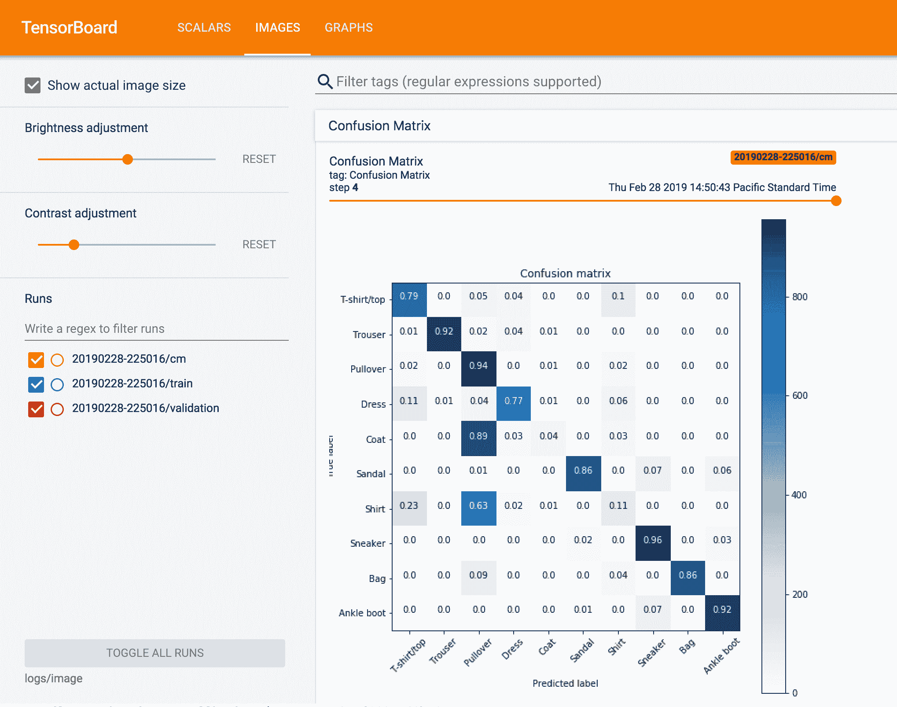
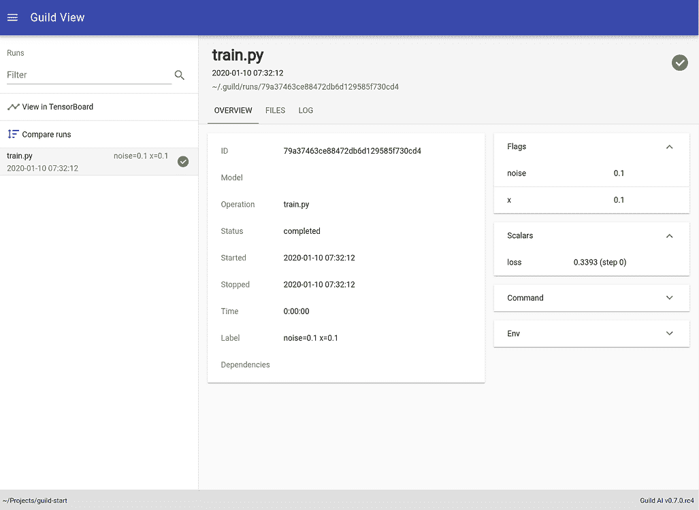
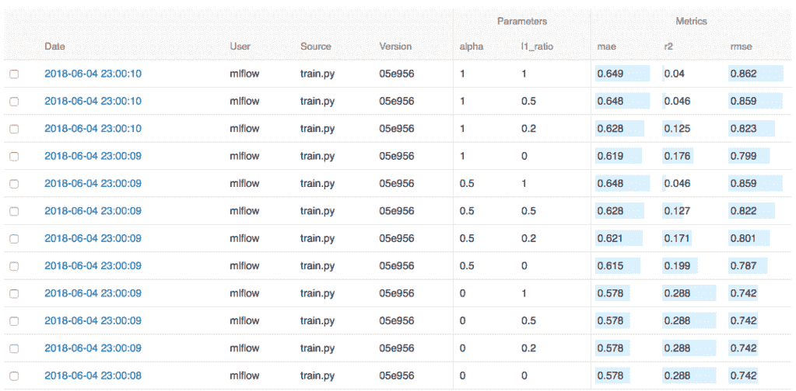
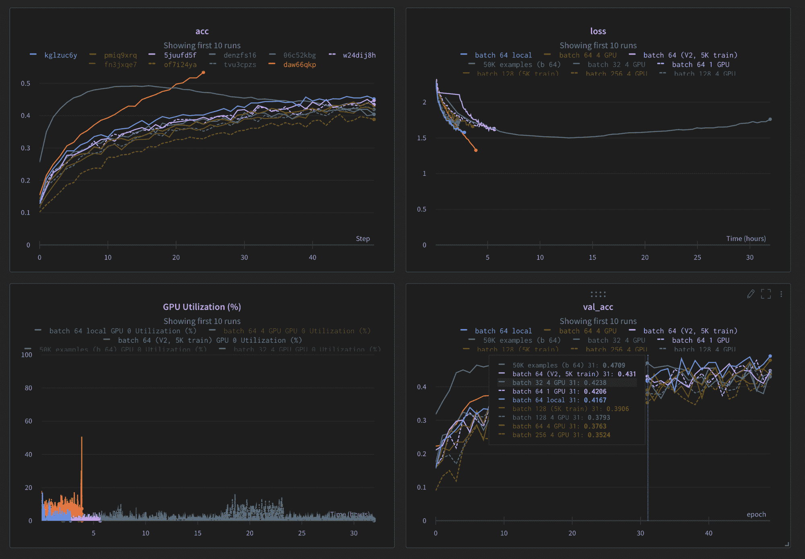

# 最好的 Comet.ml 替代品

> 原文：<https://web.archive.org/web/https://neptune.ai/blog/the-best-comet-ml-alternatives>

[Comet](https://web.archive.org/web/20230125135437/https://www.comet.ml/site/) 是从事机器学习实验的人最常用的工具之一。它是一个自托管和基于云的元机器学习平台，允许数据科学家和团队跟踪、比较、解释和优化实验和模型。

Comet 提供了一个 Python 库，允许数据科学家将他们的代码与 Comet 集成，并开始在应用程序中跟踪工作。由于它提供了云托管和自托管两种方式，你应该能够[管理你整个团队的 ML 实验](/web/20230125135437/https://neptune.ai/blog/best-ml-experiment-tracking-tools)。

Comet 正在向 ML 的更多[自动化方法靠拢，增加了](https://web.archive.org/web/20230125135437/https://www.automl.org/automl/)[预测提前停止](https://web.archive.org/web/20230125135437/https://www.comet.ml/site/predictive-early-stopping/)(该软件的免费版本不提供)并宣布了[神经架构搜索](https://web.archive.org/web/20230125135437/https://www.comet.ml/site/what-is-meta-ml/)(将在未来推出)。

彗星最显著的一些特征包括:

*   支持团队共享工作，并提供用户管理
*   集成了许多 ML 库
*   让您比较实验——代码、超参数、度量、预测、依赖性、系统度量等等
*   让您用专用于图像、音频、文本和表格数据的模块来可视化样本

而且虽然 Comet 是一个很棒的解决方案，但是没有一个工具是对所有人都完美的(至少我没听说过这样的工具)。

可能会遗漏一些对你和你的团队至关重要的点。可能是:

*   *缺少某些功能*:比如无法记录“细节图/散景图”
*   *您的个人偏好*:比如 UI 中的图表视图，或者比较表，或者其他特定于您的用例的特性；
*   *定价*:也许你更喜欢基于使用定价模式的工具，或者是开源的；
*   *可扩展性*:可能在可扩展性方面没有满足你的需求，你的团队每个月运行的实验越来越多。

无论如何，还有许多其他工具可用，为了帮助您找到合适的工具，我们列出了最佳的 Comet 替代工具。

Neptune 是 MLOps 的一个[元数据存储库](/web/20230125135437/https://neptune.ai/blog/ml-metadata-store)，主要关注[实验跟踪](/web/20230125135437/https://neptune.ai/experiment-tracking)和[模型注册](/web/20230125135437/https://neptune.ai/product/model-registry)。它是为进行大量实验的研究和生产团队而构建的。它的主要目标是让他们的生活更轻松，让他们做自己真正想做的事情，也就是 ML(而不是手动将数字插入 [excel 表](/web/20230125135437/https://neptune.ai/blog/switching-from-spreadsheets-to-neptune-ai))。

因此，数据科学家和 ML 工程师可以使用 Neptune 在一个地方记录、存储、组织、显示、比较和查询所有建模元数据。这包括元数据，如模型度量和参数、模型检查点、图像、视频、音频文件、数据版本、交互式可视化等。

稍后[在团队](https://web.archive.org/web/20230125135437/https://docs.neptune.ai/you-should-know/collaboration-in-neptune)中共享这些被跟踪的元数据也很容易。Neptune 允许您为项目创建工作区，管理用户访问，并与内部和外部的利益相关者共享仪表板的链接。

**海王星–主要特征:**

*   Neptune 允许您以任何想要的结构记录和显示模型元数据。无论是模型的嵌套参数结构，训练和验证度量的不同子文件夹，还是打包模型或生产工件的单独空间。怎么组织就看你自己了。
*   然后，您可以[创建定制的仪表板](https://web.archive.org/web/20230125135437/https://docs.neptune.ai/you-should-know/displaying-metadata#how-to-create-a-custom-dashboard)以一种首选的方式组合不同的元数据类型。
*   Neptune 的[定价](https://web.archive.org/web/20230125135437/https://neptune.ai/pricing)是基于使用的。整个团队的固定月费相对较低(不管有多少人)，但除此之外，你只需为你使用的东西付费。
*   该应用程序可以处理数千次运行，并且在您越来越多地使用它时不会变慢。它随着你的团队和项目的规模而扩展。

如果你想看海王星在行动，检查[这个现场笔记本](https://web.archive.org/web/20230125135437/https://colab.research.google.com/github/neptune-ai/examples/blob/master/how-to-guides/how-it-works/notebooks/Neptune_API_Tour.ipynb)或[这个例子项目](https://web.archive.org/web/20230125135437/https://app.neptune.ai/o/common/org/example-project-tensorflow-keras/experiments?split=tbl&dash=charts&viewId=44675986-88f9-4182-843f-49b9cfa48599)(不需要注册)，只是玩它。

### 海王星 vs 彗星

Neptune 和 Comet ML 都在相同的市场空间中运营，但是，它们的功能主张因技术和非技术产品而异。

这两种工具都是专有软件，提供托管和内部设置，有不同的定价选项可供选择。Neptune 提供了一个基于使用的定价模型，不同于其他固定的产品，在这个模型中，你可以根据你正在使用的实验和功能的数量来调整价格。另一方面，Comet 有严格的一维定价结构。

在功能上也有一些不同。例如，如果你正在寻找一个工具，可以让你跟踪你的数据集版本，那么海王星是你的选择，因为彗星缺乏这个功能。

*Example dashboard in TensorBoard | [Source](https://web.archive.org/web/20230125135437/https://www.tensorflow.org/tensorboard)*

TensorBoard 是 TensorFlow 的可视化工具包，可让您分析模型训练运行。它是开源的，为机器学习模型的可视化和调试提供了一套工具。

它允许您可视化机器学习实验的各个方面，如度量、可视化模型图、查看张量直方图等。

如果你正在寻找一个彗星的替代品来可视化你的实验并深入研究它们，这是一个很好的工具。

**tensor board—**主要特点** :**

*   您可以在一个地方记录整个团队的实验
*   跟踪不是基于 TensorFlow 或深度学习的实验
*   备份整个实验历史
*   为项目干系人快速制作报告
*   将跟踪系统与技术堆栈中的其他工具相集成
*   可用的可视化功能

### 张量板 vs 彗星

如果您正在寻找一个工具来可视化您的项目的 ML 模型元数据，那么 TensorBoard 可能是您的正确选择。它是开源的，它的可视化非常强大，但它运行在本地服务器上，所以你不能和你的团队成员分享，不像 Comet。

然而，TensorBoard 为您提供了很多可视化数据的技术选项，这是 Comet 所没有的。例如，它提供了对度量图表的平滑，并提供了一个步骤(时期)滑块来比较不同时期的结果。

*Example dashboard in Guild AI | [Source](https://web.archive.org/web/20230125135437/https://my.guild.ai/t/guild-view/167)*

Guild AI 是机器学习工程师和研究人员用来**运行、跟踪和比较实验**的开源工具。通过 Guild AI，您可以利用您的实验结果来建立更深层次的直觉，解决问题，并自动化模型架构和[超参数优化](/web/20230125135437/https://neptune.ai/blog/hyperparameter-tuning-in-python-a-complete-guide-2020)。

Guild AI 是跨平台和框架独立的——你可以使用任何库用任何语言训练和捕捉实验。公会人工智能运行你未修改的代码，所以你可以使用你想要的库。该工具不需要数据库或其他基础设施来管理实验，简单易用。

**帮会 AI-**主要特色** :**

*   实验跟踪:任何模型训练，任何编程语言
*   自动化机器学习过程
*   与任何语言和库集成
*   远程培训和备份的可能性
*   你可以复制你的结果或重现实验

### 公会 AI vs 彗星

如果你正在寻找一个不需要你改变代码的开源实验跟踪工具，那么 Guild AI 将是一个不错的选择。如上所述，您将拥有可视化、超参数调整和许多其他功能。然而，由于它是开源的，它错过了面向可伸缩性和团队工作的关键特性。

如果你是一个团队，你的首要任务是分享结果和扩展到大量的实验，那么不幸的是公会人工智能不适合它。

*Example dashboard in MLflow | [Source](https://web.archive.org/web/20230125135437/https://www.mlflow.org/docs/latest/tutorials-and-examples/tutorial.html#training-the-model)*

MLflow 是一个开源平台，有助于管理整个机器学习生命周期，包括实验、再现性、部署和中央模型注册。

MLflow 适合个人和任何规模的团队。

该工具与库无关。你可以用任何机器学习库和任何编程语言来使用它

MLflow 包括**四个主要功能**:

1.  ml flow Tracking——一个 API 和 UI，用于在运行机器学习代码时记录参数、代码版本、指标和工件，并在以后可视化和比较结果
2.  MLflow 项目——将 ML 代码打包成可重用、可复制的形式，以便与其他数据科学家共享或转移到生产中
3.  MLflow 模型——从不同的 ML 库中管理和部署模型到各种模型服务和推理平台
4.  MLflow Model Registry–一个中央模型存储库，用于协作管理 ml flow 模型的整个生命周期，包括模型版本控制、阶段转换和注释

### MLflow vs 彗星

MLflow 是 Comet 的另一个开源替代方案。它提供了与 Comet 相同的功能，并且在大数据上也能很好地扩展。如果您的团队使用 Apache Spark，那么 MLflow 将是一个很好的选择，因为它可以很好地与 Spark 一起提供大数据的模型跟踪和模型注册。

但是 Comet 附带了用户管理特性，并允许在团队内部共享项目——这是 MLflow 所缺少的。它还提供托管和内部设置，而 MLflow 仅作为开源解决方案提供，需要您在服务器上维护它。

*Example dashboard in W&B | [Source](https://web.archive.org/web/20230125135437/https://wandb.ai/site/experiment-tracking)*

WandB 专注于深度学习。用户使用 Python 库跟踪应用程序的实验，并且作为一个团队，可以看到彼此的实验。它允许他们记录实验，并可视化研究的每一部分。WandB 是一项托管服务，允许您在一个地方备份所有实验

**Wandb—**主要特点** :**

*   处理用户管理
*   出色的用户界面允许用户很好地可视化、比较和组织他们的跑步
    团队共享工作:团队共享的多种功能
*   与其他工具的集成:几个可用的开源集成

### WandB vs 彗星

WandB 是 Comet 的闭源解决方案替代方案。它提供了与 Comet 非常相似的特性，除了与不同语言和框架的集成。例如，WandB 集成了 fastai 和 Catalyst 进行模型训练，而 Comet 没有。两者的定价模式根据需求也有很大不同，你可以查看 Comet 的[这里](https://web.archive.org/web/20230125135437/https://www.comet.ml/site/pricing/)和 WandB 的[这里](https://web.archive.org/web/20230125135437/https://wandb.ai/site/pricing)。

神圣是一个开源工具，由研究机构 IDSIA(瑞士人工智能实验室)开发。Sacred 是一个 Python 库，帮助配置、组织、记录和复制实验。

该工具提供了一种使用配置的编程方式。观察者的概念允许您跟踪与实验相关的各种类型的数据。

此外，神圣有**自动播种**——当需要重现一个实验时非常有用。

**神圣——**主要特征** :**

*   最适合个人用户，因为不支持团队共享工作
*   实验跟踪:任何模型训练
*   与其他工具集成:不支持
*   额外收获:神圣的前端很少，可以挑一个最符合自己需求的。看一看 **[这个与海王星](https://web.archive.org/web/20230125135437/https://docs.neptune.ai/integrations-and-supported-tools/experiment-tracking/sacred)特别融合的**。

### 神圣 vs 彗星

神圣是另一个开源替代彗星。如果你是一个正在寻找一个简单易用的实验跟踪工具的人，那么神圣将是一个很好的选择。它是一个独立的 pip 包，前端用户界面取决于其他来源，你可以在这里查看这些来源。

神圣不支持团队协作，所以它最适合个人使用。如果你是一个致力于生产规格项目的团队，那么 Comet 将是一个比神圣更好的选择。

## 摘要

在任何机器学习项目中，找到满足您需求的正确跟踪工具总是证明卓有成效的。它帮助你比任何传统方法更快地达到预期的效果。因此，分配足够的时间和资源来选择正确的工具将会节省大量的时间和资源。

不要忘了选择一个符合你的需求和工作方式的工作，给你足够的灵活性来充分利用你的时间。

愉快地体验您的 ML 项目！