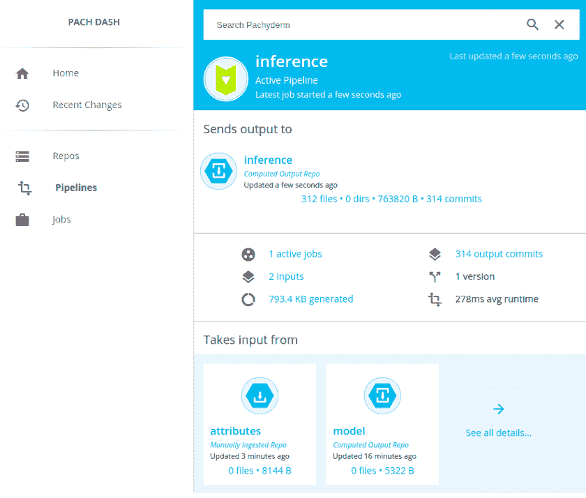
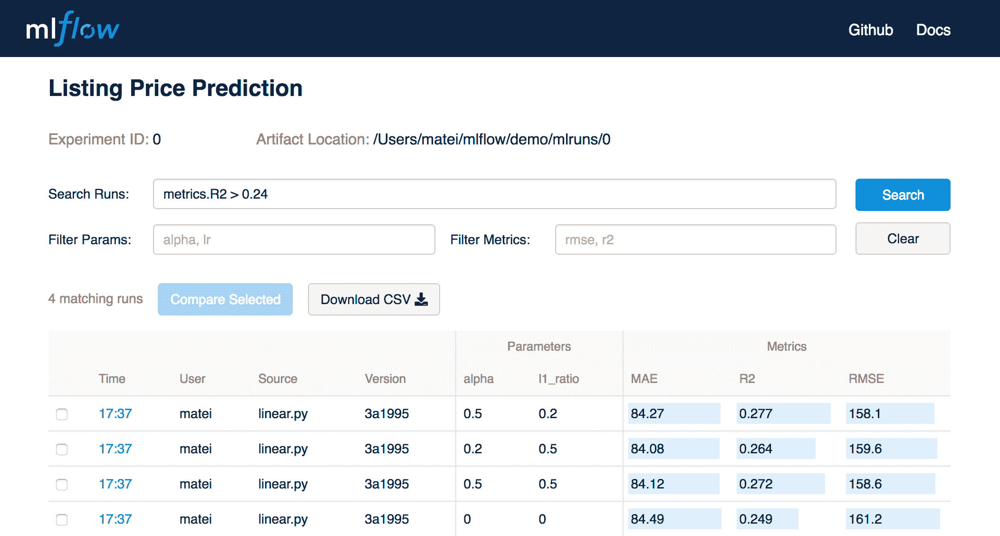

# 最佳 Kubeflow 替代品

> 原文：<https://web.archive.org/web/https://neptune.ai/blog/the-best-kubeflow-alternatives>

Kubeflow 是 Kubernetes 的 ML 工具包。它有助于维护机器学习系统——管理所有的应用程序、平台和资源考虑事项。它通过使机器学习工作流的运行编排和部署更容易来促进机器学习模型的扩展。这是一个开源项目，包含一组专门针对各种 ML 任务的兼容工具和框架。

**Kubeflow 围绕三个原则构建**:

1.  可组合性——你可以选择整个 ML 项目中你想要使用的组件，并使它们作为独立的系统工作
2.  可移植性——在多样化的基础设施上运行项目的所有部分
3.  可扩展性——您的项目可以在需要时访问更多资源，并在不需要时释放它们

Kubeflow 是一个处理整个 ML 生命周期的庞然大物。但是您可能会在其他 ML 工具中寻找一些更小的功能子集，它们可能更适合您的 ML 过程的特定步骤。

因此，如果您需要 Kubeflow 替代方案来处理诸如数据版本化、[实验跟踪](/web/20230304141740/https://neptune.ai/experiment-tracking)或模型服务之类的事情，我们会全力支持您。以下是按类别分组的最佳选择。

## 数据和管道版本控制

DVC，或数据版本控制，是一个机器学习项目的开源版本控制系统。这是一个实验工具，不管你使用什么语言，它都可以帮助你定义你的管道。

当您在 ML 模型的前一版本中发现问题时，DVC 通过利用代码、数据版本化和可再现性来帮助节省时间。您还可以训练您的模型，并通过 DVC 管道与您的队友分享。

DVC 可以处理大量数据的版本和组织，并以一种组织良好、易于访问的方式存储它们。它侧重于数据和管道版本化和管理，但也有一些(有限的)实验跟踪功能。

**DVC–摘要:**

*   可以使用不同类型的存储—不受存储限制
*   完整的代码和数据来源有助于跟踪每个 ML 模型的完整发展
*   通过始终如一地维护输入数据、配置和最初用于运行实验的代码的组合来实现可重复性
*   跟踪指标
*   一种将 ML 步骤连接到 DAG 并端到端运行整个管道的内置方式

Pachyderm 是一个将数据谱系与 Kubernetes 上的端到端管道相结合的平台。

它有三个版本，社区版(开源，可以在任何地方使用)、企业版(完整的版本控制平台)和中心版(仍是测试版，结合了前两个版本的特点)。

您需要将 Pachyderm 与您的基础架构/私有云相集成。

因为在本节中我们讨论的是**数据和管道版本**，所以我们将讨论这两者，但是 Pachyderm 的内容不止于此(查看网站了解更多信息)。

谈到数据版本化，**厚皮动物数据版本化系统有以下几个主要概念**:

*   存储库–厚皮动物存储库是最高级别的数据对象。通常，Pachyderm 中的每个数据集都有自己的存储库
*   提交–回购在特定时间点的不可变快照
*   分支–特定提交的别名或指针，在提交新数据时自动移动
*   文件–文件和目录是存储库中的实际数据。Pachyderm 支持任何类型、大小和数量的文件
*   出处——表达各种提交、分支和存储库之间的关系。它帮助您跟踪每个提交的来源

Neptune 是为运行大量实验的研究和生产团队构建的 MLOps 的元数据存储。它非常灵活，可以与许多其他框架一起工作，并且由于其稳定的用户界面，它实现了巨大的可伸缩性(达到数百万次运行)。

这是一个强大的软件，可以存储、检索和分析大量数据。Neptune 拥有高效团队协作和项目监督的所有工具。

**海王星——概要:**

*   为用户和组织管理提供不同的组织、项目和用户角色
*   快速美观的用户界面，具有多种功能来分组组织跑步，保存自定义仪表板视图并与团队共享
*   您可以使用托管应用程序来避免维护另一个工具的所有麻烦(或者将其部署在您的内部基础架构上)
*   您的团队可以跟踪在脚本(Python、R、other)、笔记本(local、Google Colab、AWS SageMaker)中执行的实验，并在任何基础设施(云、笔记本电脑、集群)上执行
*   广泛的实验跟踪和可视化功能(资源消耗、图像列表滚动)

MLflow 是一个开源平台，有助于管理整个机器学习生命周期，包括实验、再现性、部署和中央模型注册。

MLflow 适合个人和任何规模的团队。

该工具与库无关。你可以用任何机器学习库和任何编程语言来使用它

**MLflow 包含四个主要功能**:

1.  ml flow Tracking——一个 API 和 UI，用于在运行机器学习代码时记录参数、代码版本、指标和工件，并在以后可视化和比较结果
2.  MLflow 项目——将 ML 代码打包成可重用、可复制的形式，以便与其他数据科学家共享或转移到生产中
3.  MLflow 模型——从不同的 ML 库中管理和部署模型到各种模型服务和推理平台
4.  MLflow Model Registry–一个中央模型存储库，用于协作管理 ml flow 模型的整个生命周期，包括模型版本控制、阶段转换和注释

## 培训运行流程编排

亚马逊 SageMaker 是一个平台，使数据科学家能够**构建、训练和部署机器学习模型**。它拥有用于整个机器学习工作流的所有集成工具，在单个工具集中提供了用于机器学习的所有组件。

SageMaker 是一个适合安排、协调和管理机器学习模型的工具。它有一个基于 web 的可视化界面来执行所有 ML 开发步骤(笔记本、实验管理、自动模型创建、调试和模型漂移检测)

**亚马逊 SageMaker–摘要:**

*   Autopilot 自动检查原始数据，应用功能处理器，挑选最佳算法集，训练和调整多个模型，跟踪它们的性能，然后根据性能对模型进行排序——它有助于部署性能最佳的模型
*   SageMaker Ground Truth 帮助您快速构建和管理高度准确的训练数据集
*   SageMaker Experiments 通过自动捕获输入参数、配置和结果，并将其存储为“实验”，来帮助组织和跟踪机器学习模型的迭代
*   SageMaker Debugger 在训练期间自动捕获实时指标(如训练和验证、混淆、矩阵和学习梯度)，以帮助提高模型准确性。当检测到常见的培训问题时，调试器还可以生成警告和补救建议
*   SageMaker Model Monitor 允许开发人员检测和修复概念漂移。它会自动检测已部署模型中的概念漂移，并给出详细的警报，帮助识别问题的根源

Polyaxon 是一个平台，用于**复制和管理机器学习项目的整个生命周期，以及深度学习应用**。

该工具可以部署到任何数据中心、云提供商，并且可以由 Polyaxon 托管和管理。它支持所有主要的深度学习框架，如 Torch、Tensorflow、MXNet。

说到流程编排，Polyaxon 允许您通过 CLI、dashboard、SDK 或 REST API 调度作业和实验，从而最大限度地利用集群。

**poly axon–概要**:

*   支持整个生命周期，包括运行流程编排，但可以做的远不止这些
*   有一个开源版本，您可以立即使用，但为企业提供了选项
*   它[与 Kubeflow](https://web.archive.org/web/20230304141740/https://polyaxon.com/integrations/kubeflow/) 集成，因此您可以一起使用两者。

## 超参数调谐

Optuna 是一个自动超参数优化框架，可用于机器学习/深度学习和其他领域。它有一套最先进的算法，你可以选择(或连接)，它是非常容易的分布训练到多台机器，并让你很好地可视化你的结果。

它集成了流行的机器学习库，如 PyTorch、TensorFlow、Keras、FastAI、scikit-learn、LightGBM 和 XGBoost。

**Optuna–摘要:**

*   支持在一台机器(多进程)和一个集群(多节点)上进行分布式培训
*   支持各种修剪策略，以更快地收敛(并使用更少的计算)
*   拥有一套强大的可视化工具，如平行坐标、等高线图或切片图

SigOpt 旨在加速和放大机器学习、深度学习和模拟模型的影响。它有助于通过自动化过程节省时间，使其成为超参数调整的合适工具。

您可以将 SigOpt 无缝集成到任何模型、框架或平台中，而无需担心您的数据、模型和基础架构——一切都是安全的。

该工具还允许您监控、跟踪和分析您的优化实验，并将其可视化。

**SigOpt–摘要:**

*   多指标优化便于同时探索两个不同的指标
*   条件参数允许定义和调整架构参数，并自动选择模型
*   高并行性使您能够充分利用大规模计算机基础设施，并在多达 100 名工作人员中运行优化实验

## 模型服务

Cortex 是一个开源的替代方案，可以使用 SageMaker 提供模型服务，或者在 AWS 服务(如 Elastic Kubernetes Service (EKS)、Lambda 或 Fargate)和开源项目(如 Docker、Kubernetes、TensorFlow Serving 和 TorchServe)的基础上构建自己的模型部署平台。

这是一个多框架工具，允许您部署所有类型的模型。

**皮层–总结:**

*   自动扩展 API 以处理生产工作负载
*   对任何 AWS 实例类型运行推理
*   在单个 API 中部署多个模型，并在不停机的情况下更新已部署的 API
*   监控 API 性能和预测结果

Seldon 是一个开源平台，允许你在 Kubernetes 上部署机器学习模型。它在云中和内部都可用。

**谢顿–摘要**:

*   利用 canary deployment 等各种选项简化模型部署
*   出现问题时，使用警报系统监控生产中的模型
*   使用模型解释器来理解为什么会做出某些预测。谢顿还开源了一个[模型解释器包](https://web.archive.org/web/20230304141740/https://www.seldon.io/tech/products/alibi/)

## 把它包起来

我们希望您能找到 Kubeflow 的最佳替代方案，帮助您高效工作并提供最佳结果。毕竟一个好的工具可以改善你的工作流程。

快乐实验！