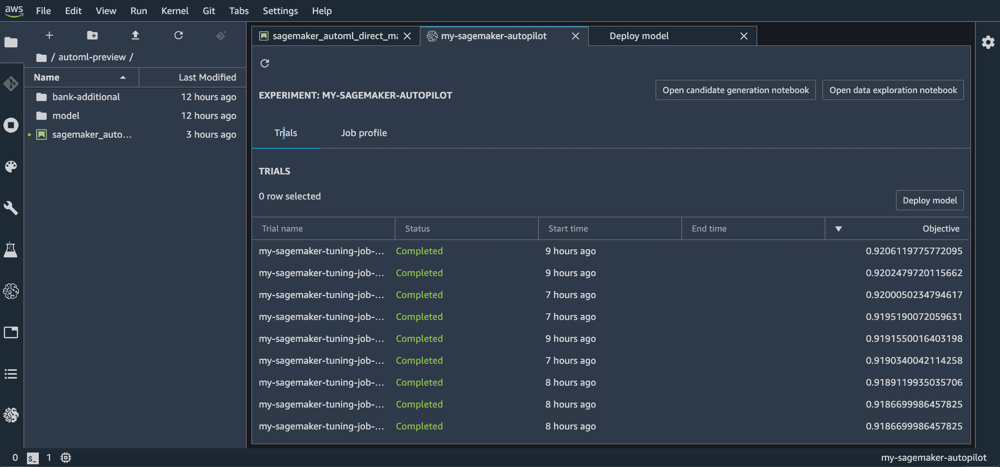
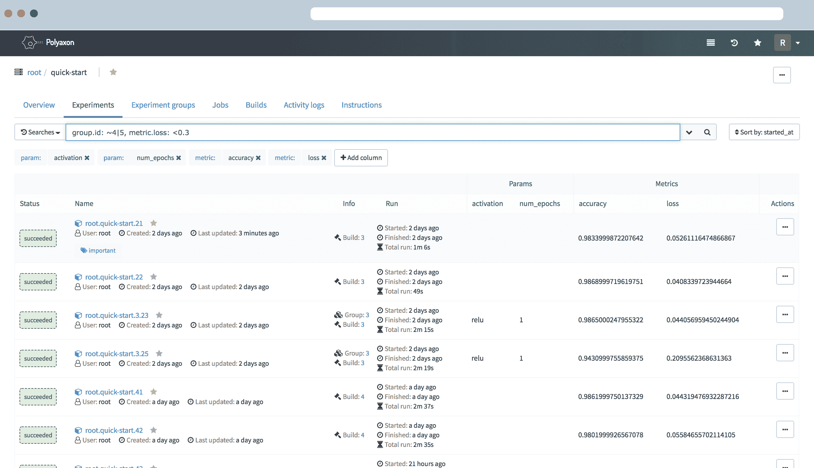

# 最佳厚皮动物替代品

> 原文：<https://web.archive.org/web/https://neptune.ai/blog/the-best-pachyderm-alternatives>

Pachyderm 是一个数据科学平台，有助于控制端到端的机器学习生命周期。它有三个不同的版本，社区版(开源，可以在任何地方部署)、企业版(完整的版本控制平台)和中心版(托管版，仍处于测试阶段)。

简而言之，你可以对厚皮动物做些什么:

*   Pachyderm 允许您不断更新 repo 主分支中的数据，同时在单独的分支中试验特定的数据提交
*   它支持任何类型、大小和数量的文件，包括二进制和纯文本文件
*   您可以将提交的历史存储在一个集中的位置，这样当您尝试合并您的。git 历史与回购的主副本
*   集中式和事务性提交分支没有在源代码版本控制系统中广泛使用
*   出处使团队能够在彼此工作的基础上构建、共享、转换和更新数据集，同时自动维护完整的审计跟踪，以便所有结果都是可重复的

它无疑是一个 ML 实验的发电站，但如果你正在寻找一个更专注于机器学习项目的特定方面(生命周期的一部分)的不同解决方案，或者需要一个更轻量级的工具，Pachyderm 可能不是你的完美工具。

这就是我们需要帮助的地方——这里有所有最好的厚皮动物替代品。看一看，选择你最喜欢的替代品！

## 数据和管道版本控制

DVC，或数据版本控制，是一个机器学习项目的开源版本控制系统。这是一个实验工具，不管你使用什么语言，它都可以帮助你定义你的管道。

当您在 ML 模型的前一版本中发现问题时，DVC 通过利用代码、数据版本化和可再现性来帮助节省时间。您还可以训练您的模型，并通过 DVC 管道与您的队友分享。

DVC 可以处理大量数据的版本和组织，并以一种组织良好、易于访问的方式存储它们。它侧重于数据和管道版本化和管理，但也有一些(有限的)实验跟踪功能。

**DVC–摘要:**

*   可以使用不同类型的存储—不受存储限制
*   完整的代码和数据来源有助于跟踪每个 ML 模型的完整发展
*   通过始终如一地维护输入数据、配置和最初用于运行实验的代码的组合来实现可重复性
*   跟踪指标
*   一种将 ML 步骤连接到 DAG 并端到端运行整个管道的内置方式

Kubeflow 是 Kubernetes 的 ML 工具包。它有助于维护机器学习系统——管理所有的应用程序、平台和资源考虑事项。它通过使机器学习工作流的运行编排和部署更容易来促进机器学习模型的扩展。

这是一个开源项目，包含一组专门针对各种 ML 任务的兼容工具和框架。

**kube flow–摘要:**

*   用于管理和跟踪实验、作业和运行的用户界面(UI)
*   使用 SDK 与系统交互的笔记本电脑
*   重用组件和管道来快速创建端到端解决方案，而不必每次都重新构建
*   Kubeflow Pipelines 可作为 Kubeflow 的核心组件或独立安装使用

Neptune 是为运行大量实验的研究和生产团队构建的 MLOps 的元数据存储。它非常灵活，可以与许多其他框架一起工作，并且由于其稳定的用户界面，它实现了巨大的可伸缩性(达到数百万次运行)。

这是一个强大的软件，可以存储、检索和分析大量数据。Neptune 拥有高效团队协作和项目监督的所有工具。

**海王星——概要:**

*   为用户和组织管理提供不同的组织、项目和用户角色
*   快速美观的用户界面，具有多种功能来分组组织跑步，保存自定义仪表板视图并与团队共享
*   您可以使用托管应用程序来避免维护另一个工具的所有麻烦(或者将其部署在您的内部基础架构上)
*   您的团队可以跟踪在脚本(Python、R、other)、笔记本(local、Google Colab、AWS SageMaker)中执行的实验，并在任何基础设施(云、笔记本电脑、集群)上执行
*   广泛的实验跟踪和可视化功能(资源消耗、图像列表滚动)

MLflow 是一个开源平台，有助于管理整个机器学习生命周期，包括实验、再现性、部署和中央模型注册。

MLflow 适合个人和任何规模的团队。

该工具与库无关。你可以用任何机器学习库和任何编程语言来使用它

MLflow 包含四个主要功能:

*   ml flow Tracking——一个 API 和 UI，用于在运行机器学习代码时记录参数、代码版本、指标和工件，并在以后可视化和比较结果
*   MLflow 项目——将 ML 代码打包成可重用、可复制的形式，以便与其他数据科学家共享或转移到生产中
*   MLflow 模型——从不同的 ML 库中管理和部署模型到各种模型服务和推理平台
*   MLflow Model Registry–一个中央模型存储库，用于协作管理 ml flow 模型的整个生命周期，包括模型版本控制、阶段转换和注释

## 培训运行流程编排

亚马逊 SageMaker 是一个平台，使数据科学家能够**构建、训练和部署机器学习模型**。它拥有用于整个机器学习工作流的所有集成工具，在单个工具集中提供了用于机器学习的所有组件。

SageMaker 是一个适合组织、训练、部署和管理机器学习模型的工具。它有一个基于 web 的可视化界面来执行所有 ML 开发步骤，包括笔记本、实验管理、自动模型创建、调试和模型漂移检测

**亚马逊 SageMaker–摘要:**

*   Autopilot 自动检查原始数据，应用功能处理器，挑选最佳算法集，训练和调整多个模型，跟踪它们的性能，然后根据性能对模型进行排序——它有助于部署性能最佳的模型
*   SageMaker Ground Truth 帮助您快速构建和管理高度准确的训练数据集
*   SageMaker Experiments 通过自动捕获输入参数、配置和结果，并将其存储为“实验”，来帮助组织和跟踪机器学习模型的迭代
*   SageMaker Debugger 在训练期间自动捕获实时指标(如训练和验证、混淆、矩阵和学习梯度)，以帮助提高模型准确性。当检测到常见的培训问题时，调试器还可以生成警告和补救建议
*   SageMaker Model Monitor 允许开发人员检测和排除概念漂移故障。它会自动检测已部署模型中的概念漂移，并给出详细的警报，帮助识别问题的根源

Polyaxon 是一个平台，用于**复制和管理机器学习项目的整个生命周期，以及深度学习应用**。

该工具可以部署到任何数据中心、云提供商，并且可以由 Polyaxon 托管和管理。它支持所有主要的深度学习框架，如 Torch、Tensorflow、MXNet。

说到流程编排，Polyaxon 允许您通过 CLI、dashboard、SDK 或 REST API 调度作业和实验，从而最大限度地利用集群。

**poly axon–摘要:**

*   支持整个生命周期，包括运行流程编排，但可以做的远不止这些
*   有一个开源版本，您可以立即使用，但也为企业提供了选项
*   文档非常完整的平台，包括技术参考文档、入门指南、学习资源、指南、教程、变更日志等等
*   使用实验洞察仪表板监控、跟踪和分析每个优化实验

## 包装它

为厚皮动物找到合适的替代品可能并不容易。每个工具都很棒，都提供有用的功能。但是一旦你知道你到底在找什么，你就会找到最合适的。尝试、混合和实验。毕竟这就是机器学习的意义所在。

快乐实验！